# [Plant UML](https://plantuml.com/ko/)

PlantUML 은 다이어그램을 빠르게 작성하기 위한 오픈 소스 프로젝트입니다.

## Use Case 다이어그램

Let's have few examples :
Note that you can disable the shadowing using the `skinparam shadowing false` command.

### 유즈케이스

유즈케이스는 (두개의 괄호는 원으로 보이기 때문에) 괄호로 싸서 표현합니다.
아니면 `usecase` 키워를 이용하여 정의할 수 있습니다. 그리고 `as` 키워드를 이용하여 별칭을 정의 할 수 있습니다. 별칭은 관계를 정의할 때 사용됩니다.

```java
@startuml

(First usecase)
(Another usecase) as (UC2)
usecase UC3
usecase (Last\nusecase) as UC4

@enduml
```
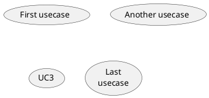

### Actors

The name defining an actor is enclosed between colons.
You can also use the `actor` keyword to define an actor. An alias can be assigned using the `as` keyword and can be used later instead of the actor's name, e. g. when defining relations.

You can see from the following examples, that the actor definitions are optional.

```java
@startuml

:First Actor:
:Another\nactor: as Man2
actor Woman3
actor :Last actor: as Person1

@enduml
```
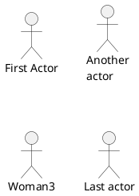

### Change Actor style
You can change the actor style from stick man (by default) to:

* an awesome man with the `skinparam actorStyle awesome` command;
* a hollow man with the `skinparam actorStyle hollow` command.

#### Stick man (by default)
```java
@startuml
:User: --> (Use)
"Main Admin" as Admin
"Use the application" as (Use)
Admin --> (Admin the application)
@enduml
```
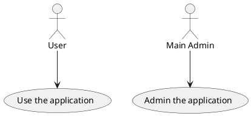

#### Awesome man
```java
@startuml
skinparam actorStyle awesome
:User: --> (Use)
"Main Admin" as Admin
"Use the application" as (Use)
Admin --> (Admin the application)
@enduml
```
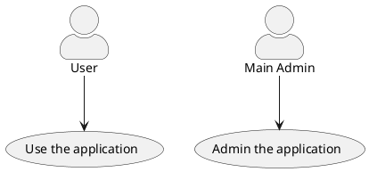

#### Hollow man
```java
@startuml
skinparam actorStyle Hollow 
:User: --> (Use)
"Main Admin" as Admin
"Use the application" as (Use)
Admin --> (Admin the application)
@enduml
```
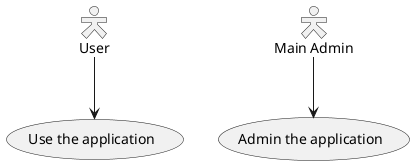

### 유즈케이스 종류

If you want to have description on several lines, you can use quotes.
You can also use the following separators: `--..==__`. And you can put titles within the separators.

```java
@startuml

usecase UC1 as "You can use
several lines to define your usecase.
You can also use separators.
--
Several separators are possible.
==
And you can add titles:
..Conclusion..
This allows large description."

@enduml
```
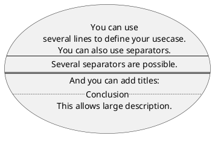

### Use package
You can use packages to group actors or use cases.

```java
@startuml
left to right direction
actor Guest as g
package Professional {
  actor Chef as c
  actor "Food Critic" as fc
}
package Restaurant {
  usecase "Eat Food" as UC1
  usecase "Pay for Food" as UC2
  usecase "Drink" as UC3
  usecase "Review" as UC4
}
fc --> UC4
g --> UC1
g --> UC2
g --> UC3
@enduml
```
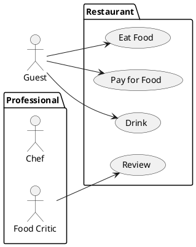

You can use `rectangle` to change the display of the package.
```java
@startuml
left to right direction
actor "Food Critic" as fc
rectangle Restaurant {
  usecase "Eat Food" as UC1
  usecase "Pay for Food" as UC2
  usecase "Drink" as UC3
}
fc --> UC1
fc --> UC2
fc --> UC3
@enduml
```
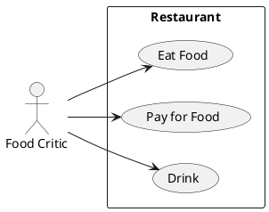

### 기본 예제
To link actors and use cases, the arrow `-->` is used.
The more dashes `-` in the arrow, the longer the arrow. You can add a label on the arrow, by adding a `:` character in the arrow definition.
In this example, you see that User has not been defined before, and is used as an actor.

```java
@startuml

User -> (Start)
User --> (Use the application) : A small label

:Main Admin: ---> (Use the application) : This is\nyet another\nlabel

@enduml
```
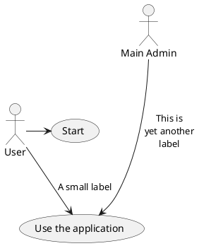

### Extension
If one actor/use case extends another one, you can use the symbol `<|--`.

```java
@startuml
:Main Admin: as Admin
(Use the application) as (Use)

User <|-- Admin
(Start) <|-- (Use)

@enduml
```
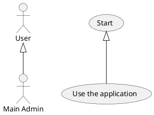

### Using notes
You can use the `note left of` , `note right of` , `note top of` , `note bottom of` keywords to define notes related to a single object.
A note can be also define alone with the note keywords, then linked to other objects using the `..` symbol.

```java
@startuml
:Main Admin: as Admin
(Use the application) as (Use)

User -> (Start)
User --> (Use)

Admin ---> (Use)

note right of Admin : This is an example.

note right of (Use)
  A note can also
  be on several lines
end note

note "This note is connected\nto several objects." as N2
(Start) .. N2
N2 .. (Use)
@enduml
```
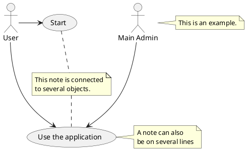

### Stereotypes
You can add stereotypes while defining actors and use cases using `<<` and `>>`.

```java
@startuml
User << Human >>
:Main Database: as MySql << Application >>
(Start) << One Shot >>
(Use the application) as (Use) << Main >>

User -> (Start)
User --> (Use)

MySql --> (Use)

@enduml
```
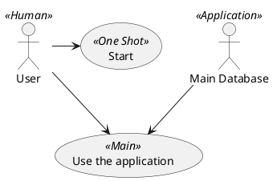

### 화살표 방향 변경
기본적으로, 클래스간의 링크는 대쉬2개 `--` 로 표시하고 수직방향이다. 다음 처럼 대쉬1개 (혹은 점)을 넣어서 수평방향 링크를 사용할 수 있다:

```java
@startuml
:user: --> (Use case 1)
:user: -> (Use case 2)
@enduml
```
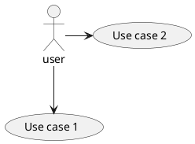

You can also change directions by reversing the link:
```java
@startuml
(Use case 1) <.. :user:
(Use case 2) <- :user:
@enduml
```
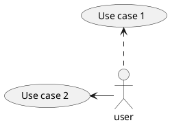

It is also possible to change arrow direction by adding `left`, `right`, `up` or `down` keywords inside the arrow:
```java
@startuml
:user: -left-> (dummyLeft)
:user: -right-> (dummyRight)
:user: -up-> (dummyUp)
:user: -down-> (dummyDown)
@enduml
```
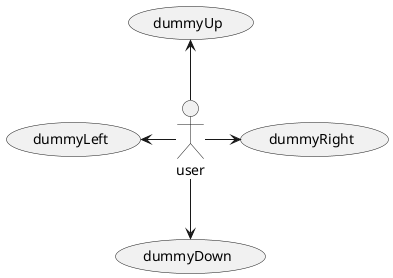

You can shorten the arrow by using only the first character of the direction (for example, `-d-` instead of `-down-`) or the two first characters (`-do-`).
> Please note that you should not abuse this functionality : Graphviz gives usually good results without tweaking.

### Splitting diagrams
The `newpage` keywords to split your diagram into several pages or images.

```java
@startuml
:actor1: --> (Usecase1)
newpage
:actor2: --> (Usecase2)
@enduml
```
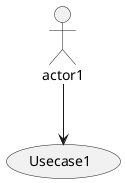

### Left to right direction
The general default behavior when building diagram is `top to bottom`.

```java
@startuml
'default
top to bottom direction
user1 --> (Usecase 1)
user2 --> (Usecase 2)

@enduml
```
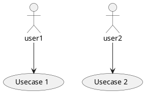

You may change to "left to right" using the `left to right direction` command. The result is often better with this direction.
```java
@startuml

left to right direction
user1 --> (Usecase 1)
user2 --> (Usecase 2)

@enduml
```
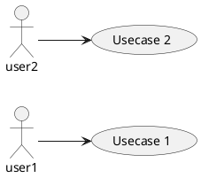

### Skinparam
You can use the [skinparam](https://plantuml.com/ko/skinparam) command to change colors and fonts 
for the drawing.

You can use this command :

* In the diagram definition, like any other commands,
* In an [included file](https://plantuml.com/ko/preprocessing),
* In a configuration file, provided in the [command line](https://plantuml.com/ko/command-line) or the [ANT task](https://plantuml.com/ko/ant-task).

You can define specific color and fonts for stereotyped actors and usecases.
```java
@startuml
skinparam handwritten true

skinparam usecase {
BackgroundColor DarkSeaGreen
BorderColor DarkSlateGray

BackgroundColor<< Main >> YellowGreen
BorderColor<< Main >> YellowGreen

ArrowColor Olive
ActorBorderColor black
ActorFontName Courier

ActorBackgroundColor<< Human >> Gold
}

User << Human >>
:Main Database: as MySql << Application >>
(Start) << One Shot >>
(Use the application) as (Use) << Main >>

User -> (Start)
User --> (Use)

MySql --> (Use)

@enduml
```
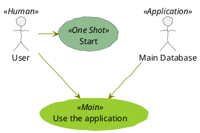

### Complete example
```java
@startuml
left to right direction
skinparam packageStyle rectangle
actor customer
actor clerk
rectangle checkout {
  customer -- (checkout)
  (checkout) .> (payment) : include
  (help) .> (checkout) : extends
  (checkout) -- clerk
}
@enduml
```
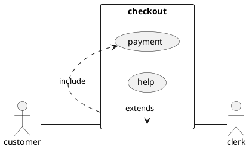

### Business Use Case
You can add `/` to make Business Use Case.

#### Business Usecase
```java
@startuml

(First usecase)/
(Another usecase)/ as (UC2)
usecase/ UC3
usecase/ (Last\nusecase) as UC4

@enduml
```
```plantuml
@startuml

(First usecase)/
(Another usecase)/ as (UC2)
usecase/ UC3
usecase/ (Last\nusecase) as UC4

@enduml
```

#### Business Actor
```java
@startuml

:First Actor:/
:Another\nactor:/ as Man2
actor/ Woman3
actor/ :Last actor: as Person1

@enduml
```
```plantuml
@startuml

:First Actor:/
:Another\nactor:/ as Man2
actor/ Woman3
actor/ :Last actor: as Person1

@enduml
```

### Change arrow color and style (inline style)
You can change the [color](https://plantuml.com/ko/color) or style of individual arrows using the inline following notation:

* #color;line.[bold|dashed|dotted];text:color

```java
@startuml
actor foo
foo --> (bar) : normal
foo --> (bar1) #line:red;line.bold;text:red  : red bold
foo --> (bar2) #green;line.dashed;text:green : green dashed 
foo --> (bar3) #blue;line.dotted;text:blue   : blue dotted
@enduml
```
```plantuml
@startuml
actor foo
foo --> (bar) : normal
foo --> (bar1) #line:red;line.bold;text:red  : red bold
foo --> (bar2) #green;line.dashed;text:green : green dashed 
foo --> (bar3) #blue;line.dotted;text:blue   : blue dotted
@enduml
```

### Change element color and style (inline style)
You can change the [color](https://plantuml.com/ko/color) or style of individual element using the following notation:

* #[color|back:color];line:color;line.[bold|dashed|dotted];text:color

```java
@startuml
actor a
actor b #pink;line:red;line.bold;text:red
usecase c #palegreen;line:green;line.dashed;text:green
usecase d #aliceblue;line:blue;line.dotted;text:blue
@enduml
```
```plantuml
@startuml
actor a
actor b #pink;line:red;line.bold;text:red
usecase c #palegreen;line:green;line.dashed;text:green
usecase d #aliceblue;line:blue;line.dotted;text:blue
@enduml
```
