# [Plant UML](https://plantuml.com/ko/)

PlantUML 은 다이어그램을 빠르게 작성하기 위한 오픈 소스 프로젝트입니다.

## Class 다이어그램

### Declaring element

```java
@startuml
abstract        abstract
abstract class  "abstract class"
annotation      annotation
circle          circle
()              circle_short_form
class           class
diamond         diamond
<>              diamond_short_form
entity          entity
enum            enum
interface       interface
@enduml
```
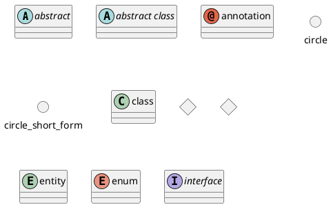

### 클래스 관계
클래스 관계는 다음과 같은 부호를 사용합니다.

| Type | Symbol | 
|---|---|
| Extension | `<|--` |
| Composition | `*--` |
| Aggregation | `o--` |

#### Example 1
```java
@startuml
Class01 <|-- Class02
Class03 *-- Class04
Class05 o-- Class06
Class07 .. Class08
Class09 -- Class10
@enduml
```
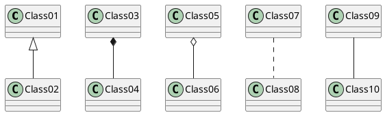

#### Example 2
```java
@startuml
Class11 <|.. Class12
Class13 --> Class14
Class15 ..> Class16
Class17 ..|> Class18
Class19 <--* Class20
@enduml
```
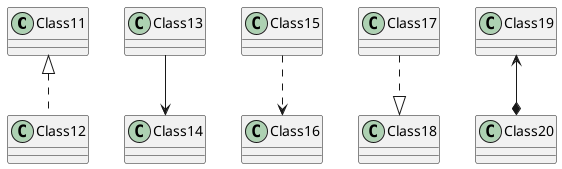

#### Example 3
```java
@startuml
Class21 #-- Class22
Class23 x-- Class24
Class25 }-- Class26
Class27 +-- Class28
Class29 ^-- Class30
@enduml
```
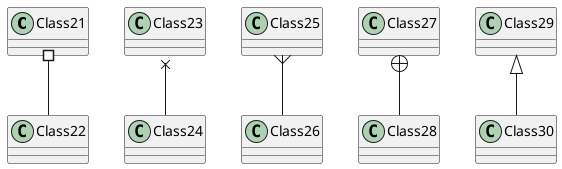

### 관계를 나타내기 위한 레이블
관계에서 레이블을 추가하기 위해서는 뒤에 `:` 를 붙이고 레이블을 작성하면 됩니다.
관계차수를 나타내기 위해서는 `""`를 이용하여 관계의 양쪽 끝에 작성하면 됩니다.

```java
@startuml
Class01 "1" *-- "many" Class02 : contains
Class03 o-- Class04 : aggregation
Class05 --> "1" Class06
@enduml
```
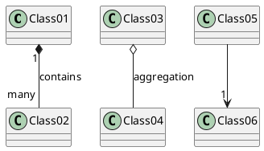

`<` 또는 `>`을 사용하여 객체가 다른 객체에 대한 흐름 관계를 더 자세히 설명할 수 있습니다.
```java
@startuml
class Car
Driver - Car : drives >
Car *- Wheel : have 4 >
Car -- Person : < owns
@enduml
```
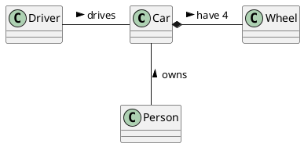

### Adding methods
To declare fields and methods, you can use the symbol `:` followed by the field's or method's name.
The system checks for parenthesis to choose between methods and fields.

```java
@startuml
Object <|-- ArrayList

Object : equals()
ArrayList : Object[] elementData
ArrayList : size()

@enduml
```
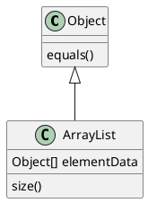

It is also possible to group between brackets `{}` all fields and methods.
Note that the syntax is highly flexible about type/name order.

```java
@startuml
class Dummy {
  String data
  void methods()
}

class Flight {
   flightNumber : Integer
   departureTime : Date
}
@enduml
```
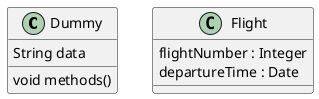

You can use `{field}` and `{method}` modifiers to override default behaviour of the parser about fields and methods.

```java
@startuml
class Dummy {
  {field} A field (despite parentheses)
  {method} Some method
}
@enduml
```
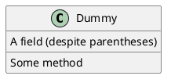

### 메소드, 필드 가시화(Visibility) 정의
메소드나 필드들을 정의할 때, 특수문자를 사용하여 관련된 아이템을 가시화할 수 있습니다. 명령어는 다음과 같습니다:

* `-` : private
* `#` : protected
* `~` : package private
* `+` : public

```java
@startuml

class Dummy {
 -field1
 #field2
 ~method1()
 +method2()
}
@enduml
```
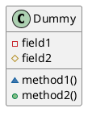

`skinparam classAttributeIconSize 0`를 사용하여, 아이콘 표시를 끌 수 있습니다. 명령어는 다음과 같습니다:
```java
@startuml
skinparam classAttributeIconSize 0
class Dummy {
 -field1
 #field2
 ~method1()
 +method2()
}
@enduml
```
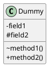

### Abstract and Static
You can define static or abstract methods or fields using the `{static}` or `{abstract}` modifier.
These modifiers can be used at the start or at the end of the line. You can also use `{classifier}` instead of `{static}`.

```java
@startuml
class Dummy {
  {static} String id
  {abstract} void methods()
}
@enduml
```
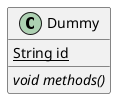

### Advanced class body
By default, methods and fields are automatically regrouped by PlantUML. You can use separators to define your own way of ordering fields and methods. The following separators are possible : `--` `..` `==` `__`.
You can also use titles within the separators:

```java
@startuml
class Foo1 {
  You can use
  several lines
  ..
  as you want
  and group
  ==
  things together.
  __
  You can have as many groups
  as you want
  --
  End of class
}

class User {
  .. Simple Getter ..
  + getName()
  + getAddress()
  .. Some setter ..
  + setName()
  __ private data __
  int age
  -- encrypted --
  String password
}

@enduml
```
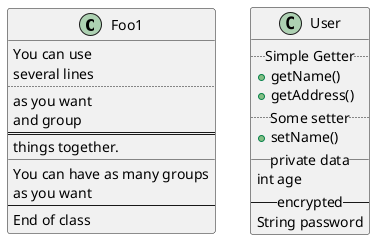

### Notes and stereotypes
Stereotypes are defined with the `class` keyword, `<<` and `>>`.
You can also define notes using `note left of` , `note right of` , `note top of` , `note bottom of` keywords.
You can also define a note on the last defined class using `note left`, `note right`, `note top`, `note bottom`.
A note can be also define alone with the `note` keywords, then linked to other objects using the `..` symbol.

```java
@startuml
class Object << general >>
Object <|--- ArrayList

note top of Object : In java, every class\nextends this one.

note "This is a floating note" as N1
note "This note is connected\nto several objects." as N2
Object .. N2
N2 .. ArrayList

class Foo
note left: On last defined class

@enduml
```
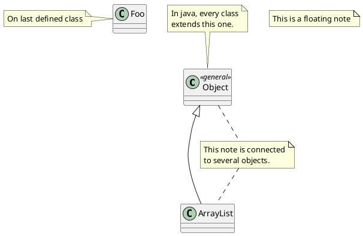

### More on notes
It is also possible to use few HTML tags (See [Creole expression](https://plantuml.com/ko/creole)) like :
* `<b>`
* `<u>`
* `<i>`
* `<s>`, `<del>`, `<strike>`
* `<font color="#AAAAAA">` or `<font color="colorName">`
* `<color:#AAAAAA>` or `<color:colorName>`
* `<size:nn>` to change font size
* `` or ``: the file must be accessible by the filesystem

You can also have a note on several lines.
You can also define a note on the last defined class using `note left`, `note right`, `note top`, `note bottom`.

```java
@startuml

class Foo
note left: On last defined class

note top of Object
  In java, <size:18>every</size> <u>class</u>
  <b>extends</b>
  <i>this</i> one.
end note

note as N1
  This note is <u>also</u>
  <b><color:royalBlue>on several</color>
  <s>words</s> lines
  And this is hosted by 
end note

@enduml
```
```plantuml
@startuml

class Foo
note left: On last defined class

note top of Object
  In java, <size:18>every</size> <u>class</u>
  <b>extends</b>
  <i>this</i> one.
end note

note as N1
  This note is <u>also</u>
  <b><color:royalBlue>on several</color>
  <s>words</s> lines
  And this is hosted by 
end note

@enduml
```

### Note on field (field, attribute, member) or method
It is possible to add a note on field (field, attribut, member) or on method.

> ⚠ Constraint
>
> * This cannot be used with `top` or `bottom`(only `left` and `right` are implemented)
> * This cannot be used with namespaceSeparator `::`

#### Note on field or method
```java
@startuml
class A {
{static} int counter
+void {abstract} start(int timeout)
}
note right of A::counter
  This member is annotated
end note
note right of A::start
  This method is now explained in a UML note
end note
@enduml
```
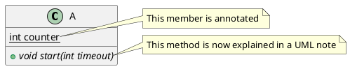

#### Note on method with the same name
```java
@startuml
class A {
{static} int counter
+void {abstract} start(int timeoutms)
+void {abstract} start(Duration timeout)
}
note left of A::counter
  This member is annotated
end note
note right of A::"start(int timeoutms)"
  This method with int
end note
note right of A::"start(Duration timeout)"
  This method with Duration
end note
@enduml
```
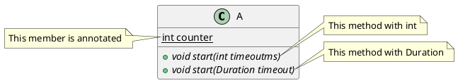

### Note on links
It is possible to add a note on a link, just after the link definition, using `note on link`.
You can also use `note left on link`, `note right on link`, `note top on link`, `note bottom on link` if you want to change the relative position of the note with the label.

```java
@startuml

class Dummy
Dummy --> Foo : A link
note on link #red: note that is red

Dummy --> Foo2 : Another link
note right on link #blue
this is my note on right link
and in blue
end note

@enduml
```
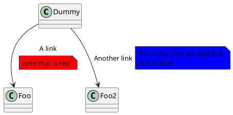

### Abstract class and interface
You can declare a class as abstract using `abstract` or `abstract class` keywords.
The class will be printed in *italic*.
You can use the `interface`, `annotation` and `enum` keywords too.

```java
@startuml

abstract class AbstractList
abstract AbstractCollection
interface List
interface Collection

List <|-- AbstractList
Collection <|-- AbstractCollection

Collection <|- List
AbstractCollection <|- AbstractList
AbstractList <|-- ArrayList

class ArrayList {
  Object[] elementData
  size()
}

enum TimeUnit {
  DAYS
  HOURS
  MINUTES
}

annotation SuppressWarnings

@enduml
```
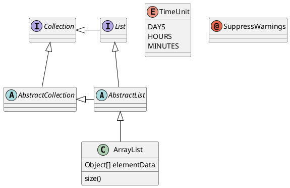

### Using non-letters
If you want to use [non-letters](https://plantuml.com/ko/unicode) in the class (or enum...) display, you can either :
* Use the `as` keyword in the class definition
* Put quotes `""` around the class name

```java
@startuml
class "This is my class" as class1
class class2 as "It works this way too"

class2 *-- "foo/dummy" : use
@enduml
```
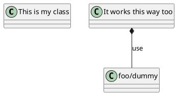

### Hide attributes, methods...
You can parameterize the display of classes using the `hide`/`show` command.

The basic command is: `hide empty members`. This command will hide attributes or methods if they are empty.
Instead of `empty members`, you can use:
* `empty fields` or `empty attributes` for empty fields,
* `empty methods` for empty methods,
* `fields` or `attributes` which will hide fields, even if they are described,
* `methods` which will hide methods, even if they are described,
* `members` which will hide fields and methods, even if they are described,
* `circle` for the circled character in front of class name,
* `stereotype` for the stereotype.

You can also provide, just after the `hide` or `show` keyword:
* `class` for all classes,
* `interface` for all interfaces,
* `enum` for all enums,
* `<<foo1>>` for classes which are stereotyped with *foo1*,
* an existing class name.

You can use several `show`/`hide` commands to define rules and exceptions.

```java
@startuml

class Dummy1 {
  +myMethods()
}

class Dummy2 {
  +hiddenMethod()
}

class Dummy3 <<Serializable>> {
String name
}

hide members
hide <<Serializable>> circle
show Dummy1 methods
show <<Serializable>> fields

@enduml
```
```plantuml
@startuml

class Dummy1 {
  +myMethods()
}

class Dummy2 {
  +hiddenMethod()
}

class Dummy3 <<Serializable>> {
String name
}

hide members
hide <<Serializable>> circle
show Dummy1 methods
show <<Serializable>> fields

@enduml
```

### Hide classes
You can also use the `show`/`hide` commands to hide classes.
This may be useful if you define a large [!included file](https://plantuml.com/ko/preprocessing), and if you want to hide some classes after [file inclusion](https://plantuml.com/ko/preprocessing).

```java
@startuml

class Foo1
class Foo2

Foo2 *-- Foo1

hide Foo2

@enduml
```
```plantuml
@startuml

class Foo1
class Foo2

Foo2 *-- Foo1

hide Foo2

@enduml
```

### Remove classes
You can also use the `remove` commands to remove classes.
This may be useful if you define a large [!included file](https://plantuml.com/ko/preprocessing), and if you want to remove some classes after [file inclusion](https://plantuml.com/ko/preprocessing).

```java
@startuml

class Foo1
class Foo2

Foo2 *-- Foo1

remove Foo2

@enduml
```
```plantuml
@startuml

class Foo1
class Foo2

Foo2 *-- Foo1

remove Foo2

@enduml
```

### Hide or Remove unlinked class
By default, all classes are displayed:

```java
@startuml
class C1
class C2
class C3
C1 -- C2
@enduml
```
```plantuml
@startuml
class C1
class C2
class C3
C1 -- C2
@enduml
```

But you can:
* `hide @unlinked `classes:

```java
@startuml
class C1
class C2
class C3
C1 -- C2

hide @unlinked
@enduml
```
```plantuml
@startuml
class C1
class C2
class C3
C1 -- C2

hide @unlinked
@enduml
```

* or `remove @unlinked` classes:

```java
@startuml
class C1
class C2
class C3
C1 -- C2

hide @unlinked
@enduml
```
```plantuml
@startuml
class C1
class C2
class C3
C1 -- C2

hide @unlinked
@enduml
```

* or `remove @unlinked` classes:

```java
@startuml
class C1
class C2
class C3
C1 -- C2

remove @unlinked
@enduml
```
```plantuml
@startuml
class C1
class C2
class C3
C1 -- C2

remove @unlinked
@enduml
```

### Use generics
You can also use bracket `<` and `>` to define generics usage in a class.

```java
@startuml

class Foo<? extends Element> {
  int size()
}
Foo *- Element

@enduml
```
```plantuml
@startuml

class Foo<? extends Element> {
  int size()
}
Foo *- Element

@enduml
```
It is possible to disable this drawing using `skinparam genericDisplay old` command.

### Specific Spot
Usually, a spotted character (C, I, E or A) is used for classes, interface, enum and abstract classes.

But you can define your own spot for a class when you define the stereotype, adding a single character and a color, like in this example:

```java
@startuml

class System << (S,#FF7700) Singleton >>
class Date << (D,orchid) >>
@enduml
```
```plantuml
@startuml

class System << (S,#FF7700) Singleton >>
class Date << (D,orchid) >>
@enduml
```

### Packages
You can define a `package` using the package keyword, and optionally declare a background color for your package (Using a html color code or name).

Note that package definitions can be nested.

```java
@startuml

package "Classic Collections" #DDDDDD {
  Object <|-- ArrayList
}

package net.sourceforge.plantuml {
  Object <|-- Demo1
  Demo1 *- Demo2
}

@enduml
```
```plantuml
@startuml

package "Classic Collections" #DDDDDD {
  Object <|-- ArrayList
}

package net.sourceforge.plantuml {
  Object <|-- Demo1
  Demo1 *- Demo2
}

@enduml
```

### Packages style
There are different styles available for packages.

You can specify them either by setting a default style with the command : 
`skinparam packageStyle`, or by using a stereotype on the package:

```java
@startuml
scale 750 width
package foo1 <<Node>> {
  class Class1
}

package foo2 <<Rectangle>> {
  class Class2
}

package foo3 <<Folder>> {
  class Class3
}

package foo4 <<Frame>> {
  class Class4
}

package foo5 <<Cloud>> {
  class Class5
}

package foo6 <<Database>> {
  class Class6
}

@enduml
```
```plantuml
@startuml
scale 750 width
package foo1 <<Node>> {
  class Class1
}

package foo2 <<Rectangle>> {
  class Class2
}

package foo3 <<Folder>> {
  class Class3
}

package foo4 <<Frame>> {
  class Class4
}

package foo5 <<Cloud>> {
  class Class5
}

package foo6 <<Database>> {
  class Class6
}

@enduml
```

You can also define links between packages, like in the following example:
```java
@startuml

skinparam packageStyle rectangle

package foo1.foo2 {
}

package foo1.foo2.foo3 {
  class Object
}

foo1.foo2 +-- foo1.foo2.foo3

@enduml
```
```plantuml
@startuml

skinparam packageStyle rectangle

package foo1.foo2 {
}

package foo1.foo2.foo3 {
  class Object
}

foo1.foo2 +-- foo1.foo2.foo3

@enduml
```

### Namespaces
In packages, the name of a class is the unique identifier of this class. It means that you cannot have two classes with the very same name in different packages.

In that case, you should use [namespaces](http://en.wikipedia.org/wiki/Namespace_%28computer_science%29) instead of packages.

You can refer to classes from other namespaces by fully qualify them. Classes from the default namespace are qualified with a starting dot.

Note that you don't have to explicitly create namespace : a fully qualified class is automatically put in the right namespace.

```java
@startuml

class BaseClass

namespace net.dummy #DDDDDD {
    .BaseClass <|-- Person
    Meeting o-- Person

    .BaseClass <|- Meeting
}

namespace net.foo {
  net.dummy.Person  <|- Person
  .BaseClass <|-- Person

  net.dummy.Meeting o-- Person
}

BaseClass <|-- net.unused.Person

@enduml
```
```plantuml
@startuml

class BaseClass

namespace net.dummy #DDDDDD {
    .BaseClass <|-- Person
    Meeting o-- Person

    .BaseClass <|- Meeting
}

namespace net.foo {
  net.dummy.Person  <|- Person
  .BaseClass <|-- Person

  net.dummy.Meeting o-- Person
}

BaseClass <|-- net.unused.Person

@enduml
```

### Automatic namespace creation
You can define another separator (other than the dot) using the command : 
`set namespaceSeparator ???`.

```java
@startuml

set namespaceSeparator ::
class X1::X2::foo {
  some info
}

@enduml
```
```plantuml
@startuml

set namespaceSeparator ::
class X1::X2::foo {
  some info
}

@enduml
```

You can disable automatic package creation using the command `set namespaceSeparator none`.

```java
@startuml

set namespaceSeparator none
class X1.X2.foo {
  some info
}

@enduml
```
```plantuml
@startuml

set namespaceSeparator none
class X1.X2.foo {
  some info
}

@enduml
```

### Lollipop interface
You can also define lollipops interface on classes, using the following syntax:
* `bar ()- foo`
* `bar ()-- foo`
* `foo -() bar`

```java
@startuml
class foo
bar ()- foo
@enduml
```
```plantuml
@startuml
class foo
bar ()- foo
@enduml
```

### Changing arrows orientation
By default, links between classes have two dashes `--` and are vertically oriented. It is possible to use horizontal link by putting a single dash (or dot) like this:

```java
@startuml
Room o- Student
Room *-- Chair
@enduml
```
```plantuml
@startuml
Room o- Student
Room *-- Chair
@enduml
```

You can also change directions by reversing the link:

```java
@startuml
Student -o Room
Chair --* Room
@enduml
```
```plantuml
@startuml
Student -o Room
Chair --* Room
@enduml
```

It is also possible to change arrow direction by adding `left`, `right`, `up` or `down` keywords inside the arrow:

```java
@startuml
foo -left-> dummyLeft
foo -right-> dummyRight
foo -up-> dummyUp
foo -down-> dummyDown
@enduml
```
```plantuml
@startuml
foo -left-> dummyLeft
foo -right-> dummyRight
foo -up-> dummyUp
foo -down-> dummyDown
@enduml
```

You can shorten the arrow by using only the first character of the direction (for example, `-d-` instead of `-down-`) or the two first characters (`-do-`).

Please note that you should not abuse this functionality : *Graphviz* gives usually good results without tweaking.

And with the [left to right direction](https://plantuml.com/ko/use-case-diagram#d551e48d272b2b07) parameter:

```java
@startuml
left to right direction
foo -left-> dummyLeft
foo -right-> dummyRight
foo -up-> dummyUp
foo -down-> dummyDown
@enduml
```
```plantuml
@startuml
left to right direction
foo -left-> dummyLeft
foo -right-> dummyRight
foo -up-> dummyUp
foo -down-> dummyDown
@enduml
```

### Association classes
You can define `association class` after that a relation has been defined between two classes, like in this example:

```java
@startuml
class Student {
  Name
}
Student "0..*" - "1..*" Course
(Student, Course) .. Enrollment

class Enrollment {
  drop()
  cancel()
}
@enduml
```
```plantuml
@startuml
class Student {
  Name
}
Student "0..*" - "1..*" Course
(Student, Course) .. Enrollment

class Enrollment {
  drop()
  cancel()
}
@enduml
```

You can define it in another direction:

```java
@startuml
class Student {
  Name
}
Student "0..*" -- "1..*" Course
(Student, Course) . Enrollment

class Enrollment {
  drop()
  cancel()
}
@enduml
```
```plantuml
@startuml
class Student {
  Name
}
Student "0..*" -- "1..*" Course
(Student, Course) . Enrollment

class Enrollment {
  drop()
  cancel()
}
@enduml
```

### Association on same class
```java
@startuml
class Station {
    +name: string
}

class StationCrossing {
    +cost: TimeInterval
}

<> diamond

StationCrossing . diamond
diamond - "from 0..*" Station
diamond - "to 0..* " Station
@enduml
```
```plantuml
@startuml
class Station {
    +name: string
}

class StationCrossing {
    +cost: TimeInterval
}

<> diamond

StationCrossing . diamond
diamond - "from 0..*" Station
diamond - "to 0..* " Station
@enduml
```

### Skinparam
You can use the [skinparam](https://plantuml.com/ko/skinparam) command to change colors and fonts for the drawing.

You can use this command :
* In the diagram definition, like any other commands,
* In an [included file](https://plantuml.com/ko/preprocessing),
* In a configuration file, provided in the [command line](https://plantuml.com/ko/command-line) or the [ANT task](https://plantuml.com/ko/ant-task).

```java
@startuml

skinparam class {
BackgroundColor PaleGreen
ArrowColor SeaGreen
BorderColor SpringGreen
}
skinparam stereotypeCBackgroundColor YellowGreen

Class01 "1" *-- "many" Class02 : contains

Class03 o-- Class04 : aggregation

@enduml
```
```plantuml
@startuml

skinparam class {
BackgroundColor PaleGreen
ArrowColor SeaGreen
BorderColor SpringGreen
}
skinparam stereotypeCBackgroundColor YellowGreen

Class01 "1" *-- "many" Class02 : contains

Class03 o-- Class04 : aggregation

@enduml
```

### Skinned Stereotypes
You can define specific color and fonts for stereotyped classes.

```java
@startuml

skinparam class {
BackgroundColor PaleGreen
ArrowColor SeaGreen
BorderColor SpringGreen
BackgroundColor<<Foo>> Wheat
BorderColor<<Foo>> Tomato
}
skinparam stereotypeCBackgroundColor YellowGreen
skinparam stereotypeCBackgroundColor<< Foo >> DimGray

Class01 <<Foo>>
Class03 <<Foo>>
Class01 "1" *-- "many" Class02 : contains

Class03 o-- Class04 : aggregation

@enduml
```
```plantuml
@startuml

skinparam class {
BackgroundColor PaleGreen
ArrowColor SeaGreen
BorderColor SpringGreen
BackgroundColor<<Foo>> Wheat
BorderColor<<Foo>> Tomato
}
skinparam stereotypeCBackgroundColor YellowGreen
skinparam stereotypeCBackgroundColor<< Foo >> DimGray

Class01 <<Foo>>
Class03 <<Foo>>
Class01 "1" *-- "many" Class02 : contains

Class03 o-- Class04 : aggregation

@enduml
```

### Color gradient

You can declare individual colors for classes, notes etc using the `# notation`.
You can use standard color names or RGB codes in various notations, see [Colors](https://plantuml.com/ko/color).

You can also use color gradient for background colors, with the following syntax: two colors names separated either by:
* `|`
* `/`
* `\` 
* `-`
depending on the direction of the gradient.
For example:

```java
@startuml

skinparam backgroundcolor AntiqueWhite/Gold
skinparam classBackgroundColor Wheat|CornflowerBlue

class Foo #red-green
note left of Foo #blue\9932CC
  this is my
  note on this class
end note

package example #GreenYellow/LightGoldenRodYellow {
  class Dummy
}

@enduml
```
```plantuml
@startuml

skinparam backgroundcolor AntiqueWhite/Gold
skinparam classBackgroundColor Wheat|CornflowerBlue

class Foo #red-green
note left of Foo #blue\9932CC
  this is my
  note on this class
end note

package example #GreenYellow/LightGoldenRodYellow {
  class Dummy
}

@enduml
```

### Help on layout
Sometimes, the default layout is not perfect...

You can use `together` keyword to group some classes together : the layout engine will try to group them (as if they were in the same package).

You can also use `hidden` links to force the layout.

```java
@startuml

class Bar1
class Bar2
together {
  class Together1
  class Together2
  class Together3
}
Together1 - Together2
Together2 - Together3
Together2 -[hidden]--> Bar1
Bar1 -[hidden]> Bar2


@enduml
```
```plantuml
@startuml

class Bar1
class Bar2
together {
  class Together1
  class Together2
  class Together3
}
Together1 - Together2
Together2 - Together3
Together2 -[hidden]--> Bar1
Bar1 -[hidden]> Bar2


@enduml
```

### 대용량 파일 분할하기
Sometimes, you will get some very large image files.

You can use the `page (hpages)x(vpages)` command to split the generated image into several files :
`hpages` is a number that indicated the number of horizontal pages, and `vpages` is a number that indicated the number of vertical pages.

You can also use some specific skinparam settings to put borders on splitted pages (see example).

```java
@startuml
' Split into 4 pages
page 2x2
skinparam pageMargin 10
skinparam pageExternalColor gray
skinparam pageBorderColor black

class BaseClass

namespace net.dummy #DDDDDD {
    .BaseClass <|-- Person
    Meeting o-- Person

    .BaseClass <|- Meeting

}

namespace net.foo {
  net.dummy.Person  <|- Person
  .BaseClass <|-- Person

  net.dummy.Meeting o-- Person
}

BaseClass <|-- net.unused.Person
@enduml
```
```plantuml
@startuml
' Split into 4 pages
page 2x2
skinparam pageMargin 10
skinparam pageExternalColor gray
skinparam pageBorderColor black

class BaseClass

namespace net.dummy #DDDDDD {
    .BaseClass <|-- Person
    Meeting o-- Person

    .BaseClass <|- Meeting

}

namespace net.foo {
  net.dummy.Person  <|- Person
  .BaseClass <|-- Person

  net.dummy.Meeting o-- Person
}

BaseClass <|-- net.unused.Person
@enduml
```

### Extends and implements
It is also possible to use `extends` and `implements` keywords.

```java
@startuml
class ArrayList implements List
class ArrayList extends AbstractList
@enduml
```
```plantuml
@startuml
class ArrayList implements List
class ArrayList extends AbstractList
@enduml
```

### Bracketed relations (linking or arrow) style

#### Line style
It's also possible to have explicitly `bold`, `dashed`, `dotted`, `hidden` or `plain` relation, links or arrows:
* without label

```java
@startuml
title Bracketed line style without label
class foo
class bar
bar1 : [bold]  
bar2 : [dashed]
bar3 : [dotted]
bar4 : [hidden]
bar5 : [plain] 

foo --> bar
foo -[bold]-> bar1
foo -[dashed]-> bar2
foo -[dotted]-> bar3
foo -[hidden]-> bar4
foo -[plain]-> bar5
@enduml
```
```plantuml
@startuml
title Bracketed line style without label
class foo
class bar
bar1 : [bold]  
bar2 : [dashed]
bar3 : [dotted]
bar4 : [hidden]
bar5 : [plain] 

foo --> bar
foo -[bold]-> bar1
foo -[dashed]-> bar2
foo -[dotted]-> bar3
foo -[hidden]-> bar4
foo -[plain]-> bar5
@enduml
```

* with label

```java
@startuml
title Bracketed line style with label
class foo
class bar
bar1 : [bold]  
bar2 : [dashed]
bar3 : [dotted]
bar4 : [hidden]
bar5 : [plain] 

foo --> bar          : ∅
foo -[bold]-> bar1   : [bold]
foo -[dashed]-> bar2 : [dashed]
foo -[dotted]-> bar3 : [dotted]
foo -[hidden]-> bar4 : [hidden]
foo -[plain]-> bar5  : [plain]

@enduml
```
```plantuml
@startuml
title Bracketed line style with label
class foo
class bar
bar1 : [bold]  
bar2 : [dashed]
bar3 : [dotted]
bar4 : [hidden]
bar5 : [plain] 

foo --> bar          : ∅
foo -[bold]-> bar1   : [bold]
foo -[dashed]-> bar2 : [dashed]
foo -[dotted]-> bar3 : [dotted]
foo -[hidden]-> bar4 : [hidden]
foo -[plain]-> bar5  : [plain]

@enduml
```

#### Line color
```java
@startuml
title Bracketed line color
class foo
class bar
bar1 : [#red]
bar2 : [#green]
bar3 : [#blue]

foo --> bar
foo -[#red]-> bar1     : [#red]
foo -[#green]-> bar2   : [#green]
foo -[#blue]-> bar3    : [#blue]
'foo -[#blue;#yellow;#green]-> bar4
@enduml
```
```plantuml
@startuml
title Bracketed line color
class foo
class bar
bar1 : [#red]
bar2 : [#green]
bar3 : [#blue]

foo --> bar
foo -[#red]-> bar1     : [#red]
foo -[#green]-> bar2   : [#green]
foo -[#blue]-> bar3    : [#blue]
'foo -[#blue;#yellow;#green]-> bar4
@enduml
```

#### Line thickness
```java
@startuml
title Bracketed line thickness
class foo
class bar
bar1 : [thickness=1]
bar2 : [thickness=2]
bar3 : [thickness=4]
bar4 : [thickness=8]
bar5 : [thickness=16]

foo --> bar                 : ∅
foo -[thickness=1]-> bar1   : [1]
foo -[thickness=2]-> bar2   : [2]
foo -[thickness=4]-> bar3   : [4]
foo -[thickness=8]-> bar4   : [8]
foo -[thickness=16]-> bar5  : [16]

@enduml
```
```plantuml
@startuml
title Bracketed line thickness
class foo
class bar
bar1 : [thickness=1]
bar2 : [thickness=2]
bar3 : [thickness=4]
bar4 : [thickness=8]
bar5 : [thickness=16]

foo --> bar                 : ∅
foo -[thickness=1]-> bar1   : [1]
foo -[thickness=2]-> bar2   : [2]
foo -[thickness=4]-> bar3   : [4]
foo -[thickness=8]-> bar4   : [8]
foo -[thickness=16]-> bar5  : [16]

@enduml
```

#### Mix
```java
@startuml
title Bracketed line style mix
class foo
class bar
bar1 : [#red,thickness=1]
bar2 : [#red,dashed,thickness=2]
bar3 : [#green,dashed,thickness=4]
bar4 : [#blue,dotted,thickness=8]
bar5 : [#blue,plain,thickness=16]

foo --> bar                             : ∅
foo -[#red,thickness=1]-> bar1          : [#red,1]
foo -[#red,dashed,thickness=2]-> bar2   : [#red,dashed,2]
foo -[#green,dashed,thickness=4]-> bar3 : [#green,dashed,4]
foo -[#blue,dotted,thickness=8]-> bar4  : [blue,dotted,8]
foo -[#blue,plain,thickness=16]-> bar5  : [blue,plain,16]
@enduml
```
```plantuml
@startuml
title Bracketed line style mix
class foo
class bar
bar1 : [#red,thickness=1]
bar2 : [#red,dashed,thickness=2]
bar3 : [#green,dashed,thickness=4]
bar4 : [#blue,dotted,thickness=8]
bar5 : [#blue,plain,thickness=16]

foo --> bar                             : ∅
foo -[#red,thickness=1]-> bar1          : [#red,1]
foo -[#red,dashed,thickness=2]-> bar2   : [#red,dashed,2]
foo -[#green,dashed,thickness=4]-> bar3 : [#green,dashed,4]
foo -[#blue,dotted,thickness=8]-> bar4  : [blue,dotted,8]
foo -[#blue,plain,thickness=16]-> bar5  : [blue,plain,16]
@enduml
```

### Change relation (linking or arrow) color and style (inline style)
You can change the [color](https://plantuml.com/ko/color) or style of individual relation or arrows using the inline following notation:
* `#color;line.[bold|dashed|dotted];text:color`

```java
@startuml
class foo
foo --> bar : normal
foo --> bar1 #line:red;line.bold;text:red  : red bold
foo --> bar2 #green;line.dashed;text:green : green dashed
foo --> bar3 #blue;line.dotted;text:blue   : blue dotted
@enduml
```
```plantuml
@startuml
class foo
foo --> bar : normal
foo --> bar1 #line:red;line.bold;text:red  : red bold
foo --> bar2 #green;line.dashed;text:green : green dashed
foo --> bar3 #blue;line.dotted;text:blue   : blue dotted
@enduml
```

### Change class color and style (inline style)
You can change the [color](https://plantuml.com/ko/color) or style of individual class using the two following notations:
* `#color ##[style]color`

With background color first (`#color`), then line style and line color (`##[style]color` )

```java
@startuml
abstract   abstract
annotation annotation #pink ##[bold]red
class      class      #palegreen ##[dashed]green
interface  interface  #aliceblue ##[dotted]blue
@enduml
```
```plantuml
@startuml
abstract   abstract
annotation annotation #pink ##[bold]red
class      class      #palegreen ##[dashed]green
interface  interface  #aliceblue ##[dotted]blue
@enduml
```

* `#[color|back:color];header:color;line:color;line.[bold|dashed|dotted];text:color`

```java
@startuml
abstract   abstract
annotation annotation #pink;line:red;line.bold;text:red
class      class      #palegreen;line:green;line.dashed;text:green
interface  interface  #aliceblue;line:blue;line.dotted;text:blue
@enduml
```
```plantuml
@startuml
abstract   abstract
annotation annotation #pink;line:red;line.bold;text:red
class      class      #palegreen;line:green;line.dashed;text:green
interface  interface  #aliceblue;line:blue;line.dotted;text:blue
@enduml
```

First original example:

```java
@startuml
class bar #line:green;back:lightblue
class bar2 #lightblue;line:green

class Foo1 #back:red;line:00FFFF
class FooDashed #line.dashed:blue
class FooDotted #line.dotted:blue
class FooBold #line.bold
class Demo1 #back:lightgreen|yellow;header:blue/red
@enduml
```
```plantuml
@startuml
class bar #line:green;back:lightblue
class bar2 #lightblue;line:green

class Foo1 #back:red;line:00FFFF
class FooDashed #line.dashed:blue
class FooDotted #line.dotted:blue
class FooBold #line.bold
class Demo1 #back:lightgreen|yellow;header:blue/red
@enduml
```

### Arrows from/to class members

#### Example 1
```java
@startuml
class Foo {
+ field1
+ field2
}

class Bar {
+ field3
+ field4
}

Foo::field1 --> Bar::field3 : foo
Foo::field2 --> Bar::field4 : bar
@enduml
```
```plantuml
@startuml
class Foo {
+ field1
+ field2
}

class Bar {
+ field3
+ field4
}

Foo::field1 --> Bar::field3 : foo
Foo::field2 --> Bar::field4 : bar
@enduml
```

#### Example 2
```java
@startuml
left to right direction

class User {
  id : INTEGER
  ..
  other_id : INTEGER
}

class Email {
  id : INTEGER
  ..
  user_id : INTEGER
  address : INTEGER
}

User::id *-- Email::user_id
@enduml
```
```plantuml
@startuml
left to right direction

class User {
  id : INTEGER
  ..
  other_id : INTEGER
}

class Email {
  id : INTEGER
  ..
  user_id : INTEGER
  address : INTEGER
}

User::id *-- Email::user_id
@enduml
```

### Grouping inheritance arrow heads
You can merge all arrow heads using the `skinparam groupInheritance`, with a threshold as parameter.

#### GroupInheritance 1 (no grouping)
```java
@startuml
skinparam groupInheritance 1

A1 <|-- B1

A2 <|-- B2
A2 <|-- C2

A3 <|-- B3
A3 <|-- C3
A3 <|-- D3

A4 <|-- B4
A4 <|-- C4
A4 <|-- D4
A4 <|-- E4
@enduml
```
```plantuml
@startuml
skinparam groupInheritance 1

A1 <|-- B1

A2 <|-- B2
A2 <|-- C2

A3 <|-- B3
A3 <|-- C3
A3 <|-- D3

A4 <|-- B4
A4 <|-- C4
A4 <|-- D4
A4 <|-- E4
@enduml
```

#### GroupInheritance 2 (grouping from 2)
```java
@startuml
skinparam groupInheritance 2

A1 <|-- B1

A2 <|-- B2
A2 <|-- C2

A3 <|-- B3
A3 <|-- C3
A3 <|-- D3

A4 <|-- B4
A4 <|-- C4
A4 <|-- D4
A4 <|-- E4
@enduml
```
```plantuml
@startuml
skinparam groupInheritance 2

A1 <|-- B1

A2 <|-- B2
A2 <|-- C2

A3 <|-- B3
A3 <|-- C3
A3 <|-- D3

A4 <|-- B4
A4 <|-- C4
A4 <|-- D4
A4 <|-- E4
@enduml
```

#### GroupInheritance 3 (grouping only from 3)
```java
@startuml
skinparam groupInheritance 3

A1 <|-- B1

A2 <|-- B2
A2 <|-- C2

A3 <|-- B3
A3 <|-- C3
A3 <|-- D3

A4 <|-- B4
A4 <|-- C4
A4 <|-- D4
A4 <|-- E4
@enduml
```
```plantuml
@startuml
skinparam groupInheritance 3

A1 <|-- B1

A2 <|-- B2
A2 <|-- C2

A3 <|-- B3
A3 <|-- C3
A3 <|-- D3

A4 <|-- B4
A4 <|-- C4
A4 <|-- D4
A4 <|-- E4
@enduml
```

#### GroupInheritance 4 (grouping only from 4)
```java
@startuml
skinparam groupInheritance 4

A1 <|-- B1

A2 <|-- B2
A2 <|-- C2

A3 <|-- B3
A3 <|-- C3
A3 <|-- D3

A4 <|-- B4
A4 <|-- C4
A4 <|-- D4
A4 <|-- E4
@enduml
```
```plantuml
@startuml
skinparam groupInheritance 4

A1 <|-- B1

A2 <|-- B2
A2 <|-- C2

A3 <|-- B3
A3 <|-- C3
A3 <|-- D3

A4 <|-- B4
A4 <|-- C4
A4 <|-- D4
A4 <|-- E4
@enduml
```
