# [Plant UML](https://plantuml.com/ko/)

PlantUML 은 다이어그램을 빠르게 작성하기 위한 오픈 소스 프로젝트입니다.

## Object 다이어그램

### Definition of objects
You define instances of objects using the `object` keyword.

```java
@startuml
object firstObject
object "My Second Object" as o2
@enduml
```
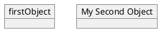

### Relations between objects
Relations between objects are defined using the following symbols :
* `<|--` : Extension
* `*--` : Composition
* `o--` : Aggregation

It is possible to replace `--` by `..` to have a dotted line.
Knowing those rules, it is possible to draw the following drawings.
It is possible a add a label on the relation, using `:` followed by the text of the label.
For cardinality, you can use double-quotes `""` on each side of the relation.

```java
@startuml
object Object01
object Object02
object Object03
object Object04
object Object05
object Object06
object Object07
object Object08

Object01 <|-- Object02
Object03 *-- Object04
Object05 o-- "4" Object06
Object07 .. Object08 : some labels
@enduml
```
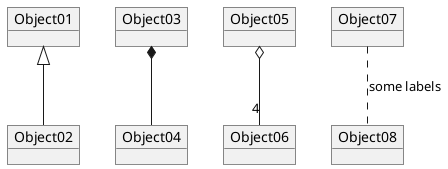

### Associations objects
```java
@startuml
object o1
object o2
diamond dia
object o3

o1  --> dia
o2  --> dia
dia --> o3
@enduml
```
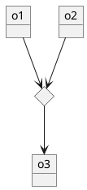

### Adding fields
To declare fields, you can use the symbol `:` followed by the field's name.

```java
@startuml

object user

user : name = "Dummy"
user : id = 123

@enduml
```
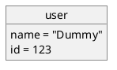

It is also possible to group all fields between brackets `{}`.

```java
@startuml

object user {
  name = "Dummy"
  id = 123
}
@enduml
```


### Common features with class diagrams

* [Hide attributes, methods...](https://plantuml.com/ko/class-diagram#Hide)
* [Defines notes](https://plantuml.com/ko/class-diagram#Notes)
* [Use packages](https://plantuml.com/ko/class-diagram#Using)
* [Skin the output](https://plantuml.com/ko/class-diagram#Skinparam)

### Map table or associative array
You can define a map table or [associative array](https://en.wikipedia.org/wiki/Associative_array), with `map` keyword and `=>` separator.

#### Example 1
```java
@startuml
map CapitalCity {
 UK => London
 USA => Washington
 Germany => Berlin
}
@enduml
```
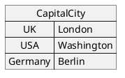

#### Example 2
```java
@startuml
map "Map **Contry => CapitalCity**" as CC {
 UK => London
 USA => Washington
 Germany => Berlin
}
@enduml
```
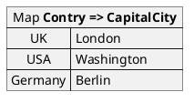

#### Example 3
```java
@startuml
map "map: Map<Integer, String>" as users {
 1 => Alice
 2 => Bob
 3 => Charlie
}
@enduml
```
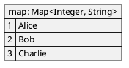

And add link with object.

#### Example 4
```java
@startuml
object London

map CapitalCity {
 UK *-> London
 USA => Washington
 Germany => Berlin
}
@enduml
```
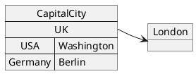

#### Example 5
```java
@startuml
object London
object Washington
object Berlin
object NewYork

map CapitalCity {
 UK *-> London
 USA *--> Washington
 Germany *---> Berlin
}

NewYork --> CapitalCity::USA
@enduml
```
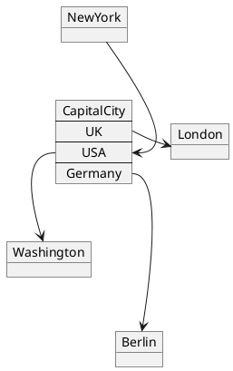

#### Example 6
```java
@startuml
package foo {
    object baz
}

package bar {
    map A {
        b *-> foo.baz
        c =>
    }
}

A::c --> foo
@enduml
```
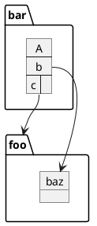

#### Example 7
```java
@startuml
object Foo
map Bar {
  abc=>
  def=>
}
object Baz

Bar::abc --> Baz : Label one
Foo --> Bar::def : Label two
@enduml
```
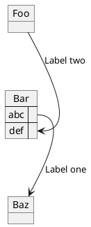

### Program (or project) evaluation and review technique (PERT) with map
You can use `map table` in order to make [Program (or project) evaluation and review technique (PERT)](https://en.wikipedia.org/wiki/Program_evaluation_and_review_technique) diagram.

```java
@startuml PERT
left to right direction
' Horizontal lines: -->, <--, <-->
' Vertical lines: ->, <-, <->
title PERT: Project Name

map Kick.Off {
}
map task.1 {
    Start => End
}
map task.2 {
    Start => End
}
map task.3 {
    Start => End
}
map task.4 {
    Start => End
}
map task.5 {
    Start => End
}
Kick.Off --> task.1 : Label 1
Kick.Off --> task.2 : Label 2
Kick.Off --> task.3 : Label 3
task.1 --> task.4
task.2 --> task.4
task.3 --> task.4
task.4 --> task.5 : Label 4
@enduml
```
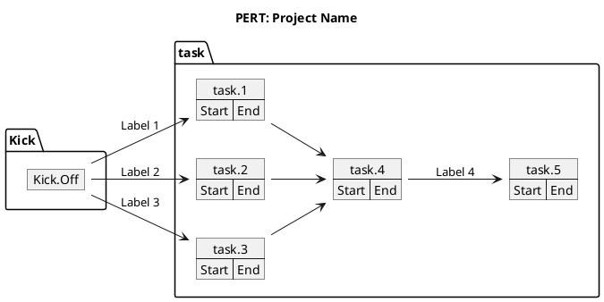
