# [Plant UML](https://plantuml.com/ko/)

PlantUML 은 다이어그램을 빠르게 작성하기 위한 오픈 소스 프로젝트입니다.

## Activity 다이어그램

[기존의 activity diagram 문법](https://plantuml.com/ko/activity-diagram-legacy) 은 몇몇 제약과 단점이 있다.(예를 들면, 유지보수가 어렵다.)

그래서 완전 새로운 문법과 구현이 베타버전으로 고안되었고, 우리는 더 나은 포맷과 문법으로 정의할 수 있었다.
이 새로운 구현의 또 다른 장점은 (시퀀스 다이어그램과 같이) Graphviz를 설치할 필요 없이 수행된다는 것이다.

새로운 구문이 이전 구문을 대체할 것이다. 그러나 호환성을 보장하기 위해 이전 구문이 여전히 인식될 것이다.
새로운 구문으로 이전을 권장한다.

### Simple action

Activities label starts with `:` and ends with `;`.
Text formatting can be done using [creole wiki syntax](https://plantuml.com/ko/creole).
They are implicitly linked in their definition order.

```java
@startuml
:Hello world;
:This is defined on
several **lines**;
@enduml
```
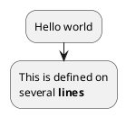

You can use `start` and `stop` keywords to denote the beginning and the end of a diagram.

```java
@startuml
start
:Hello world;
:This is defined on
several **lines**;
stop
@enduml
```
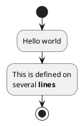

You can also use the `end` keyword.

```java
@startuml
start
:Hello world;
:This is defined on
several **lines**;
end
@enduml
```
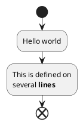

### Conditional
You can use `if`, `then` and `else` keywords to put tests if your diagram. Labels can be provided using parentheses.

```java
@startuml

start

if (Graphviz installed?) then (yes)
  :process all\ndiagrams;
else (no)
  :process only
  __sequence__ and __activity__ diagrams;
endif

stop

@enduml
```
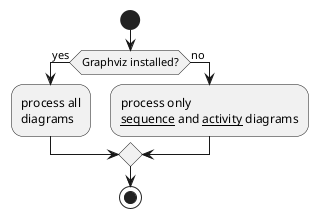

You can use the `elseif` keyword to have several tests :

```java
@startuml
start
if (condition A) then (yes)
  :Text 1;
elseif (condition B) then (yes)
  :Text 2;
  stop
elseif (condition C) then (yes)
  :Text 3;
elseif (condition D) then (yes)
  :Text 4;
else (nothing)
  :Text else;
endif
stop
@enduml
```
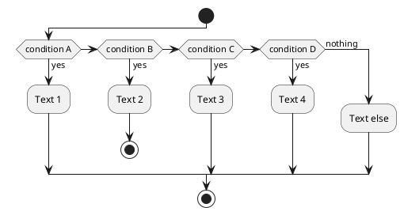

### Switch and case [switch, case, endswitch]
You can use `switch`, `case` and `endswitch` keywords to put switch in your diagram.
Labels can be provided using parentheses.

```java
@startuml
start
switch (test?)
case ( condition A )
  :Text 1;
case ( condition B ) 
  :Text 2;
case ( condition C )
  :Text 3;
case ( condition D )
  :Text 4;
case ( condition E )
  :Text 5;
endswitch
stop
@enduml
```
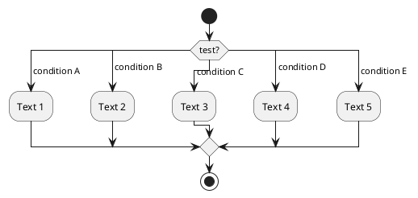

### Conditional with stop on an action [kill, detach]
You can stop action on a if loop.

```java
@startuml
if (condition?) then
  :error;
  stop
endif
#palegreen:action;
@enduml
```
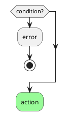

But if you want to stop at the precise action, you can use the `kill` or `detach` keyword:
* `kill`

```java
@startuml
if (condition?) then
  #pink:error;
  kill
endif
#palegreen:action;
@enduml
```
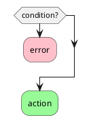

* `detach`

```java
@startuml
if (condition?) then
  #pink:error;
  detach
endif
#palegreen:action;
@enduml
```


### Repeat loop
You can use `repeat` and `repeatwhile` keywords to have repeat loops.

```java
@startuml

start

repeat
  :read data;
  :generate diagrams;
repeat while (more data?) is (yes)
->no;
stop

@enduml
```
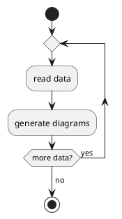

It is also possible to use a full action as `repeat` target and insert an action in the return path using the `backward` keyword.

```java
@startuml

start

repeat :foo as starting label;
  :read data;
  :generate diagrams;
backward:This is backward;
repeat while (more data?)

stop

@enduml
```
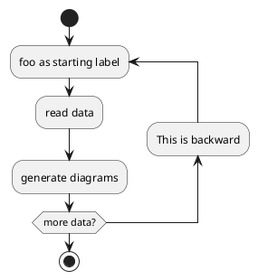

### Break on a repeat loop [break]
You can use the `break` keyword after an action on a loop.

```java
@startuml
start
repeat
  :Test something;
    if (Something went wrong?) then (no)
      #palegreen:OK;
      break
    endif
    ->NOK;
    :Alert "Error with long text";
repeat while (Something went wrong with long text?) is (yes) not (no)
->//merged step//;
:Alert "Success";
stop
@enduml
```
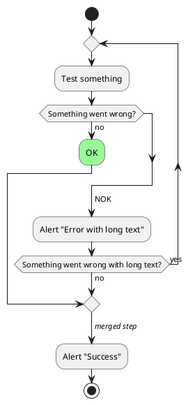

### While loop
You can use `while` and `endwhile` keywords to have repeat loops.

```java
@startuml

start

while (data available?)
  :read data;
  :generate diagrams;
endwhile

stop

@enduml
```
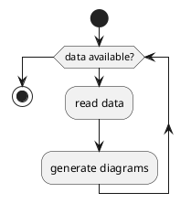

It is possible to provide a label after the `endwhile` keyword, or using the `is` keyword.

```java
@startuml
while (check filesize ?) is (not empty)
  :read file;
endwhile (empty)
:close file;
@enduml
```
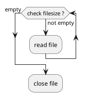

If you are using `detach` to form an infinite while loop, then you will want to also hide the partial arrow that results using `-[hidden]->`

```java
@startuml
:Step 1;
if (condition1) then
  while (loop forever)
   :Step 2;
  endwhile
  -[hidden]->
  detach
else
  :end normally;
  stop
endif
@enduml
```
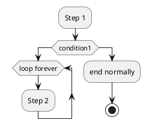

### Parallel processing [fork, fork again, end fork, end merge]
You can use `fork`, `fork again` and `end fork` or `end merge` keywords to denote parallel processing.

#### Simple `fork`
```java
@startuml
start
fork
  :action 1;
fork again
  :action 2;
end fork
stop
@enduml
```
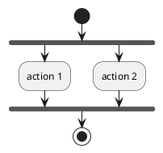

#### `fork` with end merge
```java
@startuml
start
fork
  :action 1;
fork again
  :action 2;
end merge
stop
@enduml
```
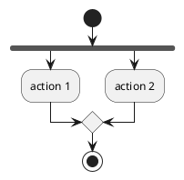

```java
@startuml
start
fork
  :action 1;
fork again
  :action 2;
fork again
  :action 3;
fork again
  :action 4;
end merge
stop
@enduml
```
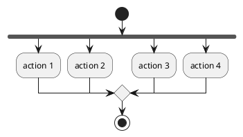

```java
@startuml
start
fork
  :action 1;
fork again
  :action 2;
  end
end merge
stop
@enduml
```
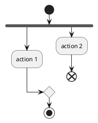

### Label on `end fork` (or UML joinspec):
```java
@startuml
start
fork
  :action A;
fork again
  :action B;
end fork {or}
stop
@enduml
```
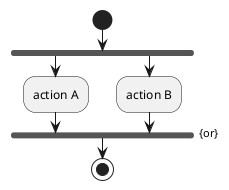

```java
@startuml
start
fork
  :action A;
fork again
  :action B;
end fork {and}
stop
@enduml
```
```plantuml
@startuml
start
fork
  :action A;
fork again
  :action B;
end fork {and}
stop
@enduml
```

#### Other example
```java
@startuml

start

if (multiprocessor?) then (yes)
  fork
    :Treatment 1;
  fork again
    :Treatment 2;
  end fork
else (monoproc)
  :Treatment 1;
  :Treatment 2;
endif

@enduml
```
```plantuml
@startuml

start

if (multiprocessor?) then (yes)
  fork
    :Treatment 1;
  fork again
    :Treatment 2;
  end fork
else (monoproc)
  :Treatment 1;
  :Treatment 2;
endif

@enduml
```

### Split processing

#### Split
You can use `split`, `split again` and `end split` keywords to denote split processing.

```java
@startuml
start
split
   :A;
split again
   :B;
split again
   :C;
split again
   :a;
   :b;
end split
:D;
end
@enduml
```
```plantuml
@startuml
start
split
   :A;
split again
   :B;
split again
   :C;
split again
   :a;
   :b;
end split
:D;
end
@enduml
```

#### Input split (multi-start)
You can use `hidden` arrows to make an input split (multi-start):

```java
@startuml
split
   -[hidden]->
   :A;
split again
   -[hidden]->
   :B;
split again
   -[hidden]->
   :C;
end split
:D;
@enduml
```
```plantuml
@startuml
split
   -[hidden]->
   :A;
split again
   -[hidden]->
   :B;
split again
   -[hidden]->
   :C;
end split
:D;
@enduml
```

```java
@startuml
split
   -[hidden]->
   :A;
split again
   -[hidden]->
   :a;
   :b;
split again
   -[hidden]->
   (Z)
end split
:D;
@enduml
```
```plantuml
@startuml
split
   -[hidden]->
   :A;
split again
   -[hidden]->
   :a;
   :b;
split again
   -[hidden]->
   (Z)
end split
:D;
@enduml
```

#### Output split (multi-end)
You can use `kill` or `detach` to make an output split (multi-end):

```java
@startuml
start
split
   :A;
   kill
split again
   :B;
   detach
split again
   :C;
   kill
end split
@enduml
```
```plantuml
@startuml
start
split
   :A;
   kill
split again
   :B;
   detach
split again
   :C;
   kill
end split
@enduml
```

```java
@startuml
start
split
   :A;
   kill
split again
   :b;
   :c;
   detach
split again
   (Z)
   detach
split again
   end
split again
   stop
end split
@enduml
```
```plantuml
@startuml
start
split
   :A;
   kill
split again
   :b;
   :c;
   detach
split again
   (Z)
   detach
split again
   end
split again
   stop
end split
@enduml
```

### Notes
Text formatting can be done using [creole wiki syntax](https://plantuml.com/ko/creole).
A note can be floating, using `floating` keyword.

```java
@startuml

start
:foo1;
floating note left: This is a note
:foo2;
note right
  This note is on several
  //lines// and can
  contain <b>HTML</b>
  ====
  * Calling the method ""foo()"" is prohibited
end note
stop

@enduml
```
```plantuml
@startuml

start
:foo1;
floating note left: This is a note
:foo2;
note right
  This note is on several
  //lines// and can
  contain <b>HTML</b>
  ====
  * Calling the method ""foo()"" is prohibited
end note
stop

@enduml
```

You can add note on backward activity:
```java
@startuml
start
repeat :Enter data;
:Submit;
backward :Warning;
note right: Note
repeat while (Valid?) is (No) not (Yes)
stop
@enduml
```
```plantuml
@startuml
start
repeat :Enter data;
:Submit;
backward :Warning;
note right: Note
repeat while (Valid?) is (No) not (Yes)
stop
@enduml
```

You can add note on partition activity:
```java
@startuml
start
partition "**process** HelloWorld" {
    note
        This is my note
        ----
        //Creole test//
    end note
    :Ready;
    :HelloWorld(i)>
    :Hello-Sent;
}
@enduml
```
```plantuml
@startuml
start
partition "**process** HelloWorld" {
    note
        This is my note
        ----
        //Creole test//
    end note
    :Ready;
    :HelloWorld(i)>
    :Hello-Sent;
}
@enduml
```

### Colors
You can specify a [color](https://plantuml.com/ko/color) for some activities.

```java
@startuml

start
:starting progress;
#HotPink:reading configuration files
These files should be edited at this point!;
#AAAAAA:ending of the process;

@enduml
```
```plantuml
@startuml

start
:starting progress;
#HotPink:reading configuration files
These files should be edited at this point!;
#AAAAAA:ending of the process;

@enduml
```

You can also use [gradient color](https://plantuml.com/ko/color).
```java
@startuml
start
partition #red/white testPartition {
        #blue\green:testActivity;
}
@enduml
```
```plantuml
@startuml
start
partition #red/white testPartition {
        #blue\green:testActivity;
}
@enduml
```

### Lines without arrows
You can use `skinparam ArrowHeadColor none` in order to connect activities using lines only, without arrows.

```java
@startuml
skinparam ArrowHeadColor none
start
:Hello world;
:This is on defined on
several **lines**;
stop
@enduml
```
```plantuml
@startuml
skinparam ArrowHeadColor none
start
:Hello world;
:This is on defined on
several **lines**;
stop
@enduml
```

```java
@startuml
skinparam ArrowHeadColor none
start
repeat :Enter data;
:Submit;
backward :Warning;
repeat while (Valid?) is (No) not (Yes)
stop
@enduml
```
```plantuml
@startuml
skinparam ArrowHeadColor none
start
repeat :Enter data;
:Submit;
backward :Warning;
repeat while (Valid?) is (No) not (Yes)
stop
@enduml
```

### Arrows
Using the `->` notation, you can add texts to arrow, and change their [color](https://plantuml.com/ko/color).
It's also possible to have dotted, dashed, bold or hidden arrows.

```java
@startuml
:foo1;
-> You can put text on arrows;
if (test) then
  -[#blue]->
  :foo2;
  -[#green,dashed]-> The text can
  also be on several lines
  and **very** long...;
  :foo3;
else
  -[#black,dotted]->
  :foo4;
endif
-[#gray,bold]->
:foo5;
@enduml
```
```plantuml
@startuml
:foo1;
-> You can put text on arrows;
if (test) then
  -[#blue]->
  :foo2;
  -[#green,dashed]-> The text can
  also be on several lines
  and **very** long...;
  :foo3;
else
  -[#black,dotted]->
  :foo4;
endif
-[#gray,bold]->
:foo5;
@enduml
```

### Connector
You can use parentheses to denote connector.

```java
@startuml
start
:Some activity;
(A)
detach
(A)
:Other activity;
@enduml
```
```plantuml
@startuml
start
:Some activity;
(A)
detach
(A)
:Other activity;
@enduml
```

### Color on connector
You can add [color](https://plantuml.com/ko/color) on connector.

```java
@startuml
start
:The connector below
wishes he was blue;
#blue:(B)
:This next connector
feels that she would
be better off green;
#green:(G)
stop
@enduml
```
```plantuml
@startuml
start
:The connector below
wishes he was blue;
#blue:(B)
:This next connector
feels that she would
be better off green;
#green:(G)
stop
@enduml
```

### Grouping or partition

#### Group

You can group activity together by defining group:

```java
@startuml
start
group Initialization 
    :read config file;
    :init internal variable;
end group
group Running group
    :wait for user interaction;
    :print information;
end group

stop
@enduml
```
```plantuml
@startuml
start
group Initialization 
    :read config file;
    :init internal variable;
end group
group Running group
    :wait for user interaction;
    :print information;
end group

stop
@enduml
```

#### Partition
You can group activity together by defining partition:

```java
@startuml
start
partition Initialization {
    :read config file;
    :init internal variable;
}
partition Running {
    :wait for user interaction;
    :print information;
}

stop
@enduml
```
```plantuml
@startuml
start
partition Initialization {
    :read config file;
    :init internal variable;
}
partition Running {
    :wait for user interaction;
    :print information;
}

stop
@enduml
```

It's also possible to change partition [color](https://plantuml.com/ko/color):

```java
@startuml
start
partition #lightGreen "Input Interface" {
    :read config file;
    :init internal variable;
}
partition Running {
    :wait for user interaction;
    :print information;
}
stop
@enduml
```
```plantuml
@startuml
start
partition #lightGreen "Input Interface" {
    :read config file;
    :init internal variable;
}
partition Running {
    :wait for user interaction;
    :print information;
}
stop
@enduml
```

It's also possible to add [link](https://plantuml.com/ko/link) to partition:
```java
@startuml
start
partition "[[http://plantuml.com partition_name]]" {
    :read doc. on [[http://plantuml.com plantuml_website]];
    :test diagram;
}
end
@enduml
```
```plantuml
@startuml
start
partition "[[http://plantuml.com partition_name]]" {
    :read doc. on [[http://plantuml.com plantuml_website]];
    :test diagram;
}
end
@enduml
```

#### Group, Partition, Package, Rectangle or Card

You can group activity together by defining:
* group
* partition
* package
* rectangle
* card

```java
@startuml
start
group Group
  :Activity;
end group
floating note: Note on Group

partition Partition {
  :Activity;
}
floating note: Note on Partition

package Package {
  :Activity;
}
floating note: Note on Package 

rectangle Rectangle {
  :Activity;
}
floating note: Note on Rectangle 

card Card {
  :Activity;
}
floating note: Note on Card
end
@enduml
```
```plantuml
@startuml
start
group Group
  :Activity;
end group
floating note: Note on Group

partition Partition {
  :Activity;
}
floating note: Note on Partition

package Package {
  :Activity;
}
floating note: Note on Package 

rectangle Rectangle {
  :Activity;
}
floating note: Note on Rectangle 

card Card {
  :Activity;
}
floating note: Note on Card
end
@enduml
```

### Swimlanes
Using pipe `|`, you can define swimlanes.
It's also possible to change swimlanes [color](https://plantuml.com/ko/color).

```java
@startuml
|Swimlane1|
start
:foo1;
|#AntiqueWhite|Swimlane2|
:foo2;
:foo3;
|Swimlane1|
:foo4;
|Swimlane2|
:foo5;
stop
@enduml
```
```plantuml
@startuml
|Swimlane1|
start
:foo1;
|#AntiqueWhite|Swimlane2|
:foo2;
:foo3;
|Swimlane1|
:foo4;
|Swimlane2|
:foo5;
stop
@enduml
```

You can add `if` conditional or `repeat` or `while` loop within swimlanes.
```java
@startuml
|#pink|Actor_For_red|
start
if (color?) is (red) then
#pink:**action red**;
:foo1;
else (not red)
|#lightgray|Actor_For_no_red|
#lightgray:**action not red**;
:foo2;
endif
|Next_Actor|
#lightblue:foo3;
:foo4;
|Final_Actor|
#palegreen:foo5;
stop
@enduml
```
```plantuml
@startuml
|#pink|Actor_For_red|
start
if (color?) is (red) then
#pink:**action red**;
:foo1;
else (not red)
|#lightgray|Actor_For_no_red|
#lightgray:**action not red**;
:foo2;
endif
|Next_Actor|
#lightblue:foo3;
:foo4;
|Final_Actor|
#palegreen:foo5;
stop
@enduml
```

You can also use `alias` with swimlanes, with this syntax:
* `|[#<color>|]<swimlane_alias>| <swimlane_title>`

```java
@startuml
|#palegreen|f| fisherman
|c| cook
|#gold|e| eater
|f|
start
:go fish;
|c|
:fry fish;
|e|
:eat fish;
stop
@enduml
```
```plantuml
@startuml
|#palegreen|f| fisherman
|c| cook
|#gold|e| eater
|f|
start
:go fish;
|c|
:fry fish;
|e|
:eat fish;
stop
@enduml
```

### Detach or kill [detach, kill]
It's possible to remove an arrow using the `detach` or `kill` keyword:
* `detach`

```java
@startuml
 :start;
 fork
   :foo1;
   :foo2;
 fork again
   :foo3;
   detach
 endfork
 if (foo4) then
   :foo5;
   detach
 endif
 :foo6;
 detach
 :foo7;
 stop
@enduml
```
```plantuml
@startuml
 :start;
 fork
   :foo1;
   :foo2;
 fork again
   :foo3;
   detach
 endfork
 if (foo4) then
   :foo5;
   detach
 endif
 :foo6;
 detach
 :foo7;
 stop
@enduml
```

* `kill`

```java
@startuml
 :start;
 fork
   :foo1;
   :foo2;
 fork again
   :foo3;
   kill
 endfork
 if (foo4) then
   :foo5;
   kill
 endif
 :foo6;
 kill
 :foo7;
 stop
@enduml
```
```plantuml
@startuml
 :start;
 fork
   :foo1;
   :foo2;
 fork again
   :foo3;
   kill
 endfork
 if (foo4) then
   :foo5;
   kill
 endif
 :foo6;
 kill
 :foo7;
 stop
@enduml
```

### SDL (Specification and Description Language)
By changing the final `;` separator, you can set different rendering for the activity:
* `|`
* `<`
* `>`
* `/`
* `\\`
* `]`
* `}`

```java
@startuml
:Ready;
:next(o)|
:Receiving;
split
 :nak(i)<
 :ack(o)>
split again
 :ack(i)<
 :next(o)
 on several lines|
 :i := i + 1]
 :ack(o)>
split again
 :err(i)<
 :nak(o)>
split again
 :foo/
split again
 :bar\\
split again
 :i > 5}
stop
end split
:finish;
@enduml
```
```plantuml
@startuml
:Ready;
:next(o)|
:Receiving;
split
 :nak(i)<
 :ack(o)>
split again
 :ack(i)<
 :next(o)
 on several lines|
 :i := i + 1]
 :ack(o)>
split again
 :err(i)<
 :nak(o)>
split again
 :foo/
split again
 :bar\\
split again
 :i > 5}
stop
end split
:finish;
@enduml
```

### Complete example
```java
@startuml

start
:ClickServlet.handleRequest();
:new page;
if (Page.onSecurityCheck) then (true)
  :Page.onInit();
  if (isForward?) then (no)
    :Process controls;
    if (continue processing?) then (no)
      stop
    endif

    if (isPost?) then (yes)
      :Page.onPost();
    else (no)
      :Page.onGet();
    endif
    :Page.onRender();
  endif
else (false)
endif

if (do redirect?) then (yes)
  :redirect process;
else
  if (do forward?) then (yes)
    :Forward request;
  else (no)
    :Render page template;
  endif
endif

stop

@enduml
```
```plantuml
@startuml

start
:ClickServlet.handleRequest();
:new page;
if (Page.onSecurityCheck) then (true)
  :Page.onInit();
  if (isForward?) then (no)
    :Process controls;
    if (continue processing?) then (no)
      stop
    endif

    if (isPost?) then (yes)
      :Page.onPost();
    else (no)
      :Page.onGet();
    endif
    :Page.onRender();
  endif
else (false)
endif

if (do redirect?) then (yes)
  :redirect process;
else
  if (do forward?) then (yes)
    :Forward request;
  else (no)
    :Render page template;
  endif
endif

stop

@enduml
```

### Condition Style

#### Inside style (by default)
```java
@startuml
skinparam conditionStyle inside
start
repeat
  :act1;
  :act2;
repeatwhile (<b>end)
:act3;
@enduml
```
```plantuml
@startuml
skinparam conditionStyle inside
start
repeat
  :act1;
  :act2;
repeatwhile (<b>end)
:act3;
@enduml
```

```java
@startuml
start
repeat
  :act1;
  :act2;
repeatwhile (<b>end)
:act3;
@enduml
```
```plantuml
@startuml
start
repeat
  :act1;
  :act2;
repeatwhile (<b>end)
:act3;
@enduml
```

#### Diamond style
```java
@startuml
skinparam conditionStyle diamond
start
repeat
  :act1;
  :act2;
repeatwhile (<b>end)
:act3;
@enduml
```
```plantuml
@startuml
skinparam conditionStyle diamond
start
repeat
  :act1;
  :act2;
repeatwhile (<b>end)
:act3;
@enduml
```

#### InsideDiamond (or Foo1) style
```java
@startuml
skinparam conditionStyle InsideDiamond
start
repeat
  :act1;
  :act2;
repeatwhile (<b>end)
:act3;
@enduml
```
```plantuml
@startuml
skinparam conditionStyle InsideDiamond
start
repeat
  :act1;
  :act2;
repeatwhile (<b>end)
:act3;
@enduml
```

```java
@startuml
skinparam conditionStyle foo1
start
repeat
  :act1;
  :act2;
repeatwhile (<b>end)
:act3;
@enduml
```
```plantuml
@startuml
skinparam conditionStyle foo1
start
repeat
  :act1;
  :act2;
repeatwhile (<b>end)
:act3;
@enduml
```

### Condition End Style

#### Diamond style (by default)
* With one branch

```java
@startuml
skinparam ConditionEndStyle diamond
:A;
if (decision) then (yes)
    :B1;
else (no)
endif
:C;
@enduml
```
```plantuml
@startuml
skinparam ConditionEndStyle diamond
:A;
if (decision) then (yes)
    :B1;
else (no)
endif
:C;
@enduml
```

* With two branches (`B1`, `B2`)

```java
@startuml
skinparam ConditionEndStyle diamond
:A;
if (decision) then (yes)
    :B1;
else (no)
    :B2;
endif
:C;
@enduml
```
```plantuml
@startuml
skinparam ConditionEndStyle diamond
:A;
if (decision) then (yes)
    :B1;
else (no)
    :B2;
endif
:C;
@enduml
```

#### Horizontal line (hline) style
* With one branch

```java
@startuml
skinparam ConditionEndStyle hline
:A;
if (decision) then (yes)
    :B1;
else (no)
endif
:C;
@enduml
```
```plantuml
@startuml
skinparam ConditionEndStyle hline
:A;
if (decision) then (yes)
    :B1;
else (no)
endif
:C;
@enduml
```

* With two branches (`B1`, `B2`)

```java
@startuml
skinparam ConditionEndStyle hline
:A;
if (decision) then (yes)
    :B1;
else (no)
    :B2;
endif
:C;
@enduml
```
```plantuml
@startuml
skinparam ConditionEndStyle hline
:A;
if (decision) then (yes)
    :B1;
else (no)
    :B2;
endif
:C;
@enduml
```

### Using (global) style

#### Without style (by default)
```java
@startuml
start
:init;
-> test of color;
if (color?) is (<color:red>red) then
:print red;
else 
:print not red;
note right: no color
endif
partition End {
:end;
}
-> this is the end;
end
@enduml
```
```plantuml
@startuml
start
:init;
-> test of color;
if (color?) is (<color:red>red) then
:print red;
else 
:print not red;
note right: no color
endif
partition End {
:end;
}
-> this is the end;
end
@enduml
```

#### With style
You can use [style](https://plantuml.com/ko/style-evolution) to change rendering of elements.

```java
@startuml
<style>
activityDiagram {
  BackgroundColor #33668E
  BorderColor #33668E
  FontColor #888
  FontName arial

  diamond {
    BackgroundColor #ccf
    LineColor #00FF00
    FontColor green
    FontName arial
    FontSize 15
  }
  arrow {
    FontColor gold
    FontName arial
    FontSize 15
  }
  partition {
    LineColor red
    FontColor green
    RoundCorner 10
    BackgroundColor PeachPuff
  }
  note {
    FontColor Blue
    LineColor Navy
    BackgroundColor #ccf
  }
}
document {
   BackgroundColor transparent
}
</style>
start
:init;
-> test of color;
if (color?) is (<color:red>red) then
:print red;
else 
:print not red;
note right: no color
endif
partition End {
:end;
}
-> this is the end;
end
@enduml
```
```plantuml
@startuml
<style>
activityDiagram {
  BackgroundColor #33668E
  BorderColor #33668E
  FontColor #888
  FontName arial

  diamond {
    BackgroundColor #ccf
    LineColor #00FF00
    FontColor green
    FontName arial
    FontSize 15
  }
  arrow {
    FontColor gold
    FontName arial
    FontSize 15
  }
  partition {
    LineColor red
    FontColor green
    RoundCorner 10
    BackgroundColor PeachPuff
  }
  note {
    FontColor Blue
    LineColor Navy
    BackgroundColor #ccf
  }
}
document {
   BackgroundColor transparent
}
</style>
start
:init;
-> test of color;
if (color?) is (<color:red>red) then
:print red;
else 
:print not red;
note right: no color
endif
partition End {
:end;
}
-> this is the end;
end
@enduml
```
