# [Plant UML](https://plantuml.com/ko/)

PlantUML 은 다이어그램을 빠르게 작성하기 위한 오픈 소스 프로젝트입니다.

## Component 다이어그램

### 컴포넌트
컴포넌트는 반드시 대괄호 `[` `]` 로 둘러싸여야 한다.
컨퍼넌트를 정의할때 `component` 키워드도 사용할 수 있다. `as` 키워드를 이용해서 별명을 정의할 수도 있다. 이 별명은 뒤에서 관계를 정의할때 사용된다.

```java
@startuml

[First component]
[Another component] as Comp2
component Comp3
component [Last\ncomponent] as Comp4

@enduml
```
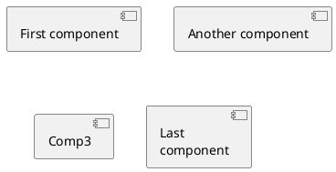

### 인터페이스
인터페이스는 `(` `)` 기호로 정의될 수 있다(이 기호가 원처럼 보이기 때문이다).
`interface` 키워드도 인터페이스를 정의하는데 사용할 수 있다. `as` 키워드를 이용해서 별명을 정의할 수도 있다. 이 별명은 뒤에서 관계를 정의할때 사용된다.
인터페이스를 정의하는 일은 선택 사항(optional)이라는 것을 뒤에서 확인할 것이다.

```java
@startuml

() "First Interface"
() "Another interface" as Interf2
interface Interf3
interface "Last\ninterface" as Interf4

@enduml
```
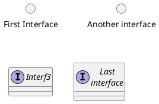

### 기본 예제
요소들간의 연결은 점선 `..`, 실선 `--`, 그리고 화살표 `-->` 기호들의 조합으로 생성된다.

```java
@startuml

DataAccess - [First Component]
[First Component] ..> HTTP : use

@enduml
```
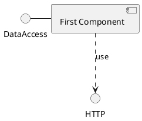

### 메모 사용하기
각 오브젝트에 관련된 메모를 정의하기 위해 `note left of` , `note right of` , `note top of` , `note bottom of` 키워드들을 사용할 수 있다.
메모는 또한 `note` 키워드를 통해 단독으로 정의될 수도 있고, 다른 오브젝트들에 `..` 기호로 연결된다.

```java
@startuml

interface "Data Access" as DA

DA - [First Component]
[First Component] ..> HTTP : use

note left of HTTP : Web Service only

note right of [First Component]
  A note can also
  be on several lines
end note

@enduml
```
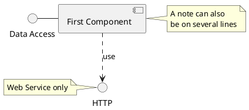

### 컴포넌트를 그룹으로 나누기
컴포넌트들과 인터페이스들을 그룹으로 나누기 위해 여러가지 키워드를 사용할 수 있다:
* `package`
* `node`
* `folder`
* `frame`
* `cloud`
* `database`

```java
@startuml

package "Some Group" {
  HTTP - [First Component]
  [Another Component]
}

node "Other Groups" {
  FTP - [Second Component]
  [First Component] --> FTP
}

cloud {
  [Example 1]
}


database "MySql" {
  folder "This is my folder" {
    [Folder 3]
  }
  frame "Foo" {
    [Frame 4]
  }
}


[Another Component] --> [Example 1]
[Example 1] --> [Folder 3]
[Folder 3] --> [Frame 4]

@enduml
```
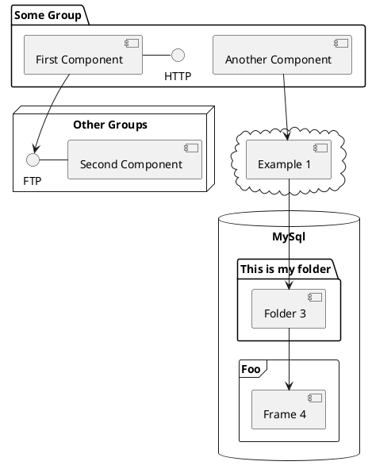

### 화살표 방향 바꾸기
기본적으로 클래스들간의 연결은 두개의 대시를 `--` 갖고 방향은 수직 방향이다. 다음처럼 한개의 대시(혹은 점)를 넣어 수평 방향 연결을 사용할 수 있다:

```java
@startuml
[Component] --> Interface1
[Component] -> Interface2
@enduml
```
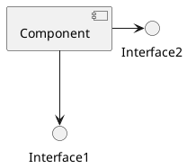

연결을 반전시켜 방향을 바꿀 수도 있다:
```java
@startuml
Interface1 <-- [Component]
Interface2 <- [Component]
@enduml
```
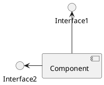

화살표 안에 `left`, `right`, `up`, `down` 키워드를 추가하여 방향을 바꾸는것도 가능하다:
```java
@startuml
[Component] -left-> left
[Component] -right-> right
[Component] -up-> up
[Component] -down-> down
@enduml
```
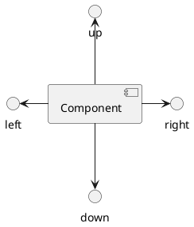

방향을 의미하는 단어의 첫번째 글자만 사용해서 화살표를 짧게 할 수 있다. (예를 들면, `-down-` 대신 `-d-`) 또는 두 글자를 사용해도 된다. (`-do-`).
이 기능을 남용하지 말아야 한다는 것을 명심하자 : 그래야 별다른 수정없이도 *GraphViz*가 좋은 결과를 보여준다.

### Use UML2 notation
By default (from v1.2020.13-14), UML2 notation is used.

```java
@startuml

interface "Data Access" as DA

DA - [First Component]
[First Component] ..> HTTP : use

@enduml
```
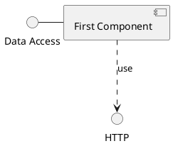

### Use UML1 notation
The `skinparam componentStyle uml1` command is used to switch to UML1 notation.

```java
@startuml
skinparam componentStyle uml1

interface "Data Access" as DA

DA - [First Component]
[First Component] ..> HTTP : use

@enduml
```
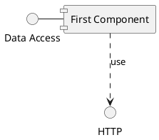

### Use rectangle notation (remove UML notation)
The `skinparam componentStyle rectangle` command is used to switch to rectangle notation *(without any UML notation)*.

```java
@startuml
skinparam componentStyle rectangle

interface "Data Access" as DA

DA - [First Component]
[First Component] ..> HTTP : use

@enduml
```


### Long description
It is possible to put description on several lines using square brackets.

```java
@startuml
component comp1 [
This component
has a long comment
on several lines
]
@enduml
```
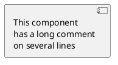

### Individual colors
You can specify a color after component definition.

```java
@startuml
component  [Web Server] #Yellow
@enduml
```
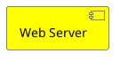

### Using Sprite in Stereotype
You can use sprites within stereotype components.

```java
@startuml
sprite $businessProcess [16x16/16] {
FFFFFFFFFFFFFFFF
FFFFFFFFFFFFFFFF
FFFFFFFFFFFFFFFF
FFFFFFFFFFFFFFFF
FFFFFFFFFF0FFFFF
FFFFFFFFFF00FFFF
FF00000000000FFF
FF000000000000FF
FF00000000000FFF
FFFFFFFFFF00FFFF
FFFFFFFFFF0FFFFF
FFFFFFFFFFFFFFFF
FFFFFFFFFFFFFFFF
FFFFFFFFFFFFFFFF
FFFFFFFFFFFFFFFF
FFFFFFFFFFFFFFFF
}


rectangle " End to End\nbusiness process" <<$businessProcess>> {
 rectangle "inner process 1" <<$businessProcess>> as src
 rectangle "inner process 2" <<$businessProcess>> as tgt
 src -> tgt
}
@enduml
```
```plantuml
@startuml
sprite $businessProcess [16x16/16] {
FFFFFFFFFFFFFFFF
FFFFFFFFFFFFFFFF
FFFFFFFFFFFFFFFF
FFFFFFFFFFFFFFFF
FFFFFFFFFF0FFFFF
FFFFFFFFFF00FFFF
FF00000000000FFF
FF000000000000FF
FF00000000000FFF
FFFFFFFFFF00FFFF
FFFFFFFFFF0FFFFF
FFFFFFFFFFFFFFFF
FFFFFFFFFFFFFFFF
FFFFFFFFFFFFFFFF
FFFFFFFFFFFFFFFF
FFFFFFFFFFFFFFFF
}


rectangle " End to End\nbusiness process" <<$businessProcess>> {
 rectangle "inner process 1" <<$businessProcess>> as src
 rectangle "inner process 2" <<$businessProcess>> as tgt
 src -> tgt
}
@enduml
```

### Skinparam
You can use the [skinparam](https://plantuml.com/ko/skinparam) command to change colors and fonts for the drawing.

You can use this command :
* In the diagram definition, like any other commands;
* In an [included file](https://plantuml.com/ko/preprocessing);
* In a configuration file, provided in the [command line](https://plantuml.com/ko/command-line) or the [Ant task](https://plantuml.com/ko/ant-task).

You can define specific color and fonts for stereotyped components and interfaces.

```java
@startuml

skinparam interface {
  backgroundColor RosyBrown
  borderColor orange
}

skinparam component {
  FontSize 13
  BackgroundColor<<Apache>> Pink
  BorderColor<<Apache>> #FF6655
  FontName Courier
  BorderColor black
  BackgroundColor gold
  ArrowFontName Impact
  ArrowColor #FF6655
  ArrowFontColor #777777
}

() "Data Access" as DA
Component "Web Server" as WS << Apache >>

DA - [First Component]
[First Component] ..> () HTTP : use
HTTP - WS

@enduml
```
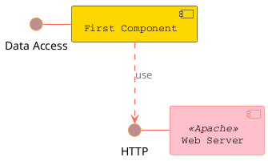

```java
@startuml
[AA] <<static lib>>
[BB] <<shared lib>>
[CC] <<static lib>>

node node1
node node2 <<shared node>>
database Production

skinparam component {
    backgroundColor<<static lib>> DarkKhaki
    backgroundColor<<shared lib>> Green
}

skinparam node {
borderColor Green
backgroundColor Yellow
backgroundColor<<shared node>> Magenta
}
skinparam databaseBackgroundColor Aqua

@enduml
```
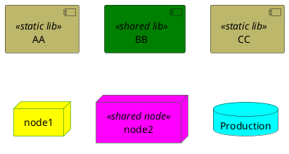

### Specific SkinParameter

#### componentStyle
* By default (or with `skinparam componentStyle uml2`), you have an icon for component

```java
@startuml
skinparam BackgroundColor transparent
skinparam componentStyle uml2
component A {
   component "A.1" {
}
   component A.44 {
      [A4.1]
}
   component "A.2"
   [A.3]
   component A.5 [
A.5] 
   component A.6 [
]
}
[a]->[b]
@enduml
```
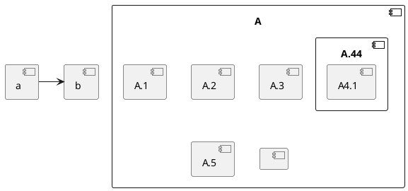

* If you want to suppress it, and to have only the rectangle, you can use `skinparam componentStyle rectangle`

```java
@startuml
skinparam BackgroundColor transparent
skinparam componentStyle rectangle
component A {
   component "A.1" {
}
   component A.44 {
      [A4.1]
}
   component "A.2"
   [A.3]
   component A.5 [
A.5] 
   component A.6 [
]
}
[a]->[b]
@enduml
```
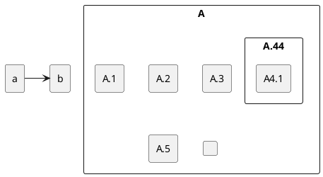

### Hide or Remove unlinked component
By default, all components are displayed:

```java
@startuml
component C1
component C2
component C3
C1 -- C2
@enduml
```
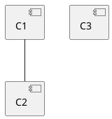

But you can:
* `hide @unlinked` components:

```java
@startuml
component C1
component C2
component C3
C1 -- C2

hide @unlinked
@enduml
```
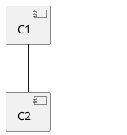

* or `remove @unlinked` components:

```java
@startuml
component C1
component C2
component C3
C1 -- C2

remove @unlinked
@enduml
```
```plantuml
@startuml
component C1
component C2
component C3
C1 -- C2

remove @unlinked
@enduml
```

### Hide, Remove or Restore tagged component or wildcard
You can put `$tags` (using `$`) on components, then remove, hide or restore components either individually or by tags.
By default, all components are displayed:

```java
@startuml
component C1 $tag13
component C2
component C3 $tag13
C1 -- C2
@enduml
```
```plantuml
@startuml
component C1 $tag13
component C2
component C3 $tag13
C1 -- C2
@enduml
```

But you can:
* `hide $tag13` components:

```java
@startuml
component C1 $tag13
component C2
component C3 $tag13
C1 -- C2

hide $tag13
@enduml
```
```plantuml
@startuml
component C1 $tag13
component C2
component C3 $tag13
C1 -- C2

hide $tag13
@enduml
```

* or `remove $tag13` components:

```java
@startuml
component C1 $tag13
component C2
component C3 $tag13
C1 -- C2

remove $tag13
@enduml
```
```plantuml
@startuml
component C1 $tag13
component C2
component C3 $tag13
C1 -- C2

remove $tag13
@enduml
```

* or `remove $tag13 and restore $tag1` components:

```java
@startuml
component C1 $tag13 $tag1
component C2
component C3 $tag13
C1 -- C2

remove $tag13
restore $tag1
@enduml
```
```plantuml
@startuml
component C1 $tag13 $tag1
component C2
component C3 $tag13
C1 -- C2

remove $tag13
restore $tag1
@enduml
```

* or `remove * and restore $tag1` components:

```java
@startuml
component C1 $tag13 $tag1
component C2
component C3 $tag13
C1 -- C2

remove *
restore $tag1
@enduml
```
```plantuml
@startuml
component C1 $tag13 $tag1
component C2
component C3 $tag13
C1 -- C2

remove *
restore $tag1
@enduml
```
