# [Plant UML](https://plantuml.com/ko/)

PlantUML 은 다이어그램을 빠르게 작성하기 위한 오픈 소스 프로젝트입니다.

## State 다이어그램

### 간단한 상태
`[*]`을 사용해서 시작점과 종료점을 그린다.
`-->`를 사용해서 화살표를 그린다.

```java
@startuml

[*] --> State1
State1 --> [*]
State1 : this is a string
State1 : this is another string

State1 -> State2
State2 --> [*]

@enduml
```
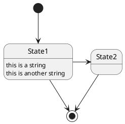

### Change state rendering
You can use `hide empty description` to render state as simple box.

```java
@startuml
hide empty description
[*] --> State1
State1 --> [*]
State1 : this is a string
State1 : this is another string

State1 -> State2
State2 --> [*]
@enduml
```
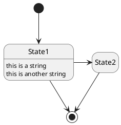

### 상태 수정
물론 상태는 수정될 수 있다. `state` 키워드와 브라켓을 정의해야 한다.

```java
@startuml
scale 350 width
[*] --> NotShooting

state NotShooting {
  [*] --> Idle
  Idle --> Configuring : EvConfig
  Configuring --> Idle : EvConfig
}

state Configuring {
  [*] --> NewValueSelection
  NewValueSelection --> NewValuePreview : EvNewValue
  NewValuePreview --> NewValueSelection : EvNewValueRejected
  NewValuePreview --> NewValueSelection : EvNewValueSaved

  state NewValuePreview {
     State1 -> State2
  }

}
@enduml
```
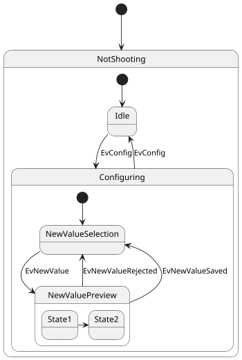

### 긴 이름
`state` 키워드를 사용하면 상태들을 길게 기술할 수 있다.

```java
@startuml
scale 600 width

[*] -> State1
State1 --> State2 : Succeeded
State1 --> [*] : Aborted
State2 --> State3 : Succeeded
State2 --> [*] : Aborted
state State3 {
  state "Accumulate Enough Data\nLong State Name" as long1
  long1 : Just a test
  [*] --> long1
  long1 --> long1 : New Data
  long1 --> ProcessData : Enough Data
}
State3 --> State3 : Failed
State3 --> [*] : Succeeded / Save Result
State3 --> [*] : Aborted

@enduml
```
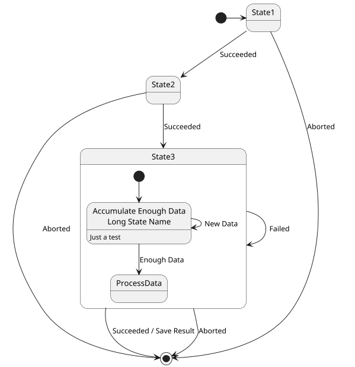

### History `[H], [H*]`
You can use `[H]` for the history and `[H*]` for the deep history of a substate.

```java
@startuml
[*] -> State1
State1 --> State2 : Succeeded
State1 --> [*] : Aborted
State2 --> State3 : Succeeded
State2 --> [*] : Aborted
state State3 {
  state "Accumulate Enough Data" as long1
  long1 : Just a test
  [*] --> long1
  long1 --> long1 : New Data
  long1 --> ProcessData : Enough Data
  State2 --> [H]: Resume
}
State3 --> State2 : Pause
State2 --> State3[H*]: DeepResume
State3 --> State3 : Failed
State3 --> [*] : Succeeded / Save Result
State3 --> [*] : Aborted
@enduml
```
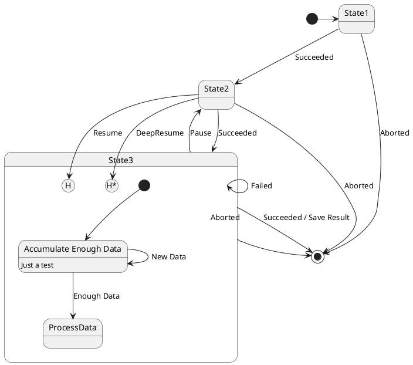

### Fork [fork, join]
You can also fork and join using the `<<fork>> `and `<<join>>` stereotypes.

```java
@startuml

state fork_state <<fork>>
[*] --> fork_state
fork_state --> State2
fork_state --> State3

state join_state <<join>>
State2 --> join_state
State3 --> join_state
join_state --> State4
State4 --> [*]

@enduml
```
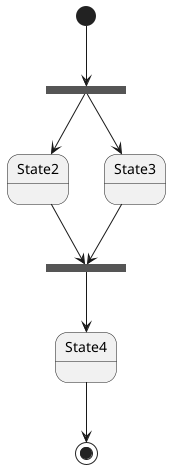

### Concurrent state [--, ||]
You can define concurrent state into a composite state using either `--` or `||` symbol as separator.

#### Horizontal separator `--`
```java
@startuml
[*] --> Active

state Active {
  [*] -> NumLockOff
  NumLockOff --> NumLockOn : EvNumLockPressed
  NumLockOn --> NumLockOff : EvNumLockPressed
  --
  [*] -> CapsLockOff
  CapsLockOff --> CapsLockOn : EvCapsLockPressed
  CapsLockOn --> CapsLockOff : EvCapsLockPressed
  --
  [*] -> ScrollLockOff
  ScrollLockOff --> ScrollLockOn : EvCapsLockPressed
  ScrollLockOn --> ScrollLockOff : EvCapsLockPressed
}

@enduml
```
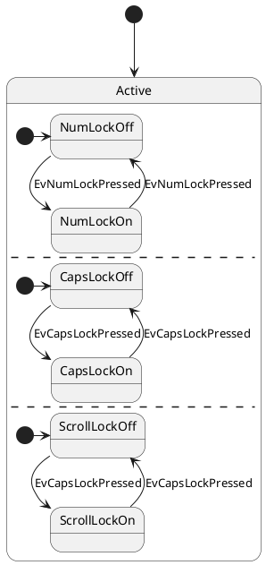

#### Vertical separator `||`
```java
@startuml
[*] --> Active

state Active {
  [*] -> NumLockOff
  NumLockOff --> NumLockOn : EvNumLockPressed
  NumLockOn --> NumLockOff : EvNumLockPressed
  ||
  [*] -> CapsLockOff
  CapsLockOff --> CapsLockOn : EvCapsLockPressed
  CapsLockOn --> CapsLockOff : EvCapsLockPressed
  ||
  [*] -> ScrollLockOff
  ScrollLockOff --> ScrollLockOn : EvCapsLockPressed
  ScrollLockOn --> ScrollLockOff : EvCapsLockPressed
}

@enduml
```
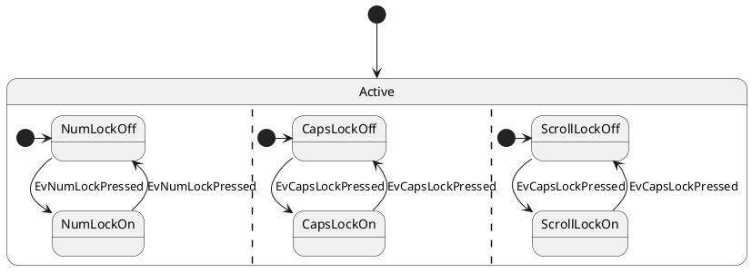

### Conditional [choice]
The stereotype `<<choice>>` can be used to use conditional state.

```java
@startuml
state "Req(Id)" as ReqId <<sdlreceive>>
state "Minor(Id)" as MinorId
state "Major(Id)" as MajorId
 
state c <<choice>>
 
Idle --> ReqId
ReqId --> c
c --> MinorId : [Id <= 10]
c --> MajorId : [Id > 10]
@enduml
```
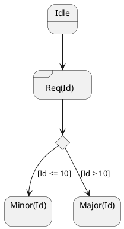

### Stereotypes full example [choice, fork, join, end]
```java
@startuml
state choice1 <<choice>>
state fork1   <<fork>>
state join2   <<join>>
state end3    <<end>>

[*]     --> choice1 : from start\nto choice
choice1 --> fork1   : from choice\nto fork
choice1 --> join2   : from choice\nto join
choice1 --> end3    : from choice\nto end

fork1   ---> State1 : from fork\nto state
fork1   --> State2  : from fork\nto state

State2  --> join2   : from state\nto join
State1  --> [*]     : from state\nto end

join2   --> [*]     : from join\nto end
@enduml
```
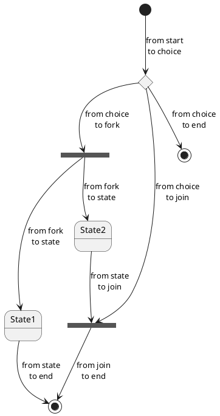

### Point [entryPoint, exitPoint]
You can added point with `<<entryPoint>>` and `<<exitPoint>>` stereotypes:

```java
@startuml
state Somp {
  state entry1 <<entryPoint>>
  state entry2 <<entryPoint>>
  state sin
  entry1 --> sin
  entry2 -> sin
  sin -> sin2
  sin2 --> exitA <<exitPoint>>
}

[*] --> entry1
exitA --> Foo
Foo1 -> entry2
@enduml
```
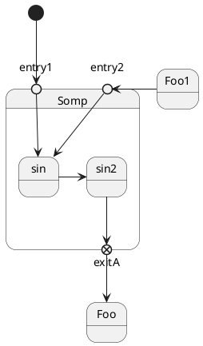

### Pin [inputPin, outputPin]
You can added **pin** with `<<inputPin>>` and `<<outputPin>>` stereotypes:

```java
@startuml
state Somp {
  state entry1 <<inputPin>>
  state entry2 <<inputPin>>
  state sin
  entry1 --> sin
  entry2 -> sin
  sin -> sin2
  sin2 --> exitA <<outputPin>>
}

[*] --> entry1
exitA --> Foo
Foo1 -> entry2
@enduml
```
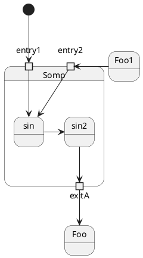

### Expansion [expansionInput, expansionOutput]
You can added **expansion** with `<<expansionInput>>` and `<<expansionOutput>>` stereotypes:

```java
@startuml
state Somp {
  state entry1 <<expansionInput>>
  state entry2 <<expansionInput>>
  state sin
  entry1 --> sin
  entry2 -> sin
  sin -> sin2
  sin2 --> exitA <<expansionOutput>>
}

[*] --> entry1
exitA --> Foo
Foo1 -> entry2
@enduml
```
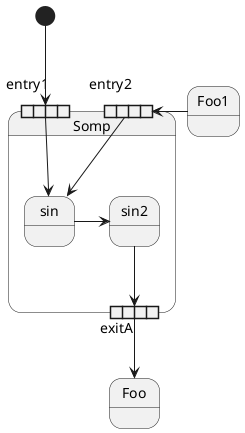

### Arrow direction
You can use `->` for horizontal arrows. It is possible to force arrow's direction using the following syntax:
* `-down->` or `-->`
* `-right->` or `->` *(default arrow)*
* `-left->`
* `-up->`

```java
@startuml

[*] -up-> First
First -right-> Second
Second --> Third
Third -left-> Last

@enduml
```
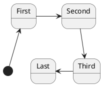

You can shorten the arrow definition by using only the first character of the direction (for example, `-d-` instead of `-down-`) or the two first characters (`-do-`).

Please note that you should not abuse this functionality : *Graphviz gives usually good results without tweaking*.

### Change line color and style
You can change line [color](https://plantuml.com/ko/color) and/or line style.

```java
@startuml
State S1
State S2
S1 -[#DD00AA]-> S2
S1 -left[#yellow]-> S3
S1 -up[#red,dashed]-> S4
S1 -right[dotted,#blue]-> S5

X1 -[dashed]-> X2
Z1 -[dotted]-> Z2
Y1 -[#blue,bold]-> Y2
@enduml
```
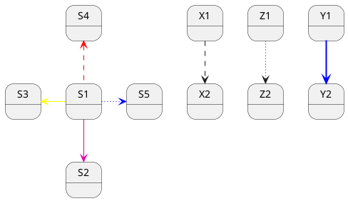

### Note
You can also define notes using `note left of`, `note right of`, `note top of`, `note bottom of` keywords.
You can also define notes on several lines.

```java
@startuml

[*] --> Active
Active --> Inactive

note left of Active : this is a short\nnote

note right of Inactive
  A note can also
  be defined on
  several lines
end note

@enduml
```
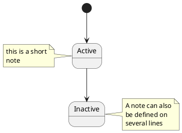

You can also have floating notes.
```java
@startuml

state foo
note "This is a floating note" as N1

@enduml
```
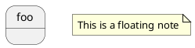

### Note on link
You can put notes on state-transition or link, with `note on link` keyword.

```java
@startuml
[*] -> State1
State1 --> State2
note on link 
  this is a state-transition note 
end note
@enduml
```
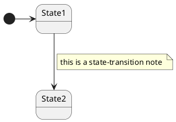

### More in notes
You can put notes on composite states.

```java
@startuml

[*] --> NotShooting

state "Not Shooting State" as NotShooting {
  state "Idle mode" as Idle
  state "Configuring mode" as Configuring
  [*] --> Idle
  Idle --> Configuring : EvConfig
  Configuring --> Idle : EvConfig
}

note right of NotShooting : This is a note on a composite state

@enduml
```
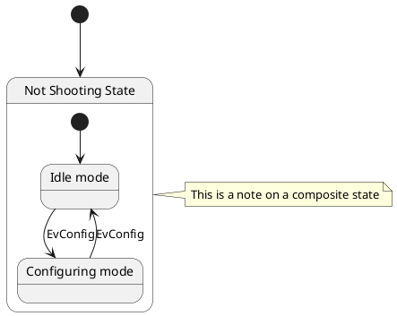

### Inline color
```java
@startuml
state CurrentSite #pink {
    state HardwareSetup #lightblue {
       state Site #brown
        Site -[hidden]-> Controller
        Controller -[hidden]-> Devices
    }
    state PresentationSetup{
        Groups -[hidden]-> PlansAndGraphics
    }
    state Trends #FFFF77
    state Schedule #magenta
    state AlarmSupression
}
@enduml
```
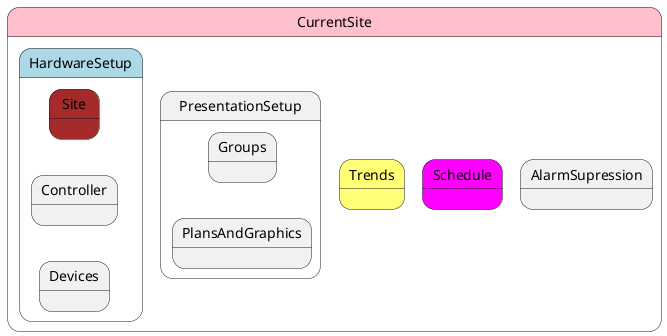

### Skinparam
You can use the [skinparam](https://plantuml.com/ko/skinparam) command to change colors and fonts for the drawing.

You can use this command :
* In the diagram definition, like any other commands,
* In an [included file](https://plantuml.com/ko/preprocessing),
* In a configuration file, provided in the [command line](https://plantuml.com/ko/command-line) or the [Ant task](https://plantuml.com/ko/ant-task).

You can define specific color and fonts for stereotyped states.

```java
@startuml
skinparam backgroundColor LightYellow
skinparam state {
  StartColor MediumBlue
  EndColor Red
  BackgroundColor Peru
  BackgroundColor<<Warning>> Olive
  BorderColor Gray
  FontName Impact
}

[*] --> NotShooting

state "Not Shooting State" as NotShooting {
  state "Idle mode" as Idle <<Warning>>
  state "Configuring mode" as Configuring
  [*] --> Idle
  Idle --> Configuring : EvConfig
  Configuring --> Idle : EvConfig
}

NotShooting --> [*]
@enduml
```
```plantuml
@startuml
skinparam backgroundColor LightYellow
skinparam state {
  StartColor MediumBlue
  EndColor Red
  BackgroundColor Peru
  BackgroundColor<<Warning>> Olive
  BorderColor Gray
  FontName Impact
}

[*] --> NotShooting

state "Not Shooting State" as NotShooting {
  state "Idle mode" as Idle <<Warning>>
  state "Configuring mode" as Configuring
  [*] --> Idle
  Idle --> Configuring : EvConfig
  Configuring --> Idle : EvConfig
}

NotShooting --> [*]
@enduml
```

#### Test of all specific skinparam to State Diagrams
```java
@startuml
skinparam State {
  AttributeFontColor blue
  AttributeFontName serif
  AttributeFontSize  9
  AttributeFontStyle italic
  BackgroundColor palegreen
  BorderColor violet
  EndColor gold
  FontColor red
  FontName Sanserif
  FontSize 15
  FontStyle bold
  StartColor silver
}

state A : a a a\na
state B : b b b\nb

[*] -> A  : start
A -> B : a2b
B -> [*] : end
@enduml
```
```plantuml
@startuml
skinparam State {
  AttributeFontColor blue
  AttributeFontName serif
  AttributeFontSize  9
  AttributeFontStyle italic
  BackgroundColor palegreen
  BorderColor violet
  EndColor gold
  FontColor red
  FontName Sanserif
  FontSize 15
  FontStyle bold
  StartColor silver
}

state A : a a a\na
state B : b b b\nb

[*] -> A  : start
A -> B : a2b
B -> [*] : end
@enduml
```

### Changing style
You can change [style](https://plantuml.com/ko/style-evolution).

```java
@startuml

<style>
stateDiagram {
  BackgroundColor Peru
  'LineColor Gray
  FontName Impact
  FontColor Red
  arrow {
    FontSize 13
    LineColor Blue
  }
}
</style>


[*] --> NotShooting

state "Not Shooting State" as NotShooting {
  state "Idle mode" as Idle <<Warning>>
  state "Configuring mode" as Configuring
  [*] --> Idle
  Idle --> Configuring : EvConfig
  Configuring --> Idle : EvConfig
}

NotShooting --> [*]
@enduml
```
```plantuml
@startuml

<style>
stateDiagram {
  BackgroundColor Peru
  'LineColor Gray
  FontName Impact
  FontColor Red
  arrow {
    FontSize 13
    LineColor Blue
  }
}
</style>


[*] --> NotShooting

state "Not Shooting State" as NotShooting {
  state "Idle mode" as Idle <<Warning>>
  state "Configuring mode" as Configuring
  [*] --> Idle
  Idle --> Configuring : EvConfig
  Configuring --> Idle : EvConfig
}

NotShooting --> [*]
@enduml
```

### Change state color and style (inline style)
You can change the [color](https://plantuml.com/ko/color) or style of individual state using the following notation:
* `#color ##[style]color`

With background color first (`#color`), then line style and line color (`##[style]color`).

```java
@startuml
state FooGradient #red-green ##00FFFF
state FooDashed #red|green ##[dashed]blue {
}
state FooDotted ##[dotted]blue {
}
state FooBold ##[bold] {
}
state Foo1 ##[dotted]green {
state inner1 ##[dotted]yellow
}

state out ##[dotted]gold

state Foo2 ##[bold]green {
state inner2 ##[dotted]yellow
}
inner1 -> inner2
out -> inner2
@enduml
```
```plantuml
@startuml
state FooGradient #red-green ##00FFFF
state FooDashed #red|green ##[dashed]blue {
}
state FooDotted ##[dotted]blue {
}
state FooBold ##[bold] {
}
state Foo1 ##[dotted]green {
state inner1 ##[dotted]yellow
}

state out ##[dotted]gold

state Foo2 ##[bold]green {
state inner2 ##[dotted]yellow
}
inner1 -> inner2
out -> inner2
@enduml
```

* `#color;line:color;line.[bold|dashed|dotted];text:color`

```java
@startuml
state FooGradient #red-green;line:00FFFF
state FooDashed #red|green;line.dashed;line:blue {
}
state FooDotted #line.dotted;line:blue {
}
state FooBold #line.bold {
}
state Foo1 #line.dotted;line:green {
state inner1 #line.dotted;line:yellow
}

state out #line.dotted;line:gold

state Foo2 #line.bold;line:green {
state inner2 #line.dotted;line:yellow
}
inner1 -> inner2
out -> inner2
@enduml
```
```plantuml
@startuml
state FooGradient #red-green;line:00FFFF
state FooDashed #red|green;line.dashed;line:blue {
}
state FooDotted #line.dotted;line:blue {
}
state FooBold #line.bold {
}
state Foo1 #line.dotted;line:green {
state inner1 #line.dotted;line:yellow
}

state out #line.dotted;line:gold

state Foo2 #line.bold;line:green {
state inner2 #line.dotted;line:yellow
}
inner1 -> inner2
out -> inner2
@enduml
```

```java
@startuml
state s1 : s1 description
state s2 #pink;line:red;line.bold;text:red : s2 description
state s3 #palegreen;line:green;line.dashed;text:green : s3 description
state s4 #aliceblue;line:blue;line.dotted;text:blue   : s4 description
@enduml
```
```plantuml
@startuml
state s1 : s1 description
state s2 #pink;line:red;line.bold;text:red : s2 description
state s3 #palegreen;line:green;line.dashed;text:green : s3 description
state s4 #aliceblue;line:blue;line.dotted;text:blue   : s4 description
@enduml
```

### Alias
With State you can use `alias`, like:

```java
@startuml
state alias1 
state "alias2"
state "long name" as alias3
state alias4 as "long name"

alias1 : ""state alias1""
alias2 : ""state "alias2"""
alias3 : ""state "long name" as alias3""
alias4 : ""state alias4 as "long name"""

alias1 -> alias2
alias2 -> alias3
alias3 -> alias4
@enduml
```
```plantuml
@startuml
state alias1 
state "alias2"
state "long name" as alias3
state alias4 as "long name"

alias1 : ""state alias1""
alias2 : ""state "alias2"""
alias3 : ""state "long name" as alias3""
alias4 : ""state alias4 as "long name"""

alias1 -> alias2
alias2 -> alias3
alias3 -> alias4
@enduml
```

or:

```java
@startuml
state alias1 : ""state alias1""
state "alias2" : ""state "alias2"""
state "long name" as alias3 : ""state "long name" as alias3""
state alias4 as "long name" : ""state alias4 as "long name"""

alias1 -> alias2
alias2 -> alias3
alias3 -> alias4
@enduml
```
```plantuml
@startuml
state alias1 : ""state alias1""
state "alias2" : ""state "alias2"""
state "long name" as alias3 : ""state "long name" as alias3""
state alias4 as "long name" : ""state alias4 as "long name"""

alias1 -> alias2
alias2 -> alias3
alias3 -> alias4
@enduml
```

