# [Plant UML](https://plantuml.com/ko/)

PlantUML 은 다이어그램을 빠르게 작성하기 위한 오픈 소스 프로젝트입니다.

## Timing 다이어그램
This is still under construction. You can propose new features if you need some.

### Declaring element or participant
You declare participant using the following keywords, depending on how you want them to be drawn.

Keyword	| Description
|---|---|
`concise`	| A simplified signal designed to show the movement of data (great for messages)
`robust`	| A complex line signal designed to show the transition from one state to another (can have many states)
`clock`	| A clocked signal that repeatedly transitions from high to low, with a `period`, and an optional `pulse` and `offset`
`binary`	| A specific signal restricted to only 2 states (`binary`)

You define state change using the `@` notation, and the `is` verb.

```java
@startuml
robust "Web Browser" as WB
concise "Web User" as WU

@0
WU is Idle
WB is Idle

@100
WU is Waiting
WB is Processing

@300
WB is Waiting
@enduml
```
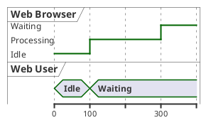

```java
@startuml
clock   "Clock_0"   as C0 with period 50
clock   "Clock_1"   as C1 with period 50 pulse 15 offset 10
binary  "Binary"  as B
concise "Concise" as C
robust  "Robust"  as R


@0
C is Idle
R is Idle

@100
B is high
C is Waiting
R is Processing

@300
R is Waiting
@enduml
```
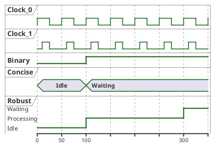

### Binary and Clock
It's also possible to have binary and clock signal, using the following keywords:
* `binary`
* `clock`

```java
@startuml
clock clk with period 1
binary "Enable" as EN

@0
EN is low

@5
EN is high

@10
EN is low
@enduml
```
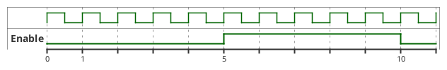

### Adding message
You can add message using the following syntax.

```java
@startuml
robust "Web Browser" as WB
concise "Web User" as WU

@0
WU is Idle
WB is Idle

@100
WU -> WB : URL
WU is Waiting
WB is Processing

@300
WB is Waiting
@enduml
```
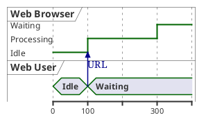

### Relative time
It is possible to use relative time with `@`.

```java
@startuml
robust "DNS Resolver" as DNS
robust "Web Browser" as WB
concise "Web User" as WU

@0
WU is Idle
WB is Idle
DNS is Idle

@+100
WU -> WB : URL
WU is Waiting
WB is Processing

@+200
WB is Waiting
WB -> DNS@+50 : Resolve URL

@+100
DNS is Processing

@+300
DNS is Idle
@enduml
```
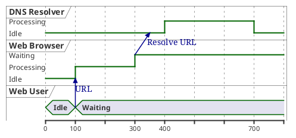

### Anchor Points
Instead of using absolute or relative time on an absolute time you can define a time as an anchor point by using the as keyword and starting the name with a :.

`@XX as :<anchor point name>`

```java
@startuml
clock clk with period 1
binary "enable" as EN
concise "dataBus" as db

@0 as :start
@5 as :en_high 
@10 as :en_low
@:en_high-2 as :en_highMinus2

@:start
EN is low
db is "0x0000"

@:en_high
EN is high

@:en_low
EN is low

@:en_highMinus2
db is "0xf23a"

@:en_high+6
db is "0x0000"
@enduml
```
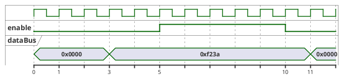

### Participant oriented
Rather than declare the diagram in chronological order, you can define it by participant.

```java
@startuml
robust "Web Browser" as WB
concise "Web User" as WU

@WB
0 is idle
+200 is Proc.
+100 is Waiting

@WU
0 is Waiting
+500 is ok
@enduml
```
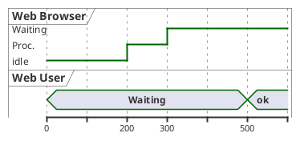

### Setting scale
You can also set a specific scale.

```java
@startuml
concise "Web User" as WU
scale 100 as 50 pixels

@WU
0 is Waiting
+500 is ok
@enduml
```
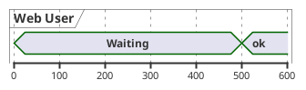

### Initial state
You can also define an inital state.

```java
@startuml
robust "Web Browser" as WB
concise "Web User" as WU

WB is Initializing
WU is Absent

@WB
0 is idle
+200 is Processing
+100 is Waiting

@WU
0 is Waiting
+500 is ok
@enduml
```
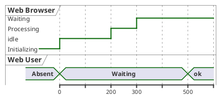

### Intricated state
A signal could be in some undefined state.

```java
@startuml
robust "Signal1" as S1
robust "Signal2" as S2
S1 has 0,1,2,hello
S2 has 0,1,2
@0
S1 is 0
S2 is 0
@100
S1 is {0,1} #SlateGrey
S2 is {0,1}
@200
S1 is 1
S2 is 0
@300
S1 is hello
S2 is {0,2}
@enduml
```
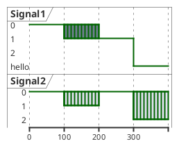

### Hidden state
It is also possible to hide some state.

```java
@startuml
concise "Web User" as WU

@0
WU is {-}

@100
WU is A1

@200
WU is {-}

@300
WU is {hidden}

@400
WU is A3

@500
WU is {-}
@enduml
```
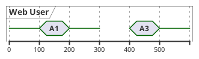

```java
@startuml
scale 1 as 50 pixels

concise state0
concise substate1
robust bit2

bit2 has HIGH,LOW

@state0
0 is 18_start
6 is s_dPause
8 is 10_data
14 is {hidden}

@substate1
0 is sSeq
4 is sPause
6 is {hidden}
8 is dSeq
12 is dPause
14 is {hidden}

@bit2
0 is HIGH
2 is LOW
4 is {hidden}
8 is HIGH
10 is LOW
12 is {hidden}
@enduml
```
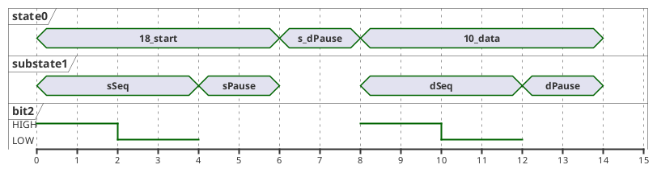

### Hide time axis
It is possible to hide time axis.

```java
@startuml
hide time-axis
concise "Web User" as WU

WU is Absent

@WU
0 is Waiting
+500 is ok
@enduml
```
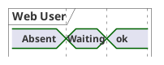

### Using Time and Date
It is possible to use time or date.

```java
@startuml
robust "Web Browser" as WB
concise "Web User" as WU

@2019/07/02
WU is Idle
WB is Idle

@2019/07/04
WU is Waiting : some note
WB is Processing : some other note

@2019/07/05
WB is Waiting
@enduml
```
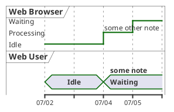

```java
@startuml
robust "Web Browser" as WB
concise "Web User" as WU

@1:15:00
WU is Idle
WB is Idle

@1:16:30
WU is Waiting : some note
WB is Processing : some other note

@1:17:30
WB is Waiting
@enduml
```
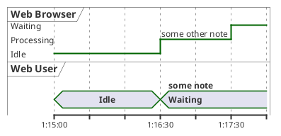

### Adding constraint
It is possible to display time constraints on the diagrams.

```java
@startuml
robust "Web Browser" as WB
concise "Web User" as WU

WB is Initializing
WU is Absent

@WB
0 is idle
+200 is Processing
+100 is Waiting
WB@0 <-> @50 : {50 ms lag}

@WU
0 is Waiting
+500 is ok
@200 <-> @+150 : {150 ms}
@enduml
```
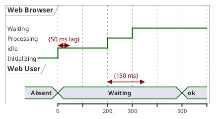

### Highlighted period

You can higlight a part of diagram.

```java
@startuml
robust "Web Browser" as WB
concise "Web User" as WU

@0
WU is Idle
WB is Idle

@100
WU -> WB : URL
WU is Waiting #LightCyan;line:Aqua

@200
WB is Proc.

@300
WU -> WB@350 : URL2
WB is Waiting

@+200
WU is ok

@+200
WB is Idle

highlight 200 to 450 #Gold;line:DimGrey : This is my caption
@enduml
```
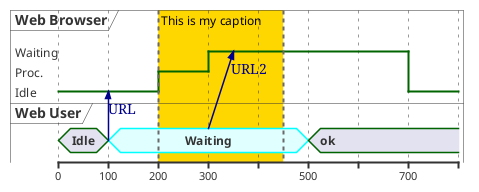

### Using notes

You can use the `note top of` and `note bottom of` keywords to define notes related to a single object or participant *(available only for `concise` object)*.

```java
@startuml
robust "Web Browser" as WB
concise "Web User" as WU

@0
WU is Idle
WB is Idle

@100
WU is Waiting
WB is Processing
note top of WU : first note\non several\nlines
note bottom of WU : second note\non several\nlines

@300
WB is Waiting
@enduml
```
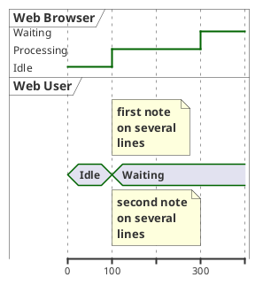

### Adding texts
You can optionally add a title, a header, a footer, a legend and a caption:

```java
@startuml
Title This is my title
header: some header
footer: some footer
legend
Some legend
end legend
caption some caption

robust "Web Browser" as WB
concise "Web User" as WU

@0
WU is Idle
WB is Idle

@100
WU is Waiting
WB is Processing

@300
WB is Waiting
@enduml
```
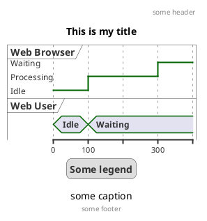

### Complete example

Thanks to [Adam Rosien](https://twitter.com/arosien) for this example.

```java
@startuml
concise "Client" as Client
concise "Server" as Server
concise "Response freshness" as Cache

Server is idle
Client is idle

@Client
0 is send
Client -> Server@+25 : GET
+25 is await
+75 is recv
+25 is idle
+25 is send
Client -> Server@+25 : GET\nIf-Modified-Since: 150
+25 is await
+50 is recv
+25 is idle
@100 <-> @275 : no need to re-request from server

@Server
25 is recv
+25 is work
+25 is send
Server -> Client@+25 : 200 OK\nExpires: 275
+25 is idle
+75 is recv
+25 is send
Server -> Client@+25 : 304 Not Modified
+25 is idle

@Cache
75 is fresh
+200 is stale
@enduml
```
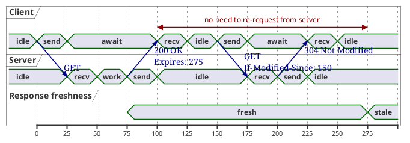

### Digital Example
```java
@startuml
scale 5 as 150 pixels

clock clk with period 1
binary "enable" as en
binary "R/W" as rw
binary "data Valid" as dv
concise "dataBus" as db
concise "address bus" as addr

@6 as :write_beg
@10 as :write_end

@15 as :read_beg
@19 as :read_end


@0
en is low
db is "0x0"
addr is "0x03f"
rw is low
dv is 0

@:write_beg-3
 en is high
@:write_beg-2
 db is "0xDEADBEEF"
@:write_beg-1
dv is 1
@:write_beg
rw is high


@:write_end
rw is low
dv is low
@:write_end+1
rw is low
db is "0x0"
addr is "0x23"

@12
dv is high
@13 
db is "0xFFFF"

@20
en is low
dv is low
@21 
db is "0x0"

highlight :write_beg to :write_end #Gold:Write
highlight :read_beg to :read_end #lightBlue:Read

db@:write_beg-1 <-> @:write_end : setup time
db@:write_beg-1 -> addr@:write_end+1 : hold
@enduml
```
```plantuml
@startuml
scale 5 as 150 pixels

clock clk with period 1
binary "enable" as en
binary "R/W" as rw
binary "data Valid" as dv
concise "dataBus" as db
concise "address bus" as addr

@6 as :write_beg
@10 as :write_end

@15 as :read_beg
@19 as :read_end


@0
en is low
db is "0x0"
addr is "0x03f"
rw is low
dv is 0

@:write_beg-3
 en is high
@:write_beg-2
 db is "0xDEADBEEF"
@:write_beg-1
dv is 1
@:write_beg
rw is high


@:write_end
rw is low
dv is low
@:write_end+1
rw is low
db is "0x0"
addr is "0x23"

@12
dv is high
@13 
db is "0xFFFF"

@20
en is low
dv is low
@21 
db is "0x0"

highlight :write_beg to :write_end #Gold:Write
highlight :read_beg to :read_end #lightBlue:Read

db@:write_beg-1 <-> @:write_end : setup time
db@:write_beg-1 -> addr@:write_end+1 : hold
@enduml
```

### Adding color

You can add [color](https://plantuml.com/color).

```java
@startuml
concise "LR" as LR
concise "ST" as ST

LR is AtPlace #palegreen
ST is AtLoad #gray

@LR
0 is Lowering
100 is Lowered #pink
350 is Releasing
 
@ST
200 is Moving
@enduml
```
```plantuml
@startuml
concise "LR" as LR
concise "ST" as ST

LR is AtPlace #palegreen
ST is AtLoad #gray

@LR
0 is Lowering
100 is Lowered #pink
350 is Releasing
 
@ST
200 is Moving
@enduml
```

### Using (global) style

#### Without style *(by default)*

```java
@startuml
robust "Web Browser" as WB
concise "Web User" as WU

WB is Initializing
WU is Absent

@WB
0 is idle
+200 is Processing
+100 is Waiting
WB@0 <-> @50 : {50 ms lag}

@WU
0 is Waiting
+500 is ok
@200 <-> @+150 : {150 ms}
@enduml
```
```plantuml
@startuml
robust "Web Browser" as WB
concise "Web User" as WU

WB is Initializing
WU is Absent

@WB
0 is idle
+200 is Processing
+100 is Waiting
WB@0 <-> @50 : {50 ms lag}

@WU
0 is Waiting
+500 is ok
@200 <-> @+150 : {150 ms}
@enduml
```

#### With style

You can use [style](https://plantuml.com/style-evolution) to change rendering of elements.

```java
@startuml
<style>
timingDiagram {
  document {
    BackGroundColor SandyBrown
  }
 constraintArrow {
  LineStyle 2-1
  LineThickness 3
  LineColor Blue
 }
}
</style>
robust "Web Browser" as WB
concise "Web User" as WU

WB is Initializing
WU is Absent

@WB
0 is idle
+200 is Processing
+100 is Waiting
WB@0 <-> @50 : {50 ms lag}

@WU
0 is Waiting
+500 is ok
@200 <-> @+150 : {150 ms}
@enduml
```
```plantuml
@startuml
<style>
timingDiagram {
  document {
    BackGroundColor SandyBrown
  }
 constraintArrow {
  LineStyle 2-1
  LineThickness 3
  LineColor Blue
 }
}
</style>
robust "Web Browser" as WB
concise "Web User" as WU

WB is Initializing
WU is Absent

@WB
0 is idle
+200 is Processing
+100 is Waiting
WB@0 <-> @50 : {50 ms lag}

@WU
0 is Waiting
+500 is ok
@200 <-> @+150 : {150 ms}
@enduml
```


