# [Plant UML](https://plantuml.com/ko/)

PlantUML 은 다이어그램을 빠르게 작성하기 위한 오픈 소스 프로젝트입니다.

## Display JSON Data

[JSON](https://en.wikipedia.org/wiki/JSON) format is widely used in software.

You can use PlantUML to visualize your data.
To activate this feature, the diagram must:
* begin with `@startjson` keyword
* end with `@endjson` keyword.

```java
@startjson
{
   "fruit":"Apple",
   "size":"Large",
   "color":"Red"
}
@endjson
```


### Complex example
You can use complex JSON structure.

```java
@startjson
{
  "firstName": "John",
  "lastName": "Smith",
  "isAlive": true,
  "age": 27,
  "address": {
    "streetAddress": "21 2nd Street",
    "city": "New York",
    "state": "NY",
    "postalCode": "10021-3100"
  },
  "phoneNumbers": [
    {
      "type": "home",
      "number": "212 555-1234"
    },
    {
      "type": "office",
      "number": "646 555-4567"
    }
  ],
  "children": [],
  "spouse": null
}
@endjson
```


### Highlight parts
```java
@startjson
#highlight "lastName"
#highlight "address" / "city"
#highlight "phoneNumbers" / "0" / "number"
{
  "firstName": "John",
  "lastName": "Smith",
  "isAlive": true,
  "age": 28,
  "address": {
    "streetAddress": "21 2nd Street",
    "city": "New York",
    "state": "NY",
    "postalCode": "10021-3100"
  },
  "phoneNumbers": [
    {
      "type": "home",
      "number": "212 555-1234"
    },
    {
      "type": "office",
      "number": "646 555-4567"
    }
  ],
  "children": [],
  "spouse": null
}
@endjson
```


### JSON basic element
Synthesis of all JSON basic element

```java
@startjson
{
"null": null,
"true": true,
"false": false,
"JSON_Number": [-1, -1.1, "<color:green>TBC"],
"JSON_String": "a\nb\rc\td <color:green>TBC...",
"JSON_Object": {
  "{}": {},
  "k_int": 123,
  "k_str": "abc",
  "k_obj": {"k": "v"}
},
"JSON_Array" : [
  [],
  [true, false],
  [-1, 1],
  ["a", "b", "c"],
  ["mix", null, true, 1, {"k": "v"}]
]
}
@endjson
```


### JSON array or table

#### Array type
```java
@startjson
{
"Numeric": [1, 2, 3],
"String ": ["v1a", "v2b", "v3c"],
"Boolean": [true, false, true]
}
@endjson
```


#### Minimal array or table

##### Number array
```java
@startjson
[1, 2, 3]
@endjson
```


##### String array
```java
@startjson
["1a", "2b", "3c"]
@endjson
```


##### Boolean array
```java
@startjson
[true, false, true]
@endjson
```


### JSON numbers
```java
@startjson
{
"DecimalNumber": [-1, 0, 1],
"DecimalNumber . Digits": [-1.1, 0.1, 1.1],
"DecimalNumber ExponentPart": [1E5]
}
@endjson
```


### JSON strings

#### JSON Unicode
On JSON you can use Unicode directly or by using escaped form like `\uXXXX`.

```java
@startjson
{
  "<color:blue><b>code": "<color:blue><b>value",
  "a\\u005Cb":           "a\u005Cb",
  "\\uD83D\\uDE10":      "\uD83D\uDE10",
  "😐":                  "😐"
}
@endjson
```


```plantuml
@startjson
{
  "<color:blue><b>code": "<color:blue><b>value",
  "a\\u005Cb":           "a\u005Cb",
  "\\uD83D\\uDE10":      "\uD83D\uDE10",
  "😐":                  "😐"
}
@endjson
```

#### JSON two-character escape sequence
```java
@startjson
{
 "**legend**: character name":               ["**two-character escape sequence**", "example (between 'a' and 'b')"],
 "quotation mark character (U+0022)":        ["\\\"", "a\"b"],
 "reverse solidus character (U+005C)":       ["\\\\", "a\\b"],
 "solidus character (U+002F)":               ["\\\/", "a\/b"],
 "backspace character (U+0008)":             ["\\b", "a\bb"],
 "form feed character (U+000C)":             ["\\f", "a\fb"],
 "line feed character (U+000A)":             ["\\n", "a\nb"],
 "carriage return character (U+000D)":       ["\\r", "a\rb"],
 "character tabulation character (U+0009)":  ["\\t", "a\tb"]
}
@endjson
```


FIXME or not 😉, on the same item as `\n` management in PlantUML 😉
```java
@startjson
[
"\\\\",
"\\n",
"\\r",
"\\t"
]
@endjson
```


### Minimal JSON examples

#### Example 1
```java
@startjson
"Hello world!"
@endjson
```


#### Example 2
```java
@startjson
42
@endjson
```


#### Example 3
```java
@startjson
true
@endjson
```


### Empty table or list
```java
@startjson
{
  "empty_tab": [],
  "empty_list": {}
}
@endjson
```


### Using (global) style

#### Without style (by default)
```java
@startjson
#highlight "1" / "hr"
[
  {
    "name": "Mark McGwire",
    "hr":   65,
    "avg":  0.278
  },
  {
    "name": "Sammy Sosa",
    "hr":   63,
    "avg":  0.288
  }
]
@endjson
```


#### With style
You can use [style](https://plantuml.com/ko/style-evolution) to change rendering of elements.

```java
@startjson
<style>
jsonDiagram {
  node {
    BackGroundColor Khaki
    LineColor lightblue
    FontName Helvetica
    FontColor red
    FontSize 18
    FontStyle bold
    RoundCorner 0
    LineThickness 2
    LineStyle 10;5
    separator {
      LineThickness 0.5
      LineColor black
      LineStyle 1;5
    }
  }
  arrow {
    BackGroundColor lightblue
    LineColor green
    LineThickness 2
    LineStyle 2;5
  }
  highlight {
    BackGroundColor red
    FontColor white
    FontStyle italic
  }
}
</style>
#highlight "1" / "hr"
[
  {
    "name": "Mark McGwire",
    "hr":   65,
    "avg":  0.278
  },
  {
    "name": "Sammy Sosa",
    "hr":   63,
    "avg":  0.288
  }
]
@endjson
```

