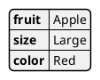
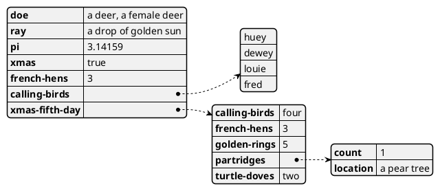
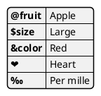
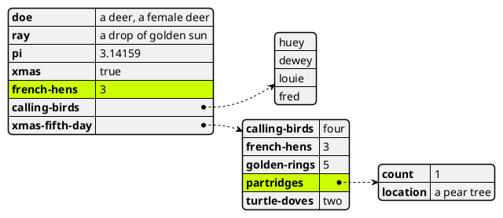
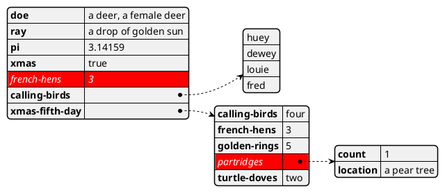
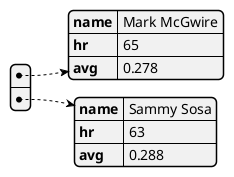

# [Plant UML](https://plantuml.com/ko/)

PlantUML 은 다이어그램을 빠르게 작성하기 위한 오픈 소스 프로젝트입니다.

## Display YAML Data

[YAML](https://en.wikipedia.org/wiki/YAML) format is widely used in software.
You can use PlantUML to visualize your data.

To activate this feature, the diagram must:
* begin with `@startyaml` keyword
* end with `@endyaml` keyword.

```yaml
@startyaml
fruit: Apple
size: Large
color: Red
@endyaml
```


### Complex example
```yaml
@startyaml
doe: "a deer, a female deer"
ray: "a drop of golden sun"
pi: 3.14159
xmas: true
french-hens: 3
calling-birds: 
  - huey
  - dewey
  - louie
  - fred
xmas-fifth-day: 
  calling-birds: four
  french-hens: 3
  golden-rings: 5
  partridges: 
    count: 1
    location: "a pear tree"
  turtle-doves: two
@endyaml
```


### Specific key (with symbols or unicode)
```yaml
@startyaml
@fruit: Apple
$size: Large
&color: Red
❤: Heart
‰: Per mille
@endyaml
```



### Highlight parts

#### Normal style

```yaml
@startyaml
#highlight "french-hens"
#highlight "xmas-fifth-day" / "partridges"

doe: "a deer, a female deer"
ray: "a drop of golden sun"
pi: 3.14159
xmas: true
french-hens: 3
calling-birds: 
	- huey
	- dewey
	- louie
	- fred
xmas-fifth-day: 
	calling-birds: four
	french-hens: 3
	golden-rings: 5
	partridges: 
		count: 1
		location: "a pear tree"
	turtle-doves: two
@endyaml
```


#### Customised style
```yaml
@startyaml
<style>
yamlDiagram {
    highlight {
      BackGroundColor red
      FontColor white
      FontStyle italic
    }
}
</style>
#highlight "french-hens"
#highlight "xmas-fifth-day" / "partridges"

doe: "a deer, a female deer"
ray: "a drop of golden sun"
pi: 3.14159
xmas: true
french-hens: 3
calling-birds: 
	- huey
	- dewey
	- louie
	- fred
xmas-fifth-day: 
	calling-birds: four
	french-hens: 3
	golden-rings: 5
	partridges: 
		count: 1
		location: "a pear tree"
	turtle-doves: two
@endyaml
```


### Using (global) style

#### Without style (by default)

```yaml
@startyaml
  -
    name: Mark McGwire
    hr:   65
    avg:  0.278
  -
    name: Sammy Sosa
    hr:   63
    avg:  0.288
@endyaml
```


#### With style

You can use [style](https://plantuml.com/ko/style-evolution) to change rendering of elements.

```yaml
@startyaml
<style>
yamlDiagram {
  node {
    BackGroundColor lightblue
    LineColor lightblue
    FontName Helvetica
    FontColor red
    FontSize 18
    FontStyle bold
    BackGroundColor Khaki
    RoundCorner 0
    LineThickness 2
    LineStyle 10;5
    separator {
      LineThickness 0.5
      LineColor black
      LineStyle 1;5
    }
  }
  arrow {
    BackGroundColor lightblue
    LineColor green
    LineThickness 2
    LineStyle 2;5
  }
}
</style>
  -
    name: Mark McGwire
    hr:   65
    avg:  0.278
  -
    name: Sammy Sosa
    hr:   63
    avg:  0.288
@endyaml
```

