# [Plant UML](https://plantuml.com/ko/)

PlantUML 은 다이어그램을 빠르게 작성하기 위한 오픈 소스 프로젝트입니다.

## 네트워크 다이어그램
[`nwdiag`](http://blockdiag.com/en/nwdiag/nwdiag-examples.html) has been created by [Takeshi Komiya](https://twitter.com/tk0miya) and allows to quickly draw network diagrams. So we thank him for his creation!
Since the syntax is clear and simple, this has been integrated within PlantUML. We reuse here the examples that Takeshi has documented.

### Simple diagram

#### Define a network

```java
@startuml
nwdiag {
  network dmz {
      address = "210.x.x.x/24"
  }
}
@enduml
```

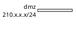

#### Define some elements or servers on a network

```java
@startuml
nwdiag {
  network dmz {
      address = "210.x.x.x/24"

      web01 [address = "210.x.x.1"];
      web02 [address = "210.x.x.2"];
  }
}
@enduml
```

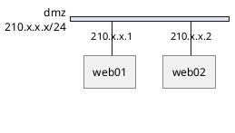

#### Full example

```java
@startuml
nwdiag {
  network dmz {
      address = "210.x.x.x/24"

      web01 [address = "210.x.x.1"];
      web02 [address = "210.x.x.2"];
  }
  network internal {
      address = "172.x.x.x/24";

      web01 [address = "172.x.x.1"];
      web02 [address = "172.x.x.2"];
      db01;
      db02;
  }
}
@enduml
```

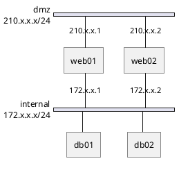

### Define multiple addresses

```java
@startuml
nwdiag {
  network dmz {
      address = "210.x.x.x/24"

      // set multiple addresses (using comma)
      web01 [address = "210.x.x.1, 210.x.x.20"];
      web02 [address = "210.x.x.2"];
  }
  network internal {
      address = "172.x.x.x/24";

      web01 [address = "172.x.x.1"];
      web02 [address = "172.x.x.2"];
      db01;
      db02;
  }
}
@enduml
```

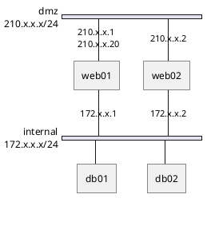

### Grouping nodes

#### Define group inside network definitions

```java
@startuml
nwdiag {
  network Sample_front {
    address = "192.168.10.0/24";

    // define group
    group web {
      web01 [address = ".1"];
      web02 [address = ".2"];
    }
  }
  network Sample_back {
    address = "192.168.20.0/24";
    web01 [address = ".1"];
    web02 [address = ".2"];
    db01 [address = ".101"];
    db02 [address = ".102"];

    // define network using defined nodes
    group db {
      db01;
      db02;
    }
  }
}
@enduml
```

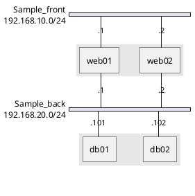

#### Define group outside of network definitions

```java
@startuml
nwdiag {
  // define group outside of network definitions
  group {
    color = "#FFAAAA";

    web01;
    web02;
    db01;
  }

  network dmz {
    web01;
    web02;
  }
  network internal {
    web01;
    web02;
    db01;
    db02;
  }
}
@enduml
```

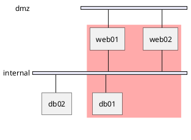

#### Define several groups on same network

Example with 2 group

```java
@startuml
nwdiag {
  group {
    color = "#FFaaaa";
    web01;
    db01;
  }
  group {
    color = "#aaaaFF";
    web02;
    db02;
  }
  network dmz {
      address = "210.x.x.x/24"

      web01 [address = "210.x.x.1"];
      web02 [address = "210.x.x.2"];
  }
  network internal {
      address = "172.x.x.x/24";

      web01 [address = "172.x.x.1"];
      web02 [address = "172.x.x.2"];
      db01 ;
      db02 ;
  }
}
@enduml
```

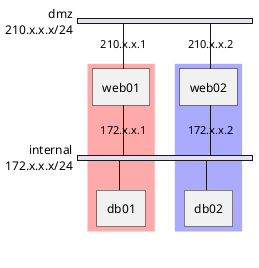

Example with 3 groups

```java
@startuml
nwdiag {
  group {
    color = "#FFaaaa";
    web01;
    db01;
  }
  group {
    color = "#aaFFaa";
    web02;
    db02;
  }
  group {
    color = "#aaaaFF";
    web03;
    db03;
  }

  network dmz {
      web01;
      web02;
      web03;
  }
  network internal {
      web01;
      db01 ;
      web02;
      db02 ;
      web03;
      db03;
  }
}
@enduml
```
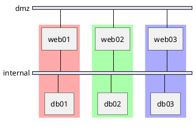

### Extended Syntax (for network or group)

#### Network 

For network or network's component, you can add or change:
* addresses (separated by comma ,);
* [color](https://plantuml.com/ko/color);
* description;
* [shape](https://plantuml.com/ko/deployment-diagram#5k3cq00k8n5ek362kjdn).

```java
@startuml
nwdiag {
  network Sample_front {
    address = "192.168.10.0/24"
    color = "red"

    // define group
    group web {
      web01 [address = ".1, .2", shape = "node"]
      web02 [address = ".2, .3"]
    }
  }
  network Sample_back {
    address = "192.168.20.0/24"
    color = "palegreen"
    web01 [address = ".1"]
    web02 [address = ".2"]
    db01 [address = ".101", shape = database ]
    db02 [address = ".102"]

    // define network using defined nodes
    group db {
      db01;
      db02;
    }
  }
}
@enduml
```
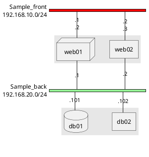

#### Group

For a group, you can add or change:
* [color](https://plantuml.com/ko/color);
* description.

```java
@startuml
nwdiag {
  group {
    color = "#CCFFCC";
    description = "Long group description";

    web01;
    web02;
    db01;
  }

  network dmz {
    web01;
    web02;
  }
  network internal {
    web01;
    web02;
    db01 [address = ".101", shape = database];
  }
}
@enduml
```
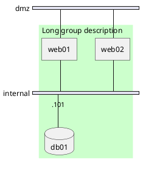

### Using Sprites

You can use all [sprites](https://plantuml.com/ko/sprite) (icons) from the [Standard Library](https://plantuml.com/ko/stdlib) or any other library.
Use the notation `<$sprite>` to use a sprite, `\n` to make a new line, or any other [Creole](https://plantuml.com/ko/creole) syntax.

```java
@startuml
!include <office/Servers/application_server>
!include <office/Servers/database_server>

nwdiag {
  network dmz {
      address = "210.x.x.x/24"

      // set multiple addresses (using comma)
      web01 [address = "210.x.x.1, 210.x.x.20",  description = "<$application_server>\n web01"]
      web02 [address = "210.x.x.2",  description = "<$application_server>\n web02"];
  }
  network internal {
      address = "172.x.x.x/24";

      web01 [address = "172.x.x.1"];
      web02 [address = "172.x.x.2"];
      db01 [address = "172.x.x.100",  description = "<$database_server>\n db01"];
      db02 [address = "172.x.x.101",  description = "<$database_server>\n db02"];
  }
}
@enduml
```
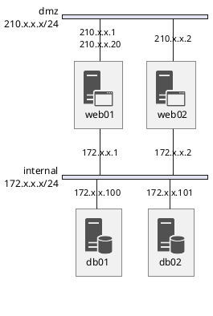

### Using OpenIconic
You can also use the icons from [OpenIconic](https://plantuml.com/ko/openiconic) in network or node descriptions.
Use the notation `<&icon>` to make an icon, `<&icon*n>` to multiply the size by a factor `n`, and `\n` to make a newline:

```java
@startuml

nwdiag {
  group nightly {
    color = "#FFAAAA";
    description = "<&clock> Restarted nightly <&clock>";
    web02;
    db01;
  }
  network dmz {
      address = "210.x.x.x/24"

      user [description = "<&person*4.5>\n user1"];
      // set multiple addresses (using comma)
      web01 [address = "210.x.x.1, 210.x.x.20",  description = "<&cog*4>\nweb01"]
      web02 [address = "210.x.x.2",  description = "<&cog*4>\nweb02"];

  }
  network internal {
      address = "172.x.x.x/24";

      web01 [address = "172.x.x.1"];
      web02 [address = "172.x.x.2"];
      db01 [address = "172.x.x.100",  description = "<&spreadsheet*4>\n db01"];
      db02 [address = "172.x.x.101",  description = "<&spreadsheet*4>\n db02"];
      ptr  [address = "172.x.x.110",  description = "<&print*4>\n ptr01"];
  }
}
@enduml
```
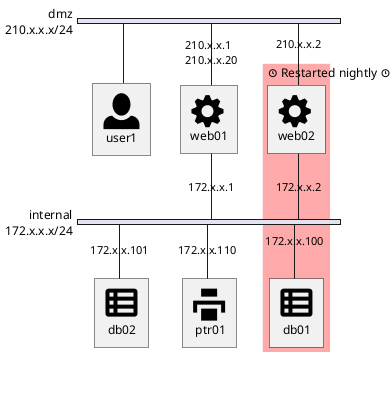

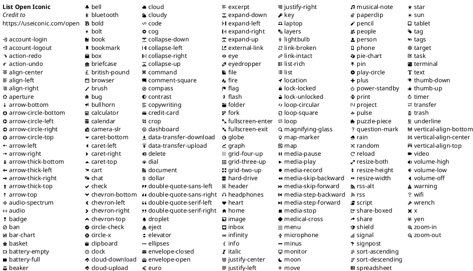

### Same nodes on more than two networks

You can use same nodes on different networks (more than two networks); `nwdiag` use in this case `jump line` over networks.

```java
@startuml
nwdiag {
  // define group at outside network definitions
  group {
    color = "#7777FF";

    web01;
    web02;
    db01;
  }

  network dmz {
    color = "pink"

    web01;
    web02;
  }

  network internal {
    web01;
    web02;
    db01 [shape = database ];
  }

  network internal2 {
    color = "LightBlue";

    web01;
    web02;
    db01;
  }

}
@enduml
```
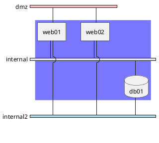

### Peer networks

Peer networks are simple connections between two nodes, for which we don't use a horizontal "busbar" network

```java
@startuml
nwdiag {
  inet [shape = cloud];
  inet -- router;

  network {
    router;
    web01;
    web02;
  }
}
@enduml
```
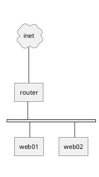

### Peer networks and group

#### Without group
```java
@startuml
nwdiag {
    internet [ shape = cloud];
    internet -- router;

    network proxy {
        router;
        app;
    }
    network default {
    	app;
        db;
    }
}
@enduml
```
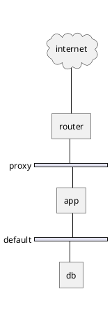

#### Group on first
```java
@startuml
nwdiag {
    internet [ shape = cloud];
    internet -- router;

    group {
      color = "pink";
      app;
      db;
    }

    network proxy {
        router;
        app;
    }

    network default {
    	app;
        db;
    }
}
@enduml
```
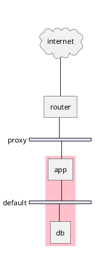

#### Group on second

```java
@startuml
nwdiag {
    internet [ shape = cloud];
    internet -- router;

    network proxy {
        router;
        app;
    }

    group {
      color = "pink";
      app;
      db;
    }

    network default {
    	app;
        db;
    }
}
@enduml
```


#### Group on third

```java
@startuml
nwdiag {
    internet [ shape = cloud];
    internet -- router;

    network proxy {
        router;
        app;
    }
    network default {
    	app;
        db;
    }
    group {
      color = "pink";
      app;
      db;
    }
}
@enduml
```


### Add title, caption, header, footer or legend on network diagram

```java
@startuml

header some header

footer some footer

title My title

nwdiag {
  network inet {
      web01 [shape = cloud]
  }
}

legend
The legend
end legend

caption This is caption
@enduml
```
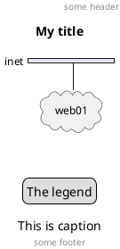

### With or without shadow

#### With shadow (by default)
```java
@startuml
nwdiag {
  network nw {
    server;
    internet;
  }
  internet [shape = cloud];
}
@enduml
```
```plantuml
@startuml
nwdiag {
  network nw {
    server;
    internet;
  }
  internet [shape = cloud];
}
@enduml
```

#### Without shadow
```java
@startuml
<style>
root {
 shadowing 0
}
</style>
nwdiag {
  network nw {
    server;
    internet;
  }
  internet [shape = cloud];
}
@enduml
```
```plantuml
@startuml
<style>
root {
 shadowing 0
}
</style>
nwdiag {
  network nw {
    server;
    internet;
  }
  internet [shape = cloud];
}
@enduml
```

### Change width of the networks
You can change the width of the networks, especially in order to have the same full width for only some or all networks.
Here are some examples, with all the possibilities:

#### without
```java
@startuml
nwdiag {
  network NETWORK_BASE {
   dev_A   [address = "dev_A" ]
   dev_B [address = "dev_B" ]
  }
  network IntNET1 {
   dev_B [address = "dev_B1" ]
   dev_M [address = "dev_M1" ]
  }
  network IntNET2 {
   dev_B [address = "dev_B2" ]
   dev_M [address = "dev_M2" ]
 }
}
@enduml
```
```plantuml
@startuml
nwdiag {
  network NETWORK_BASE {
   dev_A   [address = "dev_A" ]
   dev_B [address = "dev_B" ]
  }
  network IntNET1 {
   dev_B [address = "dev_B1" ]
   dev_M [address = "dev_M1" ]
  }
  network IntNET2 {
   dev_B [address = "dev_B2" ]
   dev_M [address = "dev_M2" ]
 }
}
@enduml
```

#### only the first
```java
@startuml
nwdiag {
  network NETWORK_BASE {
   width = full
   dev_A   [address = "dev_A" ]
   dev_B [address = "dev_B" ]
  }
  network IntNET1 {
   dev_B [address = "dev_B1" ]
   dev_M [address = "dev_M1" ]
  }
  network IntNET2 {
   dev_B [address = "dev_B2" ]
   dev_M [address = "dev_M2" ]
 }
}
@enduml
```
```plantuml
@startuml
nwdiag {
  network NETWORK_BASE {
   width = full
   dev_A   [address = "dev_A" ]
   dev_B [address = "dev_B" ]
  }
  network IntNET1 {
   dev_B [address = "dev_B1" ]
   dev_M [address = "dev_M1" ]
  }
  network IntNET2 {
   dev_B [address = "dev_B2" ]
   dev_M [address = "dev_M2" ]
 }
}
@enduml
```

### the first and the second
```java
@startuml
nwdiag {
  network NETWORK_BASE {
   width = full
   dev_A   [address = "dev_A" ]
   dev_B [address = "dev_B" ]
  }
  network IntNET1 {
   width = full
   dev_B [address = "dev_B1" ]
   dev_M [address = "dev_M1" ]
  }
  network IntNET2 {
   dev_B [address = "dev_B2" ]
   dev_M [address = "dev_M2" ]
 }
}
@enduml
```
```plantuml
@startuml
nwdiag {
  network NETWORK_BASE {
   width = full
   dev_A   [address = "dev_A" ]
   dev_B [address = "dev_B" ]
  }
  network IntNET1 {
   width = full
   dev_B [address = "dev_B1" ]
   dev_M [address = "dev_M1" ]
  }
  network IntNET2 {
   dev_B [address = "dev_B2" ]
   dev_M [address = "dev_M2" ]
 }
}
@enduml
```

#### all the network (with same full width)
```java
@startuml
nwdiag {
  network NETWORK_BASE {
   width = full
   dev_A   [address = "dev_A" ]
   dev_B [address = "dev_B" ]
  }
  network IntNET1 {
   width = full
   dev_B [address = "dev_B1" ]
   dev_M [address = "dev_M1" ]
  }
  network IntNET2 {
   width = full
   dev_B [address = "dev_B2" ]
   dev_M [address = "dev_M2" ]
 }
}
@enduml
````
```plantuml
@startuml
nwdiag {
  network NETWORK_BASE {
   width = full
   dev_A   [address = "dev_A" ]
   dev_B [address = "dev_B" ]
  }
  network IntNET1 {
   width = full
   dev_B [address = "dev_B1" ]
   dev_M [address = "dev_M1" ]
  }
  network IntNET2 {
   width = full
   dev_B [address = "dev_B2" ]
   dev_M [address = "dev_M2" ]
 }
}
@enduml
```

### Other internal networks
You can define other internal networks (TCP/IP, USB, SERIAL,...).

#### Without address or type
```java
@startuml
nwdiag {
  network LAN1 {
     a [address = "a1"];
  }
  network LAN2 {
     a [address = "a2"];
     switch;
  }
  switch -- equip;
  equip -- printer;
}
@enduml
```
```plantuml
@startuml
nwdiag {
  network LAN1 {
     a [address = "a1"];
  }
  network LAN2 {
     a [address = "a2"];
     switch;
  }
  switch -- equip;
  equip -- printer;
}
@enduml
```

#### With address or type
```java
@startuml
nwdiag {
  network LAN1 {
     a [address = "a1"];
  }
  network LAN2 {
     a [address = "a2"];
     switch [address = "s2"];
  }
  switch -- equip;
  equip [address = "e3"];
  equip -- printer;
  printer [address = "USB"];
}
@enduml
```
```plantuml
@startuml
nwdiag {
  network LAN1 {
     a [address = "a1"];
  }
  network LAN2 {
     a [address = "a2"];
     switch [address = "s2"];
  }
  switch -- equip;
  equip [address = "e3"];
  equip -- printer;
  printer [address = "USB"];
}
@enduml
```

### Using (global) style

#### Without style (by default)
```java
@startuml
nwdiag {
  network DMZ {
      address = "y.x.x.x/24"
      web01 [address = "y.x.x.1"];
      web02 [address = "y.x.x.2"];
  }

   network Internal {
    web01;
    web02;
    db01 [address = "w.w.w.z", shape = database];
  } 

    group {
    description = "long group label";
    web01;
    web02;
    db01;
  }
}
@enduml
```
```plantuml
@startuml
nwdiag {
  network DMZ {
      address = "y.x.x.x/24"
      web01 [address = "y.x.x.1"];
      web02 [address = "y.x.x.2"];
  }

   network Internal {
    web01;
    web02;
    db01 [address = "w.w.w.z", shape = database];
  } 

    group {
    description = "long group label";
    web01;
    web02;
    db01;
  }
}
@enduml
```

#### With style

You can use [style](https://plantuml.com/ko/style-evolution) to change rendering of elements.
```java
@startuml
<style>
nwdiagDiagram {
  network {
    BackGroundColor green
    LineColor red
    LineThickness 1.0
    FontSize 18
    FontColor navy
  }
  server {
    BackGroundColor pink
    LineColor yellow
    LineThickness 1.0
    ' FontXXX only for description or label
    FontSize 18
    FontColor #blue
  }
  arrow {
    ' FontXXX only for address 
    FontSize 17
    FontColor #red
    FontName Monospaced
    LineColor black
  }
  group {
    BackGroundColor cadetblue
    LineColor black
    LineThickness 2.0
    FontSize 11
    FontStyle bold
    Margin 5
    Padding 5
  }
}
</style>
nwdiag {
  network DMZ {
      address = "y.x.x.x/24"
      web01 [address = "y.x.x.1"];
      web02 [address = "y.x.x.2"];
  }

   network Internal {
    web01;
    web02;
    db01 [address = "w.w.w.z", shape = database];
  } 

    group {
    description = "long group label";
    web01;
    web02;
    db01;
  }
}
@enduml
```
```plantuml
@startuml
<style>
nwdiagDiagram {
  network {
    BackGroundColor green
    LineColor red
    LineThickness 1.0
    FontSize 18
    FontColor navy
  }
  server {
    BackGroundColor pink
    LineColor yellow
    LineThickness 1.0
    ' FontXXX only for description or label
    FontSize 18
    FontColor #blue
  }
  arrow {
    ' FontXXX only for address 
    FontSize 17
    FontColor #red
    FontName Monospaced
    LineColor black
  }
  group {
    BackGroundColor cadetblue
    LineColor black
    LineThickness 2.0
    FontSize 11
    FontStyle bold
    Margin 5
    Padding 5
  }
}
</style>
nwdiag {
  network DMZ {
      address = "y.x.x.x/24"
      web01 [address = "y.x.x.1"];
      web02 [address = "y.x.x.2"];
  }

   network Internal {
    web01;
    web02;
    db01 [address = "w.w.w.z", shape = database];
  } 

    group {
    description = "long group label";
    web01;
    web02;
    db01;
  }
}
@enduml
```

### Appendix: Test of all shapes on Network diagram (nwdiag)

#### Example 1
```java
@startuml
nwdiag {
  network Network {
    Actor       [shape = actor]       
    Agent       [shape = agent]       
    Artifact    [shape = artifact]    
    Boundary    [shape = boundary]    
    Card        [shape = card]        
    Cloud       [shape = cloud]       
    Collections [shape = collections] 
    Component   [shape = component]   
  }
}
@enduml
```
```plantuml
@startuml
nwdiag {
  network Network {
    Actor       [shape = actor]       
    Agent       [shape = agent]       
    Artifact    [shape = artifact]    
    Boundary    [shape = boundary]    
    Card        [shape = card]        
    Cloud       [shape = cloud]       
    Collections [shape = collections] 
    Component   [shape = component]   
  }
}
@enduml
```

#### Example 2
```java
@startuml
nwdiag {
  network Network {
    Control     [shape = control]     
    Database    [shape = database]    
    Entity      [shape = entity]      
    File        [shape = file]        
    Folder      [shape = folder]      
    Frame       [shape = frame]       
    Hexagon     [shape = hexagon]     
    Interface   [shape = interface]   
  }
}
@enduml
```
```plantuml
@startuml
nwdiag {
  network Network {
    Control     [shape = control]     
    Database    [shape = database]    
    Entity      [shape = entity]      
    File        [shape = file]        
    Folder      [shape = folder]      
    Frame       [shape = frame]       
    Hexagon     [shape = hexagon]     
    Interface   [shape = interface]   
  }
}
@enduml
```

#### Example 3
```java
@startuml
nwdiag {
  network Network {
    Label       [shape = label]       
    Node        [shape = node]        
    Package     [shape = package]     
    Person      [shape = person]      
    Queue       [shape = queue]       
    Stack       [shape = stack]       
    Rectangle   [shape = rectangle]   
    Storage     [shape = storage]     
    Usecase     [shape = usecase]     
  }
}
@enduml
```
```plantuml
@startuml
nwdiag {
  network Network {
    Label       [shape = label]       
    Node        [shape = node]        
    Package     [shape = package]     
    Person      [shape = person]      
    Queue       [shape = queue]       
    Stack       [shape = stack]       
    Rectangle   [shape = rectangle]   
    Storage     [shape = storage]     
    Usecase     [shape = usecase]     
  }
}
@enduml
```

> #### Need to Fix
> * Overlap of label for folder
> * Hexagon shape is missing

```java
@startuml
nwdiag {
network Network {
Folder [shape = folder]
Hexagon [shape = hexagon]
}
}
@enduml
```
```plantuml
@startuml
nwdiag {
network Network {
Folder [shape = folder]
Hexagon [shape = hexagon]
}
}
@enduml
```

```java
@startuml
nwdiag {
network Network {
Folder [shape = folder, description = "Test, long long label\nTest, long long label\n"]
Hexagon [shape = hexagon, description = "Test, long long label\nTest, long long label"]
}
}
@enduml
```
```plantuml
@startuml
nwdiag {
network Network {
Folder [shape = folder, description = "Test, long long label\nTest, long long label\n"]
Hexagon [shape = hexagon, description = "Test, long long label\nTest, long long label"]
}
}
@enduml
```
