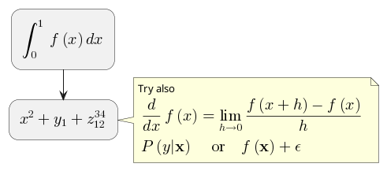

# [Plant UML](https://plantuml.com/ko/)

PlantUML 은 다이어그램을 빠르게 작성하기 위한 오픈 소스 프로젝트입니다.

## Maths
Within PlantUML, you can use [AsciiMath](http://asciimath.org/) notation:

```java
@startuml
:<math>int_0^1f(x)dx</math>;
:<math>x^2+y_1+z_12^34</math>;
note right
Try also
<math>d/dxf(x)=lim_(h->0)(f(x+h)-f(x))/h</math>
<math>P(y|bb"x") or f(bb"x")+epsilon</math>
end note
@enduml
```

