# [Plant UML](https://plantuml.com/ko/)

PlantUML 은 다이어그램을 빠르게 작성하기 위한 오픈 소스 프로젝트입니다.

## Hyperlink

### Format definition

#### Simple link

Simple links are define using two square brackets (or three square brackets for field or method on class diagram).

***Example:***
* `[[http://plantuml.com]]`
* `[[]]`*(empty link)*

#### Link with optional label

It is possible to give an optional label that will be printed instead of the link itself. A space is used as separator after the URL itself.

***Example:*** `[[http://plantuml.com This label is printed]]`

#### Link with optional tooltip

Finally you can also have an optional tooltip using round brackets, just after the URL and before the optional label.

***Example:*** `[[http://plantuml.com{Optional tooltip} This label is printed]]`

#### Only tooltip

You can also have only a tooltip using round brackets.

***Example:*** `[[{A tooltip}]]`

#### Only tooltip and label

You can also have only a tooltip using round brackets, and a label.

***Example:*** `[[{A tooltip} This label is printed]]`

#### URL authentication

With [URL authentication](https://plantuml.com/url-authentication) it is possible to provide an authentication method, credentials, and a proxy config to URL endpoints.

### Links contained curly bracket

A link can contain some curly brackets.

```java
@startuml
[[link{with_bracket}&id=10]]:Some activity\n(with link with brackets)\n""link{with_bracket}&id=10"";
[["link{with_bracket}"{}]]:Some activity\n(with link with brackets and empy tooltip)\n"""link{with_bracket}"{}"";
[["link{with_bracket}"{with tooltip}]]:Some activity\n(with link finished by brackets and tooltip)\n"""link{with_bracket}"{with tooltip}"";
[["link{with_bracket}&id=10"{with tooltip}]]:Some activity\n(with link with brackets and tooltip)\n"""link{with_bracket}&id=10"{with tooltip}"";
@enduml
```
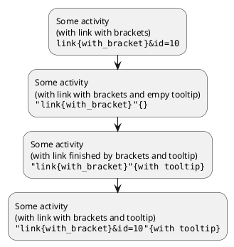

### Links in sequence diagram

The following example lists some links features:

```java
@startuml
actor Bob [[http://plantuml.com/sequence]]
actor "This is [[http://plantuml.com/sequence Alice]] actor" as Alice
Bob -> Alice [[http://plantuml.com/start]] : hello
note left [[http://plantuml.com/start]]
  a note with a link
end note
Alice -> Bob : hello with [[http://plantuml.com/start{Tooltip for message} some link]]
note right [[http://plantuml.com/start]] : another note
note left of Bob
You can use [[http://plantuml.com/start links in notes]] also.
end note
@enduml
```
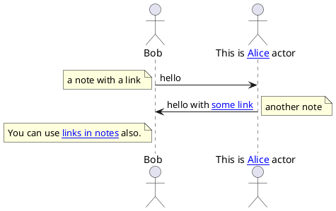

### Links in class diagram
```java
@startuml
class Car [[http://plantuml.com/link]]
class Wheel [[http://plantuml.com/sequence]]
note left [[http://plantuml.com]]
foo
end note
Car *-- Wheel [[http://plantuml.com/class]] : has some
@enduml
```
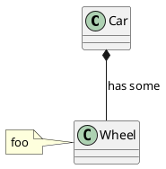

There is a special syntax with 3 square brackets in class definition when you want to define a link on field or method. For example:

```java
@startuml
class Car {
  - Some field [[[http://plantuml.com]]]
  Some method() [[[http://plantuml.com/link]]]
}
@enduml
```
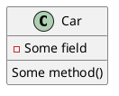

```java
@startuml
Object <|-- Foo

class Foo {
  + Object[]   [[[http://www.google.com]]]
  + methods1() [[[http://www.yahoo.com/A1{Some explainations about this method}]]]
  + methods2() [[[http://www.yahoo.com/A2]]]
}
  
class Foo2 {
  + methods1() [[[http://www.yahoo.com/B1]]]
  + methods2() [[[http://www.yahoo.com/B2]]]
}
  
class Object [[http://www.yahoo.com]]
@enduml
```
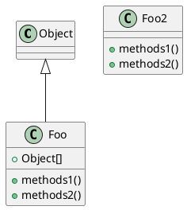

### Links in activity diagram

#### On activity label

```java
@startuml
start
[[http://plantuml.com]]:Some activity;
:Some [[http://plantuml.com link]];
end
@enduml
```
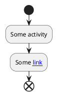

#### On partition

```java
@startuml
start
partition "[[http://plantuml.com partition_name]]" {
    :read doc. on [[http://plantuml.com plantuml_website]];
    :test diagram;
}
end
@enduml
```
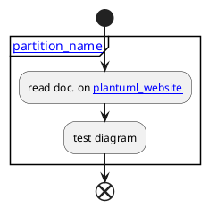

### Links in Network diagram (nwdiag)
```java
@startuml
nwdiag {
  network Network {
      Server [description="A [[http://plantuml.com link]] on nwdiag"];
  }
}
@enduml
```
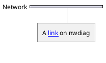

### Links in JSON/YAML diagram 

#### JSON
```java
@startjson
{
"@fruit": "Apple",
"$size": "Large",
"Appli.": "A [[http://plantuml.com link]] on JSON"
}
@endjson
```
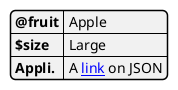

#### YAML
```java
@startyaml
@fruit: Apple
$size: Large
Appli.: A [[http://plantuml.com link]] on YAML
@endyaml
```
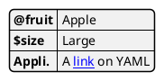

### Links in notes

It is also possible to specify a link at the beginning of a note (the link applies to the full note), or inside a note (for a portion of the note).

```java
@startuml
:Foo:
note left of Foo [[http://www.google.com]]
This is a note
end note

note right of Foo
Yet another link to [[http://www.google.com]] as demo.
You can also [[http://www.yahoo.fr specify a text]] for the link.
And even [[http://www.yahoo.fr{This is a tooltip} add a tooltip]] to the link.
end note
@enduml
```
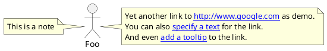

### Links with explicit URL directive

You can use the `url of XXX is [[yyy]]` syntax:

#### On sequence diagram
```java
@startuml
Bob -> Alice : ok
url of Bob is [[http://www.google.com]]
@enduml
```
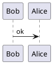

#### On class diagram
```java
@startuml
skinparam topurl http://www.google.com
Dog --|> Mammal
url of Mammal is [[/search]]
url of Dog is [[http://www.yahoo.com{This is Dog}]]
Dog o-- Cat
Cat --|> Mammal
@enduml
```
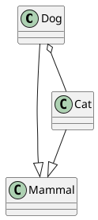

#### On usecase diagram
```java
@startuml
actor Mamal
usecase Dog

url of Mamal is [[http://www.google.com]]
url of Dog is [[http://www.yahoo.com{This is Dog}]]
@enduml
```
```plantuml
@startuml
actor Mamal
usecase Dog

url of Mamal is [[http://www.google.com]]
url of Dog is [[http://www.yahoo.com{This is Dog}]]
@enduml
```

#### On component or deployment diagram
```java
@startuml
node Mamal
component Dog

url of Mamal is [[http://www.google.com]]
url of Dog is [[http://www.yahoo.com{This is Dog}]]
@enduml
```
```plantuml
@startuml
node Mamal
component Dog

url of Mamal is [[http://www.google.com]]
url of Dog is [[http://www.yahoo.com{This is Dog}]]
@enduml
```

### Links in arrow (or Hyperlinks in link or connection)

#### Class diagram
```java
@startuml
class Car 
Car *-- Wheel [[http://plantuml.com/class-diagram]] : has some
@enduml
```
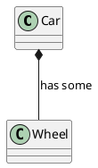

#### Component or Deployment diagram
```java
@startuml
node Car 
Car *-- Wheel [[http://plantuml.com/deployment-diagram]] : has some
@enduml
```
```plantuml
@startuml
node Car 
Car *-- Wheel [[http://plantuml.com/deployment-diagram]] : has some
@enduml
```

#### State diagram
```java
@startuml
state Car
state CarWithWheel
Car -> CarWithWheel [[http://plantuml.com/state-diagram]] : Add wheel to car
@enduml
```
```plantuml
@startuml
state Car
state CarWithWheel
Car -> CarWithWheel [[http://plantuml.com/state-diagram]] : Add wheel to car
@enduml
```
