# [Plant UML](https://plantuml.com/ko/)

PlantUML 은 다이어그램을 빠르게 작성하기 위한 오픈 소스 프로젝트입니다.

## Creole
[Creole](http://en.wikipedia.org/wiki/Creole_%28markup%29) is a lightweight common markup language for various wikis. A light-weight Creole engine is integrated in PlantUML to have a standardized way to emit styled text.

All diagrams support this syntax.

Note that compatibility with HTML syntax is preserved.

### Back to topEmphasized text

```java
@startuml
Alice -> Bob : hello --there-- here
... Some ~~long delay~~ ...
Bob -> Alice : ok
note left
  This is **bold**
  This is //italics//
  This is ""monospaced""
  This is --stricken-out--
  This is __underlined__
  This is ~~wave-underlined~~
end note
@enduml
```
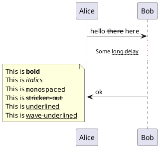

### Lists
You can use numbered and bulleted lists in node text, notes, etc.

```java
@startuml
object demo {
  * Bullet list
  * Second item
}
note left
  * Bullet list
  * Second item
  ** Sub item
end note

legend
  # Numbered list
  # Second item
  ## Sub item
  ## Another sub item
        * Can't quite mix 
        * Numbers and bullets
  # Third item
end legend
@enduml
```
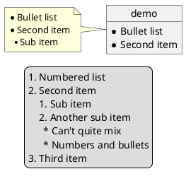

### Escape character

You can use the tilde ~ to escape special creole characters.

```java
@startuml
object demo {
  This is not ~___underscored__.
  This is not ~""monospaced"".
}
@enduml
```
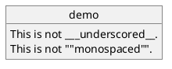

### Back to topHorizontal lines

```java
@startuml
database DB1 as "
You can have horizontal line
----
Or double line
====
Or strong line
____
Or dotted line
..My title..
Enjoy!
"
note right
  This is working also in notes
  You can also add title in all these lines
  ==Title==
  --Another title--
end note

@enduml
```
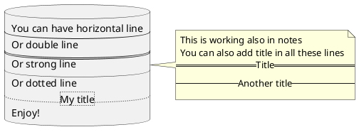

### Back to topHeadings

```java
@startuml
usecase UC1 as "
= Extra-large heading
Some text
== Large heading
Other text
=== Medium heading
Information
....
==== Small heading"
@enduml
```
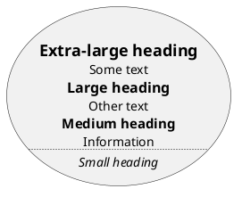

### Links

You can also [use URL and links](https://plantuml.com/link).
Simple links are define using two square brackets (or three square brackets for field or method on class diagram).

***Example:***
* `[[http://plantuml.com]]`
* `[[http://plantuml.com This label is printed]]`
* `[[http://plantuml.com{Optional tooltip} This label is printed]]`

URL can also be [authenticated](https://plantuml.com/url-authentication).

### Legacy HTML

You can mix Creole with the following HTML tags:
* `<b>` for bold text
* `<u>` or `<u:#AAAAAA>` or `<u:[[color|colorName]]>` for underline
* `<i>` for italic
* `<s>` or `<s:#AAAAAA>` or `<s:[[color|colorName]]>` for strike text
* `<w>` or `<w:#AAAAAA>` or `<w:[[color|colorName]]>` for wave underline text
* `<plain>` for plain text
* `<color:#AAAAAA>` or `<color:[[color|colorName]]>`
* `<back:#AAAAAA>` or `<back:[[color|colorName]]>` for background color
* `<size:nn>` to change font size
* `` : the file must be accessible by the filesystem
* `` : the URL must be available from the Internet

```java
@startuml
:* You can change <color:red>text color</color>
* You can change <back:cadetblue>background color</back>
* You can change <size:18>size</size>
* You use <u>legacy</u> <b>HTML <i>tag</i></b>
* You use <u:red>color</u> <s:green>in HTML</s> <w:#0000FF>tag</w>
----
* Use image : 
;
@enduml
```
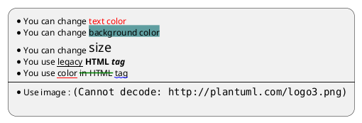

#### Common HTML element

```java
@startuml
hide footbox
note over Source
<code>
  This is <b>bold</b>
  This is <i>italics</i>
  This is <font:monospaced>monospaced</font>
  This is <s>stroked</s>
  This is <u>underlined</u>
  This is <w>waved</w>
  This is <s:green>stroked</s>
  This is <u:red>underlined</u>
  This is <w:#0000FF>waved</w>
  This is <b>a bold text containing <plain>plain text</plain> inside</b>
  -- other examples --
  This is <color:blue>Blue</color>
  This is <back:orange>Orange background</back>
  This is <size:20>big</size>
</code>
end note
/note over Output
  This is <b>bold</b>
  This is <i>italics</i>
  This is <font:monospaced>monospaced</font>
  This is <s>stroked</s>
  This is <u>underlined</u>
  This is <w>waved</w>
  This is <s:green>stroked</s>
  This is <u:red>underlined</u>
  This is <w:#0000FF>waved</w>
  This is <b>a bold text containing <plain>plain text</plain> inside</b>
  -- other examples --
  This is <color:blue>Blue</color>
  This is <back:orange>Orange background</back>
  This is <size:20>big</size>
end note
@enduml
```
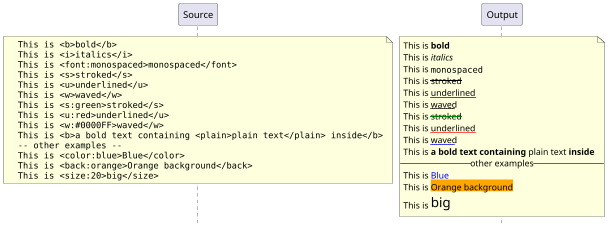

#### Subscript and Superscript element [sub, sup]

```java
@startuml
:<code>
This is the "caffeine" molecule: C<sub>8</sub>H<sub>10</sub>N<sub>4</sub>O<sub>2</sub>
</code>
This is the "caffeine" molecule: C<sub>8</sub>H<sub>10</sub>N<sub>4</sub>O<sub>2</sub>
----
<code>
This is the Pythagorean theorem: a<sup>2</sup> + b<sup>2</sup> = c<sup>2</sup>
</code>
This is the Pythagorean theorem: a<sup>2</sup> + b<sup>2</sup> = c<sup>2</sup>;
@enduml
```
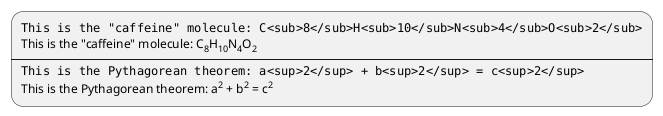

### Code

You can use `<code>` to display some programming code in your diagram (sorry, syntax highlighting is not yet supported).

```java
@startuml
Alice -> Bob : hello
note right
<code>
main() {
  printf("Hello world");
}
</code>
end note
@enduml
```
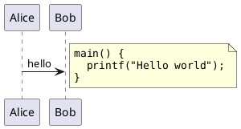

This is especially useful to illustrate some PlantUML code and the resulting rendering:

```java
@startuml
Alice -> Bob : hello
note left
<code>
  This is **bold**
  This is //italics//
  This is ""monospaced""
  This is --stricken-out--
  This is __underlined__
  This is ~~wave-underlined~~
  --test Unicode and icons--
  This is <U+221E> long
  This is a <&code> icon
</code>
end note
note right
  This is **bold**
  This is //italics//
  This is ""monospaced""
  This is --stricken-out--
  This is __underlined__
  This is ~~wave-underlined~~
  --test Unicode and icons--
  This is <U+221E> long
  This is a <&code> icon
end note
@enduml
```
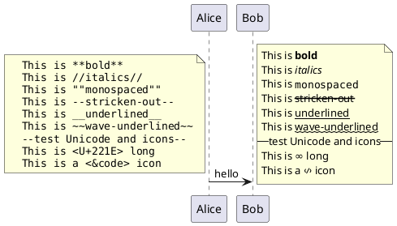

### Table

#### Create a table

It is possible to build table, with `|` separator.

```java
@startuml
skinparam titleFontSize 14
title
  Example of simple table
  |= |= table |= header |
  | a | table | row |
  | b | table | row |
end title
[*] --> State1
@enduml
```
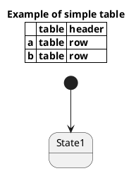

#### Add color on rows or cells

You can specify background [colors](https://plantuml.com/color) of rows and cells:

```java
@startuml
start
:Here is the result
|= |= table |= header |
| a | table | row |
|<#FF8080> red |<#80FF80> green |<#8080FF> blue |
<#yellow>| b | table | row |;
@enduml
```
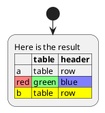

#### Add color on border and text

You can also specify [colors](https://plantuml.com/color) of text and borders.

```java
@startuml
title
<#lightblue,#red>|=  Step  |=  Date  |=  Name  |=  Status  |=  Link  |
<#lightgreen>|  1.1  |  TBD  | plantuml news |<#Navy><color:OrangeRed><b> Unknown  | [[https://plantuml.com/news plantuml news]] |
end title
@enduml
```
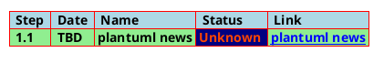

#### No border or same color as the background

You can also set the border color to the same color as the background.

```java
@startuml
node n
note right of n
  <#FBFB77,#FBFB77>|= Husky / Yorkie |= Foo |
  | SourceTree1 | foo1 |
  | ST2 | foo2 |
end note
@enduml
```
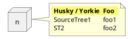

#### Bold header or not

`=` as the first char of a cell indicates whether to make it bold (usually used for headers), or not.

```java
@startuml
note as deepCSS0
  |<#white> Husky / Yorkie |
  |=<#gainsboro> SourceTree0 |
endnote

note as deepCSS1
  |= <#white> Husky / Yorkie |= Foo |
  |<#gainsboro><r> SourceTree1 | foo1 |
endnote

note as deepCSS2
  |= Husky / Yorkie |
  |<#gainsboro> SourceTree2 |
endnote

note as deepCSS3
  <#white>|= Husky / Yorkie |= Foo |
  |<#gainsboro> SourceTree1 | foo1 |
endnote
@enduml
```
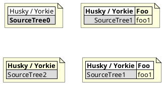

### Emoji

All emojis from [Twemoji](https://twemoji.twitter.com/) (see [EmojiTwo](https://github.com/EmojiTwo/emojitwo) on Github) are available using the following syntax:

```java
@startuml
Alice -> Bob : Hello <:1f600:>
return <:innocent:>
Alice -> Bob : Without color: <#0:sunglasses:>
Alice -> Bob : Change color: <#green:sunny:>
@enduml
```
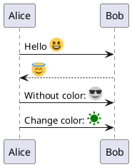

Use the [emoji cheat sheet](https://github.com/ikatyang/emoji-cheat-sheet/blob/master/README.md) to select emoji.

You can also use the following PlantUML command to list available emoji:

> @startuml
> emoji <block>
> @enduml

Over 580 emojis from the following [Unicode blocks](https://en.wikipedia.org/wiki/Unicode_block) are available:
* [Unicode block 26](https://www.plantuml.com/plantuml/svg/SoWkIImgAStDuKhDpS_AL30out98pKi12W00)
* [Unicode block 1F3](https://www.plantuml.com/plantuml/svg/SoWkIImgAStDuKhDpS_AL31qC-PoICrB0Oe00000)
* [Unicode block 1F4](https://www.plantuml.com/plantuml/svg/SoWkIImgAStDuKhDpS_AL31qC-5oICrB0Oe00000)
* [Unicode block 1F5](https://www.plantuml.com/plantuml/svg/SoWkIImgAStDuKhDpS_AL31qC-LoICrB0Oe00000)
* [Unicode block 1F6](https://www.plantuml.com/plantuml/svg/SoWkIImgAStDuKhDpS_AL31qC-DoICrB0Oe00000)
* [Unicode block 1F9](https://www.plantuml.com/plantuml/svg/SoWkIImgAStDuKhDpS_AL31qi-HoICrB0Oe00000)


### Tree

You can use `|_` characters to build a tree.
On common commands, like title:

```java
@startuml
skinparam titleFontSize 14
title
  Example of Tree
  |_ First line
  |_ **Bom (Model)**
    |_ prop1
    |_ prop2
    |_ prop3
  |_ Last line
end title
[*] --> State1
@enduml
```
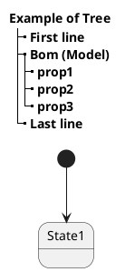

On Class diagram.
(Please note how we have to use an empty second compartment, else the parentheses in (**Model**) cause that text to be moved to a separate first compartment):

```java
@startuml
class Foo {
**Bar (Model)**
|_ prop
|_ **Bom (Model)**
  |_ prop2
  |_ prop3
    |_ prop3.1
|_ prop4 :(
--
}
@enduml
```
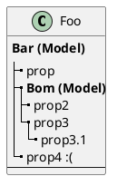

On Component or Deployement diagrams:

```java
@startuml
[A] as A
rectangle "Box B" {
    component B [
        Level 1
        |_ Level 2a
          |_ Level 3a 
          |_ Level 3b
          |_ Level 3c
            |_ Level 4a
          |_ Level 3d
        |_ Level 2b
          |_ Level 3e
    ]
}
A -> B
@enduml
```
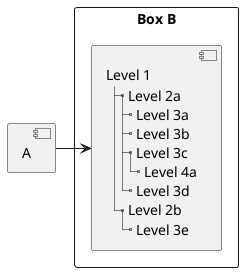

### Special characters

It's possible to use any [unicode character](http://www.fileformat.info/info/unicode/category/Sm/list.htm), either directly or with syntax `&#XXX` or `<U+XXXX>`:

```java
@startuml
usecase direct as "this is ∞ long"
usecase ampHash as "this is also &#8734; long"
usecase angleBrackets as "this is also <U+221E> long"
@enduml
```
```plantuml
@startuml
usecase direct as "this is ∞ long"
usecase ampHash as "this is also &#8734; long"
usecase angleBrackets as "this is also <U+221E> long"
@enduml
```

### OpenIconic

[OpenIconic](https://useiconic.com/open/) is a very nice open-source icon set. Those icons are integrated in the creole parser, so you can use them out-of-the-box.
Use the following syntax: `<&ICON_NAME>`.

```java
@startuml
title: <size:20><&heart>Use of OpenIconic<&heart></size>
class Wifi
note left
  Click on <&wifi>
end note
@enduml
```
```plantuml
@startuml
title: <size:20><&heart>Use of OpenIconic<&heart></size>
class Wifi
note left
  Click on <&wifi>
end note
@enduml
```

The complete list is available at the [OpenIconic Website](https://useiconic.com/open/), or you can use the following special command to list them:

```java
@startuml
listopeniconic
@enduml
```
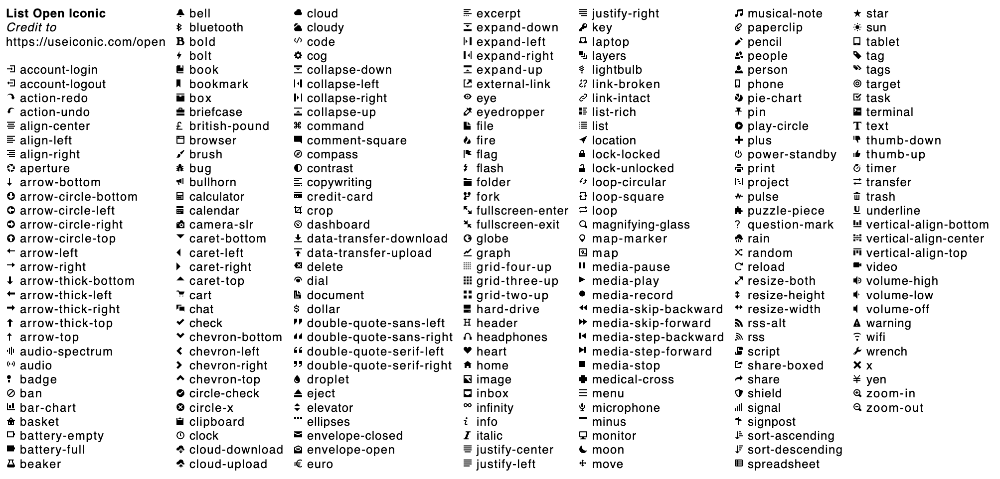

### Appendix: Examples of "Creole List" on all diagrams

#### Activity

```java
@startuml
start
:**test list 1**
* Bullet list
* Second item
** Sub item
*** Sub sub item
* Third item
----
**test list 2**
# Numbered list
# Second item
## Sub item
## Another sub item
# Third item;
stop
@enduml
```
```plantuml
@startuml
start
:**test list 1**
* Bullet list
* Second item
** Sub item
*** Sub sub item
* Third item
----
**test list 2**
# Numbered list
# Second item
## Sub item
## Another sub item
# Third item;
stop
@enduml
```

#### Class

```java
@startuml

class a {
**test list 1**
* Bullet list
* Second item
** Sub item
*** Sub sub item
* Third item
----
**test list 2**
# Numbered list
# Second item
## Sub item
## Another sub item
# Third item
}

a -- b 

@enduml
```
```plantuml
@startuml

class a {
**test list 1**
* Bullet list
* Second item
** Sub item
*** Sub sub item
* Third item
----
**test list 2**
# Numbered list
# Second item
## Sub item
## Another sub item
# Third item
}

a -- b 

@enduml
```

#### Component, Deployment, Use-Case

```java
@startuml
node n [
**test list 1**
* Bullet list
* Second item
** Sub item
*** Sub sub item
* Third item
----
**test list 2**
# Numbered list
# Second item
## Sub item
## Another sub item
# Third item
]

file f as "
**test list 1**
* Bullet list
* Second item
** Sub item
*** Sub sub item
* Third item
----
**test list 2**
# Numbered list
# Second item
## Sub item
## Another sub item
# Third item
"
@enduml
```
```plantuml
@startuml
node n [
**test list 1**
* Bullet list
* Second item
** Sub item
*** Sub sub item
* Third item
----
**test list 2**
# Numbered list
# Second item
## Sub item
## Another sub item
# Third item
]

file f as "
**test list 1**
* Bullet list
* Second item
** Sub item
*** Sub sub item
* Third item
----
**test list 2**
# Numbered list
# Second item
## Sub item
## Another sub item
# Third item
"
@enduml
```

#### Gantt project planning

N/A

#### Object
```java
@startuml
object user {
**test list 1**
* Bullet list
* Second item
** Sub item
*** Sub sub item
* Third item
----	
**test list 2**
# Numbered list
# Second item
## Sub item
## Another sub item
# Third item
}

@enduml
```
```plantuml
@startuml
object user {
**test list 1**
* Bullet list
* Second item
** Sub item
*** Sub sub item
* Third item
----	
**test list 2**
# Numbered list
# Second item
## Sub item
## Another sub item
# Third item
}

@enduml
```

#### MindMap
```java
@startmindmap

* root
** d1
**:**test list 1**
* Bullet list
* Second item
** Sub item
*** Sub sub item
* Third item
----
**test list 2**
# Numbered list
# Second item
## Sub item
## Another sub item
# Third item;


@endmindmap
```
```plantuml
@startmindmap

* root
** d1
**:**test list 1**
* Bullet list
* Second item
** Sub item
*** Sub sub item
* Third item
----
**test list 2**
# Numbered list
# Second item
## Sub item
## Another sub item
# Third item;


@endmindmap
```

#### Network (nwdiag)

```java
@startuml
nwdiag {
  network Network {
      Server [description="**test list 1**\n* Bullet list\n* Second item\n** Sub item\n*** Sub sub item\n* Third item\n----\n**test list 2**\n# Numbered list\n# Second item\n## Sub item\n## Another sub item\n# Third item"];
}
@enduml
```
```plantuml
@startuml
nwdiag {
  network Network {
      Server [description="**test list 1**\n* Bullet list\n* Second item\n** Sub item\n*** Sub sub item\n* Third item\n----\n**test list 2**\n# Numbered list\n# Second item\n## Sub item\n## Another sub item\n# Third item"];
}
@enduml
```

#### Note
```java
@startuml
note as n
**test list 1**
* Bullet list
* Second item
** Sub item
*** Sub sub item
* Third item
----
**test list 2**
# Numbered list
# Second item
## Sub item
## Another sub item
# Third item
end note
@enduml
```
```plantuml
@startuml
note as n
**test list 1**
* Bullet list
* Second item
** Sub item
*** Sub sub item
* Third item
----
**test list 2**
# Numbered list
# Second item
## Sub item
## Another sub item
# Third item
end note
@enduml
```

#### Sequence

N/A (or on note or common commands)

#### State

N/A (or on note or common commands)

#### WBS
```java
@startwbs

* root
** d1
**:**test list 1**
* Bullet list
* Second item
** Sub item
*** Sub sub item
* Third item
----
**test list 2**
# Numbered list
# Second item
## Sub item
## Another sub item
# Third item;

@endwbs
```
```plantuml
@startwbs

* root
** d1
**:**test list 1**
* Bullet list
* Second item
** Sub item
*** Sub sub item
* Third item
----
**test list 2**
# Numbered list
# Second item
## Sub item
## Another sub item
# Third item;

@endwbs
```

### Appendix: Examples of "Creole horizontal lines" on all diagrams

#### Activity
```java
@startuml
start
:You can have horizontal line
----
Or double line
====
Or strong line
____
Or dotted line
..My title..
Or dotted title
//and title... //
==Title==
Or double-line title
--Another title--
Or single-line title
Enjoy!;
stop
@enduml
```
```plantuml
@startuml
start
:You can have horizontal line
----
Or double line
====
Or strong line
____
Or dotted line
..My title..
Or dotted title
//and title... //
==Title==
Or double-line title
--Another title--
Or single-line title
Enjoy!;
stop
@enduml
```

#### Class
```java
@startuml

class a {
You can have horizontal line
----
Or double line
====
Or strong line
____
Or dotted line
..My title..
Or dotted title
//and title... //
==Title==
Or double-line title
--Another title--
Or single-line title
Enjoy!
}

a -- b 

@enduml
```
```plantuml
@startuml

class a {
You can have horizontal line
----
Or double line
====
Or strong line
____
Or dotted line
..My title..
Or dotted title
//and title... //
==Title==
Or double-line title
--Another title--
Or single-line title
Enjoy!
}

a -- b 

@enduml
```

#### Component, Deployment, Use-Case
```java
@startuml
node n [
You can have horizontal line
----
Or double line
====
Or strong line
____
Or dotted line
..My title..
//and title... //
==Title==
--Another title--
Enjoy!
]

file f as "
You can have horizontal line
----
Or double line
====
Or strong line
____
Or dotted line
..My title..
//and title... //
==Title==
--Another title--
Enjoy!
"

person p [

You can have horizontal line
----
Or double line
====
Or strong line
____
Or dotted line
..My title..
//and title... //
==Title==
--Another title--
Enjoy!

]
@enduml
```
```plantuml
@startuml
node n [
You can have horizontal line
----
Or double line
====
Or strong line
____
Or dotted line
..My title..
//and title... //
==Title==
--Another title--
Enjoy!
]

file f as "
You can have horizontal line
----
Or double line
====
Or strong line
____
Or dotted line
..My title..
//and title... //
==Title==
--Another title--
Enjoy!
"

person p [

You can have horizontal line
----
Or double line
====
Or strong line
____
Or dotted line
..My title..
//and title... //
==Title==
--Another title--
Enjoy!

]
@enduml
```

#### Gantt project planning

N/A

#### Object
```java
@startuml
object user {
You can have horizontal line
----
Or double line
====
Or strong line
____
Or dotted line
..My title..
//and title... //
==Title==
--Another title--
Enjoy!
}

@enduml
```
```plantuml
@startuml
object user {
You can have horizontal line
----
Or double line
====
Or strong line
____
Or dotted line
..My title..
//and title... //
==Title==
--Another title--
Enjoy!
}

@enduml
```

#### MindMap
```java
@startmindmap

* root
** d1
**:You can have horizontal line
----
Or double line
====
Or strong line
____
Or dotted line
..My title..
//and title... //
==Title==
--Another title--
Enjoy!;

@endmindmap
```
```plantuml
@startmindmap

* root
** d1
**:You can have horizontal line
----
Or double line
====
Or strong line
____
Or dotted line
..My title..
//and title... //
==Title==
--Another title--
Enjoy!;

@endmindmap
```

#### Network (nwdiag)
```java
@startuml
nwdiag {
  network Network {
      Server [description="You can have horizontal line\n----\nOr double line\n====\nOr strong line\n____\nOr dotted line\n..My title..\n//and title... //\n==Title==\n--Another title--\nEnjoy!"];
}
@enduml
```
```plantuml
@startuml
nwdiag {
  network Network {
      Server [description="You can have horizontal line\n----\nOr double line\n====\nOr strong line\n____\nOr dotted line\n..My title..\n//and title... //\n==Title==\n--Another title--\nEnjoy!"];
}
@enduml
```

#### Note
```java
@startuml
note as n
You can have horizontal line
----
Or double line
====
Or strong line
____
Or dotted line
..My title..
//and title... //
==Title==
--Another title--
Enjoy!
end note
@enduml
```
```plantuml
@startuml
note as n
You can have horizontal line
----
Or double line
====
Or strong line
____
Or dotted line
..My title..
//and title... //
==Title==
--Another title--
Enjoy!
end note
@enduml
```

#### Sequence

N/A (or on note or common commands)

#### State

N/A (or on note or common commands)

#### WBS
```java
@startwbs

* root
** d1
**:You can have horizontal line
----
Or double line
====
Or strong line
____
Or dotted line
..My title..
//and title... //
==Title==
--Another title--
Enjoy!;

@endwbs
```
```plantuml
@startwbs

* root
** d1
**:You can have horizontal line
----
Or double line
====
Or strong line
____
Or dotted line
..My title..
//and title... //
==Title==
--Another title--
Enjoy!;

@endwbs
```

### Style equivalent (between Creole and HTML)

**Style**	| **Creole** | **Legacy HTML like**
---|---|---
**bold**|This is `**bold**` | This is `<b>bold</b>`
*italics* | This is `//italics//` | This is `<i>italics</i>`
`monospaced`|This is `""monospaced""`|This is `<font:monospaced>monospaced</font>`
`stroked`|This is `--stroked--`|This is `<s>stroked</s>`
<u>underlined</u>|This is `__underlined__`|This is `<u>underlined</u>`
`waved`|This is `~~waved~~`|This is `<w>waved</w>`

```java
@startmindmap
* Style equivalent\n(between Creole and HTML) 
**:**Creole**
----
<#silver>|= code|= output|
| \n This is ""~**bold**""\n | \n This is **bold** |
| \n This is ""~//italics//""\n | \n This is //italics// |
| \n This is ""~""monospaced~"" ""\n | \n This is ""monospaced"" |
| \n This is ""~--stroked--""\n | \n This is --stroked-- |
| \n This is ""~__underlined__""\n |  \n This is __underlined__ |
| \n This is ""<U+007E><U+007E>waved<U+007E><U+007E>""\n | \n This is ~~waved~~ |;
**:<b>Legacy HTML like
----
<#silver>|= code|= output|
| \n This is ""~<b>bold</b>""\n | \n This is <b>bold</b> |
| \n This is ""~<i>italics</i>""\n | \n This is <i>italics</i> |
| \n This is ""~<font:monospaced>monospaced</font>""\n | \n This is <font:monospaced>monospaced</font> |
| \n This is ""~<s>stroked</s>""\n | \n  This is <s>stroked</s> |
| \n This is ""~<u>underlined</u>""\n | \n This is <u>underlined</u> |
| \n This is ""~<w>waved</w>""\n | \n This is <w>waved</w> |

And color as a bonus...
<#silver>|= code|= output|
| \n This is ""~<s:""<color:green>""green""</color>"">stroked</s>""\n | \n  This is <s:green>stroked</s> |
| \n This is ""~<u:""<color:red>""red""</color>"">underlined</u>""\n | \n This is <u:red>underlined</u> |
| \n This is ""~<w:""<color:#0000FF>""#0000FF""</color>"">waved</w>""\n | \n This is <w:#0000FF>waved</w> |;
@endmindmap
```
```plantuml
@startmindmap
* Style equivalent\n(between Creole and HTML) 
**:**Creole**
----
<#silver>|= code|= output|
| \n This is ""~**bold**""\n | \n This is **bold** |
| \n This is ""~//italics//""\n | \n This is //italics// |
| \n This is ""~""monospaced~"" ""\n | \n This is ""monospaced"" |
| \n This is ""~--stroked--""\n | \n This is --stroked-- |
| \n This is ""~__underlined__""\n |  \n This is __underlined__ |
| \n This is ""<U+007E><U+007E>waved<U+007E><U+007E>""\n | \n This is ~~waved~~ |;
**:<b>Legacy HTML like
----
<#silver>|= code|= output|
| \n This is ""~<b>bold</b>""\n | \n This is <b>bold</b> |
| \n This is ""~<i>italics</i>""\n | \n This is <i>italics</i> |
| \n This is ""~<font:monospaced>monospaced</font>""\n | \n This is <font:monospaced>monospaced</font> |
| \n This is ""~<s>stroked</s>""\n | \n  This is <s>stroked</s> |
| \n This is ""~<u>underlined</u>""\n | \n This is <u>underlined</u> |
| \n This is ""~<w>waved</w>""\n | \n This is <w>waved</w> |

And color as a bonus...
<#silver>|= code|= output|
| \n This is ""~<s:""<color:green>""green""</color>"">stroked</s>""\n | \n  This is <s:green>stroked</s> |
| \n This is ""~<u:""<color:red>""red""</color>"">underlined</u>""\n | \n This is <u:red>underlined</u> |
| \n This is ""~<w:""<color:#0000FF>""#0000FF""</color>"">waved</w>""\n | \n This is <w:#0000FF>waved</w> |;
@endmindmap
```

