## 시퀀스 다이어그램 (Sequence Diagram)

### 기본 예제

시퀀스 `->`는 두 참가자(participants) 사이에 메시지를 그리는 방법입니다. 참가자는 별도 선언을 하지 않아도 됩니다.
점선으로 되어 있는 화살표는 `-->`를 이용하면 됩니다.
위의 경우 왼쪽에서 오른쪽으로 가는 화살표 방향을 보이지만, `<-` 과 `<--`를 이용하면 반대방향의 화살표를 표현할 수 있습니다.
이런 시퀀스 표현법은 해당 다이어그램에만 적용됩니다.

```java
@startuml
Alice -> Bob: Authentication Request
Bob --> Alice: Authentication Response

Alice -> Bob: Another authentication Request
Alice <-- Bob: Another authentication Response
@enduml
```


### 참가자(participant) 선언

`participant` 키워드를 이용하여 참가자의 순서를 바꿀 수 있습니다.
또한, 참가자 선언에 다음과 같은 키워드를 사용 할 수 있습니다.

* actor
* boundary
* control
* entity
* database
* collections

```java
@startuml
actor Foo1
boundary Foo2
control Foo3
entity Foo4
database Foo5
collections Foo6
Foo1 -> Foo2 : To boundary
Foo1 -> Foo3 : To control
Foo1 -> Foo4 : To entity
Foo1 -> Foo5 : To database
Foo1 -> Foo6 : To collections
@enduml
```


`as` 키워드를 이용하여 참가자의 이름을 변경 할 수 있습니다.
또한, 참가자(actor, participant)의 `배경 색`을 변경 할 수도 있습니다.

> 각 줄에 따옴표' 를 이용하여 코맨트를 할 수 있습니다.
> 여러 줄 코멘트는 `/'` 로 시작하여 `'/`로 끝납니다.

```java
@startuml
actor Bob #red
' The only difference between actor
'and participant is the drawing
participant Alice
participant "I have a really\nlong name" as L #99FF99
/' You can also declare:
   participant L as "I have a really\nlong name"  #99FF99
  '/

Alice->Bob: Authentication Request
Bob->Alice: Authentication Response
Bob->L: Log transaction
@enduml
```


`order` 키워드를 이용하여, 참가자의 출력 순서를 지정할 수 있습니다.

```java
@startuml
participant Last order 30
participant Middle order 20
participant First order 10
@enduml
```

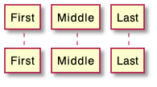

### 참가자에 특수문자 사용

따옴표를 사용하여 참가자를 정의할 수 있습니다. 그리고 `as` 키워드를 사용하여 참가자를 별칭으로 사용 할 수도 있다.

```java
@startuml
Alice -> "Bob()" : Hello
"Bob()" -> "This is very\nlong" as Long
' You can also declare:
' "Bob()" -> Long as "This is very\nlong"
Long --> "Bob()" : ok
@enduml
```


### 자신에게 메시지 보내기

참가자는 자기 자신에게 메시지를 보낼 수 있습니다.
`\n` 을 이용해서 여러 줄로 쓰는 것도 가능합니다

```java
@startuml
Alice->Alice: This is a signal to self.\nIt also demonstrates\nmultiline \ntext
@enduml
```

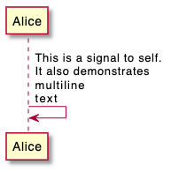

### 텍스트 정렬
응답 메세지 텍스트를 화살표 아래에 배치할 수 있습니다.
``` sh
skinparam responseMessageBelowArrow true 
```
위의 명령을 이용하여 응답 메세지 텍스트를 화살표 하단에 배치할 수 있습니다.

```java
@startuml
skinparam responseMessageBelowArrow true
Bob -> Alice : hello
Alice -> Bob : ok
@enduml
```


### 화살표 스타일 변경
다음 방법으로 화살표 스타일을 바꿀 수 있습니다.

* 끝 부분에 x를 추가하여 메시지가 전달되지 않았음을 표시
* `<` 나 `>` 대신에 `\` 나 `/` 를 사용해서 아래쪽이나 위쪽 화살표만 표시
* `>`를 두번 사용하여 화살표 모양을 얇게 표시 (예. `>>`)
* `-` 대신 `--` 를 사용해서 점선 화살표를 표시
* 화살표 다음에 `o` 추가
* 양쪽 끝에 화살표 추가

```java
@startuml
Bob ->x Alice
Bob -> Alice
Bob ->> Alice
Bob -\ Alice
Bob \\- Alice
Bob //-- Alice

Bob ->o Alice
Bob o\\-- Alice

Bob <-> Alice
Bob <->o Alice
@enduml
```

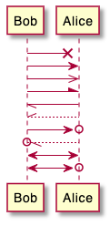

### 화살표 색상 변경
다음의 표기법을 이용해서 각각 화살표의 색상을 바꿀 수 있습니다.

```java
@startuml
Bob -[#red]> Alice : hello
Alice -[#0000FF]->Bob : ok
@enduml
```

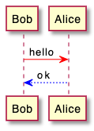

### 메시지 순서에 번호 매기기

`autonumber` 키워드는 메시지에 자동으로 번호를 매길 때 사용합니다.

```java
@startuml
autonumber
Bob -> Alice : Authentication Request
Bob <- Alice : Authentication Response
@enduml
```


`autonumber 시작번호` 의 형태로 표시하면 특정 번호로 시작 할 수 있으며, 
`autonumber 시작번호 증가값` 으로 표시 할 경우 증가 값을 조정하는 것도 가능합니다.

```java
@startuml
autonumber
Bob -> Alice : Authentication Request
Bob <- Alice : Authentication Response

autonumber 15
Bob -> Alice : Another authentication Request
Bob <- Alice : Another authentication Response

autonumber 40 10
Bob -> Alice : Yet another authentication Request
Bob <- Alice : Yet another authentication Response

@enduml
```


쌍따옴표를 이용하여 표시 형식을 바꿀 수도 있습니다.
표시 형식은 자바 클래스 `DecimalFormat` 을 사용합니다. 
(0 은 숫자를 의미하며, # 은 숫자로 표시하되, 빈 자리이면 0 으로 채우라는 뜻이다).
몇 가지 html 태그를 사용 할 수 있다.

```java
@startuml
autonumber "<b>[000]"
Bob -> Alice : Authentication Request
Bob <- Alice : Authentication Response

autonumber 15 "<b>(<u>##</u>)"
Bob -> Alice : Another authentication Request
Bob <- Alice : Another authentication Response

autonumber 40 10 "<font color=red><b>Message 0  "
Bob -> Alice : Yet another authentication Request
Bob <- Alice : Yet another authentication Response

@enduml
```

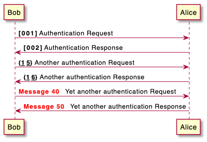

또한, `autonumber stop` 키워드를 이용하여 번호 매김을 일시 정지할 수 있으며, 
`autonumber resume 증가값 표시형식` 키워드를 이용하여 계속해서 번호를 매길 수 있습니다.

```java
@startuml
autonumber 10 10 "<b>[000]"
Bob -> Alice : Authentication Request
Bob <- Alice : Authentication Response

autonumber stop
Bob -> Alice : dummy

autonumber resume "<font color=red><b>Message 0  "
Bob -> Alice : Yet another authentication Request
Bob <- Alice : Yet another authentication Response

autonumber stop
Bob -> Alice : dummy

autonumber resume 1 "<font color=blue><b>Message 0  "
Bob -> Alice : Yet another authentication Request
Bob <- Alice : Yet another authentication Response
@enduml
```


### 페이지 제목, 머리말과 꼬리말

`title` 키워드를 이용하여 페이지에 제목을 추가할 수 있다.
또한, `header` 와 `footer` 를 이용하여, 각각 머리말과 꼬리말을 표시할 수도 있다.

```java
@startuml

header Page Header
footer Page %page% of %lastpage%

title Example Title

Alice -> Bob : message 1
Alice -> Bob : message 2

@enduml
```

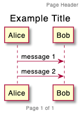

### 다이어그램 분리

`newpage` 키워드를 이용하여, 다이어그램을 여러 개의 이미지로 분리 할 수 있습니다.
`newpage` 키워드 뒤에 바로 새로 생성되는 페이지의 제목을 넣을 수 있습니다.
여러 페이지에 걸쳐 있는 긴 다이어그램을 출력할 때 유용하다.
> 주: 예제에서 첫 번째 페이지만 표시되었지만, 실제로 잘 동작하는 기능입니다.

```java
@startuml

Alice -> Bob : message 1
Alice -> Bob : message 2

newpage

Alice -> Bob : message 3
Alice -> Bob : message 4

newpage A title for the\nlast page

Alice -> Bob : message 5
Alice -> Bob : message 6
@enduml
```

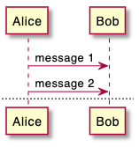

### 메세지 그룹화
다음과 같은 키워드들을 사용하여 메세지를 그룹화 할 수 있습니다
* `alt`/`else`
* `opt`
* `loop`
* `par`
* `break`
* `critical`
* `group` 화면에 보여질 텍스트

헤더에 표시될 텍스트를 추가할 수 있습니다. (`group` 제외).
`end` 키워드는 그룹을 닫는데 사용합니다.
또한, 그룹을 중첩해서 만들 수도 있습니다.

```java
@startuml
Alice -> Bob: Authentication Request

alt successful case

    Bob -> Alice: Authentication Accepted

else some kind of failure

    Bob -> Alice: Authentication Failure
    group My own label
    Alice -> Log : Log attack start
        loop 1000 times
            Alice -> Bob: DNS Attack
        end
    Alice -> Log : Log attack end
    end

else Another type of failure

   Bob -> Alice: Please repeat

end
@enduml
```


### 2차 그룹 라벨

`group`에서 `[` 와 `]` 사이에 2차 텍스트 라벨을 지정해 줄 수 있습니다.

```java
@startuml
Alice -> Bob: Authentication Request
Bob -> Alice: Authentication Failure
group My own label [My own label 2]
    Alice -> Log : Log attack start
    loop 1000 times
        Alice -> Bob: DNS Attack
    end
    Alice -> Log : Log attack end
end
@enduml
```


### 메시지에 노트 추가하기
메시지 다음에 `note left` 나 `note right` 키워드를 이용하여, 메시지에 노트를 추가할 수 있습니다.
또한, 한 번에 여러 줄의 노트를 추가하는 경우에는 `end note` 를 이용하여, 노트의 끝을 표시해 주어야 합니다.

```java
@startuml
Alice->Bob : hello
note left: this is a first note

Bob->Alice : ok
note right: this is another note

Bob->Bob : I am thinking
note left
a note
can also be defined
on several lines
end note
@enduml
```

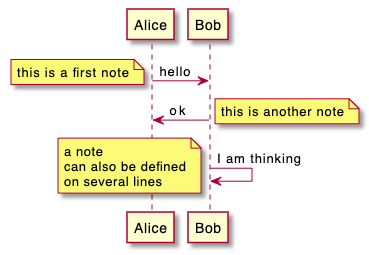

### 다른 형태의 노트들

`note left of` , `note right of`, `note over` 키워드를 이용하여 참가자의 상대적인 위치에 노트를 추가할 수 있습니다.
노트의 배경 색을 변경함으로써, 노트를 강조하는 것도 가능합니다.
한 번에 여러 줄의 노트를 추가하는 경우에는, `end note` 를 이용하여 노트의 끝을 표시해 주어야 합니다.

```java
@startuml
participant Alice
participant Bob
note left of Alice #aqua
This is displayed
left of Alice.
end note

note right of Alice: This is displayed right of Alice.

note over Alice: This is displayed over Alice.

note over Alice, Bob #FFAAAA: This is displayed\n over Bob and Alice.

note over Bob, Alice
This is yet another
example of
a long note.
end note
@enduml
```


### 노트 모양 바꾸기

`hnote` 와 `rnote` 키워드를 이용하여, 노트의 모양을 바꿀 수 있습니다.

```java
@startuml
caller -> server : conReq
hnote over caller : idle
caller <- server : conConf
rnote over server
 "r" as rectangle
 "h" as hexagon
endrnote
@enduml
```


### 모든 참가자 위에 표시되는 노트 [across]

다음의 문법을 이용해서 모든 참가자에 걸치도록 노트를 작성할 수 있습니다:
`note across: note_description`

```java
@startuml
Alice->Bob:m1
Bob->Charlie:m2
note over Alice, Charlie: Old method for note over all part. with:\n ""note over //FirstPart, LastPart//"".
note across: New method with:\n""note across""
Bob->Alice
hnote across:Note across all part.
@enduml
```


### 동일 라인으로 정렬되는 노트 [/]
`/`를 이용하여 동일 라인에 정렬되는 노트를 만들 수 있습니다.

#### `/`가 없는 경우
```java
@startuml
note over Alice : initial state of Alice
note over Bob : initial state of Bob
Bob -> Alice : hello
@enduml
```
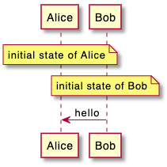

#### `/`가 있는 경우

```java
@startuml
note over Alice : initial state of Alice
/ note over Bob : initial state of Bob
Bob -> Alice : hello
@enduml
```
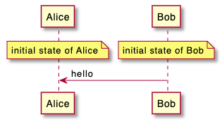

### Creole 과 HTML
[creole 문법](https://plantuml.com/ko/creole)을 사용할 수 있습니다.

```java
@startuml
participant Alice
participant "The **Famous** Bob" as Bob

Alice -> Bob : hello --there--
... Some ~~long delay~~ ...
Bob -> Alice : ok
note left
  This is **bold**
  This is //italics//
  This is ""monospaced""
  This is --stroked--
  This is __underlined__
  This is ~~waved~~
end note

Alice -> Bob : A //well formatted// message
note right of Alice
 This is <back:cadetblue><size:18>displayed</size></back>
 __left of__ Alice.
end note
note left of Bob
 <u:red>This</u> is <color #118888>displayed</color>
 **<color purple>left of</color> <s:red>Alice</strike> Bob**.
end note
note over Alice, Bob
 <w:#FF33FF>This is hosted</w> by 
end note
@enduml
```
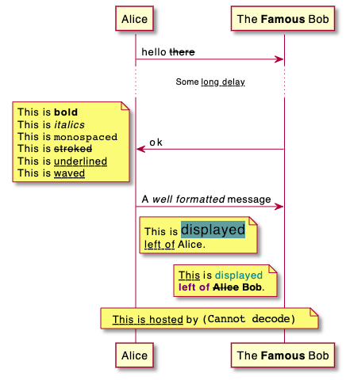

### 구분자

`==` 구분자를 이용하여, 다이어그램을 논리적인 단계로 구분하여 나눌 수 있습니다.

```java
@startuml

== Initialization ==

Alice -> Bob: Authentication Request
Bob --> Alice: Authentication Response

== Repetition ==

Alice -> Bob: Another authentication Request
Alice <-- Bob: another authentication Response

@enduml
```


### 참조

`ref over` 키워드를 이용하여, 다이어그램에 참조를 표시할 수 있습니다.

```java
@startuml
participant Alice
actor Bob

ref over Alice, Bob : init

Alice -> Bob : hello

ref over Bob
  This can be on
  several lines
end ref
@enduml
```


### 지연
`...` 을 이용하여, 다이어그램에 지연 상태를 나타낼 수 있으며, 그 위에 메시지를 추가할 수도 있습니다.

```java
@startuml

Alice -> Bob: Authentication Request
...
Bob --> Alice: Authentication Response
...5 minutes latter...
Bob --> Alice: Bye !

@enduml
```


### 문장 줄 바꿈
긴 메시지를 줄 바꿈하려면, 문장 안에 `\n`을 추가합니다.
또 다른 방법은 `maxMessageSize` 설정을 사용합니다.

```java
@startuml
skinparam maxMessageSize 50
participant a
participant b
a -> b :this\nis\nmanually\ndone
a -> b :this is a very long message on several words
@enduml
```
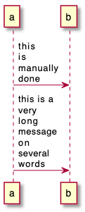

### 공백
`|||` 을 이용하여 다이어그램에 공백을 나타낼 수 있으며, 공백에 얼마만큼의 픽셀을 사용할 것인지 숫자로 명시할 수도 있습니다.

```java
@startuml

Alice -> Bob: message 1
Bob --> Alice: ok
|||
Alice -> Bob: message 2
Bob --> Alice: ok
||45||
Alice -> Bob: message 3
Bob --> Alice: ok

@enduml
```


### 생명선 활성화 및 비활성화
`activate` 와 `deactivate` 는 참가자의 활성화 여부를 표현하는데 사용합니다.
참가자가 활성화되면, 참가자의 생명선이 나타납니다.
`activate` 와 `deactivate` 는 바로 이전의 메시지에 적용됩니다.
`destroy` 는 참가자의 생명선이 끝났음을 표현합니다.

```java
@startuml
participant User

User -> A: DoWork
activate A

A -> B: << createRequest >>
activate B

B -> C: DoWork
activate C
C --> B: WorkDone
destroy C

B --> A: RequestCreated
deactivate B

A -> User: Done
deactivate A

@enduml
```


생명선은 중첩해서 사용할 수 있으며, 생명선에 색을 넣을 수도 있습니다.

```java
@startuml
participant User

User -> A: DoWork
activate A #FFBBBB

A -> A: Internal call
activate A #DarkSalmon

A -> B: << createRequest >>
activate B

B --> A: RequestCreated
deactivate B
deactivate A
A -> User: Done
deactivate A

@enduml
```


### 리턴
리턴 메시지를 생성하는 `return` 명령이 추가되었습니다. 리턴되는 지점은 가장 최근에 생명선을 활성화 시킨 지점에서 출발점이 됩니다. 
문법은 간단히 `return 꼬리표` 이며, 꼬리표는 기존의 메시지와 마찬가지로 임의의 문자열을 쓸 수 있습니다.

```java
@startuml
Bob -> Alice : hello
activate Alice
Alice -> Alice : some action
return bye
@enduml
```


### 참가자 생성

해당 메시지가 실제로 새 객체를 생성한다는 걸 나타내기 위해, 참가자가 첫 번째 메시지를 수신하기 전 `create` 키워드를 사용할 수 있습니다.

```java
@startuml
Bob -> Alice : hello

create Other
Alice -> Other : new

create control String
Alice -> String
note right : You can also put notes!

Alice --> Bob : ok

@enduml
```


### 생명선 활성화, 비활성화 및 참가자 생성을 위한 간단 표시 사용법

특정 참가자를 명시한 후 바로 다음과 같은 표시를 특정 의미로 사용할 수 있습니다:

* `++` 해당 참가자의 생명선 시작 (선택적으로 `#color` 로 칼러 지정 가능)
* `--` 생명선 비활성화 (또는 `return` 으로 비활성화)
* `**` 참가자 생성
* `!!` 생명선 제거

```java
@startuml
alice -> bob ++ : hello
bob -> bob ++ : self call
bob -> bib ++  #005500 : hello
bob -> george ** : create
return done
return rc
bob -> george !! : delete
return success
@enduml
```
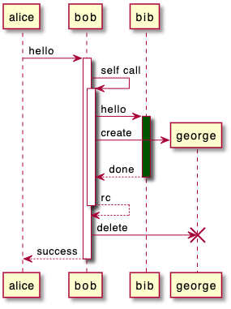

### 외부에서 들어오거나 외부로 나가는 메시지

시퀀스 다이어그램에서 외부에서 들어오는 화살표 또는 외부로 나가는 화살표를 표현할 수 있습니다.
`[` 로 시작하면 외부에서 들어오는 화살표, `]`로 끝나면 외부로 나가는 화살표를 나타냅니다.

```java
@startuml
[-> A: DoWork

activate A

A -> A: Internal call
activate A

A ->] : << createRequest >>

A<--] : RequestCreated
deactivate A
[<- A: Done
deactivate A
@enduml
```


또한 화사표 모양을 다음과 같이 바꿀 수 있습니다:

```java
@startuml
[-> Bob
[o-> Bob
[o->o Bob
[x-> Bob

[<- Bob
[x<- Bob

Bob ->]
Bob ->o]
Bob o->o]
Bob ->x]

Bob <-]
Bob x<-]
@enduml
```
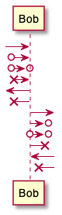

### 짧은 외부에서 들어오거나 외부로 나가는 메시지

이전의 `[` 나 `]` 대신 `?`를 이용합니다.

```java
@startuml
?-> Alice    : ""?->""\n**short** to actor1
[-> Alice    : ""[->""\n**from start** to actor1
[-> Bob      : ""[->""\n**from start** to actor2
?-> Bob      : ""?->""\n**short** to actor2
Alice ->]    : ""->]""\nfrom actor1 **to end**
Alice ->?    : ""->?""\n**short** from actor1
Alice -> Bob : ""->"" \nfrom actor1 to actor2
@enduml
```


### Anchors and Duration
`teoz` 속성을 이용하여 특정 시간의 앵커를 명시할 수 있습니다.

```java
@startuml
!pragma teoz true

{start} Alice -> Bob : start doing things during duration
Bob -> Max : something
Max -> Bob : something else
{end} Bob -> Alice : finish

{start} <-> {end} : some time

@enduml
```


### Stereotypes 과 Spots

`<<` 과 `>>` 를 이용하여 스테리오타입을 지정할 수 있습니다. 이 스테레오파입 안에 `(X,color)`과 같은 형식으로 스팟(아이콘)을 지정 색상으로 표현할 수 있습니다.

```java
@startuml

participant "Famous Bob" as Bob << Generated >>
participant Alice << (C,#ADD1B2) Testable >>

Bob->Alice: First message

@enduml
```


기본적으로 스테레오타입에 표시되는 것은 `guillemet` 글자 입니다만,
```
skinparam guillemet false
```
위와 같이 설정하여 다르게 표현할 수 있습니다. 
> 바로 이전의 다이얼로그와 비교해 보십시오.

```java
@startuml

skinparam guillemet false
participant "Famous Bob" as Bob << Generated >>
participant Alice << (C,#ADD1B2) Testable >>

Bob->Alice: First message

@enduml
```


또한 다음과 같이 스팟만 표현할 수도 있습니다.
```java
@startuml

participant Bob << (C,#ADD1B2) >>
participant Alice << (C,#ADD1B2) >>

Bob->Alice: First message

@enduml
```


### 제목에 보다 다양한 표현 방법

제목에 [creole 문법](https://plantuml.com/ko/creole)을 사용할 수 있습니다.

```java
@startuml

title __Simple__ **communication** example

Alice -> Bob: Authentication Request
Bob -> Alice: Authentication Response

@enduml
```


또한 제목에 `\n` 과 같은 개행 문자도 넣을 수 있습니다.

```java
@startuml

title __Simple__ communication example\non several lines

Alice -> Bob: Authentication Request
Bob -> Alice: Authentication Response

@enduml
```


또한 여러 줄의 제목을 넣기 위해서 `title` 과 `end title` 키워드를 이용해도 됩니다.

```java
@startuml

title
 <u>Simple</u> communication example
 on <i>several</i> lines and using <font color=red>html</font>
 This is hosted by 
end title

Alice -> Bob: Authentication Request
Bob -> Alice: Authentication Response

@enduml
```


### 참가자 테두리
`box` 와 `end box` 명령을 이용하여 참가자에 대한 테두리를 줄 수 있습니다.
`box` 키워드 뒤에 제목과 컬러 등의 정보를 함께 줄 수 있습니다.

```java
@startuml

box "Internal Service" #LightBlue
participant Bob
participant Alice
end box
participant Other

Bob -> Alice : hello
Alice -> Other : hello

@enduml
```


### 하단 참가자 표시 제거
`hide footbox` 키워드를 이용하여 다이어그램에서 하단 참가자 표시를 제거할 수 있습니다.

```java
@startuml

hide footbox
title Footer removed

Alice -> Bob: Authentication Request
Bob --> Alice: Authentication Response

@enduml
```


### Skinparam

`skinparam` 명령어를 이용하면 전체 다이어그램의 폰트, 컬러 등을 쉽게 바꿀 수 있습니다.

다음과 같은 명령이 가능합니다:
* 다이어그램 선언부에서 다른 명령들 처럼 지정,
* `included file`에 지정,
* `command line` 이나 `ANT task`에 제공되는 설정파일에 지정.
* In a configuration file, provided in the `command line` or the `ANT task`.

다음과 같은 예제를 확인하세요.

```java
@startuml
skinparam sequenceArrowThickness 2
skinparam roundcorner 20
skinparam maxmessagesize 60
skinparam sequenceParticipant underline

actor User
participant "First Class" as A
participant "Second Class" as B
participant "Last Class" as C

User -> A: DoWork
activate A

A -> B: Create Request
activate B

B -> C: DoWork
activate C
C --> B: WorkDone
destroy C

B --> A: Request Created
deactivate B

A --> User: Done
deactivate A

@enduml
```


```java
@startuml
skinparam backgroundColor #EEEBDC
skinparam handwritten true

skinparam sequence {
ArrowColor DeepSkyBlue
ActorBorderColor DeepSkyBlue
LifeLineBorderColor blue
LifeLineBackgroundColor #A9DCDF

ParticipantBorderColor DeepSkyBlue
ParticipantBackgroundColor DodgerBlue
ParticipantFontName Impact
ParticipantFontSize 17
ParticipantFontColor #A9DCDF

ActorBackgroundColor aqua
ActorFontColor DeepSkyBlue
ActorFontSize 17
ActorFontName Aapex
}

actor User
participant "First Class" as A
participant "Second Class" as B
participant "Last Class" as C

User -> A: DoWork
activate A

A -> B: Create Request
activate B

B -> C: DoWork
activate C
C --> B: WorkDone
destroy C

B --> A: Request Created
deactivate B

A --> User: Done
deactivate A

@enduml
```


### 여백 조종

박스 등의 여백 조종이 가능합니다.

```java
@startuml
skinparam ParticipantPadding 20
skinparam BoxPadding 10

box "Foo1"
participant Alice1
participant Alice2
end box
box "Foo2"
participant Bob1
participant Bob2
end box
Alice1 -> Bob1 : hello
Alice1 -> Out : out
@enduml
```


### 부록 : 모든 종류의 화살표 형식

#### 일반 화살표

```java
@startuml
participant Alice as a
participant Bob   as b
a ->     b : ""->   ""
a ->>    b : ""->>  ""
a -\     b : ""-\   ""
a -\\    b : ""-\\\\""
a -/     b : ""-/   ""
a -//    b : ""-//  ""
a ->x    b : ""->x  ""
a x->    b : ""x->  ""
a o->    b : ""o->  ""
a ->o    b : ""->o  ""
a o->o   b : ""o->o ""
a <->    b : ""<->  ""
a o<->o  b : ""o<->o""
a x<->x  b : ""x<->x""
a ->>o   b : ""->>o ""
a -\o    b : ""-\o  ""
a -\\o   b : ""-\\\\o""
a -/o    b : ""-/o  ""
a -//o   b : ""-//o ""
a x->o   b : ""x->o ""
@enduml
```


#### 재귀 화살표

```java
@startuml
participant Alice as a
participant Bob   as b
a ->     a : ""->   ""
a ->>    a : ""->>  ""
a -\     a : ""-\   ""
a -\\    a : ""-\\\\""
a -/     a : ""-/   ""
a -//    a : ""-//  ""
a ->x    a : ""->x  ""
a x->    a : ""x->  ""
a o->    a : ""o->  ""
a ->o    a : ""->o  ""
a o->o   a : ""o->o ""
a <->    a : ""<->  ""
a o<->o  a : ""o<->o""
a x<->x  a : ""x<->x""
a ->>o   a : ""->>o ""
a -\o    a : ""-\o  ""
a -\\o   a : ""-\\\\o""
a -/o    a : ""-/o  ""
a -//o   a : ""-//o ""
a x->o   a : ""x->o ""
@enduml
```


#### (`[`, `]` 을 사용한) 외부에서 또는 외부로의 화살표

`[`를 사용한 외부에서 들어오는 화살표

```java
@startuml
participant Alice as a
participant Bob   as b
[->      b : ""[->   ""
[->>     b : ""[->>  ""
[-\      b : ""[-\   ""
[-\\     b : ""[-\\\\""
[-/      b : ""[-/   ""
[-//     b : ""[-//  ""
[->x     b : ""[->x  ""
[x->     b : ""[x->  ""
[o->     b : ""[o->  ""
[->o     b : ""[->o  ""
[o->o    b : ""[o->o ""
[<->     b : ""[<->  ""
[o<->o   b : ""[o<->o""
[x<->x   b : ""[x<->x""
[->>o    b : ""[->>o ""
[-\o     b : ""[-\o  ""
[-\\o    b : ""[-\\\\o""
[-/o     b : ""[-/o  ""
[-//o    b : ""[-//o ""
[x->o    b : ""[x->o ""
@enduml
```


`]`를 사용한 외부로 나가는 화살표

```java
@startuml
participant Alice as a
participant Bob   as b
a ->]      : ""->]   ""
a ->>]     : ""->>]  ""
a -\]      : ""-\]   ""
a -\\]     : ""-\\\\]""
a -/]      : ""-/]   ""
a -//]     : ""-//]  ""
a ->x]     : ""->x]  ""
a x->]     : ""x->]  ""
a o->]     : ""o->]  ""
a ->o]     : ""->o]  ""
a o->o]    : ""o->o] ""
a <->]     : ""<->]  ""
a o<->o]   : ""o<->o]""
a x<->x]   : ""x<->x]""
a ->>o]    : ""->>o] ""
a -\o]     : ""-\o]  ""
a -\\o]    : ""-\\\\o]""
a -/o]     : ""-/o]  ""
a -//o]    : ""-//o] ""
a x->o]    : ""x->o] ""
@enduml
```
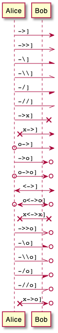

#### (`?` 을 사용한) 외부에서 또는 외부로의 짧은 화살표

`?`를 이용한 외부에서 들어오는 짧은 화살표

```java@startuml
participant Alice as a
participant Bob   as b
a ->     b : //Long long label//
?->      b : ""?->   ""
?->>     b : ""?->>  ""
?-\      b : ""?-\   ""
?-\\     b : ""?-\\\\""
?-/      b : ""?-/   ""
?-//     b : ""?-//  ""
?->x     b : ""?->x  ""
?x->     b : ""?x->  ""
?o->     b : ""?o->  ""
?->o     b : ""?->o  ""
?o->o    b : ""?o->o ""
?<->     b : ""?<->  ""
?o<->o   b : ""?o<->o""
?x<->x   b : ""?x<->x""
?->>o    b : ""?->>o ""
?-\o     b : ""?-\o  ""
?-\\o    b : ""?-\\\\o ""
?-/o     b : ""?-/o  ""
?-//o    b : ""?-//o ""
?x->o    b : ""?x->o ""
@enduml
```


`?`를 이용한 외부로 나가는 짧은 화살표

```java
@startuml
participant Alice as a
participant Bob   as b
a ->     b : //Long long label//
a ->?      : ""->?   ""
a ->>?     : ""->>?  ""
a -\?      : ""-\?   ""
a -\\?     : ""-\\\\?""
a -/?      : ""-/?   ""
a -//?     : ""-//?  ""
a ->x?     : ""->x?  ""
a x->?     : ""x->?  ""
a o->?     : ""o->?  ""
a ->o?     : ""->o?  ""
a o->o?    : ""o->o? ""
a <->?     : ""<->?  ""
a o<->o?   : ""o<->o?""
a x<->x?   : ""x<->x?""
a ->>o?    : ""->>o? ""
a -\o?     : ""-\o?  ""
a -\\o?    : ""-\\\\o?""
a -/o?     : ""-/o?  ""
a -//o?    : ""-//o? ""
a x->o?    : ""x->o? ""
@enduml
```


### 특별 SkinParameter

#### 기본

```java
@startuml
Bob -> Alice : hello
Alice -> Bob : ok
@enduml
```
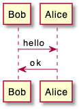

#### 생명선 형식 (lifelineStrategy)

`nosolid` (기본)

```java
@startuml
skinparam lifelineStrategy nosolid
Bob -> Alice : hello
Alice -> Bob : ok
@enduml
```


아래와 같이 `solid` 형식으로 지정하면 기본 점선의 생명선이 실선으로 표시됩니다.
`skinparam lifelineStrategy solid`

```java
@startuml
skinparam lifelineStrategy solid
Bob -> Alice : hello
Alice -> Bob : ok
@enduml
```


#### 화살표 모양 (style strictuml)

날카로운 화살표 대신 삼각형의 채워진 화살표 모양을 주기 위하여 다음과 같이 지정할 수 있습니다. 또한 하단의 참가자 표시도 생략됩니다.

* `skinparam style strictuml`

```java
@startuml
skinparam style strictuml
Bob -> Alice : hello
Alice -> Bob : ok
@enduml
```


### 링크안된 참가자 숨기기
기본적으로 모든 참가자는 다이얼로그에 표시됩니다.

```java
@startuml
participant Alice
participant Bob
participant Carol

Alice -> Bob : hello
@enduml
```


그런데 `hide unlinked` 라는 명령을 주면 연결되지 않은 참가자는 숨기게 할 수 있습니다.

```java
@startuml
hide unlinked
participant Alice
participant Bob
participant Carol

Alice -> Bob : hello
@enduml
```


### 그룹 메시지의 색

그룹 메시지에 [color](https://plantuml.com/ko/color) 색상 조정이 가능합니다:

```java
@startuml
Alice -> Bob: Authentication Request
alt#Gold #LightBlue Successful case
    Bob -> Alice: Authentication Accepted
else #Pink Failure
    Bob -> Alice: Authentication Rejected
end
@enduml
```
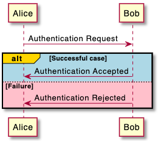

### 전체 외곽선 (Mainframe)

```java
@startuml
mainframe This is a **mainframe**
Alice->Bob : Hello
@enduml
```


