# [Plant UML](https://plantuml.com/ko/)

PlantUML 은 다이어그램을 빠르게 작성하기 위한 오픈 소스 프로젝트입니다.

## Use Case 다이어그램

다음과 같은 예제를 살펴봅니다 :
> `skinparam shadowing false` 명령을 사용하면 그림자 모양이 안 나타나게 할 수 있습니다.

### 유즈케이스

유즈케이스는 (두개의 괄호는 원으로 보이기 때문에) 괄호로 싸서 표현합니다.
아니면 `usecase` 키워를 이용하여 정의할 수 있습니다. 그리고 `as` 키워드를 이용하여 별칭을 정의 할 수 있습니다. 별칭은 관계를 정의할 때 사용됩니다.

```java
@startuml

(First usecase)
(Another usecase) as (UC2)
usecase UC3
usecase (Last\nusecase) as UC4

@enduml
```
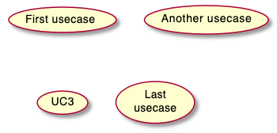

### 엑터(Actors)

액터는 콜론을 앞뒤로 붙여 표현할 수 있습니다. 아니면 `actor` 키워드를 이용하여 정의할 수 있고 `as` 키워드를 이용하여 별칭을 사용할 수도 있습니다.

```java
@startuml

:First Actor:
:Another\nactor: as Man2
actor Woman3
actor :Last actor: as Person1

@enduml
```
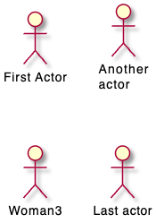

### 엑터 스타일 변경
기본적인 허수아비 같은 형식의 엑터에서 다음과 같은 형태로 변경할 수 있습니다:

* 사용자 아이콘 모양 - `skinparam actorStyle awesome`;
* 사용자 쿠키 모양 - `skinparam actorStyle hollow`.

#### 기본 모양 (Stick man)
```java
@startuml
:User: --> (Use)
"Main Admin" as Admin
"Use the application" as (Use)
Admin --> (Admin the application)
@enduml
```
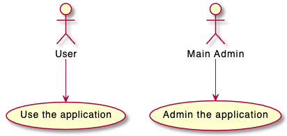

#### 아이콘 모양 (Awesome man)
```java
@startuml
skinparam actorStyle awesome
:User: --> (Use)
"Main Admin" as Admin
"Use the application" as (Use)
Admin --> (Admin the application)
@enduml
```
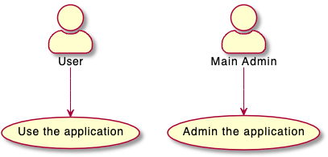

#### 쿠키 모양 (Hollow man)
```java
@startuml
skinparam actorStyle Hollow 
:User: --> (Use)
"Main Admin" as Admin
"Use the application" as (Use)
Admin --> (Admin the application)
@enduml
```
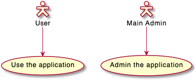

### 유즈케이스 종류

`usecase` 키워드로 직접 유즈케이스를 만들 수 있는데 `as` 다음에 오는 설명에 `--..==__` 등을 이용하여 라인으로 구분할 수 있습니다.

```java
@startuml

usecase UC1 as "You can use
several lines to define your usecase.
You can also use separators.
--
Several separators are possible.
==
And you can add titles:
..Conclusion..
This allows large description."

@enduml
```
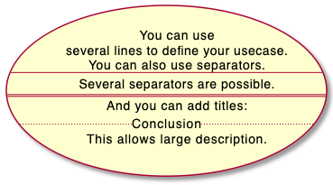

### 패키지 사용
엑터 또는 유즈케이스를 그룹화 하기 위하여 패키지를 사용할 수 있습니다.

```java
@startuml
left to right direction
actor Guest as g
package Professional {
  actor Chef as c
  actor "Food Critic" as fc
}
package Restaurant {
  usecase "Eat Food" as UC1
  usecase "Pay for Food" as UC2
  usecase "Drink" as UC3
  usecase "Review" as UC4
}
fc --> UC4
g --> UC1
g --> UC2
g --> UC3
@enduml
```
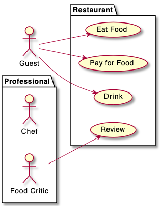

또한 `package` 대신 `rectangle`을 이용하여 패키지 모양을 변경할 수 있습니다.
```java
@startuml
left to right direction
actor "Food Critic" as fc
rectangle Restaurant {
  usecase "Eat Food" as UC1
  usecase "Pay for Food" as UC2
  usecase "Drink" as UC3
}
fc --> UC1
fc --> UC2
fc --> UC3
@enduml
```
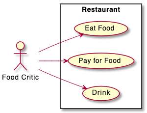

### 기본 예제
엑터에서 유즈케이스로 화살표를 주기 위하여 `-->` 기호를 사용합니다.
더 많은 `-`를 붙여 더 긴 화살표를 만들 수 있습니다. 또한 `:` 콜론으로 구분된 설명을 넣어 화살표에 설명을 붙일 수 있습니다.

```java
@startuml

User -> (Start)
User --> (Use the application) : A small label

:Main Admin: ---> (Use the application) : This is\nyet another\nlabel

@enduml
```
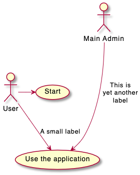

### 확장
만약 동일 엑터 또는 유즈케이스 사이에 연결을 시키려면 `<|--` 기호를 사용합니다.

```java
@startuml
:Main Admin: as Admin
(Use the application) as (Use)

User <|-- Admin
(Start) <|-- (Use)

@enduml
```
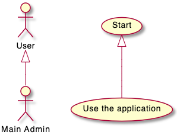

### Using notes
엑터나 유즈케이스 등의 객체에 노트를 추가하기 위하여 `note left of` , `note right of` , `note top of` , `note bottom of` 와 같은 키워드를 사용할 수 있습니다.
노트 객체는 단독으로 추가될 수도 있는데 `..` 심볼을 사용하여 다른 객체에 연결 할 수 있습니다.

```java
@startuml
:Main Admin: as Admin
(Use the application) as (Use)

User -> (Start)
User --> (Use)

Admin ---> (Use)

note right of Admin : This is an example.

note right of (Use)
  A note can also
  be on several lines
end note

note "This note is connected\nto several objects." as N2
(Start) .. N2
N2 .. (Use)
@enduml
```
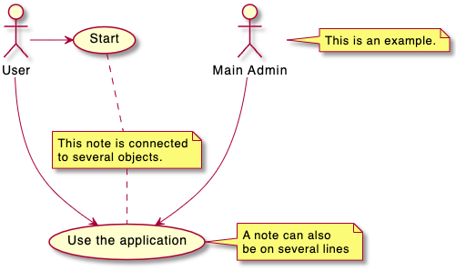

### Stereotypes
`<<` 와 `>>`를 이용한 추가 기술로 스테레오타입을 추가할 수 있습니다.

```java
@startuml
User << Human >>
:Main Database: as MySql << Application >>
(Start) << One Shot >>
(Use the application) as (Use) << Main >>

User -> (Start)
User --> (Use)

MySql --> (Use)

@enduml
```
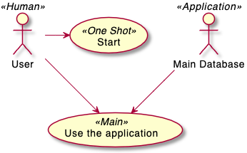

### 화살표 방향 변경
기본적으로, 객체 사이의 링크는 대쉬2개 `--` 로 표시하고 수직방향이다. 다음 처럼 대쉬1개 (혹은 점)을 넣어서 수평방향 링크를 사용할 수 있다:

```java
@startuml
:user: --> (Use case 1)
:user: -> (Use case 2)
@enduml
```
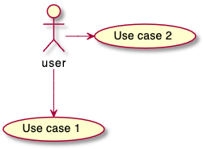

또한 다음과 같이 반대 방향으로 연결도 가능합니다:
```java
@startuml
(Use case 1) <.. :user:
(Use case 2) <- :user:
@enduml
```
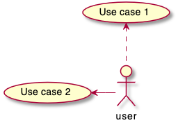

만약 화살표 심볼 사이에 `left`, `right`, `up` 또는 `down` 키워드를 삽입한다면 해당 화살표 방향을 바꿀 수 있습니다:
```java
@startuml
:user: -left-> (dummyLeft)
:user: -right-> (dummyRight)
:user: -up-> (dummyUp)
:user: -down-> (dummyDown)
@enduml
```
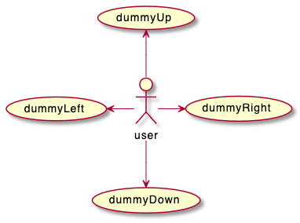

> `-down->` 대신 `-d->` 또는 `-do->` 와 같이 앞 첫자 또는 두자만 기술하여 동일한 방향을 가리킬 수 있습니다.

### 다이어그램 페이지 분할
`newpage` 키워드를 이용하여 다이어그램을 여러 페이지로 나눌 수 있습니다.

```java
@startuml
:actor1: --> (Usecase1)
newpage
:actor2: --> (Usecase2)
@enduml
```
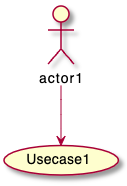

> 위의 일부만 나오는 것 처럼 보이더라도 출력 시 정상 출력됩니다.

### 왼쪽에서 오른쪽 방향
다이어그램이 그려지는 기본 방향은 위에서 아래쪽으로 `top to bottom` 입니다.

```java
@startuml
'default
top to bottom direction
user1 --> (Usecase 1)
user2 --> (Usecase 2)

@enduml
```
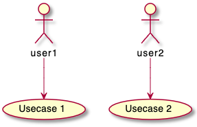

`left to right direction` 명령을 이용하면 이런 그리는 방향을 왼쪽에서 오른쪽으로 변경시킬 수 있습니다. (때로는 이런 결과가 더 좋아보이는 경우도 있습니다.)
```java
@startuml

left to right direction
user1 --> (Usecase 1)
user2 --> (Usecase 2)

@enduml
```


### 컬러나 폰트 변경 (Skinparam)
[skinparam](https://plantuml.com/ko/skinparam) 명령을 이용하여 폰트나 색상 등을 변경할 수 있습니다.

다음과 같은 위치에서 명령을 내릴 수 있습니다:

* 다이어그램 정의부에 다른 명령처럼 설정하거나,
* [included file](https://plantuml.com/ko/preprocessing)에 지정하거나,
* [명령행](https://plantuml.com/ko/command-line) 또는 [ANT task](https://plantuml.com/ko/ant-task)에 제공된 설정파일에 지정할 수 있습니다.

> `skinparam handwritten true` 명령을 주면 손으로 작성한 것처럼 보입니다

```java
@startuml
skinparam handwritten true

skinparam usecase {
BackgroundColor DarkSeaGreen
BorderColor DarkSlateGray

BackgroundColor<< Main >> YellowGreen
BorderColor<< Main >> YellowGreen

ArrowColor Olive
ActorBorderColor black
ActorFontName Courier

ActorBackgroundColor<< Human >> Gold
}

User << Human >>
:Main Database: as MySql << Application >>
(Start) << One Shot >>
(Use the application) as (Use) << Main >>

User -> (Start)
User --> (Use)

MySql --> (Use)

@enduml
```
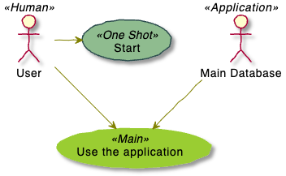

### 기타 예제
```java
@startuml
left to right direction
skinparam packageStyle rectangle
actor customer
actor clerk
rectangle checkout {
  customer -- (checkout)
  (checkout) .> (payment) : include
  (help) .> (checkout) : extends
  (checkout) -- clerk
}
@enduml
```
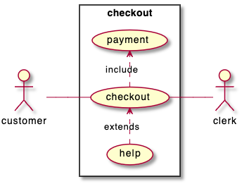

### 비즈니스 유즈케이스
비즈니스 유즈케이스를 위하여 `/`를 추가합니다.

#### 비즈니스 유즈케이스
```java
@startuml

(First usecase)/
(Another usecase)/ as (UC2)
usecase/ UC3
usecase/ (Last\nusecase) as UC4

@enduml
```
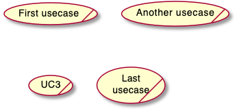

#### 비즈니스 엑터
```java
@startuml

:First Actor:/
:Another\nactor:/ as Man2
actor/ Woman3
actor/ :Last actor: as Person1

@enduml
```
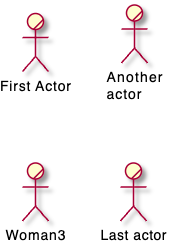

### 인라인 형식의 화살표 색상 및 스타일 변경
다음과 같은 방식으로 화살표의 [색상](https://plantuml.com/ko/color) 또는 스타일을 변경할 수 있습니다:

* #color;line.[bold|dashed|dotted];text:color

```java
@startuml
actor foo
foo --> (bar) : normal
foo --> (bar1) #line:red;line.bold;text:red  : red bold
foo --> (bar2) #green;line.dashed;text:green : green dashed 
foo --> (bar3) #blue;line.dotted;text:blue   : blue dotted
@enduml
```
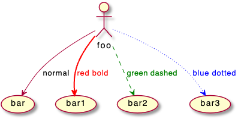

### 인라인 형식의 객체 색상 및 스타일 변경
다음과 같은 방식으로 개별 객체의 [색상](https://plantuml.com/ko/color) 또는 스타일을 변경할 수 있습니다:

* #[color|back:color];line:color;line.[bold|dashed|dotted];text:color

```java
@startuml
actor a
actor b #pink;line:red;line.bold;text:red
usecase c #palegreen;line:green;line.dashed;text:green
usecase d #aliceblue;line:blue;line.dotted;text:blue
@enduml
```
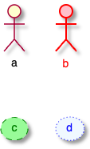
