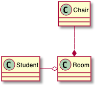

## 클래스 다이어그램

### 요소 정의

```java
@startuml
abstract        abstract
abstract class  "abstract class"
annotation      annotation
circle          circle
()              circle_short_form
class           class
diamond         diamond
<>              diamond_short_form
entity          entity
enum            enum
interface       interface
@enduml
```


### 클래스 관계
[클래스 관계](https://www.nextree.co.kr/p6753/)는 다음과 같은 부호를 사용합니다.

| 형식 | 심볼 | 설명 | 예제 |
|---|---|---|---|
| 일반화(Generalization) | `<|--` | 일반화는 부모 클래스와 자식 클래스 간의 상속 관계를 나타냅니다. |  
| 실체화(Realization) | `<|..` | 실체화는 인터페이스의 명세만 있는 메서드를 오버라이딩하여 실제 기능으로 구하는 것을 말합니다. | 
| 의존(Dependency) | `<..` | 의존 관계는 어떤 클래스가 다른 클래스를 참조하는 것을 말합니다. | 
| 연관(Association) | `--` | 상호 참조, 혹은 어느 한쪽 참조 | 
| 방향성 있는 연관(Association) | `-->` | 참조하는 쪽과 참조 당하는 쪽 구분 | 
| 집합, 집합연관(Aggregation) | `o--` | 전체와 부분의 관계 | 
| 합성, 복합연관(Composition) | `*--` 또는 `*-->` | 전체와 부분의 관계를 나타내지만 개념적으로 집합보다 더 강한 집합을 의미, 전체 인스턴스가 부분 인스턴스도 동일하게 생성, 소멸 등 관리 | 

#### 일반화(Generalization)
```java
@startuml
class User {
  id: String
  password: String
  void login()
}
class Customer {
  void login()
}
class Admin {
  void login()
}

User <|-- Customer
User <|-- Admin
@enduml
```


#### 실체화(Realization)
```java
@startuml
class CheckLogic <<interface>> {
  +void isTrue() : boolean
}

class DateCheckLogic {
  +void isTrue() : boolean
}

CheckLogic <|.. DateCheckLogic
@enduml
```


#### 의존(Dependency)
```java
@startuml
User ..> Schedule
@enduml
```


#### 연관(Association)
```java
@startuml
User -- Address
@enduml
```


#### 방향성 있는 연관(Association)
```java
@startuml
class User {
  - addresses : List<Address> [*]
}

User --> Address
@enduml
```


#### 집합, 집합연관(Aggregation)
```java
@startuml
User o-- Address
@enduml
```


#### 합성, 복합연관(Composition)
```java
@startuml
User *-- Address
@enduml
```


### 예제

#### 예제 1
```java
@startuml
Class01 <|-- Class02
Class03 *-- Class04
Class05 o-- Class06
Class07 .. Class08
Class09 -- Class10
@enduml
```


#### 예제 2
```java
@startuml
Class11 <|.. Class12
Class13 --> Class14
Class15 ..> Class16
Class17 ..|> Class18
Class19 <--* Class20
@enduml
```


#### Example 3
```java
@startuml
Class21 #-- Class22
Class23 x-- Class24
Class25 }-- Class26
Class27 +-- Class28
Class29 ^-- Class30
@enduml
```


### 관계를 나타내기 위한 레이블
관계에서 레이블을 추가하기 위해서는 뒤에 `:` 를 붙이고 레이블을 작성하면 됩니다.
관계차수를 나타내기 위해서는 `""`를 이용하여 관계의 양쪽 끝에 작성하면 됩니다.

```java
@startuml
Class01 "1" *-- "many" Class02 : contains
Class03 o-- Class04 : aggregation
Class05 --> "1" Class06
@enduml
```


`<` 또는 `>`을 사용하여 객체가 다른 객체에 대한 흐름 관계를 더 자세히 설명할 수 있습니다.
```java
@startuml
class Car
Driver - Car : drives >
Car *- Wheel : have 4 >
Car -- Person : < owns
@enduml
```


### 메서드나 필드 추가
메서드나 필드를 추가하기 위하여 객체 뒤에 `:`를 붙이고 메서드나 필드를 추가하면 됩니다. `()` 괄호가 포함되면 자동으로 메서드로 인식합니다.

```java
@startuml
Object <|-- ArrayList

Object : equals()
ArrayList : Object[] elementData
ArrayList : size()

@enduml
```


그런데 위의 방법 보다는 `{}`를 이용하여 실제 클래스를 정의하는 것처럼 기술하는 것이 더 편할 수 있습니다. 역시 `()` 괄호가 포함되면 자동으로 메서드로 인식합니다.

```java
@startuml
class Dummy {
  String data
  void methods()
}

class Flight {
   flightNumber : Integer
   departureTime : Date
}
@enduml
```


`{field}`나 `{method}`를 이용하여 직접 필드와 메서드로 지정할 수도 있습니다.

```java
@startuml
class Dummy {
  {field} A field (despite parentheses)
  {method} Some method
}
@enduml
```


### 메서드, 필드 노출(Visibility) 정의
메서드나 필드들을 정의할 때, 특수문자를 사용하여 관련된 필드나 메서드의 외부 노출을 지정할 수 있습니다. 명령어는 다음과 같습니다:

* `-` : private - 해당 클래스에서만 접근 가능
* `#` : protected - 해당 클래스와 상속 받은 클래스에서 접근 가능
* `~` : package private - 해당 전체 패키지에서만 접근 가능
* `+` : public - 모든 외부에서 접근 가능

```java
@startuml

class Dummy {
 -field1
 #field2
 ~method1()
 +method2()
}
@enduml
```


`skinparam classAttributeIconSize 0`를 사용하여, 아이콘 표시를 끌 수 있습니다. 명령어는 다음과 같습니다:
```java
@startuml
skinparam classAttributeIconSize 0
class Dummy {
 -field1
 #field2
 ~method1()
 +method2()
}
@enduml
```


### Abstract 와 Static

`{static}` 또는 `{abstract}` 지지자를 이용하여 클래스의 메서드나 필드에 `abstract` 또는 `static` 임을 표시할 수 있습니다. ([참고](https://bigstupid.tistory.com/76)) 이 지시자는 필드나 메서드 정의의 시작부나 마지막에 올 수 있습니다. `{static}` 대신 `{classifier}` 지시자를 이용해도 동일 효과를 얻습니다.

```java
@startuml
class Dummy {
  {static} String id
  {abstract} void methods()
}
@enduml
```


### 고급 클래스 내용
기본적으로 메서드나 필드는 PlantUML에 의하여 자동으로 묶입니다만  `--` `..` `==` `__` 와 같은 구분자를 이용하여 의도한 그룹을 만들 수 있습니다.
또한 제목도 동일하게 나눌 수 있습니다.

```java
@startuml
class Foo1 {
  You can use
  several lines
  ..
  as you want
  and group
  ==
  things together.
  __
  You can have as many groups
  as you want
  --
  End of class
}

class User {
  .. Simple Getter ..
  + getName()
  + getAddress()
  .. Some setter ..
  + setName()
  __ private data __
  int age
  -- encrypted --
  String password
}

@enduml
```


### 노트와 스테레오타입

`class` 키워드와 함께, `<<` 와 `>>`를 이용하여 [스테레오타입](https://blog.daum.net/iq_jeong/7759137)을 지정할 수 있습니다.
또한 `note left of` , `note right of` , `note top of` , `note bottom of` 등을 이용하여 노트를 만들 수 있습니다.
별도 노트를 만들고 `as` 로 만든 별칭을 이용하여 객체와 `..` 심볼로 연결하는 것도 가능합니다. 

```java
@startuml
class Object << general >>
Object <|--- ArrayList

note top of Object : In java, every class\nextends this one.

note "This is a floating note" as N1
note "This note is connected\nto several objects." as N2
Object .. N2
N2 .. ArrayList

class Foo
note left: On last defined class

@enduml
```


### 노트의 속성에 관한 내용

노트에는 다음과 같은 HTML 태그를 줄 수 있습니다. ([Creole 표현식 참조](https://plantuml.com/ko/creole))
* `<b>` - 굵게
* `<u>` - 밑줄
* `<i>` - 이텔릭체
* `<s>`, `<del>`, `<strike>` - 취소줄
* `<font color="#AAAAAA">` 또는 `<font color="colorName">` - 폰트 색생
* `<color:#AAAAAA>` 또는 `<color:colorName>` - 색상
* `<size:nn>` - 폰트 크기 조종
* `` 또는 `` - 이미지 표시

노트는 여러 줄에 걸쳐 표시할 수 있습니다.
`note left`, `note right`, `note top`, `note bottom` 등을 이용하여 마지막에 정의한 클래스(`On last defined class`)에 노트를 추가할 수 있습니다.

```java
@startuml

class Foo
note left: On last defined class

note top of Object
  In java, <size:18>every</size> <u>class</u>
  <b>extends</b>
  <i>this</i> one.
end note

note as N1
  This note is <u>also</u>
  <b><color:royalBlue>on several</color>
  <s>words</s> lines
  And this is hosted by 
end note

@enduml
```


### 필드, 속성, 메서드 등에 관한 노트
필드, 속성, 메서드 등에 노트를 다는 것이 가능합니다.

> ⚠ 제약사항
>
> * 이 내용은 `top` 또는 `bottom`에는 사용할 수 없고 `left` 또는 `right`에만 적용할 수 있습니다.
> * 이름 구분자인 `::`과 함께 `클래스::필드` 처럼 사용할 수 있습니다.

#### 필드 또는 메서드에 노트달기
```java
@startuml
class A {
{static} int counter
+void {abstract} start(int timeout)
}
note right of A::counter
  This member is annotated
end note
note right of A::start
  This method is now explained in a UML note
end note
@enduml
```


#### 동일 이름의 메서드에 노트 달기
```java
@startuml
class A {
{static} int counter
+void {abstract} start(int timeoutms)
+void {abstract} start(Duration timeout)
}
note left of A::counter
  This member is annotated
end note
note right of A::"start(int timeoutms)"
  This method with int
end note
note right of A::"start(Duration timeout)"
  This method with Duration
end note
@enduml
```


### 링크에 노트 달기

`note on link`를 이용하면 화살표 등의 링크에 노트를 다는 것이 가능합니다.
또한 `note left on link`, `note right on link`, `note top on link`, `note bottom on link` 등을 이용하면 특정 위치에 노트를 다는 것이 가능합니다.

```java
@startuml

class Dummy
Dummy --> Foo : A link
note on link #red: note that is red

Dummy --> Foo2 : Another link
note right on link #blue
this is my note on right link
and in blue
end note

@enduml
```


### 추상화 클래스(Abstract class) 와 인터페이스
`abstract` 또는 `abstract class` 키워드를 이용하여 추상화 클래스 정의할 수 있습니다.
클래스 이름은 *이탤릭*체로 표현됩니다. 또한 `interface`, `annotation` 나 `enum` 키워드를 이용하여 해당 내용을 정의할 수 있습니다.

```java
@startuml

abstract class AbstractList
abstract AbstractCollection
interface List
interface Collection

List <|-- AbstractList
Collection <|-- AbstractCollection

Collection <|- List
AbstractCollection <|- AbstractList
AbstractList <|-- ArrayList

class ArrayList {
  Object[] elementData
  size()
}

enum TimeUnit {
  DAYS
  HOURS
  MINUTES
}

annotation SuppressWarnings

@enduml
```


### 클래스 이름에 특별 문자 이용

클래스 (또는 인터페이스, 추상화 클래스, ENUM 등)에 [non-letters](https://plantuml.com/ko/unicode)를 표현하려면 다음과 같이 합니다:
* 클래스 정의에 `as` 키워드를 사용
* `""` 클래스 이름 앞뒤로 쌍따옴표 사용

```java
@startuml
class "This is my class" as class1
class class2 as "It works this way too"

class2 *-- "foo/dummy" : use
@enduml
```


### 속성, 메서드 등 숨기기
`hide`/`show` 명령을 이용하면 숨기기/보이기 등을 할 수 있습니다.
또한 `hide empty members` 기본 명령이 있는데 이것은 비어있는 클래스 정의 등은 보이지 않게 합니다.
`empty members` 대신 다음과 같은 경우에 숨기는 것이 가능합니다:
* `empty fields` 또는 `empty attributes` - 필드나 속성이 비어 있는 경우
* `empty methods` - 메서드가 비어 있는 경우
* `fields` 또는 `attributes` - 필드나 속성이 정의되어 있어도 숨기는 경우
* `methods` - 메서드가 정의되어 있어도 숨기는 경우
* `members` - 필드나 메서드가 정의되어 있어도 숨기는 경우
* `circle` - 클래스 이름 앞에 원형으로 채워진 아이콘 스팟
* `stereotype` - 스테레오타입

You can also provide, just after the `hide` or `show` keyword:
* `class` for all classes,
* `interface` for all interfaces,
* `enum` for all enums,
* `<<foo1>>` for classes which are stereotyped with *foo1*,
* an existing class name.

You can use several `show`/`hide` commands to define rules and exceptions.

```java
@startuml

class Dummy1 {
  +myMethods()
}

class Dummy2 {
  +hiddenMethod()
}

class Dummy3 <<Serializable>> {
String name
}

hide members
hide <<Serializable>> circle
show Dummy1 methods
show <<Serializable>> fields

@enduml
```


### 클래스 숨기기
`show`/`hide` 명령을 클래스에도 적용할 수 있습니다.
이것은 많은 불러오기 파일([!included file](https://plantuml.com/ko/preprocessing))에 유용할 수 있습니다.
또는 파일 포함([file inclusion](https://plantuml.com/ko/preprocessing)) 이후 특정 클래스를 숨기는데 이용할 수도 있습니다.

```java
@startuml

class Foo1
class Foo2

Foo2 *-- Foo1

hide Foo2

@enduml
```


### 클래스 제거
클래스를 제거하기 위해서는 `remove` 명령을 사용할 수 있습니다.
일([!included file](https://plantuml.com/ko/preprocessing))에 유용할 수 있습니다.
또는 파일 포함([file inclusion](https://plantuml.com/ko/preprocessing)) 이후 특정 클래스를 숨기는데 이용할 수도 있습니다.

```java
@startuml

class Foo1
class Foo2

Foo2 *-- Foo1

remove Foo2

@enduml
```


### 링크되지 않은 클래스 숨기거나 지우기

기본적으로 모든 클래스는 보여집니다.

```java
@startuml
class C1
class C2
class C3
C1 -- C2
@enduml
```


하지만 다음과 같은 명령어를 이용하여 링크안된 클래스는 숨길 수 있습니다:
* `hide @unlinked `classes:

```java
@startuml
class C1
class C2
class C3
C1 -- C2

hide @unlinked
@enduml
```


또는 `hide` 대신 `remove`를 사용해도 동일합니다:
* `remove @unlinked` classes:

```java
@startuml
class C1
class C2
class C3
C1 -- C2

hide @unlinked
@enduml
```


### generics 사용
`<` 과 `>`를 이용하여 클래스의 `generic` 정보를 줄 수 있습니다.

```java
@startuml

class Foo<? extends Element> {
  int size()
}
Foo *- Element

@enduml
```


하지만 `skinparam genericDisplay old` 명령을 주면 이 정보를 안 보이게 할 수 있습니다.

### 특정 스팟 아이콘

일반적으로 스테레오타입 안에 `(C, I, E or A)` 글자가 나타내는 클래스, 인터페이스, ENUM, 추상화 클래스에 대한 스팟 문자를 가질 수 있습니다.
그러나 다음 예제와 마찬가지로 자신만의 특정 글자를 추가할 수 있습니다.

```java
@startuml

class System << (S,#FF7700) Singleton >>
class Date << (D,orchid) >>
@enduml
```


### 패키지
`package` 키워드를 사용하여 패키지를 정의할 수 있습니다. 그리고 정의할 때 배경 색 (HTML 에서 사용하는 색상 코드나 이름)을 선택적으로 정의할 수도 있습니다.

또한 이런 패키지 정의는 중첩가능 합니다.

```java
@startuml

package "Classic Collections" #DDDDDD {
  Object <|-- ArrayList
}

package net.sourceforge.plantuml {
  Object <|-- Demo1
  Demo1 *- Demo2
}

@enduml
```


### 패키지 스타일
각각의 패키지에 개별 스타일을 지정할 수 있습니다.

`skinparam packageStyle` 명령 또는 스테레오타입을 통하여 기본 스타일을 지정할 수 있습니다:

```java
@startuml
scale 750 width
package foo1 <<Node>> {
  class Class1
}

package foo2 <<Rectangle>> {
  class Class2
}

package foo3 <<Folder>> {
  class Class3
}

package foo4 <<Frame>> {
  class Class4
}

package foo5 <<Cloud>> {
  class Class5
}

package foo6 <<Database>> {
  class Class6
}

@enduml
```


또한 다음 예제와 같이 패키지 사이에 링크를 달 수 있습니다:
```java
@startuml

skinparam packageStyle rectangle

package foo1.foo2 {
}

package foo1.foo2.foo3 {
  class Object
}

foo1.foo2 +-- foo1.foo2.foo3

@enduml
```


### 네임스페이스

패키지 사이에서 클래스 이름은 고유하게 정의되어야 합니다. 이 말은 다른 패키지에 동일 이름의 클래스가 존재하면 안된다는 의미입니다.

만약 동일한 이름을 사용하여야만 한다면 [네임스페이스](http://en.wikipedia.org/wiki/Namespace_%28computer_science%29) 라는 개념을 이용합니다.

만약 동일한 이름의 클래스 (아래 예제에서는 `Person`)가 있다면 패키지 이름에 해당 클래스를 추가한 전체 경로 이름을 사용하면 됩니다.

```java
@startuml

class BaseClass

namespace net.dummy #DDDDDD {
    .BaseClass <|-- Person
    Meeting o-- Person

    .BaseClass <|- Meeting
}

namespace net.foo {
  net.dummy.Person  <|- Person
  .BaseClass <|-- Person

  net.dummy.Meeting o-- Person
}

BaseClass <|-- net.unused.Person

@enduml
```


### 자동 네임스페이스 생성

`set namespaceSeparator ???` 명령에 `???` 대신 여러 값을 지정하면 `.` 점으로 표현되는 네임스페이스 대신 해당 구분자로 네임스페이스를 그릴 수 있습니다.

#### 기본 `.` 점 그리기인 경우
```java
@startuml

class X1::X2::foo {
  some info
}

@enduml
```


#### 네임스페이스를 `::` 으로 지정한 경우
```java
@startuml

set namespaceSeparator ::
class X1::X2::foo {
  some info
}

@enduml
```


`set namespaceSeparator none` 명령을 주면 네임스페이스 구분을 하지 않습니다.

```java
@startuml

set namespaceSeparator none
class X1.X2.foo {
  some info
}

@enduml
```


### 롤리팝 인터페이스
다음과 같은 문법으로 클래스의 [롤리팝 인터페이스](https://stackoverflow.com/questions/8307724/using-lollipops-sockets-in-uml-why-and-when)를 정의할 수 있습니다:
* `bar ()- foo`
* `bar ()-- foo`
* `foo -() bar`

```java
@startuml
class foo
bar ()- foo
@enduml
```


### 연결 방향 변경
기본적으로 클래스 간에 대쉬 연결을 위해서 `--` 를 이용하면 세로방향으로 연결됩니다. 하지만 다음과 같이 한 개의 대쉬를 이용하여 가로 방향으로 바꿀 수 있습니다.

```java
@startuml
Room o- Student
Room *-- Chair
@enduml
```


다음과 같이 연결 방향을 바꿀 수 있습니다:

```java
@startuml
Student -o Room
Chair --* Room
@enduml
```


링크 사이에 `left`, `right`, `up` 또는 `down` 키워드를 이용하여 연결 방향을 지정할 수 있습니다:

```java
@startuml
foo -left-> dummyLeft
foo -right-> dummyRight
foo -up-> dummyUp
foo -down-> dummyDown
@enduml
```


`-down-` 대신 `-d-` 또는 `-do-` 라고 해도 동일하게 동작합니다.

[left to right direction](https://plantuml.com/ko/use-case-diagram#d551e48d272b2b07) 를 이용할 수도 있습니다:

```java
@startuml
left to right direction
foo -left-> dummyLeft
foo -right-> dummyRight
foo -up-> dummyUp
foo -down-> dummyDown
@enduml
```


### 연관 클래스
다음과 같이 두 클래스 사이에 `연관 클래스(association class)`를 정의할 수 있습니다.

```java
@startuml
class Student {
  Name
}
Student "0..*" - "1..*" Course
(Student, Course) .. Enrollment

class Enrollment {
  drop()
  cancel()
}
@enduml
```


또한 다음과 같이 다른 두 개의 대시로 `--`나 점 `..` 을 이용하여 가로방향으로 지정할 수 있습니다:

```java
@startuml
class Student {
  Name
}
Student "0..*" -- "1..*" Course
(Student, Course) . Enrollment

class Enrollment {
  drop()
  cancel()
}
@enduml
```


### 동일 클래스의 연관
```java
@startuml
class Station {
    +name: string
}

class StationCrossing {
    +cost: TimeInterval
}

<> diamond

StationCrossing . diamond
diamond - "from 0..*" Station
diamond - "to 0..* " Station
@enduml
```


### 컬러나 폰트 변경 (Skinparam)
[skinparam](https://plantuml.com/ko/skinparam) 명령을 이용하여 폰트나 색상 등을 변경할 수 있습니다.

다음과 같은 위치에서 명령을 내릴 수 있습니다:

* 다이어그램 정의부에 다른 명령처럼 설정하거나,
* [included file](https://plantuml.com/ko/preprocessing)에 지정하거나,
* [명령행](https://plantuml.com/ko/command-line) 또는 [ANT task](https://plantuml.com/ko/ant-task)에 제공된 설정파일에 지정할 수 있습니다.

```java
@startuml

skinparam class {
BackgroundColor PaleGreen
ArrowColor SeaGreen
BorderColor SpringGreen
}
skinparam stereotypeCBackgroundColor YellowGreen

Class01 "1" *-- "many" Class02 : contains

Class03 o-- Class04 : aggregation

@enduml
```


### 스테레오타입의 색상 이나 폰트 조종
클래스의 스테레오타입에 대한 색상이나 폰트를 조종할 수 있습니다.

```java
@startuml

skinparam class {
BackgroundColor PaleGreen
ArrowColor SeaGreen
BorderColor SpringGreen
BackgroundColor<<Foo>> Wheat
BorderColor<<Foo>> Tomato
}
skinparam stereotypeCBackgroundColor YellowGreen
skinparam stereotypeCBackgroundColor<< Foo >> DimGray

Class01 <<Foo>>
Class03 <<Foo>>
Class01 "1" *-- "many" Class02 : contains

Class03 o-- Class04 : aggregation

@enduml
```


### 그라디언트 색상
`# notation`를 이용하면 클래스나 노트 등에 대하여 개별 색상을 조정할 수 있습니다.
[색상](https://plantuml.com/ko/color)에 나오는 것 색상 이름이나 RGB 코드를 통하여 색상을 조정합니다.

또한 다음과 같은 분리자를 통하여 각 방향에 대하여 두 색상을 지정함으로써 그라디언트 색상을 지정할 수 있습니다:
* `|` - 좌에서 우로 색상 변화
* `/` - 좌상에서 우하로 색상 변화
* `\` - 좌하에서 우상으로 색상 변화
* `-` - 상에서 하로 색상 변화

```java
@startuml

skinparam backgroundcolor AntiqueWhite/Gold
skinparam classBackgroundColor Wheat|CornflowerBlue

class Foo #red-green
note left of Foo #blue\9932CC
  this is my
  note on this class
end note

package example #GreenYellow/LightGoldenRodYellow {
  class Dummy
}

@enduml
```


### 레이아웃 도움말
때로는 기본 레이아웃이 마음에 들지 않을 수도 있습니다.
동일 클래스를 그룹하는데 `together` 키워드를 사용할 수 있습니다. 그러면 동일 패키지에 있는 것처럼 그룹화할 수 있습니다.

또한 `hidden` 키워드를 이용하여 링크를 숨기게 할 수도 있습니다.
Sometimes, the default layout is not perfect...

You can use `together` keyword to group some classes together : the layout engine will try to group them (as if they were in the same package).

You can also use `hidden` links to force the layout.

```java
@startuml

class Bar1
class Bar2
together {
  class Together1
  class Together2
  class Together3
}
Together1 - Together2
Together2 - Together3
Together2 -[hidden]--> Bar1
Bar1 -[hidden]> Bar2


@enduml
```


### 대용량 파일 분할하기
때로는 아주 큰 이미지를 만들 수 있습니다.
이런 경우 `page (hpages)x(vpages)` 명령을 이용하면 여러 페이지로 출력되도록 바꿀 수 있습니다.
`hpages`는 전체 이미지가 가로로 몇 페이지로 나뉘어지는가를 나타내고 `vpages`는 세로로 몇 페이지로 나뉘어지는가를 나타냅니다.

또한 특정 `skinparam`을 이용하여 분할되는 페이지의 경계에 대한 속성을 지정할 수 있습니다.

```java
@startuml
' Split into 4 pages
page 2x2
skinparam pageMargin 10
skinparam pageExternalColor gray
skinparam pageBorderColor black

class BaseClass

namespace net.dummy #DDDDDD {
    .BaseClass <|-- Person
    Meeting o-- Person

    .BaseClass <|- Meeting

}

namespace net.foo {
  net.dummy.Person  <|- Person
  .BaseClass <|-- Person

  net.dummy.Meeting o-- Person
}

BaseClass <|-- net.unused.Person
@enduml
```


### 확장(Extends) 과 구현(implements)
`extends` 와 `implements` 키워드를 이용할 수 있습니다.

```java
@startuml
class ArrayList implements List
class ArrayList extends AbstractList
@enduml
```


### 대괄호를 이용한 링크나 화살표 양식

#### 라인 양식
링크나 화살표에 직접 `bold`, `dashed`, `dotted`, `hidden` 또는 `plain` 관계를 설정할 수 있습니다:

* 라벨이 없는 경우

```java
@startuml
title Bracketed line style without label
class foo
class bar
bar1 : [bold]  
bar2 : [dashed]
bar3 : [dotted]
bar4 : [hidden]
bar5 : [plain] 

foo --> bar
foo -[bold]-> bar1
foo -[dashed]-> bar2
foo -[dotted]-> bar3
foo -[hidden]-> bar4
foo -[plain]-> bar5
@enduml
```


* 라벨 포함

```java
@startuml
title Bracketed line style with label
class foo
class bar
bar1 : [bold]  
bar2 : [dashed]
bar3 : [dotted]
bar4 : [hidden]
bar5 : [plain] 

foo --> bar          : ∅
foo -[bold]-> bar1   : [bold]
foo -[dashed]-> bar2 : [dashed]
foo -[dotted]-> bar3 : [dotted]
foo -[hidden]-> bar4 : [hidden]
foo -[plain]-> bar5  : [plain]

@enduml
```


#### 라인 색상
```java
@startuml
title Bracketed line color
class foo
class bar
bar1 : [#red]
bar2 : [#green]
bar3 : [#blue]

foo --> bar
foo -[#red]-> bar1     : [#red]
foo -[#green]-> bar2   : [#green]
foo -[#blue]-> bar3    : [#blue]
'foo -[#blue;#yellow;#green]-> bar4
@enduml
```


#### 라인 굵기
```java
@startuml
title Bracketed line thickness
class foo
class bar
bar1 : [thickness=1]
bar2 : [thickness=2]
bar3 : [thickness=4]
bar4 : [thickness=8]
bar5 : [thickness=16]

foo --> bar                 : ∅
foo -[thickness=1]-> bar1   : [1]
foo -[thickness=2]-> bar2   : [2]
foo -[thickness=4]-> bar3   : [4]
foo -[thickness=8]-> bar4   : [8]
foo -[thickness=16]-> bar5  : [16]

@enduml
```


#### 모두 적용
```java
@startuml
title Bracketed line style mix
class foo
class bar
bar1 : [#red,thickness=1]
bar2 : [#red,dashed,thickness=2]
bar3 : [#green,dashed,thickness=4]
bar4 : [#blue,dotted,thickness=8]
bar5 : [#blue,plain,thickness=16]

foo --> bar                             : ∅
foo -[#red,thickness=1]-> bar1          : [#red,1]
foo -[#red,dashed,thickness=2]-> bar2   : [#red,dashed,2]
foo -[#green,dashed,thickness=4]-> bar3 : [#green,dashed,4]
foo -[#blue,dotted,thickness=8]-> bar4  : [blue,dotted,8]
foo -[#blue,plain,thickness=16]-> bar5  : [blue,plain,16]
@enduml
```


### 링크나 화살표의 라인 색상, 양식 등 변경
다음과 같은 [color](https://plantuml.com/ko/color) 색상 조정이 가능합니다:
* `#color;line.[bold|dashed|dotted];text:color`

```java
@startuml
class foo
foo --> bar : normal
foo --> bar1 #line:red;line.bold;text:red  : red bold
foo --> bar2 #green;line.dashed;text:green : green dashed
foo --> bar3 #blue;line.dotted;text:blue   : blue dotted
@enduml
```


### 클래스 색상 및 양식 변경 (인라인 양식)
다음과 같은 [color](https://plantuml.com/ko/color) 색상 조정이 가능합니다:
* `#color ##[style]color`

첫번째 배경 색상을 (`#color`) 지정하고 나서, 라인 양식과 색상을 (`##[style]color`) 지정합니다.

```java
@startuml
abstract   abstract
annotation annotation #pink ##[bold]red
class      class      #palegreen ##[dashed]green
interface  interface  #aliceblue ##[dotted]blue
@enduml
```


* `#[color|back:color];header:color;line:color;line.[bold|dashed|dotted];text:color`

```java
@startuml
abstract   abstract
annotation annotation #pink;line:red;line.bold;text:red
class      class      #palegreen;line:green;line.dashed;text:green
interface  interface  #aliceblue;line:blue;line.dotted;text:blue
@enduml
```


예제:

```java
@startuml
class bar #line:green;back:lightblue
class bar2 #lightblue;line:green

class Foo1 #back:red;line:00FFFF
class FooDashed #line.dashed:blue
class FooDotted #line.dotted:blue
class FooBold #line.bold
class Demo1 #back:lightgreen|yellow;header:blue/red
@enduml
```


### 클래스 멤머로 또는 멤버에서 화살표

#### 예제 1
```java
@startuml
class Foo {
+ field1
+ field2
}

class Bar {
+ field3
+ field4
}

Foo::field1 --> Bar::field3 : foo
Foo::field2 --> Bar::field4 : bar
@enduml
```


#### 예제 2
```java
@startuml
left to right direction

class User {
  id : INTEGER
  ..
  other_id : INTEGER
}

class Email {
  id : INTEGER
  ..
  user_id : INTEGER
  address : INTEGER
}

User::id *-- Email::user_id
@enduml
```


### 상속 화살표 모음
`skinparam groupInheritance` 을 이용하면 임계값을 이용한 화살표의 병합이 가능합니다.

#### 그룹 상속 1 (그룹화 없음)
```java
@startuml
skinparam groupInheritance 1

A1 <|-- B1

A2 <|-- B2
A2 <|-- C2

A3 <|-- B3
A3 <|-- C3
A3 <|-- D3

A4 <|-- B4
A4 <|-- C4
A4 <|-- D4
A4 <|-- E4
@enduml
```


#### 그룹 상속 2 (2개 부터 그룹화)
```java
@startuml
skinparam groupInheritance 2

A1 <|-- B1

A2 <|-- B2
A2 <|-- C2

A3 <|-- B3
A3 <|-- C3
A3 <|-- D3

A4 <|-- B4
A4 <|-- C4
A4 <|-- D4
A4 <|-- E4
@enduml
```


#### 그룹 상속 3 (3개 부터 그룹화)
```java
@startuml
skinparam groupInheritance 3

A1 <|-- B1

A2 <|-- B2
A2 <|-- C2

A3 <|-- B3
A3 <|-- C3
A3 <|-- D3

A4 <|-- B4
A4 <|-- C4
A4 <|-- D4
A4 <|-- E4
@enduml
```


#### 그룹 상속 4 (4개 부터 그룹화)
```java
@startuml
skinparam groupInheritance 4

A1 <|-- B1

A2 <|-- B2
A2 <|-- C2

A3 <|-- B3
A3 <|-- C3
A3 <|-- D3

A4 <|-- B4
A4 <|-- C4
A4 <|-- D4
A4 <|-- E4
@enduml
```

