# [Plant UML](https://plantuml.com/ko/)

PlantUML 은 다이어그램을 빠르게 작성하기 위한 오픈 소스 프로젝트입니다.

## 객체 다이어그램

### 객체 정의
`object` 키워드를 이용하여 객체를 정의할 수 있습니다.

```java
@startuml
object firstObject
object "My Second Object" as o2
@enduml
```
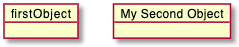

### 객체 사이의 관계
객체 사이의 관계는 다음과 같이 정의할 수 있습니다:
* `<|--` : 확장
* `*--` : 구성
* `o--` : 집합

`--` 대신 `..`를 이용하여 점선으로 표시할 수 있습니다.
객체 정의 이후 `:`와 텍스를 사용하여 설명글을 포함할 수 있습니다.
관계 정의 앞 또는 뒤에 `""`로 표현된 원소 개수[cardinality](https://en.wikipedia.org/wiki/Cardinality_(data_modeling))를 표현할 수 있습니다.

```java
@startuml
object Object01
object Object02
object Object03
object Object04
object Object05
object Object06
object Object07
object Object08

Object01 <|-- Object02
Object03 *-- Object04
Object05 o-- "4" Object06
Object07 .. Object08 : some labels
@enduml
```


### 연관 객체(Associations objects)
```java
@startuml
object o1
object o2
diamond dia
object o3

o1  --> dia
o2  --> dia
dia --> o3
@enduml
```
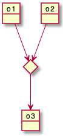

### 필드 추가
필드를 추가하려면 객체 뒤에 `:`를 붙이고 `필드 = 값`표현식 등으로 표현할 수 있습니다.

```java
@startuml

object user

user : name = "Dummy"
user : id = 123

@enduml
```
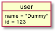

더 쉬운 표현식으로 객체를 `{}`를 감싸고 그 안에 필드 표현식을 넣는 방법이 있습니다.

```java
@startuml

object user {
  name = "Dummy"
  id = 123
}
@enduml
```


### 맵 테이블 또는 연관 어레이
`map` 키워드와 `=>` 구분자를 이용한 맵 테이블 또는 [associative array](https://en.wikipedia.org/wiki/Associative_array)을 정의할 수 있습니다.

#### 예제 1
```java
@startuml
map CapitalCity {
 UK => London
 USA => Washington
 Germany => Berlin
}
@enduml
```
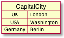

#### 예제 2
```java
@startuml
map "Map **Contry => CapitalCity**" as CC {
 UK => London
 USA => Washington
 Germany => Berlin
}
@enduml
```
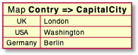

#### 예제 3
```java
@startuml
map "map: Map<Integer, String>" as users {
 1 => Alice
 2 => Bob
 3 => Charlie
}
@enduml
```
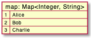

그리고 다음과 같이 링크도 가능합니다.

#### 예제 4
```java
@startuml
object London

map CapitalCity {
 UK *-> London
 USA => Washington
 Germany => Berlin
}
@enduml
```
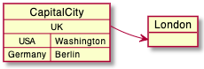

#### Example 5
```java
@startuml
object London
object Washington
object Berlin
object NewYork

map CapitalCity {
 UK *-> London
 USA *--> Washington
 Germany *---> Berlin
}

NewYork --> CapitalCity::USA
@enduml
```
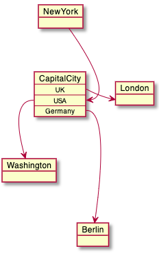

#### Example 6
```java
@startuml
package foo {
    object baz
}

package bar {
    map A {
        b *-> foo.baz
        c =>
    }
}

A::c --> foo
@enduml
```
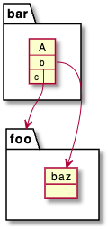

#### Example 7
```java
@startuml
object Foo
map Bar {
  abc=>
  def=>
}
object Baz

Bar::abc --> Baz : Label one
Foo --> Bar::def : Label two
@enduml
```
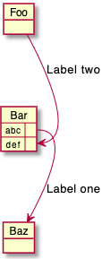

### 퍼트 다이어그램
[퍼트 다이어그램](https://ko.wikipedia.org/wiki/퍼트)을 `맵 테이블`을 이용하여 그릴 수 있습니다.
```java
@startuml PERT
left to right direction
' Horizontal lines: -->, <--, <-->
' Vertical lines: ->, <-, <->
title PERT: Project Name

map Kick.Off {
}
map task.1 {
    Start => End
}
map task.2 {
    Start => End
}
map task.3 {
    Start => End
}
map task.4 {
    Start => End
}
map task.5 {
    Start => End
}
Kick.Off --> task.1 : Label 1
Kick.Off --> task.2 : Label 2
Kick.Off --> task.3 : Label 3
task.1 --> task.4
task.2 --> task.4
task.3 --> task.4
task.4 --> task.5 : Label 4
@enduml
```
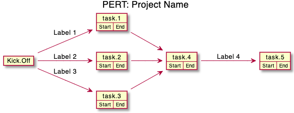
