## 활동 다이어그램

[기존의 활동 diagram 문법](https://plantuml.com/ko/활동-diagram-legacy) 은 몇몇 제약과 단점이 있습니다.(예를 들면, 유지보수가 어렵다.)

그래서 완전 새로운 문법과 구현이 베타버전으로 고안되었고, 더 나은 포맷과 문법으로 정의할 수 있었습니다.
이 새로운 구현의 또 다른 장점은 (시퀀스 다이어그램과 같이) Graphviz를 설치할 필요 없이 수행된다는 것입니다.

새로운 구문이 이전 구문을 대체할 겁니다. 그러나 호환성을 보장하기 위해 이전 구문이 여전히 인식됩니다.
새로운 구문으로 이전을 권장합니다.

### 간단한 액션
액션은 `:`와 `;` 사이에 텍스트로 표현됩니다.
텍스트 포맷은 [creole wiki syntax](https://plantuml.com/ko/creole)을 따릅니다.
정의된 순서대로 링크됩니다.

```java
@startuml
:Hello world;
:This is defined on
several **lines**;
@enduml
```


액션 다이어그램의 시작과 종료를 별도 표시하려면 `start` 와 `stop` 키워드를 이용합니다.

```java
@startuml
start
:Hello world;
:This is defined on
several **lines**;
stop
@enduml
```
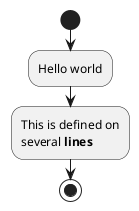


`stop` 대신 `end`를 이용해도 똑 같습니다.

```java
@startuml
start
:Hello world;
:This is defined on
several **lines**;
end
@enduml
```


### 조건식
`if`, `then` 과 `else`를 이용한 조건식을 다이어그램에 이용할 수 있습니다. 괄호를 이용하여 설명문을 넣을 수 있습니다.

```java
@startuml

start

if (Graphviz installed?) then (yes)
  :process all\ndiagrams;
else (no)
  :process only
  __sequence__ and __activity__ diagrams;
endif

stop

@enduml
```
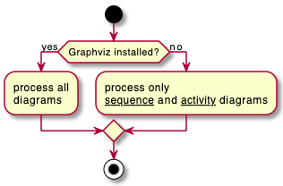

`elseif`를 이용하여 `if` 와 `else` 사이에 조건을 계속해서 줄 수 있습니다:

```java
@startuml
start
if (condition A) then (yes)
  :Text 1;
elseif (condition B) then (yes)
  :Text 2;
  stop
elseif (condition C) then (yes)
  :Text 3;
elseif (condition D) then (yes)
  :Text 4;
else (nothing)
  :Text else;
endif
stop
@enduml
```


### 스위치와 케이스
`switch`, `case` 와 `endswitch` 키워드를 이용하여 스위치 구문을 그릴 수 있습니다.
괄호를 이용하여 라벨을 조건구문의 라벨을 표현합니다.

```java
@startuml
start
switch (test?)
case ( condition A )
  :Text 1;
case ( condition B ) 
  :Text 2;
case ( condition C )
  :Text 3;
case ( condition D )
  :Text 4;
case ( condition E )
  :Text 5;
endswitch
stop
@enduml
```
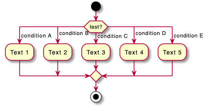

### 조건문에서 종료 [stop, kill, detach]
`if` 구문에서 종료 `stop` 할 수도 있습니다.

```java
@startuml
if (condition?) then
  :error;
  stop
endif
#palegreen:action;
@enduml
```


`kill` 또는 `detach` 키워드를 이용하면 `if` 조건문에서 종료하는 다른 방법을 제공합니다.

* `kill`

```java
@startuml
if (condition?) then
  #pink:error;
  kill
endif
#palegreen:action;
@enduml
```
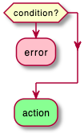

* `detach`

```java
@startuml
if (condition?) then
  #pink:error;
  detach
endif
#palegreen:action;
@enduml
```


### 반복 루프
`repeat` 와 `repeatwhile` 키워드를 이용한 반복문을 정의할 수 있습니다.

```java
@startuml

start

repeat
  :read data;
  :generate diagrams;
repeat while (more data?) is (yes)
->no;

stop

@enduml
```


`repeat` 반복문에서 되돌아가는 패스에 액션을 추가하기위하여 `backward`를 넣어줄 수 있습니다.

```java
@startuml

start

repeat :foo as starting label;
  :read data;
  :generate diagrams;
backward:This is backward;
repeat while (more data?)

stop

@enduml
```


### 반복문 빠져 나가기 [break]
반복문 안에서 `break` 키워드를 이용하면 루프를 빠져나갈 수 있습니다.

```java
@startuml
start
repeat
  :Test something;
    if (Something went wrong?) then (no)
      #palegreen:OK;
      break
    endif
    ->NOK;
    :Alert "Error with long text";
repeat while (Something went wrong with long text?) is (yes) not (no)
->//merged step//;
:Alert "Success";
stop
@enduml
```


### While 루프
`while` 과 `endwhile`을 이용한 루프도 가능합니다.

```java
@startuml

start

while (data available?)
  :read data;
  :generate diagrams;
endwhile

stop

@enduml
```


`while` 문에서 `is`를 이용하여 라벨을 넣거나 `endwhile` 키워드 다음에 괄호를 이용한 라벨을 넣을 수 있습니다.

```java
@startuml
while (check filesize ?) is (not empty)
  :read file;
endwhile (empty)
:close file;
@enduml
```
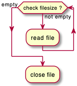

만약 `detach`를 사용하여 무한루프를 사용하게 된다면 `-[hidden]->`을 이용하여 루프를 빠져나가는 화살표를 숨길 수 있습니다.

```java
@startuml
:Step 1;
if (condition1) then
  while (loop forever)
   :Step 2;
  endwhile
  -[hidden]->
  detach
else
  :end normally;
  stop
endif
@enduml
```


### 병렬 프로세싱 [fork, fork again, end fork, end merge]
`fork`, `fork again` 과 `end fork` 또는 `end merge`등의 키워드를 이용한 병렬 프로세싱을 그릴 수 있습니다.

#### 간단한 `fork`
```java
@startuml
start
fork
  :action 1;
fork again
  :action 2;
end fork
stop
@enduml
```


#### `fork` 병렬 작업 후 병합
```java
@startuml
start
fork
  :action 1;
fork again
  :action 2;
end merge
stop
@enduml
```


```java
@startuml
start
fork
  :action 1;
fork again
  :action 2;
fork again
  :action 3;
fork again
  :action 4;
end merge
stop
@enduml
```


```java
@startuml
start
fork
  :action 1;
fork again
  :action 2;
  end
end merge
stop
@enduml
```


### `end fork` 라벨 (또는 UML joinspec):
```java
@startuml
start
fork
  :action A;
fork again
  :action B;
end fork {or}
stop
@enduml
```


```java
@startuml
start
fork
  :action A;
fork again
  :action B;
end fork {and}
stop
@enduml
```
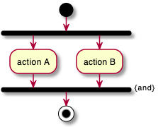

#### 기타 예제
```java
@startuml

start

if (multiprocessor?) then (yes)
  fork
    :Treatment 1;
  fork again
    :Treatment 2;
  end fork
else (monoproc)
  :Treatment 1;
  :Treatment 2;
endif

@enduml
```


### 분할 프로세싱

#### 분할(Split)
`split`, `split again` 과 `end split` 등의 키워드를 이용하여 프로세싱을 분할 할 수 있습니다.

```java
@startuml
start
split
   :A;
split again
   :B;
split again
   :C;
split again
   :a;
   :b;
end split
:D;
end
@enduml
```


#### 입력 분할 (멀티 시작)
시작 부분의 화살표를 `hidden` 숨기게 되면 멀티 시작을 의미하는 입력 분할 표현이 가능합니다:

```java
@startuml
split
   -[hidden]->
   :A;
split again
   -[hidden]->
   :B;
split again
   -[hidden]->
   :C;
end split
:D;
@enduml
```
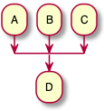

```java
@startuml
split
   -[hidden]->
   :A;
split again
   -[hidden]->
   :a;
   :b;
split again
   -[hidden]->
   (Z)
end split
:D;
@enduml
```
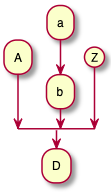

#### 출력 분할 (멀티 종료)
`kill` 또는 `detach`를 이용하면 출력 분할 (또는 멀티 종료)를 할 수 있습니다:

```java
@startuml
start
split
   :A;
   kill
split again
   :B;
   detach
split again
   :C;
   kill
end split
@enduml
```
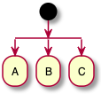

```java
@startuml
start
split
   :A;
   kill
split again
   :b;
   :c;
   detach
split again
   (Z)
   detach
split again
   end
split again
   stop
end split
@enduml
```


### 노트
[creole 위키 문법](https://plantuml.com/ko/creole)을 이용한 노트의 스타일을 지정할 수 있습니다.
또한 `floating` 키워드를 이용하면 연결없이 떠 있는 형태를 표현할 수도 있습니다.

```java
@startuml

start
:foo1;
floating note left: This is a note
:foo2;
note right
  This note is on several
  //lines// and can
  contain <b>HTML</b>
  ====
  * Calling the method ""foo()"" is prohibited
end note
stop

@enduml
```


반대 방향의 활동에도 노트를 달 수 있습니다:
```java
@startuml
start
repeat :Enter data;
:Submit;
backward :Warning;
note right: Note
repeat while (Valid?) is (No) not (Yes)
stop
@enduml
```


분할 활동에도 노트를 달 수 있습니다:
```java
@startuml
start
partition "**process** HelloWorld" {
    note
        This is my note
        ----
        //Creole test//
    end note
    :Ready;
    :HelloWorld(i)>
    :Hello-Sent;
}
@enduml
```


### 색상
각 활동에 대하여 [색상](https://plantuml.com/ko/color)지정이 가능합니다.

```java
@startuml

start
:starting progress;
#HotPink:reading configuration files
These files should be edited at this point!;
#AAAAAA:ending of the process;

@enduml
```


[그라디언트 색상](https://plantuml.com/ko/color)도 가능합니다.
```java
@startuml
start
partition #red/white testPartition {
        #blue\green:testActivity;
}
@enduml
```
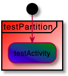

### 화살표 없는 연결
`skinparam ArrowHeadColor none`을 이용하면 화살표 없이 라인 연결만 됩니다.

```java
@startuml
skinparam ArrowHeadColor none
start
:Hello world;
:This is on defined on
several **lines**;
stop
@enduml
```


```java
@startuml
skinparam ArrowHeadColor none
start
repeat :Enter data;
:Submit;
backward :Warning;
repeat while (Valid?) is (No) not (Yes)
stop
@enduml
```


### 화살표
`->` 화살표 표현식에 [color](https://plantuml.com/ko/color) 색상 정의를 할 수 있습니다.
각 화살표에 대한 점, 대시, 굵게 등 뿐만 아니라 숨기는 등도 가능합니다.

```java
@startuml
:foo1;
-> You can put text on arrows;
if (test) then
  -[#blue]->
  :foo2;
  -[#green,dashed]-> The text can
  also be on several lines
  and **very** long...;
  :foo3;
else
  -[#black,dotted]->
  :foo4;
endif
-[#gray,bold]->
:foo5;
@enduml
```


### 커넥터
커넥터를 나타내기 위하여 괄호를 이용하면 됩니다.

```java
@startuml
start
:Some activity;
(A)
detach
(A)
:Other activity;
@enduml
```
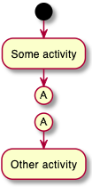

### 커넥터 색상
커넥터에도 색상, [color](https://plantuml.com/ko/color)을 넣을 수 있습니다.

```java
@startuml
start
:The connector below
wishes he was blue;
#blue:(B)
:This next connector
feels that she would
be better off green;
#green:(G)
stop
@enduml
```


### 그룹 또는 파티션

#### 그룹

액션 객체를 그룹으로 묶을 수 있습니다:

```java
@startuml
start
group Initialization 
    :read config file;
    :init internal variable;
end group
group Running group
    :wait for user interaction;
    :print information;
end group

stop
@enduml
```


#### 파티션
그룹과 유사하게 파티션으로도 그룹 지을 수 있습니다:

```java
@startuml
start
partition Initialization {
    :read config file;
    :init internal variable;
}
partition Running {
    :wait for user interaction;
    :print information;
}

stop
@enduml
```
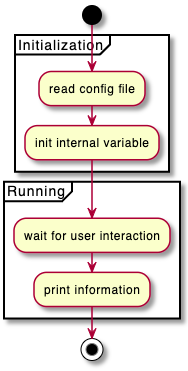

파티션 색상 [color](https://plantuml.com/ko/color) 변경도 가능합니다:

```java
@startuml
start
partition #lightGreen "Input Interface" {
    :read config file;
    :init internal variable;
}
partition Running {
    :wait for user interaction;
    :print information;
}
stop
@enduml
```


파티션에 [link](https://plantuml.com/ko/link) 링크를 추가하는 것도 가능합니다:
```java
@startuml
start
partition "[[http://plantuml.com partition_name]]" {
    :read doc. on [[http://plantuml.com plantuml_website]];
    :test diagram;
}
end
@enduml
```


#### 그룹, 파티션, 패키지, 네모 또는 카드

그룹을 할 때 다음과 같은 키워드로 그룹 지을 수 있습니다:
* group
* partition
* package
* rectangle
* card

```java
@startuml
start
group Group
  :Activity;
end group
floating note: Note on Group

partition Partition {
  :Activity;
}
floating note: Note on Partition

package Package {
  :Activity;
}
floating note: Note on Package 

rectangle Rectangle {
  :Activity;
}
floating note: Note on Rectangle 

card Card {
  :Activity;
}
floating note: Note on Card
end
@enduml
```


### 수영레인 (Swimlanes)
파이프 기호 `|` 를 이용하여 수영레인을 정의할 수 있습니다.
[color](https://plantuml.com/ko/color) 를 이용한 색상정의도 가능합니다.

```java
@startuml
|Swimlane1|
start
:foo1;
|#AntiqueWhite|Swimlane2|
:foo2;
:foo3;
|Swimlane1|
:foo4;
|Swimlane2|
:foo5;
stop
@enduml
```


`if` 조건식과 `repeat` 또는 `while` 루프에도 이 수영레인을 적용할 수 있습니다.
```java
@startuml
|#pink|Actor_For_red|
start
if (color?) is (red) then
#pink:**action red**;
:foo1;
else (not red)
|#lightgray|Actor_For_no_red|
#lightgray:**action not red**;
:foo2;
endif
|Next_Actor|
#lightblue:foo3;
:foo4;
|Final_Actor|
#palegreen:foo5;
stop
@enduml
```


또한 다음과 같은 `alias` 별칭을 통하여 수영레인을 사용할 수 있습니다:
* `|[#<color>|]<swimlane_alias>| <swimlane_title>`

```java
@startuml
|#palegreen|f| fisherman
|c| cook
|#gold|e| eater
|f|
start
:go fish;
|c|
:fry fish;
|e|
:eat fish;
stop
@enduml
```


### `detach` 또는  `kill`

`detach` 또는 `kill` 키워드를 이용하여 화살표를 지우는 것이 가능합니다:

* `detach`

```java
@startuml
 :start;
 fork
   :foo1;
   :foo2;
 fork again
   :foo3;
   detach
 endfork
 if (foo4) then
   :foo5;
   detach
 endif
 :foo6;
 detach
 :foo7;
 stop
@enduml
```
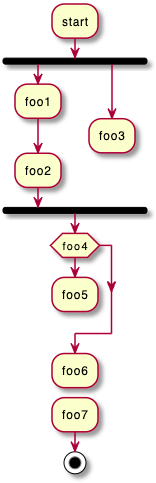

* `kill`

```java
@startuml
 :start;
 fork
   :foo1;
   :foo2;
 fork again
   :foo3;
   kill
 endfork
 if (foo4) then
   :foo5;
   kill
 endif
 :foo6;
 kill
 :foo7;
 stop
@enduml
```


### SDL (Specification and Description Language)
활동 상태를 그리는 데 마지막 `;` 대신 다음과 같은 것들을 이용하여 [SDL](https://en.wikipedia.org/wiki/Specification_and_Description_Language)을 표현할 수 있습니다:
* `|`
* `<`
* `>`
* `/`
* `\\`
* `]`
* `}`

```java
@startuml
:Ready;
:next(o)|
:Receiving;
split
 :nak(i)<
 :ack(o)>
split again
 :ack(i)<
 :next(o)
 on several lines|
 :i := i + 1]
 :ack(o)>
split again
 :err(i)<
 :nak(o)>
split again
 :foo/
split again
 :bar\\
split again
 :i > 5}
stop
end split
:finish;
@enduml
```


### 종합 예제
```java
@startuml

start
:ClickServlet.handleRequest();
:new page;
if (Page.onSecurityCheck) then (true)
  :Page.onInit();
  if (isForward?) then (no)
    :Process controls;
    if (continue processing?) then (no)
      stop
    endif

    if (isPost?) then (yes)
      :Page.onPost();
    else (no)
      :Page.onGet();
    endif
    :Page.onRender();
  endif
else (false)
endif

if (do redirect?) then (yes)
  :redirect process;
else
  if (do forward?) then (yes)
    :Forward request;
  else (no)
    :Render page template;
  endif
endif

stop

@enduml
```


### 조건 스타일

#### 내부 스타일 (기본)
```java
@startuml
skinparam conditionStyle inside
start
repeat
  :act1;
  :act2;
repeatwhile (<b>end)
:act3;
@enduml
```
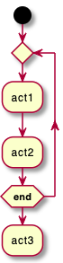

```java
@startuml
start
repeat
  :act1;
  :act2;
repeatwhile (<b>end)
:act3;
@enduml
```


#### 다이아몬드 스타일
```java
@startuml
skinparam conditionStyle diamond
start
repeat
  :act1;
  :act2;
repeatwhile (<b>end)
:act3;
@enduml
```


#### InsideDiamond (또는 foo1) 스타일
```java
@startuml
skinparam conditionStyle InsideDiamond
start
repeat
  :act1;
  :act2;
repeatwhile (<b>end)
:act3;
@enduml
```


```java
@startuml
skinparam conditionStyle foo1
start
repeat
  :act1;
  :act2;
repeatwhile (<b>end)
:act3;
@enduml
```


### 조건 마지막 스타일

#### 다이아몬드 스타일 (기본)
* 단일 분기

```java
@startuml
skinparam ConditionEndStyle diamond
:A;
if (decision) then (yes)
    :B1;
else (no)
endif
:C;
@enduml
```


* 2중 분기 (`B1`, `B2`)

```java
@startuml
skinparam ConditionEndStyle diamond
:A;
if (decision) then (yes)
    :B1;
else (no)
    :B2;
endif
:C;
@enduml
```


#### 수평 라인 (hline) 스타일
* 단일 분기

```java
@startuml
skinparam ConditionEndStyle hline
:A;
if (decision) then (yes)
    :B1;
else (no)
endif
:C;
@enduml
```


* 2중 분기 (`B1`, `B2`)

```java
@startuml
skinparam ConditionEndStyle hline
:A;
if (decision) then (yes)
    :B1;
else (no)
    :B2;
endif
:C;
@enduml
```


### 글로벌 스타일

#### 글로벌 스타일 없음 (기본)
```java
@startuml
start
:init;
-> test of color;
if (color?) is (<color:red>red) then
:print red;
else 
:print not red;
note right: no color
endif
partition End {
:end;
}
-> this is the end;
end
@enduml
```
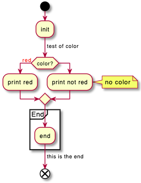

#### 스타일 지정
[style](https://plantuml.com/ko/style-evolution) 스타일을 개별 항목에 적용할 수 있습니다.

```java
@startuml
<style>
activityDiagram {
  BackgroundColor #33668E
  BorderColor #33668E
  FontColor #888
  FontName arial

  diamond {
    BackgroundColor #ccf
    LineColor #00FF00
    FontColor green
    FontName arial
    FontSize 15
  }
  arrow {
    FontColor gold
    FontName arial
    FontSize 15
  }
  partition {
    LineColor red
    FontColor green
    RoundCorner 10
    BackgroundColor PeachPuff
  }
  note {
    FontColor Blue
    LineColor Navy
    BackgroundColor #ccf
  }
}
document {
   BackgroundColor transparent
}
</style>
start
:init;
-> test of color;
if (color?) is (<color:red>red) then
:print red;
else 
:print not red;
note right: no color
endif
partition End {
:end;
}
-> this is the end;
end
@enduml
```

