## 컴포넌트 다이어그램

### 컴포넌트
컴포넌트는 반드시 대괄호 `[` `]` 로 둘러싸여야 합니다.
컴포넌트를 정의할때 `component` 키워드도 사용할 수 있습니다. `as` 키워드를 이용해서 별칭을 정의할 수도 있습니다. 이 별칭은 뒤에서 관계를 정의할때 사용됩니다.

```java
@startuml

[First component]
[Another component] as Comp2
component Comp3
component [Last\ncomponent] as Comp4

@enduml
```


### 인터페이스
인터페이스는 `(` `)` 기호로 정의될 수 있습니다 (이 기호가 원처럼 보이기 때문입니다).
`interface` 키워드도 인터페이스를 정의하는데 사용할 수 있습니다. `as` 키워드를 이용해서 별칭을 정의할 수도 있습니다. 이 별칭은 뒤에서 관계를 정의할 때 사용됩니다.
인터페이스를 정의하는 일은 선택 사항(optional) 입니다.

```java
@startuml

() "First Interface"
() "Another interface" as Interf2
interface Interf3
interface "Last\ninterface" as Interf4

@enduml
```


### 기본 예제
요소들 간의 연결은 점선 `..`, 실선 `--`, 그리고 화살표 `-->` 등 기호들의 조합으로 생성됩니다.

```java
@startuml

DataAccess - [First Component]
[First Component] ..> HTTP : use

@enduml
```


### 메모 사용하기
각 객체에 관련된 메모를 정의하기 위해 `note left of` , `note right of` , `note top of` , `note bottom of` 키워드를 사용할 수 있습니다.
메모는 또한 `note` 키워드를 통해 단독으로 정의될 수도 있고, 다른 객체들에 `..` 기호로 연결될 수 있습니다.

```java
@startuml

interface "Data Access" as DA

DA - [First Component]
[First Component] ..> HTTP : use

note left of HTTP : Web Service only

note right of [First Component]
  A note can also
  be on several lines
end note

@enduml
```


### 컴포넌트를 그룹화 하기
다음과 같은 키워드를 이용하여 컴포넌트들과 인터페이스들을 그룹으로 나눌 수 있습니다:
* `package`
* `node`
* `folder`
* `frame`
* `cloud`
* `database`

```java
@startuml

package "Some Group" {
  HTTP - [First Component]
  [Another Component]
}

node "Other Groups" {
  FTP - [Second Component]
  [First Component] --> FTP
}

cloud {
  [Example 1]
}


database "MySql" {
  folder "This is my folder" {
    [Folder 3]
  }
  frame "Foo" {
    [Frame 4]
  }
}


[Another Component] --> [Example 1]
[Example 1] --> [Folder 3]
[Folder 3] --> [Frame 4]

@enduml
```
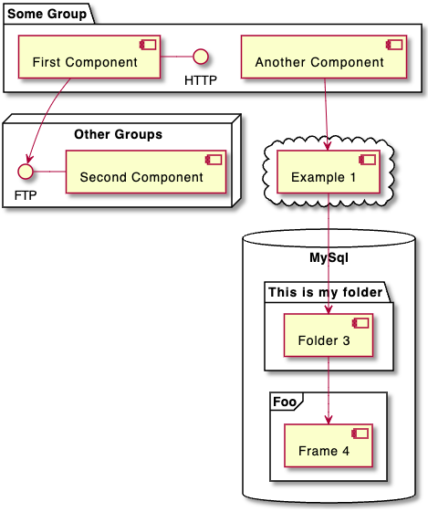

### 화살표 방향 바꾸기
기본적으로 클래스들간의 연결은 두개의 대쉬를 `--` 갖고 방향은 수직 방향입니다. 다음처럼 한개의 대쉬(혹은 점)를 넣어 수평 방향 연결을 사용할 수 있습니다:

```java
@startuml
[Component] --> Interface1
[Component] -> Interface2
@enduml
```


연결을 반전시켜 방향을 바꿀 수도 있습니다:
```java
@startuml
Interface1 <-- [Component]
Interface2 <- [Component]
@enduml
```


화살표 안에 `left`, `right`, `up`, `down` 등 키워드를 추가하여 방향을 바꾸는것도 가능합니다:
```java
@startuml
[Component] -left-> left
[Component] -right-> right
[Component] -up-> up
[Component] -down-> down
@enduml
```


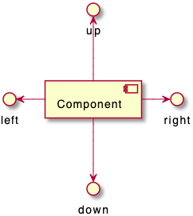

방향을 의미하는 단어의 첫번째 글자만 사용해도 동일한 화살표를 그릴 수 있습니다. (예를 들면, `-down-` 대신 `-d-` 또는 `-do-`).
> 이 기능을 남용하지 말아야 합니다. 그래야 별다른 수정없이도 *GraphViz*가 좋은 결과를 보여줍니다.

### UML2 표시 사용
기본적으로 `v1.2020.13-14` 버전 이후 부터 UML2 표시 방법이 사용됩니다.

```java
@startuml

interface "Data Access" as DA

DA - [First Component]
[First Component] ..> HTTP : use

@enduml
```
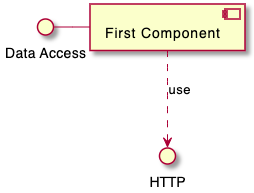

### UML1 표시
`skinparam componentStyle uml1` 명령을 이용하면 UML1 형식으로 표시 할 수 있습니다.

```java
@startuml
skinparam componentStyle uml1

interface "Data Access" as DA

DA - [First Component]
[First Component] ..> HTTP : use

@enduml
```
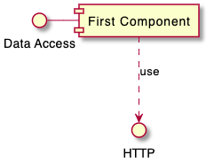

### 사각형 rectangle 표시 (UML 형식 사용안함)
`skinparam componentStyle rectangle` 명령을 사용하면 UML 표시가 안되고 단순 사각형만 표시됩니다.

```java
@startuml
skinparam componentStyle rectangle

interface "Data Access" as DA

DA - [First Component]
[First Component] ..> HTTP : use

@enduml
```


### 긴 설명
컴포넌트 안에 여러 줄의 설명을 대괄호 안에 넣을 수 있습니다.

```java
@startuml
component comp1 [
This component
has a long comment
on several lines
]
@enduml
```
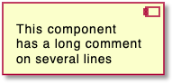

### 개별 색상
각 컴포넌트 정의 후에 개별 색상을 지정할 수 있습니다.

```java
@startuml
component  [Web Server] #Yellow
@enduml
```
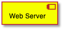

### 스테레오타입에 스프라이트(sprite)를 이용한 사용자 정의 아이콘
스테레오타입에 스프라이트(sprite)를 이용한 사용자 정의 아이콘을 사용할 수 있습니다.

```java
@startuml
sprite $businessProcess [16x16/16] {
FFFFFFFFFFFFFFFF
FFFFFFFFFFFFFFFF
FFFFFFFFFFFFFFFF
FFFFFFFFFFFFFFFF
FFFFFFFFFF0FFFFF
FFFFFFFFFF00FFFF
FF00000000000FFF
FF000000000000FF
FF00000000000FFF
FFFFFFFFFF00FFFF
FFFFFFFFFF0FFFFF
FFFFFFFFFFFFFFFF
FFFFFFFFFFFFFFFF
FFFFFFFFFFFFFFFF
FFFFFFFFFFFFFFFF
FFFFFFFFFFFFFFFF
}

rectangle " End to End\nbusiness process" <<$businessProcess>> {
 rectangle "inner process 1" <<$businessProcess>> as src
 rectangle "inner process 2" <<$businessProcess>> as tgt
 src -> tgt
}
@enduml
```


### Skinparam
[skinparam](https://plantuml.com/ko/skinparam) 명령어를 이용하면 객체의 폰트나 색상 조정 등이 가능합니다.

다음과 같은 위치에서 명령을 내릴 수 있습니다:

* 다이어그램 정의부에 다른 명령처럼 설정하거나,
* [included file](https://plantuml.com/ko/preprocessing)에 지정하거나,
* [명령행](https://plantuml.com/ko/command-line) 또는 [ANT task](https://plantuml.com/ko/ant-task)에 제공된 설정파일에 지정할 수 있습니다.

```java
@startuml

skinparam interface {
  backgroundColor RosyBrown
  borderColor orange
}

skinparam component {
  FontSize 13
  BackgroundColor<<Apache>> Pink
  BorderColor<<Apache>> #FF6655
  FontName Courier
  BorderColor black
  BackgroundColor gold
  ArrowFontName Impact
  ArrowColor #FF6655
  ArrowFontColor #777777
}

() "Data Access" as DA
Component "Web Server" as WS << Apache >>

DA - [First Component]
[First Component] ..> () HTTP : use
HTTP - WS

@enduml
```
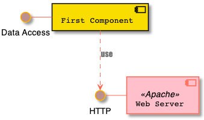

```java
@startuml
[AA] <<static lib>>
[BB] <<shared lib>>
[CC] <<static lib>>

node node1
node node2 <<shared node>>
database Production

skinparam component {
    backgroundColor<<static lib>> DarkKhaki
    backgroundColor<<shared lib>> Green
}

skinparam node {
borderColor Green
backgroundColor Yellow
backgroundColor<<shared node>> Magenta
}
skinparam databaseBackgroundColor Aqua

@enduml
```


### 특정 SkinParameter

#### 컴포넌트 스타일
* `skinparam componentStyle uml2` 명령 또는 기본적으로 컴포넌트 아이콘이 다음과 같이 적용됩니다

```java
@startuml
skinparam BackgroundColor transparent
skinparam componentStyle uml2
component A {
   component "A.1" {
}
   component A.44 {
      [A4.1]
}
   component "A.2"
   [A.3]
   component A.5 [
A.5] 
   component A.6 [
]
}
[a]->[b]
@enduml
```
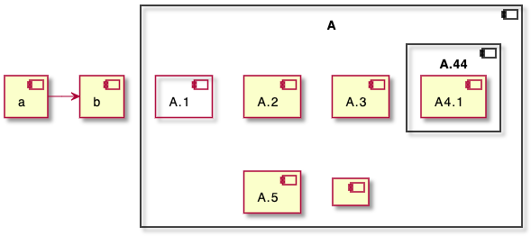

* 만약 이런 기본 아이콘을 표시하고 싶지 않다면 `skinparam componentStyle rectangle` 명령을 내립니다

```java
@startuml
skinparam BackgroundColor transparent
skinparam componentStyle rectangle
component A {
   component "A.1" {
}
   component A.44 {
      [A4.1]
}
   component "A.2"
   [A.3]
   component A.5 [
A.5] 
   component A.6 [
]
}
[a]->[b]
@enduml
```
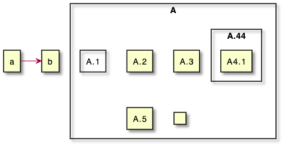

### 링크되지 않은 컴포넌트 숨기기 또는 지우기

기본적으로 모든 컴포넌트는 보입니다:

```java
@startuml
component C1
component C2
component C3
C1 -- C2
@enduml
```


그런데 다음의 hide 명령을 이용하여 링크되지 않은 컴포넌트를 숨길 수 있습니다:
* `hide @unlinked` 컴포넌트:

```java
@startuml
component C1
component C2
component C3
C1 -- C2

hide @unlinked
@enduml
```
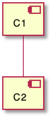

* 또는 `remove @unlinked` 컴포넌트: 위의 경우와 동일합니다

```java
@startuml
component C1
component C2
component C3
C1 -- C2

remove @unlinked
@enduml
```


### 태그된 컴포넌트나 와일드카드를 숨기거나, 지우거나 또는 복구
컴포넌트에 `$tags`를 주어 해당 컴포넌트(들)만 숨기거나 지울 수도 있고, 다시 복구할 수도 있습니다.

* 기본적으로 다 보이는 경우
```java
@startuml
component C1 $tag13
component C2
component C3 $tag13
C1 -- C2
@enduml
```


* `hide $tag13` : `$tag13`으로 태그를 단 컴포넌트들을 숨기는 경우

```java
@startuml
component C1 $tag13
component C2
component C3 $tag13
C1 -- C2

hide $tag13
@enduml
```

> 숨기는 경우에는 안 보이는 영역이 그대로 남아 있는 반면, 지우는 경우에는 여백이 사라집니다

* 또는 `remove $tag13` : `$tag13`으로 태그를 단 컴포넌트들을 지우는 경우

```java
@startuml
component C1 $tag13
component C2
component C3 $tag13
C1 -- C2

remove $tag13
@enduml
```


* 또는 `remove $tag13 and restore $tag1` : 해당 태그의 컴포넌트를 지웠다 복구하는 경우

```java
@startuml
component C1 $tag13 $tag1
component C2
component C3 $tag13
C1 -- C2

remove $tag13
restore $tag1
@enduml
```


* or `remove * and restore $tag1` components:

```java
@startuml
component C1 $tag13 $tag1
component C2
component C3 $tag13
C1 -- C2

remove *
restore $tag1
@enduml
```
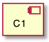
