## 배포(Deployment) 다이어그램

### 요소 정의
```java
@startuml
actor actor
actor/ "actor/"
agent agent
artifact artifact
boundary boundary
card card
circle circle
cloud cloud
collections collections
component component
control control
database database
entity entity
file file
folder folder
frame frame
hexagon hexagon
interface interface
label label
node node
package package
person person
queue queue
rectangle rectangle
stack stack
storage storage
usecase usecase
usecase/ "usecase/"
@enduml
```
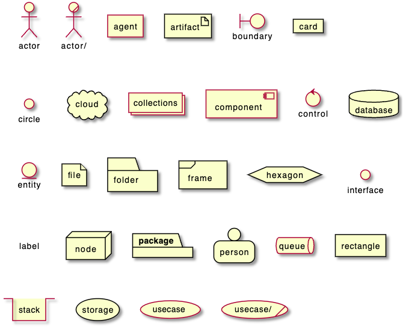

`[]` 대괄호를 이용하여 긴 텍스트를 넣을 수 있습니다.

```java
@startuml
folder folder [
This is a <b>folder
----
You can use separator
====
of different kind
....
and style
]

node node [
This is a <b>node
----
You can use separator
====
of different kind
....
and style
]

database database [
This is a <b>database
----
You can use separator
====
of different kind
....
and style
]

usecase usecase [
This is a <b>usecase
----
You can use separator
====
of different kind
....
and style
]

card card [
This is a <b>card
----
You can use separator
====
of different kind
....
and style
<i><color:blue>(add from V1.2020.7)</color></i>
]
@enduml
```
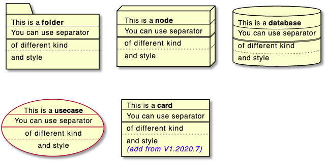

각 요소 항목은 다음 테이블과 같이 간단 표현식이 존재합니다.

| Long form Keyword | Short form Keyword | Long form example | Short form example | Ref. |
|----|---|---|---|---|
|`actor`|`:a:`|`actor actor1`|`:actor2:`|[Actors](https://plantuml.com/use-case-diagram#d9b36998c97be687)|
|`component`|`[c]`|`component component1`|`[component2]`|[Components](https://plantuml.com/component-diagram#05bbb43b3d923283)
`interface`|`()i`|`interface interface1`|`() "interface2"`|[Interfaces](https://plantuml.com/component-diagram#756640f0aea5f5be)
`usecase`|`(u)`|`usecase usecase1`|`(usecase2)`|[Usecases](https://plantuml.com/use-case-diagram#5cb617d22da857ea)

#### 엑터
```java
@startuml

actor actor1
:actor2:

@enduml
```
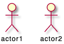

#### 컴포넌트
```java
@startuml

component component1
[component2]

@enduml
```
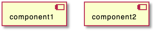

#### 인터페이스
```java
@startuml

interface interface1
() "interface2"

label "//interface example//"
@enduml
```
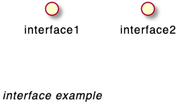

#### 유즈케이스
```java
@startuml

usecase usecase1
(usecase2)

@enduml
```
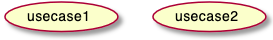


### 링크 또는 화살표
설명글이 있거나 또는 없는 링크 또는 화살표를 만들 수 있습니다:
```java
@startuml

node node1
node node2
node node3
node node4
node node5
node1 -- node2 : label1
node1 .. node3 : label2
node1 ~~ node4 : label3
node1 == node5

@enduml
```
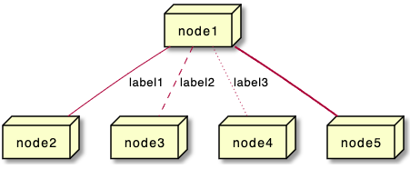

링크의 다양한 형태도 가능합니다:

```java
@startuml

artifact artifact1
artifact artifact2
artifact artifact3
artifact artifact4
artifact artifact5
artifact artifact6
artifact artifact7
artifact artifact8
artifact artifact9
artifact artifact10
artifact1 --> artifact2
artifact1 --* artifact3
artifact1 --o artifact4
artifact1 --+ artifact5
artifact1 --# artifact6
artifact1 -->> artifact7
artifact1 --0 artifact8
artifact1 --^ artifact9
artifact1 --(0 artifact10

@enduml
```
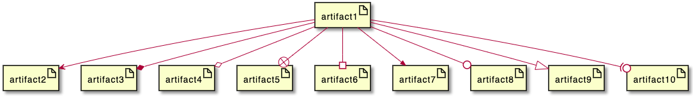

또한 다음과 같은 형태의 링크도 가능합니다:
```java
@startuml

cloud cloud1
cloud cloud2
cloud cloud3
cloud cloud4
cloud cloud5
cloud1 -0- cloud2
cloud1 -0)- cloud3
cloud1 -(0- cloud4
cloud1 -(0)- cloud5

@enduml
```
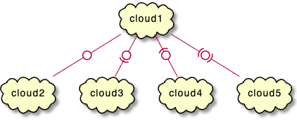

더 많은 예제:

```java
@startuml
actor foo1
actor foo2
foo1 <-0-> foo2
foo1 <-(0)-> foo2
 
(ac1) -le(0)-> left1
ac1 -ri(0)-> right1
ac1 .up(0).> up1
ac1 ~up(0)~> up2
ac1 -do(0)-> down1
ac1 -do(0)-> down2
 
actor1 -0)- actor2
 
component comp1
component comp2
comp1 *-0)-+ comp2
[comp3] <-->> [comp4]

boundary b1
control c1
b1 -(0)- c1

component comp1
interface interf1
comp1 #~~( interf1

:mode1actor: -0)- fooa1
:mode1actorl: -ri0)- foo1l

[component1] 0)-(0-(0 [componentC]
() component3 )-0-(0 "foo" [componentC]

[aze1] #-->> [aze2]
@enduml
```
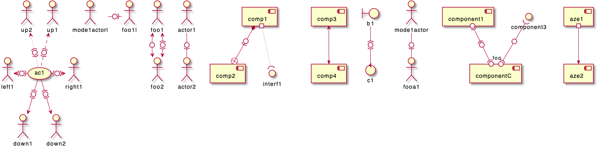

### 대괄호 화살표 스타일
*[대괄호 클래스 관계 스타일](https://plantuml.com/ko/class-diagram#chjviqthvhkikfmwbahk)* 과 유사합니다.

#### 라인 스타일
일반 화살표를 포함하여 굵게, 대쉬, 점 또는 숨김 등을 표시할 수도 있습니다:
* 라벨 없이

```java
@startuml
node foo
title Bracketed line style without label
foo --> bar
foo -[bold]-> bar1
foo -[dashed]-> bar2
foo -[dotted]-> bar3
foo -[hidden]-> bar4
foo -[plain]-> bar5
@enduml
```
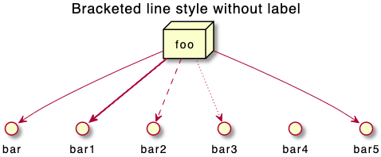

* 라벨 포함

```java
@startuml
title Bracketed line style with label
node foo
foo --> bar          : ∅
foo -[bold]-> bar1   : [bold]
foo -[dashed]-> bar2 : [dashed]
foo -[dotted]-> bar3 : [dotted]
foo -[hidden]-> bar4 : [hidden]
foo -[plain]-> bar5  : [plain]
@enduml
```
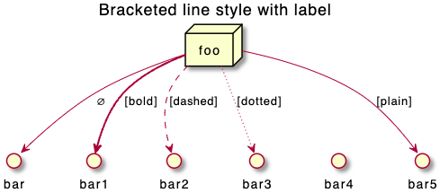

#### 라인 색상
```java
@startuml
title Bracketed line color
node  foo
foo --> bar
foo -[#red]-> bar1     : [#red]
foo -[#green]-> bar2   : [#green]
foo -[#blue]-> bar3    : [#blue]
foo -[#blue;#yellow;#green]-> bar4
@enduml
```
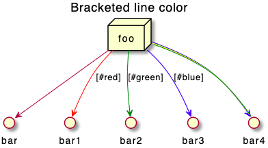

#### 라인 굵기
```java
@startuml
title Bracketed line thickness
node foo
foo --> bar                 : ∅
foo -[thickness=1]-> bar1   : [1]
foo -[thickness=2]-> bar2   : [2]
foo -[thickness=4]-> bar3   : [4]
foo -[thickness=8]-> bar4   : [8]
foo -[thickness=16]-> bar5  : [16]
@enduml
```
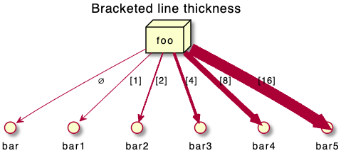

#### 다양한 예제
```java
@startuml
title Bracketed line style mix
node foo
foo --> bar                             : ∅
foo -[#red,thickness=1]-> bar1          : [#red,1]
foo -[#red,dashed,thickness=2]-> bar2   : [#red,dashed,2]
foo -[#green,dashed,thickness=4]-> bar3 : [#green,dashed,4]
foo -[#blue,dotted,thickness=8]-> bar4  : [blue,dotted,8]
foo -[#blue,plain,thickness=16]-> bar5  : [blue,plain,16]
foo -[#blue;#green,dashed,thickness=4]-> bar6  : [blue;green,dashed,4]
@enduml
```
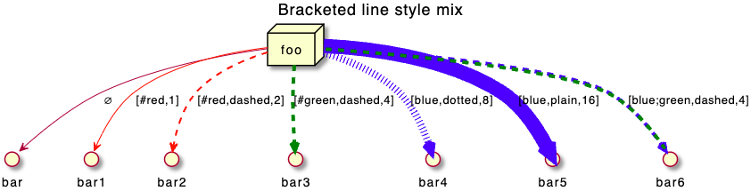

### 화살표 색상 및 스타일 변경 (인라인 형식)
[color](https://plantuml.com/ko/color) 색상 설정을 통한 개별 화살표에 대한 색상과 스타일 등을 바꿀 수 있습니다:
* `#color;line.[bold|dashed|dotted];text:color`

```java
@startuml
node foo
foo --> bar : normal
foo --> bar1 #line:red;line.bold;text:red  : red bold
foo --> bar2 #green;line.dashed;text:green : green dashed 
foo --> bar3 #blue;line.dotted;text:blue   : blue dotted
@enduml
```
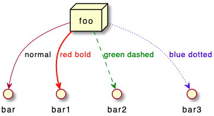

### 요소 색상 및 스타일 변경 (인라인 형식)
[color](https://plantuml.com/ko/color) 색상 설정을 통한 개별 요소에 대한 색상과 스타일 등을 바꿀 수 있습니다:
* `#[color|back:color];line:color;line.[bold|dashed|dotted];text:color`

```java
@startuml
agent a
cloud c #pink;line:red;line.bold;text:red
file  f #palegreen;line:green;line.dashed;text:green
node  n #aliceblue;line:blue;line.dotted;text:blue
@enduml
```
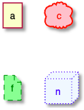

```java
@startuml
agent a
cloud c #pink;line:red;line.bold;text:red [
c
cloud description
]
file  f #palegreen;line:green;line.dashed;text:green {
[c1]
[c2]
}
frame frame {
node  n #aliceblue;line:blue;line.dotted;text:blue
}
@enduml
```
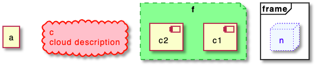

### 중첩된 요소
각 요소는 중첩될 수 있습니다:

#### 개별 요소
```java
@startuml
artifact artifact {
}
card card {
}
cloud cloud {
}
component component {
}
database database {
}
file file {
}
folder folder {
}
frame frame {
}
hexagon hexagon {
}
node node {
}
package package {
}
queue queue {
}
rectangle rectangle {
}
stack stack {
}
storage storage {
}
@enduml
```
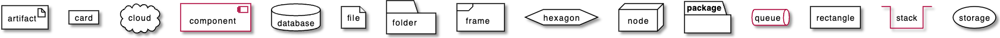

### 패키지와 중첩된 요소

#### 1단계 예제
```java
@startuml
artifact    artifactVeryLOOOOOOOOOOOOOOOOOOOg    as "artifact" {
file f1
}
card        cardVeryLOOOOOOOOOOOOOOOOOOOg        as "card" {
file f2
}
cloud       cloudVeryLOOOOOOOOOOOOOOOOOOOg       as "cloud" {
file f3
}
component   componentVeryLOOOOOOOOOOOOOOOOOOOg   as "component" {
file f4
}
database    databaseVeryLOOOOOOOOOOOOOOOOOOOg    as "database" {
file f5
}
file        fileVeryLOOOOOOOOOOOOOOOOOOOg        as "file" {
file f6
}
folder      folderVeryLOOOOOOOOOOOOOOOOOOOg      as "folder" {
file f7
}
frame       frameVeryLOOOOOOOOOOOOOOOOOOOg       as "frame" {
file f8
}
hexagon     hexagonVeryLOOOOOOOOOOOOOOOOOOOg     as "hexagon" {
file f9
}
node        nodeVeryLOOOOOOOOOOOOOOOOOOOg        as "node" {
file f10
}
package     packageVeryLOOOOOOOOOOOOOOOOOOOg     as "package" {
file f11
}
queue       queueVeryLOOOOOOOOOOOOOOOOOOOg       as "queue" {
file f12
}
rectangle   rectangleVeryLOOOOOOOOOOOOOOOOOOOg   as "rectangle" {
file f13
}
stack       stackVeryLOOOOOOOOOOOOOOOOOOOg       as "stack" {
file f14
}
storage     storageVeryLOOOOOOOOOOOOOOOOOOOg     as "storage" {
file f15
}
@enduml
```
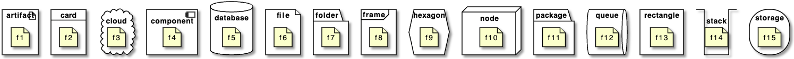

#### 기타 예제
```java
@startuml
artifact Foo1 {
  folder Foo2
}

folder Foo3 {
  artifact Foo4
}

frame Foo5 {
  database Foo6
}

cloud vpc {
  node ec2 {
    stack stack
  }
}

@enduml
```
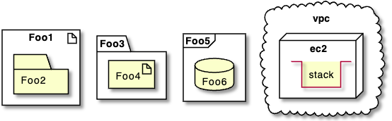

```java
@startuml
node Foo1 {
 cloud Foo2
}

cloud Foo3 {
  frame Foo4
}

database Foo5  {
  storage Foo6
}

storage Foo7 {
  storage Foo8
}
@enduml
```
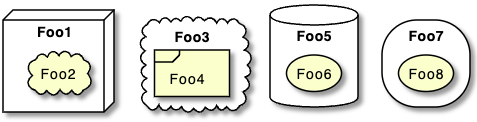

#### 깊은 중첩 예제
* 알파벳 순서 정렬:
```java
@startuml
artifact artifact {
card card {
cloud cloud {
component component {
database database {
file file {
folder folder {
frame frame {
hexagon hexagon {
node node {
package package {
queue queue {
rectangle rectangle {
stack stack {
storage storage {
}
}
}
}
}
}
}
}
}
}
}
}
}
}
}
@enduml
```
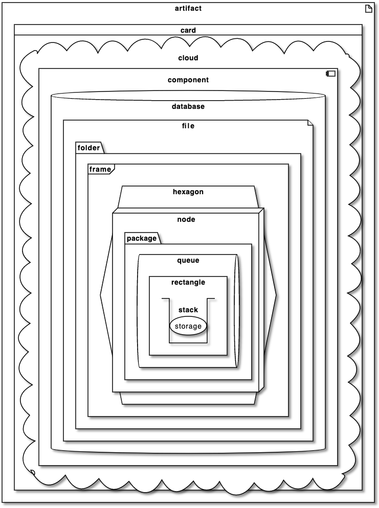

* 또는 역 알파벳 정렬

```java
@startuml
storage storage {
stack stack {
rectangle rectangle {
queue queue {
package package {
node node {
hexagon hexagon {
frame frame {
folder folder {
file file {
database database {
component component {
cloud cloud {
card card {
artifact artifact {
}
}
}
}
}
}
}
}
}
}
}
}
}
}
}
@enduml
```
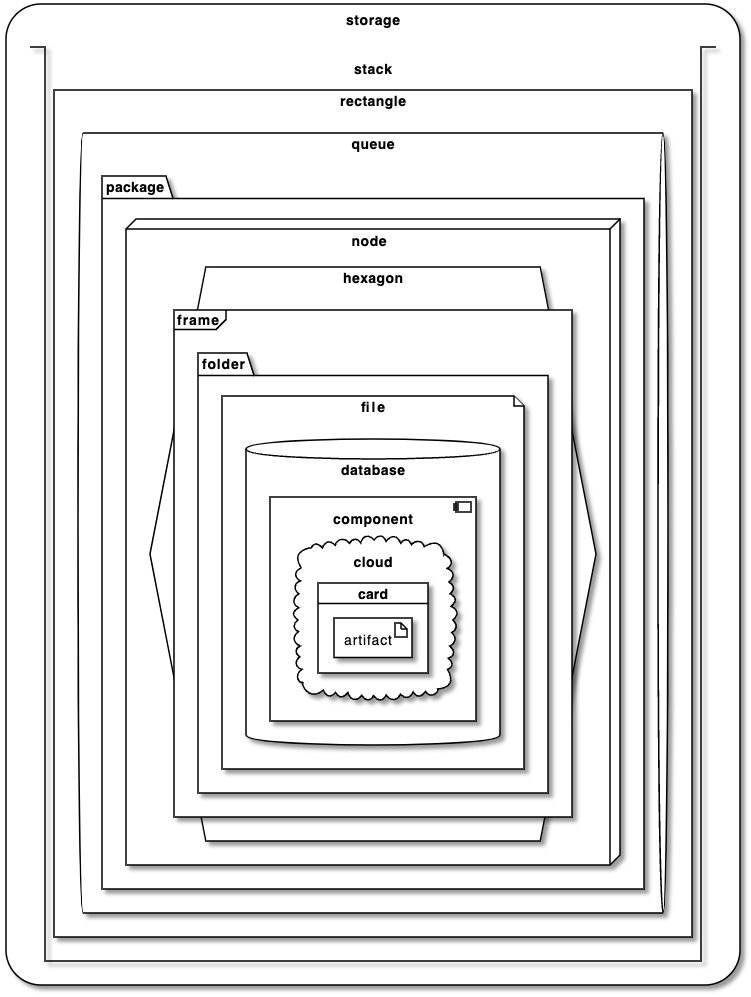

### 별칭

#### `as`를 이용한 간단한 별칭
```java
@startuml
node Node1 as n1
node "Node 2" as n2
file f1 as "File 1"
cloud c1 as "this
is
a
cloud"
cloud c2 [this
is
another
cloud]

n1 -> n2
n1 --> f1
f1 -> c1
c1 -> c2
@enduml
```
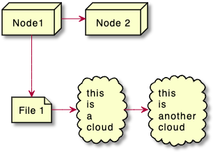

#### 긴 별칭 예제
```java
@startuml
actor        "actor"       as actorVeryLOOOOOOOOOOOOOOOOOOOg
agent        "agent"       as agentVeryLOOOOOOOOOOOOOOOOOOOg
artifact     "artifact"    as artifactVeryLOOOOOOOOOOOOOOOOOOOg
boundary     "boundary"    as boundaryVeryLOOOOOOOOOOOOOOOOOOOg
card         "card"        as cardVeryLOOOOOOOOOOOOOOOOOOOg
cloud        "cloud"       as cloudVeryLOOOOOOOOOOOOOOOOOOOg
collections  "collections" as collectionsVeryLOOOOOOOOOOOOOOOOOOOg
component    "component"   as componentVeryLOOOOOOOOOOOOOOOOOOOg
control      "control"     as controlVeryLOOOOOOOOOOOOOOOOOOOg
database     "database"    as databaseVeryLOOOOOOOOOOOOOOOOOOOg
entity       "entity"      as entityVeryLOOOOOOOOOOOOOOOOOOOg
file         "file"        as fileVeryLOOOOOOOOOOOOOOOOOOOg
folder       "folder"      as folderVeryLOOOOOOOOOOOOOOOOOOOg
frame        "frame"       as frameVeryLOOOOOOOOOOOOOOOOOOOg
hexagon      "hexagon"     as hexagonVeryLOOOOOOOOOOOOOOOOOOOg
interface    "interface"   as interfaceVeryLOOOOOOOOOOOOOOOOOOOg
label        "label"       as labelVeryLOOOOOOOOOOOOOOOOOOOg
node         "node"        as nodeVeryLOOOOOOOOOOOOOOOOOOOg
package      "package"     as packageVeryLOOOOOOOOOOOOOOOOOOOg
person       "person"      as personVeryLOOOOOOOOOOOOOOOOOOOg
queue        "queue"       as queueVeryLOOOOOOOOOOOOOOOOOOOg
stack        "stack"       as stackVeryLOOOOOOOOOOOOOOOOOOOg
rectangle    "rectangle"   as rectangleVeryLOOOOOOOOOOOOOOOOOOOg
storage      "storage"     as storageVeryLOOOOOOOOOOOOOOOOOOOg
usecase      "usecase"     as usecaseVeryLOOOOOOOOOOOOOOOOOOOg
@enduml
```
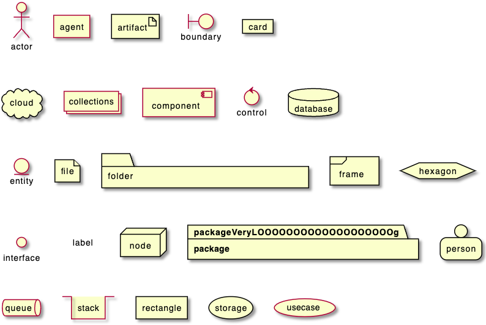

```java
@startuml
actor       actorVeryLOOOOOOOOOOOOOOOOOOOg       as "actor"
agent       agentVeryLOOOOOOOOOOOOOOOOOOOg       as "agent"
artifact    artifactVeryLOOOOOOOOOOOOOOOOOOOg    as "artifact"
boundary    boundaryVeryLOOOOOOOOOOOOOOOOOOOg    as "boundary"
card        cardVeryLOOOOOOOOOOOOOOOOOOOg        as "card"
cloud       cloudVeryLOOOOOOOOOOOOOOOOOOOg       as "cloud"
collections collectionsVeryLOOOOOOOOOOOOOOOOOOOg as "collections"
component   componentVeryLOOOOOOOOOOOOOOOOOOOg   as "component"
control     controlVeryLOOOOOOOOOOOOOOOOOOOg     as "control"
database    databaseVeryLOOOOOOOOOOOOOOOOOOOg    as "database"
entity      entityVeryLOOOOOOOOOOOOOOOOOOOg      as "entity"
file        fileVeryLOOOOOOOOOOOOOOOOOOOg        as "file"
folder      folderVeryLOOOOOOOOOOOOOOOOOOOg      as "folder"
frame       frameVeryLOOOOOOOOOOOOOOOOOOOg       as "frame"
hexagon     hexagonVeryLOOOOOOOOOOOOOOOOOOOg     as "hexagon"
interface   interfaceVeryLOOOOOOOOOOOOOOOOOOOg   as "interface"
label       labelVeryLOOOOOOOOOOOOOOOOOOOg       as "label"
node        nodeVeryLOOOOOOOOOOOOOOOOOOOg        as "node"
package     packageVeryLOOOOOOOOOOOOOOOOOOOg     as "package"
person      personVeryLOOOOOOOOOOOOOOOOOOOg      as "person"
queue       queueVeryLOOOOOOOOOOOOOOOOOOOg       as "queue"
stack       stackVeryLOOOOOOOOOOOOOOOOOOOg       as "stack"
rectangle   rectangleVeryLOOOOOOOOOOOOOOOOOOOg   as "rectangle"
storage     storageVeryLOOOOOOOOOOOOOOOOOOOg     as "storage"
usecase     usecaseVeryLOOOOOOOOOOOOOOOOOOOg     as "usecase"
@enduml
```


### 끝이 둥근 사각형
```java
@startuml
skinparam rectangle {
    roundCorner<<Concept>> 25
}

rectangle "Concept Model" <<Concept>> {
rectangle "Example 1" <<Concept>> as ex1
rectangle "Another rectangle"
}
@enduml
```
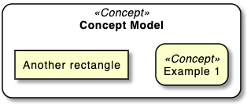

### 특정 SkinParameter

#### roundCorner
```java
@startuml
skinparam roundCorner 15
actor actor
agent agent
artifact artifact
boundary boundary
card card
circle circle
cloud cloud
collections collections
component component
control control
database database
entity entity
file file
folder folder
frame frame
hexagon hexagon
interface interface
label label
node node
package package
person person
queue queue
rectangle rectangle
stack stack
storage storage
usecase usecase
@enduml
```
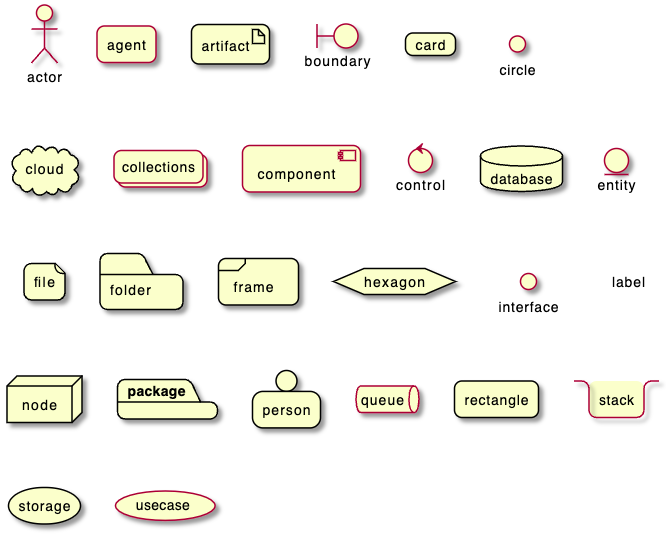

### 부록: 모든 종류의 화살표
```java
@startuml
left to right direction
skinparam nodesep 5

f3  ~~  b3  : ""~~""\n//dotted//
f2  ..  b2  : ""..""\n//dashed//
f1  ==  b1  : ""==""\n//bold//
f0  --  b0  : ""--""\n//plain//
@enduml
```
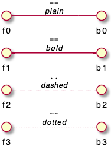

### 부록: 모든 종류의 화살표 모양

#### 화살표 모양 형태
```java
@startuml
left to right direction
skinparam nodesep 5

f13 --0   b13 : ""--0""
f12 --@   b12 : ""--@""
f11 --:|> b11 : ""--:|>""
f10 --||> b10 : ""--||>""
f9  --|>  b9  : ""--|>""
f8  --^   b8  : ""--^ ""
f7  --\\  b7  : ""--\\\\""
f6  --#   b6  : ""--# ""
f5  --+   b5  : ""--+ ""
f4  --o   b4  : ""--o ""
f3  --*   b3  : ""--* ""
f2  -->>  b2  : ""-->>""
f1  -->   b1  : ""--> ""
f0  --    b0  : ""--  ""
@enduml
```
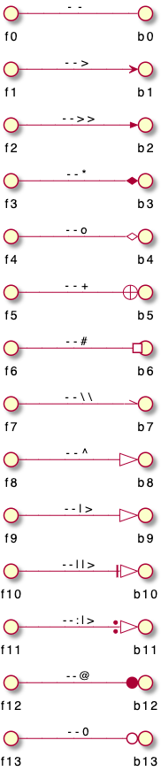

#### '0' 화살표 또는 원 화살표
```java
@startuml
left to right direction
skinparam nodesep 5

f10 0--0 b10 : "" 0--0 ""
f9 )--(  b9  : "" )--( ""
f8 0)--(0 b8 : "" 0)--(0""
f7 0)--  b7  : "" 0)-- ""
f6 -0)-  b6  : "" -0)- ""
f5 -(0)- b5  : "" -(0)-""
f4 -(0-  b4  : "" -(0- ""
f3 --(0  b3  : "" --(0 ""
f2 --(   b2  : "" --(  ""
f1 --0   b1  : "" --0  ""
@enduml
```
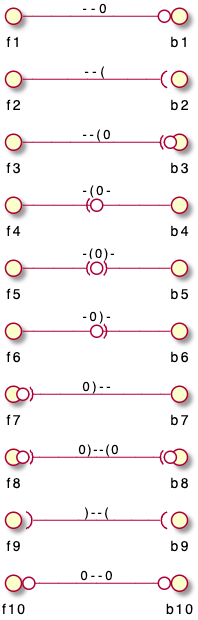

### 부록: 모든 요소에 대한 인라인 스타일

#### 간단한 요소
```java
@startuml
actor actor             #aliceblue;line:blue;line.dotted;text:blue
actor/ "actor/"         #aliceblue;line:blue;line.dotted;text:blue
agent agent             #aliceblue;line:blue;line.dotted;text:blue
artifact artifact       #aliceblue;line:blue;line.dotted;text:blue
boundary boundary       #aliceblue;line:blue;line.dotted;text:blue
card card               #aliceblue;line:blue;line.dotted;text:blue
circle circle           #aliceblue;line:blue;line.dotted;text:blue
cloud cloud             #aliceblue;line:blue;line.dotted;text:blue
collections collections #aliceblue;line:blue;line.dotted;text:blue
component component     #aliceblue;line:blue;line.dotted;text:blue
control control         #aliceblue;line:blue;line.dotted;text:blue
database database       #aliceblue;line:blue;line.dotted;text:blue
entity entity           #aliceblue;line:blue;line.dotted;text:blue
file file               #aliceblue;line:blue;line.dotted;text:blue
folder folder           #aliceblue;line:blue;line.dotted;text:blue
frame frame             #aliceblue;line:blue;line.dotted;text:blue
hexagon hexagon         #aliceblue;line:blue;line.dotted;text:blue
interface interface     #aliceblue;line:blue;line.dotted;text:blue
label label             #aliceblue;line:blue;line.dotted;text:blue
node node               #aliceblue;line:blue;line.dotted;text:blue
package package         #aliceblue;line:blue;line.dotted;text:blue
person person           #aliceblue;line:blue;line.dotted;text:blue
queue queue             #aliceblue;line:blue;line.dotted;text:blue
rectangle rectangle     #aliceblue;line:blue;line.dotted;text:blue
stack stack             #aliceblue;line:blue;line.dotted;text:blue
storage storage         #aliceblue;line:blue;line.dotted;text:blue
usecase usecase         #aliceblue;line:blue;line.dotted;text:blue
usecase/ "usecase/"     #aliceblue;line:blue;line.dotted;text:blue
@enduml
```
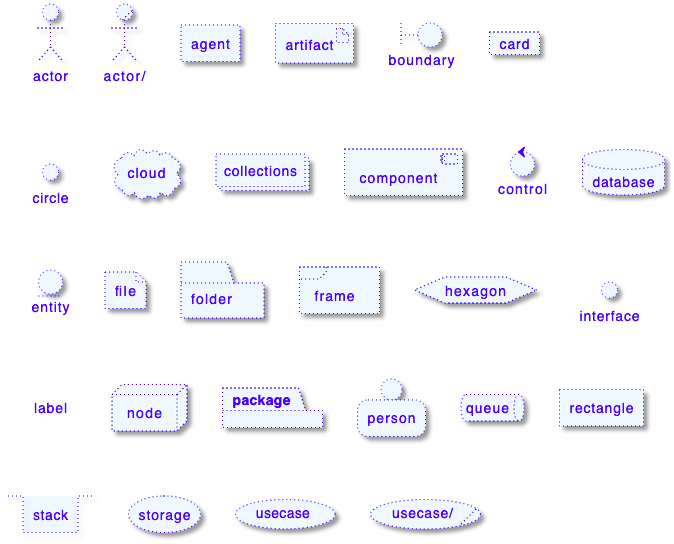

#### 중첩된 요소

##### 하위 요소가 없는 경우
```java
@startuml
artifact artifact #aliceblue;line:blue;line.dotted;text:blue {
}
card card #aliceblue;line:blue;line.dotted;text:blue {
}
cloud cloud #aliceblue;line:blue;line.dotted;text:blue {
}
component component #aliceblue;line:blue;line.dotted;text:blue {
}
database database #aliceblue;line:blue;line.dotted;text:blue {
}
file file #aliceblue;line:blue;line.dotted;text:blue {
}
folder folder #aliceblue;line:blue;line.dotted;text:blue {
}
frame frame #aliceblue;line:blue;line.dotted;text:blue {
}
hexagon hexagon #aliceblue;line:blue;line.dotted;text:blue {
}
node node #aliceblue;line:blue;line.dotted;text:blue {
}
package package #aliceblue;line:blue;line.dotted;text:blue {
}
queue queue #aliceblue;line:blue;line.dotted;text:blue {
}
rectangle rectangle #aliceblue;line:blue;line.dotted;text:blue {
}
stack stack #aliceblue;line:blue;line.dotted;text:blue {
}
storage storage #aliceblue;line:blue;line.dotted;text:blue {
}
@enduml
```
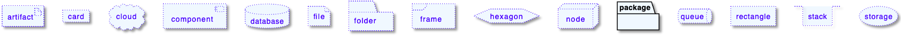

##### 하위 요소가 있는 경우
```java
@startuml
artifact    artifactVeryLOOOOOOOOOOOOOOOOOOOg    as "artifact" #aliceblue;line:blue;line.dotted;text:blue {
file f1
}
card        cardVeryLOOOOOOOOOOOOOOOOOOOg        as "card" #aliceblue;line:blue;line.dotted;text:blue {
file f2
}
cloud       cloudVeryLOOOOOOOOOOOOOOOOOOOg       as "cloud" #aliceblue;line:blue;line.dotted;text:blue {
file f3
}
component   componentVeryLOOOOOOOOOOOOOOOOOOOg   as "component" #aliceblue;line:blue;line.dotted;text:blue {
file f4
}
database    databaseVeryLOOOOOOOOOOOOOOOOOOOg    as "database" #aliceblue;line:blue;line.dotted;text:blue {
file f5
}
file        fileVeryLOOOOOOOOOOOOOOOOOOOg        as "file" #aliceblue;line:blue;line.dotted;text:blue {
file f6
}
folder      folderVeryLOOOOOOOOOOOOOOOOOOOg      as "folder" #aliceblue;line:blue;line.dotted;text:blue {
file f7
}
frame       frameVeryLOOOOOOOOOOOOOOOOOOOg       as "frame" #aliceblue;line:blue;line.dotted;text:blue {
file f8
}
hexagon     hexagonVeryLOOOOOOOOOOOOOOOOOOOg     as "hexagon" #aliceblue;line:blue;line.dotted;text:blue {
file f9
}
node        nodeVeryLOOOOOOOOOOOOOOOOOOOg        as "node" #aliceblue;line:blue;line.dotted;text:blue {
file f10
}
package     packageVeryLOOOOOOOOOOOOOOOOOOOg     as "package" #aliceblue;line:blue;line.dotted;text:blue {
file f11
}
queue       queueVeryLOOOOOOOOOOOOOOOOOOOg       as "queue" #aliceblue;line:blue;line.dotted;text:blue {
file f12
}
rectangle   rectangleVeryLOOOOOOOOOOOOOOOOOOOg   as "rectangle" #aliceblue;line:blue;line.dotted;text:blue {
file f13
}
stack       stackVeryLOOOOOOOOOOOOOOOOOOOg       as "stack" #aliceblue;line:blue;line.dotted;text:blue {
file f14
}
storage     storageVeryLOOOOOOOOOOOOOOOOOOOg     as "storage" #aliceblue;line:blue;line.dotted;text:blue {
file f15
}
@enduml
```
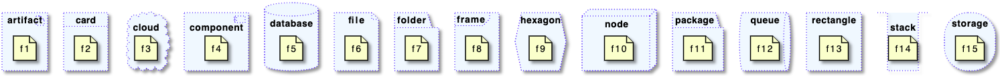

### 부록: 모든 요소의 스타일 테스트

#### 간단한 요소

##### 글로벌 스타일 (componentDiagram)
```java
@startuml
<style>
componentDiagram {
  BackGroundColor palegreen
  LineThickness 1
  LineColor red
}
document {
  BackGroundColor white
}
</style>
actor actor
actor/ "actor/"
agent agent
artifact artifact
boundary boundary
card card
circle circle
cloud cloud
collections collections
component component
control control
database database
entity entity
file file
folder folder
frame frame
hexagon hexagon
interface interface
label label
node node
package package
person person
queue queue
rectangle rectangle
stack stack
storage storage
usecase usecase
usecase/ "usecase/"
@enduml
```
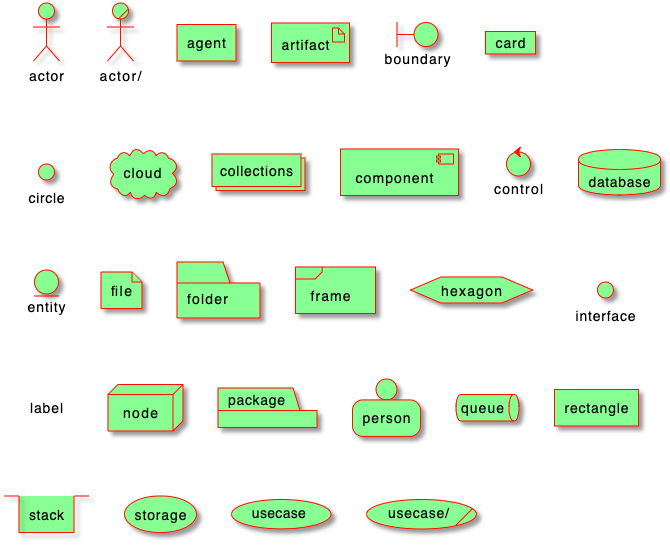

##### 개별 요소의 스타일
```java
@startuml
<style>
actor {
  BackGroundColor #f80c12
  LineThickness 1
  LineColor black
}
agent {
  BackGroundColor #f80c12
  LineThickness 1
  LineColor black
}
artifact {
  BackGroundColor #ee1100
  LineThickness 1
  LineColor black
}
boundary {
  BackGroundColor #ee1100
  LineThickness 1
  LineColor black
}
card {
  BackGroundColor #ff3311
  LineThickness 1
  LineColor black
}
circle {
  BackGroundColor #ff3311
  LineThickness 1
  LineColor black
}
cloud {
  BackGroundColor #ff4422
  LineThickness 1
  LineColor black
}
collections {
  BackGroundColor #ff4422
  LineThickness 1
  LineColor black
}
component {
  BackGroundColor #ff6644
  LineThickness 1
  LineColor black
}
control {
  BackGroundColor #ff6644
  LineThickness 1
  LineColor black
}
database {
  BackGroundColor #ff9933
  LineThickness 1
  LineColor black
}
entity {
  BackGroundColor #feae2d
  LineThickness 1
  LineColor black
}
file {
  BackGroundColor #feae2d
  LineThickness 1
  LineColor black
}
folder {
  BackGroundColor #ccbb33
  LineThickness 1
  LineColor black
}
frame {
  BackGroundColor #d0c310
  LineThickness 1
  LineColor black
}
hexagon {
  BackGroundColor #aacc22
  LineThickness 1
  LineColor black
}
interface {
  BackGroundColor #69d025
  LineThickness 1
  LineColor black
}
label {
  BackGroundColor black
  LineThickness 1
  LineColor black
}
node {
  BackGroundColor #22ccaa
  LineThickness 1
  LineColor black
}
package {
  BackGroundColor #12bdb9
  LineThickness 1
  LineColor black
}
person {
  BackGroundColor #11aabb
  LineThickness 1
  LineColor black
}
queue {
  BackGroundColor #11aabb
  LineThickness 1
  LineColor black
}
rectangle {
  BackGroundColor #4444dd
  LineThickness 1
  LineColor black
}
stack {
  BackGroundColor #3311bb
  LineThickness 1
  LineColor black
}
storage {
  BackGroundColor #3b0cbd
  LineThickness 1
  LineColor black
}
usecase {
  BackGroundColor #442299
  LineThickness 1
  LineColor black
}
</style>
actor actor
actor/ "actor/"
agent agent
artifact artifact
boundary boundary
card card
circle circle
cloud cloud
collections collections
component component
control control
database database
entity entity
file file
folder folder
frame frame
hexagon hexagon
interface interface
label label
node node
package package
person person
queue queue
rectangle rectangle
stack stack
storage storage
usecase usecase
usecase/ "usecase/"
@enduml
```
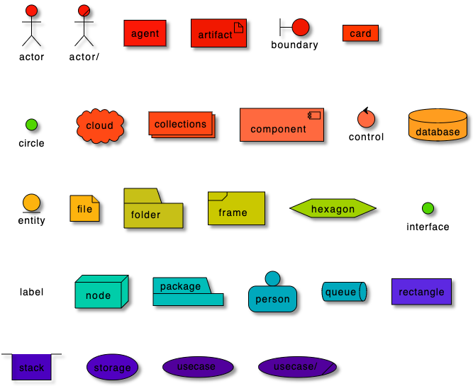

#### 라벨없는 중첩 요소

##### 글롤벌 스타일 (componentDiagram)

```java@startuml
<style>
componentDiagram {
  BackGroundColor palegreen
  LineThickness 2
  LineColor red
}
</style>
artifact artifact {
}
card card {
}
cloud cloud {
}
component component {
}
database database {
}
file file {
}
folder folder {
}
frame frame {
}
hexagon hexagon {
}
node node {
}
package package {
}
queue queue {
}
rectangle rectangle {
}
stack stack {
}
storage storage {
}
@enduml
```
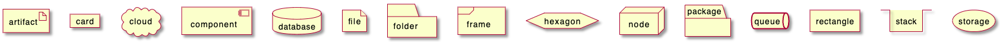

##### 중첩 요소의 개별 스타일
```java
@startuml
<style>
artifact {
  BackGroundColor #ee1100
  LineThickness 1
  LineColor black
}
card {
  BackGroundColor #ff3311
  LineThickness 1
  LineColor black
}
cloud {
  BackGroundColor #ff4422
  LineThickness 1
  LineColor black
}
component {
  BackGroundColor #ff6644
  LineThickness 1
  LineColor black
}
database {
  BackGroundColor #ff9933
  LineThickness 1
  LineColor black
}
file {
  BackGroundColor #feae2d
  LineThickness 1
  LineColor black
}
folder {
  BackGroundColor #ccbb33
  LineThickness 1
  LineColor black
}
frame {
  BackGroundColor #d0c310
  LineThickness 1
  LineColor black
}
hexagon {
  BackGroundColor #aacc22
  LineThickness 1
  LineColor black
}
node {
  BackGroundColor #22ccaa
  LineThickness 1
  LineColor black
}
package {
  BackGroundColor #12bdb9
  LineThickness 1
  LineColor black
}
queue {
  BackGroundColor #11aabb
  LineThickness 1
  LineColor black
}
rectangle {
  BackGroundColor #4444dd
  LineThickness 1
  LineColor black
}
stack {
  BackGroundColor #3311bb
  LineThickness 1
  LineColor black
}
storage {
  BackGroundColor #3b0cbd
  LineThickness 1
  LineColor black
}

</style>
artifact artifact {
}
card card {
}
cloud cloud {
}
component component {
}
database database {
}
file file {
}
folder folder {
}
frame frame {
}
hexagon hexagon {
}
node node {
}
package package {
}
queue queue {
}
rectangle rectangle {
}
stack stack {
}
storage storage {
}
@enduml
```
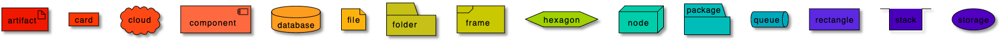

#### 1단계 중첩 요소

##### 글로벌 스타일 (componentDiagram)
```java
@startuml
<style>
componentDiagram {
  BackGroundColor palegreen
  LineThickness 1
  LineColor red
}
document {
  BackGroundColor white
}
</style>
artifact e1 as "artifact" {
file f1
}
card e2 as "card" {
file f2
}
cloud e3 as "cloud" {
file f3
}
component e4 as "component" {
file f4
}
database e5 as "database" {
file f5
}
file e6 as "file" {
file f6
}
folder e7 as "folder" {
file f7
}
frame e8 as "frame" {
file f8
}
hexagon e9 as "hexagon" {
file f9
}
node e10 as "node" {
file f10
}
package e11 as "package" {
file f11
}
queue e12 as "queue" {
file f12
}
rectangle e13 as "rectangle" {
file f13
}
stack e14 as "stack" {
file f14
}
storage e15 as "storage" {
file f15
}
@enduml
```
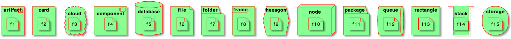

##### 중첩된 요소의 개별 스타일
```java
@startuml
<style>
artifact {
  BackGroundColor #ee1100
  LineThickness 1
  LineColor black
}
card {
  BackGroundColor #ff3311
  LineThickness 1
  LineColor black
}
cloud {
  BackGroundColor #ff4422
  LineThickness 1
  LineColor black
}
component {
  BackGroundColor #ff6644
  LineThickness 1
  LineColor black
}
database {
  BackGroundColor #ff9933
  LineThickness 1
  LineColor black
}
file {
  BackGroundColor #feae2d
  LineThickness 1
  LineColor black
}
folder {
  BackGroundColor #ccbb33
  LineThickness 1
  LineColor black
}
frame {
  BackGroundColor #d0c310
  LineThickness 1
  LineColor black
}
hexagon {
  BackGroundColor #aacc22
  LineThickness 1
  LineColor black
}
node {
  BackGroundColor #22ccaa
  LineThickness 1
  LineColor black
}
package {
  BackGroundColor #12bdb9
  LineThickness 1
  LineColor black
}
queue {
  BackGroundColor #11aabb
  LineThickness 1
  LineColor black
}
rectangle {
  BackGroundColor #4444dd
  LineThickness 1
  LineColor black
}
stack {
  BackGroundColor #3311bb
  LineThickness 1
  LineColor black
}
storage {
  BackGroundColor #3b0cbd
  LineThickness 1
  LineColor black
}
</style>
artifact e1 as "artifact" {
file f1
}
card e2 as "card" {
file f2
}
cloud e3 as "cloud" {
file f3
}
component e4 as "component" {
file f4
}
database e5 as "database" {
file f5
}
file e6 as "file" {
file f6
}
folder e7 as "folder" {
file f7
}
frame e8 as "frame" {
file f8
}
hexagon e9 as "hexagon" {
file f9
}
node e10 as "node" {
file f10
}
package e11 as "package" {
file f11
}
queue e12 as "queue" {
file f12
}
rectangle e13 as "rectangle" {
file f13
}
stack e14 as "stack" {
file f14
}
storage e15 as "storage" {
file f15
}
@enduml
```
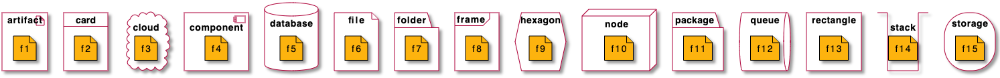

### 부록: 모든 요소에 스테레오타입 스타일 적용

#### 간단 요소
```java
@startuml
<style>
.stereo {
  BackgroundColor palegreen
}
</style>
actor actor << stereo >>
actor/ "actor/" << stereo >>
agent agent << stereo >>
artifact artifact << stereo >>
boundary boundary << stereo >>
card card << stereo >>
circle circle << stereo >>
cloud cloud << stereo >>
collections collections << stereo >>
component component << stereo >>
control control << stereo >>
database database << stereo >>
entity entity << stereo >>
file file << stereo >>
folder folder << stereo >>
frame frame << stereo >>
hexagon hexagon << stereo >>
interface interface << stereo >>
label label << stereo >>
node node << stereo >>
package package << stereo >>
person person << stereo >>
queue queue << stereo >>
rectangle rectangle << stereo >>
stack stack << stereo >>
storage storage << stereo >>
usecase usecase << stereo >>
usecase/ "usecase/" << stereo >>
@enduml
```
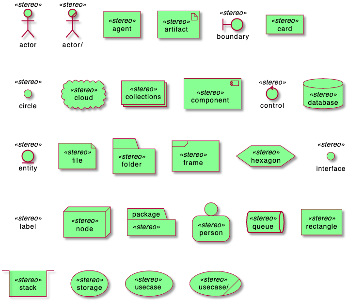
