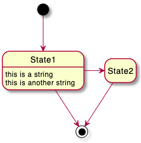
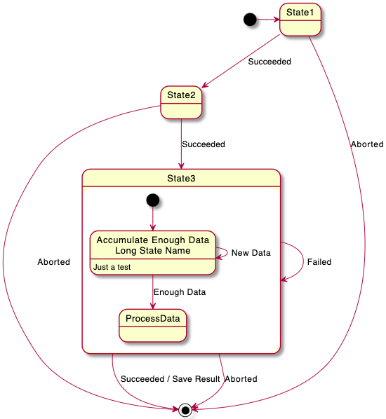
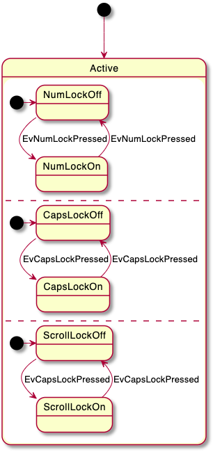
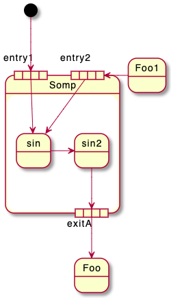
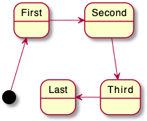
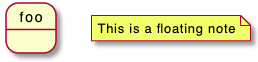
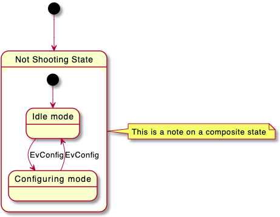
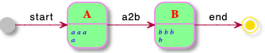

## 상태 다이어그램

### 간단한 상태
`[*]`을 사용해서 시작점과 종료점을 그립니다.
`-->`를 사용해서 화살표를 그립니다.

```java
@startuml

[*] --> State1
State1 --> [*]
State1 : this is a string
State1 : this is another string

State1 -> State2
State2 --> [*]

@enduml
```


### 상태 설명이 없는 경우
`hide empty description` 명령을  주면 설명이 없는 상태에 대해 간단한 도형을 그립니다.

```java
@startuml
hide empty description
[*] --> State1
State1 --> [*]
State1 : this is a string
State1 : this is another string

State1 -> State2
State2 --> [*]
@enduml
```


### 상태 수정
상태는 중첩될 수 있습니다. 다음과 같이 `state` 키워드와 대괄호를 활용합니다.

```java
@startuml
scale 350 width
[*] --> NotShooting

state NotShooting {
  [*] --> Idle
  Idle --> Configuring : EvConfig
  Configuring --> Idle : EvConfig
}

state Configuring {
  [*] --> NewValueSelection
  NewValueSelection --> NewValuePreview : EvNewValue
  NewValuePreview --> NewValueSelection : EvNewValueRejected
  NewValuePreview --> NewValueSelection : EvNewValueSaved

  state NewValuePreview {
     State1 -> State2
  }

}
@enduml
```


### 긴 이름
`state` 키워드를 사용하면 이름이 긴 상태들을 만들 수 있습니다.

```java
@startuml
scale 600 width

[*] -> State1
State1 --> State2 : Succeeded
State1 --> [*] : Aborted
State2 --> State3 : Succeeded
State2 --> [*] : Aborted
state State3 {
  state "Accumulate Enough Data\nLong State Name" as long1
  long1 : Just a test
  [*] --> long1
  long1 --> long1 : New Data
  long1 --> ProcessData : Enough Data
}
State3 --> State3 : Failed
State3 --> [*] : Succeeded / Save Result
State3 --> [*] : Aborted

@enduml
```


### 상태 히스토리 `[H], [H*]`
간단한 상태 히스토리를 위하여 `[H]` 또는 깊은 하위 상태 히스토리를 위한 `[H*]`를 이용할 수 있습니다.

```java
@startuml
[*] -> State1
State1 --> State2 : Succeeded
State1 --> [*] : Aborted
State2 --> State3 : Succeeded
State2 --> [*] : Aborted
state State3 {
  state "Accumulate Enough Data" as long1
  long1 : Just a test
  [*] --> long1
  long1 --> long1 : New Data
  long1 --> ProcessData : Enough Data
  State2 --> [H]: Resume
}
State3 --> State2 : Pause
State2 --> State3[H*]: DeepResume
State3 --> State3 : Failed
State3 --> [*] : Succeeded / Save Result
State3 --> [*] : Aborted
@enduml
```


### Fork [fork, join]
`<<fork>> `와 `<<join>>` 스테레오타입을 통하여 병렬 작업을 표현할 수 있습니다.

```java
@startuml

state fork_state <<fork>>
[*] --> fork_state
fork_state --> State2
fork_state --> State3

state join_state <<join>>
State2 --> join_state
State3 --> join_state
join_state --> State4
State4 --> [*]

@enduml
```


### 동시 상태 [--, ||]
`--` 또는 `||` 구분자를 이용하여 동시에 나타나는 상태를 표현할 수 있습니다.

#### 가로 구분자 `--`
```java
@startuml
[*] --> Active

state Active {
  [*] -> NumLockOff
  NumLockOff --> NumLockOn : EvNumLockPressed
  NumLockOn --> NumLockOff : EvNumLockPressed
  --
  [*] -> CapsLockOff
  CapsLockOff --> CapsLockOn : EvCapsLockPressed
  CapsLockOn --> CapsLockOff : EvCapsLockPressed
  --
  [*] -> ScrollLockOff
  ScrollLockOff --> ScrollLockOn : EvCapsLockPressed
  ScrollLockOn --> ScrollLockOff : EvCapsLockPressed
}

@enduml
```


#### 세로 구분자 `||`
```java
@startuml
[*] --> Active

state Active {
  [*] -> NumLockOff
  NumLockOff --> NumLockOn : EvNumLockPressed
  NumLockOn --> NumLockOff : EvNumLockPressed
  ||
  [*] -> CapsLockOff
  CapsLockOff --> CapsLockOn : EvCapsLockPressed
  CapsLockOn --> CapsLockOff : EvCapsLockPressed
  ||
  [*] -> ScrollLockOff
  ScrollLockOff --> ScrollLockOn : EvCapsLockPressed
  ScrollLockOn --> ScrollLockOff : EvCapsLockPressed
}

@enduml
```


### 조건 [choice]
스테레오타입 `<<choice>>`을 이용하여 조건 상태를 표현할 수 있습니다.

```java
@startuml
state "Req(Id)" as ReqId <<sdlreceive>>
state "Minor(Id)" as MinorId
state "Major(Id)" as MajorId
 
state c <<choice>>
 
Idle --> ReqId
ReqId --> c
c --> MinorId : [Id <= 10]
c --> MajorId : [Id > 10]
@enduml
```


### 스테레오타입을 이용한 충분한 예제 [choice, fork, join, end]
```java
@startuml
state choice1 <<choice>>
state fork1   <<fork>>
state join2   <<join>>
state end3    <<end>>

[*]     --> choice1 : from start\nto choice
choice1 --> fork1   : from choice\nto fork
choice1 --> join2   : from choice\nto join
choice1 --> end3    : from choice\nto end

fork1   ---> State1 : from fork\nto state
fork1   --> State2  : from fork\nto state

State2  --> join2   : from state\nto join
State1  --> [*]     : from state\nto end

join2   --> [*]     : from join\nto end
@enduml
```


### 포인트 [entryPoint, exitPoint]
`<<entryPoint>>` 와 `<<exitPoint>>` 스테레오타입을 이용하여 상태에 진입점과 진출점을 표현할 수 있습니다:
```java
@startuml
state Somp {
  state entry1 <<entryPoint>>
  state entry2 <<entryPoint>>
  state sin
  entry1 --> sin
  entry2 -> sin
  sin -> sin2
  sin2 --> exitA <<exitPoint>>
}

[*] --> entry1
exitA --> Foo
Foo1 -> entry2
@enduml
```


### 핀 [inputPin, outputPin]
위의 상태에 진출점, 진입점과 유사하게 **핀** `<<inputPin>>` 과 `<<outputPin>>` 스테레오타입을 이용할 수도 있습니다:
```java
@startuml
state Somp {
  state entry1 <<inputPin>>
  state entry2 <<inputPin>>
  state sin
  entry1 --> sin
  entry2 -> sin
  sin -> sin2
  sin2 --> exitA <<outputPin>>
}

[*] --> entry1
exitA --> Foo
Foo1 -> entry2
@enduml
```


### 확장 [expansionInput, expansionOutput]
`<<expansionInput>>` 과 `<<expansionOutput>>` 스테레오타입을 이용한 **확장** 을 다음과 같이 그릴 수도 있습니다:
```java
@startuml
state Somp {
  state entry1 <<expansionInput>>
  state entry2 <<expansionInput>>
  state sin
  entry1 --> sin
  entry2 -> sin
  sin -> sin2
  sin2 --> exitA <<expansionOutput>>
}

[*] --> entry1
exitA --> Foo
Foo1 -> entry2
@enduml
```


### 화살표 방향
`->` 와 같은 방식으로 수평 화살표를 그릴 수 있는데, 다음과 같은 방법으로 방향을 지정할 수 있습니다:
* `-down->` 또는 `-->`
* `-right->` 또는 `->` *(기본)*
* `-left->`
* `-up->`

```java
@startuml

[*] -up-> First
First -right-> Second
Second --> Third
Third -left-> Last

@enduml
```


> `-down-` 대신 `-d-` 또는 `-do-`와 같이 축약하여 사용할 수 있습니다. (권장하지는 않습니다)

### 라인 색상과 스타일 변경
라인의 [color](https://plantuml.com/ko/color) 색상 뿐만 아니라 스타일 등도 변경 가능합니다.

```java
@startuml
State S1
State S2
S1 -[#DD00AA]-> S2
S1 -left[#yellow]-> S3
S1 -up[#red,dashed]-> S4
S1 -right[dotted,#blue]-> S5

X1 -[dashed]-> X2
Z1 -[dotted]-> Z2
Y1 -[#blue,bold]-> Y2
@enduml
```


### 노트
`note left of`, `note right of`, `note top of`, `note bottom of` 등의 키워드를 이용하여 각 상태에 노트를 달 수 있습니다. 또한 라인에도 노트를 달 수 있습니다.

```java
@startuml

[*] --> Active
Active --> Inactive

note left of Active : this is a short\nnote

note right of Inactive
  A note can also
  be defined on
  several lines
end note

@enduml
```


또한 연결없이 떠 있는 것도 가능합니다.
```java
@startuml

state foo
note "This is a floating note" as N1

@enduml
```


### 링크에 노트 달기
`note on link` 키워드를 이용하면 링크에도 노트를 달 수 있습니다.

```java
@startuml
[*] -> State1
State1 --> State2
note on link 
  this is a state-transition note 
end note
@enduml
```


### 기타 노트에 관한 사항
중첩된 상태에도 노트를 달 수 있습니다.

```java
@startuml

[*] --> NotShooting

state "Not Shooting State" as NotShooting {
  state "Idle mode" as Idle
  state "Configuring mode" as Configuring
  [*] --> Idle
  Idle --> Configuring : EvConfig
  Configuring --> Idle : EvConfig
}

note right of NotShooting : This is a note on a composite state

@enduml
```


### 인라인 색상
```java
@startuml
state CurrentSite #pink {
    state HardwareSetup #lightblue {
       state Site #brown
        Site -[hidden]-> Controller
        Controller -[hidden]-> Devices
    }
    state PresentationSetup{
        Groups -[hidden]-> PlansAndGraphics
    }
    state Trends #FFFF77
    state Schedule #magenta
    state AlarmSupression
}
@enduml
```


### Skinparam
[skinparam](https://plantuml.com/ko/skinparam) 명령어를 이용하면 객체의 폰트나 색상 조정 등이 가능합니다.

다음과 같은 위치에서 명령을 내릴 수 있습니다:

* 다이어그램 정의부에 다른 명령처럼 설정하거나,
* [included file](https://plantuml.com/ko/preprocessing)에 지정하거나,
* [명령행](https://plantuml.com/ko/command-line) 또는 [ANT task](https://plantuml.com/ko/ant-task)에 제공된 설정파일에 지정할 수 있습니다.

스테레오타입의 상태에 특정 색상이나 폰트 등을 정의할 수 있습니다.

```java
@startuml
skinparam backgroundColor LightYellow
skinparam state {
  StartColor MediumBlue
  EndColor Red
  BackgroundColor Peru
  BackgroundColor<<Warning>> Olive
  BorderColor Gray
  FontName Impact
}

[*] --> NotShooting

state "Not Shooting State" as NotShooting {
  state "Idle mode" as Idle <<Warning>>
  state "Configuring mode" as Configuring
  [*] --> Idle
  Idle --> Configuring : EvConfig
  Configuring --> Idle : EvConfig
}

NotShooting --> [*]
@enduml
```


#### 상태 다이어그램에 모든 skinparam 적용
```java
@startuml
skinparam State {
  AttributeFontColor blue
  AttributeFontName serif
  AttributeFontSize  9
  AttributeFontStyle italic
  BackgroundColor palegreen
  BorderColor violet
  EndColor gold
  FontColor red
  FontName Sanserif
  FontSize 15
  FontStyle bold
  StartColor silver
}

state A : a a a\na
state B : b b b\nb

[*] -> A  : start
A -> B : a2b
B -> [*] : end
@enduml
```


### 스타일 변경
[style](https://plantuml.com/ko/style-evolution) 스타일 변경이 가능합니다.

```java
@startuml

<style>
stateDiagram {
  BackgroundColor Peru
  'LineColor Gray
  FontName Impact
  FontColor Red
  arrow {
    FontSize 13
    LineColor Blue
  }
}
</style>


[*] --> NotShooting

state "Not Shooting State" as NotShooting {
  state "Idle mode" as Idle <<Warning>>
  state "Configuring mode" as Configuring
  [*] --> Idle
  Idle --> Configuring : EvConfig
  Configuring --> Idle : EvConfig
}

NotShooting --> [*]
@enduml
```


### 상태의 색상과 스타일 변경 (인라인 형식)
[color](https://plantuml.com/ko/color) 색상을 통한 다음과 같은 인라인 형식으로 개별 상태에 대한 스타일을 변경할 수 있습니다:
* `#color ##[style]color`

`#color` 백그라운드 색상을 먼저 지정한 다음 `##[style]color` 라인스타일과 색상을 지정합니다.

```java
@startuml
state FooGradient #red-green ##00FFFF
state FooDashed #red|green ##[dashed]blue {
}
state FooDotted ##[dotted]blue {
}
state FooBold ##[bold] {
}
state Foo1 ##[dotted]green {
state inner1 ##[dotted]yellow
}

state out ##[dotted]gold

state Foo2 ##[bold]green {
state inner2 ##[dotted]yellow
}
inner1 -> inner2
out -> inner2
@enduml
```


* `#color;line:color;line.[bold|dashed|dotted];text:color`

```java
@startuml
state FooGradient #red-green;line:00FFFF
state FooDashed #red|green;line.dashed;line:blue {
}
state FooDotted #line.dotted;line:blue {
}
state FooBold #line.bold {
}
state Foo1 #line.dotted;line:green {
state inner1 #line.dotted;line:yellow
}

state out #line.dotted;line:gold

state Foo2 #line.bold;line:green {
state inner2 #line.dotted;line:yellow
}
inner1 -> inner2
out -> inner2
@enduml
```


```java
@startuml
state s1 : s1 description
state s2 #pink;line:red;line.bold;text:red : s2 description
state s3 #palegreen;line:green;line.dashed;text:green : s3 description
state s4 #aliceblue;line:blue;line.dotted;text:blue   : s4 description
@enduml
```


### 별칭
`alias`를 이용하여 별칭을 사용할 수 있습니다:
```java
@startuml
state alias1 
state "alias2"
state "long name" as alias3
state alias4 as "long name"

alias1 : ""state alias1""
alias2 : ""state "alias2"""
alias3 : ""state "long name" as alias3""
alias4 : ""state alias4 as "long name"""

alias1 -> alias2
alias2 -> alias3
alias3 -> alias4
@enduml
```


또는:

```java
@startuml
state alias1 : ""state alias1""
state "alias2" : ""state "alias2"""
state "long name" as alias3 : ""state "long name" as alias3""
state alias4 as "long name" : ""state alias4 as "long name"""

alias1 -> alias2
alias2 -> alias3
alias3 -> alias4
@enduml
```


