## JSON 데이터 그리기

[JSON](https://en.wikipedia.org/wiki/JSON) 포맷은 현재 가장 많이 이용되고 있는 데이터 표현 방법입니다.

이런 `JSON` 형식의 데이터를 PlantUML에서 그릴 수 있습니다.
다음과 같이,
* 시작 시 `@startjson` 키워드 사용
* 종료 시 `@endjson` 키워드 사용

하면 됩니다.

```java
@startjson
{
   "fruit":"Apple",
   "size":"Large",
   "color":"Red"
}
@endjson
```
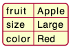

### 복잡한 예제
다음과 같이 복잡한 JSON 데이터도 표현가능합니다.

```java
@startjson
{
  "firstName": "John",
  "lastName": "Smith",
  "isAlive": true,
  "age": 27,
  "address": {
    "streetAddress": "21 2nd Street",
    "city": "New York",
    "state": "NY",
    "postalCode": "10021-3100"
  },
  "phoneNumbers": [
    {
      "type": "home",
      "number": "212 555-1234"
    },
    {
      "type": "office",
      "number": "646 555-4567"
    }
  ],
  "children": [],
  "spouse": null
}
@endjson
```
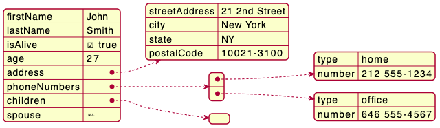

### 부분 강조

`#highlight`를 이용하여 특정 항목을 강조할 수 있습니다.
```java
@startjson
#highlight "lastName"
#highlight "address" / "city"
#highlight "phoneNumbers" / "0" / "number"
{
  "firstName": "John",
  "lastName": "Smith",
  "isAlive": true,
  "age": 28,
  "address": {
    "streetAddress": "21 2nd Street",
    "city": "New York",
    "state": "NY",
    "postalCode": "10021-3100"
  },
  "phoneNumbers": [
    {
      "type": "home",
      "number": "212 555-1234"
    },
    {
      "type": "office",
      "number": "646 555-4567"
    }
  ],
  "children": [],
  "spouse": null
}
@endjson
```
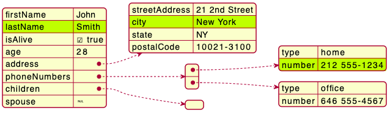

### JSON 기본 요소
JSON 기본 데이터 등에 관한 설명입니다.

```java
@startjson
{
"null": null,
"true": true,
"false": false,
"JSON_Number": [-1, -1.1, "<color:green>TBC"],
"JSON_String": "a\nb\rc\td <color:green>TBC...",
"JSON_Object": {
  "{}": {},
  "k_int": 123,
  "k_str": "abc",
  "k_obj": {"k": "v"}
},
"JSON_Array" : [
  [],
  [true, false],
  [-1, 1],
  ["a", "b", "c"],
  ["mix", null, true, 1, {"k": "v"}]
]
}
@endjson
```
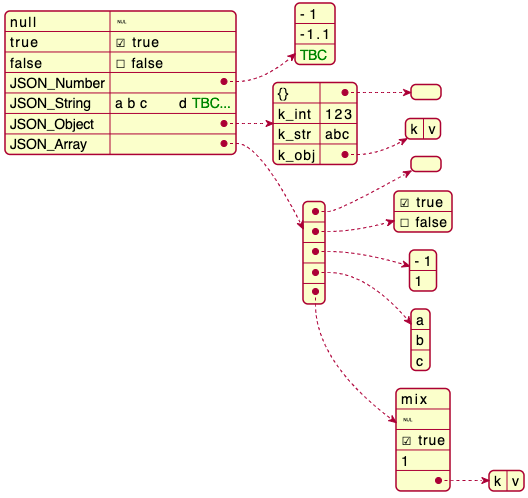

### JSON 어레이 또는 테이블

#### 어레이 형태
```java
@startjson
{
"Numeric": [1, 2, 3],
"String ": ["v1a", "v2b", "v3c"],
"Boolean": [true, false, true]
}
@endjson
```
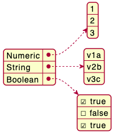

#### 최소 어레이 또는 테이블

##### 숫자 어레이
```java
@startjson
[1, 2, 3]
@endjson
```
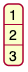

##### 문자열 어레이
```java
@startjson
["1a", "2b", "3c"]
@endjson
```
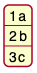

##### 불리언 어레이
```java
@startjson
[true, false, true]
@endjson
```
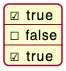

### JSON 숫자
```java
@startjson
{
"DecimalNumber": [-1, 0, 1],
"DecimalNumber . Digits": [-1.1, 0.1, 1.1],
"DecimalNumber ExponentPart": [1E5]
}
@endjson
```
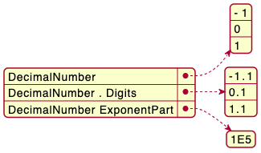

### JSON 문자열

#### JSON 유니코드
유니코드를 직접 사용하거나 `\uXXXX` 등과 같은 표현방법으로 사용할 수 있습니다.

```java
@startjson
{
  "<color:blue><b>code": "<color:blue><b>value",
  "a\\u005Cb":           "a\u005Cb",
  "\\uD83D\\uDE10":      "\uD83D\uDE10",
  "😐":                  "😐"
}
@endjson
```
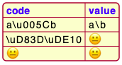

#### JSON 두 글자 이스케이프 시퀀스
```java
@startjson
{
 "**legend**: character name":               ["**two-character escape sequence**", "example (between 'a' and 'b')"],
 "quotation mark character (U+0022)":        ["\\\"", "a\"b"],
 "reverse solidus character (U+005C)":       ["\\\\\\", "a\\b"],
 "solidus character (U+002F)":               ["\\\/", "a\/b"],
 "backspace character (U+0008)":             ["\\b", "a\bb"],
 "form feed character (U+000C)":             ["\\f", "a\fb"],
 "line feed character (U+000A)":             ["\\n", "a\nb"],
 "carriage return character (U+000D)":       ["\\r", "a\rb"],
 "character tabulation character (U+0009)":  ["\\t", "a\tb"]
}
@endjson
```
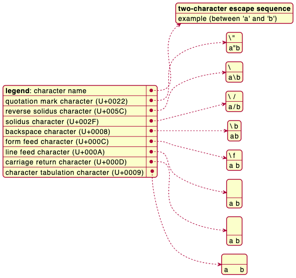

```java
@startjson
[
"\\\\",
"\\n",
"\\r",
"\\t"
]
@endjson
```
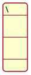

### 최소 JSON 예제

#### 예제 1
```java
@startjson
"Hello world!"
@endjson
```
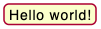

#### 예제 2
```java
@startjson
42
@endjson
```
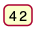

#### 예제 3
```java
@startjson
true
@endjson
```
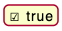

### 빈 테이블 또는 리스트
```java
@startjson
{
  "empty_tab": [],
  "empty_list": {}
}
@endjson
```
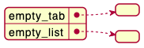

### 글로벌 스타일 사용

#### 스타일이 없는 경우 (기본)
```java
@startjson
#highlight "1" / "hr"
[
  {
    "name": "Mark McGwire",
    "hr":   65,
    "avg":  0.278
  },
  {
    "name": "Sammy Sosa",
    "hr":   63,
    "avg":  0.288
  }
]
@endjson
```
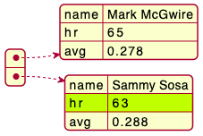

#### 스타일 사용
[style](https://plantuml.com/ko/style-evolution) 스타일을 사용하여 개별 요소의 스타일을 변경할 수 있습니다.

```java
@startjson
<style>
jsonDiagram {
  node {
    BackGroundColor Khaki
    LineColor lightblue
    FontName Helvetica
    FontColor red
    FontSize 18
    FontStyle bold
    RoundCorner 0
    LineThickness 2
    LineStyle 10;5
    separator {
      LineThickness 0.5
      LineColor black
      LineStyle 1;5
    }
  }
  arrow {
    BackGroundColor lightblue
    LineColor green
    LineThickness 2
    LineStyle 2;5
  }
  highlight {
    BackGroundColor red
    FontColor white
    FontStyle italic
  }
}
</style>
#highlight "1" / "hr"
[
  {
    "name": "Mark McGwire",
    "hr":   65,
    "avg":  0.278
  },
  {
    "name": "Sammy Sosa",
    "hr":   63,
    "avg":  0.288
  }
]
@endjson
```
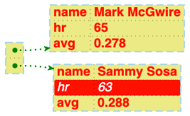
