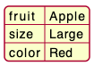
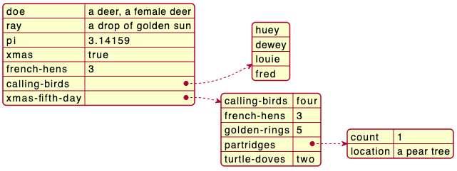
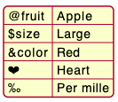
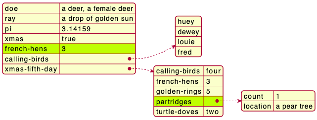
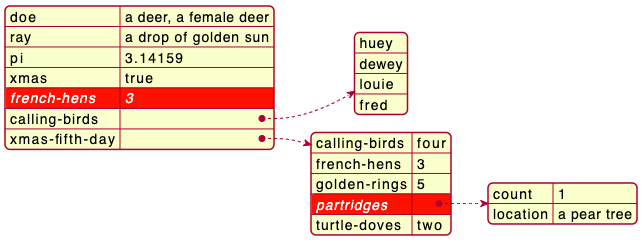
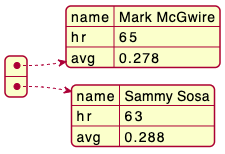
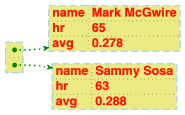

## YAML 데이터 그리기

[YAML](https://en.wikipedia.org/wiki/YAML) 데이터 포맷은 설정 등 소프트웨어에서 잘 사용됩니다. JSON하고 1:1 호환이 가능합니다.

이 기능을 사용하려면:
* 시작 시 `@startyaml` 키워드
* 종료 시 `@endyaml` 키워드

를 이용하면 됩니다.
```yaml
@startyaml
fruit: Apple
size: Large
color: Red
@endyaml
```


### 복잡한 예
```yaml
@startyaml
doe: "a deer, a female deer"
ray: "a drop of golden sun"
pi: 3.14159
xmas: true
french-hens: 3
calling-birds: 
  - huey
  - dewey
  - louie
  - fred
xmas-fifth-day: 
  calling-birds: four
  french-hens: 3
  golden-rings: 5
  partridges: 
    count: 1
    location: "a pear tree"
  turtle-doves: two
@endyaml
```


### 심볼 또는 유니코드 등을 이용한 특별한 키
```yaml
@startyaml
@fruit: Apple
$size: Large
&color: Red
❤: Heart
‰: Per mille
@endyaml
```


### 일부분 강조

#### 일반 스타일

```yaml
@startyaml
#highlight "french-hens"
#highlight "xmas-fifth-day" / "partridges"

doe: "a deer, a female deer"
ray: "a drop of golden sun"
pi: 3.14159
xmas: true
french-hens: 3
calling-birds: 
  - huey
  - dewey
  - louie
  - fred
xmas-fifth-day: 
  calling-birds: four
  french-hens: 3
  golden-rings: 5
  partridges: 
    count: 1
    location: "a pear tree"
  turtle-doves: two
@endyaml
```


#### 사용자정의 스타일
```yaml
@startyaml
<style>
yamlDiagram {
    highlight {
      BackGroundColor red
      FontColor white
      FontStyle italic
    }
}
</style>
#highlight "french-hens"
#highlight "xmas-fifth-day" / "partridges"

doe: "a deer, a female deer"
ray: "a drop of golden sun"
pi: 3.14159
xmas: true
french-hens: 3
calling-birds: 
  - huey
  - dewey
  - louie
  - fred
xmas-fifth-day: 
  calling-birds: four
  french-hens: 3
  golden-rings: 5
  partridges: 
    count: 1
    location: "a pear tree"
  turtle-doves: two
@endyaml
```


### 글로벌 스타일 사용

#### 스타일 없는 경우 (기본)

```yaml
@startyaml
  -
    name: Mark McGwire
    hr:   65
    avg:  0.278
  -
    name: Sammy Sosa
    hr:   63
    avg:  0.288
@endyaml
```


#### 스타일 적용

[style](https://plantuml.com/ko/style-evolution) 스타일을 개별 요소에 적용할 수 있습니다.

```yaml
@startyaml
<style>
yamlDiagram {
  node {
    BackGroundColor lightblue
    LineColor lightblue
    FontName Helvetica
    FontColor red
    FontSize 18
    FontStyle bold
    BackGroundColor Khaki
    RoundCorner 0
    LineThickness 2
    LineStyle 10;5
    separator {
      LineThickness 0.5
      LineColor black
      LineStyle 1;5
    }
  }
  arrow {
    BackGroundColor lightblue
    LineColor green
    LineThickness 2
    LineStyle 2;5
  }
}
</style>
  -
    name: Mark McGwire
    hr:   65
    avg:  0.278
  -
    name: Sammy Sosa
    hr:   63
    avg:  0.288
@endyaml
```

