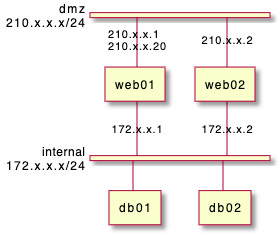
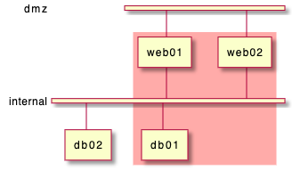
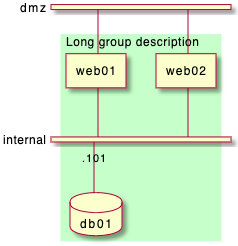
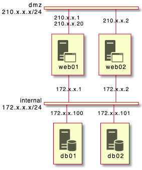
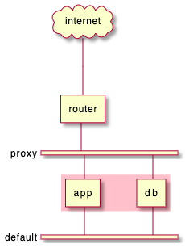
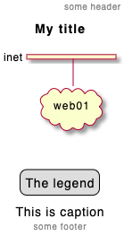
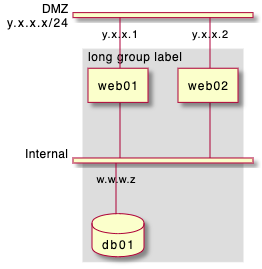
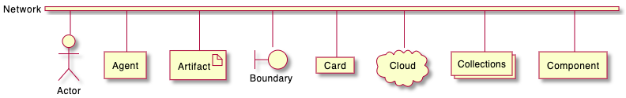

## 네트워크 다이어그램
[Takeshi Komiya](https://twitter.com/tk0miya) 가 만든 [nwdiag](http://blockdiag.com/en/nwdiag/nwdiag-examples.html) 기능을 이용하면 PlantUML 안에서 쉽게 네트워크 다이어그램을 만들 수 있습니다. 본 저자가 작성한 샘플을 이곳에서 다시 이용합니다.

### 간단한 다이어그램

#### 네트워크 정의

```java
@startuml
nwdiag {
  network dmz {
      address = "210.x.x.x/24"
  }
}
@enduml
```


#### 네트워크에 서버나 다른 요소 정의

```java
@startuml
nwdiag {
  network dmz {
      address = "210.x.x.x/24"

      web01 [address = "210.x.x.1"];
      web02 [address = "210.x.x.2"];
  }
}
@enduml
```


#### 복잡한 예제

```java
@startuml
nwdiag {
  network dmz {
      address = "210.x.x.x/24"

      web01 [address = "210.x.x.1"];
      web02 [address = "210.x.x.2"];
  }
  network internal {
      address = "172.x.x.x/24";

      web01 [address = "172.x.x.1"];
      web02 [address = "172.x.x.2"];
      db01;
      db02;
  }
}
@enduml
```


### 여러 주소 정의

```java
@startuml
nwdiag {
  network dmz {
      address = "210.x.x.x/24"

      // set multiple addresses (using comma)
      web01 [address = "210.x.x.1, 210.x.x.20"];
      web02 [address = "210.x.x.2"];
  }
  network internal {
      address = "172.x.x.x/24";

      web01 [address = "172.x.x.1"];
      web02 [address = "172.x.x.2"];
      db01;
      db02;
  }
}
@enduml
```


### 노드 그룹화

#### 네트워크 정의 안에 그룹화하기

```java
@startuml
nwdiag {
  network Sample_front {
    address = "192.168.10.0/24";

    // define group
    group web {
      web01 [address = ".1"];
      web02 [address = ".2"];
    }
  }
  network Sample_back {
    address = "192.168.20.0/24";
    web01 [address = ".1"];
    web02 [address = ".2"];
    db01 [address = ".101"];
    db02 [address = ".102"];

    // define network using defined nodes
    group db {
      db01;
      db02;
    }
  }
}
@enduml
```


#### 네트워크 정의 상위에서 그룹화

```java
@startuml
nwdiag {
  // define group outside of network definitions
  group {
    color = "#FFAAAA";

    web01;
    web02;
    db01;
  }

  network dmz {
    web01;
    web02;
  }
  network internal {
    web01;
    web02;
    db01;
    db02;
  }
}
@enduml
```


#### 동일 네트워크에서 여러 그룹 적용

* 2개의 그룹
```java
@startuml
nwdiag {
  group {
    color = "#FFaaaa";
    web01;
    db01;
  }
  group {
    color = "#aaaaFF";
    web02;
    db02;
  }
  network dmz {
      address = "210.x.x.x/24"

      web01 [address = "210.x.x.1"];
      web02 [address = "210.x.x.2"];
  }
  network internal {
      address = "172.x.x.x/24";

      web01 [address = "172.x.x.1"];
      web02 [address = "172.x.x.2"];
      db01 ;
      db02 ;
  }
}
@enduml
```


* 3개의 그룹
```java
@startuml
nwdiag {
  group {
    color = "#FFaaaa";
    web01;
    db01;
  }
  group {
    color = "#aaFFaa";
    web02;
    db02;
  }
  group {
    color = "#aaaaFF";
    web03;
    db03;
  }

  network dmz {
      web01;
      web02;
      web03;
  }
  network internal {
      web01;
      db01 ;
      web02;
      db02 ;
      web03;
      db03;
  }
}
@enduml
```


### 구문 확장 (네트워크 또는 그룹)

#### 네트워크

네트워크 또는 네트워크 안에 컴포넌트에 대하여 다음과 같이 변경할 수 있습니다:
* 콤마 등에 구분된 멀티 주소
* [색상](https://plantuml.com/ko/color)
* 설명
* [모양](https://plantuml.com/ko/deployment-diagram#5k3cq00k8n5ek362kjdn)

```java
@startuml
nwdiag {
  network Sample_front {
    address = "192.168.10.0/24"
    color = "red"

    // define group
    group web {
      web01 [address = ".1, .2", shape = "node"]
      web02 [address = ".2, .3"]
    }
  }
  network Sample_back {
    address = "192.168.20.0/24"
    color = "palegreen"
    web01 [address = ".1"]
    web02 [address = ".2"]
    db01 [address = ".101", shape = database ]
    db02 [address = ".102"]

    // define network using defined nodes
    group db {
      db01;
      db02;
    }
  }
}
@enduml
```


#### 그룹

그룹에 대해서는 다음과 같은 내용을 변경할 수 있습니다:
* [색상](https://plantuml.com/ko/color)
* 설명

```java
@startuml
nwdiag {
  group {
    color = "#CCFFCC";
    description = "Long group description";

    web01;
    web02;
    db01;
  }

  network dmz {
    web01;
    web02;
  }
  network internal {
    web01;
    web02;
    db01 [address = ".101", shape = database];
  }
}
@enduml
```


### Sprite 아이콘 사용
PlantUML에 있는 [표준 라이브러리](https://plantuml.com/ko/stdlib)를 비롯한 다른 어떤 라이브러리에서 [sprites](https://plantuml.com/ko/sprite) 아이콘을 사용할 수 있습니다.
`<$sprite>`를 이용해서 아이콘을 사용할 수 있고 `\n`로 개행문자를 비롯한 [Creole](https://plantuml.com/ko/creole) 문법을 지원합니다.

```java
@startuml
!include <office/Servers/application_server>
!include <office/Servers/database_server>

nwdiag {
  network dmz {
      address = "210.x.x.x/24"

      // set multiple addresses (using comma)
      web01 [address = "210.x.x.1, 210.x.x.20",  description = "<$application_server>\n web01"]
      web02 [address = "210.x.x.2",  description = "<$application_server>\n web02"];
  }
  network internal {
      address = "172.x.x.x/24";

      web01 [address = "172.x.x.1"];
      web02 [address = "172.x.x.2"];
      db01 [address = "172.x.x.100",  description = "<$database_server>\n db01"];
      db02 [address = "172.x.x.101",  description = "<$database_server>\n db02"];
  }
}
@enduml
```


### 오픈 아이콘 사용
네트워크 다이그램에 또한 [OpenIconic](https://plantuml.com/ko/openiconic) 이라는 오픈 아이콘을 이용할 수 있습니다.
`<&icon>` 형식으로 아이콘을 이용하고, `<&icon*n>`에서 *n* 크기위 아이콘을 지정할 수 있고, `\n` 개행문자를 사용할 수 있습니다:
```java
@startuml

nwdiag {
  group nightly {
    color = "#FFAAAA";
    description = "<&clock> Restarted nightly <&clock>";
    web02;
    db01;
  }
  network dmz {
      address = "210.x.x.x/24"

      user [description = "<&person*4.5>\n user1"];
      // set multiple addresses (using comma)
      web01 [address = "210.x.x.1, 210.x.x.20",  description = "<&cog*4>\nweb01"]
      web02 [address = "210.x.x.2",  description = "<&cog*4>\nweb02"];

  }
  network internal {
      address = "172.x.x.x/24";

      web01 [address = "172.x.x.1"];
      web02 [address = "172.x.x.2"];
      db01 [address = "172.x.x.100",  description = "<&spreadsheet*4>\n db01"];
      db02 [address = "172.x.x.101",  description = "<&spreadsheet*4>\n db02"];
      ptr  [address = "172.x.x.110",  description = "<&print*4>\n ptr01"];
  }
}
@enduml
```


오픈 아이콘 목록을 다음과 같이 확인 가능합니다.
```java
@startuml
listopeniconic
@enduml
```


### 두 네트워크 이상에서의 동일 노드
두 개 이상의 네트워크에서 서로 다른 네트워크를 동일 노드로 사용하다면 `nwdiag`에서는 `jump line`라는 라인 건너뛰기로 표현됩니다.

```java
@startuml
nwdiag {
  // define group at outside network definitions
  group {
    color = "#7777FF";

    web01;
    web02;
    db01;
  }

  network dmz {
    color = "pink"

    web01;
    web02;
  }

  network internal {
    web01;
    web02;
    db01 [shape = database ];
  }

  network internal2 {
    color = "LightBlue";

    web01;
    web02;
    db01;
  }

}
@enduml
```


### 피어 네트워크
피어 네크워크는 일반적인 "busbar" 버스 바 형태의 네크워크가 아닌 방식으로 두 노드를 연결하는 네트워크를 나타냅니다.

```java
@startuml
nwdiag {
  inet [shape = cloud];
  inet -- router;

  network {
    router;
    web01;
    web02;
  }
}
@enduml
```


### 피어 네트워크와 그룹

#### 그룹이 없는 경우
```java
@startuml
nwdiag {
    internet [ shape = cloud];
    internet -- router;

    network proxy {
        router;
        app;
    }
    network default {
    	app;
        db;
    }
}
@enduml
```


#### 첫번 째 그룹
```java
@startuml
nwdiag {
    internet [ shape = cloud];
    internet -- router;

    group {
      color = "pink";
      app;
      db;
    }

    network proxy {
        router;
        app;
    }

    network default {
    	app;
        db;
    }
}
@enduml
```


#### 두 번째 그룹

```java
@startuml
nwdiag {
    internet [ shape = cloud];
    internet -- router;

    network proxy {
        router;
        app;
    }

    group {
      color = "pink";
      app;
      db;
    }

    network default {
    	app;
        db;
    }
}
@enduml
```


#### 세 번째 그룹

```java
@startuml
nwdiag {
    internet [ shape = cloud];
    internet -- router;

    network proxy {
        router;
        app;
    }
    network default {
    	app;
        db;
    }
    group {
      color = "pink";
      app;
      db;
    }
}
@enduml
```


### 제목, 자막, 헤더, 푸터 또는 색인 등

```java
@startuml

header some header

footer some footer

title My title

nwdiag {
  network inet {
      web01 [shape = cloud]
  }
}

legend
The legend
end legend

caption This is caption
@enduml
```


### 그림자 조종

#### 그림자 있게 (기본)
```java
@startuml
nwdiag {
  network nw {
    server;
    internet;
  }
  internet [shape = cloud];
}
@enduml
```


#### 그림자 없이
```java
@startuml
<style>
root {
 shadowing 0
}
</style>
nwdiag {
  network nw {
    server;
    internet;
  }
  internet [shape = cloud];
}
@enduml
```


### 네트워크의 너비 조정
네트워크 구성 요소의 전체 또는 일부 만큼의 너비를 갖도록 조정할 수 있습니다.

#### 너비 조정 없이
```java
@startuml
nwdiag {
  network NETWORK_BASE {
   dev_A [address = "dev_A" ]
   dev_B [address = "dev_B" ]
  }
  network IntNET1 {
   dev_B [address = "dev_B1" ]
   dev_M [address = "dev_M1" ]
   dev_C [address = "dev_C" ]
  }
  network IntNET2 {
   dev_B [address = "dev_B2" ]
   dev_M [address = "dev_M2" ]
 }
}
@enduml
```


#### 첫 번째 너비 맞춤
```java
@startuml
nwdiag {
  network NETWORK_BASE {
   width = full
   dev_A [address = "dev_A" ]
   dev_B [address = "dev_B" ]
   dev_C [address = "dev_C" ]
  }
  network IntNET1 {
   dev_B [address = "dev_B1" ]
   dev_M [address = "dev_M1" ]
  }
  network IntNET2 {
   dev_B [address = "dev_B2" ]
   dev_M [address = "dev_M2" ]
 }
}
@enduml
```


### 두 번째 너비 까지 맞춤
```java
@startuml
nwdiag {
  network NETWORK_BASE {
   width = full
   dev_A [address = "dev_A" ]
   dev_B [address = "dev_B" ]
   dev_C [address = "dev_C" ]
  }
  network IntNET1 {
   width = full
   dev_B [address = "dev_B1" ]
   dev_M [address = "dev_M1" ]
  }
  network IntNET2 {
   dev_B [address = "dev_B2" ]
   dev_M [address = "dev_M2" ]
 }
}
@enduml
```


#### 모든 네트워크에 대한 너비 맞춤
```java
@startuml
nwdiag {
  network NETWORK_BASE {
   width = full
   dev_A [address = "dev_A" ]
   dev_B [address = "dev_B" ]
   dev_C [address = "dev_C" ]
  }
  network IntNET1 {
   width = full
   dev_B [address = "dev_B1" ]
   dev_M [address = "dev_M1" ]
  }
  network IntNET2 {
   width = full
   dev_B [address = "dev_B2" ]
   dev_M [address = "dev_M2" ]
 }
}
@enduml
```


### 다른 내부 네트워크
TCP/IP, USB, SERIAL 등과 같은 다른 내부 네트워크를 정의할 수 있습니다.

#### 주소나 형식 없이
```java
@startuml
nwdiag {
  network LAN1 {
     a [address = "a1"];
  }
  network LAN2 {
     a [address = "a2"];
     switch;
  }
  switch -- equip;
  equip -- printer;
}
@enduml
```


#### 주소나 형식 포함
```java
@startuml
nwdiag {
  network LAN1 {
     a [address = "a1"];
  }
  network LAN2 {
     a [address = "a2"];
     switch [address = "s2"];
  }
  switch -- equip;
  equip [address = "e3"];
  equip -- printer;
  printer [address = "USB"];
}
@enduml
```


### 글로벌 스타일 사용

#### 스타일 정의 없는 경우 (기본)
```java
@startuml
nwdiag {
  network DMZ {
      address = "y.x.x.x/24"
      web01 [address = "y.x.x.1"];
      web02 [address = "y.x.x.2"];
  }

   network Internal {
    web01;
    web02;
    db01 [address = "w.w.w.z", shape = database];
  } 

    group {
    description = "long group label";
    web01;
    web02;
    db01;
  }
}
@enduml
```


#### 스타일 적용
[style](https://plantuml.com/ko/style-evolution) 스타일을 적용한 경우
```java
@startuml
<style>
nwdiagDiagram {
  network {
    BackGroundColor green
    LineColor red
    LineThickness 1.0
    FontSize 18
    FontColor navy
  }
  server {
    BackGroundColor pink
    LineColor yellow
    LineThickness 1.0
    ' FontXXX only for description or label
    FontSize 18
    FontColor #blue
  }
  arrow {
    ' FontXXX only for address 
    FontSize 17
    FontColor #red
    FontName Monospaced
    LineColor black
  }
  group {
    BackGroundColor cadetblue
    LineColor black
    LineThickness 2.0
    FontSize 11
    FontStyle bold
    Margin 5
    Padding 5
  }
}
</style>
nwdiag {
  network DMZ {
      address = "y.x.x.x/24"
      web01 [address = "y.x.x.1"];
      web02 [address = "y.x.x.2"];
  }

   network Internal {
    web01;
    web02;
    db01 [address = "w.w.w.z", shape = database];
  } 

    group {
    description = "long group label";
    web01;
    web02;
    db01;
  }
}
@enduml
```


### 부록: 네트워크 다이얼로그에서 다른 형태 확인

#### 예제 1
```java
@startuml
nwdiag {
  network Network {
    Actor       [shape = actor]       
    Agent       [shape = agent]       
    Artifact    [shape = artifact]    
    Boundary    [shape = boundary]    
    Card        [shape = card]        
    Cloud       [shape = cloud]       
    Collections [shape = collections] 
    Component   [shape = component]   
  }
}
@enduml
```


#### 예제 2
```java
@startuml
nwdiag {
  network Network {
    Control     [shape = control]     
    Database    [shape = database]    
    Entity      [shape = entity]      
    File        [shape = file]        
    Folder      [shape = folder]      
    Frame       [shape = frame]       
    Hexagon     [shape = hexagon]     
    Interface   [shape = interface]   
  }
}
@enduml
```


#### 예제 3
```java
@startuml
nwdiag {
  network Network {
    Label       [shape = label]       
    Node        [shape = node]        
    Package     [shape = package]     
    Person      [shape = person]      
    Queue       [shape = queue]       
    Stack       [shape = stack]       
    Rectangle   [shape = rectangle]   
    Storage     [shape = storage]     
    Usecase     [shape = usecase]     
  }
}
@enduml
```


> #### 수정할 필요가 있는 사항들
> * 폴더 라벨이 제대로 표시 안되는 부분
> * 헥사곤 형태 빠짐

```java
@startuml
nwdiag {
network Network {
Folder [shape = folder]
Hexagon [shape = hexagon]
}
}
@enduml
```


```java
@startuml
nwdiag {
network Network {
Folder [shape = folder, description = "Test, long long label\nTest, long long label\n"]
Hexagon [shape = hexagon, description = "Test, long long label\nTest, long long label"]
}
}
@enduml
```

