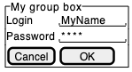
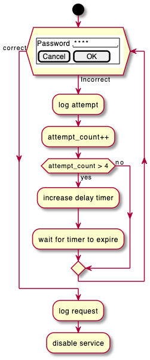

## 와이어프레임 (Salt)

**Salt**는 PlantUML에서 소프트웨어 와이어프레임 [Website Wireframe or Page Schematic or Screen Blueprint](https://en.wikipedia.org/wiki/Website_wireframe)을 만들 수 있는 하위 프로젝트 입니다.

본 툴의 목적은 간단한 샘플 사용자 인터페이스를 보여주는 것입니다.

`@startsalt` 키워드로 시작하거나 `@startuml` 다음에 나타나는 `salt` 키워드의 라인에 의해 시작됩니다.

### 기본 위짓
윈도우는 대괄호로 표현합니다. 다음과 같은 표현이 가능합니다:
* `[` 과 `]` 로 표현되는 단추
* `(` 과 `)` 로 표현되는 라디오 단추
* `[` 과 `]` 로 표현되는 체크박스
* `"` 로 표현되는 사용자 텍스트 입력 상자
* `^` 로 표현되는 드랍리스트

```java
@startsalt
{
  Just plain text
  [This is my button]
  ()  Unchecked radio
  (X) Checked radio
  []  Unchecked box
  [X] Checked box
  "Enter text here   "
  ^This is a droplist^
}
@endsalt
```


다음은 [텍스트 입력상자](https://html.spec.whatwg.org/multipage/form-elements.html#the-textarea-element)를 만드는 방법입니다:

```java
@startsalt
{+
   This is a long
   text in a textarea
   .
   "                         "
}
@endsalt
```


> 주의:
> * 점은 (`.`) 세로 스페이스를 채우는데 사용됩니다
> * 마지막 줄의 (`"  "`) 스페이스는 텍스트 입력 상자의 가로 길이를 나타냅니다

[스크롤바](https://plantuml.com/en/salt#6b6xvjbaj4gpk362kjkx)도 추가할 수 있습니다:

```java
@startsalt
{SI
   This is a long
   text in a textarea
   .
   "                         "
}
@endsalt
```


```java
@startsalt
{S-
   This is a long
   text in a textarea
   .
   "                         "
}
@endsalt
```


### 드랍리스트의 열기 및 닫기
앞뒤의 `^` 기호로 이루어진 드랍리스트의 경우, 다시 앞뒤의 `^` 기호로 이루어진 하위 항목을 추가하여 열린 모습을 보여줄 수 있습니다.
반복되는 `^^`는 `^`를 이용해도 됩니다.:

```java
@startsalt
{
  ^This is a closed droplist^ |
  ^This is an open droplist^^ item 1^^ item 2^ |
  ^This is another open droplist^ item 1^ item 2^ 
}
@endsalt
```


### [| 와 #, !, -, +] 를 이용한 그리드 사용
`{` 중괄호를 열고 그 안에 `|` 구분자를 이용한 그리드 (또는 폼)를 그릴 수 있습니다.

예를 들어:

```java
@startsalt
{
  Login    | "MyName   "
  Password | "****     "
  [Cancel] | [  OK   ]
}
@endsalt
```


다음은 중과호를 열고나서 바로 올 수 있는 심볼에 대한 내용입니다.
| **심볼** | **결과** |
|:---:|---|
| `#`	| 모든 가로 및 세로 줄 표시
| `!`	| 모든 세로 줄 표시
| `-`	| 모든 가로 줄 표시
| `+`	| 외부 줄 표시

```java
@startsalt
{+
  Login    | "MyName   "
  Password | "****     "
  [Cancel] | [  OK   ]
}
@endsalt
```


### 그룹 박스 [^]
```java
@startsalt
{^"My group box"
  Login    | "MyName   "
  Password | "****     "
  [Cancel] | [  OK   ]
}
@endsalt
```


### 구분자 사용 [`..`, `==`, `~~`, `--`]
그리드나 테이블 그룹 박스 등에 `..`, `==`, `~~`, `--` 등의 구분자를 표시할 수 있습니다.

```java
@startsalt
{
  Text1
  ..
  "Some field"
  ==
  Note on usage
  ~~
  Another text
  --
  [Ok]
}
@endsalt
```


### 트리 위젯 [T]
트리 UI를 표현하려면 `{T`로 시작하고 `+`로 계층 분리된 항목을 넣으면 됩니다.

```java
@startsalt
{
{T
 + World
 ++ America
 +++ Canada
 +++ USA
 ++++ New York
 ++++ Boston
 +++ Mexico
 ++ Europe
 +++ Italy
 +++ Germany
 ++++ Berlin
 ++ Africa
}
}
@endsalt
```


### 트리 테이블 [T]
트리와 테이블을 묶어서 사용할 수 있습니다.

```java
@startsalt
{
{T
+Region        | Population    | Age
+ World        | 7.13 billion  | 30
++ America     | 964 million   | 30
+++ Canada     | 35 million    | 30
+++ USA        | 319 million   | 30
++++ NYC       | 8 million     | 30
++++ Boston    | 617 thousand  | 30
+++ Mexico     | 117 million   | 30
++ Europe      | 601 million   | 30
+++ Italy      | 61 million    | 30
+++ Germany    | 82 million    | 30
++++ Berlin    | 3 million     | 30
++ Africa      | 1 billion     | 30
}
}
@endsalt
```


테이블에 개별 라인도 지정 가능합니다.

```java
@startsalt
{
..
== with T!
{T!
+Region        | Population    | Age
+ World        | 7.13 billion  | 30
++ America     | 964 million   | 30
}
..
== with T-
{T-
+Region        | Population    | Age
+ World        | 7.13 billion  | 30
++ America     | 964 million   | 30
}
..
== with T+
{T+
+Region        | Population    | Age
+ World        | 7.13 billion  | 30
++ America     | 964 million   | 30
}
..
== with T#
{T#
+Region        | Population    | Age
+ World        | 7.13 billion  | 30
++ America     | 964 million   | 30
}
..
}
@endsalt
```


### 중괄호 [{, }] 묶기
하위 항목은 중괄호를 새로 열어 표현할 수 있습니다.

```java
@startsalt
{
Name         | "                 "
Modifiers:   | { (X) public | () default | () private | () protected
                [] abstract | [] final   | [] static }
Superclass:  | { "java.lang.Object " | [Browse...] }
}
@endsalt
```


### 탭 추가 [/]
`{/` 로 시작하는 탭 인터페이스를 추가할 수 있습니다. HTML 코드로 `<b>` 굵게 표현할 수 있습니다.

```java
@startsalt
{+
{/ <b>General | Fullscreen | Behavior | Saving }
{
{ Open image in: | ^Smart Mode^ }
[X] Smooth images when zoomed
[X] Confirm image deletion
[ ] Show hidden images
}
[Close]
}
@endsalt
```


기본적으로 탭 인터페이스는 상단에 표시되지만, `{/ ... }` 탭 블락 다음에 `|`를 추가하여 왼편에 탭이 표현되도록 할 수도 있습니다:
```java
@startsalt
{+
{/ <b>General
Fullscreen
Behavior
Saving } |
{
{ Open image in: | ^Smart Mode^ }
[X] Smooth images when zoomed
[X] Confirm image deletion
[ ] Show hidden images
[Close]
}
}
@endsalt
```


### 메뉴 사용 [*]
`{*` 를 이용하여 메뉴를 사용할 수 있습니다.

```java
@startsalt
{+
{* File | Edit | Source | Refactor }
{/ General | Fullscreen | Behavior | Saving }
{
{ Open image in: | ^Smart Mode^ }
[X] Smooth images when zoomed
[X] Confirm image deletion
[ ] Show hidden images
}
[Close]
}
@endsalt
```


물론 메뉴를 연 것을 표시할 수 있습니다:

```java
@startsalt
{+
{* File | Edit | Source | Refactor
 Refactor | New | Open File | - | Close | Close All }
{/ General | Fullscreen | Behavior | Saving }
{
{ Open image in: | ^Smart Mode^ }
[X] Smooth images when zoomed
[X] Confirm image deletion
[ ] Show hidden images
}
[Close]
}
@endsalt
```


마찬가지 방식으로 드랍리스트도 열 수 있습니다:

```java
@startsalt
{+
{* File | Edit | Source | Refactor }
{/ General | Fullscreen | Behavior | Saving }
{
{ Open image in: | ^Smart Mode^^Normal Mode^ }
[X] Smooth images when zoomed
[X] Confirm image deletion
[ ] Show hidden images
}
[Close]
}
@endsalt
```


### 테이블 부가 설명
You can use two special notations for table :
테이블의 셀에 대하여 다음과 같은 두 가지 특별한 기능이 제공됩니다:
* `*` 왼쪽 셀과 병합합니다
* `.` 비어 있는 셀을 타나냅니다

```java
@startsalt
{#
. | Column 2 | Column 3
Row header 1 | value 1 | value 2
Row header 2 | A long cell | *
}
@endsalt
```


### 스크롤 바 [S, SI, S-]
다음의 예제처럼 `{S`를 이용한 [스크롤 바](https://en.wikipedia.org/wiki/Scrollbar)를 표시할 수 있습니다:
* `{S`: 가로와 세로 스크롤 바 표시

```java
@startsalt
{S
Message
.
.
.
.
}
@endsalt
```


* `{SI` : 세로 스크롤 바만 표시

```java
@startsalt
{SI
Message
.
.
.
.
}
@endsalt
```


* `{S-` : 가로 스롤 바만 표

```java
@startsalt
{S-
Message
.
.
.
.
}
@endsalt
```


### 색상
위젯의 [색상](https://plantuml.com/en/color)을 변경할 수 있습니다.

```java
@startsalt
{
  <color:Blue>Just plain text
  [This is my default button]
  [<color:green>This is my green button]
  [<color:#9a9a9a>This is my disabled button]
  []  <color:red>Unchecked box
  [X] <color:green>Checked box
  "Enter text here   "
  ^This is a droplist^
  ^<color:#9a9a9a>This is a disabled droplist^
  ^<color:red>This is a red droplist^
}
@endsalt
```


### Creole
[Creole or HTML Creole](https://plantuml.com/en/creole) 을 이 와이어프레임 다이얼로그에도 적용할 수 있습니다:

```java
@startsalt
{{^==Creole
  This is **bold**
  This is //italics//
  This is ""monospaced""
  This is --stricken-out--
  This is __underlined__
  This is ~~wave-underlined~~
  --test Unicode and icons--
  This is <U+221E> long
  This is a <&code> icon
  Use image : 
}|
{^<b>HTML Creole 
 This is <b>bold</b>
  This is <i>italics</i>
  This is <font:monospaced>monospaced</font>
  This is <s>stroked</s>
  This is <u>underlined</u>
  This is <w>waved</w>
  This is <s:green>stroked</s>
  This is <u:red>underlined</u>
  This is <w:#0000FF>waved</w>
  -- other examples --
  This is <color:blue>Blue</color>
  This is <back:orange>Orange background</back>
  This is <size:20>big</size>
}|
{^Creole line
You can have horizontal line
----
Or double line
====
Or strong line
____
Or dotted line
..My title..
Or dotted title
//and title... //
==Title==
Or double-line title
--Another title--
Or single-line title
Enjoy!
}|
{^Creole list item
**test list 1**
* Bullet list
* Second item
** Sub item
*** Sub sub item
* Third item
----
**test list 2**
# Numbered list
# Second item
## Sub item
## Another sub item
# Third item
}|
{^Mix on salt
  ==<color:Blue>Just plain text
  [This is my default button]
  [<b><color:green>This is my green button]
  [ ---<color:#9a9a9a>This is my disabled button-- ]
  []  <size:20><color:red>Unchecked box
  [X] <color:green>Checked box
  "//Enter text here//   "
  ^This is a droplist^
  ^<color:#9a9a9a>This is a disabled droplist^
  ^<b><color:red>This is a red droplist^
}}
@endsalt
```


### 임시 스프라이트 아이콘 [<<, >>]
`<<` 과 `>>`를 이용한 임시 스프라이트 아이콘을 만들어 사용할 수 있습니다.

```java
@startsalt
 {
 [X] checkbox|[] checkbox
 () radio | (X) radio
 This is a text|[This is my button]|This is another text
 "A field"|"Another long Field"|[A button]
 <<folder
 ............
 .XXXXX......
 .X...X......
 .XXXXXXXXXX.
 .X........X.
 .X........X.
 .X........X.
 .X........X.
 .XXXXXXXXXX.
 ............
 >>|<color:blue>other folder|<<folder>>
^Droplist^
}
@endsalt
```


### OpenIconic
[OpenIconic](https://useiconic.com/open/)는 매우 유명한 프리 아이콘 세트입니다. 이것은 [creole 파서](https://plantuml.com/en/creole)에 통합되었기 때문에 바로 사용할 수 있습니다.

다음과 같이 `<&ICON_NAME>` 문법을 이용합니다:
```java
@startsalt
{
  Login<&person> | "MyName   "
  Password<&key> | "****     "
  [Cancel <&circle-x>] | [OK <&account-login>]
}
@endsalt
```


해당 오픈 아이콘의 목록은 다음과 같이 확인 가능합니다.

```java
@startuml
listopeniconic
@enduml
```


### 제목, 헤더, 푸터, 자막 범례 등
```java
@startsalt
title My title
header some header
footer some footer
caption This is caption
legend
The legend
end legend

{+
  Login    | "MyName   "
  Password | "****     "
  [Cancel] | [  OK   ]
}

@endsalt
```


### 줌, DPI

#### 줌 사용안함 (기본)
```java
@startsalt
{
  <&person> Login  | "MyName   "
  <&key> Password  | "****     "
  [<&circle-x> Cancel ] | [ <&account-login> OK   ]
}
@endsalt
```


### 스케일
`scale` 명령을 이용하면 결과 이미지의 크기를 조종할 수 있습니다.

스케일 다음에 몇배 라는 값을 넣어 크기 조종이 가능하기도 하고 가로 또는 세로를 픽셀 단위로 입력할 수도 있습니다. 가로 세로 모두 픽셀로 지정하는 것도 가능합니다.

```java
@startsalt
scale 2
{
  <&person> Login  | "MyName   "
  <&key> Password  | "****     "
  [<&circle-x> Cancel ] | [ <&account-login> OK   ]
}
@endsalt
```


#### DPI
`skinparam dpi` 명령어를 이용하면 [DPI](https://namu.wiki/w/DPI)로 이미지 크기를 조정할 수 있습니다.

```java
@startsalt
skinparam dpi 200
{
  <&person> Login  | "MyName   "
  <&key> Password  | "****     "
  [<&circle-x> Cancel ] | [ <&account-login> OK   ]
}
@endsalt
```


### "활동 다이어그램"에 와이어프레임 포함하기

[다음 설명 참조](http://forum.plantuml.net/2427/salt-with-minimum-flowchat-capabilities?show=2427#q2427).

```java
@startuml
(*) --> "
{{
salt
{+
<b>an example
choose one option
()one
()two
[ok]
}
}}
" as choose

choose -right-> "
{{
salt
{+
<b>please wait
operation in progress
<&clock>
[cancel]
}
}}
" as wait
wait -right-> "
{{
salt
{+
<b>success
congratulations!
[ok]
}
}}
" as success

wait -down-> "
{{
salt
{+
<b>error
failed, sorry
[ok]
}
}}
"
@enduml
```


또한 [매크로 정의](https://plantuml.com/en/preprocessing#macro_definition)를 이용하여 동일 기능을 제공할 수 있습니다.

```java
@startuml
!unquoted procedure SALT($x)
"{{
salt
%invoke_procedure("_"+$x)
}}" as $x
!endprocedure

!procedure _choose()
{+
<b>an example
choose one option
()one
()two
[ok]
}
!endprocedure

!procedure _wait()
{+
<b>please wait
operation in progress
<&clock>
[cancel]
}
!endprocedure

!procedure _success()
{+
<b>success
congratulations!
[ok]
}
!endprocedure

!procedure _error()
{+
<b>error
failed, sorry
[ok]
}
!endprocedure

(*) --> SALT(choose)
-right-> SALT(wait)
wait -right-> SALT(success)
wait -down-> SALT(error)
@enduml
```


### 활동 다이어그램의 `while` 조건에서 와이어프레임 사용
다음과 같이 활동 다이어그램의 `while` 조건에서 와이어프레임 사용할 수 있습니다.

```java
@startuml
start
while (\n{{\nsalt\n{+\nPassword | "****     "\n[Cancel] | [  OK   ]}\n}}\n) is (Incorrect)
  :log attempt;
  :attempt_count++;
  if (attempt_count > 4) then (yes)
    :increase delay timer;
    :wait for timer to expire;
  else (no)
  endif
endwhile (correct)
:log request;
:disable service;
@enduml
```


### 활동 다이어그램의 `repeat while` 조건 에서 와이어프레임 사용
다음과 같이 활동 다이어그램의 `repeat while` 조건에서 와이어프레임 사용할 수 있습니다.

```java
@startuml
start
repeat :read data;
  :generate diagrams;
repeat while (\n{{\nsalt\n{^"Next step"\n  Do you want to continue? \n[Yes]|[No]\n}\n}}\n)
stop
@enduml
```


### Skinparam
[skinparam](https://plantuml.com/en/skinparam) 명령어의 **일부**를 사용할 수 있습니다.

예제:

```java
@startsalt
skinparam Backgroundcolor palegreen
{+
  Login    | "MyName   "
  Password | "****     "
  [Cancel] | [  OK   ]
}
@endsalt
```


```java
@startsalt
skinparam handwritten true
{+
  Login    | "MyName   "
  Password | "****     "
  [Cancel] | [  OK   ]
}
@endsalt
```


```java
@startsalt
skinparam defaultFontName monospaced
{+
  Login    | "MyName   "
  Password | "****     "
  [Cancel] | [  OK   ]
}
@endsalt
```


### 스타일
[스타일](https://plantuml.com/en/style-evolution) 명령 중 **일부**를 이용할 수 있습니다.

예제:

```java
@startsalt
<style>
saltDiagram {
  BackgroundColor palegreen
}
</style>
{+
  Login    | "MyName   "
  Password | "****     "
  [Cancel] | [  OK   ]
}
@endsalt
```


```java
@startsalt
<style>
saltDiagram {
  Fontname Monospaced
  FontSize 10
  FontStyle italic
  LineThickness 0.5
  LineColor red
}
</style>
{+
  Login    | "MyName   "
  Password | "****     "
  [Cancel] | [  OK   ]
}
@endsalt
```

