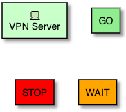
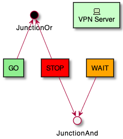
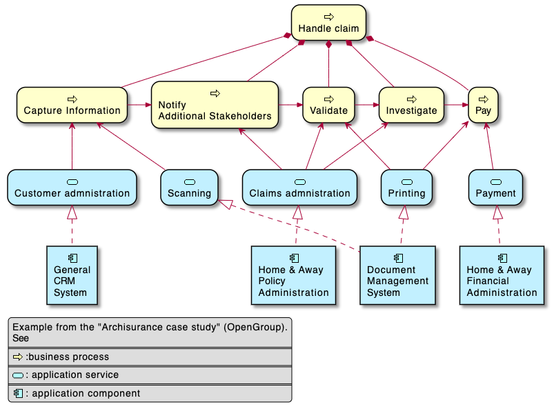
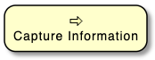
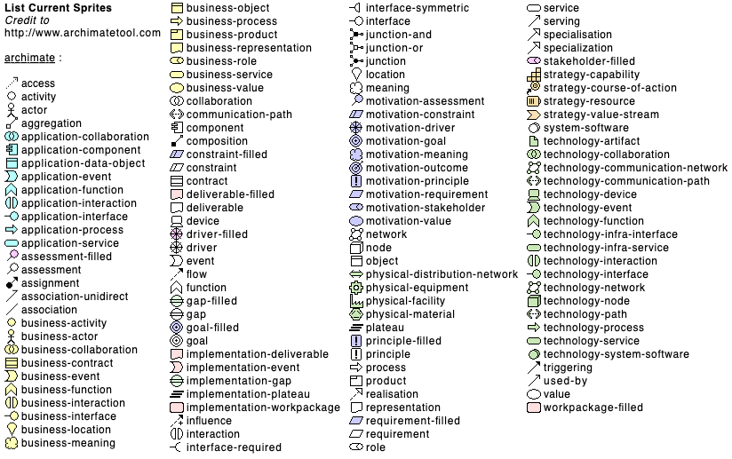
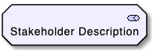
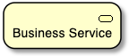
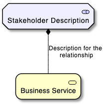
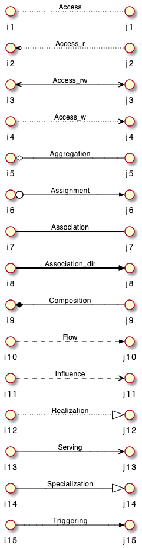
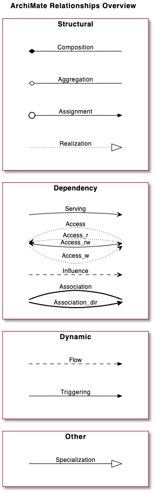

## 아키메이트 다이어그램
[아키메이트](https://en.wikipedia.org/wiki/ArchiMate)는 독립적인 엔터프라이즈 아키텍쳐 모델링 언어로써 여러 비즈니스 도메인 간의 아키텍쳐를 설명하고 분석하고 도식화하는 역할을 수행합니다.
> 본 다이어그램은 개발 중에 있어 변할 수 있습니다

### Archimate 키워드
아키메이트 다이어그램을 그리려면 `archimate` 키워드로 요소를 정의합니다. 별도의 아이콘을 지정하기 위하여 스테레오타입을 이용할 수 있습니다. 다음과 같은 일부 색상 (`Business`, `Application`, `Motivation`, `Strategy`, `Technology`, `Physical`, `Implementation`)도 지원합니다.

```java
@startuml
archimate #Technology "VPN Server" as vpnServerA <<technology-device>>

rectangle GO #lightgreen
rectangle STOP #red
rectangle WAIT #orange
@enduml
```


`circle` 키워드와 [전처리기](https://plantuml.com/en/preprocessing)를 이용하여 정션을 만들 수 있습니다.

```java
@startuml
!define Junction_Or circle #black
!define Junction_And circle #whitesmoke

Junction_And JunctionAnd
Junction_Or JunctionOr

archimate #Technology "VPN Server" as vpnServerA <<technology-device>>

rectangle GO #lightgreen
rectangle STOP #red
rectangle WAIT #orange
GO -up-> JunctionOr
STOP -up-> JunctionOr
STOP -down-> JunctionAnd
WAIT -down-> JunctionAnd
@enduml
```


### 예제 1
```java
@startuml
skinparam rectangle<<behavior>> {
	roundCorner 25
}
sprite $bProcess jar:archimate/business-process
sprite $aService jar:archimate/application-service
sprite $aComponent jar:archimate/application-component

rectangle "Handle claim"  as HC <<$bProcess>><<behavior>> #Business
rectangle "Capture Information"  as CI <<$bProcess>><<behavior>> #Business
rectangle "Notify\nAdditional Stakeholders" as NAS <<$bProcess>><<behavior>> #Business
rectangle "Validate" as V <<$bProcess>><<behavior>> #Business
rectangle "Investigate" as I <<$bProcess>><<behavior>> #Business
rectangle "Pay" as P <<$bProcess>><<behavior>> #Business

HC *-down- CI
HC *-down- NAS
HC *-down- V
HC *-down- I
HC *-down- P

CI -right->> NAS
NAS -right->> V
V -right->> I
I -right->> P

rectangle "Scanning" as scanning <<$aService>><<behavior>> #Application
rectangle "Customer admnistration" as customerAdministration <<$aService>><<behavior>> #Application
rectangle "Claims admnistration" as claimsAdministration <<$aService>><<behavior>> #Application
rectangle Printing <<$aService>><<behavior>> #Application
rectangle Payment <<$aService>><<behavior>> #Application

scanning -up-> CI
customerAdministration  -up-> CI
claimsAdministration -up-> NAS
claimsAdministration -up-> V
claimsAdministration -up-> I
Payment -up-> P

Printing -up-> V
Printing -up-> P

rectangle "Document\nManagement\nSystem" as DMS <<$aComponent>> #Application
rectangle "General\nCRM\nSystem" as CRM <<$aComponent>>  #Application
rectangle "Home & Away\nPolicy\nAdministration" as HAPA <<$aComponent>> #Application
rectangle "Home & Away\nFinancial\nAdministration" as HFPA <<$aComponent>>  #Application

DMS .up.|> scanning
DMS .up.|> Printing
CRM .up.|> customerAdministration
HAPA .up.|> claimsAdministration
HFPA .up.|> Payment

legend left
Example from the "Archisurance case study" (OpenGroup).
See
====
<$bProcess> :business process
====
<$aService> : application service
====
<$aComponent> : application component
endlegend
@enduml
```


### 예제 2
```java
@startuml
skinparam roundcorner 25
rectangle "Capture Information"  as CI <<$archimate/business-process>> #Business
@enduml
```


### 사용가능한 스프라이트 아이콘
다음과 같은 명령으로 사용가능한 아이콘과 이름을 확인할 수 있습니다:
```java
@startuml
listsprite
@enduml
```


### 매크로
[Archimate-PlantUML](https://github.com/ebbypeter/Archimate-PlantUML)에 아키메이트 매크로가 정의되어 있는데 이것을 이용하여 다이어그램을 보다 쉽게 이용할 수 있습니다. 또한 [표준 라이브러리](https://plantuml.com/en/stdlib)에 포함되었습니다.

#### 아키메이트 요소
`Category_ElementName(nameOfTheElement, "description")`과 같은 형식으로 매크로를 이용하여 아키메이트 요소를 생성할 수 있습니다.

예를 들어:
* 성취 카테고리에 요소인 `Stakeholder`를 정의하기 위해서는 아래와 같이 명령을 주면 됩니다: 
`Motivation_Stakeholder(StakeholderElement, "Stakeholder Description")`:

```java
@startuml
!include <archimate/Archimate>
Motivation_Stakeholder(StakeholderElement, "Stakeholder Description")
@enduml
```


* *비즈니스 서비스* 요소는: 
`Business_Service(BService, "Business Service")`

```java
@startuml
!include <archimate/Archimate>
Business_Service(BService, "Business Service")
@enduml
```


#### 아키메이트 관계
아키메이트의 관계는 `Rel_RelationType(fromElement, toElement, "description")` 와 같은 형식으로 지정하는데 두 요소 간의 방향과 기원 등을 기술하기 위해서 `Rel_RelationType_Direction(fromElement, toElement, "description")` 와 같이 정의합니다.

`RelationTypes`는 다음과 같은 관계를 정의합니다:
* 접근: Access
* 집합: Aggregation
* 할당: Assignment
* 연관: Association
* 구성: Composition
* 흐름: Flow
* 영향: Influence
* 실체화: Realization
* 서브: Serving
* 특정: Specialization
* 촉발: Triggering

`Directions` 방향은 다음을 지원합니다:
* Up
* Down
* Left
* Right

예를 들면:
* 이전 예에서의 `Stakeholder` 와 `비즈니스 서비스` 요소의 구성 `composition` 관계를 정의하려면 다음과 같이,
`Rel_Composition(StakeholderElement, BService, "Description for the relationship")` 
기술하면 됩니다. 다이어그램의 그리는 순서는 상단에서 하단입니다.

```java
@startuml
!include <archimate/Archimate>
Motivation_Stakeholder(StakeholderElement, "Stakeholder Description")
Business_Service(BService, "Business Service")
Rel_Composition(StakeholderElement, BService, "Description for the relationship")
@enduml
```


* 두 요소의 관계에 대한 방향은 다음과 같이 기술 가능합니다:
`Rel_Composition_Down(StakeholderElement, BService, "Description for the relationship")`

```java
@startuml
!include <archimate/Archimate>
Motivation_Stakeholder(StakeholderElement, "Stakeholder Description")
Business_Service(BService, "Business Service")
Rel_Composition_Down(StakeholderElement, BService, "Description for the relationship")
@enduml
```


#### 부록: 모든 아키메이트 관계에 대한 예제

```java
@startuml
left to right direction
skinparam nodesep 4
!include <archimate/Archimate>
Rel_Triggering(i15, j15, Triggering)
Rel_Specialization(i14, j14, Specialization)
Rel_Serving(i13, j13, Serving)
Rel_Realization(i12, j12, Realization)
Rel_Influence(i11, j11, Influence)
Rel_Flow(i10, j10, Flow)
Rel_Composition(i9, j9, Composition)
Rel_Association_dir(i8, j8, Association_dir)
Rel_Association(i7, j7, Association)
Rel_Assignment(i6, j6, Assignment)
Rel_Aggregation(i5, j5, Aggregation)
Rel_Access_w(i4, j4, Access_w)
Rel_Access_rw(i3, j3, Access_rw)
Rel_Access_r(i2, j2, Access_r)
Rel_Access(i1, j1, Access)
@enduml
```


```java
@startuml
title ArchiMate Relationships Overview
skinparam nodesep 5
<style>
interface {
    shadowing 0
    backgroundcolor transparent
    linecolor transparent
    FontColor transparent
}
</style>
!include <archimate/Archimate>
left to right direction

rectangle Other {
() i14
() j14
}


rectangle Dynamic {
() i10
() j10
() i15
() j15
}

rectangle Dependency {
() i13
() j13
() i4
() j4
() i11
() j11
() i7
() j7
}

rectangle Structural {
() i9
() j9
() i5
() j5
() i6
() j6
() i12
() j12
}

Rel_Triggering(i15, j15, Triggering)
Rel_Specialization(i14, j14, Specialization)
Rel_Serving(i13, j13, Serving)
Rel_Realization(i12, j12, Realization)
Rel_Influence(i11, j11, Influence)
Rel_Flow(i10, j10, Flow)
Rel_Composition(i9, j9, Composition)
Rel_Association_dir(i7, j7, \nAssociation_dir)
Rel_Association(i7, j7, Association)
Rel_Assignment(i6, j6, Assignment)
Rel_Aggregation(i5, j5, Aggregation)
Rel_Access_w(i4, j4, Access_w)
Rel_Access_rw(i4, j4, Access_rw)
Rel_Access_r(i4, j4, Access_r)
Rel_Access(i4, j4, Access)
@enduml
```

