# [Plant UML](https://plantuml.com/ko/)

PlantUML 은 다이어그램을 빠르게 작성하기 위한 오픈 소스 프로젝트입니다.

## Gantt Diagram

The Gantt is described in natural language, using very simple sentences (subject-verb-complement).

### Declaring tasks

Tasks defined using square bracket.

#### Duration

Their durations are defined using the `last` verb:

```java
@startgantt
[Prototype design] lasts 15 days
[Test prototype] lasts 10 days
-- All example --
[Task 1 (1 day)] lasts 1 day
[T2 (5 days)] lasts 5 days
[T3 (1 week)] lasts 1 week
[T4 (1 week and 4 days)] lasts 1 week and 4 days
[T5 (2 weeks)] lasts 2 weeks
@endgantt
```
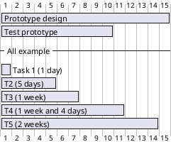

A week is a synonym for how many non-closed days are in a week. So if you specify Saturday and Sunday as closed, a week will be equivalent to 5 days

#### Start

Their beginning are defined using the `start` verb:

```java
@startuml
[Prototype design] lasts 15 days
[Test prototype] lasts 10 days

Project starts 2020-07-01
[Prototype design] starts 2020-07-01
[Test prototype] starts 2020-07-16
@enduml
```
```plantuml
@startuml
[Prototype design] lasts 15 days
[Test prototype] lasts 10 days

Project starts 2020-07-01
[Prototype design] starts 2020-07-01
[Test prototype] starts 2020-07-16
@enduml
```

#### End

Their ending are defined using the `end` verb:

```java
@startuml
[Prototype design] lasts 15 days
[Test prototype] lasts 10 days

Project starts 2020-07-01
[Prototype design] ends 2020-07-15
[Test prototype] ends 2020-07-25

@enduml
```
```plantuml
@startuml
[Prototype design] lasts 15 days
[Test prototype] lasts 10 days

Project starts 2020-07-01
[Prototype design] ends 2020-07-15
[Test prototype] ends 2020-07-25

@enduml
```

#### Start/End

It is possible to define both absolutely, by specifying dates:

```java
@startuml

Project starts 2020-07-01
[Prototype design] starts 2020-07-01
[Test prototype] starts 2020-07-16
[Prototype design] ends 2020-07-15
[Test prototype] ends 2020-07-25

@enduml
```
```plantuml
@startuml

Project starts 2020-07-01
[Prototype design] starts 2020-07-01
[Test prototype] starts 2020-07-16
[Prototype design] ends 2020-07-15
[Test prototype] ends 2020-07-25

@enduml
```

### One-line declaration (with the and conjunction)
It is possible to combine declaration on one line with the and conjunction.

```java
@startuml
Project starts 2020-07-01
[Prototype design] starts 2020-07-01 and ends 2020-07-15
[Test prototype] starts 2020-07-16 and lasts 10 days
@enduml
```
```plantuml
@startuml
Project starts 2020-07-01
[Prototype design] starts 2020-07-01 and ends 2020-07-15
[Test prototype] starts 2020-07-16 and lasts 10 days
@enduml
```

### Adding constraints

It is possible to add constraints between tasks.

```java
@startgantt
[Prototype design] lasts 15 days
[Test prototype] lasts 10 days
[Test prototype] starts at [Prototype design]'s end
@endgantt
```
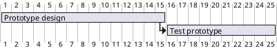

```java
@startgantt
[Prototype design] lasts 10 days
[Code prototype] lasts 10 days
[Write tests] lasts 5 days
[Code prototype] starts at [Prototype design]'s end
[Write tests] starts at [Code prototype]'s start
@endgantt
```
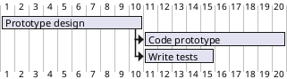

### Short names

It is possible to define short name for tasks with the `as` keyword.

```java
@startgantt
[Prototype design] as [D] lasts 15 days
[Test prototype] as [T] lasts 10 days
[T] starts at [D]'s end
@endgantt
```


### Customize colors

It is also possible to customize [colors](https://plantuml.com/color) with `is colored in`.

```java
@startgantt
[Prototype design] lasts 13 days
[Test prototype] lasts 4 days
[Test prototype] starts at [Prototype design]'s end
[Prototype design] is colored in Fuchsia/FireBrick
[Test prototype] is colored in GreenYellow/Green
@endgantt
```
```plantuml
@startgantt
[Prototype design] lasts 13 days
[Test prototype] lasts 4 days
[Test prototype] starts at [Prototype design]'s end
[Prototype design] is colored in Fuchsia/FireBrick
[Test prototype] is colored in GreenYellow/Green
@endgantt
```

### Completion status

#### Adding completion depending percentage

You can set the completion status of a task, by the command:
* `is xx% completed`
* `is xx% complete`

```java
@startgantt
[foo] lasts 21 days
[foo] is 40% completed
[bar] lasts 30 days and is 10% complete
@endgantt
```

#### Change colour of completion (by style)
```java
@startgantt

<style>
ganttDiagram {
  task {
    BackGroundColor GreenYellow
    LineColor Green 
    unstarted {
      BackGroundColor Fuchsia 
      LineColor FireBrick
    }
  }
}
</style>

[Prototype design] lasts 7 days
[Test prototype 0] lasts 4 days
[Test prototype 10] lasts 4 days
[Test prototype 20] lasts 4 days
[Test prototype 30] lasts 4 days
[Test prototype 40] lasts 4 days
[Test prototype 50] lasts 4 days
[Test prototype 60] lasts 4 days
[Test prototype 70] lasts 4 days
[Test prototype 80] lasts 4 days
[Test prototype 90] lasts 4 days
[Test prototype 100] lasts 4 days

[Test prototype 0] starts at [Prototype design]'s end
[Test prototype 10] starts at [Prototype design]'s end
[Test prototype 20] starts at [Prototype design]'s end
[Test prototype 30] starts at [Prototype design]'s end
[Test prototype 40] starts at [Prototype design]'s end
[Test prototype 50] starts at [Prototype design]'s end
[Test prototype 60] starts at [Prototype design]'s end
[Test prototype 70] starts at [Prototype design]'s end
[Test prototype 80] starts at [Prototype design]'s end
[Test prototype 90] starts at [Prototype design]'s end
[Test prototype 100] starts at [Prototype design]'s end

[Test prototype 0] is 0% complete
[Test prototype 10] is 10% complete
[Test prototype 20] is 20% complete
[Test prototype 30] is 30% complete
[Test prototype 40] is 40% complete
[Test prototype 50] is 50% complete
[Test prototype 60] is 60% complete
[Test prototype 70] is 70% complete
[Test prototype 80] is 80% complete
[Test prototype 90] is 90% complete
[Test prototype 100] is 100% complete

@endgantt
```
```plantuml
@startgantt

<style>
ganttDiagram {
  task {
    BackGroundColor GreenYellow
    LineColor Green 
    unstarted {
      BackGroundColor Fuchsia 
      LineColor FireBrick
    }
  }
}
</style>

[Prototype design] lasts 7 days
[Test prototype 0] lasts 4 days
[Test prototype 10] lasts 4 days
[Test prototype 20] lasts 4 days
[Test prototype 30] lasts 4 days
[Test prototype 40] lasts 4 days
[Test prototype 50] lasts 4 days
[Test prototype 60] lasts 4 days
[Test prototype 70] lasts 4 days
[Test prototype 80] lasts 4 days
[Test prototype 90] lasts 4 days
[Test prototype 100] lasts 4 days

[Test prototype 0] starts at [Prototype design]'s end
[Test prototype 10] starts at [Prototype design]'s end
[Test prototype 20] starts at [Prototype design]'s end
[Test prototype 30] starts at [Prototype design]'s end
[Test prototype 40] starts at [Prototype design]'s end
[Test prototype 50] starts at [Prototype design]'s end
[Test prototype 60] starts at [Prototype design]'s end
[Test prototype 70] starts at [Prototype design]'s end
[Test prototype 80] starts at [Prototype design]'s end
[Test prototype 90] starts at [Prototype design]'s end
[Test prototype 100] starts at [Prototype design]'s end

[Test prototype 0] is 0% complete
[Test prototype 10] is 10% complete
[Test prototype 20] is 20% complete
[Test prototype 30] is 30% complete
[Test prototype 40] is 40% complete
[Test prototype 50] is 50% complete
[Test prototype 60] is 60% complete
[Test prototype 70] is 70% complete
[Test prototype 80] is 80% complete
[Test prototype 90] is 90% complete
[Test prototype 100] is 100% complete

@endgantt
```

### Milestone
You can define Milestones using the `happen` verb.

#### Relative milestone (use of constraints)

```java
@startgantt
[Test prototype] lasts 10 days
[Prototype completed] happens at [Test prototype]'s end
[Setup assembly line] lasts 12 days
[Setup assembly line] starts at [Test prototype]'s end
@endgantt
```
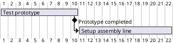

#### Absolute milestone (use of fixed date)
```java
@startgantt
Project starts 2020-07-01
[Test prototype] lasts 10 days
[Prototype completed] happens 2020-07-10
[Setup assembly line] lasts 12 days
[Setup assembly line] starts at [Test prototype]'s end
@endgantt
```
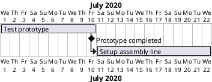

#### Milestone of maximum end of tasks
```java
@startgantt
[Task1] lasts 4 days
then [Task1.1] lasts 4 days
[Task1.2] starts at [Task1]'s end and lasts 7 days

[Task2] lasts 5 days
then [Task2.1] lasts 4 days

[MaxTaskEnd] happens at [Task1.1]'s end
[MaxTaskEnd] happens at [Task1.2]'s end
[MaxTaskEnd] happens at [Task2.1]'s end

@endgantt
```
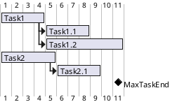

### Hyperlinks

You can add hyperlinks to tasks.

```java
@startgantt
[task1] lasts 10 days
[task1] links to [[http://plantuml.com]]
@endgantt
```
```plantuml
@startgantt
[task1] lasts 10 days
[task1] links to [[http://plantuml.com]]
@endgantt
```

### Calendar

You can specify a starting date for the whole project. By default, the first task starts at this date.

```java
@startgantt
Project starts the 20th of september 2017
[Prototype design] as [TASK1] lasts 13 days
[TASK1] is colored in Lavender/LightBlue
@endgantt
```
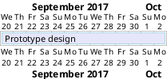

### Coloring days

It is possible to add [colors](https://plantuml.com/color) to some days.

```java
@startgantt
Project starts the 2020/09/01 

2020/09/07 is colored in salmon
2020/09/13 to 2020/09/16 are colored in lightblue

[Prototype design] as [TASK1] lasts 22 days
[TASK1] is colored in Lavender/LightBlue
[Prototype completed] happens at [TASK1]'s end
@endgantt
```
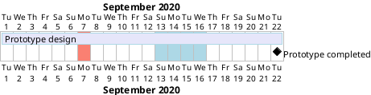

### Changing scale

You can change scale for very long project, with one of those parameters:
* printscale
* ganttscale
* projectscale

and one of the values:
* daily (by default)
* weekly
* monthly
* quarterly
* yearly

#### Daily (by default)
```java
@startuml
saturday are closed
sunday are closed

Project starts the 1st of january 2021
[Prototype design end] as [TASK1] lasts 19 days
[TASK1] is colored in Lavender/LightBlue
[Testing] lasts 14 days
[TASK1]->[Testing]

2021-01-18 to 2021-01-22 are named [End's committee]
2021-01-18 to 2021-01-22 are colored in salmon 
@enduml
```
```plantuml
@startuml
saturday are closed
sunday are closed

Project starts the 1st of january 2021
[Prototype design end] as [TASK1] lasts 19 days
[TASK1] is colored in Lavender/LightBlue
[Testing] lasts 14 days
[TASK1]->[Testing]

2021-01-18 to 2021-01-22 are named [End's committee]
2021-01-18 to 2021-01-22 are colored in salmon 
@enduml
```

#### Weekly
```java
@startuml
printscale weekly
saturday are closed
sunday are closed

Project starts the 1st of january 2021
[Prototype design end] as [TASK1] lasts 19 days
[TASK1] is colored in Lavender/LightBlue
[Testing] lasts 14 days
[TASK1]->[Testing]

2021-01-18 to 2021-01-22 are named [End's committee]
2021-01-18 to 2021-01-22 are colored in salmon 
@enduml
```
```plantuml
@startuml
printscale weekly
saturday are closed
sunday are closed

Project starts the 1st of january 2021
[Prototype design end] as [TASK1] lasts 19 days
[TASK1] is colored in Lavender/LightBlue
[Testing] lasts 14 days
[TASK1]->[Testing]

2021-01-18 to 2021-01-22 are named [End's committee]
2021-01-18 to 2021-01-22 are colored in salmon 
@enduml
```

```java
@startgantt
printscale weekly
Project starts the 20th of september 2020
[Prototype design] as [TASK1] lasts 130 days
[TASK1] is colored in Lavender/LightBlue
[Testing] lasts 20 days
[TASK1]->[Testing]

2021-01-18 to 2021-01-22 are named [End's committee]
2021-01-18 to 2021-01-22 are colored in salmon 
@endgantt
```
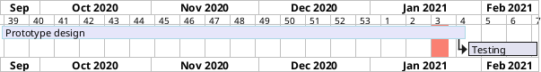

### Monthly
```java
@startgantt
projectscale monthly
Project starts the 20th of september 2020
[Prototype design] as [TASK1] lasts 130 days
[TASK1] is colored in Lavender/LightBlue
[Testing] lasts 20 days
[TASK1]->[Testing]

2021-01-18 to 2021-01-22 are named [End's committee]
2021-01-18 to 2021-01-22 are colored in salmon 
@endgantt
```
```plantuml
@startgantt
projectscale monthly
Project starts the 20th of september 2020
[Prototype design] as [TASK1] lasts 130 days
[TASK1] is colored in Lavender/LightBlue
[Testing] lasts 20 days
[TASK1]->[Testing]

2021-01-18 to 2021-01-22 are named [End's committee]
2021-01-18 to 2021-01-22 are colored in salmon 
@endgantt
```

#### Quarterly
```java
@startgantt
projectscale quarterly
Project starts the 20th of september 2020
[Prototype design] as [TASK1] lasts 130 days
[TASK1] is colored in Lavender/LightBlue
[Testing] lasts 20 days
[TASK1]->[Testing]

2021-01-18 to 2021-01-22 are named [End's committee]
2021-01-18 to 2021-01-22 are colored in salmon 
@endgantt
```
```plantuml
@startgantt
projectscale quarterly
Project starts the 20th of september 2020
[Prototype design] as [TASK1] lasts 130 days
[TASK1] is colored in Lavender/LightBlue
[Testing] lasts 20 days
[TASK1]->[Testing]

2021-01-18 to 2021-01-22 are named [End's committee]
2021-01-18 to 2021-01-22 are colored in salmon 
@endgantt
```

```java
@startgantt
projectscale quarterly
Project starts the 1st of october 2020
[Prototype design] as [TASK1] lasts 700 days
[TASK1] is colored in Lavender/LightBlue
[Testing] lasts 200 days
[TASK1]->[Testing]

2021-01-18 to 2021-03-22 are colored in salmon 
@endgantt
```
```plantuml
@startgantt
projectscale quarterly
Project starts the 1st of october 2020
[Prototype design] as [TASK1] lasts 700 days
[TASK1] is colored in Lavender/LightBlue
[Testing] lasts 200 days
[TASK1]->[Testing]

2021-01-18 to 2021-03-22 are colored in salmon 
@endgantt
```

### Yearly
```java
@startgantt
projectscale yearly
Project starts the 1st of october 2020
[Prototype design] as [TASK1] lasts 700 days
[TASK1] is colored in Lavender/LightBlue
[Testing] lasts 200 days
[TASK1]->[Testing]

2021-01-18 to 2021-03-22 are colored in salmon 
@endgantt
```
```plantuml
@startgantt
projectscale yearly
Project starts the 1st of october 2020
[Prototype design] as [TASK1] lasts 700 days
[TASK1] is colored in Lavender/LightBlue
[Testing] lasts 200 days
[TASK1]->[Testing]

2021-01-18 to 2021-03-22 are colored in salmon 
@endgantt
```

### Zoom (example for all scale)

You can change zoom, with the parameter:
* `zoom <integer>`

#### Zoom on weekly scale

##### Without zoom
```java
@startuml
printscale daily
saturday are closed
sunday are closed

Project starts the 1st of january 2021
[Prototype design end] as [TASK1] lasts 8 days
[TASK1] is colored in Lavender/LightBlue
[Testing] lasts 3 days
[TASK1]->[Testing]

2021-01-18 to 2021-01-22 are named [End's committee]
2021-01-18 to 2021-01-22 are colored in salmon 
@enduml
```
```plantuml
@startuml
printscale daily
saturday are closed
sunday are closed

Project starts the 1st of january 2021
[Prototype design end] as [TASK1] lasts 8 days
[TASK1] is colored in Lavender/LightBlue
[Testing] lasts 3 days
[TASK1]->[Testing]

2021-01-18 to 2021-01-22 are named [End's committee]
2021-01-18 to 2021-01-22 are colored in salmon 
@enduml
```

##### With zoom
```java
@startuml
printscale daily zoom 2
saturday are closed
sunday are closed

Project starts the 1st of january 2021
[Prototype design end] as [TASK1] lasts 8 days
[TASK1] is colored in Lavender/LightBlue
[Testing] lasts 3 days
[TASK1]->[Testing]

2021-01-18 to 2021-01-22 are named [End's committee]
2021-01-18 to 2021-01-22 are colored in salmon 
@enduml
```
```plantuml
@startuml
printscale daily zoom 2
saturday are closed
sunday are closed

Project starts the 1st of january 2021
[Prototype design end] as [TASK1] lasts 8 days
[TASK1] is colored in Lavender/LightBlue
[Testing] lasts 3 days
[TASK1]->[Testing]

2021-01-18 to 2021-01-22 are named [End's committee]
2021-01-18 to 2021-01-22 are colored in salmon 
@enduml
```

#### Zoom on weekly scale

##### Without zoom
```java
@startuml
printscale weekly
saturday are closed
sunday are closed

Project starts the 1st of january 2021
[Prototype design end] as [TASK1] lasts 19 days
[TASK1] is colored in Lavender/LightBlue
[Testing] lasts 14 days
[TASK1]->[Testing]

2021-01-18 to 2021-01-22 are named [End's committee]
2021-01-18 to 2021-01-22 are colored in salmon 
@enduml
```
```plantuml
@startuml
printscale weekly
saturday are closed
sunday are closed

Project starts the 1st of january 2021
[Prototype design end] as [TASK1] lasts 19 days
[TASK1] is colored in Lavender/LightBlue
[Testing] lasts 14 days
[TASK1]->[Testing]

2021-01-18 to 2021-01-22 are named [End's committee]
2021-01-18 to 2021-01-22 are colored in salmon 
@enduml
```

##### With zoom
```java
@startuml
printscale weekly zoom 4
saturday are closed
sunday are closed

Project starts the 1st of january 2021
[Prototype design end] as [TASK1] lasts 19 days
[TASK1] is colored in Lavender/LightBlue
[Testing] lasts 14 days
[TASK1]->[Testing]

2021-01-18 to 2021-01-22 are named [End's committee]
2021-01-18 to 2021-01-22 are colored in salmon 
@enduml
```
```plantuml
@startuml
printscale weekly zoom 4
saturday are closed
sunday are closed

Project starts the 1st of january 2021
[Prototype design end] as [TASK1] lasts 19 days
[TASK1] is colored in Lavender/LightBlue
[Testing] lasts 14 days
[TASK1]->[Testing]

2021-01-18 to 2021-01-22 are named [End's committee]
2021-01-18 to 2021-01-22 are colored in salmon 
@enduml
```

#### Zoom on monthly scale

##### Without zoom
```java
@startgantt
projectscale monthly
Project starts the 20th of september 2020
[Prototype design] as [TASK1] lasts 130 days
[TASK1] is colored in Lavender/LightBlue
[Testing] lasts 20 days
[TASK1]->[Testing]

2021-01-18 to 2021-01-22 are named [End's committee]
2021-01-18 to 2021-01-22 are colored in salmon 
@endgantt
```
```plantuml
@startgantt
projectscale monthly
Project starts the 20th of september 2020
[Prototype design] as [TASK1] lasts 130 days
[TASK1] is colored in Lavender/LightBlue
[Testing] lasts 20 days
[TASK1]->[Testing]

2021-01-18 to 2021-01-22 are named [End's committee]
2021-01-18 to 2021-01-22 are colored in salmon 
@endgantt
```

##### With zoom
```java
@startgantt
projectscale monthly zoom 3
Project starts the 20th of september 2020
[Prototype design] as [TASK1] lasts 130 days
[TASK1] is colored in Lavender/LightBlue
[Testing] lasts 20 days
[TASK1]->[Testing]

2021-01-18 to 2021-01-22 are named [End's committee]
2021-01-18 to 2021-01-22 are colored in salmon 
@endgantt
```
```plantuml
@startgantt
projectscale monthly zoom 3
Project starts the 20th of september 2020
[Prototype design] as [TASK1] lasts 130 days
[TASK1] is colored in Lavender/LightBlue
[Testing] lasts 20 days
[TASK1]->[Testing]

2021-01-18 to 2021-01-22 are named [End's committee]
2021-01-18 to 2021-01-22 are colored in salmon 
@endgantt
```

#### Zoom on quarterly scale

##### Without zoom
```java
@startgantt
projectscale quarterly
Project starts the 20th of september 2020
[Prototype design] as [TASK1] lasts 130 days
[TASK1] is colored in Lavender/LightBlue
[Testing] lasts 20 days
[TASK1]->[Testing]

2021-01-18 to 2021-01-22 are named [End's committee]
2021-01-18 to 2021-01-22 are colored in salmon 
@endgantt
```
```plantuml
@startgantt
projectscale quarterly
Project starts the 20th of september 2020
[Prototype design] as [TASK1] lasts 130 days
[TASK1] is colored in Lavender/LightBlue
[Testing] lasts 20 days
[TASK1]->[Testing]

2021-01-18 to 2021-01-22 are named [End's committee]
2021-01-18 to 2021-01-22 are colored in salmon 
@endgantt
```

##### With zoom
```java
@startgantt
projectscale quarterly zoom 7
Project starts the 20th of september 2020
[Prototype design] as [TASK1] lasts 130 days
[TASK1] is colored in Lavender/LightBlue
[Testing] lasts 20 days
[TASK1]->[Testing]

2021-01-18 to 2021-01-22 are named [End's committee]
2021-01-18 to 2021-01-22 are colored in salmon 
@endgantt
```
```plantuml
@startgantt
projectscale quarterly zoom 7
Project starts the 20th of september 2020
[Prototype design] as [TASK1] lasts 130 days
[TASK1] is colored in Lavender/LightBlue
[Testing] lasts 20 days
[TASK1]->[Testing]

2021-01-18 to 2021-01-22 are named [End's committee]
2021-01-18 to 2021-01-22 are colored in salmon 
@endgantt
```

#### Zoom on yearly scale

##### Without zoom
```java
@startgantt
projectscale yearly
Project starts the 1st of october 2020
[Prototype design] as [TASK1] lasts 700 days
[TASK1] is colored in Lavender/LightBlue
[Testing] lasts 200 days
[TASK1]->[Testing]

2021-01-18 to 2021-03-22 are colored in salmon 
@endgantt
```
```plantuml
@startgantt
projectscale yearly
Project starts the 1st of october 2020
[Prototype design] as [TASK1] lasts 700 days
[TASK1] is colored in Lavender/LightBlue
[Testing] lasts 200 days
[TASK1]->[Testing]

2021-01-18 to 2021-03-22 are colored in salmon 
@endgantt
```

##### With zoom
```java
@startgantt
projectscale yearly zoom 2
Project starts the 1st of october 2020
[Prototype design] as [TASK1] lasts 700 days
[TASK1] is colored in Lavender/LightBlue
[Testing] lasts 200 days
[TASK1]->[Testing]

2021-01-18 to 2021-03-22 are colored in salmon 
@endgantt
```
```plantuml
@startgantt
projectscale yearly zoom 2
Project starts the 1st of october 2020
[Prototype design] as [TASK1] lasts 700 days
[TASK1] is colored in Lavender/LightBlue
[Testing] lasts 200 days
[TASK1]->[Testing]

2021-01-18 to 2021-03-22 are colored in salmon 
@endgantt
```

### Close day

It is possible to close some day.

```java
@startgantt
project starts the 2018/04/09
saturday are closed
sunday are closed
2018/05/01 is closed
2018/04/17 to 2018/04/19 is closed
[Prototype design] lasts 14 days
[Test prototype] lasts 4 days
[Test prototype] starts at [Prototype design]'s end
[Prototype design] is colored in Fuchsia/FireBrick
[Test prototype] is colored in GreenYellow/Green
@endgantt
```
```plantuml
@startgantt
project starts the 2018/04/09
saturday are closed
sunday are closed
2018/05/01 is closed
2018/04/17 to 2018/04/19 is closed
[Prototype design] lasts 14 days
[Test prototype] lasts 4 days
[Test prototype] starts at [Prototype design]'s end
[Prototype design] is colored in Fuchsia/FireBrick
[Test prototype] is colored in GreenYellow/Green
@endgantt
```

Then it is possible to open some closed day.

```java
@startgantt
2020-07-07 to 2020-07-17 is closed
2020-07-13 is open

Project starts the 2020-07-01
[Prototype design] lasts 10 days
Then [Test prototype] lasts 10 days
@endgantt
```
```plantuml
@startgantt
2020-07-07 to 2020-07-17 is closed
2020-07-13 is open

Project starts the 2020-07-01
[Prototype design] lasts 10 days
Then [Test prototype] lasts 10 days
@endgantt
```

### Definition of a week depending of closed days

A **week** is a synonym for how many non-closed days are in a week, as:

```java
@startgantt
Project starts 2021-03-29
[Review 01] happens at 2021-03-29
[Review 02 - 3 weeks] happens on 3 weeks after [Review 01]'s end
[Review 02 - 21 days] happens on 21 days after [Review 01]'s end
@endgantt
```
```plantuml
@startgantt
Project starts 2021-03-29
[Review 01] happens at 2021-03-29
[Review 02 - 3 weeks] happens on 3 weeks after [Review 01]'s end
[Review 02 - 21 days] happens on 21 days after [Review 01]'s end
@endgantt
```

So if you specify *Saturday* and *Sunday* as closed, a **week** will be equivalent to 5 days, as:

```java
@startgantt
Project starts 2021-03-29
saturday are closed
sunday are closed
[Review 01] happens at 2021-03-29
[Review 02 - 3 weeks] happens on 3 weeks after [Review 01]'s end
[Review 02 - 21 days] happens on 21 days after [Review 01]'s end
@endgantt
```
```plantuml
@startgantt
Project starts 2021-03-29
saturday are closed
sunday are closed
[Review 01] happens at 2021-03-29
[Review 02 - 3 weeks] happens on 3 weeks after [Review 01]'s end
[Review 02 - 21 days] happens on 21 days after [Review 01]'s end
@endgantt
```

### Simplified task succession

It's possible to use the `then` keyword to denote consecutive tasks.

```java
@startgantt
[Prototype design] lasts 14 days
then [Test prototype] lasts 4 days
then [Deploy prototype] lasts 6 days
@endgantt
```
```plantuml
@startgantt
[Prototype design] lasts 14 days
then [Test prototype] lasts 4 days
then [Deploy prototype] lasts 6 days
@endgantt
```

You can also use arrow `->`

```java
@startgantt
[Prototype design] lasts 14 days
[Build prototype] lasts 4 days
[Prepare test] lasts 6 days
[Prototype design] -> [Build prototype]
[Prototype design] -> [Prepare test]
@endgantt
```
```plantuml
@startgantt
[Prototype design] lasts 14 days
[Build prototype] lasts 4 days
[Prepare test] lasts 6 days
[Prototype design] -> [Build prototype]
[Prototype design] -> [Prepare test]
@endgantt
```

### Working with resources

You can affect tasks on resources using the `on` keyword and brackets for resource name.

```java
@startgantt
[Task1] on {Alice} lasts 10 days
[Task2] on {Bob:50%} lasts 2 days
then [Task3] on {Alice:25%} lasts 1 days
@endgantt
```
```plantuml
@startgantt
[Task1] on {Alice} lasts 10 days
[Task2] on {Bob:50%} lasts 2 days
then [Task3] on {Alice:25%} lasts 1 days
@endgantt
```

Multiple resources can be assigned to a task:

```java
@startgantt
[Task1] on {Alice} {Bob} lasts 20 days
@endgantt
```
```plantuml
@startgantt
[Task1] on {Alice} {Bob} lasts 20 days
@endgantt
```

Resources can be marked as off on specific days:

```java
@startgantt
project starts on 2020-06-19
[Task1] on {Alice} lasts 10 days
{Alice} is off on 2020-06-24 to 2020-06-26
@endgantt
```
```plantuml
@startgantt
project starts on 2020-06-19
[Task1] on {Alice} lasts 10 days
{Alice} is off on 2020-06-24 to 2020-06-26
@endgantt
```

### Hide resources

#### Without any hiding (by default)

```java
@startgantt
[Task1] on {Alice} lasts 10 days
[Task2] on {Bob:50%} lasts 2 days
then [Task3] on {Alice:25%} lasts 1 days
then [Task4] on {Alice:25%} {Bob} lasts 1 days
@endgantt
```
```plantuml
@startgantt
[Task1] on {Alice} lasts 10 days
[Task2] on {Bob:50%} lasts 2 days
then [Task3] on {Alice:25%} lasts 1 days
then [Task4] on {Alice:25%} {Bob} lasts 1 days
@endgantt
```

#### Hide resources names

You can hide ressources names and percentage, on tasks, using the `hide ressources names` keywords.

```java
@startgantt
hide ressources names
[Task1] on {Alice} lasts 10 days
[Task2] on {Bob:50%} lasts 2 days
then [Task3] on {Alice:25%} lasts 1 days
then [Task4] on {Alice:25%} {Bob} lasts 1 days
@endgantt
```
```plantuml
@startgantt
hide ressources names
[Task1] on {Alice} lasts 10 days
[Task2] on {Bob:50%} lasts 2 days
then [Task3] on {Alice:25%} lasts 1 days
then [Task4] on {Alice:25%} {Bob} lasts 1 days
@endgantt
```

#### Hide resources footbox

You can also hide ressources names on bottom of the diagram using the `hide ressources footbox` keywords.

```java
@startgantt
hide ressources footbox
[Task1] on {Alice} lasts 10 days
[Task2] on {Bob:50%} lasts 2 days
then [Task3] on {Alice:25%} lasts 1 days
then [Task4] on {Alice:25%} {Bob} lasts 1 days
@endgantt
```
```plantuml
@startgantt
hide ressources footbox
[Task1] on {Alice} lasts 10 days
[Task2] on {Bob:50%} lasts 2 days
then [Task3] on {Alice:25%} lasts 1 days
then [Task4] on {Alice:25%} {Bob} lasts 1 days
@endgantt
```

#### Hide the both (resources names and resources footbox)

You can also hide the both.

```java
@startgantt
hide ressources names
hide ressources footbox
[Task1] on {Alice} lasts 10 days
[Task2] on {Bob:50%} lasts 2 days
then [Task3] on {Alice:25%} lasts 1 days
then [Task4] on {Alice:25%} {Bob} lasts 1 days
@endgantt
```
```plantuml
@startgantt
hide ressources names
hide ressources footbox
[Task1] on {Alice} lasts 10 days
[Task2] on {Bob:50%} lasts 2 days
then [Task3] on {Alice:25%} lasts 1 days
then [Task4] on {Alice:25%} {Bob} lasts 1 days
@endgantt
```

### Separator

You can use `--` to separate sets of tasks.

```java
@startgantt
[Task1] lasts 10 days
then [Task2] lasts 4 days
-- Phase Two --
then [Task3] lasts 5 days
then [Task4] lasts 6 days
@endgantt
```
```plantuml
@startgantt
[Task1] lasts 10 days
then [Task2] lasts 4 days
-- Phase Two --
then [Task3] lasts 5 days
then [Task4] lasts 6 days
@endgantt
```

### Complex example

It also possible to use the `and` conjunction.
You can also add delays in constraints.

```java
@startgantt
[Prototype design] lasts 13 days and is colored in Lavender/LightBlue
[Test prototype] lasts 9 days and is colored in Coral/Green and starts 3 days after [Prototype design]'s end
[Write tests] lasts 5 days and ends at [Prototype design]'s end
[Hire tests writers] lasts 6 days and ends at [Write tests]'s start
[Init and write tests report] is colored in Coral/Green
[Init and write tests report] starts 1 day before [Test prototype]'s start and ends at [Test prototype]'s end
@endgantt
```
```plantuml
@startgantt
[Prototype design] lasts 13 days and is colored in Lavender/LightBlue
[Test prototype] lasts 9 days and is colored in Coral/Green and starts 3 days after [Prototype design]'s end
[Write tests] lasts 5 days and ends at [Prototype design]'s end
[Hire tests writers] lasts 6 days and ends at [Write tests]'s start
[Init and write tests report] is colored in Coral/Green
[Init and write tests report] starts 1 day before [Test prototype]'s start and ends at [Test prototype]'s end
@endgantt
```

### Comments

As is mentioned on [Common Commands page](https://plantuml.com/commons#560kta2oz3a2k362kjbm):
    
    Everything that starts with simple quote ' is a comment.
    You can also put comments on several lines using /' to start and '/ to end.
*(i.e.: the first character (except space character) of a comment line must be a simple quote ')*

```java
@startgantt
' This is a comment

[T1] lasts 3 days

/' this comment
is on several lines '/

[T2] starts at [T1]'s end and lasts 1 day
@endgantt
```
```plantuml
@startgantt
' This is a comment

[T1] lasts 3 days

/' this comment
is on several lines '/

[T2] starts at [T1]'s end and lasts 1 day
@endgantt
```

### Using style

#### Without style (by default)
```java
@startuml
[Task1] lasts 20 days
note bottom
  memo1 ...
  memo2 ...
  explanations1 ...
  explanations2 ...
end note
[Task2] lasts 4 days
[Task1] -> [Task2]
-- Separator title --
[M1] happens on 5 days after [Task1]'s end
-- end --
@enduml
```
```plantuml
@startuml
[Task1] lasts 20 days
note bottom
  memo1 ...
  memo2 ...
  explanations1 ...
  explanations2 ...
end note
[Task2] lasts 4 days
[Task1] -> [Task2]
-- Separator title --
[M1] happens on 5 days after [Task1]'s end
-- end --
@enduml
```

#### With style

You can use [style](https://plantuml.com/style-evolution) to change rendering of elements.

```java
@startuml
<style>
ganttDiagram {
	task {
		FontName Helvetica
		FontColor red
		FontSize 18
		FontStyle bold
		BackGroundColor GreenYellow
		LineColor blue
	}
	milestone {
		FontColor blue
		FontSize 25
		FontStyle italic
		BackGroundColor yellow
		LineColor red
	}
	note {
		FontColor DarkGreen
		FontSize 10
		LineColor OrangeRed
	}
	arrow {
		FontName Helvetica
		FontColor red
		FontSize 18
		FontStyle bold
		BackGroundColor GreenYellow
		LineColor blue
	}
	separator {
		LineColor red
		BackGroundColor green
		FontSize 16
		FontStyle bold
		FontColor purple
	}
}
</style>
[Task1] lasts 20 days
note bottom
  memo1 ...
  memo2 ...
  explanations1 ...
  explanations2 ...
end note
[Task2] lasts 4 days
[Task1] -> [Task2]
-- Separator title --
[M1] happens on 5 days after [Task1]'s end
-- end --
@enduml
```
```plantuml
@startuml
<style>
ganttDiagram {
	task {
		FontName Helvetica
		FontColor red
		FontSize 18
		FontStyle bold
		BackGroundColor GreenYellow
		LineColor blue
	}
	milestone {
		FontColor blue
		FontSize 25
		FontStyle italic
		BackGroundColor yellow
		LineColor red
	}
	note {
		FontColor DarkGreen
		FontSize 10
		LineColor OrangeRed
	}
	arrow {
		FontName Helvetica
		FontColor red
		FontSize 18
		FontStyle bold
		BackGroundColor GreenYellow
		LineColor blue
	}
	separator {
		LineColor red
		BackGroundColor green
		FontSize 16
		FontStyle bold
		FontColor purple
	}
}
</style>
[Task1] lasts 20 days
note bottom
  memo1 ...
  memo2 ...
  explanations1 ...
  explanations2 ...
end note
[Task2] lasts 4 days
[Task1] -> [Task2]
-- Separator title --
[M1] happens on 5 days after [Task1]'s end
-- end --
@enduml
```

#### With style (full example)

```java
@startgantt
<style>
ganttDiagram {
	task {
		FontName Helvetica
		FontColor red
		FontSize 18
		FontStyle bold
		BackGroundColor GreenYellow
		LineColor blue
	}
	milestone {
		FontColor blue
		FontSize 25
		FontStyle italic
		BackGroundColor yellow
		LineColor red
	}
	note {
		FontColor DarkGreen
		FontSize 10
		LineColor OrangeRed
	}
	arrow {
		FontName Helvetica
		FontColor red
		FontSize 18
		FontStyle bold
		BackGroundColor GreenYellow
		LineColor blue
		LineStyle 8.0;13.0
		LineThickness 3.0
	}
	separator {
		BackgroundColor lightGreen
		LineStyle 8.0;3.0
		LineColor red
		LineThickness 1.0
		FontSize 16
		FontStyle bold
		FontColor purple
		Margin 5
		Padding 20
	}
	timeline {
	    BackgroundColor Bisque
	}
	closed {
		BackgroundColor pink
		FontColor red
	}
}
</style>
Project starts the 2020-12-01

[Task1] lasts 10 days
sunday are closed

note bottom
  memo1 ...
  memo2 ...
  explanations1 ...
  explanations2 ...
end note

[Task2] lasts 20 days
[Task2] starts 10 days after [Task1]'s end
-- Separator title --
[M1] happens on 5 days after [Task1]'s end

<style>
	separator {
	    LineColor black
		Margin 0
		Padding 0
	}
</style>

-- end --
@endgantt
```
```plantuml
@startgantt
<style>
ganttDiagram {
	task {
		FontName Helvetica
		FontColor red
		FontSize 18
		FontStyle bold
		BackGroundColor GreenYellow
		LineColor blue
	}
	milestone {
		FontColor blue
		FontSize 25
		FontStyle italic
		BackGroundColor yellow
		LineColor red
	}
	note {
		FontColor DarkGreen
		FontSize 10
		LineColor OrangeRed
	}
	arrow {
		FontName Helvetica
		FontColor red
		FontSize 18
		FontStyle bold
		BackGroundColor GreenYellow
		LineColor blue
		LineStyle 8.0;13.0
		LineThickness 3.0
	}
	separator {
		BackgroundColor lightGreen
		LineStyle 8.0;3.0
		LineColor red
		LineThickness 1.0
		FontSize 16
		FontStyle bold
		FontColor purple
		Margin 5
		Padding 20
	}
	timeline {
	    BackgroundColor Bisque
	}
	closed {
		BackgroundColor pink
		FontColor red
	}
}
</style>
Project starts the 2020-12-01

[Task1] lasts 10 days
sunday are closed

note bottom
  memo1 ...
  memo2 ...
  explanations1 ...
  explanations2 ...
end note

[Task2] lasts 20 days
[Task2] starts 10 days after [Task1]'s end
-- Separator title --
[M1] happens on 5 days after [Task1]'s end

<style>
	separator {
	    LineColor black
		Margin 0
		Padding 0
	}
</style>

-- end --
@endgantt
```

#### Clean style

With style, you can also clean a Gantt diagram *(showing tasks, dependencies and relative durations only - but no actual start date and no actual scale)*:
```java
@startgantt
<style>
ganttDiagram {
  timeline {
    LineColor transparent
    FontColor transparent
 }
}
</style>

hide footbox
[Test prototype] lasts 7 days
[Prototype completed] happens at [Test prototype]'s end
[Setup assembly line] lasts 9 days
[Setup assembly line] starts at [Test prototype]'s end
then [Setup] lasts 5 days
[T2] lasts 2 days and starts at [Test prototype]'s end
then [T3] lasts 3 days
-- end task --
then [T4] lasts 2 days
@endgantt
```
```plantuml
@startgantt
<style>
ganttDiagram {
  timeline {
    LineColor transparent
    FontColor transparent
 }
}
</style>

hide footbox
[Test prototype] lasts 7 days
[Prototype completed] happens at [Test prototype]'s end
[Setup assembly line] lasts 9 days
[Setup assembly line] starts at [Test prototype]'s end
then [Setup] lasts 5 days
[T2] lasts 2 days and starts at [Test prototype]'s end
then [T3] lasts 3 days
-- end task --
then [T4] lasts 2 days
@endgantt
```

Or:

```java
@startgantt
<style>
ganttDiagram {
  timeline {
    LineColor transparent
    FontColor transparent
  }
  closed {
    FontColor transparent
  }
}
</style>

hide footbox
project starts the 2018/04/09
saturday are closed
sunday are closed
2018/05/01 is closed
2018/04/17 to 2018/04/19 is closed
[Prototype design] lasts 9 days
[Test prototype] lasts 5 days
[Test prototype] starts at [Prototype design]'s end
[Prototype design] is colored in Fuchsia/FireBrick
[Test prototype] is colored in GreenYellow/Green
@endgantt
```
```plantuml
@startgantt
<style>
ganttDiagram {
  timeline {
    LineColor transparent
    FontColor transparent
  }
  closed {
    FontColor transparent
  }
}
</style>

hide footbox
project starts the 2018/04/09
saturday are closed
sunday are closed
2018/05/01 is closed
2018/04/17 to 2018/04/19 is closed
[Prototype design] lasts 9 days
[Test prototype] lasts 5 days
[Test prototype] starts at [Prototype design]'s end
[Prototype design] is colored in Fuchsia/FireBrick
[Test prototype] is colored in GreenYellow/Green
@endgantt
```

### Add notes
```java
@startgantt
[task01] lasts 15 days
note bottom
  memo1 ...
  memo2 ...
  explanations1 ...
  explanations2 ...
end note

[task01] -> [task02]

@endgantt
```
```plantuml
@startgantt
[task01] lasts 15 days
note bottom
  memo1 ...
  memo2 ...
  explanations1 ...
  explanations2 ...
end note

[task01] -> [task02]

@endgantt
```

Example with overlap.
```java
@startgantt
[task01] lasts 15 days
note bottom
  memo1 ...
  memo2 ...
  explanations1 ...
  explanations2 ...
end note

[task01] -> [task02]
[task03] lasts 5 days

@endgantt
```
```plantuml@startgantt
[task01] lasts 15 days
note bottom
  memo1 ...
  memo2 ...
  explanations1 ...
  explanations2 ...
end note

[task01] -> [task02]
[task03] lasts 5 days

@endgantt
```

```java
@startgantt

-- test01 --

[task01] lasts 4 days
note bottom
'note left
memo1 ...
memo2 ...
explanations1 ...
explanations2 ...
end note

[task02] lasts 8 days
[task01] -> [task02]
note bottom
'note left
memo1 ...
memo2 ...
explanations1 ...
explanations2 ...
end note
-- test02 --

[task03] as [t3] lasts 7 days
[t3] -> [t4]
@endgantt
```
```plantuml
@startgantt

-- test01 --

[task01] lasts 4 days
note bottom
'note left
memo1 ...
memo2 ...
explanations1 ...
explanations2 ...
end note

[task02] lasts 8 days
[task01] -> [task02]
note bottom
'note left
memo1 ...
memo2 ...
explanations1 ...
explanations2 ...
end note
-- test02 --

[task03] as [t3] lasts 7 days
[t3] -> [t4]
@endgantt
```

```java
@startgantt

Project starts 2020-09-01

[taskA] starts 2020-09-01 and lasts 3 days
[taskB] starts 2020-09-10 and lasts 3 days
[taskB] displays on same row as [taskA]

[task01] starts 2020-09-05 and lasts 4 days

then [task02] lasts 8 days
note bottom
  note for task02
  more notes
end note

then [task03] lasts 7 days
note bottom
  note for task03
  more notes
end note

-- separator --

[taskC] starts 2020-09-02 and lasts 5 days
[taskD] starts 2020-09-09 and lasts 5 days
[taskD] displays on same row as [taskC]

[task 10] starts 2020-09-05 and lasts 5 days
then [task 11] lasts 5 days
note bottom
  note for task11
  more notes
end note
@endgantt
```
```plantuml
@startgantt

Project starts 2020-09-01

[taskA] starts 2020-09-01 and lasts 3 days
[taskB] starts 2020-09-10 and lasts 3 days
[taskB] displays on same row as [taskA]

[task01] starts 2020-09-05 and lasts 4 days

then [task02] lasts 8 days
note bottom
  note for task02
  more notes
end note

then [task03] lasts 7 days
note bottom
  note for task03
  more notes
end note

-- separator --

[taskC] starts 2020-09-02 and lasts 5 days
[taskD] starts 2020-09-09 and lasts 5 days
[taskD] displays on same row as [taskC]

[task 10] starts 2020-09-05 and lasts 5 days
then [task 11] lasts 5 days
note bottom
  note for task11
  more notes
end note
@endgantt
```

### Back to topPause tasks

```java
@startgantt
Project starts the 5th of december 2018
saturday are closed
sunday are closed
2018/12/29 is opened
[Prototype design] lasts 17 days
[Prototype design] pauses on 2018/12/13
[Prototype design] pauses on 2018/12/14
[Prototype design] pauses on monday
[Test prototype] starts at [Prototype design]'s end and lasts 2 weeks
@endgantt
```
```plantuml
@startgantt
Project starts the 5th of december 2018
saturday are closed
sunday are closed
2018/12/29 is opened
[Prototype design] lasts 17 days
[Prototype design] pauses on 2018/12/13
[Prototype design] pauses on 2018/12/14
[Prototype design] pauses on monday
[Test prototype] starts at [Prototype design]'s end and lasts 2 weeks
@endgantt
```

### Change link colors

You can change link colors:
* with this syntax: `with <color> <style> link`

```java
@startgantt
[T1] lasts 4 days
[T2] lasts 4 days and starts 3 days after [T1]'s end with blue dotted link
[T3] lasts 4 days and starts 3 days after [T2]'s end with green bold link
[T4] lasts 4 days and starts 3 days after [T3]'s end with green dashed link
@endgantt
```
```plantuml
@startgantt
[T1] lasts 4 days
[T2] lasts 4 days and starts 3 days after [T1]'s end with blue dotted link
[T3] lasts 4 days and starts 3 days after [T2]'s end with green bold link
[T4] lasts 4 days and starts 3 days after [T3]'s end with green dashed link
@endgantt
```

* or directly by using arrow style
```java
@startuml
<style>
ganttDiagram {
	arrow {
		LineColor blue
	}
}
</style>
[Prototype design] lasts 7 days
[Build prototype] lasts 4 days
[Prepare test] lasts 6 days
[Prototype design] -[#FF00FF]-> [Build prototype]
[Prototype design] -[dotted]-> [Prepare test]
Then [Run test]  lasts 4 days
@enduml
```
```plantuml
@startuml
<style>
ganttDiagram {
	arrow {
		LineColor blue
	}
}
</style>
[Prototype design] lasts 7 days
[Build prototype] lasts 4 days
[Prepare test] lasts 6 days
[Prototype design] -[#FF00FF]-> [Build prototype]
[Prototype design] -[dotted]-> [Prepare test]
Then [Run test]  lasts 4 days
@enduml
```

### Tasks or Milestones on the same line

You can put Tasks or Milestones on the same line, with this syntax:
* `[T|M] displays on same row as [T|M]`

```java
@startgantt
[Prototype design] lasts 13 days
[Test prototype] lasts 4 days and 1 week
[Test prototype] starts 1 week and 2 days after [Prototype design]'s end
[Test prototype] displays on same row as [Prototype design]
[r1] happens on 5 days after [Prototype design]'s end
[r2] happens on 5 days after [r1]'s end
[r3] happens on 5 days after [r2]'s end
[r2] displays on same row as [r1]
[r3] displays on same row as [r1]
@endgantt
```
```plantuml
@startgantt
[Prototype design] lasts 13 days
[Test prototype] lasts 4 days and 1 week
[Test prototype] starts 1 week and 2 days after [Prototype design]'s end
[Test prototype] displays on same row as [Prototype design]
[r1] happens on 5 days after [Prototype design]'s end
[r2] happens on 5 days after [r1]'s end
[r3] happens on 5 days after [r2]'s end
[r2] displays on same row as [r1]
[r3] displays on same row as [r1]
@endgantt
```

### Highlight today
```java
@startgantt
Project starts the 20th of september 2018
sunday are close
2018/09/21 to 2018/09/23 are colored in salmon
2018/09/21 to 2018/09/30 are named [Vacation in the Bahamas] 

today is 30 days after start and is colored in #AAF
[Foo] happens 40 days after start
[Dummy] lasts 10 days and starts 10 days after start

@endgantt
```
```plantuml
@startgantt
Project starts the 20th of september 2018
sunday are close
2018/09/21 to 2018/09/23 are colored in salmon
2018/09/21 to 2018/09/30 are named [Vacation in the Bahamas] 

today is 30 days after start and is colored in #AAF
[Foo] happens 40 days after start
[Dummy] lasts 10 days and starts 10 days after start

@endgantt
```

### Task between two milestones
```java
@startgantt
project starts on 2020-07-01
[P_start] happens 2020-07-03
[P_end]   happens 2020-07-13
[Prototype design] occurs from [P_start] to [P_end]
@endgantt
```
```plantuml
@startgantt
project starts on 2020-07-01
[P_start] happens 2020-07-03
[P_end]   happens 2020-07-13
[Prototype design] occurs from [P_start] to [P_end]
@endgantt
```

### Grammar and verbal form


Verbal form	| Example
---|---
*[T]* | starts	
*[M]* | happens	

### Back to topAdd title, header, footer, caption or legend
```java
@startuml

header some header

footer some footer

title My title

[Prototype design] lasts 13 days

legend
The legend
end legend

caption This is caption

@enduml
```
```plantuml
@startuml

header some header

footer some footer

title My title

[Prototype design] lasts 13 days

legend
The legend
end legend

caption This is caption

@enduml
```

### Removing Foot Boxes (example for all scale)


You can use the `hide footbox` keywords to remove the foot boxes of the gantt diagram *(as for [sequence diagram](https://plantuml.com/sequence-diagram))*.

Examples on:
* daily scale *(without project start)*

```java
@startgantt

hide footbox
title Foot Box removed

[Prototype design] lasts 15 days
[Test prototype] lasts 10 days
@endgantt
```
```plantuml
@startgantt

hide footbox
title Foot Box removed

[Prototype design] lasts 15 days
[Test prototype] lasts 10 days
@endgantt
```

* daily scale

```java
@startgantt

Project starts the 20th of september 2017
[Prototype design] as [TASK1] lasts 13 days
[TASK1] is colored in Lavender/LightBlue

hide footbox
@endgantt
```
```plantuml
@startgantt

Project starts the 20th of september 2017
[Prototype design] as [TASK1] lasts 13 days
[TASK1] is colored in Lavender/LightBlue

hide footbox
@endgantt
```

* weekly scale

```java
@startgantt
hide footbox

printscale weekly
saturday are closed
sunday are closed

Project starts the 1st of january 2021
[Prototype design end] as [TASK1] lasts 19 days
[TASK1] is colored in Lavender/LightBlue
[Testing] lasts 14 days
[TASK1]->[Testing]

2021-01-18 to 2021-01-22 are named [End's committee]
2021-01-18 to 2021-01-22 are colored in salmon 
@endgantt
```
```plantuml
@startgantt
hide footbox

printscale weekly
saturday are closed
sunday are closed

Project starts the 1st of january 2021
[Prototype design end] as [TASK1] lasts 19 days
[TASK1] is colored in Lavender/LightBlue
[Testing] lasts 14 days
[TASK1]->[Testing]

2021-01-18 to 2021-01-22 are named [End's committee]
2021-01-18 to 2021-01-22 are colored in salmon 
@endgantt
```

* monthly scale

```java
@startgantt

hide footbox

projectscale monthly
Project starts the 20th of september 2020
[Prototype design] as [TASK1] lasts 130 days
[TASK1] is colored in Lavender/LightBlue
[Testing] lasts 20 days
[TASK1]->[Testing]

2021-01-18 to 2021-01-22 are named [End's committee]
2021-01-18 to 2021-01-22 are colored in salmon 
@endgantt
```
```plantuml
@startgantt

hide footbox

projectscale monthly
Project starts the 20th of september 2020
[Prototype design] as [TASK1] lasts 130 days
[TASK1] is colored in Lavender/LightBlue
[Testing] lasts 20 days
[TASK1]->[Testing]

2021-01-18 to 2021-01-22 are named [End's committee]
2021-01-18 to 2021-01-22 are colored in salmon 
@endgantt
```

* quarterly scale

```java
@startgantt

hide footbox

projectscale quarterly
Project starts the 1st of october 2020
[Prototype design] as [TASK1] lasts 700 days
[TASK1] is colored in Lavender/LightBlue
[Testing] lasts 200 days
[TASK1]->[Testing]

2021-01-18 to 2021-03-22 are colored in salmon 
@endgantt
```
```plantuml
@startgantt

hide footbox

projectscale quarterly
Project starts the 1st of october 2020
[Prototype design] as [TASK1] lasts 700 days
[TASK1] is colored in Lavender/LightBlue
[Testing] lasts 200 days
[TASK1]->[Testing]

2021-01-18 to 2021-03-22 are colored in salmon 
@endgantt
```

* yearly scale

```java
@startgantt

hide footbox

projectscale yearly
Project starts the 1st of october 2020
[Prototype design] as [TASK1] lasts 700 days
[TASK1] is colored in Lavender/LightBlue
[Testing] lasts 200 days
[TASK1]->[Testing]

2021-01-18 to 2021-03-22 are colored in salmon 
@endgantt
```
```plantuml
@startgantt

hide footbox

projectscale yearly
Project starts the 1st of october 2020
[Prototype design] as [TASK1] lasts 700 days
[TASK1] is colored in Lavender/LightBlue
[Testing] lasts 200 days
[TASK1]->[Testing]

2021-01-18 to 2021-03-22 are colored in salmon 
@endgantt
```

### Language of the calendar

You can choose the language of the Gantt calendar, with the `language <xx>` command where `<xx>` is the [ISO 639 code](https://en.wikipedia.org/wiki/List_of_ISO_639-1_codes) of the language.

#### English *(en, by default)*
```java
@startuml
saturday are closed
sunday are closed

Project starts 2021-01-01
[Prototype design end] as [TASK1] lasts 19 days
[TASK1] is colored in Lavender/LightBlue
[Testing] lasts 14 days
[TASK1]->[Testing]

2021-01-18 to 2021-01-22 are colored in salmon 
@enduml
```
```plantuml
@startuml
saturday are closed
sunday are closed

Project starts 2021-01-01
[Prototype design end] as [TASK1] lasts 19 days
[TASK1] is colored in Lavender/LightBlue
[Testing] lasts 14 days
[TASK1]->[Testing]

2021-01-18 to 2021-01-22 are colored in salmon 
@enduml
```

#### Deutsch (de)
```java
@startuml
language de
saturday are closed
sunday are closed

Project starts 2021-01-01
[Prototype design end] as [TASK1] lasts 19 days
[TASK1] is colored in Lavender/LightBlue
[Testing] lasts 14 days
[TASK1]->[Testing]

2021-01-18 to 2021-01-22 are colored in salmon 
@enduml
```
```plantuml
@startuml
language de
saturday are closed
sunday are closed

Project starts 2021-01-01
[Prototype design end] as [TASK1] lasts 19 days
[TASK1] is colored in Lavender/LightBlue
[Testing] lasts 14 days
[TASK1]->[Testing]

2021-01-18 to 2021-01-22 are colored in salmon 
@enduml
```

#### Japanese (ja)
```java
@startuml
language ja
saturday are closed
sunday are closed

Project starts 2021-01-01
[Prototype design end] as [TASK1] lasts 19 days
[TASK1] is colored in Lavender/LightBlue
[Testing] lasts 14 days
[TASK1]->[Testing]

2021-01-18 to 2021-01-22 are colored in salmon 
@enduml
```
```plantuml
@startuml
language ja
saturday are closed
sunday are closed

Project starts 2021-01-01
[Prototype design end] as [TASK1] lasts 19 days
[TASK1] is colored in Lavender/LightBlue
[Testing] lasts 14 days
[TASK1]->[Testing]

2021-01-18 to 2021-01-22 are colored in salmon 
@enduml
```

#### Chinese (zh)
```java
@startuml
language zh
saturday are closed
sunday are closed

Project starts 2021-01-01
[Prototype design end] as [TASK1] lasts 19 days
[TASK1] is colored in Lavender/LightBlue
[Testing] lasts 14 days
[TASK1]->[Testing]

2021-01-18 to 2021-01-22 are colored in salmon 
@enduml
```
```plantuml
@startuml
language zh
saturday are closed
sunday are closed

Project starts 2021-01-01
[Prototype design end] as [TASK1] lasts 19 days
[TASK1] is colored in Lavender/LightBlue
[Testing] lasts 14 days
[TASK1]->[Testing]

2021-01-18 to 2021-01-22 are colored in salmon 
@enduml
```

#### Korean (ko)
```java
@startuml
language ko
saturday are closed
sunday are closed

Project starts 2021-01-01
[Prototype design end] as [TASK1] lasts 19 days
[TASK1] is colored in Lavender/LightBlue
[Testing] lasts 14 days
[TASK1]->[Testing]

2021-01-18 to 2021-01-22 are colored in salmon 
@enduml
```
```plantuml
@startuml
language ko
saturday are closed
sunday are closed

Project starts 2021-01-01
[Prototype design end] as [TASK1] lasts 19 days
[TASK1] is colored in Lavender/LightBlue
[Testing] lasts 14 days
[TASK1]->[Testing]

2021-01-18 to 2021-01-22 are colored in salmon 
@enduml
```

### Delete Tasks or Milestones

You can mark some Tasks or Milestones as `deleted` instead of normally completed to distinguish tasks that may possibly have been discarded, postponed or whatever.

```java
@startgantt
[Prototype design] lasts 1 weeks
then [Prototype completed]  lasts 4 days
[End Prototype completed] happens at [Prototype completed]'s end
then [Test prototype] lasts 5 days
[End Test prototype] happens at [Test prototype]'s end

[Prototype completed] is deleted
[End Prototype completed] is deleted
@endgantt
```
```plantuml
@startgantt
[Prototype design] lasts 1 weeks
then [Prototype completed]  lasts 4 days
[End Prototype completed] happens at [Prototype completed]'s end
then [Test prototype] lasts 5 days
[End Test prototype] happens at [Test prototype]'s end

[Prototype completed] is deleted
[End Prototype completed] is deleted
@endgantt
```
