## 간트(Gantt) 다이어그램
[간트 차트](https://en.wikipedia.org/wiki/Gantt_chart)는 주어진 시간에 해당 자원의 시간 순 관계를 도식화 해 주는 것으로 대표적으로 [마이크로소프트의 프로젝트](https://en.wikipedia.org/wiki/Microsoft_Project)가 있습니다. PlantUML에서는 명령으로 이 간트 차트를 다이어그램으로 표시해 줄 수 있습니다.

### 할일 정의

`할일`은 대괄호를 이용하여 정의합니다.

#### 기간
`last` 동사를 이용하여 기간 설정을 할 수 있습니다:
```java
@startgantt
[Prototype design] lasts 15 days
[Test prototype] lasts 10 days
-- All example --
[Task 1 (1 day)] lasts 1 day
[T2 (5 days)] lasts 5 days
[T3 (1 week)] lasts 1 week
[T4 (1 week and 4 days)] lasts 1 week and 4 days
[T5 (2 weeks)] lasts 2 weeks
@endgantt
```
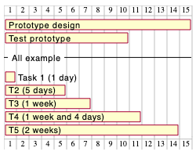

일주일 `week` 이라고 표현하면 일주일에 며칠을 일하는가를 자동으로 계산합니다. 만약 토요일과 일요일에 근무를 안한다면 일주일은 주5일의 별칭입니다.

#### 시작일 (Start)
`start` 동사를 이용하여 시작일을 지정합니다:
```java
@startuml
[Prototype design] lasts 15 days
[Test prototype] lasts 10 days

Project starts 2020-07-01
[Prototype design] starts 2020-07-01
[Test prototype] starts 2020-07-16
@enduml
```
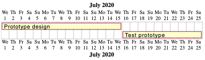

#### 종료일 (End)
`end` 동사를 이용하여 종료일을 정할 수 있습니다:

```java
@startuml
[Prototype design] lasts 15 days
[Test prototype] lasts 10 days

Project starts 2020-07-01
[Prototype design] ends 2020-07-15
[Test prototype] ends 2020-07-25

@enduml
```


#### 시작일/종료일 (Start/End)
시작일과 종료일을 같이 지정할 수도 있습니다:
```java
@startuml

Project starts 2020-07-01
[Prototype design] starts 2020-07-01
[Test prototype] starts 2020-07-16
[Prototype design] ends 2020-07-15
[Test prototype] ends 2020-07-25

@enduml
```


### 한줄 정의
각각의 할일에 대해 `start`, `end`, `last` 를 이용한 한줄 정의가 가능합니다.

```java
@startuml
Project starts 2020-07-01
[Prototype design] starts 2020-07-01 and ends 2020-07-15
[Test prototype] starts 2020-07-16 and lasts 10 days
@enduml
```


> 이전 네 개의 정의 모두 동일한 결과를 얻습니다.

### 제약사항 (constraints) 추가

할일 간의 제약사항을 추가할 수 있습니다. (예를 들어 이전 할일이 종료된 후 다음일을 시작하는 등)

```java
@startgantt
[Prototype design] lasts 15 days
[Test prototype] lasts 10 days
[Test prototype] starts at [Prototype design]'s end
@endgantt
```


```java
@startgantt
[Prototype design] lasts 10 days
[Code prototype] lasts 10 days
[Write tests] lasts 5 days
[Code prototype] starts at [Prototype design]'s end
[Write tests] starts at [Code prototype]'s start
@endgantt
```


### 별칭
`as` 키워드를 사용하면 별칭을 활용할 수 있습니다.

```java
@startgantt
[Prototype design] as [D] lasts 15 days
[Test prototype] as [T] lasts 10 days
[T] starts at [D]'s end
@endgantt
```


### 색상 사용자화
`is colored in` 문법과 [색상](https://plantuml.com/color)을 이용한 사용자 정의 색상을 지정할 수 있습니다.

```java
@startgantt
[Prototype design] lasts 13 days
[Test prototype] lasts 4 days
[Test prototype] starts at [Prototype design]'s end
[Prototype design] is colored in Fuchsia/FireBrick
[Test prototype] is colored in GreenYellow/Green
@endgantt
```


### 완료 상태

#### 퍼센트를 이용한 완료

각 할일에 대해 아래와 같은 방법으로 완료 퍼센트를 설정할 수 있습니다:
* `is xx% completed`
* `is xx% complete`

```java
@startgantt
[foo] lasts 21 days
[foo] is 40% completed
[bar] lasts 30 days and is 10% complete
@endgantt
```


#### 스타일을 이용한 완료 항목 색상 변경
```java
@startgantt

<style>
ganttDiagram {
  task {
    BackGroundColor GreenYellow
    LineColor Green 
    unstarted {
      BackGroundColor Fuchsia 
      LineColor FireBrick
    }
  }
}
</style>

[Prototype design] lasts 7 days
[Test prototype 0] lasts 4 days
[Test prototype 10] lasts 4 days
[Test prototype 20] lasts 4 days
[Test prototype 30] lasts 4 days
[Test prototype 40] lasts 4 days
[Test prototype 50] lasts 4 days
[Test prototype 60] lasts 4 days
[Test prototype 70] lasts 4 days
[Test prototype 80] lasts 4 days
[Test prototype 90] lasts 4 days
[Test prototype 100] lasts 4 days

[Test prototype 0] starts at [Prototype design]'s end
[Test prototype 10] starts at [Prototype design]'s end
[Test prototype 20] starts at [Prototype design]'s end
[Test prototype 30] starts at [Prototype design]'s end
[Test prototype 40] starts at [Prototype design]'s end
[Test prototype 50] starts at [Prototype design]'s end
[Test prototype 60] starts at [Prototype design]'s end
[Test prototype 70] starts at [Prototype design]'s end
[Test prototype 80] starts at [Prototype design]'s end
[Test prototype 90] starts at [Prototype design]'s end
[Test prototype 100] starts at [Prototype design]'s end

[Test prototype 0] is 0% complete
[Test prototype 10] is 10% complete
[Test prototype 20] is 20% complete
[Test prototype 30] is 30% complete
[Test prototype 40] is 40% complete
[Test prototype 50] is 50% complete
[Test prototype 60] is 60% complete
[Test prototype 70] is 70% complete
[Test prototype 80] is 80% complete
[Test prototype 90] is 90% complete
[Test prototype 100] is 100% complete

@endgantt
```


### 마일스톤
`happen`을 이용한 [마일스톤](https://ko.wikipedia.org/wiki/마일스톤_(프로젝트_관리))을 정할 수 있습니다.

#### 제약사항을 이용한 상대 마일스톤

```java
@startgantt
[Test prototype] lasts 10 days
[Prototype completed] happens at [Test prototype]'s end
[Setup assembly line] lasts 12 days
[Setup assembly line] starts at [Test prototype]'s end
@endgantt
```


#### 특정일로 고정된 절대 마일스톤
```java
@startgantt
Project starts 2020-07-01
[Test prototype] lasts 10 days
[Prototype completed] happens 2020-07-10
[Setup assembly line] lasts 12 days
[Setup assembly line] starts at [Test prototype]'s end
@endgantt
```


#### 특정 할일 모음이 종료되어야 발생하는 마일스톤
```java
@startgantt
[Task1] lasts 4 days
then [Task1.1] lasts 4 days
[Task1.2] starts at [Task1]'s end and lasts 7 days

[Task2] lasts 5 days
then [Task2.1] lasts 4 days

[MaxTaskEnd] happens at [Task1.1]'s end
[MaxTaskEnd] happens at [Task1.2]'s end
[MaxTaskEnd] happens at [Task2.1]'s end

@endgantt
```
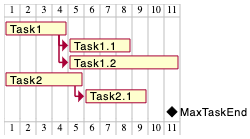

### 하이퍼링크

할일에 하이퍼링크를 달 수 있습니다.

```java
@startgantt
[task1] lasts 10 days
[task1] links to [[http://plantuml.com]]
@endgantt
```


### 달력
전체 프로젝트에 대하여 시작일을 지정할 수 있는데 첫 번째 할일은 기본적으로 이 날 부터 시작합니다.

```java
@startgantt
Project starts the 20th of september 2017
[Prototype design] as [TASK1] lasts 13 days
[TASK1] is colored in Lavender/LightBlue
@endgantt
```
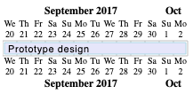

### 특정 날짜 색칠하기
특정 일이 대하여 [색상](https://plantuml.com/color)으로 칠할 수 있습니다.

```java
@startgantt
Project starts the 2020/09/01 

2020/09/07 is colored in salmon
2020/09/13 to 2020/09/16 are colored in lightblue

[Prototype design] as [TASK1] lasts 22 days
[TASK1] is colored in Lavender/LightBlue
[Prototype completed] happens at [TASK1]'s end
@endgantt
```


### 스케일 변경

매우 긴 프로젝트인 경우 한눈에 보이기 힘들 수 있습니다. 이런 경우 다음과 같은 스케일을 변경할 수 있습니다:
* printscale
* ganttscale
* projectscale

각 스케일에 아래 값을 지정할 수 있습니다:
* daily (기본)
* weekly
* monthly
* quarterly
* yearly

#### 일간(daily) 스케일 (기본)
```java
@startuml
saturday are closed
sunday are closed

Project starts the 1st of january 2021
[Prototype design end] as [TASK1] lasts 19 days
[TASK1] is colored in Lavender/LightBlue
[Testing] lasts 14 days
[TASK1]->[Testing]

2021-01-18 to 2021-01-22 are named [End's committee]
2021-01-18 to 2021-01-22 are colored in salmon 
@enduml
```


#### 주간(Weekly) 스케일
```java
@startuml
printscale weekly
saturday are closed
sunday are closed

Project starts the 1st of january 2021
[Prototype design end] as [TASK1] lasts 19 days
[TASK1] is colored in Lavender/LightBlue
[Testing] lasts 14 days
[TASK1]->[Testing]

2021-01-18 to 2021-01-22 are named [End's committee]
2021-01-18 to 2021-01-22 are colored in salmon 
@enduml
```


```java
@startgantt
printscale weekly
Project starts the 20th of september 2020
[Prototype design] as [TASK1] lasts 130 days
[TASK1] is colored in Lavender/LightBlue
[Testing] lasts 20 days
[TASK1]->[Testing]

2021-01-18 to 2021-01-22 are named [End's committee]
2021-01-18 to 2021-01-22 are colored in salmon 
@endgantt
```


### 월간(Monthly) 스케일
```java
@startgantt
projectscale monthly
Project starts the 20th of september 2020
[Prototype design] as [TASK1] lasts 130 days
[TASK1] is colored in Lavender/LightBlue
[Testing] lasts 20 days
[TASK1]->[Testing]

2021-01-18 to 2021-01-22 are named [End's committee]
2021-01-18 to 2021-01-22 are colored in salmon 
@endgantt
```


#### 분기(Quarterly) 스케일
```java
@startgantt
projectscale quarterly
Project starts the 20th of september 2020
[Prototype design] as [TASK1] lasts 130 days
[TASK1] is colored in Lavender/LightBlue
[Testing] lasts 20 days
[TASK1]->[Testing]

2021-01-18 to 2021-01-22 are named [End's committee]
2021-01-18 to 2021-01-22 are colored in salmon 
@endgantt
```
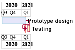

```java
@startgantt
projectscale quarterly
Project starts the 1st of october 2020
[Prototype design] as [TASK1] lasts 700 days
[TASK1] is colored in Lavender/LightBlue
[Testing] lasts 200 days
[TASK1]->[Testing]

2021-01-18 to 2021-03-22 are colored in salmon 
@endgantt
```
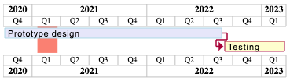

### 년간(Yearly) 스케일
```java
@startgantt
projectscale yearly
Project starts the 1st of october 2020
[Prototype design] as [TASK1] lasts 700 days
[TASK1] is colored in Lavender/LightBlue
[Testing] lasts 200 days
[TASK1]->[Testing]

2021-01-18 to 2021-03-22 are colored in salmon 
@endgantt
```
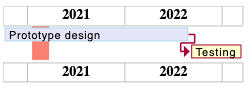

### 줌

다음과 같이 줌을 설정할 수 있습니다:
* `zoom <integer>`

#### 일간(daily) 스케일의 줌

##### 줌 기능 없는 경우
```java
@startuml
printscale daily
saturday are closed
sunday are closed

Project starts the 1st of january 2021
[Prototype design end] as [TASK1] lasts 8 days
[TASK1] is colored in Lavender/LightBlue
[Testing] lasts 3 days
[TASK1]->[Testing]

2021-01-18 to 2021-01-22 are named [End's committee]
2021-01-18 to 2021-01-22 are colored in salmon 
@enduml
```


##### 줌을 사용한 경우
```java
@startuml
printscale daily zoom 2
saturday are closed
sunday are closed

Project starts the 1st of january 2021
[Prototype design end] as [TASK1] lasts 8 days
[TASK1] is colored in Lavender/LightBlue
[Testing] lasts 3 days
[TASK1]->[Testing]

2021-01-18 to 2021-01-22 are named [End's committee]
2021-01-18 to 2021-01-22 are colored in salmon 
@enduml
```
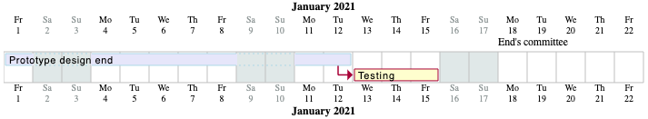

#### 주간(weekly) 스케일 줌

##### 줌을 사용하지 않은 경우
```java
@startuml
printscale weekly
saturday are closed
sunday are closed

Project starts the 1st of january 2021
[Prototype design end] as [TASK1] lasts 19 days
[TASK1] is colored in Lavender/LightBlue
[Testing] lasts 14 days
[TASK1]->[Testing]

2021-01-18 to 2021-01-22 are named [End's committee]
2021-01-18 to 2021-01-22 are colored in salmon 
@enduml
```
```plantuml
@startuml
printscale weekly
saturday are closed
sunday are closed

Project starts the 1st of january 2021
[Prototype design end] as [TASK1] lasts 19 days
[TASK1] is colored in Lavender/LightBlue
[Testing] lasts 14 days
[TASK1]->[Testing]

2021-01-18 to 2021-01-22 are named [End's committee]
2021-01-18 to 2021-01-22 are colored in salmon 
@enduml
```
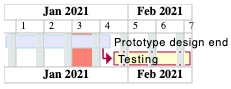

##### 줌을 사용하는 경우
```java
@startuml
printscale weekly zoom 4
saturday are closed
sunday are closed

Project starts the 1st of january 2021
[Prototype design end] as [TASK1] lasts 19 days
[TASK1] is colored in Lavender/LightBlue
[Testing] lasts 14 days
[TASK1]->[Testing]

2021-01-18 to 2021-01-22 are named [End's committee]
2021-01-18 to 2021-01-22 are colored in salmon 
@enduml
```


#### 월간(monthly) 스케일 줌

##### 줌을 사용하지 않은 경우
```java
@startgantt
projectscale monthly
Project starts the 20th of september 2020
[Prototype design] as [TASK1] lasts 130 days
[TASK1] is colored in Lavender/LightBlue
[Testing] lasts 20 days
[TASK1]->[Testing]

2021-01-18 to 2021-01-22 are named [End's committee]
2021-01-18 to 2021-01-22 are colored in salmon 
@endgantt
```


##### 줌을 사용한 경우
```java
@startgantt
projectscale monthly zoom 3
Project starts the 20th of september 2020
[Prototype design] as [TASK1] lasts 130 days
[TASK1] is colored in Lavender/LightBlue
[Testing] lasts 20 days
[TASK1]->[Testing]

2021-01-18 to 2021-01-22 are named [End's committee]
2021-01-18 to 2021-01-22 are colored in salmon 
@endgantt
```


#### 분기(quarterly) 스케일 줌

##### 줌을 사용하지 않은 경우
```java
@startgantt
projectscale quarterly
Project starts the 20th of september 2020
[Prototype design] as [TASK1] lasts 130 days
[TASK1] is colored in Lavender/LightBlue
[Testing] lasts 20 days
[TASK1]->[Testing]

2021-01-18 to 2021-01-22 are named [End's committee]
2021-01-18 to 2021-01-22 are colored in salmon 
@endgantt
```
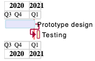

##### 줌을 사용한 경우
```java
@startgantt
projectscale quarterly zoom 7
Project starts the 20th of september 2020
[Prototype design] as [TASK1] lasts 130 days
[TASK1] is colored in Lavender/LightBlue
[Testing] lasts 20 days
[TASK1]->[Testing]

2021-01-18 to 2021-01-22 are named [End's committee]
2021-01-18 to 2021-01-22 are colored in salmon 
@endgantt
```
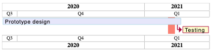

#### 년간(yearly) 스케일 줌

##### 줌을 사용하지 않은 경우
```java
@startgantt
projectscale yearly
Project starts the 1st of october 2020
[Prototype design] as [TASK1] lasts 700 days
[TASK1] is colored in Lavender/LightBlue
[Testing] lasts 200 days
[TASK1]->[Testing]

2021-01-18 to 2021-03-22 are colored in salmon 
@endgantt
```


##### 줌을 사용한 경우
```java
@startgantt
projectscale yearly zoom 2
Project starts the 1st of october 2020
[Prototype design] as [TASK1] lasts 700 days
[TASK1] is colored in Lavender/LightBlue
[Testing] lasts 200 days
[TASK1]->[Testing]

2021-01-18 to 2021-03-22 are colored in salmon 
@endgantt
```
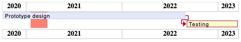

### 휴무일 정의
주말을 포함한 특정 날에 휴무일을 지정할 수 있습니다.

```java
@startgantt
project starts the 2018/04/09
saturday are closed
sunday are closed
2018/05/01 is closed
2018/04/17 to 2018/04/19 is closed
[Prototype design] lasts 14 days
[Test prototype] lasts 4 days
[Test prototype] starts at [Prototype design]'s end
[Prototype design] is colored in Fuchsia/FireBrick
[Test prototype] is colored in GreenYellow/Green
@endgantt
```


또한 특정 기간을 닫은 상태에서 그 안에 특정일만 일을 하는 것으로 표시할 수도 있습니다.

```java
@startgantt
2020-07-07 to 2020-07-17 is closed
2020-07-13 is open

Project starts the 2020-07-01
[Prototype design] lasts 10 days
Then [Test prototype] lasts 10 days
@endgantt
```
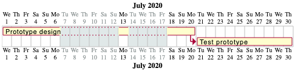

### 휴무일에 따른 주(week)의 정의
**week**라고 표시하는 것은 주중 일하는 날이 얼마인가를 나타냅니다:
```java
@startgantt
Project starts 2021-03-29
[Review 01] happens at 2021-03-29
[Review 02 - 3 weeks] happens on 3 weeks after [Review 01]'s end
[Review 02 - 21 days] happens on 21 days after [Review 01]'s end
@endgantt
```


따라서 *토요일* 과 *일요일*이 휴무로 정해지만, **week** 는 5일을 의미합니다:

```java
@startgantt
Project starts 2021-03-29
saturday are closed
sunday are closed
[Review 01] happens at 2021-03-29
[Review 02 - 3 weeks] happens on 3 weeks after [Review 01]'s end
[Review 02 - 21 days] happens on 21 days after [Review 01]'s end
@endgantt
```


### 할일 연결의 간단한 방법
`then` 키워드를 이용하여 연속으로 해야하는 할일에 대한 정의를 쉽게 할 수 있습니다.

```java
@startgantt
[Prototype design] lasts 14 days
then [Test prototype] lasts 4 days
then [Deploy prototype] lasts 6 days
@endgantt
```


`then` 대신 `->` 를 사용해도 동일하게 동작합니다.

```java
@startgantt
[Prototype design] lasts 14 days
[Build prototype] lasts 4 days
[Prepare test] lasts 6 days
[Prototype design] -> [Build prototype]
[Prototype design] -> [Prepare test]
@endgantt
```


### 자원과 같이 기술
`on` 키워드와 함께 중괄호에 자원(사람) 을 넣어 표시할 수 있습니다.

```java
@startgantt
[Task1] on {Alice} lasts 10 days
[Task2] on {Bob:50%} lasts 2 days
then [Task3] on {Alice:25%} lasts 1 days
@endgantt
```


여러 자원(사람)이 하나의 할일에 할당될 수도 있습니다:
```java
@startgantt
[Task1] on {Alice} {Bob} lasts 20 days
@endgantt
```


특정 자원(사람)이 특정일(기간)에 휴무일이라고 지정할 수 있습니다:
```java
@startgantt
project starts on 2020-06-19
[Task1] on {Alice} lasts 10 days
{Alice} is off on 2020-06-24 to 2020-06-26
@endgantt
```


### 자원 숨기기

> PlantUML에서 오류 발생하여 이 섹션은 넘어감

### 구분자
`--` 구분자를 이용하여 할일을 그룹화 할 수 있습니다.

```java
@startgantt
[Task1] lasts 10 days
then [Task2] lasts 4 days
-- Phase Two --
then [Task3] lasts 5 days
then [Task4] lasts 6 days
@endgantt
```


### 복잡한 예제
`and` 접속사를 사용하여 다양한 연관을 지을 수 있습니다. 또한 제약사항에 딜레이를 추가할 수 있습니다.

```java
@startgantt
[Prototype design] lasts 13 days and is colored in Lavender/LightBlue
[Test prototype] lasts 9 days and is colored in Coral/Green and starts 3 days after [Prototype design]'s end
[Write tests] lasts 5 days and ends at [Prototype design]'s end
[Hire tests writers] lasts 6 days and ends at [Write tests]'s start
[Init and write tests report] is colored in Coral/Green
[Init and write tests report] starts 1 day before [Test prototype]'s start and ends at [Test prototype]'s end
@endgantt
```


### 주석
[Common Commands page](https://plantuml.com/commons#560kta2oz3a2k362kjbm)에 기술된 것과 마찬가지로 `'` 따옴표로 시작하는 라인 또는 `/'` 로 시작해서 `'/`로 끝나는 여러 줄의 주석을 만들 수 있습니다.

```java
@startgantt
' This is a comment

[T1] lasts 3 days

/' this comment
is on several lines '/

[T2] starts at [T1]'s end and lasts 1 day
@endgantt
```
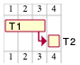

### 스타일 사용

#### 스타일 없이 (기본)
```java
@startuml
[Task1] lasts 20 days
note bottom
  memo1 ...
  memo2 ...
  explanations1 ...
  explanations2 ...
end note
[Task2] lasts 4 days
[Task1] -> [Task2]
-- Separator title --
[M1] happens on 5 days after [Task1]'s end
-- end --
@enduml
```


#### 스타일 사용
[스타일](https://plantuml.com/style-evolution)을 적용할 수 있습니다.

```java
@startuml
<style>
ganttDiagram {
	task {
		FontName Helvetica
		FontColor red
		FontSize 18
		FontStyle bold
		BackGroundColor GreenYellow
		LineColor blue
	}
	milestone {
		FontColor blue
		FontSize 25
		FontStyle italic
		BackGroundColor yellow
		LineColor red
	}
	note {
		FontColor DarkGreen
		FontSize 10
		LineColor OrangeRed
	}
	arrow {
		FontName Helvetica
		FontColor red
		FontSize 18
		FontStyle bold
		BackGroundColor GreenYellow
		LineColor blue
	}
	separator {
		LineColor red
		BackGroundColor green
		FontSize 16
		FontStyle bold
		FontColor purple
	}
}
</style>
[Task1] lasts 20 days
note bottom
  memo1 ...
  memo2 ...
  explanations1 ...
  explanations2 ...
end note
[Task2] lasts 4 days
[Task1] -> [Task2]
-- Separator title --
[M1] happens on 5 days after [Task1]'s end
-- end --
@enduml
```
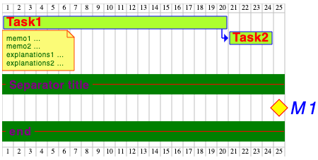

#### 더 복잡한 스타일 사용

```java
@startgantt
<style>
ganttDiagram {
	task {
		FontName Helvetica
		FontColor red
		FontSize 18
		FontStyle bold
		BackGroundColor GreenYellow
		LineColor blue
	}
	milestone {
		FontColor blue
		FontSize 25
		FontStyle italic
		BackGroundColor yellow
		LineColor red
	}
	note {
		FontColor DarkGreen
		FontSize 10
		LineColor OrangeRed
	}
	arrow {
		FontName Helvetica
		FontColor red
		FontSize 18
		FontStyle bold
		BackGroundColor GreenYellow
		LineColor blue
		LineStyle 8.0;13.0
		LineThickness 3.0
	}
	separator {
		BackgroundColor lightGreen
		LineStyle 8.0;3.0
		LineColor red
		LineThickness 1.0
		FontSize 16
		FontStyle bold
		FontColor purple
		Margin 5
		Padding 20
	}
	timeline {
	    BackgroundColor Bisque
	}
	closed {
		BackgroundColor pink
		FontColor red
	}
}
</style>
Project starts the 2020-12-01

[Task1] lasts 10 days
sunday are closed

note bottom
  memo1 ...
  memo2 ...
  explanations1 ...
  explanations2 ...
end note

[Task2] lasts 20 days
[Task2] starts 10 days after [Task1]'s end
-- Separator title --
[M1] happens on 5 days after [Task1]'s end

<style>
	separator {
	    LineColor black
		Margin 0
		Padding 0
	}
</style>

-- end --
@endgantt
```


#### 간결한 스타일
스타일을 이용하여 간결하게 보이게 할 수 있는데 *할일, 의존관계, 상대적 지속 등의 정보는 보이지만 실제 시작일과 스케일 등은 안보이게 합니다*:
```java
@startgantt
<style>
ganttDiagram {
  timeline {
    LineColor transparent
    FontColor transparent
 }
}
</style>

hide footbox
[Test prototype] lasts 7 days
[Prototype completed] happens at [Test prototype]'s end
[Setup assembly line] lasts 9 days
[Setup assembly line] starts at [Test prototype]'s end
then [Setup] lasts 5 days
[T2] lasts 2 days and starts at [Test prototype]'s end
then [T3] lasts 3 days
-- end task --
then [T4] lasts 2 days
@endgantt
```
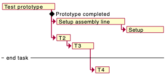

또는:

```java
@startgantt
<style>
ganttDiagram {
  timeline {
    LineColor transparent
    FontColor transparent
  }
  closed {
    FontColor transparent
  }
}
</style>

hide footbox
project starts the 2018/04/09
saturday are closed
sunday are closed
2018/05/01 is closed
2018/04/17 to 2018/04/19 is closed
[Prototype design] lasts 9 days
[Test prototype] lasts 5 days
[Test prototype] starts at [Prototype design]'s end
[Prototype design] is colored in Fuchsia/FireBrick
[Test prototype] is colored in GreenYellow/Green
@endgantt
```


### 노트 추가
```java
@startgantt
[task01] lasts 15 days
note bottom
  memo1 ...
  memo2 ...
  explanations1 ...
  explanations2 ...
end note

[task01] -> [task02]

@endgantt
```


포개기 예제.
```java
@startgantt
[task01] lasts 15 days
note bottom
  memo1 ...
  memo2 ...
  explanations1 ...
  explanations2 ...
end note

[task01] -> [task02]
[task03] lasts 5 days

@endgantt
```
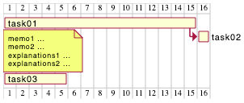

```java
@startgantt

-- test01 --

[task01] lasts 4 days
note bottom
'note left
memo1 ...
memo2 ...
explanations1 ...
explanations2 ...
end note

[task02] lasts 8 days
[task01] -> [task02]
note bottom
'note left
memo1 ...
memo2 ...
explanations1 ...
explanations2 ...
end note
-- test02 --

[task03] as [t3] lasts 7 days
[t3] -> [t4]
@endgantt
```


```java
@startgantt

Project starts 2020-09-01

[taskA] starts 2020-09-01 and lasts 3 days
[taskB] starts 2020-09-10 and lasts 3 days
[taskB] displays on same row as [taskA]

[task01] starts 2020-09-05 and lasts 4 days

then [task02] lasts 8 days
note bottom
  note for task02
  more notes
end note

then [task03] lasts 7 days
note bottom
  note for task03
  more notes
end note

-- separator --

[taskC] starts 2020-09-02 and lasts 5 days
[taskD] starts 2020-09-09 and lasts 5 days
[taskD] displays on same row as [taskC]

[task 10] starts 2020-09-05 and lasts 5 days
then [task 11] lasts 5 days
note bottom
  note for task11
  more notes
end note
@endgantt
```


### 할일에 휴식일 지정

```java
@startgantt
Project starts the 5th of december 2018
saturday are closed
sunday are closed
2018/12/29 is opened
[Prototype design] lasts 17 days
[Prototype design] pauses on 2018/12/13
[Prototype design] pauses on 2018/12/14
[Prototype design] pauses on monday
[Test prototype] starts at [Prototype design]'s end and lasts 2 weeks
@endgantt
```


### 연결 색상 변경

다음과 같은 방식으로 연결 색상을 변경할 수 있습니다:
* `with <color> <style> link`

```java
@startgantt
[T1] lasts 4 days
[T2] lasts 4 days and starts 3 days after [T1]'s end with blue dotted link
[T3] lasts 4 days and starts 3 days after [T2]'s end with green bold link
[T4] lasts 4 days and starts 3 days after [T3]'s end with green dashed link
@endgantt
```


* 또는 직접 화살표 스타일을 변경할 수도 있습니다
```java
@startuml
<style>
ganttDiagram {
	arrow {
		LineColor blue
	}
}
</style>
[Prototype design] lasts 7 days
[Build prototype] lasts 4 days
[Prepare test] lasts 6 days
[Prototype design] -[#FF00FF]-> [Build prototype]
[Prototype design] -[dotted]-> [Prepare test]
Then [Run test]  lasts 4 days
@enduml
```


### 동일 선 상의 할일과 마일스톤 표시

다음과 같은 문법으로 동일 선 상의 할일과 마일스톤을 함께 표시할 수 있습니다:
* `[T|M] displays on same row as [T|M]`

```java
@startgantt
[Prototype design] lasts 13 days
[Test prototype] lasts 4 days and 1 week
[Test prototype] starts 1 week and 2 days after [Prototype design]'s end
[Test prototype] displays on same row as [Prototype design]
[r1] happens on 5 days after [Prototype design]'s end
[r2] happens on 5 days after [r1]'s end
[r3] happens on 5 days after [r2]'s end
[r2] displays on same row as [r1]
[r3] displays on same row as [r1]
@endgantt
```


### 오늘(today) 강조
```java
@startgantt
Project starts the 20th of september 2018
sunday are close
2018/09/21 to 2018/09/23 are colored in salmon
2018/09/21 to 2018/09/30 are named [Vacation in the Bahamas] 

today is 30 days after start and is colored in #AAF
[Foo] happens 40 days after start
[Dummy] lasts 10 days and starts 10 days after start

@endgantt
```


### 두 마일스톤 사이의 할일
```java
@startgantt
project starts on 2020-07-01
[P_start] happens 2020-07-03
[P_end]   happens 2020-07-13
[Prototype design] occurs from [P_start] to [P_end]
@endgantt
```
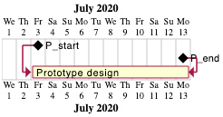


### 문법과 동사 형태

동사형	| 예제
---|---
*[T]* | starts	
*[M]* | happens	

### 제목, 머릿말, 꼬릿말, 주석, 범례 등
```java
@startuml

header some header

footer some footer

title My title

[Prototype design] lasts 13 days

legend
The legend
end legend

caption This is caption

@enduml
```
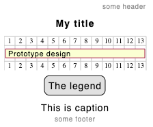

### 꼬릿말 숨기기 (모든 스케일에 적용)
`hide footbox` 명령을 이용하면 꼬릿말을 숨길 수 있습니다. *([시퀀스 다이어그램](https://plantuml.com/sequence-diagram)과 유사합니다)*.

예제:
* 일간 스케일 *(프로젝트 시작일 없이)*

```java
@startgantt

hide footbox
title Foot Box removed

[Prototype design] lasts 15 days
[Test prototype] lasts 10 days
@endgantt
```


* 일간 스케일

```java
@startgantt

Project starts the 20th of september 2017
[Prototype design] as [TASK1] lasts 13 days
[TASK1] is colored in Lavender/LightBlue

hide footbox
@endgantt
```


* 주간 스케일

```java
@startgantt
hide footbox

printscale weekly
saturday are closed
sunday are closed

Project starts the 1st of january 2021
[Prototype design end] as [TASK1] lasts 19 days
[TASK1] is colored in Lavender/LightBlue
[Testing] lasts 14 days
[TASK1]->[Testing]

2021-01-18 to 2021-01-22 are named [End's committee]
2021-01-18 to 2021-01-22 are colored in salmon 
@endgantt
```


* 월간 스케일

```java
@startgantt

hide footbox

projectscale monthly
Project starts the 20th of september 2020
[Prototype design] as [TASK1] lasts 130 days
[TASK1] is colored in Lavender/LightBlue
[Testing] lasts 20 days
[TASK1]->[Testing]

2021-01-18 to 2021-01-22 are named [End's committee]
2021-01-18 to 2021-01-22 are colored in salmon 
@endgantt
```


* 분기별 스케일

```java
@startgantt

hide footbox

projectscale quarterly
Project starts the 1st of october 2020
[Prototype design] as [TASK1] lasts 700 days
[TASK1] is colored in Lavender/LightBlue
[Testing] lasts 200 days
[TASK1]->[Testing]

2021-01-18 to 2021-03-22 are colored in salmon 
@endgantt
```


* 년간 스케일

```java
@startgantt

hide footbox

projectscale yearly
Project starts the 1st of october 2020
[Prototype design] as [TASK1] lasts 700 days
[TASK1] is colored in Lavender/LightBlue
[Testing] lasts 200 days
[TASK1]->[Testing]

2021-01-18 to 2021-03-22 are colored in salmon 
@endgantt
```


### 달력표시 언어
`language <xx>`와 같은 명령어로 언어를 변경할 수 있습니다. `<xx>` 에는 [ISO 639 code](https://en.wikipedia.org/wiki/List_of_ISO_639-1_codes)에 표현된 것과 같은 2자리 언어 코드입니다.

#### 영어 *(en, 기본)*
```java
@startuml
saturday are closed
sunday are closed

Project starts 2021-01-01
[Prototype design end] as [TASK1] lasts 19 days
[TASK1] is colored in Lavender/LightBlue
[Testing] lasts 14 days
[TASK1]->[Testing]

2021-01-18 to 2021-01-22 are colored in salmon 
@enduml
```


#### Korean (ko)
```java
@startuml
language ko
saturday are closed
sunday are closed

Project starts 2021-01-01
[Prototype design end] as [TASK1] lasts 19 days
[TASK1] is colored in Lavender/LightBlue
[Testing] lasts 14 days
[TASK1]->[Testing]

2021-01-18 to 2021-01-22 are colored in salmon 
@enduml
```


> * 일본어 달력표시인 경우 `language ja`
> * 중국어 달력표시인 경우 `language zh`
> * 네델란드어 달력표시인 경우 `language de`

### 할일 또는 마일스톤 지우기
할일 또는 마일스톤에 대하여 완료되는 대신 필요없게 되거나 연기되는 등의 경우 삭제되었다고 표시 `deleted` 할 수 있습니다.

```java
@startgantt
[Prototype design] lasts 1 weeks
then [Prototype completed]  lasts 4 days
[End Prototype completed] happens at [Prototype completed]'s end
then [Test prototype] lasts 5 days
[End Test prototype] happens at [Test prototype]'s end

[Prototype completed] is deleted
[End Prototype completed] is deleted
@endgantt
```
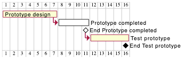
