## 마인드맵 다이어그램

> 마인드맵 다이어그램은 아직 베타버전이라 변경가능성이 있습니다.

### OrgMode syntax
문법은 `OrgMode`와 호환됩니다. `*` 개수로 표현할 수 있습니다.

```java
@startmindmap
* Debian
** Ubuntu
*** Linux Mint
*** Kubuntu
*** Lubuntu
*** KDE Neon
** LMDE
** SolydXK
** SteamOS
** Raspbian with a very long name
*** <s>Raspmbc</s> => OSMC
*** <s>Raspyfi</s> => Volumio
@endmindmap
```
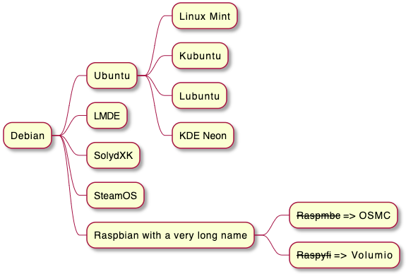

### 마크다운 문법
문법은 마크다운과 호환됩니다. 다음 예는 마크다운에서 항목을 나타내는 `*` 를 이용한 경우 입니다.

```java
@startmindmap
* root node
	* some first level node
		* second level node
		* another second level node
	* another first level node
@endmindmap
```
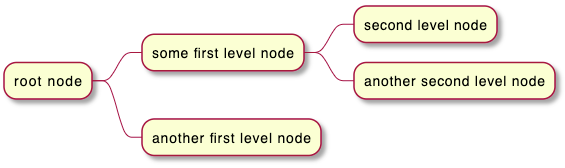

### +, - 등 기호
오른쪽 방향에는 한개 이상의 `+`, 왼쪽 방향에는 한개 이상의 `-`를 사용합니다.

```java
@startmindmap
+ OS
++ Ubuntu
+++ Linux Mint
+++ Kubuntu
+++ Lubuntu
+++ KDE Neon
++ LMDE
++ SolydXK
++ SteamOS
++ Raspbian
-- Windows 95
-- Windows 98
-- Windows NT
--- Windows 8
--- Windows 10
@endmindmap
```
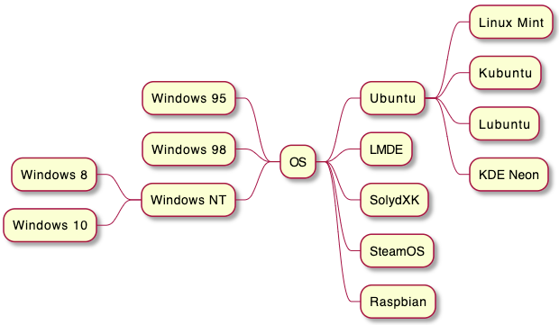

### 멀티라인
`:` 과 `;`를 이용하여 멀티라인 박스를 만들 수 있습니다.

```java
@startmindmap
* Class Templates
**:Example 1
<code>
template <typename T>
class cname{
void f1()<U+003B>
...
}
</code>
;
**:Example 2
<code>
other template <typename T>
class cname{
...
</code>
;
@endmindmap
```
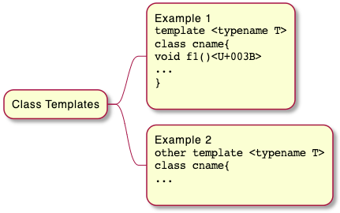

```java
@startmindmap
+ root
**:right_1.1
right_1.2;
++ right_2

left side

-- left_1
-- left_2
**:left_3.1
left_3.2;
@endmindmap
```
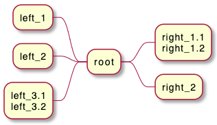

### 멀티루트 마인드맵
다음과 같이 한개 이상의 루트를 가진 마인드맵을 만들 수 있습니다:
```java
@startmindmap
* Root 1
** Foo
** Bar
* Root 2
** Lorem
** Ipsum
@endmindmap
```
> PlantUML 1.2021.12 는 해당 기능을 출력하는데 오류 발생

### 색상

[색상](https://plantuml.com/color) 지정이 가능합니다.

#### 인라인 색상 조정

* `OrgMode` 문법인 경우

```java
@startmindmap
*[#Orange] Colors
**[#lightgreen] Green
**[#FFBBCC] Rose
**[#lightblue] Blue
@endmindmap
```
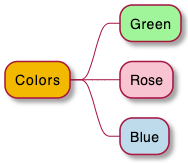

* 산술식 (+, -) 문법인 경우

```java
@startmindmap
+[#Orange] Colors
++[#lightgreen] Green
++[#FFBBCC] Rose
--[#lightblue] Blue
@endmindmap
```
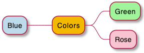

* 마크다운 문법인 경우

```java
@startmindmap
*[#Orange] root node
 *[#lightgreen] some first level node
  *[#FFBBCC] second level node
  *[#lightblue] another second level node
 *[#lightgreen] another first level node
@endmindmap
```
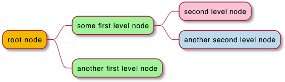

#### 스타일 색상

* `OrgMode` 문법인 경우

```java
@startmindmap
<style>
mindmapDiagram {
  .green {
    BackgroundColor lightgreen
  }
  .rose {
    BackgroundColor #FFBBCC
  }
  .your_style_name {
    BackgroundColor lightblue
  }
}
</style>
* Colors
** Green <<green>>
** Rose <<rose>>
** Blue <<your_style_name>>
@endmindmap
```
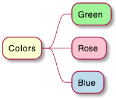

* 산술식 (+, -) 문법인 경우

```java
@startmindmap
<style>
mindmapDiagram {
  .green {
    BackgroundColor lightgreen
  }
  .rose {
    BackgroundColor #FFBBCC
  }
  .your_style_name {
    BackgroundColor lightblue
  }
}
</style>
+ Colors
++ Green <<green>>
++ Rose <<rose>>
-- Blue <<your_style_name>>
@endmindmap
```
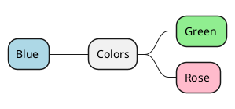
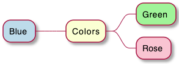

* 마크다운 문법인 경우

```java
@startmindmap
<style>
mindmapDiagram {
  .green {
    BackgroundColor lightgreen
  }
  .rose {
    BackgroundColor #FFBBCC
  }
  .your_style_name {
    BackgroundColor lightblue
  }
}
</style>
* root node
 * some first level node <<green>>
  * second level node <<rose>>
  * another second level node <<your_style_name>>
 * another first level node <<green>>
@endmindmap
```
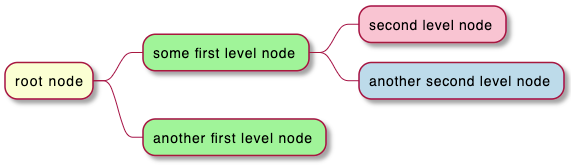

### 박스 제거
`_` 밑줄로 시작하여 박스를 안 그리 수 있습니다.

```java
@startmindmap
* root node
** some first level node
***_ second level node
***_ another second level node
***_ foo
***_ bar
***_ foobar
** another first level node
@endmindmap
```
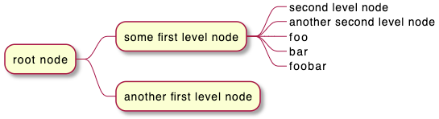

```java
@startmindmap
*_ root node
**_ some first level node
***_ second level node
***_ another second level node
***_ foo
***_ bar
***_ foobar
**_ another first level node
@endmindmap
```
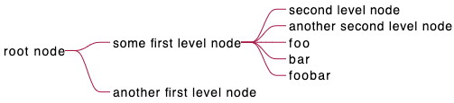

```java
@startmindmap
+ root node
++ some first level node
+++_ second level node
+++_ another second level node
+++_ foo
+++_ bar
+++_ foobar
++_ another first level node
-- some first right level node
--_ another first right level node
@endmindmap
```
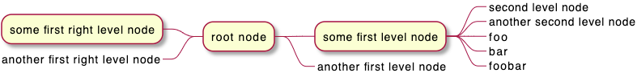

### 다이어그램 방향 변경

다이어그램을 그리다 `left side` 등과 같이 방향을 전환하도록 만들 수 있습니다.

```java
@startmindmap
* count
** 100
*** 101
*** 102
** 200

left side

** A
*** AA
*** AB
** B
@endmindmap
```
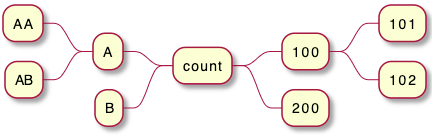

### 복잡한 예제
```java
@startmindmap
caption figure 1
title My super title

* <&flag>Debian
** <&globe>Ubuntu
*** Linux Mint
*** Kubuntu
*** Lubuntu
*** KDE Neon
** <&graph>LMDE
** <&pulse>SolydXK
** <&people>SteamOS
** <&star>Raspbian with a very long name
*** <s>Raspmbc</s> => OSMC
*** <s>Raspyfi</s> => Volumio

header
My super header
endheader

center footer My super footer

legend right
  Short
  legend
endlegend
@endmindmap
```
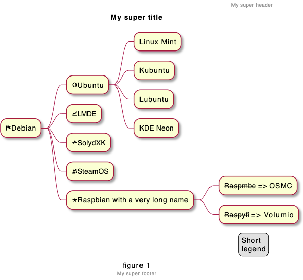

### 스타일 변경

#### 노드, 깊이
```java
@startmindmap
<style>
mindmapDiagram {
    node {
        BackgroundColor lightGreen
    }
    :depth(1) {
      BackGroundColor white
    }
}
</style>
* Linux
** NixOS
** Debian
*** Ubuntu
**** Linux Mint
**** Kubuntu
**** Lubuntu
**** KDE Neon
@endmindmap
```
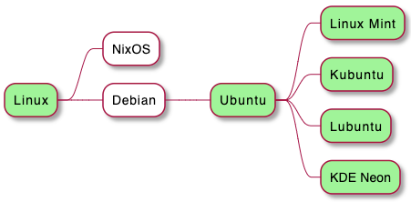

#### 박스 없는 스타일
```java
@startmindmap
<style>
mindmapDiagram {
  node {
    BackgroundColor lightGreen
  }
  boxless {
    FontColor darkgreen
  }
}
</style>
* Linux
** NixOS
** Debian
***_ Ubuntu
**** Linux Mint
**** Kubuntu
**** Lubuntu
**** KDE Neon
@endmindmap
```
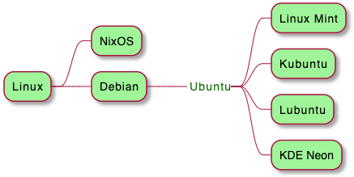

### 단어 줄바꿈
`MaximumWidth` 설정을 통해서 문장이 길어질 경우 자동으로 줄바꿈을 할 수 있습니다. 단위는 픽셀 입니다.

```java
@startmindmap


<style>
node {
    Padding 12
    Margin 3
    HorizontalAlignment center
    LineColor blue
    LineThickness 3.0
    BackgroundColor gold
    RoundCorner 40
    MaximumWidth 100
}

rootNode {
    LineStyle 8.0;3.0
    LineColor red
    BackgroundColor white
    LineThickness 1.0
    RoundCorner 0
    Shadowing 0.0
}

leafNode {
    LineColor gold
    RoundCorner 0
    Padding 3
}

arrow {
    LineStyle 4
    LineThickness 0.5
    LineColor green
}
</style>

* Hi =)
** sometimes i have node in wich i want to write a long text
*** this results in really huge diagram
**** of course, i can explicit split with a\nnew line
**** but it could be cool if PlantUML was able to split long lines, maybe with an option 

@endmindmap
```
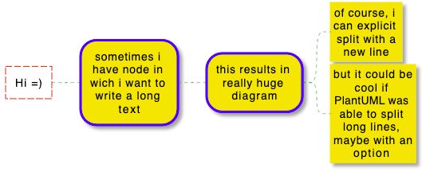
