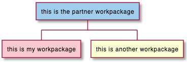

## 작업 명세 구조 (WBS) 다이어그램

WBS 다이어그램은 아직 베타버전 입니다. 문법은 변경될 수 있습니다.

### `OrgMode` 문법
다음의 문법은 `OrgMode`과 호환되는 것입니다.

```java
@startwbs
* Business Process Modelling WBS
** Launch the project
*** Complete Stakeholder Research
*** Initial Implementation Plan
** Design phase
*** Model of AsIs Processes Completed
**** Model of AsIs Processes Completed1
**** Model of AsIs Processes Completed2
*** Measure AsIs performance metrics
*** Identify Quick Wins
** Complete innovate phase
@endwbs
```


### 방향 전환
`<` 과 `>`를 `*` 다음에 붙여 방향전환을 할 수 있습니다.

```java
@startwbs
* Business Process Modelling WBS
** Launch the project
*** Complete Stakeholder Research
*** Initial Implementation Plan
** Design phase
*** Model of AsIs Processes Completed
****< Model of AsIs Processes Completed1
****> Model of AsIs Processes Completed2
***< Measure AsIs performance metrics
***< Identify Quick Wins
@endwbs
```


### 산술식 (+, -) 문법
`+`나 `-`를 이용한 방법도 가능합니다.

```java
@startwbs
+ New Job
++ Decide on Job Requirements
+++ Identity gaps
+++ Review JDs
++++ Sign-Up for courses
++++ Volunteer
++++ Reading
++- Checklist
+++- Responsibilities
+++- Location
++ CV Upload Done
+++ CV Updated
++++ Spelling & Grammar
++++ Check dates
---- Skills
+++ Recruitment sites chosen
@endwbs
```


### 여러 줄

`:` 과 `;` 를 이용하여 여러 줄의 내용을 박스에 담을 수 있브니다. ([마인드맵](https://plantuml.com/mindmap-diagram#4ea2ymh57pwsk99qth2e)과 유사합니다)

```java
@startwbs
* <&flag> Debian
** <&globe> Ubuntu

***:Linux Mint
Open Source;

*** Kubuntu
*** ...
@endwbs
```


### 박스 안보이게

`_` 를 이용하여 박스를 안보이게 할 수 있습니다.

#### 산술식 (+, -) 문법에서 이용

##### 일부가 박스가 없는 경우
```java
@startwbs
+ Project
 + Part One
  + Task 1.1
   - LeftTask 1.2
   + Task 1.3
  + Part Two
   + Task 2.1
   + Task 2.2
   -_ Task 2.2.1 To the left boxless
   -_ Task 2.2.2 To the Left boxless
   +_ Task 2.2.3 To the right boxless
@endwbs
```


##### 전체 박스가 없는 경우
```java
@startwbs
+_ Project
 +_ Part One
  +_ Task 1.1
   -_ LeftTask 1.2
   +_ Task 1.3
  +_ Part Two
   +_ Task 2.1
   +_ Task 2.2
   -_ Task 2.2.1 To the left boxless
   -_ Task 2.2.2 To the Left boxless
   +_ Task 2.2.3 To the right boxless
@endwbs
```


#### `OrgMode` 문법에서 박스 안보이게 하기

##### 일부가 안보이는 경우
```java
@startwbs
* World
** America 
***_ Canada 
***_ Mexico
***_ USA
** Europe
***_  England
***_  Germany
***_  Spain
@endwbs
```


##### 모든 박스가 안 보이는 경우
```java
@startwbs
*_ World
**_ America 
***_ Canada 
***_ Mexico
***_ USA
**_ Europe
***_  England
***_  Germany
***_  Spain
@endwbs
```


### 색상 (인라인 또는 스타일 방식)
[색상](https://plantuml.com/color) 변경도 가능합니다:
* 인라인 방식

```java
@startwbs
*[#SkyBlue] this is the partner workpackage
**[#pink] this is my workpackage
** this is another workpackage
@endwbs
```


```java
@startwbs
+[#SkyBlue] this is the partner workpackage
++[#pink] this is my workpackage
++ this is another workpackage
@endwbs
```


* 스타일 방식

```java
@startwbs
<style>
wbsDiagram {
  .pink {
      BackgroundColor pink
  }
  .your_style_name {
      BackgroundColor SkyBlue
  }
}
</style>
* this is the partner workpackage <<your_style_name>>
** this is my workpackage <<pink>>
** this is another workpackage
@endwbs
```


```java
@startwbs
<style>
wbsDiagram {
  .pink {
      BackgroundColor pink
  }
  .your_style_name {
      BackgroundColor SkyBlue
  }
}
</style>
+ this is the partner workpackage <<your_style_name>>
++ this is my workpackage <<pink>>
++ this is another workpackage
@endwbs
```


### 스타일 이용

다음과 같이 스타일을 활용할 수 있습니다.

```java
@startwbs
<style>
wbsDiagram {
  // all lines (meaning connector and borders, there are no other lines in WBS) are black by default
  Linecolor black
  arrow {
    // note that connector are actually "arrow" even if they don't look like as arrow
    // This is to be consistent with other UML diagrams. Not 100% sure that it's a good idea
    // So now connector are green
    LineColor green
  }
  :depth(0) {
      // will target root node
      BackgroundColor White
      RoundCorner 10
      LineColor red
      // Because we are targetting depth(0) for everything, border and connector for level 0 will be red
  }
  arrow {
    :depth(2) {
      // Targetting only connector between Mexico-Chihuahua and USA-Texas
      LineColor blue
      LineStyle 4
      LineThickness .5
    }
  }
  node {
    :depth(2) {
      LineStyle 2
      LineThickness 2.5
    }
  }
  boxless {
    // will target boxless node with '_'
    FontColor darkgreen
  }  
}
</style>
* World
** America 
*** Canada 
*** Mexico
**** Chihuahua
*** USA
**** Texas
***< New York 
** Europe
***_  England
***_  Germany
***_  Spain
@endwbs
```


### 단어 줄바꿈
`MaximumWidth` 설정을 통해서 문장이 길어질 경우 자동으로 줄바꿈을 할 수 있습니다. 단위는 픽셀 입니다.

```java
@startwbs


<style>
node {
    Padding 12
    Margin 3
    HorizontalAlignment center
    LineColor blue
    LineThickness 3.0
    BackgroundColor gold
    RoundCorner 40
    MaximumWidth 100
}

rootNode {
    LineStyle 8.0;3.0
    LineColor red
    BackgroundColor white
    LineThickness 1.0
    RoundCorner 0
    Shadowing 0.0
}

leafNode {
    LineColor gold
    RoundCorner 0
    Padding 3
}

arrow {
    LineStyle 4
    LineThickness 0.5
    LineColor green
}
</style>

* Hi =)
** sometimes i have node in wich i want to write a long text
*** this results in really huge diagram
**** of course, i can explicit split with a\nnew line
**** but it could be cool if PlantUML was able to split long lines, maybe with an option who specify the maximum width of a node

@endwbs
```

