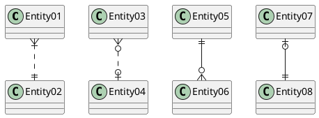
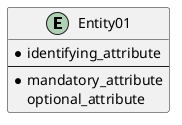
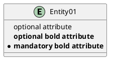
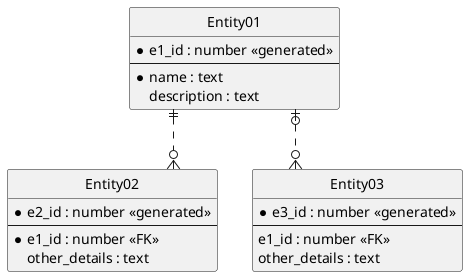

# [Plant UML](https://plantuml.com/ko/)

PlantUML 은 다이어그램을 빠르게 작성하기 위한 오픈 소스 프로젝트입니다.

## Entity Relationship Diagram

Based on the Information Engineering notation.

This is an extension to the existing [Class Diagram](https://plantuml.com/class-diagram). This extension adds:
* Additional relations for the Information Engineering notation.
* An `entity` alias that maps to the class diagram `class`.
* An additional visibility modifier `*` to identify mandatory attributes.

Otherwise, the syntax for drawing diagrams is the same as for class diagrams. All other features of class diagrams are also supported.

### Information Engineering Relations

Type | Symbol
---|---
Zero or One | `|o--`
Exactly One	| `||--`
Zero or Many | `}o--`
One or Many | `}|--`

Examples:

```java
@startuml
Entity01 }|..|| Entity02
Entity03 }o..o| Entity04
Entity05 ||--o{ Entity06
Entity07 |o--|| Entity08
@enduml
```


### Entities
```java
@startuml
entity Entity01 {
  * identifying_attribute
  --
  * mandatory_attribute
  optional_attribute
}
@enduml
```


Again, this is the normal class diagram syntax (aside from use of `entity` instead of `class`). Anything that you can do in a class diagram can be done here.

The `*` visibility modifier can be used to identify mandatory attributes. A space can be used after the modifier character to avoid conflicts with the creole bold:

```java
@startuml
entity Entity01 {
   optional attribute
   **optional bold attribute**
   * **mandatory bold attribute**
}
@enduml
```


### Complete Example
```java
@startuml

' hide the spot
hide circle

' avoid problems with angled crows feet
skinparam linetype ortho

entity "Entity01" as e01 {
  *e1_id : number <<generated>>
  --
  *name : text
  description : text
}

entity "Entity02" as e02 {
  *e2_id : number <<generated>>
  --
  *e1_id : number <<FK>>
  other_details : text
}

entity "Entity03" as e03 {
  *e3_id : number <<generated>>
  --
  e1_id : number <<FK>>
  other_details : text
}

e01 ||..o{ e02
e01 |o..o{ e03

@enduml
```


