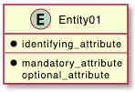
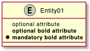
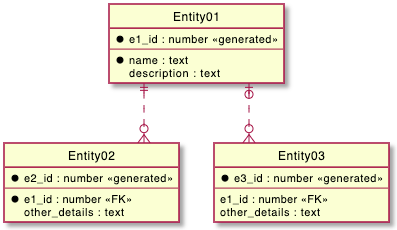

## ER(실체 관계, Entity Relationship) 다이어그램

정보 공학을 위한 [ER 다이어그램]을 그릴 수 있습니다.
이것은 [클래스 다이어그램](https://plantuml.com/class-diagram)의 확장이라 보면 됩니다.

다음과 같은 기능이 확장되었습니다:
* 일부 정보 공학을 위한 확장 관계가 추가됩니다.
* 클래스 다이어그램에서의 `class` 대신 `entity` 이라는 별칭을 사용합니다.
* 반드시 사용해야 하는 속성을 가리크는 `*` 보기 속성이 추가됩니다.

그 밖에는 클래스 다이어그램과 동일합니다. 클래스 다이어그램의 모든 기능을 이용하면 됩니다.

### 정보 공학 관계

형식 | 심볼
---|---
없거나 또는 한개 (Zero or One) | `|o--`
정확히 한개 (Exactly One)	| `||--`
없거나 또는 많은 (Zero or Many) | `}o--`
한개 또는 많은 (One or Many) | `}|--`

예제:

```java
@startuml
Entity01 }|..|| Entity02
Entity03 }o..o| Entity04
Entity05 ||--o{ Entity06
Entity07 |o--|| Entity08
@enduml
```


### 실체 (Entities)
```java
@startuml
entity Entity01 {
  * identifying_attribute
  --
  * mandatory_attribute
  optional_attribute
}
@enduml
```


다시 한번 클래스 다이어그램에서의 `class` 대신 `entity`를 바꾼 것과 동일한 내용입니다. 클래스 다이어그램에서의 어떤 기능도 이용할 수 있습니다.

클래스 다이어그램에서의 메서드, 필드 노출(Visibility) 정의:
* `-` : private - 해당 클래스에서만 접근 가능
* `#` : protected - 해당 클래스와 상속 받은 클래스에서 접근 가능
* `~` : package private - 해당 전체 패키지에서만 접근 가능
* `+` : public - 모든 외부에서 접근 가능

에 추가하여 꼭 사용해야 하는 속성으로 `*` 를 사용할 수 있습니다. creole 굵게 `**` 기능과 충돌하지 않으려면 공백을 하나 줍니다.

```java
@startuml
entity Entity01 {
   optional attribute
   **optional bold attribute**
   * **mandatory bold attribute**
}
@enduml
```


### 최종 예제
```java
@startuml

' hide the spot
hide circle

' avoid problems with angled crows feet
skinparam linetype ortho

entity "Entity01" as e01 {
  *e1_id : number <<generated>>
  --
  *name : text
  description : text
}

entity "Entity02" as e02 {
  *e2_id : number <<generated>>
  --
  *e1_id : number <<FK>>
  other_details : text
}

entity "Entity03" as e03 {
  *e3_id : number <<generated>>
  --
  e1_id : number <<FK>>
  other_details : text
}

e01 ||..o{ e02
e01 |o..o{ e03

@enduml
```

