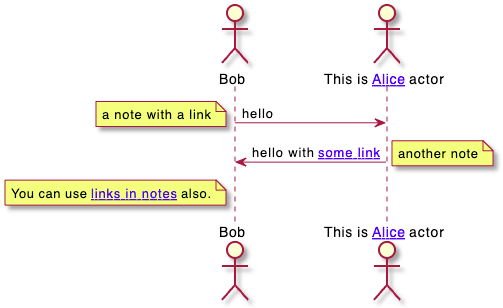
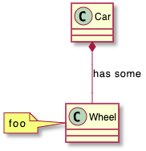
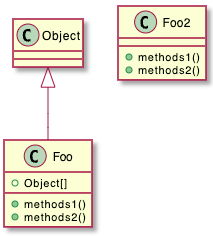
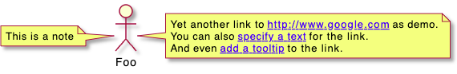
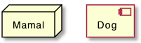

## 하이퍼링크

### 포맷 정의

#### 간단한 링크

간단한 링크는 두 개의 대괄호를 이용합니다. (클래스 다이어그램에서 필드나 메서드에서는 세 개의 대괄호를 이용합니다)

***예제:***
* `[[http://plantuml.com]]`
* `[[]]`*(empty link)*

#### 링크에 라벨을 이용
링크 대신 다른 라벨을 표현하는 것이 가능합니다. URL 이 끝나고 공백을 준 다음 라벨을 넣어주면 됩니다.

***예제:*** `[[http://plantuml.com This label is printed]]`

#### 툴팁과 같이 사용하기
중괄호를 이용하여 툴팁을 표현할 수 있습니다. URL이 끝난 직후 중괄호로 표현합니다.

***예제:*** `[[http://plantuml.com{Optional tooltip} This label is printed]]`

#### 툴팁만 표현

URL 자리에 중괄호를 이용하면 툴팁만 표현할 수 있습니다.

***예제:*** `[[{A tooltip}]]`

#### 툴팁과 라벨만 표현

URL을 빼고 중괄호와 라벨만 표현할 수 있습니다.

***예제:*** `[[{A tooltip} This label is printed]]`

#### URL 인증

[URL 인증](https://plantuml.com/url-authentication)을 이용하면 URL을 위한 인증 방식, 증명서, 프록시 설정 등을 제공할 수 있습니다.

### 중괄호를 포함한 링크
다음 예제와 같이 중괄호를 링크 안에 넣을 수 있습니다.

```java
@startuml
[[link{with_bracket}&id=10]]:Some activity\n(with link with brackets)\n""link{with_bracket}&id=10"";
[["link{with_bracket}"{}]]:Some activity\n(with link with brackets and empy tooltip)\n"""link{with_bracket}"{}"";
[["link{with_bracket}"{with tooltip}]]:Some activity\n(with link finished by brackets and tooltip)\n"""link{with_bracket}"{with tooltip}"";
[["link{with_bracket}&id=10"{with tooltip}]]:Some activity\n(with link with brackets and tooltip)\n"""link{with_bracket}&id=10"{with tooltip}"";
@enduml
```


### 시쿼스 다이어그램에서의 링크

다음과 같이 시쿼스 다이어그램에서 링크 기능을 이용할 수 있습니다:

```java
@startuml
actor Bob [[http://plantuml.com/sequence]]
actor "This is [[http://plantuml.com/sequence Alice]] actor" as Alice
Bob -> Alice [[http://plantuml.com/start]] : hello
note left [[http://plantuml.com/start]]
  a note with a link
end note
Alice -> Bob : hello with [[http://plantuml.com/start{Tooltip for message} some link]]
note right [[http://plantuml.com/start]] : another note
note left of Bob
You can use [[http://plantuml.com/start links in notes]] also.
end note
@enduml
```


### 클래스 다이어그램에서의 링크
```java
@startuml
class Car [[http://plantuml.com/link]]
class Wheel [[http://plantuml.com/sequence]]
note left [[http://plantuml.com]]
foo
end note
Car *-- Wheel [[http://plantuml.com/class]] : has some
@enduml
```


클래스의 필드나 메서드에 링크를 표현하기 위해서는 2개 대신 3개의 대괄호를 이용합니다:
```java
@startuml
class Car {
  - Some field [[[http://plantuml.com]]]
  Some method() [[[http://plantuml.com/link]]]
}
@enduml
```


```java
@startuml
Object <|-- Foo

class Foo {
  + Object[]   [[[http://www.google.com]]]
  + methods1() [[[http://www.yahoo.com/A1{Some explainations about this method}]]]
  + methods2() [[[http://www.yahoo.com/A2]]]
}
  
class Foo2 {
  + methods1() [[[http://www.yahoo.com/B1]]]
  + methods2() [[[http://www.yahoo.com/B2]]]
}
  
class Object [[http://www.yahoo.com]]
@enduml
```


### 활동 다이어그램에서의 링크

#### 활동 라벨에 링크

```java
@startuml
start
[[http://plantuml.com]]:Some activity;
:Some [[http://plantuml.com link]];
end
@enduml
```


#### 파티션에 링크

```java
@startuml
start
partition "[[http://plantuml.com partition_name]]" {
    :read doc. on [[http://plantuml.com plantuml_website]];
    :test diagram;
}
end
@enduml
```


### 네트워크 다이어그램(nwdiag)에서의 링크
```java
@startuml
nwdiag {
  network Network {
      Server [description="A [[http://plantuml.com link]] on nwdiag"];
  }
}
@enduml
```


### JSON/YAML 다이어그램에서의 링크 

#### JSON
```java
@startjson
{
"@fruit": "Apple",
"$size": "Large",
"Appli.": "A [[http://plantuml.com link]] on JSON"
}
@endjson
```


#### YAML
```java
@startyaml
@fruit: Apple
$size: Large
Appli.: A [[http://plantuml.com link]] on YAML
@endyaml
```


### 노트에서의 링크
노트의 시작부나 전체 또는 일부에 링크를 넣을 수 있습니다.

```java
@startuml
:Foo:
note left of Foo [[http://www.google.com]]
This is a note
end note

note right of Foo
Yet another link to [[http://www.google.com]] as demo.
You can also [[http://www.yahoo.fr specify a text]] for the link.
And even [[http://www.yahoo.fr{This is a tooltip} add a tooltip]] to the link.
end note
@enduml
```


### 객체에 직접 URL을 지정하는 방법

`url of XXX is [[yyy]]` 문법으로 해당 객체에 직접 URL을 지정할 수 있습니다.

#### 시쿼스 다이어그램인 경우
```java
@startuml
Bob -> Alice : ok
url of Bob is [[http://www.google.com]]
@enduml
```


#### 클래스 다이어그램인 경우
```java
@startuml
skinparam topurl http://www.google.com
Dog --|> Mammal
url of Mammal is [[/search]]
url of Dog is [[http://www.yahoo.com{This is Dog}]]
Dog o-- Cat
Cat --|> Mammal
@enduml
```


#### 유즈케이스 다이어그램인 경우
```java
@startuml
actor Mamal
usecase Dog

url of Mamal is [[http://www.google.com]]
url of Dog is [[http://www.yahoo.com{This is Dog}]]
@enduml
```


#### 컴포넌트 또는 배포 다이어그램인 경우
```java
@startuml
node Mamal
component Dog

url of Mamal is [[http://www.google.com]]
url of Dog is [[http://www.yahoo.com{This is Dog}]]
@enduml
```


### 화살표 또는 연결 링크에 하이퍼링크

#### 클래스 다이어그램인 경우
```java
@startuml
class Car 
Car *-- Wheel [[http://plantuml.com/class-diagram]] : has some
@enduml
```


#### 컴포넌트 또는 배포 다이어그램인 경우
```java
@startuml
node Car 
Car *-- Wheel [[http://plantuml.com/deployment-diagram]] : has some
@enduml
```
> 주의 : PlantUML 1.2021.12 오류 발생

#### State diagram
```java
@startuml
state Car
state CarWithWheel
Car -> CarWithWheel [[http://plantuml.com/state-diagram]] : Add wheel to car
@enduml
```
> 주의 : PlantUML 1.2021.12 오류 발생
