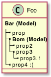
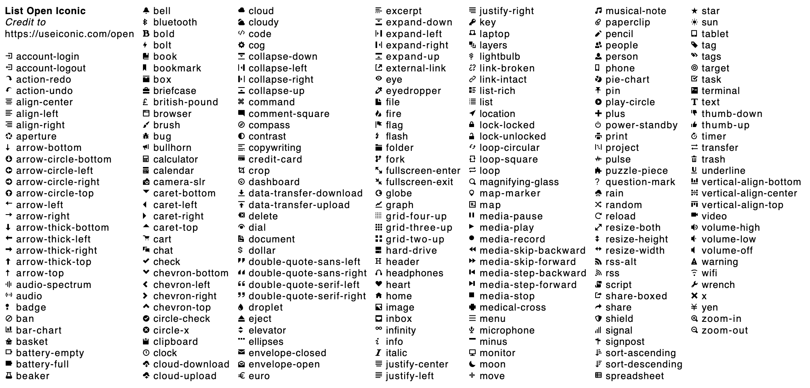

## Creole
[Creole](http://en.wikipedia.org/wiki/Creole_%28markup%29)은 여러 위키에서 공통으로 사용되는 간단한 마크업 언어입니다.
PlantUML은 이러한 Creole 엔진을 탑재하여 일반 텍스트를 원하는 결과를 얻게 합니다.

모든 다이어그램은 다음의 문법을 지원합니다.

### 텍스트의 다양한 스타일 지정

```java
@startuml
Alice -> Bob : hello --there-- here
... Some ~~long delay~~ ...
Bob -> Alice : ok
note left
  This is **bold**
  This is //italics//
  This is ""monospaced""
  This is --stricken-out--
  This is __underlined__
  This is ~~wave-underlined~~
end note
@enduml
```


### 목록
노드, 노트 등의 텍스트 목록에 번호를 매기거나 기호로 표시할 수 있습니다.

```java
@startuml
object demo {
  * Bullet list
  * Second item
}
note left
  * Bullet list
  * Second item
  ** Sub item
end note

legend
  # Numbered list
  # Second item
  ## Sub item
  ## Another sub item
        * Can't quite mix 
        * Numbers and bullets
  # Third item
end legend
@enduml
```


### 이스케이프 문자
`~` 틸드 문자를 이용하여 creole의 특별 문자를 표현할 수 있습니다.

```java
@startuml
object demo {
  This is not ~___underscored__.
  This is not ~""monospaced"".
}
@enduml
```


### 가로 구분자에서의 사용

```java
@startuml
database DB1 as "
You can have horizontal line
----
Or double line
====
Or strong line
____
Or dotted line
..My title..
Enjoy!
"
note right
  This is working also in notes
  You can also add title in all these lines
  ==Title==
  --Another title--
end note

@enduml
```


### 헤딩에 적용

```java
@startuml
usecase UC1 as "
= Extra-large heading
Some text
== Large heading
Other text
=== Medium heading
Information
....
==== Small heading"
@enduml
```


### 링크

[URL과 링크](https://plantuml.com/link)를 사용할 수 있습니다.

***예제:***
* `[[http://plantuml.com]]`
* `[[http://plantuml.com This label is printed]]`
* `[[http://plantuml.com{Optional tooltip} This label is printed]]`

[인증된](https://plantuml.com/url-authentication) URL에도 이용할 수 있습니다.

### 예전 HTML

Creole 과 다음의 예전 HTML 태그를 섞어 사용할 수 있습니다:
* `<b>` - 굵은 글씨체
* `<u>` 또는 `<u:#AAAAAA>` 또는 `<u:[[color|colorName]]>` - 밑줄
* `<i>` - 이탤릭
* `<s>` 또는 `<s:#AAAAAA>` 또는 `<s:[[color|colorName]]>` - 취소줄
* `<w>` 또는 `<w:#AAAAAA>` 또는 `<w:[[color|colorName]]>` - 파도 밑줄
* `<plain>` - 일반체
* `<color:#AAAAAA>` 또는 `<color:[[color|colorName]]>` - 색상
* `<back:#AAAAAA>` 또는 `<back:[[color|colorName]]>` - 배경 색상
* `<size:nn>` - 폰트 크기
* `` - 이미지 파일 표시
* `` - 인터넷 이미지 표시

```java
@startuml
:* You can change <color:red>text color</color>
* You can change <back:cadetblue>background color</back>
* You can change <size:18>size</size>
* You use <u>legacy</u> <b>HTML <i>tag</i></b>
* You use <u:red>color</u> <s:green>in HTML</s> <w:#0000FF>tag</w>
----
* Use image : 
;
@enduml
```


#### 일반 HTML 요소

```java
@startuml
hide footbox
note over Source
<code>
  This is <b>bold</b>
  This is <i>italics</i>
  This is <font:monospaced>monospaced</font>
  This is <s>stroked</s>
  This is <u>underlined</u>
  This is <w>waved</w>
  This is <s:green>stroked</s>
  This is <u:red>underlined</u>
  This is <w:#0000FF>waved</w>
  This is <b>a bold text containing <plain>plain text</plain> inside</b>
  -- other examples --
  This is <color:blue>Blue</color>
  This is <back:orange>Orange background</back>
  This is <size:20>big</size>
</code>
end note
/note over Output
  This is <b>bold</b>
  This is <i>italics</i>
  This is <font:monospaced>monospaced</font>
  This is <s>stroked</s>
  This is <u>underlined</u>
  This is <w>waved</w>
  This is <s:green>stroked</s>
  This is <u:red>underlined</u>
  This is <w:#0000FF>waved</w>
  This is <b>a bold text containing <plain>plain text</plain> inside</b>
  -- other examples --
  This is <color:blue>Blue</color>
  This is <back:orange>Orange background</back>
  This is <size:20>big</size>
end note
@enduml
```


#### 서브스크립트, 수퍼스크립트 [sub, sup]

```java
@startuml
:<code>
This is the "caffeine" molecule: C<sub>8</sub>H<sub>10</sub>N<sub>4</sub>O<sub>2</sub>
</code>
This is the "caffeine" molecule: C<sub>8</sub>H<sub>10</sub>N<sub>4</sub>O<sub>2</sub>
----
<code>
This is the Pythagorean theorem: a<sup>2</sup> + b<sup>2</sup> = c<sup>2</sup>
</code>
This is the Pythagorean theorem: a<sup>2</sup> + b<sup>2</sup> = c<sup>2</sup>;
@enduml
```


### 코드

`<code>` 를 사용하여 일부 프로그래밍 코드를 표현할 수 있습니다. (아직까지는 구문 하이라이킹은 안됩니다)

```java
@startuml
Alice -> Bob : hello
note right
<code>
main() {
  printf("Hello world");
}
</code>
end note
@enduml
```


다음의 예제는 `<code>`를 이용하여 Creole 특수 문자를 모두 표시하는 좋은 예시입니다:
```java
@startuml
Alice -> Bob : hello
note left
<code>
  This is **bold**
  This is //italics//
  This is ""monospaced""
  This is --stricken-out--
  This is __underlined__
  This is ~~wave-underlined~~
  --test Unicode and icons--
  This is <U+221E> long
  This is a <&code> icon
</code>
end note
note right
  This is **bold**
  This is //italics//
  This is ""monospaced""
  This is --stricken-out--
  This is __underlined__
  This is ~~wave-underlined~~
  --test Unicode and icons--
  This is <U+221E> long
  This is a <&code> icon
end note
@enduml
```


### 테이블

#### 테이블 생성
`|` 구분자를 이용하면 테이블을 만들 수 있습니다.

```java
@startuml
skinparam titleFontSize 14
title
  Example of simple table
  |= |= table |= header |
  | a | table | row |
  | b | table | row |
end title
[*] --> State1
@enduml
```


#### 열이나 셀에 색상 적용

테이블에서 열이나 셀에 [색상](https://plantuml.com/color)을 적용할 수 있습니다:

```java
@startuml
start
:Here is the result
|= |= table |= header |
| a | table | row |
|<#FF8080> red |<#80FF80> green |<#8080FF> blue |
<#yellow>| b | table | row |;
@enduml
```


#### 텍스트 또는 테두리에 색상을 줄 수 있습니다

```java
@startuml
title
<#lightblue,#red>|=  Step  |=  Date  |=  Name  |=  Status  |=  Link  |
<#lightgreen>|  1.1  |  TBD  | plantuml news |<#Navy><color:OrangeRed><b> Unknown  | [[https://plantuml.com/news plantuml news]] |
end title
@enduml
```


#### 배경과 동일한 색상을 주어 테이블 테두리 없게 하기

```java
@startuml
node n
note right of n
  <#FBFB77,#FBFB77>|= Husky / Yorkie |= Foo |
  | SourceTree1 | foo1 |
  | ST2 | foo2 |
end note
@enduml
```


#### 테이블 헤더 조정

`=`로 셀을 시작 하면 굵은체로 표현할 수 있습니다.

```java
@startuml
note as deepCSS0
  |<#white> Husky / Yorkie |
  |=<#gainsboro> SourceTree0 |
endnote

note as deepCSS1
  |= <#white> Husky / Yorkie |= Foo |
  |<#gainsboro><r> SourceTree1 | foo1 |
endnote

note as deepCSS2
  |= Husky / Yorkie |
  |<#gainsboro> SourceTree2 |
endnote

note as deepCSS3
  <#white>|= Husky / Yorkie |= Foo |
  |<#gainsboro> SourceTree1 | foo1 |
endnote
@enduml
```


### 이모지(Emoji)

트위터의 이모지 [Twemoji](https://twemoji.twitter.com/) ([깃허브 EmojiTwo](https://github.com/EmojiTwo/emojitwo) 참조)를 다음과 같이 사용할 수 있습니다:

```java
@startuml
Alice -> Bob : Hello <:1f600:>
return <:innocent:>
Alice -> Bob : Without color: <#0:sunglasses:>
Alice -> Bob : Change color: <#green:sunny:>
@enduml
```


[emoji cheat sheet](https://github.com/ikatyang/emoji-cheat-sheet/blob/master/README.md)를 참조하면 이모지 이름을 쉽게 구할 수 있습니다.

### Tree
`|_`를 이용하면 트리를 구성할 수 있습니다.
제목과 같은 곳에 쉽게 이용할 수 있습니다.

```java
@startuml
skinparam titleFontSize 14
title
  Example of Tree
  |_ First line
  |_ **Bom (Model)**
    |_ prop1
    |_ prop2
    |_ prop3
  |_ Last line
end title
[*] --> State1
@enduml
```


다음은 클래스 다이어그램에서 트리를 이용하는 방법입니다.

```java
@startuml
class Foo {
**Bar (Model)**
|_ prop
|_ **Bom (Model)**
  |_ prop2
  |_ prop3
    |_ prop3.1
|_ prop4 :(
--
}
@enduml
```


컴포넌트 또는 배포 다이어그램에서 사용하는 방법입니다.

```java
@startuml
[A] as A
rectangle "Box B" {
    component B [
        Level 1
        |_ Level 2a
          |_ Level 3a 
          |_ Level 3b
          |_ Level 3c
            |_ Level 4a
          |_ Level 3d
        |_ Level 2b
          |_ Level 3e
    ]
}
A -> B
@enduml
```


### 특수 문자
`&#XXX` 또는 `<U+XXXX>` 와 같은 방식으로 [유니코드 문자](http://www.fileformat.info/info/unicode/category/Sm/list.htm)를 사용할 수 있습니다:

```java
@startuml
usecase direct as "this is ∞ long"
usecase ampHash as "this is also &#8734; long"
usecase angleBrackets as "this is also <U+221E> long"
@enduml
```


### OpenIconic
[OpenIconic](https://useiconic.com/open/)는 매우 유용한 오프소스 아이콘 집합입니다. Creole 파서에 포함되어 있으므로 쉽게 이용할 수 있습니다.
`<&ICON_NAME>` 방식으로 이용하면 됩니다.

```java
@startuml
title: <size:20><&heart>Use of OpenIconic<&heart></size>
class Wifi
note left
  Click on <&wifi>
end note
@enduml
```


다음의 명령으로 해당 아이콘 목록을 쉽게 구할 수 있습니다.

```java
@startuml
listopeniconic
@enduml
```


### 부록: 모든 다이어그램에서의 "Creole 목록" 예제

#### 활동 다이어그램

```java
@startuml
start
:**test list 1**
* Bullet list
* Second item
** Sub item
*** Sub sub item
* Third item
----
**test list 2**
# Numbered list
# Second item
## Sub item
## Another sub item
# Third item;
stop
@enduml
```


#### 클래스 다이어그램

```java
@startuml

class a {
**test list 1**
* Bullet list
* Second item
** Sub item
*** Sub sub item
* Third item
----
**test list 2**
# Numbered list
# Second item
## Sub item
## Another sub item
# Third item
}

a -- b 

@enduml
```


#### 컴포넌트, 배포, 유즈케이스 다이어그램

```java
@startuml
node n [
**test list 1**
* Bullet list
* Second item
** Sub item
*** Sub sub item
* Third item
----
**test list 2**
# Numbered list
# Second item
## Sub item
## Another sub item
# Third item
]

file f as "
**test list 1**
* Bullet list
* Second item
** Sub item
*** Sub sub item
* Third item
----
**test list 2**
# Numbered list
# Second item
## Sub item
## Another sub item
# Third item
"
@enduml
```


#### Gantt 다이어그램

> 사용할 수 없습니다.

#### 객체 다이어그램
```java
@startuml
object user {
**test list 1**
* Bullet list
* Second item
** Sub item
*** Sub sub item
* Third item
----	
**test list 2**
# Numbered list
# Second item
## Sub item
## Another sub item
# Third item
}

@enduml
```


#### 마인드맵
```java
@startmindmap

* root
** d1
**:**test list 1**
* Bullet list
* Second item
** Sub item
*** Sub sub item
* Third item
----
**test list 2**
# Numbered list
# Second item
## Sub item
## Another sub item
# Third item;


@endmindmap
```


#### 네트워크 다이어그램 (nwdiag)

```java
@startuml
nwdiag {
  network Network {
      Server [description="**test list 1**\n* Bullet list\n* Second item\n** Sub item\n*** Sub sub item\n* Third item\n----\n**test list 2**\n# Numbered list\n# Second item\n## Sub item\n## Another sub item\n# Third item"];
}
@enduml
```


#### 노트
```java
@startuml
note as n
**test list 1**
* Bullet list
* Second item
** Sub item
*** Sub sub item
* Third item
----
**test list 2**
# Numbered list
# Second item
## Sub item
## Another sub item
# Third item
end note
@enduml
```


#### 시퀀스 다이어그램

> 사용 불가 (노트 등 일부 제외)

#### 상태 다이어그램

> 사용 불가 (노트 등 일부 제외)

#### WBS
```java
@startwbs

* root
** d1
**:**test list 1**
* Bullet list
* Second item
** Sub item
*** Sub sub item
* Third item
----
**test list 2**
# Numbered list
# Second item
## Sub item
## Another sub item
# Third item;

@endwbs
```


### 부록: 모든 다이어그램에 "Creole 가로 구분줄" 사용 예제

#### 활동 다이어그램
```java
@startuml
start
:You can have horizontal line
----
Or double line
====
Or strong line
____
Or dotted line
..My title..
Or dotted title
//and title... //
==Title==
Or double-line title
--Another title--
Or single-line title
Enjoy!;
stop
@enduml
```


#### 클래스 다이어그램
```java
@startuml

class a {
You can have horizontal line
----
Or double line
====
Or strong line
____
Or dotted line
..My title..
Or dotted title
//and title... //
==Title==
Or double-line title
--Another title--
Or single-line title
Enjoy!
}

a -- b 

@enduml
```


#### 컴포넌트, 배포, 유즈케이스 다이어그램
```java
@startuml
node n [
You can have horizontal line
----
Or double line
====
Or strong line
____
Or dotted line
..My title..
//and title... //
==Title==
--Another title--
Enjoy!
]

file f as "
You can have horizontal line
----
Or double line
====
Or strong line
____
Or dotted line
..My title..
//and title... //
==Title==
--Another title--
Enjoy!
"

person p [

You can have horizontal line
----
Or double line
====
Or strong line
____
Or dotted line
..My title..
//and title... //
==Title==
--Another title--
Enjoy!

]
@enduml
```


#### 간트 차트

> 사용불가

#### 객체 다이어그램
```java
@startuml
object user {
You can have horizontal line
----
Or double line
====
Or strong line
____
Or dotted line
..My title..
//and title... //
==Title==
--Another title--
Enjoy!
}

@enduml
```


#### 마인드맵
```java
@startmindmap

* root
** d1
**:You can have horizontal line
----
Or double line
====
Or strong line
____
Or dotted line
..My title..
//and title... //
==Title==
--Another title--
Enjoy!;

@endmindmap
```


#### 네트워크 다이어그램 (nwdiag)
```java
@startuml
nwdiag {
  network Network {
      Server [description="You can have horizontal line\n----\nOr double line\n====\nOr strong line\n____\nOr dotted line\n..My title..\n//and title... //\n==Title==\n--Another title--\nEnjoy!"];
}
@enduml
```


#### 노트
```java
@startuml
note as n
You can have horizontal line
----
Or double line
====
Or strong line
____
Or dotted line
..My title..
//and title... //
==Title==
--Another title--
Enjoy!
end note
@enduml
```


#### 시퀀스 다이어그램

> 사용 불가 (노트 등 일부 제외)

#### 상태 다이어그램

> 사용 불가 (노트 등 일부 제외)

#### WBS
```java
@startwbs

* root
** d1
**:You can have horizontal line
----
Or double line
====
Or strong line
____
Or dotted line
..My title..
//and title... //
==Title==
--Another title--
Enjoy!;

@endwbs
```


### Creole과 HTML을 이용한 동일 스타일

**스타일**	| **Creole** | **기존 HTML**
---|---|---
**bold**|This is `**bold**` | This is `<b>bold</b>`
*italics* | This is `//italics//` | This is `<i>italics</i>`
`monospaced`|This is `""monospaced""`|This is `<font:monospaced>monospaced</font>`
`stroked`|This is `--stroked--`|This is `<s>stroked</s>`
<u>underlined</u>|This is `__underlined__`|This is `<u>underlined</u>`
`waved`|This is `~~waved~~`|This is `<w>waved</w>`

```java
@startmindmap
* Style equivalent\n(between Creole and HTML) 
**:**Creole**
----
<#silver>|= code|= output|
| \n This is ""~**bold**""\n | \n This is **bold** |
| \n This is ""~//italics//""\n | \n This is //italics// |
| \n This is ""~""monospaced~"" ""\n | \n This is ""monospaced"" |
| \n This is ""~--stroked--""\n | \n This is --stroked-- |
| \n This is ""~__underlined__""\n |  \n This is __underlined__ |
| \n This is ""<U+007E><U+007E>waved<U+007E><U+007E>""\n | \n This is ~~waved~~ |;
**:<b>Legacy HTML like
----
<#silver>|= code|= output|
| \n This is ""~<b>bold</b>""\n | \n This is <b>bold</b> |
| \n This is ""~<i>italics</i>""\n | \n This is <i>italics</i> |
| \n This is ""~<font:monospaced>monospaced</font>""\n | \n This is <font:monospaced>monospaced</font> |
| \n This is ""~<s>stroked</s>""\n | \n  This is <s>stroked</s> |
| \n This is ""~<u>underlined</u>""\n | \n This is <u>underlined</u> |
| \n This is ""~<w>waved</w>""\n | \n This is <w>waved</w> |

And color as a bonus...
<#silver>|= code|= output|
| \n This is ""~<s:""<color:green>""green""</color>"">stroked</s>""\n | \n  This is <s:green>stroked</s> |
| \n This is ""~<u:""<color:red>""red""</color>"">underlined</u>""\n | \n This is <u:red>underlined</u> |
| \n This is ""~<w:""<color:#0000FF>""#0000FF""</color>"">waved</w>""\n | \n This is <w:#0000FF>waved</w> |;
@endmindmap
```

