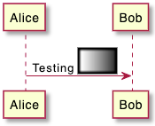
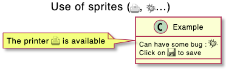

## 스프라이트 아이콘

### 스프라이트 정의

스프라이트는 다이어그램에서 직접 아이콘을 만들어 사용할 수 있는 것으로 생각하면 됩니다.
PlantUML에서 스프라이트는 흑백 또는 4, 8, 16 단계의 흑백 및 회색으로 표현할 수 있습니다.
스프라이트를 정의하기 위하여 픽셀당 0과 F 사이의 헥사데시말 숫자를 사용합니다.
그 다음 해당 스프라이트를 이용하기 위해서는 `<$XXX>` (XXX는 스프라이트 이름)과 같이 사용합니다.

```java
@startuml
sprite $foo1 {
  FFFFFFFFFFFFFFF
  F0123456789ABCF
  F0123456789ABCF
  F0123456789ABCF
  F0123456789ABCF
  F0123456789ABCF
  F0123456789ABCF
  F0123456789ABCF
  F0123456789ABCF
  FFFFFFFFFFFFFFF
}
Alice -> Bob : Testing <$foo1>
@enduml
```


스프라이트에 대한 스케일 조종도 가능합니다.

```java
@startuml
sprite $foo1 {
  FFFFFFFFFFFFFFF
  F0123456789ABCF
  F0123456789ABCF
  F0123456789ABCF
  F0123456789ABCF
  F0123456789ABCF
  F0123456789ABCF
  F0123456789ABCF
  F0123456789ABCF
  FFFFFFFFFFFFFFF
}
Alice -> Bob : Testing <$foo1{scale=3}>
@enduml
```


### 색상 변경

비록 스프라이트가 흑백으로 정의되지만 색상 변경이 가능합니다.

```java
@startuml
sprite $foo1 {
  FFFFFFFFFFFFFFF
  F0123456789ABCF
  F0123456789ABCF
  F0123456789ABCF
  F0123456789ABCF
  F0123456789ABCF
  F0123456789ABCF
  F0123456789ABCF
  F0123456789ABCF
  FFFFFFFFFFFFFFF
}
Alice -> Bob : Testing <$foo1,scale=3.4,color=orange>
@enduml
```


### 스프라이트 인코딩
다음과 같은 명령으로 스프라이트를 인코딩 할 수 있습니다:

```java
java -jar plantuml.jar -encodesprite 16z foo.png
```

`foo.png`는 사용하고자 하는 원본 이미지 파일입니다. (자동으로 흑백 전환됩니다.)
`-encodesprite` 다음에는 `4, 8, 16, 4z, 8z` 또는 `16z`를 줄 수 있는데, 이 번호는 회색 단계를 의미하고 `z`는 압축을 의미합니다.

### 예제
```java
@startuml
sprite $printer [15x15/8z] NOtH3W0W208HxFz_kMAhj7lHWpa1XC716sz0Pq4MVPEWfBHIuxP3L6kbTcizR8tAhzaqFvXwvFfPEqm0
start
:click on <$printer> to print the page;
@enduml
```


```java
@startuml
 sprite $bug [15x15/16z] PKzR2i0m2BFMi15p__FEjQEqB1z27aeqCqixa8S4OT7C53cKpsHpaYPDJY_12MHM-BLRyywPhrrlw3qumqNThmXgd1TOterAZmOW8sgiJafogofWRwtV3nCF
 sprite $printer [15x15/8z] NOtH3W0W208HxFz_kMAhj7lHWpa1XC716sz0Pq4MVPEWfBHIuxP3L6kbTcizR8tAhzaqFvXwvFfPEqm0
 sprite $disk {
   444445566677881
   436000000009991
   43600000000ACA1
   53700000001A7A1
   53700000012B8A1
   53800000123B8A1
   63800001233C9A1
   634999AABBC99B1
   744566778899AB1
   7456AAAAA99AAB1
   8566AFC228AABB1
   8567AC8118BBBB1
   867BD4433BBBBB1
   39AAAAABBBBBBC1
}

 title Use of sprites (<$printer>, <$bug>...)

 class Example {
 Can have some bug : <$bug>
 Click on <$disk> to save
 }

 note left : The printer <$printer> is available

@enduml
```


### StdLib
[PlantUML StdLib](https://github.com/plantuml/plantuml-stdlib)는 아키텍쳐, 클라우드 서비스 로고 등등의 IT 분야에 필요한 다양한 다양한 아이콘을 가지고 있습니다. 또한 AWS, 애저, 쿠버네티스, C4 등을 비롯한 다양한 로고 집합도 포함합니다. 이러한 것들을 살펴보려면:
* 깃허브의 [PlantUML StdLib](https://github.com/plantuml/plantuml-stdlib) 살펴보기
* 관신있는 StdLib의 소스 저장소를 살펴볼 수 있습니다. 하나의 예제로 [logos](https://github.com/plantuml/plantuml-stdlib/tree/master/logos)에 관심이 있다면 [gilbarbara-plantuml-sprites](https://github.com/rabelenda/gilbarbara-plantuml-sprites)를 참조하거나 빠르게 [sprites-list](https://github.com/rabelenda/gilbarbara-plantuml-sprites/blob/master/sprites-list.md)에서 스프라이트 이름과 아이콘 목록을 확인할 수 있습니다. (비록 아이콘 자체는 칼라로 나오지만 실제로는 흑백 계열입니다)
* [Hitchhiker’s Guide to PlantUML](https://crashedmind.github.io/PlantUMLHitchhikersGuide/index.html)를 공부하면 해당 Stdlib를 더 잘 사용하거나 또 다른 Stdlib를 만들 수 있습니다. 다음 두 부분을 공부하면 좋습니다.
  * [Standard Library Sprites](https://crashedmind.github.io/PlantUMLHitchhikersGuide/PlantUMLSpriteLibraries/plantuml_sprites.html#standard-library-sprites)
  * [PlantUML Stdlib Overview](https://crashedmind.github.io/PlantUMLHitchhikersGuide/Stdlib/StdLibOverview.html)

### 스프라이트 목록
`listsprites` 명령을 이용하여 스프라이트 목록을 확인할 수 있습니다:
* [아키메이트 스프라이트](https://plantuml.com/archimate-diagram#9a3dbeaa372bf477)를 확인할 수 있습니다
* 만약 어떤 스프라이트 라이브러리를 다이어그램에 사용하려면 다음 설명처럼 모든 아이콘 목록을 확인할 수 있습니다. [View all the icons with listsprites](https://crashedmind.github.io/PlantUMLHitchhikersGuide/NetworkUsersMachines/NetworkUsersMachines.html#view-all-the-icons-with-listsprites) (예제로 [Hitchhikers Guide to PlantUML](https://crashedmind.github.io/PlantUMLHitchhikersGuide/NetworkUsersMachines/NetworkUsersMachines.html#source))

```java
@startuml

!define osaPuml https://raw.githubusercontent.com/Crashedmind/PlantUML-opensecurityarchitecture2-icons/master
!include osaPuml/Common.puml
!include osaPuml/User/all.puml

listsprites
@enduml
```


위의 예에서 보는 것 처럼 대부분의 컬렉션은 `all` 이라는 이름의 서브 컬렉션을 주어 모든 아이콘을 한꺼번에 볼 수 있게 합니다. 그렇지 않으면 하나 하나 찾아야 합니다. 불행히도 StdLib의 버전 컬렉션은 `all` 파일을 가지고 있지 않기 때문에 위의 예에서 보는 것과 같이 StdLib가 아닌 깃허브에서 참조하였습니다.

모든 스프라이트는 회색스케일 입니다만 벤더 특화된 적정한 색상을 가지는 특정 매크로를 정의하는 컬렉션을 가지고 있습니다.
