# PlantUML

[Plant UML](https://plantuml.com/ko/) 은 다이어그램을 빠르게 작성하기 위한 오픈 소스 프로젝트입니다. ([깃허브 저장소 위치](https://github.com/plantuml/plantuml))

일반적으로 UML 같은 표준 다이어그램은 그리는 방법 등을 정의해 놓고 그것을 실제로 그리는 소프트웨어는 다 경우마다 다릅니다.
다음은 몇 가지 UML 툴 또는 서비스를 보여줍니다.

* [Microsoft Visio](https://guru99.live/Z5V3Ur)
* [StarUML](http://staruml.io/)
* [Umbrello](https://umbrello.kde.org/)
* [UML Designer Tool](http://www.umldesigner.org/)

그 이외에도 수십가지 이상의 툴이나 서비스가 존재합니다.

문제는 어느 것 하나가 아주 모든 경우에 딱 원하는 다이어그램을 모두 그릴 수 없다는 것에 있습니다.
또한 개별 툴이나 서비스를 이용해야기에 필요에 따라 해당 프로그램을 설치하고 만들고 저장하고 개별로 관리해야하는 번거로움이 존재합니다.

그런 것에 비해 PlantUML의 경우 [Markdown](https://ko.wikipedia.org/wiki/마크다운) 과 유사하다 할 수 있겠습니다.
MS 워드를 비롯하여 드림위버 등과 같이 직접 HTML을 [위즈위그](https://ko.wikipedia.org/wiki/위지위그) 방식으로 편집하는 편집기가 많이 있지만 많은 개발자들 에게는 이런 마크다운이 훨씬 더 다루기 쉽고 관리하기 쉽고 수정하기 쉽게 느껴집니다.

이 PlantUML 역시 동일하다고 볼 수 있겠습니다. 비록 바로 GUI 기반의 객체나 요소 링크를 [위즈위그](https://ko.wikipedia.org/wiki/위지위그) 방식으로 만들 수는 없지만 간단하게 텍스트 기반으로 기술해 주면 그것이 훌륭하게 UML 다이어그램으로 결과가 나타납니다.

코딩을 좋아하는 개발자들은 별도 관리가 필요한 개별 툴 보다는 이런 방식의 다이얼로그 생성을 더 좋아할 수 있습니다.

중요한 것은 이 PlantUML을 작성하고 결과를 바로 바로 확인할 수 있는 마크다운 에디터 같은 것이 있어야 하는데 그것을 [Visual Studio Code](https://code.visualstudio.com)로 할 수 있습니다. IDE로 유명한 [JetBrains](https://www.jetbrains.com)의 많은 언어 별 플랫폼 별 IDE가 존재합니다.
하지만 최근의 개발 추세와 같이 [MSA](https://wooaoe.tistory.com/57) 아키텍쳐 개발 방법 및 그에 따른 [폴리글랏](https://sungjk.github.io/2018/06/10/polyglot-programming.html) 이라는 다양한 언어를 하나의 프로젝트에 이용하는 것은 어찌보면 현재는 지극히 당연한 것으로 보이는데 거기에 제일 잘 부합하는 IDE가 바로 VSCode 라는데는 의심의 여지가 없습니다.
이런 하나의 IDE 환경에 PlantUML과 같은 문서도 가능하다면, 정말 진정 막강한 하나의 IDE (통합 개발 환경)을 넘어선 IPE (통합 프로젝트 환경) 이 되지 않을까 싶네요.

## PlantUML을 편집하고 결과를 볼 수 있는 환경

### VSCode 이용하는 방법
[Visual Studio Code](https://code.visualstudio.com)를 이용하여 PlantUML을 편집하고 보는 방법입니다.
VSCode가 이미 설치되었다고 가정합니다. 

VSCode 에서 핵심은 [확장](https://code.visualstudio.com/docs/editor/extension-marketplace)에 있다고 생각합니다.
새로운 언어가 등장했을 때 별도 IDE를 또 만들어야 하는 부담감 없이 VSCode에 확장으로 간단히 추가할 수 있기 때문입니다.
그 뿐만 아니라 PlantUML 등을 비롯한 수많은 확장이 지금 이 시간에도 계속해서 늘어나고 있습니다.

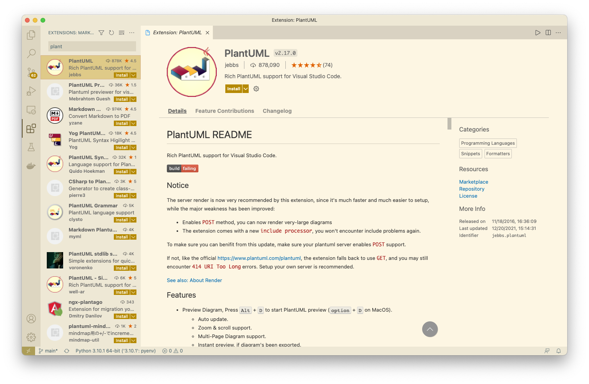
위와 같이 확장에서 `PlantUML` 이라 검색하여 위와 같은 확장을 설치합니다.


사용 방법은 `.md` 마크다운 확장자를 가진 일반 마크다운 파일을 만들어 편집을 합니다. 


마크다운 편집창의 우측 상단에 `Markdown Preview Enhanced` 아이콘 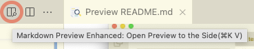을 눌러 위의 캡쳐 이미지와 같이 우측에 UML 다이어그램을 포함한 마크다운의 HTML 결과를 실시간으로 확인할 수 있는 창이 나타납니다.

보통 마크다운 편집에서 코드를 표현하려면,

````
```python
import sys
sys.stdout.write('Hello world.')
```
````
라고 합니다만, PlantUML을 위해서 `plantuml` 이라고 주면 됩니다.

````

````

그러면 우측 `마크다운 프리뷰` 화면에는 다음과 같은 다이얼로그를 보실 수 있습니다.


또한 `마크다운 프리뷰` 화면에서 마우스 오른쪽 단추를 이용하여 HTML 결과 혹은 PDF 결과로 출력할 수도 있습니다. 다만 PDF 출력을 위해서는 `prince`라는 툴을 설치해야 하는데, Mac 에서는 다음과 같이 설치가 가능합니다.

```sh
brew install prince
```
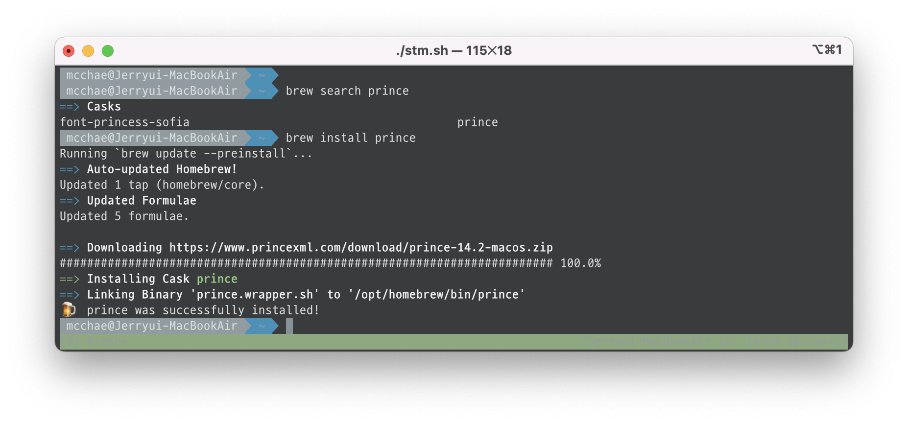

> 윈도우나 리눅스에는 다른 상황일 수 있으나 검색해 보면 쉽게 동일 결과를 얻을 수 있을 것입니다.

다음은 각 섹션 별로 개별 UML 다이어그램을 만드는 것을 확인해 보겠습니다.


## 시퀀스 다이어그램 (Sequence Diagram)

### 기본 예제

시퀀스 `->`는 두 참가자(participants) 사이에 메시지를 그리는 방법입니다. 참가자는 별도 선언을 하지 않아도 됩니다.
점선으로 되어 있는 화살표는 `-->`를 이용하면 됩니다.
위의 경우 왼쪽에서 오른쪽으로 가는 화살표 방향을 보이지만, `<-` 과 `<--`를 이용하면 반대방향의 화살표를 표현할 수 있습니다.
이런 시퀀스 표현법은 해당 다이어그램에만 적용됩니다.

```java
@startuml
Alice -> Bob: Authentication Request
Bob --> Alice: Authentication Response

Alice -> Bob: Another authentication Request
Alice <-- Bob: Another authentication Response
@enduml
```


### 참가자(participant) 선언

`participant` 키워드를 이용하여 참가자의 순서를 바꿀 수 있습니다.
또한, 참가자 선언에 다음과 같은 키워드를 사용 할 수 있습니다.

* actor
* boundary
* control
* entity
* database
* collections

```java
@startuml
actor Foo1
boundary Foo2
control Foo3
entity Foo4
database Foo5
collections Foo6
Foo1 -> Foo2 : To boundary
Foo1 -> Foo3 : To control
Foo1 -> Foo4 : To entity
Foo1 -> Foo5 : To database
Foo1 -> Foo6 : To collections
@enduml
```


`as` 키워드를 이용하여 참가자의 이름을 변경 할 수 있습니다.
또한, 참가자(actor, participant)의 `배경 색`을 변경 할 수도 있습니다.

> 각 줄에 따옴표' 를 이용하여 코맨트를 할 수 있습니다.
> 여러 줄 코멘트는 `/'` 로 시작하여 `'/`로 끝납니다.

```java
@startuml
actor Bob #red
' The only difference between actor
'and participant is the drawing
participant Alice
participant "I have a really\nlong name" as L #99FF99
/' You can also declare:
   participant L as "I have a really\nlong name"  #99FF99
  '/

Alice->Bob: Authentication Request
Bob->Alice: Authentication Response
Bob->L: Log transaction
@enduml
```


`order` 키워드를 이용하여, 참가자의 출력 순서를 지정할 수 있습니다.

```java
@startuml
participant Last order 30
participant Middle order 20
participant First order 10
@enduml
```


### 참가자에 특수문자 사용

따옴표를 사용하여 참가자를 정의할 수 있습니다. 그리고 `as` 키워드를 사용하여 참가자를 별칭으로 사용 할 수도 있다.

```java
@startuml
Alice -> "Bob()" : Hello
"Bob()" -> "This is very\nlong" as Long
' You can also declare:
' "Bob()" -> Long as "This is very\nlong"
Long --> "Bob()" : ok
@enduml
```


### 자신에게 메시지 보내기

참가자는 자기 자신에게 메시지를 보낼 수 있습니다.
`\n` 을 이용해서 여러 줄로 쓰는 것도 가능합니다

```java
@startuml
Alice->Alice: This is a signal to self.\nIt also demonstrates\nmultiline \ntext
@enduml
```


### 텍스트 정렬
응답 메세지 텍스트를 화살표 아래에 배치할 수 있습니다.
``` sh
skinparam responseMessageBelowArrow true 
```
위의 명령을 이용하여 응답 메세지 텍스트를 화살표 하단에 배치할 수 있습니다.

```java
@startuml
skinparam responseMessageBelowArrow true
Bob -> Alice : hello
Alice -> Bob : ok
@enduml
```


### 화살표 스타일 변경
다음 방법으로 화살표 스타일을 바꿀 수 있습니다.

* 끝 부분에 x를 추가하여 메시지가 전달되지 않았음을 표시
* `<` 나 `>` 대신에 `\` 나 `/` 를 사용해서 아래쪽이나 위쪽 화살표만 표시
* `>`를 두번 사용하여 화살표 모양을 얇게 표시 (예. `>>`)
* `-` 대신 `--` 를 사용해서 점선 화살표를 표시
* 화살표 다음에 `o` 추가
* 양쪽 끝에 화살표 추가

```java
@startuml
Bob ->x Alice
Bob -> Alice
Bob ->> Alice
Bob -\ Alice
Bob \\- Alice
Bob //-- Alice

Bob ->o Alice
Bob o\\-- Alice

Bob <-> Alice
Bob <->o Alice
@enduml
```


### 화살표 색상 변경
다음의 표기법을 이용해서 각각 화살표의 색상을 바꿀 수 있습니다.

```java
@startuml
Bob -[#red]> Alice : hello
Alice -[#0000FF]->Bob : ok
@enduml
```


### 메시지 순서에 번호 매기기

`autonumber` 키워드는 메시지에 자동으로 번호를 매길 때 사용합니다.

```java
@startuml
autonumber
Bob -> Alice : Authentication Request
Bob <- Alice : Authentication Response
@enduml
```


`autonumber 시작번호` 의 형태로 표시하면 특정 번호로 시작 할 수 있으며, 
`autonumber 시작번호 증가값` 으로 표시 할 경우 증가 값을 조정하는 것도 가능합니다.

```java
@startuml
autonumber
Bob -> Alice : Authentication Request
Bob <- Alice : Authentication Response

autonumber 15
Bob -> Alice : Another authentication Request
Bob <- Alice : Another authentication Response

autonumber 40 10
Bob -> Alice : Yet another authentication Request
Bob <- Alice : Yet another authentication Response

@enduml
```


쌍따옴표를 이용하여 표시 형식을 바꿀 수도 있습니다.
표시 형식은 자바 클래스 `DecimalFormat` 을 사용합니다. 
(0 은 숫자를 의미하며, # 은 숫자로 표시하되, 빈 자리이면 0 으로 채우라는 뜻이다).
몇 가지 html 태그를 사용 할 수 있다.

```java
@startuml
autonumber "<b>[000]"
Bob -> Alice : Authentication Request
Bob <- Alice : Authentication Response

autonumber 15 "<b>(<u>##</u>)"
Bob -> Alice : Another authentication Request
Bob <- Alice : Another authentication Response

autonumber 40 10 "<font color=red><b>Message 0  "
Bob -> Alice : Yet another authentication Request
Bob <- Alice : Yet another authentication Response

@enduml
```


또한, `autonumber stop` 키워드를 이용하여 번호 매김을 일시 정지할 수 있으며, 
`autonumber resume 증가값 표시형식` 키워드를 이용하여 계속해서 번호를 매길 수 있습니다.

```java
@startuml
autonumber 10 10 "<b>[000]"
Bob -> Alice : Authentication Request
Bob <- Alice : Authentication Response

autonumber stop
Bob -> Alice : dummy

autonumber resume "<font color=red><b>Message 0  "
Bob -> Alice : Yet another authentication Request
Bob <- Alice : Yet another authentication Response

autonumber stop
Bob -> Alice : dummy

autonumber resume 1 "<font color=blue><b>Message 0  "
Bob -> Alice : Yet another authentication Request
Bob <- Alice : Yet another authentication Response
@enduml
```


### 페이지 제목, 머리말과 꼬리말

`title` 키워드를 이용하여 페이지에 제목을 추가할 수 있다.
또한, `header` 와 `footer` 를 이용하여, 각각 머리말과 꼬리말을 표시할 수도 있다.

```java
@startuml

header Page Header
footer Page %page% of %lastpage%

title Example Title

Alice -> Bob : message 1
Alice -> Bob : message 2

@enduml
```


### 다이어그램 분리

`newpage` 키워드를 이용하여, 다이어그램을 여러 개의 이미지로 분리 할 수 있습니다.
`newpage` 키워드 뒤에 바로 새로 생성되는 페이지의 제목을 넣을 수 있습니다.
여러 페이지에 걸쳐 있는 긴 다이어그램을 출력할 때 유용하다.
> 주: 예제에서 첫 번째 페이지만 표시되었지만, 실제로 잘 동작하는 기능입니다.

```java
@startuml

Alice -> Bob : message 1
Alice -> Bob : message 2

newpage

Alice -> Bob : message 3
Alice -> Bob : message 4

newpage A title for the\nlast page

Alice -> Bob : message 5
Alice -> Bob : message 6
@enduml
```


### 메세지 그룹화
다음과 같은 키워드들을 사용하여 메세지를 그룹화 할 수 있습니다
* `alt`/`else`
* `opt`
* `loop`
* `par`
* `break`
* `critical`
* `group` 화면에 보여질 텍스트

헤더에 표시될 텍스트를 추가할 수 있습니다. (`group` 제외).
`end` 키워드는 그룹을 닫는데 사용합니다.
또한, 그룹을 중첩해서 만들 수도 있습니다.

```java
@startuml
Alice -> Bob: Authentication Request

alt successful case

    Bob -> Alice: Authentication Accepted

else some kind of failure

    Bob -> Alice: Authentication Failure
    group My own label
    Alice -> Log : Log attack start
        loop 1000 times
            Alice -> Bob: DNS Attack
        end
    Alice -> Log : Log attack end
    end

else Another type of failure

   Bob -> Alice: Please repeat

end
@enduml
```


### 2차 그룹 라벨

`group`에서 `[` 와 `]` 사이에 2차 텍스트 라벨을 지정해 줄 수 있습니다.

```java
@startuml
Alice -> Bob: Authentication Request
Bob -> Alice: Authentication Failure
group My own label [My own label 2]
    Alice -> Log : Log attack start
    loop 1000 times
        Alice -> Bob: DNS Attack
    end
    Alice -> Log : Log attack end
end
@enduml
```


### 메시지에 노트 추가하기
메시지 다음에 `note left` 나 `note right` 키워드를 이용하여, 메시지에 노트를 추가할 수 있습니다.
또한, 한 번에 여러 줄의 노트를 추가하는 경우에는 `end note` 를 이용하여, 노트의 끝을 표시해 주어야 합니다.

```java
@startuml
Alice->Bob : hello
note left: this is a first note

Bob->Alice : ok
note right: this is another note

Bob->Bob : I am thinking
note left
a note
can also be defined
on several lines
end note
@enduml
```


### 다른 형태의 노트들

`note left of` , `note right of`, `note over` 키워드를 이용하여 참가자의 상대적인 위치에 노트를 추가할 수 있습니다.
노트의 배경 색을 변경함으로써, 노트를 강조하는 것도 가능합니다.
한 번에 여러 줄의 노트를 추가하는 경우에는, `end note` 를 이용하여 노트의 끝을 표시해 주어야 합니다.

```java
@startuml
participant Alice
participant Bob
note left of Alice #aqua
This is displayed
left of Alice.
end note

note right of Alice: This is displayed right of Alice.

note over Alice: This is displayed over Alice.

note over Alice, Bob #FFAAAA: This is displayed\n over Bob and Alice.

note over Bob, Alice
This is yet another
example of
a long note.
end note
@enduml
```


### 노트 모양 바꾸기

`hnote` 와 `rnote` 키워드를 이용하여, 노트의 모양을 바꿀 수 있습니다.

```java
@startuml
caller -> server : conReq
hnote over caller : idle
caller <- server : conConf
rnote over server
 "r" as rectangle
 "h" as hexagon
endrnote
@enduml
```


### 모든 참가자 위에 표시되는 노트 [across]

다음의 문법을 이용해서 모든 참가자에 걸치도록 노트를 작성할 수 있습니다:
`note across: note_description`

```java
@startuml
Alice->Bob:m1
Bob->Charlie:m2
note over Alice, Charlie: Old method for note over all part. with:\n ""note over //FirstPart, LastPart//"".
note across: New method with:\n""note across""
Bob->Alice
hnote across:Note across all part.
@enduml
```


### 동일 라인으로 정렬되는 노트 [/]
`/`를 이용하여 동일 라인에 정렬되는 노트를 만들 수 있습니다.

#### `/`가 없는 경우
```java
@startuml
note over Alice : initial state of Alice
note over Bob : initial state of Bob
Bob -> Alice : hello
@enduml
```


#### `/`가 있는 경우

```java
@startuml
note over Alice : initial state of Alice
/ note over Bob : initial state of Bob
Bob -> Alice : hello
@enduml
```


### Creole 과 HTML
[creole 문법](https://plantuml.com/ko/creole)을 사용할 수 있습니다.

```java
@startuml
participant Alice
participant "The **Famous** Bob" as Bob

Alice -> Bob : hello --there--
... Some ~~long delay~~ ...
Bob -> Alice : ok
note left
  This is **bold**
  This is //italics//
  This is ""monospaced""
  This is --stroked--
  This is __underlined__
  This is ~~waved~~
end note

Alice -> Bob : A //well formatted// message
note right of Alice
 This is <back:cadetblue><size:18>displayed</size></back>
 __left of__ Alice.
end note
note left of Bob
 <u:red>This</u> is <color #118888>displayed</color>
 **<color purple>left of</color> <s:red>Alice</strike> Bob**.
end note
note over Alice, Bob
 <w:#FF33FF>This is hosted</w> by 
end note
@enduml
```


### 구분자

`==` 구분자를 이용하여, 다이어그램을 논리적인 단계로 구분하여 나눌 수 있습니다.

```java
@startuml

== Initialization ==

Alice -> Bob: Authentication Request
Bob --> Alice: Authentication Response

== Repetition ==

Alice -> Bob: Another authentication Request
Alice <-- Bob: another authentication Response

@enduml
```


### 참조

`ref over` 키워드를 이용하여, 다이어그램에 참조를 표시할 수 있습니다.

```java
@startuml
participant Alice
actor Bob

ref over Alice, Bob : init

Alice -> Bob : hello

ref over Bob
  This can be on
  several lines
end ref
@enduml
```


### 지연
`...` 을 이용하여, 다이어그램에 지연 상태를 나타낼 수 있으며, 그 위에 메시지를 추가할 수도 있습니다.

```java
@startuml

Alice -> Bob: Authentication Request
...
Bob --> Alice: Authentication Response
...5 minutes latter...
Bob --> Alice: Bye !

@enduml
```


### 문장 줄 바꿈
긴 메시지를 줄 바꿈하려면, 문장 안에 `\n`을 추가합니다.
또 다른 방법은 `maxMessageSize` 설정을 사용합니다.

```java
@startuml
skinparam maxMessageSize 50
participant a
participant b
a -> b :this\nis\nmanually\ndone
a -> b :this is a very long message on several words
@enduml
```


### 공백
`|||` 을 이용하여 다이어그램에 공백을 나타낼 수 있으며, 공백에 얼마만큼의 픽셀을 사용할 것인지 숫자로 명시할 수도 있습니다.

```java
@startuml

Alice -> Bob: message 1
Bob --> Alice: ok
|||
Alice -> Bob: message 2
Bob --> Alice: ok
||45||
Alice -> Bob: message 3
Bob --> Alice: ok

@enduml
```


### 생명선 활성화 및 비활성화
`activate` 와 `deactivate` 는 참가자의 활성화 여부를 표현하는데 사용합니다.
참가자가 활성화되면, 참가자의 생명선이 나타납니다.
`activate` 와 `deactivate` 는 바로 이전의 메시지에 적용됩니다.
`destroy` 는 참가자의 생명선이 끝났음을 표현합니다.

```java
@startuml
participant User

User -> A: DoWork
activate A

A -> B: << createRequest >>
activate B

B -> C: DoWork
activate C
C --> B: WorkDone
destroy C

B --> A: RequestCreated
deactivate B

A -> User: Done
deactivate A

@enduml
```


생명선은 중첩해서 사용할 수 있으며, 생명선에 색을 넣을 수도 있습니다.

```java
@startuml
participant User

User -> A: DoWork
activate A #FFBBBB

A -> A: Internal call
activate A #DarkSalmon

A -> B: << createRequest >>
activate B

B --> A: RequestCreated
deactivate B
deactivate A
A -> User: Done
deactivate A

@enduml
```


### 리턴
리턴 메시지를 생성하는 `return` 명령이 추가되었습니다. 리턴되는 지점은 가장 최근에 생명선을 활성화 시킨 지점에서 출발점이 됩니다. 
문법은 간단히 `return 꼬리표` 이며, 꼬리표는 기존의 메시지와 마찬가지로 임의의 문자열을 쓸 수 있습니다.

```java
@startuml
Bob -> Alice : hello
activate Alice
Alice -> Alice : some action
return bye
@enduml
```


### 참가자 생성

해당 메시지가 실제로 새 객체를 생성한다는 걸 나타내기 위해, 참가자가 첫 번째 메시지를 수신하기 전 `create` 키워드를 사용할 수 있습니다.

```java
@startuml
Bob -> Alice : hello

create Other
Alice -> Other : new

create control String
Alice -> String
note right : You can also put notes!

Alice --> Bob : ok

@enduml
```


### 생명선 활성화, 비활성화 및 참가자 생성을 위한 간단 표시 사용법

특정 참가자를 명시한 후 바로 다음과 같은 표시를 특정 의미로 사용할 수 있습니다:

* `++` 해당 참가자의 생명선 시작 (선택적으로 `#color` 로 칼러 지정 가능)
* `--` 생명선 비활성화 (또는 `return` 으로 비활성화)
* `**` 참가자 생성
* `!!` 생명선 제거

```java
@startuml
alice -> bob ++ : hello
bob -> bob ++ : self call
bob -> bib ++  #005500 : hello
bob -> george ** : create
return done
return rc
bob -> george !! : delete
return success
@enduml
```


### 외부에서 들어오거나 외부로 나가는 메시지

시퀀스 다이어그램에서 외부에서 들어오는 화살표 또는 외부로 나가는 화살표를 표현할 수 있습니다.
`[` 로 시작하면 외부에서 들어오는 화살표, `]`로 끝나면 외부로 나가는 화살표를 나타냅니다.

```java
@startuml
[-> A: DoWork

activate A

A -> A: Internal call
activate A

A ->] : << createRequest >>

A<--] : RequestCreated
deactivate A
[<- A: Done
deactivate A
@enduml
```


또한 화사표 모양을 다음과 같이 바꿀 수 있습니다:

```java
@startuml
[-> Bob
[o-> Bob
[o->o Bob
[x-> Bob

[<- Bob
[x<- Bob

Bob ->]
Bob ->o]
Bob o->o]
Bob ->x]

Bob <-]
Bob x<-]
@enduml
```


### 짧은 외부에서 들어오거나 외부로 나가는 메시지

이전의 `[` 나 `]` 대신 `?`를 이용합니다.

```java
@startuml
?-> Alice    : ""?->""\n**short** to actor1
[-> Alice    : ""[->""\n**from start** to actor1
[-> Bob      : ""[->""\n**from start** to actor2
?-> Bob      : ""?->""\n**short** to actor2
Alice ->]    : ""->]""\nfrom actor1 **to end**
Alice ->?    : ""->?""\n**short** from actor1
Alice -> Bob : ""->"" \nfrom actor1 to actor2
@enduml
```


### Anchors and Duration
`teoz` 속성을 이용하여 특정 시간의 앵커를 명시할 수 있습니다.

```java
@startuml
!pragma teoz true

{start} Alice -> Bob : start doing things during duration
Bob -> Max : something
Max -> Bob : something else
{end} Bob -> Alice : finish

{start} <-> {end} : some time

@enduml
```


### Stereotypes 과 Spots

`<<` 과 `>>` 를 이용하여 스테리오타입을 지정할 수 있습니다. 이 스테레오파입 안에 `(X,color)`과 같은 형식으로 스팟(아이콘)을 지정 색상으로 표현할 수 있습니다.

```java
@startuml

participant "Famous Bob" as Bob << Generated >>
participant Alice << (C,#ADD1B2) Testable >>

Bob->Alice: First message

@enduml
```


기본적으로 스테레오타입에 표시되는 것은 `guillemet` 글자 입니다만,
```
skinparam guillemet false
```
위와 같이 설정하여 다르게 표현할 수 있습니다. 
> 바로 이전의 다이얼로그와 비교해 보십시오.

```java
@startuml

skinparam guillemet false
participant "Famous Bob" as Bob << Generated >>
participant Alice << (C,#ADD1B2) Testable >>

Bob->Alice: First message

@enduml
```


또한 다음과 같이 스팟만 표현할 수도 있습니다.
```java
@startuml

participant Bob << (C,#ADD1B2) >>
participant Alice << (C,#ADD1B2) >>

Bob->Alice: First message

@enduml
```


### 제목에 보다 다양한 표현 방법

제목에 [creole 문법](https://plantuml.com/ko/creole)을 사용할 수 있습니다.

```java
@startuml

title __Simple__ **communication** example

Alice -> Bob: Authentication Request
Bob -> Alice: Authentication Response

@enduml
```


또한 제목에 `\n` 과 같은 개행 문자도 넣을 수 있습니다.

```java
@startuml

title __Simple__ communication example\non several lines

Alice -> Bob: Authentication Request
Bob -> Alice: Authentication Response

@enduml
```


또한 여러 줄의 제목을 넣기 위해서 `title` 과 `end title` 키워드를 이용해도 됩니다.

```java
@startuml

title
 <u>Simple</u> communication example
 on <i>several</i> lines and using <font color=red>html</font>
 This is hosted by 
end title

Alice -> Bob: Authentication Request
Bob -> Alice: Authentication Response

@enduml
```


### 참가자 테두리
`box` 와 `end box` 명령을 이용하여 참가자에 대한 테두리를 줄 수 있습니다.
`box` 키워드 뒤에 제목과 컬러 등의 정보를 함께 줄 수 있습니다.

```java
@startuml

box "Internal Service" #LightBlue
participant Bob
participant Alice
end box
participant Other

Bob -> Alice : hello
Alice -> Other : hello

@enduml
```


### 하단 참가자 표시 제거
`hide footbox` 키워드를 이용하여 다이어그램에서 하단 참가자 표시를 제거할 수 있습니다.

```java
@startuml

hide footbox
title Footer removed

Alice -> Bob: Authentication Request
Bob --> Alice: Authentication Response

@enduml
```


### Skinparam

`skinparam` 명령어를 이용하면 전체 다이어그램의 폰트, 컬러 등을 쉽게 바꿀 수 있습니다.

다음과 같은 명령이 가능합니다:
* 다이어그램 선언부에서 다른 명령들 처럼 지정,
* `included file`에 지정,
* `command line` 이나 `ANT task`에 제공되는 설정파일에 지정.
* In a configuration file, provided in the `command line` or the `ANT task`.

다음과 같은 예제를 확인하세요.

```java
@startuml
skinparam sequenceArrowThickness 2
skinparam roundcorner 20
skinparam maxmessagesize 60
skinparam sequenceParticipant underline

actor User
participant "First Class" as A
participant "Second Class" as B
participant "Last Class" as C

User -> A: DoWork
activate A

A -> B: Create Request
activate B

B -> C: DoWork
activate C
C --> B: WorkDone
destroy C

B --> A: Request Created
deactivate B

A --> User: Done
deactivate A

@enduml
```


```java
@startuml
skinparam backgroundColor #EEEBDC
skinparam handwritten true

skinparam sequence {
ArrowColor DeepSkyBlue
ActorBorderColor DeepSkyBlue
LifeLineBorderColor blue
LifeLineBackgroundColor #A9DCDF

ParticipantBorderColor DeepSkyBlue
ParticipantBackgroundColor DodgerBlue
ParticipantFontName Impact
ParticipantFontSize 17
ParticipantFontColor #A9DCDF

ActorBackgroundColor aqua
ActorFontColor DeepSkyBlue
ActorFontSize 17
ActorFontName Aapex
}

actor User
participant "First Class" as A
participant "Second Class" as B
participant "Last Class" as C

User -> A: DoWork
activate A

A -> B: Create Request
activate B

B -> C: DoWork
activate C
C --> B: WorkDone
destroy C

B --> A: Request Created
deactivate B

A --> User: Done
deactivate A

@enduml
```


### 여백 조종

박스 등의 여백 조종이 가능합니다.

```java
@startuml
skinparam ParticipantPadding 20
skinparam BoxPadding 10

box "Foo1"
participant Alice1
participant Alice2
end box
box "Foo2"
participant Bob1
participant Bob2
end box
Alice1 -> Bob1 : hello
Alice1 -> Out : out
@enduml
```


### 부록 : 모든 종류의 화살표 형식

#### 일반 화살표

```java
@startuml
participant Alice as a
participant Bob   as b
a ->     b : ""->   ""
a ->>    b : ""->>  ""
a -\     b : ""-\   ""
a -\\    b : ""-\\\\""
a -/     b : ""-/   ""
a -//    b : ""-//  ""
a ->x    b : ""->x  ""
a x->    b : ""x->  ""
a o->    b : ""o->  ""
a ->o    b : ""->o  ""
a o->o   b : ""o->o ""
a <->    b : ""<->  ""
a o<->o  b : ""o<->o""
a x<->x  b : ""x<->x""
a ->>o   b : ""->>o ""
a -\o    b : ""-\o  ""
a -\\o   b : ""-\\\\o""
a -/o    b : ""-/o  ""
a -//o   b : ""-//o ""
a x->o   b : ""x->o ""
@enduml
```


#### 재귀 화살표

```java
@startuml
participant Alice as a
participant Bob   as b
a ->     a : ""->   ""
a ->>    a : ""->>  ""
a -\     a : ""-\   ""
a -\\    a : ""-\\\\""
a -/     a : ""-/   ""
a -//    a : ""-//  ""
a ->x    a : ""->x  ""
a x->    a : ""x->  ""
a o->    a : ""o->  ""
a ->o    a : ""->o  ""
a o->o   a : ""o->o ""
a <->    a : ""<->  ""
a o<->o  a : ""o<->o""
a x<->x  a : ""x<->x""
a ->>o   a : ""->>o ""
a -\o    a : ""-\o  ""
a -\\o   a : ""-\\\\o""
a -/o    a : ""-/o  ""
a -//o   a : ""-//o ""
a x->o   a : ""x->o ""
@enduml
```


#### (`[`, `]` 을 사용한) 외부에서 또는 외부로의 화살표

`[`를 사용한 외부에서 들어오는 화살표

```java
@startuml
participant Alice as a
participant Bob   as b
[->      b : ""[->   ""
[->>     b : ""[->>  ""
[-\      b : ""[-\   ""
[-\\     b : ""[-\\\\""
[-/      b : ""[-/   ""
[-//     b : ""[-//  ""
[->x     b : ""[->x  ""
[x->     b : ""[x->  ""
[o->     b : ""[o->  ""
[->o     b : ""[->o  ""
[o->o    b : ""[o->o ""
[<->     b : ""[<->  ""
[o<->o   b : ""[o<->o""
[x<->x   b : ""[x<->x""
[->>o    b : ""[->>o ""
[-\o     b : ""[-\o  ""
[-\\o    b : ""[-\\\\o""
[-/o     b : ""[-/o  ""
[-//o    b : ""[-//o ""
[x->o    b : ""[x->o ""
@enduml
```


`]`를 사용한 외부로 나가는 화살표

```java
@startuml
participant Alice as a
participant Bob   as b
a ->]      : ""->]   ""
a ->>]     : ""->>]  ""
a -\]      : ""-\]   ""
a -\\]     : ""-\\\\]""
a -/]      : ""-/]   ""
a -//]     : ""-//]  ""
a ->x]     : ""->x]  ""
a x->]     : ""x->]  ""
a o->]     : ""o->]  ""
a ->o]     : ""->o]  ""
a o->o]    : ""o->o] ""
a <->]     : ""<->]  ""
a o<->o]   : ""o<->o]""
a x<->x]   : ""x<->x]""
a ->>o]    : ""->>o] ""
a -\o]     : ""-\o]  ""
a -\\o]    : ""-\\\\o]""
a -/o]     : ""-/o]  ""
a -//o]    : ""-//o] ""
a x->o]    : ""x->o] ""
@enduml
```


#### (`?` 을 사용한) 외부에서 또는 외부로의 짧은 화살표

`?`를 이용한 외부에서 들어오는 짧은 화살표

```java@startuml
participant Alice as a
participant Bob   as b
a ->     b : //Long long label//
?->      b : ""?->   ""
?->>     b : ""?->>  ""
?-\      b : ""?-\   ""
?-\\     b : ""?-\\\\""
?-/      b : ""?-/   ""
?-//     b : ""?-//  ""
?->x     b : ""?->x  ""
?x->     b : ""?x->  ""
?o->     b : ""?o->  ""
?->o     b : ""?->o  ""
?o->o    b : ""?o->o ""
?<->     b : ""?<->  ""
?o<->o   b : ""?o<->o""
?x<->x   b : ""?x<->x""
?->>o    b : ""?->>o ""
?-\o     b : ""?-\o  ""
?-\\o    b : ""?-\\\\o ""
?-/o     b : ""?-/o  ""
?-//o    b : ""?-//o ""
?x->o    b : ""?x->o ""
@enduml
```


`?`를 이용한 외부로 나가는 짧은 화살표

```java
@startuml
participant Alice as a
participant Bob   as b
a ->     b : //Long long label//
a ->?      : ""->?   ""
a ->>?     : ""->>?  ""
a -\?      : ""-\?   ""
a -\\?     : ""-\\\\?""
a -/?      : ""-/?   ""
a -//?     : ""-//?  ""
a ->x?     : ""->x?  ""
a x->?     : ""x->?  ""
a o->?     : ""o->?  ""
a ->o?     : ""->o?  ""
a o->o?    : ""o->o? ""
a <->?     : ""<->?  ""
a o<->o?   : ""o<->o?""
a x<->x?   : ""x<->x?""
a ->>o?    : ""->>o? ""
a -\o?     : ""-\o?  ""
a -\\o?    : ""-\\\\o?""
a -/o?     : ""-/o?  ""
a -//o?    : ""-//o? ""
a x->o?    : ""x->o? ""
@enduml
```


### 특별 SkinParameter

#### 기본

```java
@startuml
Bob -> Alice : hello
Alice -> Bob : ok
@enduml
```


#### 생명선 형식 (lifelineStrategy)

`nosolid` (기본)

```java
@startuml
skinparam lifelineStrategy nosolid
Bob -> Alice : hello
Alice -> Bob : ok
@enduml
```


아래와 같이 `solid` 형식으로 지정하면 기본 점선의 생명선이 실선으로 표시됩니다.
`skinparam lifelineStrategy solid`

```java
@startuml
skinparam lifelineStrategy solid
Bob -> Alice : hello
Alice -> Bob : ok
@enduml
```


#### 화살표 모양 (style strictuml)

날카로운 화살표 대신 삼각형의 채워진 화살표 모양을 주기 위하여 다음과 같이 지정할 수 있습니다. 또한 하단의 참가자 표시도 생략됩니다.

* `skinparam style strictuml`

```java
@startuml
skinparam style strictuml
Bob -> Alice : hello
Alice -> Bob : ok
@enduml
```


### 링크안된 참가자 숨기기
기본적으로 모든 참가자는 다이얼로그에 표시됩니다.

```java
@startuml
participant Alice
participant Bob
participant Carol

Alice -> Bob : hello
@enduml
```


그런데 `hide unlinked` 라는 명령을 주면 연결되지 않은 참가자는 숨기게 할 수 있습니다.

```java
@startuml
hide unlinked
participant Alice
participant Bob
participant Carol

Alice -> Bob : hello
@enduml
```


### 그룹 메시지의 색

그룹 메시지에 [color](https://plantuml.com/ko/color) 색상 조정이 가능합니다:

```java
@startuml
Alice -> Bob: Authentication Request
alt#Gold #LightBlue Successful case
    Bob -> Alice: Authentication Accepted
else #Pink Failure
    Bob -> Alice: Authentication Rejected
end
@enduml
```


### 전체 외곽선 (Mainframe)

```java
@startuml
mainframe This is a **mainframe**
Alice->Bob : Hello
@enduml
```


## 유즈케이스(Use Case) 다이어그램

다음과 같은 예제를 살펴봅니다 :
> `skinparam shadowing false` 명령을 사용하면 그림자 모양이 안 나타나게 할 수 있습니다.

### 유즈케이스

유즈케이스는 (두개의 괄호는 원으로 보이기 때문에) 괄호로 싸서 표현합니다.
아니면 `usecase` 키워를 이용하여 정의할 수 있습니다. 그리고 `as` 키워드를 이용하여 별칭을 정의 할 수 있습니다. 별칭은 관계를 정의할 때 사용됩니다.

```java
@startuml

(First usecase)
(Another usecase) as (UC2)
usecase UC3
usecase (Last\nusecase) as UC4

@enduml
```
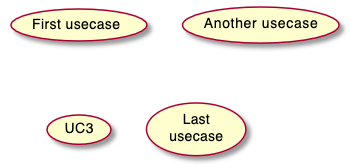

### 엑터(Actors)

액터는 콜론을 앞뒤로 붙여 표현할 수 있습니다. 아니면 `actor` 키워드를 이용하여 정의할 수 있고 `as` 키워드를 이용하여 별칭을 사용할 수도 있습니다.

```java
@startuml

:First Actor:
:Another\nactor: as Man2
actor Woman3
actor :Last actor: as Person1

@enduml
```


### 엑터 스타일 변경
기본적인 허수아비 같은 형식의 엑터에서 다음과 같은 형태로 변경할 수 있습니다:

* 사용자 아이콘 모양 - `skinparam actorStyle awesome`;
* 사용자 쿠키 모양 - `skinparam actorStyle hollow`.

#### 기본 모양 (Stick man)
```java
@startuml
:User: --> (Use)
"Main Admin" as Admin
"Use the application" as (Use)
Admin --> (Admin the application)
@enduml
```


#### 아이콘 모양 (Awesome man)
```java
@startuml
skinparam actorStyle awesome
:User: --> (Use)
"Main Admin" as Admin
"Use the application" as (Use)
Admin --> (Admin the application)
@enduml
```


#### 쿠키 모양 (Hollow man)
```java
@startuml
skinparam actorStyle Hollow 
:User: --> (Use)
"Main Admin" as Admin
"Use the application" as (Use)
Admin --> (Admin the application)
@enduml
```


### 유즈케이스 종류

`usecase` 키워드로 직접 유즈케이스를 만들 수 있는데 `as` 다음에 오는 설명에 `--..==__` 등을 이용하여 라인으로 구분할 수 있습니다.

```java
@startuml

usecase UC1 as "You can use
several lines to define your usecase.
You can also use separators.
--
Several separators are possible.
==
And you can add titles:
..Conclusion..
This allows large description."

@enduml
```


### 패키지 사용
엑터 또는 유즈케이스를 그룹화 하기 위하여 패키지를 사용할 수 있습니다.

```java
@startuml
left to right direction
actor Guest as g
package Professional {
  actor Chef as c
  actor "Food Critic" as fc
}
package Restaurant {
  usecase "Eat Food" as UC1
  usecase "Pay for Food" as UC2
  usecase "Drink" as UC3
  usecase "Review" as UC4
}
fc --> UC4
g --> UC1
g --> UC2
g --> UC3
@enduml
```


또한 `package` 대신 `rectangle`을 이용하여 패키지 모양을 변경할 수 있습니다.
```java
@startuml
left to right direction
actor "Food Critic" as fc
rectangle Restaurant {
  usecase "Eat Food" as UC1
  usecase "Pay for Food" as UC2
  usecase "Drink" as UC3
}
fc --> UC1
fc --> UC2
fc --> UC3
@enduml
```


### 기본 예제
엑터에서 유즈케이스로 화살표를 주기 위하여 `-->` 기호를 사용합니다.
더 많은 `-`를 붙여 더 긴 화살표를 만들 수 있습니다. 또한 `:` 콜론으로 구분된 설명을 넣어 화살표에 설명을 붙일 수 있습니다.

```java
@startuml

User -> (Start)
User --> (Use the application) : A small label

:Main Admin: ---> (Use the application) : This is\nyet another\nlabel

@enduml
```


### 확장
만약 동일 엑터 또는 유즈케이스 사이에 연결을 시키려면 `<|--` 기호를 사용합니다.

```java
@startuml
:Main Admin: as Admin
(Use the application) as (Use)

User <|-- Admin
(Start) <|-- (Use)

@enduml
```


### Using notes
엑터나 유즈케이스 등의 객체에 노트를 추가하기 위하여 `note left of` , `note right of` , `note top of` , `note bottom of` 와 같은 키워드를 사용할 수 있습니다.
노트 객체는 단독으로 추가될 수도 있는데 `..` 심볼을 사용하여 다른 객체에 연결 할 수 있습니다.

```java
@startuml
:Main Admin: as Admin
(Use the application) as (Use)

User -> (Start)
User --> (Use)

Admin ---> (Use)

note right of Admin : This is an example.

note right of (Use)
  A note can also
  be on several lines
end note

note "This note is connected\nto several objects." as N2
(Start) .. N2
N2 .. (Use)
@enduml
```


### Stereotypes
`<<` 와 `>>`를 이용한 추가 기술로 스테레오타입을 추가할 수 있습니다.

```java
@startuml
User << Human >>
:Main Database: as MySql << Application >>
(Start) << One Shot >>
(Use the application) as (Use) << Main >>

User -> (Start)
User --> (Use)

MySql --> (Use)

@enduml
```


### 화살표 방향 변경
기본적으로, 객체 사이의 링크는 대쉬2개 `--` 로 표시하고 수직방향이다. 다음 처럼 대쉬1개 (혹은 점)을 넣어서 수평방향 링크를 사용할 수 있다:

```java
@startuml
:user: --> (Use case 1)
:user: -> (Use case 2)
@enduml
```


또한 다음과 같이 반대 방향으로 연결도 가능합니다:
```java
@startuml
(Use case 1) <.. :user:
(Use case 2) <- :user:
@enduml
```


만약 화살표 심볼 사이에 `left`, `right`, `up` 또는 `down` 키워드를 삽입한다면 해당 화살표 방향을 바꿀 수 있습니다:
```java
@startuml
:user: -left-> (dummyLeft)
:user: -right-> (dummyRight)
:user: -up-> (dummyUp)
:user: -down-> (dummyDown)
@enduml
```


> `-down->` 대신 `-d->` 또는 `-do->` 와 같이 앞 첫자 또는 두자만 기술하여 동일한 방향을 가리킬 수 있습니다.

### 다이어그램 페이지 분할
`newpage` 키워드를 이용하여 다이어그램을 여러 페이지로 나눌 수 있습니다.

```java
@startuml
:actor1: --> (Usecase1)
newpage
:actor2: --> (Usecase2)
@enduml
```
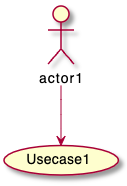

> 위의 일부만 나오는 것 처럼 보이더라도 출력 시 정상 출력됩니다.

### 왼쪽에서 오른쪽 방향
다이어그램이 그려지는 기본 방향은 위에서 아래쪽으로 `top to bottom` 입니다.

```java
@startuml
'default
top to bottom direction
user1 --> (Usecase 1)
user2 --> (Usecase 2)

@enduml
```
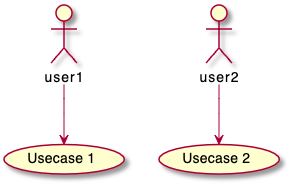

`left to right direction` 명령을 이용하면 이런 그리는 방향을 왼쪽에서 오른쪽으로 변경시킬 수 있습니다. (때로는 이런 결과가 더 좋아보이는 경우도 있습니다.)
```java
@startuml

left to right direction
user1 --> (Usecase 1)
user2 --> (Usecase 2)

@enduml
```
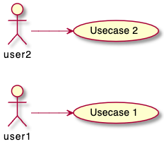

### 컬러나 폰트 변경 (Skinparam)
[skinparam](https://plantuml.com/ko/skinparam) 명령을 이용하여 폰트나 색상 등을 변경할 수 있습니다.

다음과 같은 위치에서 명령을 내릴 수 있습니다:

* 다이어그램 정의부에 다른 명령처럼 설정하거나,
* [included file](https://plantuml.com/ko/preprocessing)에 지정하거나,
* [명령행](https://plantuml.com/ko/command-line) 또는 [ANT task](https://plantuml.com/ko/ant-task)에 제공된 설정파일에 지정할 수 있습니다.

> `skinparam handwritten true` 명령을 주면 손으로 작성한 것처럼 보입니다

```java
@startuml
skinparam handwritten true

skinparam usecase {
BackgroundColor DarkSeaGreen
BorderColor DarkSlateGray

BackgroundColor<< Main >> YellowGreen
BorderColor<< Main >> YellowGreen

ArrowColor Olive
ActorBorderColor black
ActorFontName Courier

ActorBackgroundColor<< Human >> Gold
}

User << Human >>
:Main Database: as MySql << Application >>
(Start) << One Shot >>
(Use the application) as (Use) << Main >>

User -> (Start)
User --> (Use)

MySql --> (Use)

@enduml
```


### 기타 예제
```java
@startuml
left to right direction
skinparam packageStyle rectangle
actor customer
actor clerk
rectangle checkout {
  customer -- (checkout)
  (checkout) .> (payment) : include
  (help) .> (checkout) : extends
  (checkout) -- clerk
}
@enduml
```
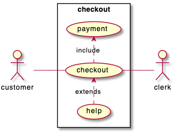

### 비즈니스 유즈케이스
비즈니스 유즈케이스를 위하여 `/`를 추가합니다.

#### 비즈니스 유즈케이스
```java
@startuml

(First usecase)/
(Another usecase)/ as (UC2)
usecase/ UC3
usecase/ (Last\nusecase) as UC4

@enduml
```


#### 비즈니스 엑터
```java
@startuml

:First Actor:/
:Another\nactor:/ as Man2
actor/ Woman3
actor/ :Last actor: as Person1

@enduml
```


### 인라인 형식의 화살표 색상 및 스타일 변경
다음과 같은 방식으로 화살표의 [색상](https://plantuml.com/ko/color) 또는 스타일을 변경할 수 있습니다:

* #color;line.[bold|dashed|dotted];text:color

```java
@startuml
actor foo
foo --> (bar) : normal
foo --> (bar1) #line:red;line.bold;text:red  : red bold
foo --> (bar2) #green;line.dashed;text:green : green dashed 
foo --> (bar3) #blue;line.dotted;text:blue   : blue dotted
@enduml
```
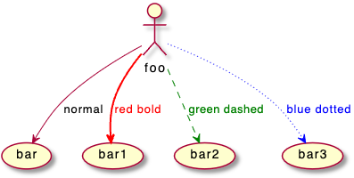

### 인라인 형식의 객체 색상 및 스타일 변경
다음과 같은 방식으로 개별 객체의 [색상](https://plantuml.com/ko/color) 또는 스타일을 변경할 수 있습니다:

* #[color|back:color];line:color;line.[bold|dashed|dotted];text:color

```java
@startuml
actor a
actor b #pink;line:red;line.bold;text:red
usecase c #palegreen;line:green;line.dashed;text:green
usecase d #aliceblue;line:blue;line.dotted;text:blue
@enduml
```

## 클래스 다이어그램

### 요소 정의

```java
@startuml
abstract        abstract
abstract class  "abstract class"
annotation      annotation
circle          circle
()              circle_short_form
class           class
diamond         diamond
<>              diamond_short_form
entity          entity
enum            enum
interface       interface
@enduml
```
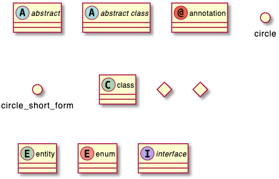

### 클래스 관계
[클래스 관계](https://www.nextree.co.kr/p6753/)는 다음과 같은 부호를 사용합니다.

| 형식 | 심볼 | 설명 | 예제 |
|---|---|---|---|
| 일반화(Generalization) | `<|--` | 일반화는 부모 클래스와 자식 클래스 간의 상속 관계를 나타냅니다. |  
| 실체화(Realization) | `<|..` | 실체화는 인터페이스의 명세만 있는 메서드를 오버라이딩하여 실제 기능으로 구하는 것을 말합니다. | 
| 의존(Dependency) | `<..` | 의존 관계는 어떤 클래스가 다른 클래스를 참조하는 것을 말합니다. | 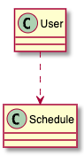
| 연관(Association) | `--` | 상호 참조, 혹은 어느 한쪽 참조 | 
| 방향성 있는 연관(Association) | `-->` | 참조하는 쪽과 참조 당하는 쪽 구분 | 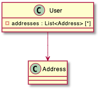
| 집합, 집합연관(Aggregation) | `o--` | 전체와 부분의 관계 | 
| 합성, 복합연관(Composition) | `*--` 또는 `*-->` | 전체와 부분의 관계를 나타내지만 개념적으로 집합보다 더 강한 집합을 의미, 전체 인스턴스가 부분 인스턴스도 동일하게 생성, 소멸 등 관리 | 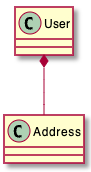

#### 일반화(Generalization)
```java
@startuml
class User {
  id: String
  password: String
  void login()
}
class Customer {
  void login()
}
class Admin {
  void login()
}

User <|-- Customer
User <|-- Admin
@enduml
```


#### 실체화(Realization)
```java
@startuml
class CheckLogic <<interface>> {
  +void isTrue() : boolean
}

class DateCheckLogic {
  +void isTrue() : boolean
}

CheckLogic <|.. DateCheckLogic
@enduml
```


#### 의존(Dependency)
```java
@startuml
User ..> Schedule
@enduml
```


#### 연관(Association)
```java
@startuml
User -- Address
@enduml
```


#### 방향성 있는 연관(Association)
```java
@startuml
class User {
  - addresses : List<Address> [*]
}

User --> Address
@enduml
```


#### 집합, 집합연관(Aggregation)
```java
@startuml
User o-- Address
@enduml
```


#### 합성, 복합연관(Composition)
```java
@startuml
User *-- Address
@enduml
```


### 예제

#### 예제 1
```java
@startuml
Class01 <|-- Class02
Class03 *-- Class04
Class05 o-- Class06
Class07 .. Class08
Class09 -- Class10
@enduml
```


#### 예제 2
```java
@startuml
Class11 <|.. Class12
Class13 --> Class14
Class15 ..> Class16
Class17 ..|> Class18
Class19 <--* Class20
@enduml
```


#### Example 3
```java
@startuml
Class21 #-- Class22
Class23 x-- Class24
Class25 }-- Class26
Class27 +-- Class28
Class29 ^-- Class30
@enduml
```


### 관계를 나타내기 위한 레이블
관계에서 레이블을 추가하기 위해서는 뒤에 `:` 를 붙이고 레이블을 작성하면 됩니다.
관계차수를 나타내기 위해서는 `""`를 이용하여 관계의 양쪽 끝에 작성하면 됩니다.

```java
@startuml
Class01 "1" *-- "many" Class02 : contains
Class03 o-- Class04 : aggregation
Class05 --> "1" Class06
@enduml
```


`<` 또는 `>`을 사용하여 객체가 다른 객체에 대한 흐름 관계를 더 자세히 설명할 수 있습니다.
```java
@startuml
class Car
Driver - Car : drives >
Car *- Wheel : have 4 >
Car -- Person : < owns
@enduml
```


### 메서드나 필드 추가
메서드나 필드를 추가하기 위하여 객체 뒤에 `:`를 붙이고 메서드나 필드를 추가하면 됩니다. `()` 괄호가 포함되면 자동으로 메서드로 인식합니다.

```java
@startuml
Object <|-- ArrayList

Object : equals()
ArrayList : Object[] elementData
ArrayList : size()

@enduml
```


그런데 위의 방법 보다는 `{}`를 이용하여 실제 클래스를 정의하는 것처럼 기술하는 것이 더 편할 수 있습니다. 역시 `()` 괄호가 포함되면 자동으로 메서드로 인식합니다.

```java
@startuml
class Dummy {
  String data
  void methods()
}

class Flight {
   flightNumber : Integer
   departureTime : Date
}
@enduml
```


`{field}`나 `{method}`를 이용하여 직접 필드와 메서드로 지정할 수도 있습니다.

```java
@startuml
class Dummy {
  {field} A field (despite parentheses)
  {method} Some method
}
@enduml
```


### 메서드, 필드 노출(Visibility) 정의
메서드나 필드들을 정의할 때, 특수문자를 사용하여 관련된 필드나 메서드의 외부 노출을 지정할 수 있습니다. 명령어는 다음과 같습니다:

* `-` : private - 해당 클래스에서만 접근 가능
* `#` : protected - 해당 클래스와 상속 받은 클래스에서 접근 가능
* `~` : package private - 해당 전체 패키지에서만 접근 가능
* `+` : public - 모든 외부에서 접근 가능

```java
@startuml

class Dummy {
 -field1
 #field2
 ~method1()
 +method2()
}
@enduml
```


`skinparam classAttributeIconSize 0`를 사용하여, 아이콘 표시를 끌 수 있습니다. 명령어는 다음과 같습니다:
```java
@startuml
skinparam classAttributeIconSize 0
class Dummy {
 -field1
 #field2
 ~method1()
 +method2()
}
@enduml
```


### Abstract 와 Static

`{static}` 또는 `{abstract}` 지지자를 이용하여 클래스의 메서드나 필드에 `abstract` 또는 `static` 임을 표시할 수 있습니다. ([참고](https://bigstupid.tistory.com/76)) 이 지시자는 필드나 메서드 정의의 시작부나 마지막에 올 수 있습니다. `{static}` 대신 `{classifier}` 지시자를 이용해도 동일 효과를 얻습니다.

```java
@startuml
class Dummy {
  {static} String id
  {abstract} void methods()
}
@enduml
```


### 고급 클래스 내용
기본적으로 메서드나 필드는 PlantUML에 의하여 자동으로 묶입니다만  `--` `..` `==` `__` 와 같은 구분자를 이용하여 의도한 그룹을 만들 수 있습니다.
또한 제목도 동일하게 나눌 수 있습니다.

```java
@startuml
class Foo1 {
  You can use
  several lines
  ..
  as you want
  and group
  ==
  things together.
  __
  You can have as many groups
  as you want
  --
  End of class
}

class User {
  .. Simple Getter ..
  + getName()
  + getAddress()
  .. Some setter ..
  + setName()
  __ private data __
  int age
  -- encrypted --
  String password
}

@enduml
```


### 노트와 스테레오타입

`class` 키워드와 함께, `<<` 와 `>>`를 이용하여 [스테레오타입](https://blog.daum.net/iq_jeong/7759137)을 지정할 수 있습니다.
또한 `note left of` , `note right of` , `note top of` , `note bottom of` 등을 이용하여 노트를 만들 수 있습니다.
별도 노트를 만들고 `as` 로 만든 별칭을 이용하여 객체와 `..` 심볼로 연결하는 것도 가능합니다. 

```java
@startuml
class Object << general >>
Object <|--- ArrayList

note top of Object : In java, every class\nextends this one.

note "This is a floating note" as N1
note "This note is connected\nto several objects." as N2
Object .. N2
N2 .. ArrayList

class Foo
note left: On last defined class

@enduml
```
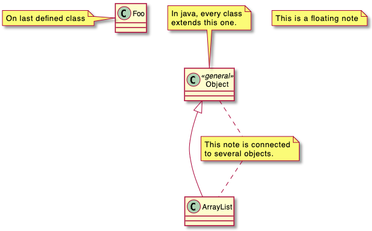

### 노트의 속성에 관한 내용

노트에는 다음과 같은 HTML 태그를 줄 수 있습니다. ([Creole 표현식 참조](https://plantuml.com/ko/creole))
* `<b>` - 굵게
* `<u>` - 밑줄
* `<i>` - 이텔릭체
* `<s>`, `<del>`, `<strike>` - 취소줄
* `<font color="#AAAAAA">` 또는 `<font color="colorName">` - 폰트 색생
* `<color:#AAAAAA>` 또는 `<color:colorName>` - 색상
* `<size:nn>` - 폰트 크기 조종
* `` 또는 `` - 이미지 표시

노트는 여러 줄에 걸쳐 표시할 수 있습니다.
`note left`, `note right`, `note top`, `note bottom` 등을 이용하여 마지막에 정의한 클래스(`On last defined class`)에 노트를 추가할 수 있습니다.

```java
@startuml

class Foo
note left: On last defined class

note top of Object
  In java, <size:18>every</size> <u>class</u>
  <b>extends</b>
  <i>this</i> one.
end note

note as N1
  This note is <u>also</u>
  <b><color:royalBlue>on several</color>
  <s>words</s> lines
  And this is hosted by 
end note

@enduml
```


### 필드, 속성, 메서드 등에 관한 노트
필드, 속성, 메서드 등에 노트를 다는 것이 가능합니다.

> ⚠ 제약사항
>
> * 이 내용은 `top` 또는 `bottom`에는 사용할 수 없고 `left` 또는 `right`에만 적용할 수 있습니다.
> * 이름 구분자인 `::`과 함께 `클래스::필드` 처럼 사용할 수 있습니다.

#### 필드 또는 메서드에 노트달기
```java
@startuml
class A {
{static} int counter
+void {abstract} start(int timeout)
}
note right of A::counter
  This member is annotated
end note
note right of A::start
  This method is now explained in a UML note
end note
@enduml
```
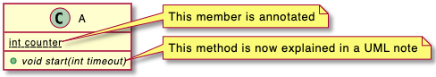

#### 동일 이름의 메서드에 노트 달기
```java
@startuml
class A {
{static} int counter
+void {abstract} start(int timeoutms)
+void {abstract} start(Duration timeout)
}
note left of A::counter
  This member is annotated
end note
note right of A::"start(int timeoutms)"
  This method with int
end note
note right of A::"start(Duration timeout)"
  This method with Duration
end note
@enduml
```
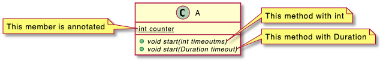

### 링크에 노트 달기

`note on link`를 이용하면 화살표 등의 링크에 노트를 다는 것이 가능합니다.
또한 `note left on link`, `note right on link`, `note top on link`, `note bottom on link` 등을 이용하면 특정 위치에 노트를 다는 것이 가능합니다.

```java
@startuml

class Dummy
Dummy --> Foo : A link
note on link #red: note that is red

Dummy --> Foo2 : Another link
note right on link #blue
this is my note on right link
and in blue
end note

@enduml
```


### 추상화 클래스(Abstract class) 와 인터페이스
`abstract` 또는 `abstract class` 키워드를 이용하여 추상화 클래스 정의할 수 있습니다.
클래스 이름은 *이탤릭*체로 표현됩니다. 또한 `interface`, `annotation` 나 `enum` 키워드를 이용하여 해당 내용을 정의할 수 있습니다.

```java
@startuml

abstract class AbstractList
abstract AbstractCollection
interface List
interface Collection

List <|-- AbstractList
Collection <|-- AbstractCollection

Collection <|- List
AbstractCollection <|- AbstractList
AbstractList <|-- ArrayList

class ArrayList {
  Object[] elementData
  size()
}

enum TimeUnit {
  DAYS
  HOURS
  MINUTES
}

annotation SuppressWarnings

@enduml
```


### 클래스 이름에 특별 문자 이용

클래스 (또는 인터페이스, 추상화 클래스, ENUM 등)에 [non-letters](https://plantuml.com/ko/unicode)를 표현하려면 다음과 같이 합니다:
* 클래스 정의에 `as` 키워드를 사용
* `""` 클래스 이름 앞뒤로 쌍따옴표 사용

```java
@startuml
class "This is my class" as class1
class class2 as "It works this way too"

class2 *-- "foo/dummy" : use
@enduml
```


### 속성, 메서드 등 숨기기
`hide`/`show` 명령을 이용하면 숨기기/보이기 등을 할 수 있습니다.
또한 `hide empty members` 기본 명령이 있는데 이것은 비어있는 클래스 정의 등은 보이지 않게 합니다.
`empty members` 대신 다음과 같은 경우에 숨기는 것이 가능합니다:
* `empty fields` 또는 `empty attributes` - 필드나 속성이 비어 있는 경우
* `empty methods` - 메서드가 비어 있는 경우
* `fields` 또는 `attributes` - 필드나 속성이 정의되어 있어도 숨기는 경우
* `methods` - 메서드가 정의되어 있어도 숨기는 경우
* `members` - 필드나 메서드가 정의되어 있어도 숨기는 경우
* `circle` - 클래스 이름 앞에 원형으로 채워진 아이콘 스팟
* `stereotype` - 스테레오타입

You can also provide, just after the `hide` or `show` keyword:
* `class` for all classes,
* `interface` for all interfaces,
* `enum` for all enums,
* `<<foo1>>` for classes which are stereotyped with *foo1*,
* an existing class name.

You can use several `show`/`hide` commands to define rules and exceptions.

```java
@startuml

class Dummy1 {
  +myMethods()
}

class Dummy2 {
  +hiddenMethod()
}

class Dummy3 <<Serializable>> {
String name
}

hide members
hide <<Serializable>> circle
show Dummy1 methods
show <<Serializable>> fields

@enduml
```
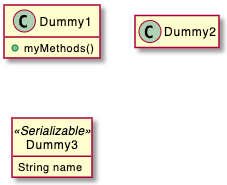

### 클래스 숨기기
`show`/`hide` 명령을 클래스에도 적용할 수 있습니다.
이것은 많은 불러오기 파일([!included file](https://plantuml.com/ko/preprocessing))에 유용할 수 있습니다.
또는 파일 포함([file inclusion](https://plantuml.com/ko/preprocessing)) 이후 특정 클래스를 숨기는데 이용할 수도 있습니다.

```java
@startuml

class Foo1
class Foo2

Foo2 *-- Foo1

hide Foo2

@enduml
```


### 클래스 제거
클래스를 제거하기 위해서는 `remove` 명령을 사용할 수 있습니다.
일([!included file](https://plantuml.com/ko/preprocessing))에 유용할 수 있습니다.
또는 파일 포함([file inclusion](https://plantuml.com/ko/preprocessing)) 이후 특정 클래스를 숨기는데 이용할 수도 있습니다.

```java
@startuml

class Foo1
class Foo2

Foo2 *-- Foo1

remove Foo2

@enduml
```


### 링크되지 않은 클래스 숨기거나 지우기

기본적으로 모든 클래스는 보여집니다.

```java
@startuml
class C1
class C2
class C3
C1 -- C2
@enduml
```
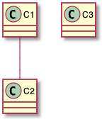

하지만 다음과 같은 명령어를 이용하여 링크안된 클래스는 숨길 수 있습니다:
* `hide @unlinked `classes:

```java
@startuml
class C1
class C2
class C3
C1 -- C2

hide @unlinked
@enduml
```
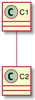

또는 `hide` 대신 `remove`를 사용해도 동일합니다:
* `remove @unlinked` classes:

```java
@startuml
class C1
class C2
class C3
C1 -- C2

hide @unlinked
@enduml
```


### generics 사용
`<` 과 `>`를 이용하여 클래스의 `generic` 정보를 줄 수 있습니다.

```java
@startuml

class Foo<? extends Element> {
  int size()
}
Foo *- Element

@enduml
```


하지만 `skinparam genericDisplay old` 명령을 주면 이 정보를 안 보이게 할 수 있습니다.

### 특정 스팟 아이콘

일반적으로 스테레오타입 안에 `(C, I, E or A)` 글자가 나타내는 클래스, 인터페이스, ENUM, 추상화 클래스에 대한 스팟 문자를 가질 수 있습니다.
그러나 다음 예제와 마찬가지로 자신만의 특정 글자를 추가할 수 있습니다.

```java
@startuml

class System << (S,#FF7700) Singleton >>
class Date << (D,orchid) >>
@enduml
```


### 패키지
`package` 키워드를 사용하여 패키지를 정의할 수 있습니다. 그리고 정의할 때 배경 색 (HTML 에서 사용하는 색상 코드나 이름)을 선택적으로 정의할 수도 있습니다.

또한 이런 패키지 정의는 중첩가능 합니다.

```java
@startuml

package "Classic Collections" #DDDDDD {
  Object <|-- ArrayList
}

package net.sourceforge.plantuml {
  Object <|-- Demo1
  Demo1 *- Demo2
}

@enduml
```
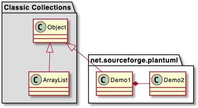

### 패키지 스타일
각각의 패키지에 개별 스타일을 지정할 수 있습니다.

`skinparam packageStyle` 명령 또는 스테레오타입을 통하여 기본 스타일을 지정할 수 있습니다:

```java
@startuml
scale 750 width
package foo1 <<Node>> {
  class Class1
}

package foo2 <<Rectangle>> {
  class Class2
}

package foo3 <<Folder>> {
  class Class3
}

package foo4 <<Frame>> {
  class Class4
}

package foo5 <<Cloud>> {
  class Class5
}

package foo6 <<Database>> {
  class Class6
}

@enduml
```


또한 다음 예제와 같이 패키지 사이에 링크를 달 수 있습니다:
```java
@startuml

skinparam packageStyle rectangle

package foo1.foo2 {
}

package foo1.foo2.foo3 {
  class Object
}

foo1.foo2 +-- foo1.foo2.foo3

@enduml
```
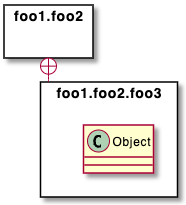

### 네임스페이스

패키지 사이에서 클래스 이름은 고유하게 정의되어야 합니다. 이 말은 다른 패키지에 동일 이름의 클래스가 존재하면 안된다는 의미입니다.

만약 동일한 이름을 사용하여야만 한다면 [네임스페이스](http://en.wikipedia.org/wiki/Namespace_%28computer_science%29) 라는 개념을 이용합니다.

만약 동일한 이름의 클래스 (아래 예제에서는 `Person`)가 있다면 패키지 이름에 해당 클래스를 추가한 전체 경로 이름을 사용하면 됩니다.

```java
@startuml

class BaseClass

namespace net.dummy #DDDDDD {
    .BaseClass <|-- Person
    Meeting o-- Person

    .BaseClass <|- Meeting
}

namespace net.foo {
  net.dummy.Person  <|- Person
  .BaseClass <|-- Person

  net.dummy.Meeting o-- Person
}

BaseClass <|-- net.unused.Person

@enduml
```


### 자동 네임스페이스 생성

`set namespaceSeparator ???` 명령에 `???` 대신 여러 값을 지정하면 `.` 점으로 표현되는 네임스페이스 대신 해당 구분자로 네임스페이스를 그릴 수 있습니다.

#### 기본 `.` 점 그리기인 경우
```java
@startuml

class X1::X2::foo {
  some info
}

@enduml
```


#### 네임스페이스를 `::` 으로 지정한 경우
```java
@startuml

set namespaceSeparator ::
class X1::X2::foo {
  some info
}

@enduml
```
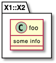

`set namespaceSeparator none` 명령을 주면 네임스페이스 구분을 하지 않습니다.

```java
@startuml

set namespaceSeparator none
class X1.X2.foo {
  some info
}

@enduml
```


### 롤리팝 인터페이스
다음과 같은 문법으로 클래스의 [롤리팝 인터페이스](https://stackoverflow.com/questions/8307724/using-lollipops-sockets-in-uml-why-and-when)를 정의할 수 있습니다:
* `bar ()- foo`
* `bar ()-- foo`
* `foo -() bar`

```java
@startuml
class foo
bar ()- foo
@enduml
```


### 연결 방향 변경
기본적으로 클래스 간에 대쉬 연결을 위해서 `--` 를 이용하면 세로방향으로 연결됩니다. 하지만 다음과 같이 한 개의 대쉬를 이용하여 가로 방향으로 바꿀 수 있습니다.

```java
@startuml
Room o- Student
Room *-- Chair
@enduml
```
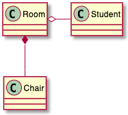

다음과 같이 연결 방향을 바꿀 수 있습니다:

```java
@startuml
Student -o Room
Chair --* Room
@enduml
```


링크 사이에 `left`, `right`, `up` 또는 `down` 키워드를 이용하여 연결 방향을 지정할 수 있습니다:

```java
@startuml
foo -left-> dummyLeft
foo -right-> dummyRight
foo -up-> dummyUp
foo -down-> dummyDown
@enduml
```
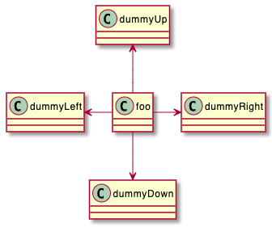

`-down-` 대신 `-d-` 또는 `-do-` 라고 해도 동일하게 동작합니다.

[left to right direction](https://plantuml.com/ko/use-case-diagram#d551e48d272b2b07) 를 이용할 수도 있습니다:

```java
@startuml
left to right direction
foo -left-> dummyLeft
foo -right-> dummyRight
foo -up-> dummyUp
foo -down-> dummyDown
@enduml
```


### 연관 클래스
다음과 같이 두 클래스 사이에 `연관 클래스(association class)`를 정의할 수 있습니다.

```java
@startuml
class Student {
  Name
}
Student "0..*" - "1..*" Course
(Student, Course) .. Enrollment

class Enrollment {
  drop()
  cancel()
}
@enduml
```


또한 다음과 같이 다른 두 개의 대시로 `--`나 점 `..` 을 이용하여 가로방향으로 지정할 수 있습니다:

```java
@startuml
class Student {
  Name
}
Student "0..*" -- "1..*" Course
(Student, Course) . Enrollment

class Enrollment {
  drop()
  cancel()
}
@enduml
```
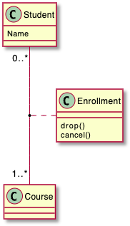

### 동일 클래스의 연관
```java
@startuml
class Station {
    +name: string
}

class StationCrossing {
    +cost: TimeInterval
}

<> diamond

StationCrossing . diamond
diamond - "from 0..*" Station
diamond - "to 0..* " Station
@enduml
```
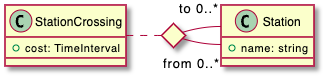

### 컬러나 폰트 변경 (Skinparam)
[skinparam](https://plantuml.com/ko/skinparam) 명령을 이용하여 폰트나 색상 등을 변경할 수 있습니다.

다음과 같은 위치에서 명령을 내릴 수 있습니다:

* 다이어그램 정의부에 다른 명령처럼 설정하거나,
* [included file](https://plantuml.com/ko/preprocessing)에 지정하거나,
* [명령행](https://plantuml.com/ko/command-line) 또는 [ANT task](https://plantuml.com/ko/ant-task)에 제공된 설정파일에 지정할 수 있습니다.

```java
@startuml

skinparam class {
BackgroundColor PaleGreen
ArrowColor SeaGreen
BorderColor SpringGreen
}
skinparam stereotypeCBackgroundColor YellowGreen

Class01 "1" *-- "many" Class02 : contains

Class03 o-- Class04 : aggregation

@enduml
```


### 스테레오타입의 색상 이나 폰트 조종
클래스의 스테레오타입에 대한 색상이나 폰트를 조종할 수 있습니다.

```java
@startuml

skinparam class {
BackgroundColor PaleGreen
ArrowColor SeaGreen
BorderColor SpringGreen
BackgroundColor<<Foo>> Wheat
BorderColor<<Foo>> Tomato
}
skinparam stereotypeCBackgroundColor YellowGreen
skinparam stereotypeCBackgroundColor<< Foo >> DimGray

Class01 <<Foo>>
Class03 <<Foo>>
Class01 "1" *-- "many" Class02 : contains

Class03 o-- Class04 : aggregation

@enduml
```


### 그라디언트 색상
`# notation`를 이용하면 클래스나 노트 등에 대하여 개별 색상을 조정할 수 있습니다.
[색상](https://plantuml.com/ko/color)에 나오는 것 색상 이름이나 RGB 코드를 통하여 색상을 조정합니다.

또한 다음과 같은 분리자를 통하여 각 방향에 대하여 두 색상을 지정함으로써 그라디언트 색상을 지정할 수 있습니다:
* `|` - 좌에서 우로 색상 변화
* `/` - 좌상에서 우하로 색상 변화
* `\` - 좌하에서 우상으로 색상 변화
* `-` - 상에서 하로 색상 변화

```java
@startuml

skinparam backgroundcolor AntiqueWhite/Gold
skinparam classBackgroundColor Wheat|CornflowerBlue

class Foo #red-green
note left of Foo #blue\9932CC
  this is my
  note on this class
end note

package example #GreenYellow/LightGoldenRodYellow {
  class Dummy
}

@enduml
```
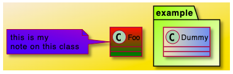

### 레이아웃 도움말
때로는 기본 레이아웃이 마음에 들지 않을 수도 있습니다.
동일 클래스를 그룹하는데 `together` 키워드를 사용할 수 있습니다. 그러면 동일 패키지에 있는 것처럼 그룹화할 수 있습니다.

또한 `hidden` 키워드를 이용하여 링크를 숨기게 할 수도 있습니다.
Sometimes, the default layout is not perfect...

You can use `together` keyword to group some classes together : the layout engine will try to group them (as if they were in the same package).

You can also use `hidden` links to force the layout.

```java
@startuml

class Bar1
class Bar2
together {
  class Together1
  class Together2
  class Together3
}
Together1 - Together2
Together2 - Together3
Together2 -[hidden]--> Bar1
Bar1 -[hidden]> Bar2


@enduml
```


### 대용량 파일 분할하기
때로는 아주 큰 이미지를 만들 수 있습니다.
이런 경우 `page (hpages)x(vpages)` 명령을 이용하면 여러 페이지로 출력되도록 바꿀 수 있습니다.
`hpages`는 전체 이미지가 가로로 몇 페이지로 나뉘어지는가를 나타내고 `vpages`는 세로로 몇 페이지로 나뉘어지는가를 나타냅니다.

또한 특정 `skinparam`을 이용하여 분할되는 페이지의 경계에 대한 속성을 지정할 수 있습니다.

```java
@startuml
' Split into 4 pages
page 2x2
skinparam pageMargin 10
skinparam pageExternalColor gray
skinparam pageBorderColor black

class BaseClass

namespace net.dummy #DDDDDD {
    .BaseClass <|-- Person
    Meeting o-- Person

    .BaseClass <|- Meeting

}

namespace net.foo {
  net.dummy.Person  <|- Person
  .BaseClass <|-- Person

  net.dummy.Meeting o-- Person
}

BaseClass <|-- net.unused.Person
@enduml
```


### 확장(Extends) 과 구현(implements)
`extends` 와 `implements` 키워드를 이용할 수 있습니다.

```java
@startuml
class ArrayList implements List
class ArrayList extends AbstractList
@enduml
```
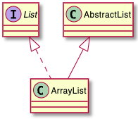

### 대괄호를 이용한 링크나 화살표 양식

#### 라인 양식
링크나 화살표에 직접 `bold`, `dashed`, `dotted`, `hidden` 또는 `plain` 관계를 설정할 수 있습니다:

* 라벨이 없는 경우

```java
@startuml
title Bracketed line style without label
class foo
class bar
bar1 : [bold]  
bar2 : [dashed]
bar3 : [dotted]
bar4 : [hidden]
bar5 : [plain] 

foo --> bar
foo -[bold]-> bar1
foo -[dashed]-> bar2
foo -[dotted]-> bar3
foo -[hidden]-> bar4
foo -[plain]-> bar5
@enduml
```


* 라벨 포함

```java
@startuml
title Bracketed line style with label
class foo
class bar
bar1 : [bold]  
bar2 : [dashed]
bar3 : [dotted]
bar4 : [hidden]
bar5 : [plain] 

foo --> bar          : ∅
foo -[bold]-> bar1   : [bold]
foo -[dashed]-> bar2 : [dashed]
foo -[dotted]-> bar3 : [dotted]
foo -[hidden]-> bar4 : [hidden]
foo -[plain]-> bar5  : [plain]

@enduml
```
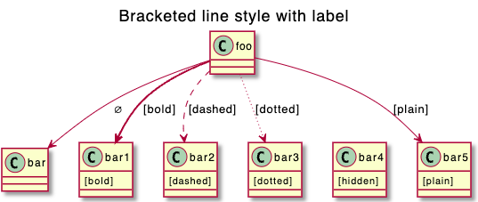

#### 라인 색상
```java
@startuml
title Bracketed line color
class foo
class bar
bar1 : [#red]
bar2 : [#green]
bar3 : [#blue]

foo --> bar
foo -[#red]-> bar1     : [#red]
foo -[#green]-> bar2   : [#green]
foo -[#blue]-> bar3    : [#blue]
'foo -[#blue;#yellow;#green]-> bar4
@enduml
```


#### 라인 굵기
```java
@startuml
title Bracketed line thickness
class foo
class bar
bar1 : [thickness=1]
bar2 : [thickness=2]
bar3 : [thickness=4]
bar4 : [thickness=8]
bar5 : [thickness=16]

foo --> bar                 : ∅
foo -[thickness=1]-> bar1   : [1]
foo -[thickness=2]-> bar2   : [2]
foo -[thickness=4]-> bar3   : [4]
foo -[thickness=8]-> bar4   : [8]
foo -[thickness=16]-> bar5  : [16]

@enduml
```
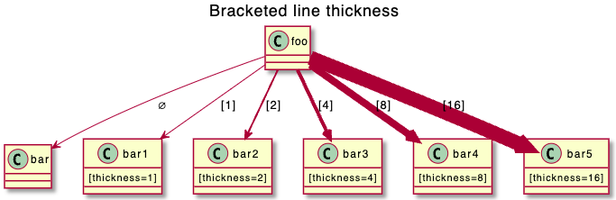

#### 모두 적용
```java
@startuml
title Bracketed line style mix
class foo
class bar
bar1 : [#red,thickness=1]
bar2 : [#red,dashed,thickness=2]
bar3 : [#green,dashed,thickness=4]
bar4 : [#blue,dotted,thickness=8]
bar5 : [#blue,plain,thickness=16]

foo --> bar                             : ∅
foo -[#red,thickness=1]-> bar1          : [#red,1]
foo -[#red,dashed,thickness=2]-> bar2   : [#red,dashed,2]
foo -[#green,dashed,thickness=4]-> bar3 : [#green,dashed,4]
foo -[#blue,dotted,thickness=8]-> bar4  : [blue,dotted,8]
foo -[#blue,plain,thickness=16]-> bar5  : [blue,plain,16]
@enduml
```


### 링크나 화살표의 라인 색상, 양식 등 변경
다음과 같은 [color](https://plantuml.com/ko/color) 색상 조정이 가능합니다:
* `#color;line.[bold|dashed|dotted];text:color`

```java
@startuml
class foo
foo --> bar : normal
foo --> bar1 #line:red;line.bold;text:red  : red bold
foo --> bar2 #green;line.dashed;text:green : green dashed
foo --> bar3 #blue;line.dotted;text:blue   : blue dotted
@enduml
```


### 클래스 색상 및 양식 변경 (인라인 양식)
다음과 같은 [color](https://plantuml.com/ko/color) 색상 조정이 가능합니다:
* `#color ##[style]color`

첫번째 배경 색상을 (`#color`) 지정하고 나서, 라인 양식과 색상을 (`##[style]color`) 지정합니다.

```java
@startuml
abstract   abstract
annotation annotation #pink ##[bold]red
class      class      #palegreen ##[dashed]green
interface  interface  #aliceblue ##[dotted]blue
@enduml
```


* `#[color|back:color];header:color;line:color;line.[bold|dashed|dotted];text:color`

```java
@startuml
abstract   abstract
annotation annotation #pink;line:red;line.bold;text:red
class      class      #palegreen;line:green;line.dashed;text:green
interface  interface  #aliceblue;line:blue;line.dotted;text:blue
@enduml
```


예제:

```java
@startuml
class bar #line:green;back:lightblue
class bar2 #lightblue;line:green

class Foo1 #back:red;line:00FFFF
class FooDashed #line.dashed:blue
class FooDotted #line.dotted:blue
class FooBold #line.bold
class Demo1 #back:lightgreen|yellow;header:blue/red
@enduml
```


### 클래스 멤머로 또는 멤버에서 화살표

#### 예제 1
```java
@startuml
class Foo {
+ field1
+ field2
}

class Bar {
+ field3
+ field4
}

Foo::field1 --> Bar::field3 : foo
Foo::field2 --> Bar::field4 : bar
@enduml
```
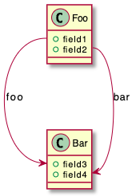

#### 예제 2
```java
@startuml
left to right direction

class User {
  id : INTEGER
  ..
  other_id : INTEGER
}

class Email {
  id : INTEGER
  ..
  user_id : INTEGER
  address : INTEGER
}

User::id *-- Email::user_id
@enduml
```


### 상속 화살표 모음
`skinparam groupInheritance` 을 이용하면 임계값을 이용한 화살표의 병합이 가능합니다.

#### 그룹 상속 1 (그룹화 없음)
```java
@startuml
skinparam groupInheritance 1

A1 <|-- B1

A2 <|-- B2
A2 <|-- C2

A3 <|-- B3
A3 <|-- C3
A3 <|-- D3

A4 <|-- B4
A4 <|-- C4
A4 <|-- D4
A4 <|-- E4
@enduml
```


#### 그룹 상속 2 (2개 부터 그룹화)
```java
@startuml
skinparam groupInheritance 2

A1 <|-- B1

A2 <|-- B2
A2 <|-- C2

A3 <|-- B3
A3 <|-- C3
A3 <|-- D3

A4 <|-- B4
A4 <|-- C4
A4 <|-- D4
A4 <|-- E4
@enduml
```


#### 그룹 상속 3 (3개 부터 그룹화)
```java
@startuml
skinparam groupInheritance 3

A1 <|-- B1

A2 <|-- B2
A2 <|-- C2

A3 <|-- B3
A3 <|-- C3
A3 <|-- D3

A4 <|-- B4
A4 <|-- C4
A4 <|-- D4
A4 <|-- E4
@enduml
```


#### 그룹 상속 4 (4개 부터 그룹화)
```java
@startuml
skinparam groupInheritance 4

A1 <|-- B1

A2 <|-- B2
A2 <|-- C2

A3 <|-- B3
A3 <|-- C3
A3 <|-- D3

A4 <|-- B4
A4 <|-- C4
A4 <|-- D4
A4 <|-- E4
@enduml
```
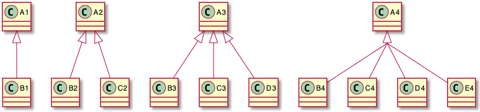
## 객체 다이어그램

### 객체 정의
`object` 키워드를 이용하여 객체를 정의할 수 있습니다.

```java
@startuml
object firstObject
object "My Second Object" as o2
@enduml
```
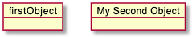

### 객체 사이의 관계
객체 사이의 관계는 다음과 같이 정의할 수 있습니다:
* `<|--` : 확장
* `*--` : 구성
* `o--` : 집합

`--` 대신 `..`를 이용하여 점선으로 표시할 수 있습니다.
객체 정의 이후 `:`와 텍스를 사용하여 설명글을 포함할 수 있습니다.
관계 정의 앞 또는 뒤에 `""`로 표현된 원소 개수[cardinality](https://en.wikipedia.org/wiki/Cardinality_(data_modeling))를 표현할 수 있습니다.

```java
@startuml
object Object01
object Object02
object Object03
object Object04
object Object05
object Object06
object Object07
object Object08

Object01 <|-- Object02
Object03 *-- Object04
Object05 o-- "4" Object06
Object07 .. Object08 : some labels
@enduml
```


### 연관 객체(Associations objects)
```java
@startuml
object o1
object o2
diamond dia
object o3

o1  --> dia
o2  --> dia
dia --> o3
@enduml
```


### 필드 추가
필드를 추가하려면 객체 뒤에 `:`를 붙이고 `필드 = 값`표현식 등으로 표현할 수 있습니다.

```java
@startuml

object user

user : name = "Dummy"
user : id = 123

@enduml
```


더 쉬운 표현식으로 객체를 `{}`를 감싸고 그 안에 필드 표현식을 넣는 방법이 있습니다.

```java
@startuml

object user {
  name = "Dummy"
  id = 123
}
@enduml
```


### 맵 테이블 또는 연관 어레이
`map` 키워드와 `=>` 구분자를 이용한 맵 테이블 또는 [associative array](https://en.wikipedia.org/wiki/Associative_array)을 정의할 수 있습니다.

#### 예제 1
```java
@startuml
map CapitalCity {
 UK => London
 USA => Washington
 Germany => Berlin
}
@enduml
```
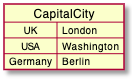

#### 예제 2
```java
@startuml
map "Map **Contry => CapitalCity**" as CC {
 UK => London
 USA => Washington
 Germany => Berlin
}
@enduml
```
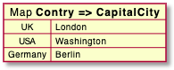

#### 예제 3
```java
@startuml
map "map: Map<Integer, String>" as users {
 1 => Alice
 2 => Bob
 3 => Charlie
}
@enduml
```


그리고 다음과 같이 링크도 가능합니다.

#### 예제 4
```java
@startuml
object London

map CapitalCity {
 UK *-> London
 USA => Washington
 Germany => Berlin
}
@enduml
```


#### Example 5
```java
@startuml
object London
object Washington
object Berlin
object NewYork

map CapitalCity {
 UK *-> London
 USA *--> Washington
 Germany *---> Berlin
}

NewYork --> CapitalCity::USA
@enduml
```
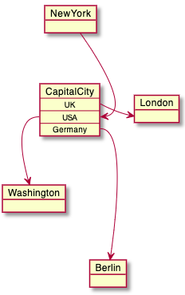

#### Example 6
```java
@startuml
package foo {
    object baz
}

package bar {
    map A {
        b *-> foo.baz
        c =>
    }
}

A::c --> foo
@enduml
```
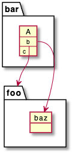

#### Example 7
```java
@startuml
object Foo
map Bar {
  abc=>
  def=>
}
object Baz

Bar::abc --> Baz : Label one
Foo --> Bar::def : Label two
@enduml
```


### 퍼트 다이어그램
[퍼트 다이어그램](https://ko.wikipedia.org/wiki/퍼트)을 `맵 테이블`을 이용하여 그릴 수 있습니다.
```java
@startuml PERT
left to right direction
' Horizontal lines: -->, <--, <-->
' Vertical lines: ->, <-, <->
title PERT: Project Name

map Kick.Off {
}
map task.1 {
    Start => End
}
map task.2 {
    Start => End
}
map task.3 {
    Start => End
}
map task.4 {
    Start => End
}
map task.5 {
    Start => End
}
Kick.Off --> task.1 : Label 1
Kick.Off --> task.2 : Label 2
Kick.Off --> task.3 : Label 3
task.1 --> task.4
task.2 --> task.4
task.3 --> task.4
task.4 --> task.5 : Label 4
@enduml
```

## 활동 다이어그램

[기존의 활동 diagram 문법](https://plantuml.com/ko/활동-diagram-legacy) 은 몇몇 제약과 단점이 있습니다.(예를 들면, 유지보수가 어렵다.)

그래서 완전 새로운 문법과 구현이 베타버전으로 고안되었고, 더 나은 포맷과 문법으로 정의할 수 있었습니다.
이 새로운 구현의 또 다른 장점은 (시퀀스 다이어그램과 같이) Graphviz를 설치할 필요 없이 수행된다는 것입니다.

새로운 구문이 이전 구문을 대체할 겁니다. 그러나 호환성을 보장하기 위해 이전 구문이 여전히 인식됩니다.
새로운 구문으로 이전을 권장합니다.

### 간단한 액션
액션은 `:`와 `;` 사이에 텍스트로 표현됩니다.
텍스트 포맷은 [creole wiki syntax](https://plantuml.com/ko/creole)을 따릅니다.
정의된 순서대로 링크됩니다.

```java
@startuml
:Hello world;
:This is defined on
several **lines**;
@enduml
```


액션 다이어그램의 시작과 종료를 별도 표시하려면 `start` 와 `stop` 키워드를 이용합니다.

```java
@startuml
start
:Hello world;
:This is defined on
several **lines**;
stop
@enduml
```


`stop` 대신 `end`를 이용해도 똑 같습니다.

```java
@startuml
start
:Hello world;
:This is defined on
several **lines**;
end
@enduml
```


### 조건식
`if`, `then` 과 `else`를 이용한 조건식을 다이어그램에 이용할 수 있습니다. 괄호를 이용하여 설명문을 넣을 수 있습니다.

```java
@startuml

start

if (Graphviz installed?) then (yes)
  :process all\ndiagrams;
else (no)
  :process only
  __sequence__ and __activity__ diagrams;
endif

stop

@enduml
```


`elseif`를 이용하여 `if` 와 `else` 사이에 조건을 계속해서 줄 수 있습니다:

```java
@startuml
start
if (condition A) then (yes)
  :Text 1;
elseif (condition B) then (yes)
  :Text 2;
  stop
elseif (condition C) then (yes)
  :Text 3;
elseif (condition D) then (yes)
  :Text 4;
else (nothing)
  :Text else;
endif
stop
@enduml
```


### 스위치와 케이스
`switch`, `case` 와 `endswitch` 키워드를 이용하여 스위치 구문을 그릴 수 있습니다.
괄호를 이용하여 라벨을 조건구문의 라벨을 표현합니다.

```java
@startuml
start
switch (test?)
case ( condition A )
  :Text 1;
case ( condition B ) 
  :Text 2;
case ( condition C )
  :Text 3;
case ( condition D )
  :Text 4;
case ( condition E )
  :Text 5;
endswitch
stop
@enduml
```


### 조건문에서 종료 [stop, kill, detach]
`if` 구문에서 종료 `stop` 할 수도 있습니다.

```java
@startuml
if (condition?) then
  :error;
  stop
endif
#palegreen:action;
@enduml
```


`kill` 또는 `detach` 키워드를 이용하면 `if` 조건문에서 종료하는 다른 방법을 제공합니다.

* `kill`

```java
@startuml
if (condition?) then
  #pink:error;
  kill
endif
#palegreen:action;
@enduml
```


* `detach`

```java
@startuml
if (condition?) then
  #pink:error;
  detach
endif
#palegreen:action;
@enduml
```


### 반복 루프
`repeat` 와 `repeatwhile` 키워드를 이용한 반복문을 정의할 수 있습니다.

```java
@startuml

start

repeat
  :read data;
  :generate diagrams;
repeat while (more data?) is (yes)
->no;

stop

@enduml
```


`repeat` 반복문에서 되돌아가는 패스에 액션을 추가하기위하여 `backward`를 넣어줄 수 있습니다.

```java
@startuml

start

repeat :foo as starting label;
  :read data;
  :generate diagrams;
backward:This is backward;
repeat while (more data?)

stop

@enduml
```


### 반복문 빠져 나가기 [break]
반복문 안에서 `break` 키워드를 이용하면 루프를 빠져나갈 수 있습니다.

```java
@startuml
start
repeat
  :Test something;
    if (Something went wrong?) then (no)
      #palegreen:OK;
      break
    endif
    ->NOK;
    :Alert "Error with long text";
repeat while (Something went wrong with long text?) is (yes) not (no)
->//merged step//;
:Alert "Success";
stop
@enduml
```


### While 루프
`while` 과 `endwhile`을 이용한 루프도 가능합니다.

```java
@startuml

start

while (data available?)
  :read data;
  :generate diagrams;
endwhile

stop

@enduml
```


`while` 문에서 `is`를 이용하여 라벨을 넣거나 `endwhile` 키워드 다음에 괄호를 이용한 라벨을 넣을 수 있습니다.

```java
@startuml
while (check filesize ?) is (not empty)
  :read file;
endwhile (empty)
:close file;
@enduml
```


만약 `detach`를 사용하여 무한루프를 사용하게 된다면 `-[hidden]->`을 이용하여 루프를 빠져나가는 화살표를 숨길 수 있습니다.

```java
@startuml
:Step 1;
if (condition1) then
  while (loop forever)
   :Step 2;
  endwhile
  -[hidden]->
  detach
else
  :end normally;
  stop
endif
@enduml
```


### 병렬 프로세싱 [fork, fork again, end fork, end merge]
`fork`, `fork again` 과 `end fork` 또는 `end merge`등의 키워드를 이용한 병렬 프로세싱을 그릴 수 있습니다.

#### 간단한 `fork`
```java
@startuml
start
fork
  :action 1;
fork again
  :action 2;
end fork
stop
@enduml
```


#### `fork` 병렬 작업 후 병합
```java
@startuml
start
fork
  :action 1;
fork again
  :action 2;
end merge
stop
@enduml
```


```java
@startuml
start
fork
  :action 1;
fork again
  :action 2;
fork again
  :action 3;
fork again
  :action 4;
end merge
stop
@enduml
```


```java
@startuml
start
fork
  :action 1;
fork again
  :action 2;
  end
end merge
stop
@enduml
```


### `end fork` 라벨 (또는 UML joinspec):
```java
@startuml
start
fork
  :action A;
fork again
  :action B;
end fork {or}
stop
@enduml
```


```java
@startuml
start
fork
  :action A;
fork again
  :action B;
end fork {and}
stop
@enduml
```


#### 기타 예제
```java
@startuml

start

if (multiprocessor?) then (yes)
  fork
    :Treatment 1;
  fork again
    :Treatment 2;
  end fork
else (monoproc)
  :Treatment 1;
  :Treatment 2;
endif

@enduml
```


### 분할 프로세싱

#### 분할(Split)
`split`, `split again` 과 `end split` 등의 키워드를 이용하여 프로세싱을 분할 할 수 있습니다.

```java
@startuml
start
split
   :A;
split again
   :B;
split again
   :C;
split again
   :a;
   :b;
end split
:D;
end
@enduml
```
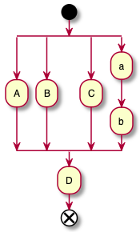

#### 입력 분할 (멀티 시작)
시작 부분의 화살표를 `hidden` 숨기게 되면 멀티 시작을 의미하는 입력 분할 표현이 가능합니다:

```java
@startuml
split
   -[hidden]->
   :A;
split again
   -[hidden]->
   :B;
split again
   -[hidden]->
   :C;
end split
:D;
@enduml
```


```java
@startuml
split
   -[hidden]->
   :A;
split again
   -[hidden]->
   :a;
   :b;
split again
   -[hidden]->
   (Z)
end split
:D;
@enduml
```


#### 출력 분할 (멀티 종료)
`kill` 또는 `detach`를 이용하면 출력 분할 (또는 멀티 종료)를 할 수 있습니다:

```java
@startuml
start
split
   :A;
   kill
split again
   :B;
   detach
split again
   :C;
   kill
end split
@enduml
```


```java
@startuml
start
split
   :A;
   kill
split again
   :b;
   :c;
   detach
split again
   (Z)
   detach
split again
   end
split again
   stop
end split
@enduml
```


### 노트
[creole 위키 문법](https://plantuml.com/ko/creole)을 이용한 노트의 스타일을 지정할 수 있습니다.
또한 `floating` 키워드를 이용하면 연결없이 떠 있는 형태를 표현할 수도 있습니다.

```java
@startuml

start
:foo1;
floating note left: This is a note
:foo2;
note right
  This note is on several
  //lines// and can
  contain <b>HTML</b>
  ====
  * Calling the method ""foo()"" is prohibited
end note
stop

@enduml
```


반대 방향의 활동에도 노트를 달 수 있습니다:
```java
@startuml
start
repeat :Enter data;
:Submit;
backward :Warning;
note right: Note
repeat while (Valid?) is (No) not (Yes)
stop
@enduml
```


분할 활동에도 노트를 달 수 있습니다:
```java
@startuml
start
partition "**process** HelloWorld" {
    note
        This is my note
        ----
        //Creole test//
    end note
    :Ready;
    :HelloWorld(i)>
    :Hello-Sent;
}
@enduml
```


### 색상
각 활동에 대하여 [색상](https://plantuml.com/ko/color)지정이 가능합니다.

```java
@startuml

start
:starting progress;
#HotPink:reading configuration files
These files should be edited at this point!;
#AAAAAA:ending of the process;

@enduml
```


[그라디언트 색상](https://plantuml.com/ko/color)도 가능합니다.
```java
@startuml
start
partition #red/white testPartition {
        #blue\green:testActivity;
}
@enduml
```


### 화살표 없는 연결
`skinparam ArrowHeadColor none`을 이용하면 화살표 없이 라인 연결만 됩니다.

```java
@startuml
skinparam ArrowHeadColor none
start
:Hello world;
:This is on defined on
several **lines**;
stop
@enduml
```


```java
@startuml
skinparam ArrowHeadColor none
start
repeat :Enter data;
:Submit;
backward :Warning;
repeat while (Valid?) is (No) not (Yes)
stop
@enduml
```


### 화살표
`->` 화살표 표현식에 [color](https://plantuml.com/ko/color) 색상 정의를 할 수 있습니다.
각 화살표에 대한 점, 대시, 굵게 등 뿐만 아니라 숨기는 등도 가능합니다.

```java
@startuml
:foo1;
-> You can put text on arrows;
if (test) then
  -[#blue]->
  :foo2;
  -[#green,dashed]-> The text can
  also be on several lines
  and **very** long...;
  :foo3;
else
  -[#black,dotted]->
  :foo4;
endif
-[#gray,bold]->
:foo5;
@enduml
```


### 커넥터
커넥터를 나타내기 위하여 괄호를 이용하면 됩니다.

```java
@startuml
start
:Some activity;
(A)
detach
(A)
:Other activity;
@enduml
```


### 커넥터 색상
커넥터에도 색상, [color](https://plantuml.com/ko/color)을 넣을 수 있습니다.

```java
@startuml
start
:The connector below
wishes he was blue;
#blue:(B)
:This next connector
feels that she would
be better off green;
#green:(G)
stop
@enduml
```


### 그룹 또는 파티션

#### 그룹

액션 객체를 그룹으로 묶을 수 있습니다:

```java
@startuml
start
group Initialization 
    :read config file;
    :init internal variable;
end group
group Running group
    :wait for user interaction;
    :print information;
end group

stop
@enduml
```


#### 파티션
그룹과 유사하게 파티션으로도 그룹 지을 수 있습니다:

```java
@startuml
start
partition Initialization {
    :read config file;
    :init internal variable;
}
partition Running {
    :wait for user interaction;
    :print information;
}

stop
@enduml
```


파티션 색상 [color](https://plantuml.com/ko/color) 변경도 가능합니다:

```java
@startuml
start
partition #lightGreen "Input Interface" {
    :read config file;
    :init internal variable;
}
partition Running {
    :wait for user interaction;
    :print information;
}
stop
@enduml
```


파티션에 [link](https://plantuml.com/ko/link) 링크를 추가하는 것도 가능합니다:
```java
@startuml
start
partition "[[http://plantuml.com partition_name]]" {
    :read doc. on [[http://plantuml.com plantuml_website]];
    :test diagram;
}
end
@enduml
```


#### 그룹, 파티션, 패키지, 네모 또는 카드

그룹을 할 때 다음과 같은 키워드로 그룹 지을 수 있습니다:
* group
* partition
* package
* rectangle
* card

```java
@startuml
start
group Group
  :Activity;
end group
floating note: Note on Group

partition Partition {
  :Activity;
}
floating note: Note on Partition

package Package {
  :Activity;
}
floating note: Note on Package 

rectangle Rectangle {
  :Activity;
}
floating note: Note on Rectangle 

card Card {
  :Activity;
}
floating note: Note on Card
end
@enduml
```


### 수영레인 (Swimlanes)
파이프 기호 `|` 를 이용하여 수영레인을 정의할 수 있습니다.
[color](https://plantuml.com/ko/color) 를 이용한 색상정의도 가능합니다.

```java
@startuml
|Swimlane1|
start
:foo1;
|#AntiqueWhite|Swimlane2|
:foo2;
:foo3;
|Swimlane1|
:foo4;
|Swimlane2|
:foo5;
stop
@enduml
```


`if` 조건식과 `repeat` 또는 `while` 루프에도 이 수영레인을 적용할 수 있습니다.
```java
@startuml
|#pink|Actor_For_red|
start
if (color?) is (red) then
#pink:**action red**;
:foo1;
else (not red)
|#lightgray|Actor_For_no_red|
#lightgray:**action not red**;
:foo2;
endif
|Next_Actor|
#lightblue:foo3;
:foo4;
|Final_Actor|
#palegreen:foo5;
stop
@enduml
```


또한 다음과 같은 `alias` 별칭을 통하여 수영레인을 사용할 수 있습니다:
* `|[#<color>|]<swimlane_alias>| <swimlane_title>`

```java
@startuml
|#palegreen|f| fisherman
|c| cook
|#gold|e| eater
|f|
start
:go fish;
|c|
:fry fish;
|e|
:eat fish;
stop
@enduml
```


### `detach` 또는  `kill`

`detach` 또는 `kill` 키워드를 이용하여 화살표를 지우는 것이 가능합니다:

* `detach`

```java
@startuml
 :start;
 fork
   :foo1;
   :foo2;
 fork again
   :foo3;
   detach
 endfork
 if (foo4) then
   :foo5;
   detach
 endif
 :foo6;
 detach
 :foo7;
 stop
@enduml
```


* `kill`

```java
@startuml
 :start;
 fork
   :foo1;
   :foo2;
 fork again
   :foo3;
   kill
 endfork
 if (foo4) then
   :foo5;
   kill
 endif
 :foo6;
 kill
 :foo7;
 stop
@enduml
```


### SDL (Specification and Description Language)
활동 상태를 그리는 데 마지막 `;` 대신 다음과 같은 것들을 이용하여 [SDL](https://en.wikipedia.org/wiki/Specification_and_Description_Language)을 표현할 수 있습니다:
* `|`
* `<`
* `>`
* `/`
* `\\`
* `]`
* `}`

```java
@startuml
:Ready;
:next(o)|
:Receiving;
split
 :nak(i)<
 :ack(o)>
split again
 :ack(i)<
 :next(o)
 on several lines|
 :i := i + 1]
 :ack(o)>
split again
 :err(i)<
 :nak(o)>
split again
 :foo/
split again
 :bar\\
split again
 :i > 5}
stop
end split
:finish;
@enduml
```


### 종합 예제
```java
@startuml

start
:ClickServlet.handleRequest();
:new page;
if (Page.onSecurityCheck) then (true)
  :Page.onInit();
  if (isForward?) then (no)
    :Process controls;
    if (continue processing?) then (no)
      stop
    endif

    if (isPost?) then (yes)
      :Page.onPost();
    else (no)
      :Page.onGet();
    endif
    :Page.onRender();
  endif
else (false)
endif

if (do redirect?) then (yes)
  :redirect process;
else
  if (do forward?) then (yes)
    :Forward request;
  else (no)
    :Render page template;
  endif
endif

stop

@enduml
```


### 조건 스타일

#### 내부 스타일 (기본)
```java
@startuml
skinparam conditionStyle inside
start
repeat
  :act1;
  :act2;
repeatwhile (<b>end)
:act3;
@enduml
```


```java
@startuml
start
repeat
  :act1;
  :act2;
repeatwhile (<b>end)
:act3;
@enduml
```


#### 다이아몬드 스타일
```java
@startuml
skinparam conditionStyle diamond
start
repeat
  :act1;
  :act2;
repeatwhile (<b>end)
:act3;
@enduml
```


#### InsideDiamond (또는 foo1) 스타일
```java
@startuml
skinparam conditionStyle InsideDiamond
start
repeat
  :act1;
  :act2;
repeatwhile (<b>end)
:act3;
@enduml
```


```java
@startuml
skinparam conditionStyle foo1
start
repeat
  :act1;
  :act2;
repeatwhile (<b>end)
:act3;
@enduml
```


### 조건 마지막 스타일

#### 다이아몬드 스타일 (기본)
* 단일 분기

```java
@startuml
skinparam ConditionEndStyle diamond
:A;
if (decision) then (yes)
    :B1;
else (no)
endif
:C;
@enduml
```


* 2중 분기 (`B1`, `B2`)

```java
@startuml
skinparam ConditionEndStyle diamond
:A;
if (decision) then (yes)
    :B1;
else (no)
    :B2;
endif
:C;
@enduml
```
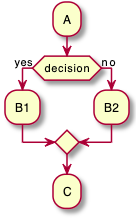

#### 수평 라인 (hline) 스타일
* 단일 분기

```java
@startuml
skinparam ConditionEndStyle hline
:A;
if (decision) then (yes)
    :B1;
else (no)
endif
:C;
@enduml
```


* 2중 분기 (`B1`, `B2`)

```java
@startuml
skinparam ConditionEndStyle hline
:A;
if (decision) then (yes)
    :B1;
else (no)
    :B2;
endif
:C;
@enduml
```


### 글로벌 스타일

#### 글로벌 스타일 없음 (기본)
```java
@startuml
start
:init;
-> test of color;
if (color?) is (<color:red>red) then
:print red;
else 
:print not red;
note right: no color
endif
partition End {
:end;
}
-> this is the end;
end
@enduml
```


#### 스타일 지정
[style](https://plantuml.com/ko/style-evolution) 스타일을 개별 항목에 적용할 수 있습니다.

```java
@startuml
<style>
activityDiagram {
  BackgroundColor #33668E
  BorderColor #33668E
  FontColor #888
  FontName arial

  diamond {
    BackgroundColor #ccf
    LineColor #00FF00
    FontColor green
    FontName arial
    FontSize 15
  }
  arrow {
    FontColor gold
    FontName arial
    FontSize 15
  }
  partition {
    LineColor red
    FontColor green
    RoundCorner 10
    BackgroundColor PeachPuff
  }
  note {
    FontColor Blue
    LineColor Navy
    BackgroundColor #ccf
  }
}
document {
   BackgroundColor transparent
}
</style>
start
:init;
-> test of color;
if (color?) is (<color:red>red) then
:print red;
else 
:print not red;
note right: no color
endif
partition End {
:end;
}
-> this is the end;
end
@enduml
```

## 컴포넌트 다이어그램

### 컴포넌트
컴포넌트는 반드시 대괄호 `[` `]` 로 둘러싸여야 합니다.
컴포넌트를 정의할때 `component` 키워드도 사용할 수 있습니다. `as` 키워드를 이용해서 별칭을 정의할 수도 있습니다. 이 별칭은 뒤에서 관계를 정의할때 사용됩니다.

```java
@startuml

[First component]
[Another component] as Comp2
component Comp3
component [Last\ncomponent] as Comp4

@enduml
```


### 인터페이스
인터페이스는 `(` `)` 기호로 정의될 수 있습니다 (이 기호가 원처럼 보이기 때문입니다).
`interface` 키워드도 인터페이스를 정의하는데 사용할 수 있습니다. `as` 키워드를 이용해서 별칭을 정의할 수도 있습니다. 이 별칭은 뒤에서 관계를 정의할 때 사용됩니다.
인터페이스를 정의하는 일은 선택 사항(optional) 입니다.

```java
@startuml

() "First Interface"
() "Another interface" as Interf2
interface Interf3
interface "Last\ninterface" as Interf4

@enduml
```


### 기본 예제
요소들 간의 연결은 점선 `..`, 실선 `--`, 그리고 화살표 `-->` 등 기호들의 조합으로 생성됩니다.

```java
@startuml

DataAccess - [First Component]
[First Component] ..> HTTP : use

@enduml
```


### 메모 사용하기
각 객체에 관련된 메모를 정의하기 위해 `note left of` , `note right of` , `note top of` , `note bottom of` 키워드를 사용할 수 있습니다.
메모는 또한 `note` 키워드를 통해 단독으로 정의될 수도 있고, 다른 객체들에 `..` 기호로 연결될 수 있습니다.

```java
@startuml

interface "Data Access" as DA

DA - [First Component]
[First Component] ..> HTTP : use

note left of HTTP : Web Service only

note right of [First Component]
  A note can also
  be on several lines
end note

@enduml
```


### 컴포넌트를 그룹화 하기
다음과 같은 키워드를 이용하여 컴포넌트들과 인터페이스들을 그룹으로 나눌 수 있습니다:
* `package`
* `node`
* `folder`
* `frame`
* `cloud`
* `database`

```java
@startuml

package "Some Group" {
  HTTP - [First Component]
  [Another Component]
}

node "Other Groups" {
  FTP - [Second Component]
  [First Component] --> FTP
}

cloud {
  [Example 1]
}


database "MySql" {
  folder "This is my folder" {
    [Folder 3]
  }
  frame "Foo" {
    [Frame 4]
  }
}


[Another Component] --> [Example 1]
[Example 1] --> [Folder 3]
[Folder 3] --> [Frame 4]

@enduml
```


### 화살표 방향 바꾸기
기본적으로 클래스들간의 연결은 두개의 대쉬를 `--` 갖고 방향은 수직 방향입니다. 다음처럼 한개의 대쉬(혹은 점)를 넣어 수평 방향 연결을 사용할 수 있습니다:

```java
@startuml
[Component] --> Interface1
[Component] -> Interface2
@enduml
```


연결을 반전시켜 방향을 바꿀 수도 있습니다:
```java
@startuml
Interface1 <-- [Component]
Interface2 <- [Component]
@enduml
```


화살표 안에 `left`, `right`, `up`, `down` 등 키워드를 추가하여 방향을 바꾸는것도 가능합니다:
```java
@startuml
[Component] -left-> left
[Component] -right-> right
[Component] -up-> up
[Component] -down-> down
@enduml
```


방향을 의미하는 단어의 첫번째 글자만 사용해도 동일한 화살표를 그릴 수 있습니다. (예를 들면, `-down-` 대신 `-d-` 또는 `-do-`).
> 이 기능을 남용하지 말아야 합니다. 그래야 별다른 수정없이도 *GraphViz*가 좋은 결과를 보여줍니다.

### UML2 표시 사용
기본적으로 `v1.2020.13-14` 버전 이후 부터 UML2 표시 방법이 사용됩니다.

```java
@startuml

interface "Data Access" as DA

DA - [First Component]
[First Component] ..> HTTP : use

@enduml
```


### UML1 표시
`skinparam componentStyle uml1` 명령을 이용하면 UML1 형식으로 표시 할 수 있습니다.

```java
@startuml
skinparam componentStyle uml1

interface "Data Access" as DA

DA - [First Component]
[First Component] ..> HTTP : use

@enduml
```


### 사각형 rectangle 표시 (UML 형식 사용안함)
`skinparam componentStyle rectangle` 명령을 사용하면 UML 표시가 안되고 단순 사각형만 표시됩니다.

```java
@startuml
skinparam componentStyle rectangle

interface "Data Access" as DA

DA - [First Component]
[First Component] ..> HTTP : use

@enduml
```


### 긴 설명
컴포넌트 안에 여러 줄의 설명을 대괄호 안에 넣을 수 있습니다.

```java
@startuml
component comp1 [
This component
has a long comment
on several lines
]
@enduml
```


### 개별 색상
각 컴포넌트 정의 후에 개별 색상을 지정할 수 있습니다.

```java
@startuml
component  [Web Server] #Yellow
@enduml
```


### 스테레오타입에 스프라이트(sprite)를 이용한 사용자 정의 아이콘
스테레오타입에 스프라이트(sprite)를 이용한 사용자 정의 아이콘을 사용할 수 있습니다.

```java
@startuml
sprite $businessProcess [16x16/16] {
FFFFFFFFFFFFFFFF
FFFFFFFFFFFFFFFF
FFFFFFFFFFFFFFFF
FFFFFFFFFFFFFFFF
FFFFFFFFFF0FFFFF
FFFFFFFFFF00FFFF
FF00000000000FFF
FF000000000000FF
FF00000000000FFF
FFFFFFFFFF00FFFF
FFFFFFFFFF0FFFFF
FFFFFFFFFFFFFFFF
FFFFFFFFFFFFFFFF
FFFFFFFFFFFFFFFF
FFFFFFFFFFFFFFFF
FFFFFFFFFFFFFFFF
}

rectangle " End to End\nbusiness process" <<$businessProcess>> {
 rectangle "inner process 1" <<$businessProcess>> as src
 rectangle "inner process 2" <<$businessProcess>> as tgt
 src -> tgt
}
@enduml
```


### Skinparam
[skinparam](https://plantuml.com/ko/skinparam) 명령어를 이용하면 객체의 폰트나 색상 조정 등이 가능합니다.

다음과 같은 위치에서 명령을 내릴 수 있습니다:

* 다이어그램 정의부에 다른 명령처럼 설정하거나,
* [included file](https://plantuml.com/ko/preprocessing)에 지정하거나,
* [명령행](https://plantuml.com/ko/command-line) 또는 [ANT task](https://plantuml.com/ko/ant-task)에 제공된 설정파일에 지정할 수 있습니다.

```java
@startuml

skinparam interface {
  backgroundColor RosyBrown
  borderColor orange
}

skinparam component {
  FontSize 13
  BackgroundColor<<Apache>> Pink
  BorderColor<<Apache>> #FF6655
  FontName Courier
  BorderColor black
  BackgroundColor gold
  ArrowFontName Impact
  ArrowColor #FF6655
  ArrowFontColor #777777
}

() "Data Access" as DA
Component "Web Server" as WS << Apache >>

DA - [First Component]
[First Component] ..> () HTTP : use
HTTP - WS

@enduml
```


```java
@startuml
[AA] <<static lib>>
[BB] <<shared lib>>
[CC] <<static lib>>

node node1
node node2 <<shared node>>
database Production

skinparam component {
    backgroundColor<<static lib>> DarkKhaki
    backgroundColor<<shared lib>> Green
}

skinparam node {
borderColor Green
backgroundColor Yellow
backgroundColor<<shared node>> Magenta
}
skinparam databaseBackgroundColor Aqua

@enduml
```


### 특정 SkinParameter

#### 컴포넌트 스타일
* `skinparam componentStyle uml2` 명령 또는 기본적으로 컴포넌트 아이콘이 다음과 같이 적용됩니다

```java
@startuml
skinparam BackgroundColor transparent
skinparam componentStyle uml2
component A {
   component "A.1" {
}
   component A.44 {
      [A4.1]
}
   component "A.2"
   [A.3]
   component A.5 [
A.5] 
   component A.6 [
]
}
[a]->[b]
@enduml
```


* 만약 이런 기본 아이콘을 표시하고 싶지 않다면 `skinparam componentStyle rectangle` 명령을 내립니다

```java
@startuml
skinparam BackgroundColor transparent
skinparam componentStyle rectangle
component A {
   component "A.1" {
}
   component A.44 {
      [A4.1]
}
   component "A.2"
   [A.3]
   component A.5 [
A.5] 
   component A.6 [
]
}
[a]->[b]
@enduml
```


### 링크되지 않은 컴포넌트 숨기기 또는 지우기

기본적으로 모든 컴포넌트는 보입니다:

```java
@startuml
component C1
component C2
component C3
C1 -- C2
@enduml
```


그런데 다음의 hide 명령을 이용하여 링크되지 않은 컴포넌트를 숨길 수 있습니다:
* `hide @unlinked` 컴포넌트:

```java
@startuml
component C1
component C2
component C3
C1 -- C2

hide @unlinked
@enduml
```


* 또는 `remove @unlinked` 컴포넌트: 위의 경우와 동일합니다

```java
@startuml
component C1
component C2
component C3
C1 -- C2

remove @unlinked
@enduml
```


### 태그된 컴포넌트나 와일드카드를 숨기거나, 지우거나 또는 복구
컴포넌트에 `$tags`를 주어 해당 컴포넌트(들)만 숨기거나 지울 수도 있고, 다시 복구할 수도 있습니다.

* 기본적으로 다 보이는 경우
```java
@startuml
component C1 $tag13
component C2
component C3 $tag13
C1 -- C2
@enduml
```


* `hide $tag13` : `$tag13`으로 태그를 단 컴포넌트들을 숨기는 경우

```java
@startuml
component C1 $tag13
component C2
component C3 $tag13
C1 -- C2

hide $tag13
@enduml
```

> 숨기는 경우에는 안 보이는 영역이 그대로 남아 있는 반면, 지우는 경우에는 여백이 사라집니다

* 또는 `remove $tag13` : `$tag13`으로 태그를 단 컴포넌트들을 지우는 경우

```java
@startuml
component C1 $tag13
component C2
component C3 $tag13
C1 -- C2

remove $tag13
@enduml
```


* 또는 `remove $tag13 and restore $tag1` : 해당 태그의 컴포넌트를 지웠다 복구하는 경우

```java
@startuml
component C1 $tag13 $tag1
component C2
component C3 $tag13
C1 -- C2

remove $tag13
restore $tag1
@enduml
```


* or `remove * and restore $tag1` components:

```java
@startuml
component C1 $tag13 $tag1
component C2
component C3 $tag13
C1 -- C2

remove *
restore $tag1
@enduml
```

## 배포(Deployment) 다이어그램

### 요소 정의
```java
@startuml
actor actor
actor/ "actor/"
agent agent
artifact artifact
boundary boundary
card card
circle circle
cloud cloud
collections collections
component component
control control
database database
entity entity
file file
folder folder
frame frame
hexagon hexagon
interface interface
label label
node node
package package
person person
queue queue
rectangle rectangle
stack stack
storage storage
usecase usecase
usecase/ "usecase/"
@enduml
```


`[]` 대괄호를 이용하여 긴 텍스트를 넣을 수 있습니다.

```java
@startuml
folder folder [
This is a <b>folder
----
You can use separator
====
of different kind
....
and style
]

node node [
This is a <b>node
----
You can use separator
====
of different kind
....
and style
]

database database [
This is a <b>database
----
You can use separator
====
of different kind
....
and style
]

usecase usecase [
This is a <b>usecase
----
You can use separator
====
of different kind
....
and style
]

card card [
This is a <b>card
----
You can use separator
====
of different kind
....
and style
<i><color:blue>(add from V1.2020.7)</color></i>
]
@enduml
```
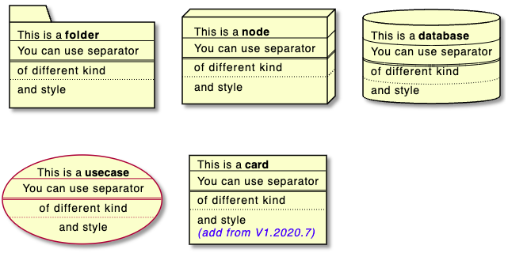

각 요소 항목은 다음 테이블과 같이 간단 표현식이 존재합니다.

| Long form Keyword | Short form Keyword | Long form example | Short form example | Ref. |
|----|---|---|---|---|
|`actor`|`:a:`|`actor actor1`|`:actor2:`|[Actors](https://plantuml.com/use-case-diagram#d9b36998c97be687)|
|`component`|`[c]`|`component component1`|`[component2]`|[Components](https://plantuml.com/component-diagram#05bbb43b3d923283)
`interface`|`()i`|`interface interface1`|`() "interface2"`|[Interfaces](https://plantuml.com/component-diagram#756640f0aea5f5be)
`usecase`|`(u)`|`usecase usecase1`|`(usecase2)`|[Usecases](https://plantuml.com/use-case-diagram#5cb617d22da857ea)

#### 엑터
```java
@startuml

actor actor1
:actor2:

@enduml
```
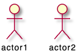

#### 컴포넌트
```java
@startuml

component component1
[component2]

@enduml
```


#### 인터페이스
```java
@startuml

interface interface1
() "interface2"

label "//interface example//"
@enduml
```


#### 유즈케이스
```java
@startuml

usecase usecase1
(usecase2)

@enduml
```


### 링크 또는 화살표
설명글이 있거나 또는 없는 링크 또는 화살표를 만들 수 있습니다:
```java
@startuml

node node1
node node2
node node3
node node4
node node5
node1 -- node2 : label1
node1 .. node3 : label2
node1 ~~ node4 : label3
node1 == node5

@enduml
```


링크의 다양한 형태도 가능합니다:

```java
@startuml

artifact artifact1
artifact artifact2
artifact artifact3
artifact artifact4
artifact artifact5
artifact artifact6
artifact artifact7
artifact artifact8
artifact artifact9
artifact artifact10
artifact1 --> artifact2
artifact1 --* artifact3
artifact1 --o artifact4
artifact1 --+ artifact5
artifact1 --# artifact6
artifact1 -->> artifact7
artifact1 --0 artifact8
artifact1 --^ artifact9
artifact1 --(0 artifact10

@enduml
```


또한 다음과 같은 형태의 링크도 가능합니다:
```java
@startuml

cloud cloud1
cloud cloud2
cloud cloud3
cloud cloud4
cloud cloud5
cloud1 -0- cloud2
cloud1 -0)- cloud3
cloud1 -(0- cloud4
cloud1 -(0)- cloud5

@enduml
```


더 많은 예제:

```java
@startuml
actor foo1
actor foo2
foo1 <-0-> foo2
foo1 <-(0)-> foo2
 
(ac1) -le(0)-> left1
ac1 -ri(0)-> right1
ac1 .up(0).> up1
ac1 ~up(0)~> up2
ac1 -do(0)-> down1
ac1 -do(0)-> down2
 
actor1 -0)- actor2
 
component comp1
component comp2
comp1 *-0)-+ comp2
[comp3] <-->> [comp4]

boundary b1
control c1
b1 -(0)- c1

component comp1
interface interf1
comp1 #~~( interf1

:mode1actor: -0)- fooa1
:mode1actorl: -ri0)- foo1l

[component1] 0)-(0-(0 [componentC]
() component3 )-0-(0 "foo" [componentC]

[aze1] #-->> [aze2]
@enduml
```


### 대괄호 화살표 스타일
*[대괄호 클래스 관계 스타일](https://plantuml.com/ko/class-diagram#chjviqthvhkikfmwbahk)* 과 유사합니다.

#### 라인 스타일
일반 화살표를 포함하여 굵게, 대쉬, 점 또는 숨김 등을 표시할 수도 있습니다:
* 라벨 없이

```java
@startuml
node foo
title Bracketed line style without label
foo --> bar
foo -[bold]-> bar1
foo -[dashed]-> bar2
foo -[dotted]-> bar3
foo -[hidden]-> bar4
foo -[plain]-> bar5
@enduml
```


* 라벨 포함

```java
@startuml
title Bracketed line style with label
node foo
foo --> bar          : ∅
foo -[bold]-> bar1   : [bold]
foo -[dashed]-> bar2 : [dashed]
foo -[dotted]-> bar3 : [dotted]
foo -[hidden]-> bar4 : [hidden]
foo -[plain]-> bar5  : [plain]
@enduml
```


#### 라인 색상
```java
@startuml
title Bracketed line color
node  foo
foo --> bar
foo -[#red]-> bar1     : [#red]
foo -[#green]-> bar2   : [#green]
foo -[#blue]-> bar3    : [#blue]
foo -[#blue;#yellow;#green]-> bar4
@enduml
```
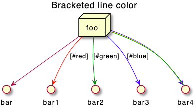

#### 라인 굵기
```java
@startuml
title Bracketed line thickness
node foo
foo --> bar                 : ∅
foo -[thickness=1]-> bar1   : [1]
foo -[thickness=2]-> bar2   : [2]
foo -[thickness=4]-> bar3   : [4]
foo -[thickness=8]-> bar4   : [8]
foo -[thickness=16]-> bar5  : [16]
@enduml
```
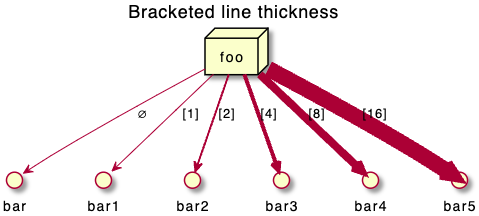

#### 다양한 예제
```java
@startuml
title Bracketed line style mix
node foo
foo --> bar                             : ∅
foo -[#red,thickness=1]-> bar1          : [#red,1]
foo -[#red,dashed,thickness=2]-> bar2   : [#red,dashed,2]
foo -[#green,dashed,thickness=4]-> bar3 : [#green,dashed,4]
foo -[#blue,dotted,thickness=8]-> bar4  : [blue,dotted,8]
foo -[#blue,plain,thickness=16]-> bar5  : [blue,plain,16]
foo -[#blue;#green,dashed,thickness=4]-> bar6  : [blue;green,dashed,4]
@enduml
```


### 화살표 색상 및 스타일 변경 (인라인 형식)
[color](https://plantuml.com/ko/color) 색상 설정을 통한 개별 화살표에 대한 색상과 스타일 등을 바꿀 수 있습니다:
* `#color;line.[bold|dashed|dotted];text:color`

```java
@startuml
node foo
foo --> bar : normal
foo --> bar1 #line:red;line.bold;text:red  : red bold
foo --> bar2 #green;line.dashed;text:green : green dashed 
foo --> bar3 #blue;line.dotted;text:blue   : blue dotted
@enduml
```


### 요소 색상 및 스타일 변경 (인라인 형식)
[color](https://plantuml.com/ko/color) 색상 설정을 통한 개별 요소에 대한 색상과 스타일 등을 바꿀 수 있습니다:
* `#[color|back:color];line:color;line.[bold|dashed|dotted];text:color`

```java
@startuml
agent a
cloud c #pink;line:red;line.bold;text:red
file  f #palegreen;line:green;line.dashed;text:green
node  n #aliceblue;line:blue;line.dotted;text:blue
@enduml
```


```java
@startuml
agent a
cloud c #pink;line:red;line.bold;text:red [
c
cloud description
]
file  f #palegreen;line:green;line.dashed;text:green {
[c1]
[c2]
}
frame frame {
node  n #aliceblue;line:blue;line.dotted;text:blue
}
@enduml
```


### 중첩된 요소
각 요소는 중첩될 수 있습니다:

#### 개별 요소
```java
@startuml
artifact artifact {
}
card card {
}
cloud cloud {
}
component component {
}
database database {
}
file file {
}
folder folder {
}
frame frame {
}
hexagon hexagon {
}
node node {
}
package package {
}
queue queue {
}
rectangle rectangle {
}
stack stack {
}
storage storage {
}
@enduml
```


### 패키지와 중첩된 요소

#### 1단계 예제
```java
@startuml
artifact    artifactVeryLOOOOOOOOOOOOOOOOOOOg    as "artifact" {
file f1
}
card        cardVeryLOOOOOOOOOOOOOOOOOOOg        as "card" {
file f2
}
cloud       cloudVeryLOOOOOOOOOOOOOOOOOOOg       as "cloud" {
file f3
}
component   componentVeryLOOOOOOOOOOOOOOOOOOOg   as "component" {
file f4
}
database    databaseVeryLOOOOOOOOOOOOOOOOOOOg    as "database" {
file f5
}
file        fileVeryLOOOOOOOOOOOOOOOOOOOg        as "file" {
file f6
}
folder      folderVeryLOOOOOOOOOOOOOOOOOOOg      as "folder" {
file f7
}
frame       frameVeryLOOOOOOOOOOOOOOOOOOOg       as "frame" {
file f8
}
hexagon     hexagonVeryLOOOOOOOOOOOOOOOOOOOg     as "hexagon" {
file f9
}
node        nodeVeryLOOOOOOOOOOOOOOOOOOOg        as "node" {
file f10
}
package     packageVeryLOOOOOOOOOOOOOOOOOOOg     as "package" {
file f11
}
queue       queueVeryLOOOOOOOOOOOOOOOOOOOg       as "queue" {
file f12
}
rectangle   rectangleVeryLOOOOOOOOOOOOOOOOOOOg   as "rectangle" {
file f13
}
stack       stackVeryLOOOOOOOOOOOOOOOOOOOg       as "stack" {
file f14
}
storage     storageVeryLOOOOOOOOOOOOOOOOOOOg     as "storage" {
file f15
}
@enduml
```


#### 기타 예제
```java
@startuml
artifact Foo1 {
  folder Foo2
}

folder Foo3 {
  artifact Foo4
}

frame Foo5 {
  database Foo6
}

cloud vpc {
  node ec2 {
    stack stack
  }
}

@enduml
```
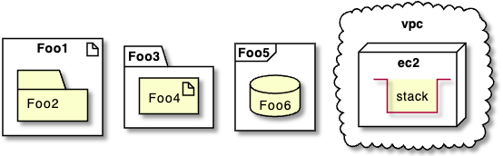

```java
@startuml
node Foo1 {
 cloud Foo2
}

cloud Foo3 {
  frame Foo4
}

database Foo5  {
  storage Foo6
}

storage Foo7 {
  storage Foo8
}
@enduml
```
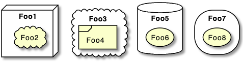

#### 깊은 중첩 예제
* 알파벳 순서 정렬:
```java
@startuml
artifact artifact {
card card {
cloud cloud {
component component {
database database {
file file {
folder folder {
frame frame {
hexagon hexagon {
node node {
package package {
queue queue {
rectangle rectangle {
stack stack {
storage storage {
}
}
}
}
}
}
}
}
}
}
}
}
}
}
}
@enduml
```
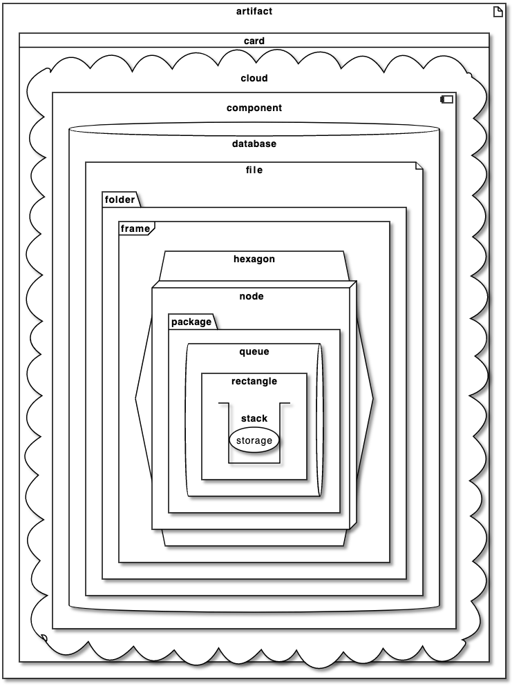

* 또는 역 알파벳 정렬

```java
@startuml
storage storage {
stack stack {
rectangle rectangle {
queue queue {
package package {
node node {
hexagon hexagon {
frame frame {
folder folder {
file file {
database database {
component component {
cloud cloud {
card card {
artifact artifact {
}
}
}
}
}
}
}
}
}
}
}
}
}
}
}
@enduml
```


### 별칭

#### `as`를 이용한 간단한 별칭
```java
@startuml
node Node1 as n1
node "Node 2" as n2
file f1 as "File 1"
cloud c1 as "this
is
a
cloud"
cloud c2 [this
is
another
cloud]

n1 -> n2
n1 --> f1
f1 -> c1
c1 -> c2
@enduml
```


#### 긴 별칭 예제
```java
@startuml
actor        "actor"       as actorVeryLOOOOOOOOOOOOOOOOOOOg
agent        "agent"       as agentVeryLOOOOOOOOOOOOOOOOOOOg
artifact     "artifact"    as artifactVeryLOOOOOOOOOOOOOOOOOOOg
boundary     "boundary"    as boundaryVeryLOOOOOOOOOOOOOOOOOOOg
card         "card"        as cardVeryLOOOOOOOOOOOOOOOOOOOg
cloud        "cloud"       as cloudVeryLOOOOOOOOOOOOOOOOOOOg
collections  "collections" as collectionsVeryLOOOOOOOOOOOOOOOOOOOg
component    "component"   as componentVeryLOOOOOOOOOOOOOOOOOOOg
control      "control"     as controlVeryLOOOOOOOOOOOOOOOOOOOg
database     "database"    as databaseVeryLOOOOOOOOOOOOOOOOOOOg
entity       "entity"      as entityVeryLOOOOOOOOOOOOOOOOOOOg
file         "file"        as fileVeryLOOOOOOOOOOOOOOOOOOOg
folder       "folder"      as folderVeryLOOOOOOOOOOOOOOOOOOOg
frame        "frame"       as frameVeryLOOOOOOOOOOOOOOOOOOOg
hexagon      "hexagon"     as hexagonVeryLOOOOOOOOOOOOOOOOOOOg
interface    "interface"   as interfaceVeryLOOOOOOOOOOOOOOOOOOOg
label        "label"       as labelVeryLOOOOOOOOOOOOOOOOOOOg
node         "node"        as nodeVeryLOOOOOOOOOOOOOOOOOOOg
package      "package"     as packageVeryLOOOOOOOOOOOOOOOOOOOg
person       "person"      as personVeryLOOOOOOOOOOOOOOOOOOOg
queue        "queue"       as queueVeryLOOOOOOOOOOOOOOOOOOOg
stack        "stack"       as stackVeryLOOOOOOOOOOOOOOOOOOOg
rectangle    "rectangle"   as rectangleVeryLOOOOOOOOOOOOOOOOOOOg
storage      "storage"     as storageVeryLOOOOOOOOOOOOOOOOOOOg
usecase      "usecase"     as usecaseVeryLOOOOOOOOOOOOOOOOOOOg
@enduml
```
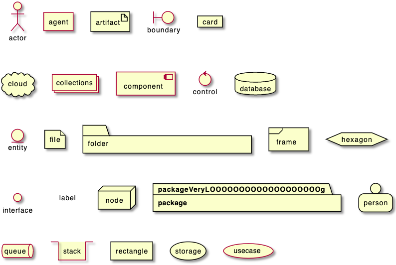

```java
@startuml
actor       actorVeryLOOOOOOOOOOOOOOOOOOOg       as "actor"
agent       agentVeryLOOOOOOOOOOOOOOOOOOOg       as "agent"
artifact    artifactVeryLOOOOOOOOOOOOOOOOOOOg    as "artifact"
boundary    boundaryVeryLOOOOOOOOOOOOOOOOOOOg    as "boundary"
card        cardVeryLOOOOOOOOOOOOOOOOOOOg        as "card"
cloud       cloudVeryLOOOOOOOOOOOOOOOOOOOg       as "cloud"
collections collectionsVeryLOOOOOOOOOOOOOOOOOOOg as "collections"
component   componentVeryLOOOOOOOOOOOOOOOOOOOg   as "component"
control     controlVeryLOOOOOOOOOOOOOOOOOOOg     as "control"
database    databaseVeryLOOOOOOOOOOOOOOOOOOOg    as "database"
entity      entityVeryLOOOOOOOOOOOOOOOOOOOg      as "entity"
file        fileVeryLOOOOOOOOOOOOOOOOOOOg        as "file"
folder      folderVeryLOOOOOOOOOOOOOOOOOOOg      as "folder"
frame       frameVeryLOOOOOOOOOOOOOOOOOOOg       as "frame"
hexagon     hexagonVeryLOOOOOOOOOOOOOOOOOOOg     as "hexagon"
interface   interfaceVeryLOOOOOOOOOOOOOOOOOOOg   as "interface"
label       labelVeryLOOOOOOOOOOOOOOOOOOOg       as "label"
node        nodeVeryLOOOOOOOOOOOOOOOOOOOg        as "node"
package     packageVeryLOOOOOOOOOOOOOOOOOOOg     as "package"
person      personVeryLOOOOOOOOOOOOOOOOOOOg      as "person"
queue       queueVeryLOOOOOOOOOOOOOOOOOOOg       as "queue"
stack       stackVeryLOOOOOOOOOOOOOOOOOOOg       as "stack"
rectangle   rectangleVeryLOOOOOOOOOOOOOOOOOOOg   as "rectangle"
storage     storageVeryLOOOOOOOOOOOOOOOOOOOg     as "storage"
usecase     usecaseVeryLOOOOOOOOOOOOOOOOOOOg     as "usecase"
@enduml
```


### 끝이 둥근 사각형
```java
@startuml
skinparam rectangle {
    roundCorner<<Concept>> 25
}

rectangle "Concept Model" <<Concept>> {
rectangle "Example 1" <<Concept>> as ex1
rectangle "Another rectangle"
}
@enduml
```


### 특정 SkinParameter

#### roundCorner
```java
@startuml
skinparam roundCorner 15
actor actor
agent agent
artifact artifact
boundary boundary
card card
circle circle
cloud cloud
collections collections
component component
control control
database database
entity entity
file file
folder folder
frame frame
hexagon hexagon
interface interface
label label
node node
package package
person person
queue queue
rectangle rectangle
stack stack
storage storage
usecase usecase
@enduml
```


### 부록: 모든 종류의 화살표
```java
@startuml
left to right direction
skinparam nodesep 5

f3  ~~  b3  : ""~~""\n//dotted//
f2  ..  b2  : ""..""\n//dashed//
f1  ==  b1  : ""==""\n//bold//
f0  --  b0  : ""--""\n//plain//
@enduml
```


### 부록: 모든 종류의 화살표 모양

#### 화살표 모양 형태
```java
@startuml
left to right direction
skinparam nodesep 5

f13 --0   b13 : ""--0""
f12 --@   b12 : ""--@""
f11 --:|> b11 : ""--:|>""
f10 --||> b10 : ""--||>""
f9  --|>  b9  : ""--|>""
f8  --^   b8  : ""--^ ""
f7  --\\  b7  : ""--\\\\""
f6  --#   b6  : ""--# ""
f5  --+   b5  : ""--+ ""
f4  --o   b4  : ""--o ""
f3  --*   b3  : ""--* ""
f2  -->>  b2  : ""-->>""
f1  -->   b1  : ""--> ""
f0  --    b0  : ""--  ""
@enduml
```
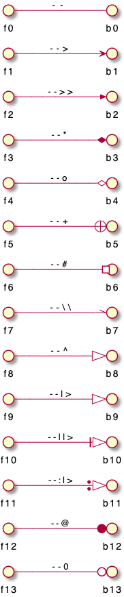

#### '0' 화살표 또는 원 화살표
```java
@startuml
left to right direction
skinparam nodesep 5

f10 0--0 b10 : "" 0--0 ""
f9 )--(  b9  : "" )--( ""
f8 0)--(0 b8 : "" 0)--(0""
f7 0)--  b7  : "" 0)-- ""
f6 -0)-  b6  : "" -0)- ""
f5 -(0)- b5  : "" -(0)-""
f4 -(0-  b4  : "" -(0- ""
f3 --(0  b3  : "" --(0 ""
f2 --(   b2  : "" --(  ""
f1 --0   b1  : "" --0  ""
@enduml
```
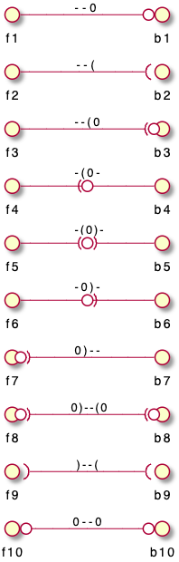

### 부록: 모든 요소에 대한 인라인 스타일

#### 간단한 요소
```java
@startuml
actor actor             #aliceblue;line:blue;line.dotted;text:blue
actor/ "actor/"         #aliceblue;line:blue;line.dotted;text:blue
agent agent             #aliceblue;line:blue;line.dotted;text:blue
artifact artifact       #aliceblue;line:blue;line.dotted;text:blue
boundary boundary       #aliceblue;line:blue;line.dotted;text:blue
card card               #aliceblue;line:blue;line.dotted;text:blue
circle circle           #aliceblue;line:blue;line.dotted;text:blue
cloud cloud             #aliceblue;line:blue;line.dotted;text:blue
collections collections #aliceblue;line:blue;line.dotted;text:blue
component component     #aliceblue;line:blue;line.dotted;text:blue
control control         #aliceblue;line:blue;line.dotted;text:blue
database database       #aliceblue;line:blue;line.dotted;text:blue
entity entity           #aliceblue;line:blue;line.dotted;text:blue
file file               #aliceblue;line:blue;line.dotted;text:blue
folder folder           #aliceblue;line:blue;line.dotted;text:blue
frame frame             #aliceblue;line:blue;line.dotted;text:blue
hexagon hexagon         #aliceblue;line:blue;line.dotted;text:blue
interface interface     #aliceblue;line:blue;line.dotted;text:blue
label label             #aliceblue;line:blue;line.dotted;text:blue
node node               #aliceblue;line:blue;line.dotted;text:blue
package package         #aliceblue;line:blue;line.dotted;text:blue
person person           #aliceblue;line:blue;line.dotted;text:blue
queue queue             #aliceblue;line:blue;line.dotted;text:blue
rectangle rectangle     #aliceblue;line:blue;line.dotted;text:blue
stack stack             #aliceblue;line:blue;line.dotted;text:blue
storage storage         #aliceblue;line:blue;line.dotted;text:blue
usecase usecase         #aliceblue;line:blue;line.dotted;text:blue
usecase/ "usecase/"     #aliceblue;line:blue;line.dotted;text:blue
@enduml
```
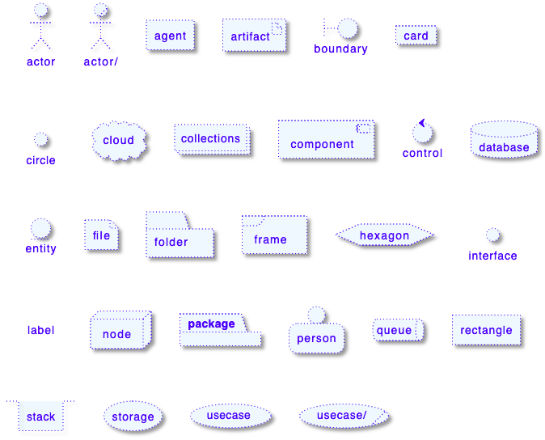

#### 중첩된 요소

##### 하위 요소가 없는 경우
```java
@startuml
artifact artifact #aliceblue;line:blue;line.dotted;text:blue {
}
card card #aliceblue;line:blue;line.dotted;text:blue {
}
cloud cloud #aliceblue;line:blue;line.dotted;text:blue {
}
component component #aliceblue;line:blue;line.dotted;text:blue {
}
database database #aliceblue;line:blue;line.dotted;text:blue {
}
file file #aliceblue;line:blue;line.dotted;text:blue {
}
folder folder #aliceblue;line:blue;line.dotted;text:blue {
}
frame frame #aliceblue;line:blue;line.dotted;text:blue {
}
hexagon hexagon #aliceblue;line:blue;line.dotted;text:blue {
}
node node #aliceblue;line:blue;line.dotted;text:blue {
}
package package #aliceblue;line:blue;line.dotted;text:blue {
}
queue queue #aliceblue;line:blue;line.dotted;text:blue {
}
rectangle rectangle #aliceblue;line:blue;line.dotted;text:blue {
}
stack stack #aliceblue;line:blue;line.dotted;text:blue {
}
storage storage #aliceblue;line:blue;line.dotted;text:blue {
}
@enduml
```


##### 하위 요소가 있는 경우
```java
@startuml
artifact    artifactVeryLOOOOOOOOOOOOOOOOOOOg    as "artifact" #aliceblue;line:blue;line.dotted;text:blue {
file f1
}
card        cardVeryLOOOOOOOOOOOOOOOOOOOg        as "card" #aliceblue;line:blue;line.dotted;text:blue {
file f2
}
cloud       cloudVeryLOOOOOOOOOOOOOOOOOOOg       as "cloud" #aliceblue;line:blue;line.dotted;text:blue {
file f3
}
component   componentVeryLOOOOOOOOOOOOOOOOOOOg   as "component" #aliceblue;line:blue;line.dotted;text:blue {
file f4
}
database    databaseVeryLOOOOOOOOOOOOOOOOOOOg    as "database" #aliceblue;line:blue;line.dotted;text:blue {
file f5
}
file        fileVeryLOOOOOOOOOOOOOOOOOOOg        as "file" #aliceblue;line:blue;line.dotted;text:blue {
file f6
}
folder      folderVeryLOOOOOOOOOOOOOOOOOOOg      as "folder" #aliceblue;line:blue;line.dotted;text:blue {
file f7
}
frame       frameVeryLOOOOOOOOOOOOOOOOOOOg       as "frame" #aliceblue;line:blue;line.dotted;text:blue {
file f8
}
hexagon     hexagonVeryLOOOOOOOOOOOOOOOOOOOg     as "hexagon" #aliceblue;line:blue;line.dotted;text:blue {
file f9
}
node        nodeVeryLOOOOOOOOOOOOOOOOOOOg        as "node" #aliceblue;line:blue;line.dotted;text:blue {
file f10
}
package     packageVeryLOOOOOOOOOOOOOOOOOOOg     as "package" #aliceblue;line:blue;line.dotted;text:blue {
file f11
}
queue       queueVeryLOOOOOOOOOOOOOOOOOOOg       as "queue" #aliceblue;line:blue;line.dotted;text:blue {
file f12
}
rectangle   rectangleVeryLOOOOOOOOOOOOOOOOOOOg   as "rectangle" #aliceblue;line:blue;line.dotted;text:blue {
file f13
}
stack       stackVeryLOOOOOOOOOOOOOOOOOOOg       as "stack" #aliceblue;line:blue;line.dotted;text:blue {
file f14
}
storage     storageVeryLOOOOOOOOOOOOOOOOOOOg     as "storage" #aliceblue;line:blue;line.dotted;text:blue {
file f15
}
@enduml
```


### 부록: 모든 요소의 스타일 테스트

#### 간단한 요소

##### 글로벌 스타일 (componentDiagram)
```java
@startuml
<style>
componentDiagram {
  BackGroundColor palegreen
  LineThickness 1
  LineColor red
}
document {
  BackGroundColor white
}
</style>
actor actor
actor/ "actor/"
agent agent
artifact artifact
boundary boundary
card card
circle circle
cloud cloud
collections collections
component component
control control
database database
entity entity
file file
folder folder
frame frame
hexagon hexagon
interface interface
label label
node node
package package
person person
queue queue
rectangle rectangle
stack stack
storage storage
usecase usecase
usecase/ "usecase/"
@enduml
```


##### 개별 요소의 스타일
```java
@startuml
<style>
actor {
  BackGroundColor #f80c12
  LineThickness 1
  LineColor black
}
agent {
  BackGroundColor #f80c12
  LineThickness 1
  LineColor black
}
artifact {
  BackGroundColor #ee1100
  LineThickness 1
  LineColor black
}
boundary {
  BackGroundColor #ee1100
  LineThickness 1
  LineColor black
}
card {
  BackGroundColor #ff3311
  LineThickness 1
  LineColor black
}
circle {
  BackGroundColor #ff3311
  LineThickness 1
  LineColor black
}
cloud {
  BackGroundColor #ff4422
  LineThickness 1
  LineColor black
}
collections {
  BackGroundColor #ff4422
  LineThickness 1
  LineColor black
}
component {
  BackGroundColor #ff6644
  LineThickness 1
  LineColor black
}
control {
  BackGroundColor #ff6644
  LineThickness 1
  LineColor black
}
database {
  BackGroundColor #ff9933
  LineThickness 1
  LineColor black
}
entity {
  BackGroundColor #feae2d
  LineThickness 1
  LineColor black
}
file {
  BackGroundColor #feae2d
  LineThickness 1
  LineColor black
}
folder {
  BackGroundColor #ccbb33
  LineThickness 1
  LineColor black
}
frame {
  BackGroundColor #d0c310
  LineThickness 1
  LineColor black
}
hexagon {
  BackGroundColor #aacc22
  LineThickness 1
  LineColor black
}
interface {
  BackGroundColor #69d025
  LineThickness 1
  LineColor black
}
label {
  BackGroundColor black
  LineThickness 1
  LineColor black
}
node {
  BackGroundColor #22ccaa
  LineThickness 1
  LineColor black
}
package {
  BackGroundColor #12bdb9
  LineThickness 1
  LineColor black
}
person {
  BackGroundColor #11aabb
  LineThickness 1
  LineColor black
}
queue {
  BackGroundColor #11aabb
  LineThickness 1
  LineColor black
}
rectangle {
  BackGroundColor #4444dd
  LineThickness 1
  LineColor black
}
stack {
  BackGroundColor #3311bb
  LineThickness 1
  LineColor black
}
storage {
  BackGroundColor #3b0cbd
  LineThickness 1
  LineColor black
}
usecase {
  BackGroundColor #442299
  LineThickness 1
  LineColor black
}
</style>
actor actor
actor/ "actor/"
agent agent
artifact artifact
boundary boundary
card card
circle circle
cloud cloud
collections collections
component component
control control
database database
entity entity
file file
folder folder
frame frame
hexagon hexagon
interface interface
label label
node node
package package
person person
queue queue
rectangle rectangle
stack stack
storage storage
usecase usecase
usecase/ "usecase/"
@enduml
```


#### 라벨없는 중첩 요소

##### 글롤벌 스타일 (componentDiagram)

```java@startuml
<style>
componentDiagram {
  BackGroundColor palegreen
  LineThickness 2
  LineColor red
}
</style>
artifact artifact {
}
card card {
}
cloud cloud {
}
component component {
}
database database {
}
file file {
}
folder folder {
}
frame frame {
}
hexagon hexagon {
}
node node {
}
package package {
}
queue queue {
}
rectangle rectangle {
}
stack stack {
}
storage storage {
}
@enduml
```


##### 중첩 요소의 개별 스타일
```java
@startuml
<style>
artifact {
  BackGroundColor #ee1100
  LineThickness 1
  LineColor black
}
card {
  BackGroundColor #ff3311
  LineThickness 1
  LineColor black
}
cloud {
  BackGroundColor #ff4422
  LineThickness 1
  LineColor black
}
component {
  BackGroundColor #ff6644
  LineThickness 1
  LineColor black
}
database {
  BackGroundColor #ff9933
  LineThickness 1
  LineColor black
}
file {
  BackGroundColor #feae2d
  LineThickness 1
  LineColor black
}
folder {
  BackGroundColor #ccbb33
  LineThickness 1
  LineColor black
}
frame {
  BackGroundColor #d0c310
  LineThickness 1
  LineColor black
}
hexagon {
  BackGroundColor #aacc22
  LineThickness 1
  LineColor black
}
node {
  BackGroundColor #22ccaa
  LineThickness 1
  LineColor black
}
package {
  BackGroundColor #12bdb9
  LineThickness 1
  LineColor black
}
queue {
  BackGroundColor #11aabb
  LineThickness 1
  LineColor black
}
rectangle {
  BackGroundColor #4444dd
  LineThickness 1
  LineColor black
}
stack {
  BackGroundColor #3311bb
  LineThickness 1
  LineColor black
}
storage {
  BackGroundColor #3b0cbd
  LineThickness 1
  LineColor black
}

</style>
artifact artifact {
}
card card {
}
cloud cloud {
}
component component {
}
database database {
}
file file {
}
folder folder {
}
frame frame {
}
hexagon hexagon {
}
node node {
}
package package {
}
queue queue {
}
rectangle rectangle {
}
stack stack {
}
storage storage {
}
@enduml
```


#### 1단계 중첩 요소

##### 글로벌 스타일 (componentDiagram)
```java
@startuml
<style>
componentDiagram {
  BackGroundColor palegreen
  LineThickness 1
  LineColor red
}
document {
  BackGroundColor white
}
</style>
artifact e1 as "artifact" {
file f1
}
card e2 as "card" {
file f2
}
cloud e3 as "cloud" {
file f3
}
component e4 as "component" {
file f4
}
database e5 as "database" {
file f5
}
file e6 as "file" {
file f6
}
folder e7 as "folder" {
file f7
}
frame e8 as "frame" {
file f8
}
hexagon e9 as "hexagon" {
file f9
}
node e10 as "node" {
file f10
}
package e11 as "package" {
file f11
}
queue e12 as "queue" {
file f12
}
rectangle e13 as "rectangle" {
file f13
}
stack e14 as "stack" {
file f14
}
storage e15 as "storage" {
file f15
}
@enduml
```


##### 중첩된 요소의 개별 스타일
```java
@startuml
<style>
artifact {
  BackGroundColor #ee1100
  LineThickness 1
  LineColor black
}
card {
  BackGroundColor #ff3311
  LineThickness 1
  LineColor black
}
cloud {
  BackGroundColor #ff4422
  LineThickness 1
  LineColor black
}
component {
  BackGroundColor #ff6644
  LineThickness 1
  LineColor black
}
database {
  BackGroundColor #ff9933
  LineThickness 1
  LineColor black
}
file {
  BackGroundColor #feae2d
  LineThickness 1
  LineColor black
}
folder {
  BackGroundColor #ccbb33
  LineThickness 1
  LineColor black
}
frame {
  BackGroundColor #d0c310
  LineThickness 1
  LineColor black
}
hexagon {
  BackGroundColor #aacc22
  LineThickness 1
  LineColor black
}
node {
  BackGroundColor #22ccaa
  LineThickness 1
  LineColor black
}
package {
  BackGroundColor #12bdb9
  LineThickness 1
  LineColor black
}
queue {
  BackGroundColor #11aabb
  LineThickness 1
  LineColor black
}
rectangle {
  BackGroundColor #4444dd
  LineThickness 1
  LineColor black
}
stack {
  BackGroundColor #3311bb
  LineThickness 1
  LineColor black
}
storage {
  BackGroundColor #3b0cbd
  LineThickness 1
  LineColor black
}
</style>
artifact e1 as "artifact" {
file f1
}
card e2 as "card" {
file f2
}
cloud e3 as "cloud" {
file f3
}
component e4 as "component" {
file f4
}
database e5 as "database" {
file f5
}
file e6 as "file" {
file f6
}
folder e7 as "folder" {
file f7
}
frame e8 as "frame" {
file f8
}
hexagon e9 as "hexagon" {
file f9
}
node e10 as "node" {
file f10
}
package e11 as "package" {
file f11
}
queue e12 as "queue" {
file f12
}
rectangle e13 as "rectangle" {
file f13
}
stack e14 as "stack" {
file f14
}
storage e15 as "storage" {
file f15
}
@enduml
```


### 부록: 모든 요소에 스테레오타입 스타일 적용

#### 간단 요소
```java
@startuml
<style>
.stereo {
  BackgroundColor palegreen
}
</style>
actor actor << stereo >>
actor/ "actor/" << stereo >>
agent agent << stereo >>
artifact artifact << stereo >>
boundary boundary << stereo >>
card card << stereo >>
circle circle << stereo >>
cloud cloud << stereo >>
collections collections << stereo >>
component component << stereo >>
control control << stereo >>
database database << stereo >>
entity entity << stereo >>
file file << stereo >>
folder folder << stereo >>
frame frame << stereo >>
hexagon hexagon << stereo >>
interface interface << stereo >>
label label << stereo >>
node node << stereo >>
package package << stereo >>
person person << stereo >>
queue queue << stereo >>
rectangle rectangle << stereo >>
stack stack << stereo >>
storage storage << stereo >>
usecase usecase << stereo >>
usecase/ "usecase/" << stereo >>
@enduml
```

## 상태 다이어그램

### 간단한 상태
`[*]`을 사용해서 시작점과 종료점을 그립니다.
`-->`를 사용해서 화살표를 그립니다.

```java
@startuml

[*] --> State1
State1 --> [*]
State1 : this is a string
State1 : this is another string

State1 -> State2
State2 --> [*]

@enduml
```


### 상태 설명이 없는 경우
`hide empty description` 명령을  주면 설명이 없는 상태에 대해 간단한 도형을 그립니다.

```java
@startuml
hide empty description
[*] --> State1
State1 --> [*]
State1 : this is a string
State1 : this is another string

State1 -> State2
State2 --> [*]
@enduml
```


### 상태 수정
상태는 중첩될 수 있습니다. 다음과 같이 `state` 키워드와 대괄호를 활용합니다.

```java
@startuml
scale 350 width
[*] --> NotShooting

state NotShooting {
  [*] --> Idle
  Idle --> Configuring : EvConfig
  Configuring --> Idle : EvConfig
}

state Configuring {
  [*] --> NewValueSelection
  NewValueSelection --> NewValuePreview : EvNewValue
  NewValuePreview --> NewValueSelection : EvNewValueRejected
  NewValuePreview --> NewValueSelection : EvNewValueSaved

  state NewValuePreview {
     State1 -> State2
  }

}
@enduml
```


### 긴 이름
`state` 키워드를 사용하면 이름이 긴 상태들을 만들 수 있습니다.

```java
@startuml
scale 600 width

[*] -> State1
State1 --> State2 : Succeeded
State1 --> [*] : Aborted
State2 --> State3 : Succeeded
State2 --> [*] : Aborted
state State3 {
  state "Accumulate Enough Data\nLong State Name" as long1
  long1 : Just a test
  [*] --> long1
  long1 --> long1 : New Data
  long1 --> ProcessData : Enough Data
}
State3 --> State3 : Failed
State3 --> [*] : Succeeded / Save Result
State3 --> [*] : Aborted

@enduml
```


### 상태 히스토리 `[H], [H*]`
간단한 상태 히스토리를 위하여 `[H]` 또는 깊은 하위 상태 히스토리를 위한 `[H*]`를 이용할 수 있습니다.

```java
@startuml
[*] -> State1
State1 --> State2 : Succeeded
State1 --> [*] : Aborted
State2 --> State3 : Succeeded
State2 --> [*] : Aborted
state State3 {
  state "Accumulate Enough Data" as long1
  long1 : Just a test
  [*] --> long1
  long1 --> long1 : New Data
  long1 --> ProcessData : Enough Data
  State2 --> [H]: Resume
}
State3 --> State2 : Pause
State2 --> State3[H*]: DeepResume
State3 --> State3 : Failed
State3 --> [*] : Succeeded / Save Result
State3 --> [*] : Aborted
@enduml
```


### Fork [fork, join]
`<<fork>> `와 `<<join>>` 스테레오타입을 통하여 병렬 작업을 표현할 수 있습니다.

```java
@startuml

state fork_state <<fork>>
[*] --> fork_state
fork_state --> State2
fork_state --> State3

state join_state <<join>>
State2 --> join_state
State3 --> join_state
join_state --> State4
State4 --> [*]

@enduml
```


### 동시 상태 [--, ||]
`--` 또는 `||` 구분자를 이용하여 동시에 나타나는 상태를 표현할 수 있습니다.

#### 가로 구분자 `--`
```java
@startuml
[*] --> Active

state Active {
  [*] -> NumLockOff
  NumLockOff --> NumLockOn : EvNumLockPressed
  NumLockOn --> NumLockOff : EvNumLockPressed
  --
  [*] -> CapsLockOff
  CapsLockOff --> CapsLockOn : EvCapsLockPressed
  CapsLockOn --> CapsLockOff : EvCapsLockPressed
  --
  [*] -> ScrollLockOff
  ScrollLockOff --> ScrollLockOn : EvCapsLockPressed
  ScrollLockOn --> ScrollLockOff : EvCapsLockPressed
}

@enduml
```


#### 세로 구분자 `||`
```java
@startuml
[*] --> Active

state Active {
  [*] -> NumLockOff
  NumLockOff --> NumLockOn : EvNumLockPressed
  NumLockOn --> NumLockOff : EvNumLockPressed
  ||
  [*] -> CapsLockOff
  CapsLockOff --> CapsLockOn : EvCapsLockPressed
  CapsLockOn --> CapsLockOff : EvCapsLockPressed
  ||
  [*] -> ScrollLockOff
  ScrollLockOff --> ScrollLockOn : EvCapsLockPressed
  ScrollLockOn --> ScrollLockOff : EvCapsLockPressed
}

@enduml
```


### 조건 [choice]
스테레오타입 `<<choice>>`을 이용하여 조건 상태를 표현할 수 있습니다.

```java
@startuml
state "Req(Id)" as ReqId <<sdlreceive>>
state "Minor(Id)" as MinorId
state "Major(Id)" as MajorId
 
state c <<choice>>
 
Idle --> ReqId
ReqId --> c
c --> MinorId : [Id <= 10]
c --> MajorId : [Id > 10]
@enduml
```


### 스테레오타입을 이용한 충분한 예제 [choice, fork, join, end]
```java
@startuml
state choice1 <<choice>>
state fork1   <<fork>>
state join2   <<join>>
state end3    <<end>>

[*]     --> choice1 : from start\nto choice
choice1 --> fork1   : from choice\nto fork
choice1 --> join2   : from choice\nto join
choice1 --> end3    : from choice\nto end

fork1   ---> State1 : from fork\nto state
fork1   --> State2  : from fork\nto state

State2  --> join2   : from state\nto join
State1  --> [*]     : from state\nto end

join2   --> [*]     : from join\nto end
@enduml
```


### 포인트 [entryPoint, exitPoint]
`<<entryPoint>>` 와 `<<exitPoint>>` 스테레오타입을 이용하여 상태에 진입점과 진출점을 표현할 수 있습니다:
```java
@startuml
state Somp {
  state entry1 <<entryPoint>>
  state entry2 <<entryPoint>>
  state sin
  entry1 --> sin
  entry2 -> sin
  sin -> sin2
  sin2 --> exitA <<exitPoint>>
}

[*] --> entry1
exitA --> Foo
Foo1 -> entry2
@enduml
```


### 핀 [inputPin, outputPin]
위의 상태에 진출점, 진입점과 유사하게 **핀** `<<inputPin>>` 과 `<<outputPin>>` 스테레오타입을 이용할 수도 있습니다:
```java
@startuml
state Somp {
  state entry1 <<inputPin>>
  state entry2 <<inputPin>>
  state sin
  entry1 --> sin
  entry2 -> sin
  sin -> sin2
  sin2 --> exitA <<outputPin>>
}

[*] --> entry1
exitA --> Foo
Foo1 -> entry2
@enduml
```


### 확장 [expansionInput, expansionOutput]
`<<expansionInput>>` 과 `<<expansionOutput>>` 스테레오타입을 이용한 **확장** 을 다음과 같이 그릴 수도 있습니다:
```java
@startuml
state Somp {
  state entry1 <<expansionInput>>
  state entry2 <<expansionInput>>
  state sin
  entry1 --> sin
  entry2 -> sin
  sin -> sin2
  sin2 --> exitA <<expansionOutput>>
}

[*] --> entry1
exitA --> Foo
Foo1 -> entry2
@enduml
```


### 화살표 방향
`->` 와 같은 방식으로 수평 화살표를 그릴 수 있는데, 다음과 같은 방법으로 방향을 지정할 수 있습니다:
* `-down->` 또는 `-->`
* `-right->` 또는 `->` *(기본)*
* `-left->`
* `-up->`

```java
@startuml

[*] -up-> First
First -right-> Second
Second --> Third
Third -left-> Last

@enduml
```


> `-down-` 대신 `-d-` 또는 `-do-`와 같이 축약하여 사용할 수 있습니다. (권장하지는 않습니다)

### 라인 색상과 스타일 변경
라인의 [color](https://plantuml.com/ko/color) 색상 뿐만 아니라 스타일 등도 변경 가능합니다.

```java
@startuml
State S1
State S2
S1 -[#DD00AA]-> S2
S1 -left[#yellow]-> S3
S1 -up[#red,dashed]-> S4
S1 -right[dotted,#blue]-> S5

X1 -[dashed]-> X2
Z1 -[dotted]-> Z2
Y1 -[#blue,bold]-> Y2
@enduml
```


### 노트
`note left of`, `note right of`, `note top of`, `note bottom of` 등의 키워드를 이용하여 각 상태에 노트를 달 수 있습니다. 또한 라인에도 노트를 달 수 있습니다.

```java
@startuml

[*] --> Active
Active --> Inactive

note left of Active : this is a short\nnote

note right of Inactive
  A note can also
  be defined on
  several lines
end note

@enduml
```


또한 연결없이 떠 있는 것도 가능합니다.
```java
@startuml

state foo
note "This is a floating note" as N1

@enduml
```


### 링크에 노트 달기
`note on link` 키워드를 이용하면 링크에도 노트를 달 수 있습니다.

```java
@startuml
[*] -> State1
State1 --> State2
note on link 
  this is a state-transition note 
end note
@enduml
```


### 기타 노트에 관한 사항
중첩된 상태에도 노트를 달 수 있습니다.

```java
@startuml

[*] --> NotShooting

state "Not Shooting State" as NotShooting {
  state "Idle mode" as Idle
  state "Configuring mode" as Configuring
  [*] --> Idle
  Idle --> Configuring : EvConfig
  Configuring --> Idle : EvConfig
}

note right of NotShooting : This is a note on a composite state

@enduml
```


### 인라인 색상
```java
@startuml
state CurrentSite #pink {
    state HardwareSetup #lightblue {
       state Site #brown
        Site -[hidden]-> Controller
        Controller -[hidden]-> Devices
    }
    state PresentationSetup{
        Groups -[hidden]-> PlansAndGraphics
    }
    state Trends #FFFF77
    state Schedule #magenta
    state AlarmSupression
}
@enduml
```


### Skinparam
[skinparam](https://plantuml.com/ko/skinparam) 명령어를 이용하면 객체의 폰트나 색상 조정 등이 가능합니다.

다음과 같은 위치에서 명령을 내릴 수 있습니다:

* 다이어그램 정의부에 다른 명령처럼 설정하거나,
* [included file](https://plantuml.com/ko/preprocessing)에 지정하거나,
* [명령행](https://plantuml.com/ko/command-line) 또는 [ANT task](https://plantuml.com/ko/ant-task)에 제공된 설정파일에 지정할 수 있습니다.

스테레오타입의 상태에 특정 색상이나 폰트 등을 정의할 수 있습니다.

```java
@startuml
skinparam backgroundColor LightYellow
skinparam state {
  StartColor MediumBlue
  EndColor Red
  BackgroundColor Peru
  BackgroundColor<<Warning>> Olive
  BorderColor Gray
  FontName Impact
}

[*] --> NotShooting

state "Not Shooting State" as NotShooting {
  state "Idle mode" as Idle <<Warning>>
  state "Configuring mode" as Configuring
  [*] --> Idle
  Idle --> Configuring : EvConfig
  Configuring --> Idle : EvConfig
}

NotShooting --> [*]
@enduml
```


#### 상태 다이어그램에 모든 skinparam 적용
```java
@startuml
skinparam State {
  AttributeFontColor blue
  AttributeFontName serif
  AttributeFontSize  9
  AttributeFontStyle italic
  BackgroundColor palegreen
  BorderColor violet
  EndColor gold
  FontColor red
  FontName Sanserif
  FontSize 15
  FontStyle bold
  StartColor silver
}

state A : a a a\na
state B : b b b\nb

[*] -> A  : start
A -> B : a2b
B -> [*] : end
@enduml
```


### 스타일 변경
[style](https://plantuml.com/ko/style-evolution) 스타일 변경이 가능합니다.

```java
@startuml

<style>
stateDiagram {
  BackgroundColor Peru
  'LineColor Gray
  FontName Impact
  FontColor Red
  arrow {
    FontSize 13
    LineColor Blue
  }
}
</style>


[*] --> NotShooting

state "Not Shooting State" as NotShooting {
  state "Idle mode" as Idle <<Warning>>
  state "Configuring mode" as Configuring
  [*] --> Idle
  Idle --> Configuring : EvConfig
  Configuring --> Idle : EvConfig
}

NotShooting --> [*]
@enduml
```


### 상태의 색상과 스타일 변경 (인라인 형식)
[color](https://plantuml.com/ko/color) 색상을 통한 다음과 같은 인라인 형식으로 개별 상태에 대한 스타일을 변경할 수 있습니다:
* `#color ##[style]color`

`#color` 백그라운드 색상을 먼저 지정한 다음 `##[style]color` 라인스타일과 색상을 지정합니다.

```java
@startuml
state FooGradient #red-green ##00FFFF
state FooDashed #red|green ##[dashed]blue {
}
state FooDotted ##[dotted]blue {
}
state FooBold ##[bold] {
}
state Foo1 ##[dotted]green {
state inner1 ##[dotted]yellow
}

state out ##[dotted]gold

state Foo2 ##[bold]green {
state inner2 ##[dotted]yellow
}
inner1 -> inner2
out -> inner2
@enduml
```


* `#color;line:color;line.[bold|dashed|dotted];text:color`

```java
@startuml
state FooGradient #red-green;line:00FFFF
state FooDashed #red|green;line.dashed;line:blue {
}
state FooDotted #line.dotted;line:blue {
}
state FooBold #line.bold {
}
state Foo1 #line.dotted;line:green {
state inner1 #line.dotted;line:yellow
}

state out #line.dotted;line:gold

state Foo2 #line.bold;line:green {
state inner2 #line.dotted;line:yellow
}
inner1 -> inner2
out -> inner2
@enduml
```


```java
@startuml
state s1 : s1 description
state s2 #pink;line:red;line.bold;text:red : s2 description
state s3 #palegreen;line:green;line.dashed;text:green : s3 description
state s4 #aliceblue;line:blue;line.dotted;text:blue   : s4 description
@enduml
```


### 별칭
`alias`를 이용하여 별칭을 사용할 수 있습니다:
```java
@startuml
state alias1 
state "alias2"
state "long name" as alias3
state alias4 as "long name"

alias1 : ""state alias1""
alias2 : ""state "alias2"""
alias3 : ""state "long name" as alias3""
alias4 : ""state alias4 as "long name"""

alias1 -> alias2
alias2 -> alias3
alias3 -> alias4
@enduml
```


또는:

```java
@startuml
state alias1 : ""state alias1""
state "alias2" : ""state "alias2"""
state "long name" as alias3 : ""state "long name" as alias3""
state alias4 as "long name" : ""state alias4 as "long name"""

alias1 -> alias2
alias2 -> alias3
alias3 -> alias4
@enduml
```


## JSON 데이터 그리기

[JSON](https://en.wikipedia.org/wiki/JSON) 포맷은 현재 가장 많이 이용되고 있는 데이터 표현 방법입니다.

이런 `JSON` 형식의 데이터를 PlantUML에서 그릴 수 있습니다.
다음과 같이,
* 시작 시 `@startjson` 키워드 사용
* 종료 시 `@endjson` 키워드 사용

하면 됩니다.

```java
@startjson
{
   "fruit":"Apple",
   "size":"Large",
   "color":"Red"
}
@endjson
```


### 복잡한 예제
다음과 같이 복잡한 JSON 데이터도 표현가능합니다.

```java
@startjson
{
  "firstName": "John",
  "lastName": "Smith",
  "isAlive": true,
  "age": 27,
  "address": {
    "streetAddress": "21 2nd Street",
    "city": "New York",
    "state": "NY",
    "postalCode": "10021-3100"
  },
  "phoneNumbers": [
    {
      "type": "home",
      "number": "212 555-1234"
    },
    {
      "type": "office",
      "number": "646 555-4567"
    }
  ],
  "children": [],
  "spouse": null
}
@endjson
```


### 부분 강조

`#highlight`를 이용하여 특정 항목을 강조할 수 있습니다.
```java
@startjson
#highlight "lastName"
#highlight "address" / "city"
#highlight "phoneNumbers" / "0" / "number"
{
  "firstName": "John",
  "lastName": "Smith",
  "isAlive": true,
  "age": 28,
  "address": {
    "streetAddress": "21 2nd Street",
    "city": "New York",
    "state": "NY",
    "postalCode": "10021-3100"
  },
  "phoneNumbers": [
    {
      "type": "home",
      "number": "212 555-1234"
    },
    {
      "type": "office",
      "number": "646 555-4567"
    }
  ],
  "children": [],
  "spouse": null
}
@endjson
```


### JSON 기본 요소
JSON 기본 데이터 등에 관한 설명입니다.

```java
@startjson
{
"null": null,
"true": true,
"false": false,
"JSON_Number": [-1, -1.1, "<color:green>TBC"],
"JSON_String": "a\nb\rc\td <color:green>TBC...",
"JSON_Object": {
  "{}": {},
  "k_int": 123,
  "k_str": "abc",
  "k_obj": {"k": "v"}
},
"JSON_Array" : [
  [],
  [true, false],
  [-1, 1],
  ["a", "b", "c"],
  ["mix", null, true, 1, {"k": "v"}]
]
}
@endjson
```


### JSON 어레이 또는 테이블

#### 어레이 형태
```java
@startjson
{
"Numeric": [1, 2, 3],
"String ": ["v1a", "v2b", "v3c"],
"Boolean": [true, false, true]
}
@endjson
```


#### 최소 어레이 또는 테이블

##### 숫자 어레이
```java
@startjson
[1, 2, 3]
@endjson
```


##### 문자열 어레이
```java
@startjson
["1a", "2b", "3c"]
@endjson
```


##### 불리언 어레이
```java
@startjson
[true, false, true]
@endjson
```


### JSON 숫자
```java
@startjson
{
"DecimalNumber": [-1, 0, 1],
"DecimalNumber . Digits": [-1.1, 0.1, 1.1],
"DecimalNumber ExponentPart": [1E5]
}
@endjson
```


### JSON 문자열

#### JSON 유니코드
유니코드를 직접 사용하거나 `\uXXXX` 등과 같은 표현방법으로 사용할 수 있습니다.

```java
@startjson
{
  "<color:blue><b>code": "<color:blue><b>value",
  "a\\u005Cb":           "a\u005Cb",
  "\\uD83D\\uDE10":      "\uD83D\uDE10",
  "😐":                  "😐"
}
@endjson
```


#### JSON 두 글자 이스케이프 시퀀스
```java
@startjson
{
 "**legend**: character name":               ["**two-character escape sequence**", "example (between 'a' and 'b')"],
 "quotation mark character (U+0022)":        ["\\\"", "a\"b"],
 "reverse solidus character (U+005C)":       ["\\\\\\", "a\\b"],
 "solidus character (U+002F)":               ["\\\/", "a\/b"],
 "backspace character (U+0008)":             ["\\b", "a\bb"],
 "form feed character (U+000C)":             ["\\f", "a\fb"],
 "line feed character (U+000A)":             ["\\n", "a\nb"],
 "carriage return character (U+000D)":       ["\\r", "a\rb"],
 "character tabulation character (U+0009)":  ["\\t", "a\tb"]
}
@endjson
```


```java
@startjson
[
"\\\\",
"\\n",
"\\r",
"\\t"
]
@endjson
```


### 최소 JSON 예제

#### 예제 1
```java
@startjson
"Hello world!"
@endjson
```


#### 예제 2
```java
@startjson
42
@endjson
```


#### 예제 3
```java
@startjson
true
@endjson
```


### 빈 테이블 또는 리스트
```java
@startjson
{
  "empty_tab": [],
  "empty_list": {}
}
@endjson
```


### 글로벌 스타일 사용

#### 스타일이 없는 경우 (기본)
```java
@startjson
#highlight "1" / "hr"
[
  {
    "name": "Mark McGwire",
    "hr":   65,
    "avg":  0.278
  },
  {
    "name": "Sammy Sosa",
    "hr":   63,
    "avg":  0.288
  }
]
@endjson
```


#### 스타일 사용
[style](https://plantuml.com/ko/style-evolution) 스타일을 사용하여 개별 요소의 스타일을 변경할 수 있습니다.

```java
@startjson
<style>
jsonDiagram {
  node {
    BackGroundColor Khaki
    LineColor lightblue
    FontName Helvetica
    FontColor red
    FontSize 18
    FontStyle bold
    RoundCorner 0
    LineThickness 2
    LineStyle 10;5
    separator {
      LineThickness 0.5
      LineColor black
      LineStyle 1;5
    }
  }
  arrow {
    BackGroundColor lightblue
    LineColor green
    LineThickness 2
    LineStyle 2;5
  }
  highlight {
    BackGroundColor red
    FontColor white
    FontStyle italic
  }
}
</style>
#highlight "1" / "hr"
[
  {
    "name": "Mark McGwire",
    "hr":   65,
    "avg":  0.278
  },
  {
    "name": "Sammy Sosa",
    "hr":   63,
    "avg":  0.288
  }
]
@endjson
```

## YAML 데이터

[YAML](https://en.wikipedia.org/wiki/YAML) 데이터 포맷은 설정 등 소프트웨어에서 잘 사용됩니다. JSON하고 1:1 호환이 가능합니다.

이 기능을 사용하려면:
* 시작 시 `@startyaml` 키워드
* 종료 시 `@endyaml` 키워드

를 이용하면 됩니다.
```yaml
@startyaml
fruit: Apple
size: Large
color: Red
@endyaml
```


### 복잡한 예
```yaml
@startyaml
doe: "a deer, a female deer"
ray: "a drop of golden sun"
pi: 3.14159
xmas: true
french-hens: 3
calling-birds: 
  - huey
  - dewey
  - louie
  - fred
xmas-fifth-day: 
  calling-birds: four
  french-hens: 3
  golden-rings: 5
  partridges: 
    count: 1
    location: "a pear tree"
  turtle-doves: two
@endyaml
```


### 심볼 또는 유니코드 등을 이용한 특별한 키
```yaml
@startyaml
@fruit: Apple
$size: Large
&color: Red
❤: Heart
‰: Per mille
@endyaml
```


### 일부분 강조

#### 일반 스타일

```yaml
@startyaml
#highlight "french-hens"
#highlight "xmas-fifth-day" / "partridges"

doe: "a deer, a female deer"
ray: "a drop of golden sun"
pi: 3.14159
xmas: true
french-hens: 3
calling-birds: 
  - huey
  - dewey
  - louie
  - fred
xmas-fifth-day: 
  calling-birds: four
  french-hens: 3
  golden-rings: 5
  partridges: 
    count: 1
    location: "a pear tree"
  turtle-doves: two
@endyaml
```


#### 사용자정의 스타일
```yaml
@startyaml
<style>
yamlDiagram {
    highlight {
      BackGroundColor red
      FontColor white
      FontStyle italic
    }
}
</style>
#highlight "french-hens"
#highlight "xmas-fifth-day" / "partridges"

doe: "a deer, a female deer"
ray: "a drop of golden sun"
pi: 3.14159
xmas: true
french-hens: 3
calling-birds: 
  - huey
  - dewey
  - louie
  - fred
xmas-fifth-day: 
  calling-birds: four
  french-hens: 3
  golden-rings: 5
  partridges: 
    count: 1
    location: "a pear tree"
  turtle-doves: two
@endyaml
```


### 글로벌 스타일 사용

#### 스타일 없는 경우 (기본)

```yaml
@startyaml
  -
    name: Mark McGwire
    hr:   65
    avg:  0.278
  -
    name: Sammy Sosa
    hr:   63
    avg:  0.288
@endyaml
```


#### 스타일 적용

[style](https://plantuml.com/ko/style-evolution) 스타일을 개별 요소에 적용할 수 있습니다.

```yaml
@startyaml
<style>
yamlDiagram {
  node {
    BackGroundColor lightblue
    LineColor lightblue
    FontName Helvetica
    FontColor red
    FontSize 18
    FontStyle bold
    BackGroundColor Khaki
    RoundCorner 0
    LineThickness 2
    LineStyle 10;5
    separator {
      LineThickness 0.5
      LineColor black
      LineStyle 1;5
    }
  }
  arrow {
    BackGroundColor lightblue
    LineColor green
    LineThickness 2
    LineStyle 2;5
  }
}
</style>
  -
    name: Mark McGwire
    hr:   65
    avg:  0.278
  -
    name: Sammy Sosa
    hr:   63
    avg:  0.288
@endyaml
```

## 네트워크 다이어그램
[Takeshi Komiya](https://twitter.com/tk0miya) 가 만든 [nwdiag](http://blockdiag.com/en/nwdiag/nwdiag-examples.html) 기능을 이용하면 PlantUML 안에서 쉽게 네트워크 다이어그램을 만들 수 있습니다. 본 저자가 작성한 샘플을 이곳에서 다시 이용합니다.

### 간단한 다이어그램

#### 네트워크 정의

```java
@startuml
nwdiag {
  network dmz {
      address = "210.x.x.x/24"
  }
}
@enduml
```


#### 네트워크에 서버나 다른 요소 정의

```java
@startuml
nwdiag {
  network dmz {
      address = "210.x.x.x/24"

      web01 [address = "210.x.x.1"];
      web02 [address = "210.x.x.2"];
  }
}
@enduml
```


#### 복잡한 예제

```java
@startuml
nwdiag {
  network dmz {
      address = "210.x.x.x/24"

      web01 [address = "210.x.x.1"];
      web02 [address = "210.x.x.2"];
  }
  network internal {
      address = "172.x.x.x/24";

      web01 [address = "172.x.x.1"];
      web02 [address = "172.x.x.2"];
      db01;
      db02;
  }
}
@enduml
```


### 여러 주소 정의

```java
@startuml
nwdiag {
  network dmz {
      address = "210.x.x.x/24"

      // set multiple addresses (using comma)
      web01 [address = "210.x.x.1, 210.x.x.20"];
      web02 [address = "210.x.x.2"];
  }
  network internal {
      address = "172.x.x.x/24";

      web01 [address = "172.x.x.1"];
      web02 [address = "172.x.x.2"];
      db01;
      db02;
  }
}
@enduml
```


### 노드 그룹화

#### 네트워크 정의 안에 그룹화하기

```java
@startuml
nwdiag {
  network Sample_front {
    address = "192.168.10.0/24";

    // define group
    group web {
      web01 [address = ".1"];
      web02 [address = ".2"];
    }
  }
  network Sample_back {
    address = "192.168.20.0/24";
    web01 [address = ".1"];
    web02 [address = ".2"];
    db01 [address = ".101"];
    db02 [address = ".102"];

    // define network using defined nodes
    group db {
      db01;
      db02;
    }
  }
}
@enduml
```


#### 네트워크 정의 상위에서 그룹화

```java
@startuml
nwdiag {
  // define group outside of network definitions
  group {
    color = "#FFAAAA";

    web01;
    web02;
    db01;
  }

  network dmz {
    web01;
    web02;
  }
  network internal {
    web01;
    web02;
    db01;
    db02;
  }
}
@enduml
```


#### 동일 네트워크에서 여러 그룹 적용

* 2개의 그룹
```java
@startuml
nwdiag {
  group {
    color = "#FFaaaa";
    web01;
    db01;
  }
  group {
    color = "#aaaaFF";
    web02;
    db02;
  }
  network dmz {
      address = "210.x.x.x/24"

      web01 [address = "210.x.x.1"];
      web02 [address = "210.x.x.2"];
  }
  network internal {
      address = "172.x.x.x/24";

      web01 [address = "172.x.x.1"];
      web02 [address = "172.x.x.2"];
      db01 ;
      db02 ;
  }
}
@enduml
```


* 3개의 그룹
```java
@startuml
nwdiag {
  group {
    color = "#FFaaaa";
    web01;
    db01;
  }
  group {
    color = "#aaFFaa";
    web02;
    db02;
  }
  group {
    color = "#aaaaFF";
    web03;
    db03;
  }

  network dmz {
      web01;
      web02;
      web03;
  }
  network internal {
      web01;
      db01 ;
      web02;
      db02 ;
      web03;
      db03;
  }
}
@enduml
```


### 구문 확장 (네트워크 또는 그룹)

#### 네트워크

네트워크 또는 네트워크 안에 컴포넌트에 대하여 다음과 같이 변경할 수 있습니다:
* 콤마 등에 구분된 멀티 주소
* [색상](https://plantuml.com/ko/color)
* 설명
* [모양](https://plantuml.com/ko/deployment-diagram#5k3cq00k8n5ek362kjdn)

```java
@startuml
nwdiag {
  network Sample_front {
    address = "192.168.10.0/24"
    color = "red"

    // define group
    group web {
      web01 [address = ".1, .2", shape = "node"]
      web02 [address = ".2, .3"]
    }
  }
  network Sample_back {
    address = "192.168.20.0/24"
    color = "palegreen"
    web01 [address = ".1"]
    web02 [address = ".2"]
    db01 [address = ".101", shape = database ]
    db02 [address = ".102"]

    // define network using defined nodes
    group db {
      db01;
      db02;
    }
  }
}
@enduml
```


#### 그룹

그룹에 대해서는 다음과 같은 내용을 변경할 수 있습니다:
* [색상](https://plantuml.com/ko/color)
* 설명

```java
@startuml
nwdiag {
  group {
    color = "#CCFFCC";
    description = "Long group description";

    web01;
    web02;
    db01;
  }

  network dmz {
    web01;
    web02;
  }
  network internal {
    web01;
    web02;
    db01 [address = ".101", shape = database];
  }
}
@enduml
```


### Sprite 아이콘 사용
PlantUML에 있는 [표준 라이브러리](https://plantuml.com/ko/stdlib)를 비롯한 다른 어떤 라이브러리에서 [sprites](https://plantuml.com/ko/sprite) 아이콘을 사용할 수 있습니다.
`<$sprite>`를 이용해서 아이콘을 사용할 수 있고 `\n`로 개행문자를 비롯한 [Creole](https://plantuml.com/ko/creole) 문법을 지원합니다.

```java
@startuml
!include <office/Servers/application_server>
!include <office/Servers/database_server>

nwdiag {
  network dmz {
      address = "210.x.x.x/24"

      // set multiple addresses (using comma)
      web01 [address = "210.x.x.1, 210.x.x.20",  description = "<$application_server>\n web01"]
      web02 [address = "210.x.x.2",  description = "<$application_server>\n web02"];
  }
  network internal {
      address = "172.x.x.x/24";

      web01 [address = "172.x.x.1"];
      web02 [address = "172.x.x.2"];
      db01 [address = "172.x.x.100",  description = "<$database_server>\n db01"];
      db02 [address = "172.x.x.101",  description = "<$database_server>\n db02"];
  }
}
@enduml
```


### 오픈 아이콘 사용
네트워크 다이그램에 또한 [OpenIconic](https://plantuml.com/ko/openiconic) 이라는 오픈 아이콘을 이용할 수 있습니다.
`<&icon>` 형식으로 아이콘을 이용하고, `<&icon*n>`에서 *n* 크기위 아이콘을 지정할 수 있고, `\n` 개행문자를 사용할 수 있습니다:
```java
@startuml

nwdiag {
  group nightly {
    color = "#FFAAAA";
    description = "<&clock> Restarted nightly <&clock>";
    web02;
    db01;
  }
  network dmz {
      address = "210.x.x.x/24"

      user [description = "<&person*4.5>\n user1"];
      // set multiple addresses (using comma)
      web01 [address = "210.x.x.1, 210.x.x.20",  description = "<&cog*4>\nweb01"]
      web02 [address = "210.x.x.2",  description = "<&cog*4>\nweb02"];

  }
  network internal {
      address = "172.x.x.x/24";

      web01 [address = "172.x.x.1"];
      web02 [address = "172.x.x.2"];
      db01 [address = "172.x.x.100",  description = "<&spreadsheet*4>\n db01"];
      db02 [address = "172.x.x.101",  description = "<&spreadsheet*4>\n db02"];
      ptr  [address = "172.x.x.110",  description = "<&print*4>\n ptr01"];
  }
}
@enduml
```


오픈 아이콘 목록을 다음과 같이 확인 가능합니다.
```java
@startuml
listopeniconic
@enduml
```


### 두 네트워크 이상에서의 동일 노드
두 개 이상의 네트워크에서 서로 다른 네트워크를 동일 노드로 사용하다면 `nwdiag`에서는 `jump line`라는 라인 건너뛰기로 표현됩니다.

```java
@startuml
nwdiag {
  // define group at outside network definitions
  group {
    color = "#7777FF";

    web01;
    web02;
    db01;
  }

  network dmz {
    color = "pink"

    web01;
    web02;
  }

  network internal {
    web01;
    web02;
    db01 [shape = database ];
  }

  network internal2 {
    color = "LightBlue";

    web01;
    web02;
    db01;
  }

}
@enduml
```


### 피어 네트워크
피어 네크워크는 일반적인 "busbar" 버스 바 형태의 네크워크가 아닌 방식으로 두 노드를 연결하는 네트워크를 나타냅니다.

```java
@startuml
nwdiag {
  inet [shape = cloud];
  inet -- router;

  network {
    router;
    web01;
    web02;
  }
}
@enduml
```


### 피어 네트워크와 그룹

#### 그룹이 없는 경우
```java
@startuml
nwdiag {
    internet [ shape = cloud];
    internet -- router;

    network proxy {
        router;
        app;
    }
    network default {
    	app;
        db;
    }
}
@enduml
```


#### 첫번 째 그룹
```java
@startuml
nwdiag {
    internet [ shape = cloud];
    internet -- router;

    group {
      color = "pink";
      app;
      db;
    }

    network proxy {
        router;
        app;
    }

    network default {
    	app;
        db;
    }
}
@enduml
```


#### 두 번째 그룹

```java
@startuml
nwdiag {
    internet [ shape = cloud];
    internet -- router;

    network proxy {
        router;
        app;
    }

    group {
      color = "pink";
      app;
      db;
    }

    network default {
    	app;
        db;
    }
}
@enduml
```


#### 세 번째 그룹

```java
@startuml
nwdiag {
    internet [ shape = cloud];
    internet -- router;

    network proxy {
        router;
        app;
    }
    network default {
    	app;
        db;
    }
    group {
      color = "pink";
      app;
      db;
    }
}
@enduml
```


### 제목, 자막, 헤더, 푸터 또는 색인 등

```java
@startuml

header some header

footer some footer

title My title

nwdiag {
  network inet {
      web01 [shape = cloud]
  }
}

legend
The legend
end legend

caption This is caption
@enduml
```


### 그림자 조종

#### 그림자 있게 (기본)
```java
@startuml
nwdiag {
  network nw {
    server;
    internet;
  }
  internet [shape = cloud];
}
@enduml
```


#### 그림자 없이
```java
@startuml
<style>
root {
 shadowing 0
}
</style>
nwdiag {
  network nw {
    server;
    internet;
  }
  internet [shape = cloud];
}
@enduml
```


### 네트워크의 너비 조정
네트워크 구성 요소의 전체 또는 일부 만큼의 너비를 갖도록 조정할 수 있습니다.

#### 너비 조정 없이
```java
@startuml
nwdiag {
  network NETWORK_BASE {
   dev_A [address = "dev_A" ]
   dev_B [address = "dev_B" ]
  }
  network IntNET1 {
   dev_B [address = "dev_B1" ]
   dev_M [address = "dev_M1" ]
   dev_C [address = "dev_C" ]
  }
  network IntNET2 {
   dev_B [address = "dev_B2" ]
   dev_M [address = "dev_M2" ]
 }
}
@enduml
```


#### 첫 번째 너비 맞춤
```java
@startuml
nwdiag {
  network NETWORK_BASE {
   width = full
   dev_A [address = "dev_A" ]
   dev_B [address = "dev_B" ]
   dev_C [address = "dev_C" ]
  }
  network IntNET1 {
   dev_B [address = "dev_B1" ]
   dev_M [address = "dev_M1" ]
  }
  network IntNET2 {
   dev_B [address = "dev_B2" ]
   dev_M [address = "dev_M2" ]
 }
}
@enduml
```


### 두 번째 너비 까지 맞춤
```java
@startuml
nwdiag {
  network NETWORK_BASE {
   width = full
   dev_A [address = "dev_A" ]
   dev_B [address = "dev_B" ]
   dev_C [address = "dev_C" ]
  }
  network IntNET1 {
   width = full
   dev_B [address = "dev_B1" ]
   dev_M [address = "dev_M1" ]
  }
  network IntNET2 {
   dev_B [address = "dev_B2" ]
   dev_M [address = "dev_M2" ]
 }
}
@enduml
```


#### 모든 네트워크에 대한 너비 맞춤
```java
@startuml
nwdiag {
  network NETWORK_BASE {
   width = full
   dev_A [address = "dev_A" ]
   dev_B [address = "dev_B" ]
   dev_C [address = "dev_C" ]
  }
  network IntNET1 {
   width = full
   dev_B [address = "dev_B1" ]
   dev_M [address = "dev_M1" ]
  }
  network IntNET2 {
   width = full
   dev_B [address = "dev_B2" ]
   dev_M [address = "dev_M2" ]
 }
}
@enduml
```


### 다른 내부 네트워크
TCP/IP, USB, SERIAL 등과 같은 다른 내부 네트워크를 정의할 수 있습니다.

#### 주소나 형식 없이
```java
@startuml
nwdiag {
  network LAN1 {
     a [address = "a1"];
  }
  network LAN2 {
     a [address = "a2"];
     switch;
  }
  switch -- equip;
  equip -- printer;
}
@enduml
```


#### 주소나 형식 포함
```java
@startuml
nwdiag {
  network LAN1 {
     a [address = "a1"];
  }
  network LAN2 {
     a [address = "a2"];
     switch [address = "s2"];
  }
  switch -- equip;
  equip [address = "e3"];
  equip -- printer;
  printer [address = "USB"];
}
@enduml
```


### 글로벌 스타일 사용

#### 스타일 정의 없는 경우 (기본)
```java
@startuml
nwdiag {
  network DMZ {
      address = "y.x.x.x/24"
      web01 [address = "y.x.x.1"];
      web02 [address = "y.x.x.2"];
  }

   network Internal {
    web01;
    web02;
    db01 [address = "w.w.w.z", shape = database];
  } 

    group {
    description = "long group label";
    web01;
    web02;
    db01;
  }
}
@enduml
```


#### 스타일 적용
[style](https://plantuml.com/ko/style-evolution) 스타일을 적용한 경우
```java
@startuml
<style>
nwdiagDiagram {
  network {
    BackGroundColor green
    LineColor red
    LineThickness 1.0
    FontSize 18
    FontColor navy
  }
  server {
    BackGroundColor pink
    LineColor yellow
    LineThickness 1.0
    ' FontXXX only for description or label
    FontSize 18
    FontColor #blue
  }
  arrow {
    ' FontXXX only for address 
    FontSize 17
    FontColor #red
    FontName Monospaced
    LineColor black
  }
  group {
    BackGroundColor cadetblue
    LineColor black
    LineThickness 2.0
    FontSize 11
    FontStyle bold
    Margin 5
    Padding 5
  }
}
</style>
nwdiag {
  network DMZ {
      address = "y.x.x.x/24"
      web01 [address = "y.x.x.1"];
      web02 [address = "y.x.x.2"];
  }

   network Internal {
    web01;
    web02;
    db01 [address = "w.w.w.z", shape = database];
  } 

    group {
    description = "long group label";
    web01;
    web02;
    db01;
  }
}
@enduml
```


### 부록: 네트워크 다이얼로그에서 다른 형태 확인

#### 예제 1
```java
@startuml
nwdiag {
  network Network {
    Actor       [shape = actor]       
    Agent       [shape = agent]       
    Artifact    [shape = artifact]    
    Boundary    [shape = boundary]    
    Card        [shape = card]        
    Cloud       [shape = cloud]       
    Collections [shape = collections] 
    Component   [shape = component]   
  }
}
@enduml
```


#### 예제 2
```java
@startuml
nwdiag {
  network Network {
    Control     [shape = control]     
    Database    [shape = database]    
    Entity      [shape = entity]      
    File        [shape = file]        
    Folder      [shape = folder]      
    Frame       [shape = frame]       
    Hexagon     [shape = hexagon]     
    Interface   [shape = interface]   
  }
}
@enduml
```


#### 예제 3
```java
@startuml
nwdiag {
  network Network {
    Label       [shape = label]       
    Node        [shape = node]        
    Package     [shape = package]     
    Person      [shape = person]      
    Queue       [shape = queue]       
    Stack       [shape = stack]       
    Rectangle   [shape = rectangle]   
    Storage     [shape = storage]     
    Usecase     [shape = usecase]     
  }
}
@enduml
```


> #### 수정할 필요가 있는 사항들
> * 폴더 라벨이 제대로 표시 안되는 부분
> * 헥사곤 형태 빠짐

```java
@startuml
nwdiag {
network Network {
Folder [shape = folder]
Hexagon [shape = hexagon]
}
}
@enduml
```


```java
@startuml
nwdiag {
network Network {
Folder [shape = folder, description = "Test, long long label\nTest, long long label\n"]
Hexagon [shape = hexagon, description = "Test, long long label\nTest, long long label"]
}
}
@enduml
```

## 와이어프레임 (Salt)

**Salt**는 PlantUML에서 소프트웨어 와이어프레임 [Website Wireframe or Page Schematic or Screen Blueprint](https://en.wikipedia.org/wiki/Website_wireframe)을 만들 수 있는 하위 프로젝트 입니다.

본 툴의 목적은 간단한 샘플 사용자 인터페이스를 보여주는 것입니다.

`@startsalt` 키워드로 시작하거나 `@startuml` 다음에 나타나는 `salt` 키워드의 라인에 의해 시작됩니다.

### 기본 위짓
윈도우는 대괄호로 표현합니다. 다음과 같은 표현이 가능합니다:
* `[` 과 `]` 로 표현되는 단추
* `(` 과 `)` 로 표현되는 라디오 단추
* `[` 과 `]` 로 표현되는 체크박스
* `"` 로 표현되는 사용자 텍스트 입력 상자
* `^` 로 표현되는 드랍리스트

```java
@startsalt
{
  Just plain text
  [This is my button]
  ()  Unchecked radio
  (X) Checked radio
  []  Unchecked box
  [X] Checked box
  "Enter text here   "
  ^This is a droplist^
}
@endsalt
```


다음은 [텍스트 입력상자](https://html.spec.whatwg.org/multipage/form-elements.html#the-textarea-element)를 만드는 방법입니다:

```java
@startsalt
{+
   This is a long
   text in a textarea
   .
   "                         "
}
@endsalt
```


> 주의:
> * 점은 (`.`) 세로 스페이스를 채우는데 사용됩니다
> * 마지막 줄의 (`"  "`) 스페이스는 텍스트 입력 상자의 가로 길이를 나타냅니다

[스크롤바](https://plantuml.com/en/salt#6b6xvjbaj4gpk362kjkx)도 추가할 수 있습니다:

```java
@startsalt
{SI
   This is a long
   text in a textarea
   .
   "                         "
}
@endsalt
```


```java
@startsalt
{S-
   This is a long
   text in a textarea
   .
   "                         "
}
@endsalt
```


### 드랍리스트의 열기 및 닫기
앞뒤의 `^` 기호로 이루어진 드랍리스트의 경우, 다시 앞뒤의 `^` 기호로 이루어진 하위 항목을 추가하여 열린 모습을 보여줄 수 있습니다.
반복되는 `^^`는 `^`를 이용해도 됩니다.:

```java
@startsalt
{
  ^This is a closed droplist^ |
  ^This is an open droplist^^ item 1^^ item 2^ |
  ^This is another open droplist^ item 1^ item 2^ 
}
@endsalt
```


### [| 와 #, !, -, +] 를 이용한 그리드 사용
`{` 중괄호를 열고 그 안에 `|` 구분자를 이용한 그리드 (또는 폼)를 그릴 수 있습니다.

예를 들어:

```java
@startsalt
{
  Login    | "MyName   "
  Password | "****     "
  [Cancel] | [  OK   ]
}
@endsalt
```


다음은 중과호를 열고나서 바로 올 수 있는 심볼에 대한 내용입니다.
| **심볼** | **결과** |
|:---:|---|
| `#`	| 모든 가로 및 세로 줄 표시
| `!`	| 모든 세로 줄 표시
| `-`	| 모든 가로 줄 표시
| `+`	| 외부 줄 표시

```java
@startsalt
{+
  Login    | "MyName   "
  Password | "****     "
  [Cancel] | [  OK   ]
}
@endsalt
```


### 그룹 박스 [^]
```java
@startsalt
{^"My group box"
  Login    | "MyName   "
  Password | "****     "
  [Cancel] | [  OK   ]
}
@endsalt
```


### 구분자 사용 [`..`, `==`, `~~`, `--`]
그리드나 테이블 그룹 박스 등에 `..`, `==`, `~~`, `--` 등의 구분자를 표시할 수 있습니다.

```java
@startsalt
{
  Text1
  ..
  "Some field"
  ==
  Note on usage
  ~~
  Another text
  --
  [Ok]
}
@endsalt
```


### 트리 위젯 [T]
트리 UI를 표현하려면 `{T`로 시작하고 `+`로 계층 분리된 항목을 넣으면 됩니다.

```java
@startsalt
{
{T
 + World
 ++ America
 +++ Canada
 +++ USA
 ++++ New York
 ++++ Boston
 +++ Mexico
 ++ Europe
 +++ Italy
 +++ Germany
 ++++ Berlin
 ++ Africa
}
}
@endsalt
```


### 트리 테이블 [T]
트리와 테이블을 묶어서 사용할 수 있습니다.

```java
@startsalt
{
{T
+Region        | Population    | Age
+ World        | 7.13 billion  | 30
++ America     | 964 million   | 30
+++ Canada     | 35 million    | 30
+++ USA        | 319 million   | 30
++++ NYC       | 8 million     | 30
++++ Boston    | 617 thousand  | 30
+++ Mexico     | 117 million   | 30
++ Europe      | 601 million   | 30
+++ Italy      | 61 million    | 30
+++ Germany    | 82 million    | 30
++++ Berlin    | 3 million     | 30
++ Africa      | 1 billion     | 30
}
}
@endsalt
```


테이블에 개별 라인도 지정 가능합니다.

```java
@startsalt
{
..
== with T!
{T!
+Region        | Population    | Age
+ World        | 7.13 billion  | 30
++ America     | 964 million   | 30
}
..
== with T-
{T-
+Region        | Population    | Age
+ World        | 7.13 billion  | 30
++ America     | 964 million   | 30
}
..
== with T+
{T+
+Region        | Population    | Age
+ World        | 7.13 billion  | 30
++ America     | 964 million   | 30
}
..
== with T#
{T#
+Region        | Population    | Age
+ World        | 7.13 billion  | 30
++ America     | 964 million   | 30
}
..
}
@endsalt
```


### 중괄호 [{, }] 묶기
하위 항목은 중괄호를 새로 열어 표현할 수 있습니다.

```java
@startsalt
{
Name         | "                 "
Modifiers:   | { (X) public | () default | () private | () protected
                [] abstract | [] final   | [] static }
Superclass:  | { "java.lang.Object " | [Browse...] }
}
@endsalt
```


### 탭 추가 [/]
`{/` 로 시작하는 탭 인터페이스를 추가할 수 있습니다. HTML 코드로 `<b>` 굵게 표현할 수 있습니다.

```java
@startsalt
{+
{/ <b>General | Fullscreen | Behavior | Saving }
{
{ Open image in: | ^Smart Mode^ }
[X] Smooth images when zoomed
[X] Confirm image deletion
[ ] Show hidden images
}
[Close]
}
@endsalt
```


기본적으로 탭 인터페이스는 상단에 표시되지만, `{/ ... }` 탭 블락 다음에 `|`를 추가하여 왼편에 탭이 표현되도록 할 수도 있습니다:
```java
@startsalt
{+
{/ <b>General
Fullscreen
Behavior
Saving } |
{
{ Open image in: | ^Smart Mode^ }
[X] Smooth images when zoomed
[X] Confirm image deletion
[ ] Show hidden images
[Close]
}
}
@endsalt
```


### 메뉴 사용 [*]
`{*` 를 이용하여 메뉴를 사용할 수 있습니다.

```java
@startsalt
{+
{* File | Edit | Source | Refactor }
{/ General | Fullscreen | Behavior | Saving }
{
{ Open image in: | ^Smart Mode^ }
[X] Smooth images when zoomed
[X] Confirm image deletion
[ ] Show hidden images
}
[Close]
}
@endsalt
```


물론 메뉴를 연 것을 표시할 수 있습니다:

```java
@startsalt
{+
{* File | Edit | Source | Refactor
 Refactor | New | Open File | - | Close | Close All }
{/ General | Fullscreen | Behavior | Saving }
{
{ Open image in: | ^Smart Mode^ }
[X] Smooth images when zoomed
[X] Confirm image deletion
[ ] Show hidden images
}
[Close]
}
@endsalt
```


마찬가지 방식으로 드랍리스트도 열 수 있습니다:

```java
@startsalt
{+
{* File | Edit | Source | Refactor }
{/ General | Fullscreen | Behavior | Saving }
{
{ Open image in: | ^Smart Mode^^Normal Mode^ }
[X] Smooth images when zoomed
[X] Confirm image deletion
[ ] Show hidden images
}
[Close]
}
@endsalt
```


### 테이블 부가 설명
You can use two special notations for table :
테이블의 셀에 대하여 다음과 같은 두 가지 특별한 기능이 제공됩니다:
* `*` 왼쪽 셀과 병합합니다
* `.` 비어 있는 셀을 타나냅니다

```java
@startsalt
{#
. | Column 2 | Column 3
Row header 1 | value 1 | value 2
Row header 2 | A long cell | *
}
@endsalt
```


### 스크롤 바 [S, SI, S-]
다음의 예제처럼 `{S`를 이용한 [스크롤 바](https://en.wikipedia.org/wiki/Scrollbar)를 표시할 수 있습니다:
* `{S`: 가로와 세로 스크롤 바 표시

```java
@startsalt
{S
Message
.
.
.
.
}
@endsalt
```


* `{SI` : 세로 스크롤 바만 표시

```java
@startsalt
{SI
Message
.
.
.
.
}
@endsalt
```


* `{S-` : 가로 스롤 바만 표

```java
@startsalt
{S-
Message
.
.
.
.
}
@endsalt
```


### 색상
위젯의 [색상](https://plantuml.com/en/color)을 변경할 수 있습니다.

```java
@startsalt
{
  <color:Blue>Just plain text
  [This is my default button]
  [<color:green>This is my green button]
  [<color:#9a9a9a>This is my disabled button]
  []  <color:red>Unchecked box
  [X] <color:green>Checked box
  "Enter text here   "
  ^This is a droplist^
  ^<color:#9a9a9a>This is a disabled droplist^
  ^<color:red>This is a red droplist^
}
@endsalt
```


### Creole
[Creole or HTML Creole](https://plantuml.com/en/creole) 을 이 와이어프레임 다이얼로그에도 적용할 수 있습니다:

```java
@startsalt
{{^==Creole
  This is **bold**
  This is //italics//
  This is ""monospaced""
  This is --stricken-out--
  This is __underlined__
  This is ~~wave-underlined~~
  --test Unicode and icons--
  This is <U+221E> long
  This is a <&code> icon
  Use image : 
}|
{^<b>HTML Creole 
 This is <b>bold</b>
  This is <i>italics</i>
  This is <font:monospaced>monospaced</font>
  This is <s>stroked</s>
  This is <u>underlined</u>
  This is <w>waved</w>
  This is <s:green>stroked</s>
  This is <u:red>underlined</u>
  This is <w:#0000FF>waved</w>
  -- other examples --
  This is <color:blue>Blue</color>
  This is <back:orange>Orange background</back>
  This is <size:20>big</size>
}|
{^Creole line
You can have horizontal line
----
Or double line
====
Or strong line
____
Or dotted line
..My title..
Or dotted title
//and title... //
==Title==
Or double-line title
--Another title--
Or single-line title
Enjoy!
}|
{^Creole list item
**test list 1**
* Bullet list
* Second item
** Sub item
*** Sub sub item
* Third item
----
**test list 2**
# Numbered list
# Second item
## Sub item
## Another sub item
# Third item
}|
{^Mix on salt
  ==<color:Blue>Just plain text
  [This is my default button]
  [<b><color:green>This is my green button]
  [ ---<color:#9a9a9a>This is my disabled button-- ]
  []  <size:20><color:red>Unchecked box
  [X] <color:green>Checked box
  "//Enter text here//   "
  ^This is a droplist^
  ^<color:#9a9a9a>This is a disabled droplist^
  ^<b><color:red>This is a red droplist^
}}
@endsalt
```


### 임시 스프라이트 아이콘 [<<, >>]
`<<` 과 `>>`를 이용한 임시 스프라이트 아이콘을 만들어 사용할 수 있습니다.

```java
@startsalt
 {
 [X] checkbox|[] checkbox
 () radio | (X) radio
 This is a text|[This is my button]|This is another text
 "A field"|"Another long Field"|[A button]
 <<folder
 ............
 .XXXXX......
 .X...X......
 .XXXXXXXXXX.
 .X........X.
 .X........X.
 .X........X.
 .X........X.
 .XXXXXXXXXX.
 ............
 >>|<color:blue>other folder|<<folder>>
^Droplist^
}
@endsalt
```


### OpenIconic
[OpenIconic](https://useiconic.com/open/)는 매우 유명한 프리 아이콘 세트입니다. 이것은 [creole 파서](https://plantuml.com/en/creole)에 통합되었기 때문에 바로 사용할 수 있습니다.

다음과 같이 `<&ICON_NAME>` 문법을 이용합니다:
```java
@startsalt
{
  Login<&person> | "MyName   "
  Password<&key> | "****     "
  [Cancel <&circle-x>] | [OK <&account-login>]
}
@endsalt
```


해당 오픈 아이콘의 목록은 다음과 같이 확인 가능합니다.

```java
@startuml
listopeniconic
@enduml
```


### 제목, 헤더, 푸터, 자막 범례 등
```java
@startsalt
title My title
header some header
footer some footer
caption This is caption
legend
The legend
end legend

{+
  Login    | "MyName   "
  Password | "****     "
  [Cancel] | [  OK   ]
}

@endsalt
```


### 줌, DPI

#### 줌 사용안함 (기본)
```java
@startsalt
{
  <&person> Login  | "MyName   "
  <&key> Password  | "****     "
  [<&circle-x> Cancel ] | [ <&account-login> OK   ]
}
@endsalt
```


### 스케일
`scale` 명령을 이용하면 결과 이미지의 크기를 조종할 수 있습니다.

스케일 다음에 몇배 라는 값을 넣어 크기 조종이 가능하기도 하고 가로 또는 세로를 픽셀 단위로 입력할 수도 있습니다. 가로 세로 모두 픽셀로 지정하는 것도 가능합니다.

```java
@startsalt
scale 2
{
  <&person> Login  | "MyName   "
  <&key> Password  | "****     "
  [<&circle-x> Cancel ] | [ <&account-login> OK   ]
}
@endsalt
```


#### DPI
`skinparam dpi` 명령어를 이용하면 [DPI](https://namu.wiki/w/DPI)로 이미지 크기를 조정할 수 있습니다.

```java
@startsalt
skinparam dpi 200
{
  <&person> Login  | "MyName   "
  <&key> Password  | "****     "
  [<&circle-x> Cancel ] | [ <&account-login> OK   ]
}
@endsalt
```


### "활동 다이어그램"에 와이어프레임 포함하기

[다음 설명 참조](http://forum.plantuml.net/2427/salt-with-minimum-flowchat-capabilities?show=2427#q2427).

```java
@startuml
(*) --> "
{{
salt
{+
<b>an example
choose one option
()one
()two
[ok]
}
}}
" as choose

choose -right-> "
{{
salt
{+
<b>please wait
operation in progress
<&clock>
[cancel]
}
}}
" as wait
wait -right-> "
{{
salt
{+
<b>success
congratulations!
[ok]
}
}}
" as success

wait -down-> "
{{
salt
{+
<b>error
failed, sorry
[ok]
}
}}
"
@enduml
```


또한 [매크로 정의](https://plantuml.com/en/preprocessing#macro_definition)를 이용하여 동일 기능을 제공할 수 있습니다.

```java
@startuml
!unquoted procedure SALT($x)
"{{
salt
%invoke_procedure("_"+$x)
}}" as $x
!endprocedure

!procedure _choose()
{+
<b>an example
choose one option
()one
()two
[ok]
}
!endprocedure

!procedure _wait()
{+
<b>please wait
operation in progress
<&clock>
[cancel]
}
!endprocedure

!procedure _success()
{+
<b>success
congratulations!
[ok]
}
!endprocedure

!procedure _error()
{+
<b>error
failed, sorry
[ok]
}
!endprocedure

(*) --> SALT(choose)
-right-> SALT(wait)
wait -right-> SALT(success)
wait -down-> SALT(error)
@enduml
```


### 활동 다이어그램의 `while` 조건에서 와이어프레임 사용
다음과 같이 활동 다이어그램의 `while` 조건에서 와이어프레임 사용할 수 있습니다.

```java
@startuml
start
while (\n{{\nsalt\n{+\nPassword | "****     "\n[Cancel] | [  OK   ]}\n}}\n) is (Incorrect)
  :log attempt;
  :attempt_count++;
  if (attempt_count > 4) then (yes)
    :increase delay timer;
    :wait for timer to expire;
  else (no)
  endif
endwhile (correct)
:log request;
:disable service;
@enduml
```


### 활동 다이어그램의 `repeat while` 조건 에서 와이어프레임 사용
다음과 같이 활동 다이어그램의 `repeat while` 조건에서 와이어프레임 사용할 수 있습니다.

```java
@startuml
start
repeat :read data;
  :generate diagrams;
repeat while (\n{{\nsalt\n{^"Next step"\n  Do you want to continue? \n[Yes]|[No]\n}\n}}\n)
stop
@enduml
```


### Skinparam
[skinparam](https://plantuml.com/en/skinparam) 명령어의 **일부**를 사용할 수 있습니다.

예제:

```java
@startsalt
skinparam Backgroundcolor palegreen
{+
  Login    | "MyName   "
  Password | "****     "
  [Cancel] | [  OK   ]
}
@endsalt
```


```java
@startsalt
skinparam handwritten true
{+
  Login    | "MyName   "
  Password | "****     "
  [Cancel] | [  OK   ]
}
@endsalt
```


```java
@startsalt
skinparam defaultFontName monospaced
{+
  Login    | "MyName   "
  Password | "****     "
  [Cancel] | [  OK   ]
}
@endsalt
```


### 스타일
[스타일](https://plantuml.com/en/style-evolution) 명령 중 **일부**를 이용할 수 있습니다.

예제:

```java
@startsalt
<style>
saltDiagram {
  BackgroundColor palegreen
}
</style>
{+
  Login    | "MyName   "
  Password | "****     "
  [Cancel] | [  OK   ]
}
@endsalt
```


```java
@startsalt
<style>
saltDiagram {
  Fontname Monospaced
  FontSize 10
  FontStyle italic
  LineThickness 0.5
  LineColor red
}
</style>
{+
  Login    | "MyName   "
  Password | "****     "
  [Cancel] | [  OK   ]
}
@endsalt
```

## 아키메이트 다이어그램
[아키메이트](https://en.wikipedia.org/wiki/ArchiMate)는 독립적인 엔터프라이즈 아키텍쳐 모델링 언어로써 여러 비즈니스 도메인 간의 아키텍쳐를 설명하고 분석하고 도식화하는 역할을 수행합니다.
> 본 다이어그램은 개발 중에 있어 변할 수 있습니다

### Archimate 키워드
아키메이트 다이어그램을 그리려면 `archimate` 키워드로 요소를 정의합니다. 별도의 아이콘을 지정하기 위하여 스테레오타입을 이용할 수 있습니다. 다음과 같은 일부 색상 (`Business`, `Application`, `Motivation`, `Strategy`, `Technology`, `Physical`, `Implementation`)도 지원합니다.

```java
@startuml
archimate #Technology "VPN Server" as vpnServerA <<technology-device>>

rectangle GO #lightgreen
rectangle STOP #red
rectangle WAIT #orange
@enduml
```


`circle` 키워드와 [전처리기](https://plantuml.com/en/preprocessing)를 이용하여 정션을 만들 수 있습니다.

```java
@startuml
!define Junction_Or circle #black
!define Junction_And circle #whitesmoke

Junction_And JunctionAnd
Junction_Or JunctionOr

archimate #Technology "VPN Server" as vpnServerA <<technology-device>>

rectangle GO #lightgreen
rectangle STOP #red
rectangle WAIT #orange
GO -up-> JunctionOr
STOP -up-> JunctionOr
STOP -down-> JunctionAnd
WAIT -down-> JunctionAnd
@enduml
```


### 예제 1
```java
@startuml
skinparam rectangle<<behavior>> {
	roundCorner 25
}
sprite $bProcess jar:archimate/business-process
sprite $aService jar:archimate/application-service
sprite $aComponent jar:archimate/application-component

rectangle "Handle claim"  as HC <<$bProcess>><<behavior>> #Business
rectangle "Capture Information"  as CI <<$bProcess>><<behavior>> #Business
rectangle "Notify\nAdditional Stakeholders" as NAS <<$bProcess>><<behavior>> #Business
rectangle "Validate" as V <<$bProcess>><<behavior>> #Business
rectangle "Investigate" as I <<$bProcess>><<behavior>> #Business
rectangle "Pay" as P <<$bProcess>><<behavior>> #Business

HC *-down- CI
HC *-down- NAS
HC *-down- V
HC *-down- I
HC *-down- P

CI -right->> NAS
NAS -right->> V
V -right->> I
I -right->> P

rectangle "Scanning" as scanning <<$aService>><<behavior>> #Application
rectangle "Customer admnistration" as customerAdministration <<$aService>><<behavior>> #Application
rectangle "Claims admnistration" as claimsAdministration <<$aService>><<behavior>> #Application
rectangle Printing <<$aService>><<behavior>> #Application
rectangle Payment <<$aService>><<behavior>> #Application

scanning -up-> CI
customerAdministration  -up-> CI
claimsAdministration -up-> NAS
claimsAdministration -up-> V
claimsAdministration -up-> I
Payment -up-> P

Printing -up-> V
Printing -up-> P

rectangle "Document\nManagement\nSystem" as DMS <<$aComponent>> #Application
rectangle "General\nCRM\nSystem" as CRM <<$aComponent>>  #Application
rectangle "Home & Away\nPolicy\nAdministration" as HAPA <<$aComponent>> #Application
rectangle "Home & Away\nFinancial\nAdministration" as HFPA <<$aComponent>>  #Application

DMS .up.|> scanning
DMS .up.|> Printing
CRM .up.|> customerAdministration
HAPA .up.|> claimsAdministration
HFPA .up.|> Payment

legend left
Example from the "Archisurance case study" (OpenGroup).
See
====
<$bProcess> :business process
====
<$aService> : application service
====
<$aComponent> : application component
endlegend
@enduml
```


### 예제 2
```java
@startuml
skinparam roundcorner 25
rectangle "Capture Information"  as CI <<$archimate/business-process>> #Business
@enduml
```


### 사용가능한 스프라이트 아이콘
다음과 같은 명령으로 사용가능한 아이콘과 이름을 확인할 수 있습니다:
```java
@startuml
listsprite
@enduml
```


### 매크로
[Archimate-PlantUML](https://github.com/ebbypeter/Archimate-PlantUML)에 아키메이트 매크로가 정의되어 있는데 이것을 이용하여 다이어그램을 보다 쉽게 이용할 수 있습니다. 또한 [표준 라이브러리](https://plantuml.com/en/stdlib)에 포함되었습니다.

#### 아키메이트 요소
`Category_ElementName(nameOfTheElement, "description")`과 같은 형식으로 매크로를 이용하여 아키메이트 요소를 생성할 수 있습니다.

예를 들어:
* 성취 카테고리에 요소인 `Stakeholder`를 정의하기 위해서는 아래와 같이 명령을 주면 됩니다: 
`Motivation_Stakeholder(StakeholderElement, "Stakeholder Description")`:

```java
@startuml
!include <archimate/Archimate>
Motivation_Stakeholder(StakeholderElement, "Stakeholder Description")
@enduml
```


* *비즈니스 서비스* 요소는: 
`Business_Service(BService, "Business Service")`

```java
@startuml
!include <archimate/Archimate>
Business_Service(BService, "Business Service")
@enduml
```


#### 아키메이트 관계
아키메이트의 관계는 `Rel_RelationType(fromElement, toElement, "description")` 와 같은 형식으로 지정하는데 두 요소 간의 방향과 기원 등을 기술하기 위해서 `Rel_RelationType_Direction(fromElement, toElement, "description")` 와 같이 정의합니다.

`RelationTypes`는 다음과 같은 관계를 정의합니다:
* 접근: Access
* 집합: Aggregation
* 할당: Assignment
* 연관: Association
* 구성: Composition
* 흐름: Flow
* 영향: Influence
* 실체화: Realization
* 서브: Serving
* 특정: Specialization
* 촉발: Triggering

`Directions` 방향은 다음을 지원합니다:
* Up
* Down
* Left
* Right

예를 들면:
* 이전 예에서의 `Stakeholder` 와 `비즈니스 서비스` 요소의 구성 `composition` 관계를 정의하려면 다음과 같이,
`Rel_Composition(StakeholderElement, BService, "Description for the relationship")` 
기술하면 됩니다. 다이어그램의 그리는 순서는 상단에서 하단입니다.

```java
@startuml
!include <archimate/Archimate>
Motivation_Stakeholder(StakeholderElement, "Stakeholder Description")
Business_Service(BService, "Business Service")
Rel_Composition(StakeholderElement, BService, "Description for the relationship")
@enduml
```


* 두 요소의 관계에 대한 방향은 다음과 같이 기술 가능합니다:
`Rel_Composition_Down(StakeholderElement, BService, "Description for the relationship")`

```java
@startuml
!include <archimate/Archimate>
Motivation_Stakeholder(StakeholderElement, "Stakeholder Description")
Business_Service(BService, "Business Service")
Rel_Composition_Down(StakeholderElement, BService, "Description for the relationship")
@enduml
```


#### 부록: 모든 아키메이트 관계에 대한 예제

```java
@startuml
left to right direction
skinparam nodesep 4
!include <archimate/Archimate>
Rel_Triggering(i15, j15, Triggering)
Rel_Specialization(i14, j14, Specialization)
Rel_Serving(i13, j13, Serving)
Rel_Realization(i12, j12, Realization)
Rel_Influence(i11, j11, Influence)
Rel_Flow(i10, j10, Flow)
Rel_Composition(i9, j9, Composition)
Rel_Association_dir(i8, j8, Association_dir)
Rel_Association(i7, j7, Association)
Rel_Assignment(i6, j6, Assignment)
Rel_Aggregation(i5, j5, Aggregation)
Rel_Access_w(i4, j4, Access_w)
Rel_Access_rw(i3, j3, Access_rw)
Rel_Access_r(i2, j2, Access_r)
Rel_Access(i1, j1, Access)
@enduml
```


```java
@startuml
title ArchiMate Relationships Overview
skinparam nodesep 5
<style>
interface {
    shadowing 0
    backgroundcolor transparent
    linecolor transparent
    FontColor transparent
}
</style>
!include <archimate/Archimate>
left to right direction

rectangle Other {
() i14
() j14
}


rectangle Dynamic {
() i10
() j10
() i15
() j15
}

rectangle Dependency {
() i13
() j13
() i4
() j4
() i11
() j11
() i7
() j7
}

rectangle Structural {
() i9
() j9
() i5
() j5
() i6
() j6
() i12
() j12
}

Rel_Triggering(i15, j15, Triggering)
Rel_Specialization(i14, j14, Specialization)
Rel_Serving(i13, j13, Serving)
Rel_Realization(i12, j12, Realization)
Rel_Influence(i11, j11, Influence)
Rel_Flow(i10, j10, Flow)
Rel_Composition(i9, j9, Composition)
Rel_Association_dir(i7, j7, \nAssociation_dir)
Rel_Association(i7, j7, Association)
Rel_Assignment(i6, j6, Assignment)
Rel_Aggregation(i5, j5, Aggregation)
Rel_Access_w(i4, j4, Access_w)
Rel_Access_rw(i4, j4, Access_rw)
Rel_Access_r(i4, j4, Access_r)
Rel_Access(i4, j4, Access)
@enduml
```

## 간트(Gantt) 다이어그램
[간트 차트](https://en.wikipedia.org/wiki/Gantt_chart)는 주어진 시간에 해당 자원의 시간 순 관계를 도식화 해 주는 것으로 대표적으로 [마이크로소프트의 프로젝트](https://en.wikipedia.org/wiki/Microsoft_Project)가 있습니다. PlantUML에서는 명령으로 이 간트 차트를 다이어그램으로 표시해 줄 수 있습니다.

### 할일 정의

`할일`은 대괄호를 이용하여 정의합니다.

#### 기간
`last` 동사를 이용하여 기간 설정을 할 수 있습니다:
```java
@startgantt
[Prototype design] lasts 15 days
[Test prototype] lasts 10 days
-- All example --
[Task 1 (1 day)] lasts 1 day
[T2 (5 days)] lasts 5 days
[T3 (1 week)] lasts 1 week
[T4 (1 week and 4 days)] lasts 1 week and 4 days
[T5 (2 weeks)] lasts 2 weeks
@endgantt
```


일주일 `week` 이라고 표현하면 일주일에 며칠을 일하는가를 자동으로 계산합니다. 만약 토요일과 일요일에 근무를 안한다면 일주일은 주5일의 별칭입니다.

#### 시작일 (Start)
`start` 동사를 이용하여 시작일을 지정합니다:
```java
@startuml
[Prototype design] lasts 15 days
[Test prototype] lasts 10 days

Project starts 2020-07-01
[Prototype design] starts 2020-07-01
[Test prototype] starts 2020-07-16
@enduml
```


#### 종료일 (End)
`end` 동사를 이용하여 종료일을 정할 수 있습니다:

```java
@startuml
[Prototype design] lasts 15 days
[Test prototype] lasts 10 days

Project starts 2020-07-01
[Prototype design] ends 2020-07-15
[Test prototype] ends 2020-07-25

@enduml
```


#### 시작일/종료일 (Start/End)
시작일과 종료일을 같이 지정할 수도 있습니다:
```java
@startuml

Project starts 2020-07-01
[Prototype design] starts 2020-07-01
[Test prototype] starts 2020-07-16
[Prototype design] ends 2020-07-15
[Test prototype] ends 2020-07-25

@enduml
```


### 한줄 정의
각각의 할일에 대해 `start`, `end`, `last` 를 이용한 한줄 정의가 가능합니다.

```java
@startuml
Project starts 2020-07-01
[Prototype design] starts 2020-07-01 and ends 2020-07-15
[Test prototype] starts 2020-07-16 and lasts 10 days
@enduml
```


> 이전 네 개의 정의 모두 동일한 결과를 얻습니다.

### 제약사항 (constraints) 추가

할일 간의 제약사항을 추가할 수 있습니다. (예를 들어 이전 할일이 종료된 후 다음일을 시작하는 등)

```java
@startgantt
[Prototype design] lasts 15 days
[Test prototype] lasts 10 days
[Test prototype] starts at [Prototype design]'s end
@endgantt
```


```java
@startgantt
[Prototype design] lasts 10 days
[Code prototype] lasts 10 days
[Write tests] lasts 5 days
[Code prototype] starts at [Prototype design]'s end
[Write tests] starts at [Code prototype]'s start
@endgantt
```


### 별칭
`as` 키워드를 사용하면 별칭을 활용할 수 있습니다.

```java
@startgantt
[Prototype design] as [D] lasts 15 days
[Test prototype] as [T] lasts 10 days
[T] starts at [D]'s end
@endgantt
```


### 색상 사용자화
`is colored in` 문법과 [색상](https://plantuml.com/color)을 이용한 사용자 정의 색상을 지정할 수 있습니다.

```java
@startgantt
[Prototype design] lasts 13 days
[Test prototype] lasts 4 days
[Test prototype] starts at [Prototype design]'s end
[Prototype design] is colored in Fuchsia/FireBrick
[Test prototype] is colored in GreenYellow/Green
@endgantt
```


### 완료 상태

#### 퍼센트를 이용한 완료

각 할일에 대해 아래와 같은 방법으로 완료 퍼센트를 설정할 수 있습니다:
* `is xx% completed`
* `is xx% complete`

```java
@startgantt
[foo] lasts 21 days
[foo] is 40% completed
[bar] lasts 30 days and is 10% complete
@endgantt
```


#### 스타일을 이용한 완료 항목 색상 변경
```java
@startgantt

<style>
ganttDiagram {
  task {
    BackGroundColor GreenYellow
    LineColor Green 
    unstarted {
      BackGroundColor Fuchsia 
      LineColor FireBrick
    }
  }
}
</style>

[Prototype design] lasts 7 days
[Test prototype 0] lasts 4 days
[Test prototype 10] lasts 4 days
[Test prototype 20] lasts 4 days
[Test prototype 30] lasts 4 days
[Test prototype 40] lasts 4 days
[Test prototype 50] lasts 4 days
[Test prototype 60] lasts 4 days
[Test prototype 70] lasts 4 days
[Test prototype 80] lasts 4 days
[Test prototype 90] lasts 4 days
[Test prototype 100] lasts 4 days

[Test prototype 0] starts at [Prototype design]'s end
[Test prototype 10] starts at [Prototype design]'s end
[Test prototype 20] starts at [Prototype design]'s end
[Test prototype 30] starts at [Prototype design]'s end
[Test prototype 40] starts at [Prototype design]'s end
[Test prototype 50] starts at [Prototype design]'s end
[Test prototype 60] starts at [Prototype design]'s end
[Test prototype 70] starts at [Prototype design]'s end
[Test prototype 80] starts at [Prototype design]'s end
[Test prototype 90] starts at [Prototype design]'s end
[Test prototype 100] starts at [Prototype design]'s end

[Test prototype 0] is 0% complete
[Test prototype 10] is 10% complete
[Test prototype 20] is 20% complete
[Test prototype 30] is 30% complete
[Test prototype 40] is 40% complete
[Test prototype 50] is 50% complete
[Test prototype 60] is 60% complete
[Test prototype 70] is 70% complete
[Test prototype 80] is 80% complete
[Test prototype 90] is 90% complete
[Test prototype 100] is 100% complete

@endgantt
```


### 마일스톤
`happen`을 이용한 [마일스톤](https://ko.wikipedia.org/wiki/마일스톤_(프로젝트_관리))을 정할 수 있습니다.

#### 제약사항을 이용한 상대 마일스톤

```java
@startgantt
[Test prototype] lasts 10 days
[Prototype completed] happens at [Test prototype]'s end
[Setup assembly line] lasts 12 days
[Setup assembly line] starts at [Test prototype]'s end
@endgantt
```


#### 특정일로 고정된 절대 마일스톤
```java
@startgantt
Project starts 2020-07-01
[Test prototype] lasts 10 days
[Prototype completed] happens 2020-07-10
[Setup assembly line] lasts 12 days
[Setup assembly line] starts at [Test prototype]'s end
@endgantt
```


#### 특정 할일 모음이 종료되어야 발생하는 마일스톤
```java
@startgantt
[Task1] lasts 4 days
then [Task1.1] lasts 4 days
[Task1.2] starts at [Task1]'s end and lasts 7 days

[Task2] lasts 5 days
then [Task2.1] lasts 4 days

[MaxTaskEnd] happens at [Task1.1]'s end
[MaxTaskEnd] happens at [Task1.2]'s end
[MaxTaskEnd] happens at [Task2.1]'s end

@endgantt
```


### 하이퍼링크

할일에 하이퍼링크를 달 수 있습니다.

```java
@startgantt
[task1] lasts 10 days
[task1] links to [[http://plantuml.com]]
@endgantt
```


### 달력
전체 프로젝트에 대하여 시작일을 지정할 수 있는데 첫 번째 할일은 기본적으로 이 날 부터 시작합니다.

```java
@startgantt
Project starts the 20th of september 2017
[Prototype design] as [TASK1] lasts 13 days
[TASK1] is colored in Lavender/LightBlue
@endgantt
```


### 특정 날짜 색칠하기
특정 일이 대하여 [색상](https://plantuml.com/color)으로 칠할 수 있습니다.

```java
@startgantt
Project starts the 2020/09/01 

2020/09/07 is colored in salmon
2020/09/13 to 2020/09/16 are colored in lightblue

[Prototype design] as [TASK1] lasts 22 days
[TASK1] is colored in Lavender/LightBlue
[Prototype completed] happens at [TASK1]'s end
@endgantt
```


### 스케일 변경

매우 긴 프로젝트인 경우 한눈에 보이기 힘들 수 있습니다. 이런 경우 다음과 같은 스케일을 변경할 수 있습니다:
* printscale
* ganttscale
* projectscale

각 스케일에 아래 값을 지정할 수 있습니다:
* daily (기본)
* weekly
* monthly
* quarterly
* yearly

#### 일간(daily) 스케일 (기본)
```java
@startuml
saturday are closed
sunday are closed

Project starts the 1st of january 2021
[Prototype design end] as [TASK1] lasts 19 days
[TASK1] is colored in Lavender/LightBlue
[Testing] lasts 14 days
[TASK1]->[Testing]

2021-01-18 to 2021-01-22 are named [End's committee]
2021-01-18 to 2021-01-22 are colored in salmon 
@enduml
```


#### 주간(Weekly) 스케일
```java
@startuml
printscale weekly
saturday are closed
sunday are closed

Project starts the 1st of january 2021
[Prototype design end] as [TASK1] lasts 19 days
[TASK1] is colored in Lavender/LightBlue
[Testing] lasts 14 days
[TASK1]->[Testing]

2021-01-18 to 2021-01-22 are named [End's committee]
2021-01-18 to 2021-01-22 are colored in salmon 
@enduml
```


```java
@startgantt
printscale weekly
Project starts the 20th of september 2020
[Prototype design] as [TASK1] lasts 130 days
[TASK1] is colored in Lavender/LightBlue
[Testing] lasts 20 days
[TASK1]->[Testing]

2021-01-18 to 2021-01-22 are named [End's committee]
2021-01-18 to 2021-01-22 are colored in salmon 
@endgantt
```


### 월간(Monthly) 스케일
```java
@startgantt
projectscale monthly
Project starts the 20th of september 2020
[Prototype design] as [TASK1] lasts 130 days
[TASK1] is colored in Lavender/LightBlue
[Testing] lasts 20 days
[TASK1]->[Testing]

2021-01-18 to 2021-01-22 are named [End's committee]
2021-01-18 to 2021-01-22 are colored in salmon 
@endgantt
```


#### 분기(Quarterly) 스케일
```java
@startgantt
projectscale quarterly
Project starts the 20th of september 2020
[Prototype design] as [TASK1] lasts 130 days
[TASK1] is colored in Lavender/LightBlue
[Testing] lasts 20 days
[TASK1]->[Testing]

2021-01-18 to 2021-01-22 are named [End's committee]
2021-01-18 to 2021-01-22 are colored in salmon 
@endgantt
```


```java
@startgantt
projectscale quarterly
Project starts the 1st of october 2020
[Prototype design] as [TASK1] lasts 700 days
[TASK1] is colored in Lavender/LightBlue
[Testing] lasts 200 days
[TASK1]->[Testing]

2021-01-18 to 2021-03-22 are colored in salmon 
@endgantt
```


### 년간(Yearly) 스케일
```java
@startgantt
projectscale yearly
Project starts the 1st of october 2020
[Prototype design] as [TASK1] lasts 700 days
[TASK1] is colored in Lavender/LightBlue
[Testing] lasts 200 days
[TASK1]->[Testing]

2021-01-18 to 2021-03-22 are colored in salmon 
@endgantt
```


### 줌

다음과 같이 줌을 설정할 수 있습니다:
* `zoom <integer>`

#### 일간(daily) 스케일의 줌

##### 줌 기능 없는 경우
```java
@startuml
printscale daily
saturday are closed
sunday are closed

Project starts the 1st of january 2021
[Prototype design end] as [TASK1] lasts 8 days
[TASK1] is colored in Lavender/LightBlue
[Testing] lasts 3 days
[TASK1]->[Testing]

2021-01-18 to 2021-01-22 are named [End's committee]
2021-01-18 to 2021-01-22 are colored in salmon 
@enduml
```


##### 줌을 사용한 경우
```java
@startuml
printscale daily zoom 2
saturday are closed
sunday are closed

Project starts the 1st of january 2021
[Prototype design end] as [TASK1] lasts 8 days
[TASK1] is colored in Lavender/LightBlue
[Testing] lasts 3 days
[TASK1]->[Testing]

2021-01-18 to 2021-01-22 are named [End's committee]
2021-01-18 to 2021-01-22 are colored in salmon 
@enduml
```


#### 주간(weekly) 스케일 줌

##### 줌을 사용하지 않은 경우
```java
@startuml
printscale weekly
saturday are closed
sunday are closed

Project starts the 1st of january 2021
[Prototype design end] as [TASK1] lasts 19 days
[TASK1] is colored in Lavender/LightBlue
[Testing] lasts 14 days
[TASK1]->[Testing]

2021-01-18 to 2021-01-22 are named [End's committee]
2021-01-18 to 2021-01-22 are colored in salmon 
@enduml
```
```plantuml
@startuml
printscale weekly
saturday are closed
sunday are closed

Project starts the 1st of january 2021
[Prototype design end] as [TASK1] lasts 19 days
[TASK1] is colored in Lavender/LightBlue
[Testing] lasts 14 days
[TASK1]->[Testing]

2021-01-18 to 2021-01-22 are named [End's committee]
2021-01-18 to 2021-01-22 are colored in salmon 
@enduml
```


##### 줌을 사용하는 경우
```java
@startuml
printscale weekly zoom 4
saturday are closed
sunday are closed

Project starts the 1st of january 2021
[Prototype design end] as [TASK1] lasts 19 days
[TASK1] is colored in Lavender/LightBlue
[Testing] lasts 14 days
[TASK1]->[Testing]

2021-01-18 to 2021-01-22 are named [End's committee]
2021-01-18 to 2021-01-22 are colored in salmon 
@enduml
```


#### 월간(monthly) 스케일 줌

##### 줌을 사용하지 않은 경우
```java
@startgantt
projectscale monthly
Project starts the 20th of september 2020
[Prototype design] as [TASK1] lasts 130 days
[TASK1] is colored in Lavender/LightBlue
[Testing] lasts 20 days
[TASK1]->[Testing]

2021-01-18 to 2021-01-22 are named [End's committee]
2021-01-18 to 2021-01-22 are colored in salmon 
@endgantt
```


##### 줌을 사용한 경우
```java
@startgantt
projectscale monthly zoom 3
Project starts the 20th of september 2020
[Prototype design] as [TASK1] lasts 130 days
[TASK1] is colored in Lavender/LightBlue
[Testing] lasts 20 days
[TASK1]->[Testing]

2021-01-18 to 2021-01-22 are named [End's committee]
2021-01-18 to 2021-01-22 are colored in salmon 
@endgantt
```


#### 분기(quarterly) 스케일 줌

##### 줌을 사용하지 않은 경우
```java
@startgantt
projectscale quarterly
Project starts the 20th of september 2020
[Prototype design] as [TASK1] lasts 130 days
[TASK1] is colored in Lavender/LightBlue
[Testing] lasts 20 days
[TASK1]->[Testing]

2021-01-18 to 2021-01-22 are named [End's committee]
2021-01-18 to 2021-01-22 are colored in salmon 
@endgantt
```


##### 줌을 사용한 경우
```java
@startgantt
projectscale quarterly zoom 7
Project starts the 20th of september 2020
[Prototype design] as [TASK1] lasts 130 days
[TASK1] is colored in Lavender/LightBlue
[Testing] lasts 20 days
[TASK1]->[Testing]

2021-01-18 to 2021-01-22 are named [End's committee]
2021-01-18 to 2021-01-22 are colored in salmon 
@endgantt
```


#### 년간(yearly) 스케일 줌

##### 줌을 사용하지 않은 경우
```java
@startgantt
projectscale yearly
Project starts the 1st of october 2020
[Prototype design] as [TASK1] lasts 700 days
[TASK1] is colored in Lavender/LightBlue
[Testing] lasts 200 days
[TASK1]->[Testing]

2021-01-18 to 2021-03-22 are colored in salmon 
@endgantt
```


##### 줌을 사용한 경우
```java
@startgantt
projectscale yearly zoom 2
Project starts the 1st of october 2020
[Prototype design] as [TASK1] lasts 700 days
[TASK1] is colored in Lavender/LightBlue
[Testing] lasts 200 days
[TASK1]->[Testing]

2021-01-18 to 2021-03-22 are colored in salmon 
@endgantt
```


### 휴무일 정의
주말을 포함한 특정 날에 휴무일을 지정할 수 있습니다.

```java
@startgantt
project starts the 2018/04/09
saturday are closed
sunday are closed
2018/05/01 is closed
2018/04/17 to 2018/04/19 is closed
[Prototype design] lasts 14 days
[Test prototype] lasts 4 days
[Test prototype] starts at [Prototype design]'s end
[Prototype design] is colored in Fuchsia/FireBrick
[Test prototype] is colored in GreenYellow/Green
@endgantt
```


또한 특정 기간을 닫은 상태에서 그 안에 특정일만 일을 하는 것으로 표시할 수도 있습니다.

```java
@startgantt
2020-07-07 to 2020-07-17 is closed
2020-07-13 is open

Project starts the 2020-07-01
[Prototype design] lasts 10 days
Then [Test prototype] lasts 10 days
@endgantt
```


### 휴무일에 따른 주(week)의 정의
**week**라고 표시하는 것은 주중 일하는 날이 얼마인가를 나타냅니다:
```java
@startgantt
Project starts 2021-03-29
[Review 01] happens at 2021-03-29
[Review 02 - 3 weeks] happens on 3 weeks after [Review 01]'s end
[Review 02 - 21 days] happens on 21 days after [Review 01]'s end
@endgantt
```


따라서 *토요일* 과 *일요일*이 휴무로 정해지만, **week** 는 5일을 의미합니다:

```java
@startgantt
Project starts 2021-03-29
saturday are closed
sunday are closed
[Review 01] happens at 2021-03-29
[Review 02 - 3 weeks] happens on 3 weeks after [Review 01]'s end
[Review 02 - 21 days] happens on 21 days after [Review 01]'s end
@endgantt
```


### 할일 연결의 간단한 방법
`then` 키워드를 이용하여 연속으로 해야하는 할일에 대한 정의를 쉽게 할 수 있습니다.

```java
@startgantt
[Prototype design] lasts 14 days
then [Test prototype] lasts 4 days
then [Deploy prototype] lasts 6 days
@endgantt
```


`then` 대신 `->` 를 사용해도 동일하게 동작합니다.

```java
@startgantt
[Prototype design] lasts 14 days
[Build prototype] lasts 4 days
[Prepare test] lasts 6 days
[Prototype design] -> [Build prototype]
[Prototype design] -> [Prepare test]
@endgantt
```


### 자원과 같이 기술
`on` 키워드와 함께 중괄호에 자원(사람) 을 넣어 표시할 수 있습니다.

```java
@startgantt
[Task1] on {Alice} lasts 10 days
[Task2] on {Bob:50%} lasts 2 days
then [Task3] on {Alice:25%} lasts 1 days
@endgantt
```


여러 자원(사람)이 하나의 할일에 할당될 수도 있습니다:
```java
@startgantt
[Task1] on {Alice} {Bob} lasts 20 days
@endgantt
```


특정 자원(사람)이 특정일(기간)에 휴무일이라고 지정할 수 있습니다:
```java
@startgantt
project starts on 2020-06-19
[Task1] on {Alice} lasts 10 days
{Alice} is off on 2020-06-24 to 2020-06-26
@endgantt
```


### 자원 숨기기

> PlantUML에서 오류 발생하여 이 섹션은 넘어감

### 구분자
`--` 구분자를 이용하여 할일을 그룹화 할 수 있습니다.

```java
@startgantt
[Task1] lasts 10 days
then [Task2] lasts 4 days
-- Phase Two --
then [Task3] lasts 5 days
then [Task4] lasts 6 days
@endgantt
```


### 복잡한 예제
`and` 접속사를 사용하여 다양한 연관을 지을 수 있습니다. 또한 제약사항에 딜레이를 추가할 수 있습니다.

```java
@startgantt
[Prototype design] lasts 13 days and is colored in Lavender/LightBlue
[Test prototype] lasts 9 days and is colored in Coral/Green and starts 3 days after [Prototype design]'s end
[Write tests] lasts 5 days and ends at [Prototype design]'s end
[Hire tests writers] lasts 6 days and ends at [Write tests]'s start
[Init and write tests report] is colored in Coral/Green
[Init and write tests report] starts 1 day before [Test prototype]'s start and ends at [Test prototype]'s end
@endgantt
```


### 주석
[Common Commands page](https://plantuml.com/commons#560kta2oz3a2k362kjbm)에 기술된 것과 마찬가지로 `'` 따옴표로 시작하는 라인 또는 `/'` 로 시작해서 `'/`로 끝나는 여러 줄의 주석을 만들 수 있습니다.

```java
@startgantt
' This is a comment

[T1] lasts 3 days

/' this comment
is on several lines '/

[T2] starts at [T1]'s end and lasts 1 day
@endgantt
```


### 스타일 사용

#### 스타일 없이 (기본)
```java
@startuml
[Task1] lasts 20 days
note bottom
  memo1 ...
  memo2 ...
  explanations1 ...
  explanations2 ...
end note
[Task2] lasts 4 days
[Task1] -> [Task2]
-- Separator title --
[M1] happens on 5 days after [Task1]'s end
-- end --
@enduml
```


#### 스타일 사용
[스타일](https://plantuml.com/style-evolution)을 적용할 수 있습니다.

```java
@startuml
<style>
ganttDiagram {
	task {
		FontName Helvetica
		FontColor red
		FontSize 18
		FontStyle bold
		BackGroundColor GreenYellow
		LineColor blue
	}
	milestone {
		FontColor blue
		FontSize 25
		FontStyle italic
		BackGroundColor yellow
		LineColor red
	}
	note {
		FontColor DarkGreen
		FontSize 10
		LineColor OrangeRed
	}
	arrow {
		FontName Helvetica
		FontColor red
		FontSize 18
		FontStyle bold
		BackGroundColor GreenYellow
		LineColor blue
	}
	separator {
		LineColor red
		BackGroundColor green
		FontSize 16
		FontStyle bold
		FontColor purple
	}
}
</style>
[Task1] lasts 20 days
note bottom
  memo1 ...
  memo2 ...
  explanations1 ...
  explanations2 ...
end note
[Task2] lasts 4 days
[Task1] -> [Task2]
-- Separator title --
[M1] happens on 5 days after [Task1]'s end
-- end --
@enduml
```


#### 더 복잡한 스타일 사용

```java
@startgantt
<style>
ganttDiagram {
	task {
		FontName Helvetica
		FontColor red
		FontSize 18
		FontStyle bold
		BackGroundColor GreenYellow
		LineColor blue
	}
	milestone {
		FontColor blue
		FontSize 25
		FontStyle italic
		BackGroundColor yellow
		LineColor red
	}
	note {
		FontColor DarkGreen
		FontSize 10
		LineColor OrangeRed
	}
	arrow {
		FontName Helvetica
		FontColor red
		FontSize 18
		FontStyle bold
		BackGroundColor GreenYellow
		LineColor blue
		LineStyle 8.0;13.0
		LineThickness 3.0
	}
	separator {
		BackgroundColor lightGreen
		LineStyle 8.0;3.0
		LineColor red
		LineThickness 1.0
		FontSize 16
		FontStyle bold
		FontColor purple
		Margin 5
		Padding 20
	}
	timeline {
	    BackgroundColor Bisque
	}
	closed {
		BackgroundColor pink
		FontColor red
	}
}
</style>
Project starts the 2020-12-01

[Task1] lasts 10 days
sunday are closed

note bottom
  memo1 ...
  memo2 ...
  explanations1 ...
  explanations2 ...
end note

[Task2] lasts 20 days
[Task2] starts 10 days after [Task1]'s end
-- Separator title --
[M1] happens on 5 days after [Task1]'s end

<style>
	separator {
	    LineColor black
		Margin 0
		Padding 0
	}
</style>

-- end --
@endgantt
```


#### 간결한 스타일
스타일을 이용하여 간결하게 보이게 할 수 있는데 *할일, 의존관계, 상대적 지속 등의 정보는 보이지만 실제 시작일과 스케일 등은 안보이게 합니다*:
```java
@startgantt
<style>
ganttDiagram {
  timeline {
    LineColor transparent
    FontColor transparent
 }
}
</style>

hide footbox
[Test prototype] lasts 7 days
[Prototype completed] happens at [Test prototype]'s end
[Setup assembly line] lasts 9 days
[Setup assembly line] starts at [Test prototype]'s end
then [Setup] lasts 5 days
[T2] lasts 2 days and starts at [Test prototype]'s end
then [T3] lasts 3 days
-- end task --
then [T4] lasts 2 days
@endgantt
```


또는:

```java
@startgantt
<style>
ganttDiagram {
  timeline {
    LineColor transparent
    FontColor transparent
  }
  closed {
    FontColor transparent
  }
}
</style>

hide footbox
project starts the 2018/04/09
saturday are closed
sunday are closed
2018/05/01 is closed
2018/04/17 to 2018/04/19 is closed
[Prototype design] lasts 9 days
[Test prototype] lasts 5 days
[Test prototype] starts at [Prototype design]'s end
[Prototype design] is colored in Fuchsia/FireBrick
[Test prototype] is colored in GreenYellow/Green
@endgantt
```


### 노트 추가
```java
@startgantt
[task01] lasts 15 days
note bottom
  memo1 ...
  memo2 ...
  explanations1 ...
  explanations2 ...
end note

[task01] -> [task02]

@endgantt
```


포개기 예제.
```java
@startgantt
[task01] lasts 15 days
note bottom
  memo1 ...
  memo2 ...
  explanations1 ...
  explanations2 ...
end note

[task01] -> [task02]
[task03] lasts 5 days

@endgantt
```


```java
@startgantt

-- test01 --

[task01] lasts 4 days
note bottom
'note left
memo1 ...
memo2 ...
explanations1 ...
explanations2 ...
end note

[task02] lasts 8 days
[task01] -> [task02]
note bottom
'note left
memo1 ...
memo2 ...
explanations1 ...
explanations2 ...
end note
-- test02 --

[task03] as [t3] lasts 7 days
[t3] -> [t4]
@endgantt
```


```java
@startgantt

Project starts 2020-09-01

[taskA] starts 2020-09-01 and lasts 3 days
[taskB] starts 2020-09-10 and lasts 3 days
[taskB] displays on same row as [taskA]

[task01] starts 2020-09-05 and lasts 4 days

then [task02] lasts 8 days
note bottom
  note for task02
  more notes
end note

then [task03] lasts 7 days
note bottom
  note for task03
  more notes
end note

-- separator --

[taskC] starts 2020-09-02 and lasts 5 days
[taskD] starts 2020-09-09 and lasts 5 days
[taskD] displays on same row as [taskC]

[task 10] starts 2020-09-05 and lasts 5 days
then [task 11] lasts 5 days
note bottom
  note for task11
  more notes
end note
@endgantt
```


### 할일에 휴식일 지정

```java
@startgantt
Project starts the 5th of december 2018
saturday are closed
sunday are closed
2018/12/29 is opened
[Prototype design] lasts 17 days
[Prototype design] pauses on 2018/12/13
[Prototype design] pauses on 2018/12/14
[Prototype design] pauses on monday
[Test prototype] starts at [Prototype design]'s end and lasts 2 weeks
@endgantt
```


### 연결 색상 변경

다음과 같은 방식으로 연결 색상을 변경할 수 있습니다:
* `with <color> <style> link`

```java
@startgantt
[T1] lasts 4 days
[T2] lasts 4 days and starts 3 days after [T1]'s end with blue dotted link
[T3] lasts 4 days and starts 3 days after [T2]'s end with green bold link
[T4] lasts 4 days and starts 3 days after [T3]'s end with green dashed link
@endgantt
```


* 또는 직접 화살표 스타일을 변경할 수도 있습니다
```java
@startuml
<style>
ganttDiagram {
	arrow {
		LineColor blue
	}
}
</style>
[Prototype design] lasts 7 days
[Build prototype] lasts 4 days
[Prepare test] lasts 6 days
[Prototype design] -[#FF00FF]-> [Build prototype]
[Prototype design] -[dotted]-> [Prepare test]
Then [Run test]  lasts 4 days
@enduml
```


### 동일 선 상의 할일과 마일스톤 표시

다음과 같은 문법으로 동일 선 상의 할일과 마일스톤을 함께 표시할 수 있습니다:
* `[T|M] displays on same row as [T|M]`

```java
@startgantt
[Prototype design] lasts 13 days
[Test prototype] lasts 4 days and 1 week
[Test prototype] starts 1 week and 2 days after [Prototype design]'s end
[Test prototype] displays on same row as [Prototype design]
[r1] happens on 5 days after [Prototype design]'s end
[r2] happens on 5 days after [r1]'s end
[r3] happens on 5 days after [r2]'s end
[r2] displays on same row as [r1]
[r3] displays on same row as [r1]
@endgantt
```


### 오늘(today) 강조
```java
@startgantt
Project starts the 20th of september 2018
sunday are close
2018/09/21 to 2018/09/23 are colored in salmon
2018/09/21 to 2018/09/30 are named [Vacation in the Bahamas] 

today is 30 days after start and is colored in #AAF
[Foo] happens 40 days after start
[Dummy] lasts 10 days and starts 10 days after start

@endgantt
```


### 두 마일스톤 사이의 할일
```java
@startgantt
project starts on 2020-07-01
[P_start] happens 2020-07-03
[P_end]   happens 2020-07-13
[Prototype design] occurs from [P_start] to [P_end]
@endgantt
```


### 문법과 동사 형태

동사형	| 예제
---|---
*[T]* | starts	
*[M]* | happens	

### 제목, 머릿말, 꼬릿말, 주석, 범례 등
```java
@startuml

header some header

footer some footer

title My title

[Prototype design] lasts 13 days

legend
The legend
end legend

caption This is caption

@enduml
```


### 꼬릿말 숨기기 (모든 스케일에 적용)
`hide footbox` 명령을 이용하면 꼬릿말을 숨길 수 있습니다. *([시퀀스 다이어그램](https://plantuml.com/sequence-diagram)과 유사합니다)*.

예제:
* 일간 스케일 *(프로젝트 시작일 없이)*

```java
@startgantt

hide footbox
title Foot Box removed

[Prototype design] lasts 15 days
[Test prototype] lasts 10 days
@endgantt
```


* 일간 스케일

```java
@startgantt

Project starts the 20th of september 2017
[Prototype design] as [TASK1] lasts 13 days
[TASK1] is colored in Lavender/LightBlue

hide footbox
@endgantt
```


* 주간 스케일

```java
@startgantt
hide footbox

printscale weekly
saturday are closed
sunday are closed

Project starts the 1st of january 2021
[Prototype design end] as [TASK1] lasts 19 days
[TASK1] is colored in Lavender/LightBlue
[Testing] lasts 14 days
[TASK1]->[Testing]

2021-01-18 to 2021-01-22 are named [End's committee]
2021-01-18 to 2021-01-22 are colored in salmon 
@endgantt
```


* 월간 스케일

```java
@startgantt

hide footbox

projectscale monthly
Project starts the 20th of september 2020
[Prototype design] as [TASK1] lasts 130 days
[TASK1] is colored in Lavender/LightBlue
[Testing] lasts 20 days
[TASK1]->[Testing]

2021-01-18 to 2021-01-22 are named [End's committee]
2021-01-18 to 2021-01-22 are colored in salmon 
@endgantt
```


* 분기별 스케일

```java
@startgantt

hide footbox

projectscale quarterly
Project starts the 1st of october 2020
[Prototype design] as [TASK1] lasts 700 days
[TASK1] is colored in Lavender/LightBlue
[Testing] lasts 200 days
[TASK1]->[Testing]

2021-01-18 to 2021-03-22 are colored in salmon 
@endgantt
```


* 년간 스케일

```java
@startgantt

hide footbox

projectscale yearly
Project starts the 1st of october 2020
[Prototype design] as [TASK1] lasts 700 days
[TASK1] is colored in Lavender/LightBlue
[Testing] lasts 200 days
[TASK1]->[Testing]

2021-01-18 to 2021-03-22 are colored in salmon 
@endgantt
```


### 달력표시 언어
`language <xx>`와 같은 명령어로 언어를 변경할 수 있습니다. `<xx>` 에는 [ISO 639 code](https://en.wikipedia.org/wiki/List_of_ISO_639-1_codes)에 표현된 것과 같은 2자리 언어 코드입니다.

#### 영어 *(en, 기본)*
```java
@startuml
saturday are closed
sunday are closed

Project starts 2021-01-01
[Prototype design end] as [TASK1] lasts 19 days
[TASK1] is colored in Lavender/LightBlue
[Testing] lasts 14 days
[TASK1]->[Testing]

2021-01-18 to 2021-01-22 are colored in salmon 
@enduml
```


#### Korean (ko)
```java
@startuml
language ko
saturday are closed
sunday are closed

Project starts 2021-01-01
[Prototype design end] as [TASK1] lasts 19 days
[TASK1] is colored in Lavender/LightBlue
[Testing] lasts 14 days
[TASK1]->[Testing]

2021-01-18 to 2021-01-22 are colored in salmon 
@enduml
```


> * 일본어 달력표시인 경우 `language ja`
> * 중국어 달력표시인 경우 `language zh`
> * 네델란드어 달력표시인 경우 `language de`

### 할일 또는 마일스톤 지우기
할일 또는 마일스톤에 대하여 완료되는 대신 필요없게 되거나 연기되는 등의 경우 삭제되었다고 표시 `deleted` 할 수 있습니다.

```java
@startgantt
[Prototype design] lasts 1 weeks
then [Prototype completed]  lasts 4 days
[End Prototype completed] happens at [Prototype completed]'s end
then [Test prototype] lasts 5 days
[End Test prototype] happens at [Test prototype]'s end

[Prototype completed] is deleted
[End Prototype completed] is deleted
@endgantt
```

## 마인드맵

> 마인드맵 다이어그램은 아직 베타버전이라 변경가능성이 있습니다.

### OrgMode syntax
문법은 `OrgMode`와 호환됩니다. `*` 개수로 표현할 수 있습니다.

```java
@startmindmap
* Debian
** Ubuntu
*** Linux Mint
*** Kubuntu
*** Lubuntu
*** KDE Neon
** LMDE
** SolydXK
** SteamOS
** Raspbian with a very long name
*** <s>Raspmbc</s> => OSMC
*** <s>Raspyfi</s> => Volumio
@endmindmap
```


### 마크다운 문법
문법은 마크다운과 호환됩니다. 다음 예는 마크다운에서 항목을 나타내는 `*` 를 이용한 경우 입니다.

```java
@startmindmap
* root node
	* some first level node
		* second level node
		* another second level node
	* another first level node
@endmindmap
```


### +, - 등 기호
오른쪽 방향에는 한개 이상의 `+`, 왼쪽 방향에는 한개 이상의 `-`를 사용합니다.

```java
@startmindmap
+ OS
++ Ubuntu
+++ Linux Mint
+++ Kubuntu
+++ Lubuntu
+++ KDE Neon
++ LMDE
++ SolydXK
++ SteamOS
++ Raspbian
-- Windows 95
-- Windows 98
-- Windows NT
--- Windows 8
--- Windows 10
@endmindmap
```


### 멀티라인
`:` 과 `;`를 이용하여 멀티라인 박스를 만들 수 있습니다.

```java
@startmindmap
* Class Templates
**:Example 1
<code>
template <typename T>
class cname{
void f1()<U+003B>
...
}
</code>
;
**:Example 2
<code>
other template <typename T>
class cname{
...
</code>
;
@endmindmap
```


```java
@startmindmap
+ root
**:right_1.1
right_1.2;
++ right_2

left side

-- left_1
-- left_2
**:left_3.1
left_3.2;
@endmindmap
```


### 멀티루트 마인드맵
다음과 같이 한개 이상의 루트를 가진 마인드맵을 만들 수 있습니다:
```java
@startmindmap
* Root 1
** Foo
** Bar
* Root 2
** Lorem
** Ipsum
@endmindmap
```
> PlantUML 1.2021.12 는 해당 기능을 출력하는데 오류 발생

### 색상

[색상](https://plantuml.com/color) 지정이 가능합니다.

#### 인라인 색상 조정

* `OrgMode` 문법인 경우

```java
@startmindmap
*[#Orange] Colors
**[#lightgreen] Green
**[#FFBBCC] Rose
**[#lightblue] Blue
@endmindmap
```


* 산술식 (+, -) 문법인 경우

```java
@startmindmap
+[#Orange] Colors
++[#lightgreen] Green
++[#FFBBCC] Rose
--[#lightblue] Blue
@endmindmap
```


* 마크다운 문법인 경우

```java
@startmindmap
*[#Orange] root node
 *[#lightgreen] some first level node
  *[#FFBBCC] second level node
  *[#lightblue] another second level node
 *[#lightgreen] another first level node
@endmindmap
```


#### 스타일 색상

* `OrgMode` 문법인 경우

```java
@startmindmap
<style>
mindmapDiagram {
  .green {
    BackgroundColor lightgreen
  }
  .rose {
    BackgroundColor #FFBBCC
  }
  .your_style_name {
    BackgroundColor lightblue
  }
}
</style>
* Colors
** Green <<green>>
** Rose <<rose>>
** Blue <<your_style_name>>
@endmindmap
```


* 산술식 (+, -) 문법인 경우

```java
@startmindmap
<style>
mindmapDiagram {
  .green {
    BackgroundColor lightgreen
  }
  .rose {
    BackgroundColor #FFBBCC
  }
  .your_style_name {
    BackgroundColor lightblue
  }
}
</style>
+ Colors
++ Green <<green>>
++ Rose <<rose>>
-- Blue <<your_style_name>>
@endmindmap
```


* 마크다운 문법인 경우

```java
@startmindmap
<style>
mindmapDiagram {
  .green {
    BackgroundColor lightgreen
  }
  .rose {
    BackgroundColor #FFBBCC
  }
  .your_style_name {
    BackgroundColor lightblue
  }
}
</style>
* root node
 * some first level node <<green>>
  * second level node <<rose>>
  * another second level node <<your_style_name>>
 * another first level node <<green>>
@endmindmap
```


### 박스 제거
`_` 밑줄로 시작하여 박스를 안 그리 수 있습니다.

```java
@startmindmap
* root node
** some first level node
***_ second level node
***_ another second level node
***_ foo
***_ bar
***_ foobar
** another first level node
@endmindmap
```


```java
@startmindmap
*_ root node
**_ some first level node
***_ second level node
***_ another second level node
***_ foo
***_ bar
***_ foobar
**_ another first level node
@endmindmap
```


```java
@startmindmap
+ root node
++ some first level node
+++_ second level node
+++_ another second level node
+++_ foo
+++_ bar
+++_ foobar
++_ another first level node
-- some first right level node
--_ another first right level node
@endmindmap
```


### 다이어그램 방향 변경

다이어그램을 그리다 `left side` 등과 같이 방향을 전환하도록 만들 수 있습니다.

```java
@startmindmap
* count
** 100
*** 101
*** 102
** 200

left side

** A
*** AA
*** AB
** B
@endmindmap
```


### 복잡한 예제
```java
@startmindmap
caption figure 1
title My super title

* <&flag>Debian
** <&globe>Ubuntu
*** Linux Mint
*** Kubuntu
*** Lubuntu
*** KDE Neon
** <&graph>LMDE
** <&pulse>SolydXK
** <&people>SteamOS
** <&star>Raspbian with a very long name
*** <s>Raspmbc</s> => OSMC
*** <s>Raspyfi</s> => Volumio

header
My super header
endheader

center footer My super footer

legend right
  Short
  legend
endlegend
@endmindmap
```


### 스타일 변경

#### 노드, 깊이
```java
@startmindmap
<style>
mindmapDiagram {
    node {
        BackgroundColor lightGreen
    }
    :depth(1) {
      BackGroundColor white
    }
}
</style>
* Linux
** NixOS
** Debian
*** Ubuntu
**** Linux Mint
**** Kubuntu
**** Lubuntu
**** KDE Neon
@endmindmap
```


#### 박스 없는 스타일
```java
@startmindmap
<style>
mindmapDiagram {
  node {
    BackgroundColor lightGreen
  }
  boxless {
    FontColor darkgreen
  }
}
</style>
* Linux
** NixOS
** Debian
***_ Ubuntu
**** Linux Mint
**** Kubuntu
**** Lubuntu
**** KDE Neon
@endmindmap
```


### 단어 줄바꿈
`MaximumWidth` 설정을 통해서 문장이 길어질 경우 자동으로 줄바꿈을 할 수 있습니다. 단위는 픽셀 입니다.

```java
@startmindmap


<style>
node {
    Padding 12
    Margin 3
    HorizontalAlignment center
    LineColor blue
    LineThickness 3.0
    BackgroundColor gold
    RoundCorner 40
    MaximumWidth 100
}

rootNode {
    LineStyle 8.0;3.0
    LineColor red
    BackgroundColor white
    LineThickness 1.0
    RoundCorner 0
    Shadowing 0.0
}

leafNode {
    LineColor gold
    RoundCorner 0
    Padding 3
}

arrow {
    LineStyle 4
    LineThickness 0.5
    LineColor green
}
</style>

* Hi =)
** sometimes i have node in wich i want to write a long text
*** this results in really huge diagram
**** of course, i can explicit split with a\nnew line
**** but it could be cool if PlantUML was able to split long lines, maybe with an option 

@endmindmap
```

## 작업 명세 구조 (WBS)

WBS 다이어그램은 아직 베타버전 입니다. 문법은 변경될 수 있습니다.

### `OrgMode` 문법
다음의 문법은 `OrgMode`과 호환되는 것입니다.

```java
@startwbs
* Business Process Modelling WBS
** Launch the project
*** Complete Stakeholder Research
*** Initial Implementation Plan
** Design phase
*** Model of AsIs Processes Completed
**** Model of AsIs Processes Completed1
**** Model of AsIs Processes Completed2
*** Measure AsIs performance metrics
*** Identify Quick Wins
** Complete innovate phase
@endwbs
```


### 방향 전환
`<` 과 `>`를 `*` 다음에 붙여 방향전환을 할 수 있습니다.

```java
@startwbs
* Business Process Modelling WBS
** Launch the project
*** Complete Stakeholder Research
*** Initial Implementation Plan
** Design phase
*** Model of AsIs Processes Completed
****< Model of AsIs Processes Completed1
****> Model of AsIs Processes Completed2
***< Measure AsIs performance metrics
***< Identify Quick Wins
@endwbs
```


### 산술식 (+, -) 문법
`+`나 `-`를 이용한 방법도 가능합니다.

```java
@startwbs
+ New Job
++ Decide on Job Requirements
+++ Identity gaps
+++ Review JDs
++++ Sign-Up for courses
++++ Volunteer
++++ Reading
++- Checklist
+++- Responsibilities
+++- Location
++ CV Upload Done
+++ CV Updated
++++ Spelling & Grammar
++++ Check dates
---- Skills
+++ Recruitment sites chosen
@endwbs
```


### 여러 줄

`:` 과 `;` 를 이용하여 여러 줄의 내용을 박스에 담을 수 있브니다. ([마인드맵](https://plantuml.com/mindmap-diagram#4ea2ymh57pwsk99qth2e)과 유사합니다)

```java
@startwbs
* <&flag> Debian
** <&globe> Ubuntu

***:Linux Mint
Open Source;

*** Kubuntu
*** ...
@endwbs
```


### 박스 안보이게

`_` 를 이용하여 박스를 안보이게 할 수 있습니다.

#### 산술식 (+, -) 문법에서 이용

##### 일부가 박스가 없는 경우
```java
@startwbs
+ Project
 + Part One
  + Task 1.1
   - LeftTask 1.2
   + Task 1.3
  + Part Two
   + Task 2.1
   + Task 2.2
   -_ Task 2.2.1 To the left boxless
   -_ Task 2.2.2 To the Left boxless
   +_ Task 2.2.3 To the right boxless
@endwbs
```


##### 전체 박스가 없는 경우
```java
@startwbs
+_ Project
 +_ Part One
  +_ Task 1.1
   -_ LeftTask 1.2
   +_ Task 1.3
  +_ Part Two
   +_ Task 2.1
   +_ Task 2.2
   -_ Task 2.2.1 To the left boxless
   -_ Task 2.2.2 To the Left boxless
   +_ Task 2.2.3 To the right boxless
@endwbs
```


#### `OrgMode` 문법에서 박스 안보이게 하기

##### 일부가 안보이는 경우
```java
@startwbs
* World
** America 
***_ Canada 
***_ Mexico
***_ USA
** Europe
***_  England
***_  Germany
***_  Spain
@endwbs
```


##### 모든 박스가 안 보이는 경우
```java
@startwbs
*_ World
**_ America 
***_ Canada 
***_ Mexico
***_ USA
**_ Europe
***_  England
***_  Germany
***_  Spain
@endwbs
```


### 색상 (인라인 또는 스타일 방식)
[색상](https://plantuml.com/color) 변경도 가능합니다:
* 인라인 방식

```java
@startwbs
*[#SkyBlue] this is the partner workpackage
**[#pink] this is my workpackage
** this is another workpackage
@endwbs
```


```java
@startwbs
+[#SkyBlue] this is the partner workpackage
++[#pink] this is my workpackage
++ this is another workpackage
@endwbs
```


* 스타일 방식

```java
@startwbs
<style>
wbsDiagram {
  .pink {
      BackgroundColor pink
  }
  .your_style_name {
      BackgroundColor SkyBlue
  }
}
</style>
* this is the partner workpackage <<your_style_name>>
** this is my workpackage <<pink>>
** this is another workpackage
@endwbs
```


```java
@startwbs
<style>
wbsDiagram {
  .pink {
      BackgroundColor pink
  }
  .your_style_name {
      BackgroundColor SkyBlue
  }
}
</style>
+ this is the partner workpackage <<your_style_name>>
++ this is my workpackage <<pink>>
++ this is another workpackage
@endwbs
```


### 스타일 이용

다음과 같이 스타일을 활용할 수 있습니다.

```java
@startwbs
<style>
wbsDiagram {
  // all lines (meaning connector and borders, there are no other lines in WBS) are black by default
  Linecolor black
  arrow {
    // note that connector are actually "arrow" even if they don't look like as arrow
    // This is to be consistent with other UML diagrams. Not 100% sure that it's a good idea
    // So now connector are green
    LineColor green
  }
  :depth(0) {
      // will target root node
      BackgroundColor White
      RoundCorner 10
      LineColor red
      // Because we are targetting depth(0) for everything, border and connector for level 0 will be red
  }
  arrow {
    :depth(2) {
      // Targetting only connector between Mexico-Chihuahua and USA-Texas
      LineColor blue
      LineStyle 4
      LineThickness .5
    }
  }
  node {
    :depth(2) {
      LineStyle 2
      LineThickness 2.5
    }
  }
  boxless {
    // will target boxless node with '_'
    FontColor darkgreen
  }  
}
</style>
* World
** America 
*** Canada 
*** Mexico
**** Chihuahua
*** USA
**** Texas
***< New York 
** Europe
***_  England
***_  Germany
***_  Spain
@endwbs
```


### 단어 줄바꿈
`MaximumWidth` 설정을 통해서 문장이 길어질 경우 자동으로 줄바꿈을 할 수 있습니다. 단위는 픽셀 입니다.

```java
@startwbs


<style>
node {
    Padding 12
    Margin 3
    HorizontalAlignment center
    LineColor blue
    LineThickness 3.0
    BackgroundColor gold
    RoundCorner 40
    MaximumWidth 100
}

rootNode {
    LineStyle 8.0;3.0
    LineColor red
    BackgroundColor white
    LineThickness 1.0
    RoundCorner 0
    Shadowing 0.0
}

leafNode {
    LineColor gold
    RoundCorner 0
    Padding 3
}

arrow {
    LineStyle 4
    LineThickness 0.5
    LineColor green
}
</style>

* Hi =)
** sometimes i have node in wich i want to write a long text
*** this results in really huge diagram
**** of course, i can explicit split with a\nnew line
**** but it could be cool if PlantUML was able to split long lines, maybe with an option who specify the maximum width of a node

@endwbs
```

## ER(실체 관계, Entity Relationship) 다이어그램

정보 공학을 위한 [ER 다이어그램]을 그릴 수 있습니다.
이것은 [클래스 다이어그램](https://plantuml.com/class-diagram)의 확장이라 보면 됩니다.

다음과 같은 기능이 확장되었습니다:
* 일부 정보 공학을 위한 확장 관계가 추가됩니다.
* 클래스 다이어그램에서의 `class` 대신 `entity` 이라는 별칭을 사용합니다.
* 반드시 사용해야 하는 속성을 가리크는 `*` 보기 속성이 추가됩니다.

그 밖에는 클래스 다이어그램과 동일합니다. 클래스 다이어그램의 모든 기능을 이용하면 됩니다.

### 정보 공학 관계

형식 | 심볼
---|---
없거나 또는 한개 (Zero or One) | `|o--`
정확히 한개 (Exactly One)	| `||--`
없거나 또는 많은 (Zero or Many) | `}o--`
한개 또는 많은 (One or Many) | `}|--`

예제:

```java
@startuml
Entity01 }|..|| Entity02
Entity03 }o..o| Entity04
Entity05 ||--o{ Entity06
Entity07 |o--|| Entity08
@enduml
```


### 실체 (Entities)
```java
@startuml
entity Entity01 {
  * identifying_attribute
  --
  * mandatory_attribute
  optional_attribute
}
@enduml
```


다시 한번 클래스 다이어그램에서의 `class` 대신 `entity`를 바꾼 것과 동일한 내용입니다. 클래스 다이어그램에서의 어떤 기능도 이용할 수 있습니다.

클래스 다이어그램에서의 메서드, 필드 노출(Visibility) 정의:
* `-` : private - 해당 클래스에서만 접근 가능
* `#` : protected - 해당 클래스와 상속 받은 클래스에서 접근 가능
* `~` : package private - 해당 전체 패키지에서만 접근 가능
* `+` : public - 모든 외부에서 접근 가능

에 추가하여 꼭 사용해야 하는 속성으로 `*` 를 사용할 수 있습니다. creole 굵게 `**` 기능과 충돌하지 않으려면 공백을 하나 줍니다.

```java
@startuml
entity Entity01 {
   optional attribute
   **optional bold attribute**
   * **mandatory bold attribute**
}
@enduml
```


### 최종 예제
```java
@startuml

' hide the spot
hide circle

' avoid problems with angled crows feet
skinparam linetype ortho

entity "Entity01" as e01 {
  *e1_id : number <<generated>>
  --
  *name : text
  description : text
}

entity "Entity02" as e02 {
  *e2_id : number <<generated>>
  --
  *e1_id : number <<FK>>
  other_details : text
}

entity "Entity03" as e03 {
  *e3_id : number <<generated>>
  --
  e1_id : number <<FK>>
  other_details : text
}

e01 ||..o{ e02
e01 |o..o{ e03

@enduml
```

## 하이퍼링크

### 포맷 정의

#### 간단한 링크

간단한 링크는 두 개의 대괄호를 이용합니다. (클래스 다이어그램에서 필드나 메서드에서는 세 개의 대괄호를 이용합니다)

***예제:***
* `[[http://plantuml.com]]`
* `[[]]`*(empty link)*

#### 링크에 라벨을 이용
링크 대신 다른 라벨을 표현하는 것이 가능합니다. URL 이 끝나고 공백을 준 다음 라벨을 넣어주면 됩니다.

***예제:*** `[[http://plantuml.com This label is printed]]`

#### 툴팁과 같이 사용하기
중괄호를 이용하여 툴팁을 표현할 수 있습니다. URL이 끝난 직후 중괄호로 표현합니다.

***예제:*** `[[http://plantuml.com{Optional tooltip} This label is printed]]`

#### 툴팁만 표현

URL 자리에 중괄호를 이용하면 툴팁만 표현할 수 있습니다.

***예제:*** `[[{A tooltip}]]`

#### 툴팁과 라벨만 표현

URL을 빼고 중괄호와 라벨만 표현할 수 있습니다.

***예제:*** `[[{A tooltip} This label is printed]]`

#### URL 인증

[URL 인증](https://plantuml.com/url-authentication)을 이용하면 URL을 위한 인증 방식, 증명서, 프록시 설정 등을 제공할 수 있습니다.

### 중괄호를 포함한 링크
다음 예제와 같이 중괄호를 링크 안에 넣을 수 있습니다.

```java
@startuml
[[link{with_bracket}&id=10]]:Some activity\n(with link with brackets)\n""link{with_bracket}&id=10"";
[["link{with_bracket}"{}]]:Some activity\n(with link with brackets and empy tooltip)\n"""link{with_bracket}"{}"";
[["link{with_bracket}"{with tooltip}]]:Some activity\n(with link finished by brackets and tooltip)\n"""link{with_bracket}"{with tooltip}"";
[["link{with_bracket}&id=10"{with tooltip}]]:Some activity\n(with link with brackets and tooltip)\n"""link{with_bracket}&id=10"{with tooltip}"";
@enduml
```


### 시쿼스 다이어그램에서의 링크

다음과 같이 시쿼스 다이어그램에서 링크 기능을 이용할 수 있습니다:

```java
@startuml
actor Bob [[http://plantuml.com/sequence]]
actor "This is [[http://plantuml.com/sequence Alice]] actor" as Alice
Bob -> Alice [[http://plantuml.com/start]] : hello
note left [[http://plantuml.com/start]]
  a note with a link
end note
Alice -> Bob : hello with [[http://plantuml.com/start{Tooltip for message} some link]]
note right [[http://plantuml.com/start]] : another note
note left of Bob
You can use [[http://plantuml.com/start links in notes]] also.
end note
@enduml
```


### 클래스 다이어그램에서의 링크
```java
@startuml
class Car [[http://plantuml.com/link]]
class Wheel [[http://plantuml.com/sequence]]
note left [[http://plantuml.com]]
foo
end note
Car *-- Wheel [[http://plantuml.com/class]] : has some
@enduml
```


클래스의 필드나 메서드에 링크를 표현하기 위해서는 2개 대신 3개의 대괄호를 이용합니다:
```java
@startuml
class Car {
  - Some field [[[http://plantuml.com]]]
  Some method() [[[http://plantuml.com/link]]]
}
@enduml
```


```java
@startuml
Object <|-- Foo

class Foo {
  + Object[]   [[[http://www.google.com]]]
  + methods1() [[[http://www.yahoo.com/A1{Some explainations about this method}]]]
  + methods2() [[[http://www.yahoo.com/A2]]]
}
  
class Foo2 {
  + methods1() [[[http://www.yahoo.com/B1]]]
  + methods2() [[[http://www.yahoo.com/B2]]]
}
  
class Object [[http://www.yahoo.com]]
@enduml
```


### 활동 다이어그램에서의 링크

#### 활동 라벨에 링크

```java
@startuml
start
[[http://plantuml.com]]:Some activity;
:Some [[http://plantuml.com link]];
end
@enduml
```


#### 파티션에 링크

```java
@startuml
start
partition "[[http://plantuml.com partition_name]]" {
    :read doc. on [[http://plantuml.com plantuml_website]];
    :test diagram;
}
end
@enduml
```


### 네트워크 다이어그램(nwdiag)에서의 링크
```java
@startuml
nwdiag {
  network Network {
      Server [description="A [[http://plantuml.com link]] on nwdiag"];
  }
}
@enduml
```


### JSON/YAML 다이어그램에서의 링크 

#### JSON
```java
@startjson
{
"@fruit": "Apple",
"$size": "Large",
"Appli.": "A [[http://plantuml.com link]] on JSON"
}
@endjson
```


#### YAML
```java
@startyaml
@fruit: Apple
$size: Large
Appli.: A [[http://plantuml.com link]] on YAML
@endyaml
```


### 노트에서의 링크
노트의 시작부나 전체 또는 일부에 링크를 넣을 수 있습니다.

```java
@startuml
:Foo:
note left of Foo [[http://www.google.com]]
This is a note
end note

note right of Foo
Yet another link to [[http://www.google.com]] as demo.
You can also [[http://www.yahoo.fr specify a text]] for the link.
And even [[http://www.yahoo.fr{This is a tooltip} add a tooltip]] to the link.
end note
@enduml
```


### 객체에 직접 URL을 지정하는 방법

`url of XXX is [[yyy]]` 문법으로 해당 객체에 직접 URL을 지정할 수 있습니다.

#### 시쿼스 다이어그램인 경우
```java
@startuml
Bob -> Alice : ok
url of Bob is [[http://www.google.com]]
@enduml
```


#### 클래스 다이어그램인 경우
```java
@startuml
skinparam topurl http://www.google.com
Dog --|> Mammal
url of Mammal is [[/search]]
url of Dog is [[http://www.yahoo.com{This is Dog}]]
Dog o-- Cat
Cat --|> Mammal
@enduml
```


#### 유즈케이스 다이어그램인 경우
```java
@startuml
actor Mamal
usecase Dog

url of Mamal is [[http://www.google.com]]
url of Dog is [[http://www.yahoo.com{This is Dog}]]
@enduml
```


#### 컴포넌트 또는 배포 다이어그램인 경우
```java
@startuml
node Mamal
component Dog

url of Mamal is [[http://www.google.com]]
url of Dog is [[http://www.yahoo.com{This is Dog}]]
@enduml
```


### 화살표 또는 연결 링크에 하이퍼링크

#### 클래스 다이어그램인 경우
```java
@startuml
class Car 
Car *-- Wheel [[http://plantuml.com/class-diagram]] : has some
@enduml
```


#### 컴포넌트 또는 배포 다이어그램인 경우
```java
@startuml
node Car 
Car *-- Wheel [[http://plantuml.com/deployment-diagram]] : has some
@enduml
```
> 주의 : PlantUML 1.2021.12 오류 발생

#### State diagram
```java
@startuml
state Car
state CarWithWheel
Car -> CarWithWheel [[http://plantuml.com/state-diagram]] : Add wheel to car
@enduml
```
> 주의 : PlantUML 1.2021.12 오류 발생
## Creole
[Creole](http://en.wikipedia.org/wiki/Creole_%28markup%29)은 여러 위키에서 공통으로 사용되는 간단한 마크업 언어입니다.
PlantUML은 이러한 Creole 엔진을 탑재하여 일반 텍스트를 원하는 결과를 얻게 합니다.

모든 다이어그램은 다음의 문법을 지원합니다.

### 텍스트의 다양한 스타일 지정

```java
@startuml
Alice -> Bob : hello --there-- here
... Some ~~long delay~~ ...
Bob -> Alice : ok
note left
  This is **bold**
  This is //italics//
  This is ""monospaced""
  This is --stricken-out--
  This is __underlined__
  This is ~~wave-underlined~~
end note
@enduml
```


### 목록
노드, 노트 등의 텍스트 목록에 번호를 매기거나 기호로 표시할 수 있습니다.

```java
@startuml
object demo {
  * Bullet list
  * Second item
}
note left
  * Bullet list
  * Second item
  ** Sub item
end note

legend
  # Numbered list
  # Second item
  ## Sub item
  ## Another sub item
        * Can't quite mix 
        * Numbers and bullets
  # Third item
end legend
@enduml
```


### 이스케이프 문자
`~` 틸드 문자를 이용하여 creole의 특별 문자를 표현할 수 있습니다.

```java
@startuml
object demo {
  This is not ~___underscored__.
  This is not ~""monospaced"".
}
@enduml
```


### 가로 구분자에서의 사용

```java
@startuml
database DB1 as "
You can have horizontal line
----
Or double line
====
Or strong line
____
Or dotted line
..My title..
Enjoy!
"
note right
  This is working also in notes
  You can also add title in all these lines
  ==Title==
  --Another title--
end note

@enduml
```


### 헤딩에 적용

```java
@startuml
usecase UC1 as "
= Extra-large heading
Some text
== Large heading
Other text
=== Medium heading
Information
....
==== Small heading"
@enduml
```


### 링크

[URL과 링크](https://plantuml.com/link)를 사용할 수 있습니다.

***예제:***
* `[[http://plantuml.com]]`
* `[[http://plantuml.com This label is printed]]`
* `[[http://plantuml.com{Optional tooltip} This label is printed]]`

[인증된](https://plantuml.com/url-authentication) URL에도 이용할 수 있습니다.

### 예전 HTML

Creole 과 다음의 예전 HTML 태그를 섞어 사용할 수 있습니다:
* `<b>` - 굵은 글씨체
* `<u>` 또는 `<u:#AAAAAA>` 또는 `<u:[[color|colorName]]>` - 밑줄
* `<i>` - 이탤릭
* `<s>` 또는 `<s:#AAAAAA>` 또는 `<s:[[color|colorName]]>` - 취소줄
* `<w>` 또는 `<w:#AAAAAA>` 또는 `<w:[[color|colorName]]>` - 파도 밑줄
* `<plain>` - 일반체
* `<color:#AAAAAA>` 또는 `<color:[[color|colorName]]>` - 색상
* `<back:#AAAAAA>` 또는 `<back:[[color|colorName]]>` - 배경 색상
* `<size:nn>` - 폰트 크기
* `` - 이미지 파일 표시
* `` - 인터넷 이미지 표시

```java
@startuml
:* You can change <color:red>text color</color>
* You can change <back:cadetblue>background color</back>
* You can change <size:18>size</size>
* You use <u>legacy</u> <b>HTML <i>tag</i></b>
* You use <u:red>color</u> <s:green>in HTML</s> <w:#0000FF>tag</w>
----
* Use image : 
;
@enduml
```


#### 일반 HTML 요소

```java
@startuml
hide footbox
note over Source
<code>
  This is <b>bold</b>
  This is <i>italics</i>
  This is <font:monospaced>monospaced</font>
  This is <s>stroked</s>
  This is <u>underlined</u>
  This is <w>waved</w>
  This is <s:green>stroked</s>
  This is <u:red>underlined</u>
  This is <w:#0000FF>waved</w>
  This is <b>a bold text containing <plain>plain text</plain> inside</b>
  -- other examples --
  This is <color:blue>Blue</color>
  This is <back:orange>Orange background</back>
  This is <size:20>big</size>
</code>
end note
/note over Output
  This is <b>bold</b>
  This is <i>italics</i>
  This is <font:monospaced>monospaced</font>
  This is <s>stroked</s>
  This is <u>underlined</u>
  This is <w>waved</w>
  This is <s:green>stroked</s>
  This is <u:red>underlined</u>
  This is <w:#0000FF>waved</w>
  This is <b>a bold text containing <plain>plain text</plain> inside</b>
  -- other examples --
  This is <color:blue>Blue</color>
  This is <back:orange>Orange background</back>
  This is <size:20>big</size>
end note
@enduml
```


#### 서브스크립트, 수퍼스크립트 [sub, sup]

```java
@startuml
:<code>
This is the "caffeine" molecule: C<sub>8</sub>H<sub>10</sub>N<sub>4</sub>O<sub>2</sub>
</code>
This is the "caffeine" molecule: C<sub>8</sub>H<sub>10</sub>N<sub>4</sub>O<sub>2</sub>
----
<code>
This is the Pythagorean theorem: a<sup>2</sup> + b<sup>2</sup> = c<sup>2</sup>
</code>
This is the Pythagorean theorem: a<sup>2</sup> + b<sup>2</sup> = c<sup>2</sup>;
@enduml
```


### 코드

`<code>` 를 사용하여 일부 프로그래밍 코드를 표현할 수 있습니다. (아직까지는 구문 하이라이킹은 안됩니다)

```java
@startuml
Alice -> Bob : hello
note right
<code>
main() {
  printf("Hello world");
}
</code>
end note
@enduml
```


다음의 예제는 `<code>`를 이용하여 Creole 특수 문자를 모두 표시하는 좋은 예시입니다:
```java
@startuml
Alice -> Bob : hello
note left
<code>
  This is **bold**
  This is //italics//
  This is ""monospaced""
  This is --stricken-out--
  This is __underlined__
  This is ~~wave-underlined~~
  --test Unicode and icons--
  This is <U+221E> long
  This is a <&code> icon
</code>
end note
note right
  This is **bold**
  This is //italics//
  This is ""monospaced""
  This is --stricken-out--
  This is __underlined__
  This is ~~wave-underlined~~
  --test Unicode and icons--
  This is <U+221E> long
  This is a <&code> icon
end note
@enduml
```


### 테이블

#### 테이블 생성
`|` 구분자를 이용하면 테이블을 만들 수 있습니다.

```java
@startuml
skinparam titleFontSize 14
title
  Example of simple table
  |= |= table |= header |
  | a | table | row |
  | b | table | row |
end title
[*] --> State1
@enduml
```


#### 열이나 셀에 색상 적용

테이블에서 열이나 셀에 [색상](https://plantuml.com/color)을 적용할 수 있습니다:

```java
@startuml
start
:Here is the result
|= |= table |= header |
| a | table | row |
|<#FF8080> red |<#80FF80> green |<#8080FF> blue |
<#yellow>| b | table | row |;
@enduml
```


#### 텍스트 또는 테두리에 색상을 줄 수 있습니다

```java
@startuml
title
<#lightblue,#red>|=  Step  |=  Date  |=  Name  |=  Status  |=  Link  |
<#lightgreen>|  1.1  |  TBD  | plantuml news |<#Navy><color:OrangeRed><b> Unknown  | [[https://plantuml.com/news plantuml news]] |
end title
@enduml
```


#### 배경과 동일한 색상을 주어 테이블 테두리 없게 하기

```java
@startuml
node n
note right of n
  <#FBFB77,#FBFB77>|= Husky / Yorkie |= Foo |
  | SourceTree1 | foo1 |
  | ST2 | foo2 |
end note
@enduml
```


#### 테이블 헤더 조정

`=`로 셀을 시작 하면 굵은체로 표현할 수 있습니다.

```java
@startuml
note as deepCSS0
  |<#white> Husky / Yorkie |
  |=<#gainsboro> SourceTree0 |
endnote

note as deepCSS1
  |= <#white> Husky / Yorkie |= Foo |
  |<#gainsboro><r> SourceTree1 | foo1 |
endnote

note as deepCSS2
  |= Husky / Yorkie |
  |<#gainsboro> SourceTree2 |
endnote

note as deepCSS3
  <#white>|= Husky / Yorkie |= Foo |
  |<#gainsboro> SourceTree1 | foo1 |
endnote
@enduml
```


### 이모지(Emoji)

트위터의 이모지 [Twemoji](https://twemoji.twitter.com/) ([깃허브 EmojiTwo](https://github.com/EmojiTwo/emojitwo) 참조)를 다음과 같이 사용할 수 있습니다:

```java
@startuml
Alice -> Bob : Hello <:1f600:>
return <:innocent:>
Alice -> Bob : Without color: <#0:sunglasses:>
Alice -> Bob : Change color: <#green:sunny:>
@enduml
```


[emoji cheat sheet](https://github.com/ikatyang/emoji-cheat-sheet/blob/master/README.md)를 참조하면 이모지 이름을 쉽게 구할 수 있습니다.

### Tree
`|_`를 이용하면 트리를 구성할 수 있습니다.
제목과 같은 곳에 쉽게 이용할 수 있습니다.

```java
@startuml
skinparam titleFontSize 14
title
  Example of Tree
  |_ First line
  |_ **Bom (Model)**
    |_ prop1
    |_ prop2
    |_ prop3
  |_ Last line
end title
[*] --> State1
@enduml
```


다음은 클래스 다이어그램에서 트리를 이용하는 방법입니다.

```java
@startuml
class Foo {
**Bar (Model)**
|_ prop
|_ **Bom (Model)**
  |_ prop2
  |_ prop3
    |_ prop3.1
|_ prop4 :(
--
}
@enduml
```


컴포넌트 또는 배포 다이어그램에서 사용하는 방법입니다.

```java
@startuml
[A] as A
rectangle "Box B" {
    component B [
        Level 1
        |_ Level 2a
          |_ Level 3a 
          |_ Level 3b
          |_ Level 3c
            |_ Level 4a
          |_ Level 3d
        |_ Level 2b
          |_ Level 3e
    ]
}
A -> B
@enduml
```


### 특수 문자
`&#XXX` 또는 `<U+XXXX>` 와 같은 방식으로 [유니코드 문자](http://www.fileformat.info/info/unicode/category/Sm/list.htm)를 사용할 수 있습니다:

```java
@startuml
usecase direct as "this is ∞ long"
usecase ampHash as "this is also &#8734; long"
usecase angleBrackets as "this is also <U+221E> long"
@enduml
```


### OpenIconic
[OpenIconic](https://useiconic.com/open/)는 매우 유용한 오프소스 아이콘 집합입니다. Creole 파서에 포함되어 있으므로 쉽게 이용할 수 있습니다.
`<&ICON_NAME>` 방식으로 이용하면 됩니다.

```java
@startuml
title: <size:20><&heart>Use of OpenIconic<&heart></size>
class Wifi
note left
  Click on <&wifi>
end note
@enduml
```


다음의 명령으로 해당 아이콘 목록을 쉽게 구할 수 있습니다.

```java
@startuml
listopeniconic
@enduml
```


### 부록: 모든 다이어그램에서의 "Creole 목록" 예제

#### 활동 다이어그램

```java
@startuml
start
:**test list 1**
* Bullet list
* Second item
** Sub item
*** Sub sub item
* Third item
----
**test list 2**
# Numbered list
# Second item
## Sub item
## Another sub item
# Third item;
stop
@enduml
```


#### 클래스 다이어그램

```java
@startuml

class a {
**test list 1**
* Bullet list
* Second item
** Sub item
*** Sub sub item
* Third item
----
**test list 2**
# Numbered list
# Second item
## Sub item
## Another sub item
# Third item
}

a -- b 

@enduml
```


#### 컴포넌트, 배포, 유즈케이스 다이어그램

```java
@startuml
node n [
**test list 1**
* Bullet list
* Second item
** Sub item
*** Sub sub item
* Third item
----
**test list 2**
# Numbered list
# Second item
## Sub item
## Another sub item
# Third item
]

file f as "
**test list 1**
* Bullet list
* Second item
** Sub item
*** Sub sub item
* Third item
----
**test list 2**
# Numbered list
# Second item
## Sub item
## Another sub item
# Third item
"
@enduml
```


#### Gantt 다이어그램

> 사용할 수 없습니다.

#### 객체 다이어그램
```java
@startuml
object user {
**test list 1**
* Bullet list
* Second item
** Sub item
*** Sub sub item
* Third item
----	
**test list 2**
# Numbered list
# Second item
## Sub item
## Another sub item
# Third item
}

@enduml
```


#### 마인드맵
```java
@startmindmap

* root
** d1
**:**test list 1**
* Bullet list
* Second item
** Sub item
*** Sub sub item
* Third item
----
**test list 2**
# Numbered list
# Second item
## Sub item
## Another sub item
# Third item;


@endmindmap
```


#### 네트워크 다이어그램 (nwdiag)

```java
@startuml
nwdiag {
  network Network {
      Server [description="**test list 1**\n* Bullet list\n* Second item\n** Sub item\n*** Sub sub item\n* Third item\n----\n**test list 2**\n# Numbered list\n# Second item\n## Sub item\n## Another sub item\n# Third item"];
}
@enduml
```


#### 노트
```java
@startuml
note as n
**test list 1**
* Bullet list
* Second item
** Sub item
*** Sub sub item
* Third item
----
**test list 2**
# Numbered list
# Second item
## Sub item
## Another sub item
# Third item
end note
@enduml
```


#### 시퀀스 다이어그램

> 사용 불가 (노트 등 일부 제외)

#### 상태 다이어그램

> 사용 불가 (노트 등 일부 제외)

#### WBS
```java
@startwbs

* root
** d1
**:**test list 1**
* Bullet list
* Second item
** Sub item
*** Sub sub item
* Third item
----
**test list 2**
# Numbered list
# Second item
## Sub item
## Another sub item
# Third item;

@endwbs
```


### 부록: 모든 다이어그램에 "Creole 가로 구분줄" 사용 예제

#### 활동 다이어그램
```java
@startuml
start
:You can have horizontal line
----
Or double line
====
Or strong line
____
Or dotted line
..My title..
Or dotted title
//and title... //
==Title==
Or double-line title
--Another title--
Or single-line title
Enjoy!;
stop
@enduml
```


#### 클래스 다이어그램
```java
@startuml

class a {
You can have horizontal line
----
Or double line
====
Or strong line
____
Or dotted line
..My title..
Or dotted title
//and title... //
==Title==
Or double-line title
--Another title--
Or single-line title
Enjoy!
}

a -- b 

@enduml
```


#### 컴포넌트, 배포, 유즈케이스 다이어그램
```java
@startuml
node n [
You can have horizontal line
----
Or double line
====
Or strong line
____
Or dotted line
..My title..
//and title... //
==Title==
--Another title--
Enjoy!
]

file f as "
You can have horizontal line
----
Or double line
====
Or strong line
____
Or dotted line
..My title..
//and title... //
==Title==
--Another title--
Enjoy!
"

person p [

You can have horizontal line
----
Or double line
====
Or strong line
____
Or dotted line
..My title..
//and title... //
==Title==
--Another title--
Enjoy!

]
@enduml
```


#### 간트 차트

> 사용불가

#### 객체 다이어그램
```java
@startuml
object user {
You can have horizontal line
----
Or double line
====
Or strong line
____
Or dotted line
..My title..
//and title... //
==Title==
--Another title--
Enjoy!
}

@enduml
```


#### 마인드맵
```java
@startmindmap

* root
** d1
**:You can have horizontal line
----
Or double line
====
Or strong line
____
Or dotted line
..My title..
//and title... //
==Title==
--Another title--
Enjoy!;

@endmindmap
```


#### 네트워크 다이어그램 (nwdiag)
```java
@startuml
nwdiag {
  network Network {
      Server [description="You can have horizontal line\n----\nOr double line\n====\nOr strong line\n____\nOr dotted line\n..My title..\n//and title... //\n==Title==\n--Another title--\nEnjoy!"];
}
@enduml
```


#### 노트
```java
@startuml
note as n
You can have horizontal line
----
Or double line
====
Or strong line
____
Or dotted line
..My title..
//and title... //
==Title==
--Another title--
Enjoy!
end note
@enduml
```


#### 시퀀스 다이어그램

> 사용 불가 (노트 등 일부 제외)

#### 상태 다이어그램

> 사용 불가 (노트 등 일부 제외)

#### WBS
```java
@startwbs

* root
** d1
**:You can have horizontal line
----
Or double line
====
Or strong line
____
Or dotted line
..My title..
//and title... //
==Title==
--Another title--
Enjoy!;

@endwbs
```


### Creole과 HTML을 이용한 동일 스타일

**스타일**	| **Creole** | **기존 HTML**
---|---|---
**bold**|This is `**bold**` | This is `<b>bold</b>`
*italics* | This is `//italics//` | This is `<i>italics</i>`
`monospaced`|This is `""monospaced""`|This is `<font:monospaced>monospaced</font>`
`stroked`|This is `--stroked--`|This is `<s>stroked</s>`
<u>underlined</u>|This is `__underlined__`|This is `<u>underlined</u>`
`waved`|This is `~~waved~~`|This is `<w>waved</w>`

```java
@startmindmap
* Style equivalent\n(between Creole and HTML) 
**:**Creole**
----
<#silver>|= code|= output|
| \n This is ""~**bold**""\n | \n This is **bold** |
| \n This is ""~//italics//""\n | \n This is //italics// |
| \n This is ""~""monospaced~"" ""\n | \n This is ""monospaced"" |
| \n This is ""~--stroked--""\n | \n This is --stroked-- |
| \n This is ""~__underlined__""\n |  \n This is __underlined__ |
| \n This is ""<U+007E><U+007E>waved<U+007E><U+007E>""\n | \n This is ~~waved~~ |;
**:<b>Legacy HTML like
----
<#silver>|= code|= output|
| \n This is ""~<b>bold</b>""\n | \n This is <b>bold</b> |
| \n This is ""~<i>italics</i>""\n | \n This is <i>italics</i> |
| \n This is ""~<font:monospaced>monospaced</font>""\n | \n This is <font:monospaced>monospaced</font> |
| \n This is ""~<s>stroked</s>""\n | \n  This is <s>stroked</s> |
| \n This is ""~<u>underlined</u>""\n | \n This is <u>underlined</u> |
| \n This is ""~<w>waved</w>""\n | \n This is <w>waved</w> |

And color as a bonus...
<#silver>|= code|= output|
| \n This is ""~<s:""<color:green>""green""</color>"">stroked</s>""\n | \n  This is <s:green>stroked</s> |
| \n This is ""~<u:""<color:red>""red""</color>"">underlined</u>""\n | \n This is <u:red>underlined</u> |
| \n This is ""~<w:""<color:#0000FF>""#0000FF""</color>"">waved</w>""\n | \n This is <w:#0000FF>waved</w> |;
@endmindmap
```

## 스프라이트 아이콘

### 스프라이트 정의

스프라이트는 다이어그램에서 직접 아이콘을 만들어 사용할 수 있는 것으로 생각하면 됩니다.
PlantUML에서 스프라이트는 흑백 또는 4, 8, 16 단계의 흑백 및 회색으로 표현할 수 있습니다.
스프라이트를 정의하기 위하여 픽셀당 0과 F 사이의 헥사데시말 숫자를 사용합니다.
그 다음 해당 스프라이트를 이용하기 위해서는 `<$XXX>` (XXX는 스프라이트 이름)과 같이 사용합니다.

```java
@startuml
sprite $foo1 {
  FFFFFFFFFFFFFFF
  F0123456789ABCF
  F0123456789ABCF
  F0123456789ABCF
  F0123456789ABCF
  F0123456789ABCF
  F0123456789ABCF
  F0123456789ABCF
  F0123456789ABCF
  FFFFFFFFFFFFFFF
}
Alice -> Bob : Testing <$foo1>
@enduml
```


스프라이트에 대한 스케일 조종도 가능합니다.

```java
@startuml
sprite $foo1 {
  FFFFFFFFFFFFFFF
  F0123456789ABCF
  F0123456789ABCF
  F0123456789ABCF
  F0123456789ABCF
  F0123456789ABCF
  F0123456789ABCF
  F0123456789ABCF
  F0123456789ABCF
  FFFFFFFFFFFFFFF
}
Alice -> Bob : Testing <$foo1{scale=3}>
@enduml
```


### 색상 변경

비록 스프라이트가 흑백으로 정의되지만 색상 변경이 가능합니다.

```java
@startuml
sprite $foo1 {
  FFFFFFFFFFFFFFF
  F0123456789ABCF
  F0123456789ABCF
  F0123456789ABCF
  F0123456789ABCF
  F0123456789ABCF
  F0123456789ABCF
  F0123456789ABCF
  F0123456789ABCF
  FFFFFFFFFFFFFFF
}
Alice -> Bob : Testing <$foo1,scale=3.4,color=orange>
@enduml
```


### 스프라이트 인코딩
다음과 같은 명령으로 스프라이트를 인코딩 할 수 있습니다:

```java
java -jar plantuml.jar -encodesprite 16z foo.png
```

`foo.png`는 사용하고자 하는 원본 이미지 파일입니다. (자동으로 흑백 전환됩니다.)
`-encodesprite` 다음에는 `4, 8, 16, 4z, 8z` 또는 `16z`를 줄 수 있는데, 이 번호는 회색 단계를 의미하고 `z`는 압축을 의미합니다.

### 예제
```java
@startuml
sprite $printer [15x15/8z] NOtH3W0W208HxFz_kMAhj7lHWpa1XC716sz0Pq4MVPEWfBHIuxP3L6kbTcizR8tAhzaqFvXwvFfPEqm0
start
:click on <$printer> to print the page;
@enduml
```


```java
@startuml
 sprite $bug [15x15/16z] PKzR2i0m2BFMi15p__FEjQEqB1z27aeqCqixa8S4OT7C53cKpsHpaYPDJY_12MHM-BLRyywPhrrlw3qumqNThmXgd1TOterAZmOW8sgiJafogofWRwtV3nCF
 sprite $printer [15x15/8z] NOtH3W0W208HxFz_kMAhj7lHWpa1XC716sz0Pq4MVPEWfBHIuxP3L6kbTcizR8tAhzaqFvXwvFfPEqm0
 sprite $disk {
   444445566677881
   436000000009991
   43600000000ACA1
   53700000001A7A1
   53700000012B8A1
   53800000123B8A1
   63800001233C9A1
   634999AABBC99B1
   744566778899AB1
   7456AAAAA99AAB1
   8566AFC228AABB1
   8567AC8118BBBB1
   867BD4433BBBBB1
   39AAAAABBBBBBC1
}

 title Use of sprites (<$printer>, <$bug>...)

 class Example {
 Can have some bug : <$bug>
 Click on <$disk> to save
 }

 note left : The printer <$printer> is available

@enduml
```


### StdLib
[PlantUML StdLib](https://github.com/plantuml/plantuml-stdlib)는 아키텍쳐, 클라우드 서비스 로고 등등의 IT 분야에 필요한 다양한 다양한 아이콘을 가지고 있습니다. 또한 AWS, 애저, 쿠버네티스, C4 등을 비롯한 다양한 로고 집합도 포함합니다. 이러한 것들을 살펴보려면:
* 깃허브의 [PlantUML StdLib](https://github.com/plantuml/plantuml-stdlib) 살펴보기
* 관신있는 StdLib의 소스 저장소를 살펴볼 수 있습니다. 하나의 예제로 [logos](https://github.com/plantuml/plantuml-stdlib/tree/master/logos)에 관심이 있다면 [gilbarbara-plantuml-sprites](https://github.com/rabelenda/gilbarbara-plantuml-sprites)를 참조하거나 빠르게 [sprites-list](https://github.com/rabelenda/gilbarbara-plantuml-sprites/blob/master/sprites-list.md)에서 스프라이트 이름과 아이콘 목록을 확인할 수 있습니다. (비록 아이콘 자체는 칼라로 나오지만 실제로는 흑백 계열입니다)
* [Hitchhiker’s Guide to PlantUML](https://crashedmind.github.io/PlantUMLHitchhikersGuide/index.html)를 공부하면 해당 Stdlib를 더 잘 사용하거나 또 다른 Stdlib를 만들 수 있습니다. 다음 두 부분을 공부하면 좋습니다.
  * [Standard Library Sprites](https://crashedmind.github.io/PlantUMLHitchhikersGuide/PlantUMLSpriteLibraries/plantuml_sprites.html#standard-library-sprites)
  * [PlantUML Stdlib Overview](https://crashedmind.github.io/PlantUMLHitchhikersGuide/Stdlib/StdLibOverview.html)

### 스프라이트 목록
`listsprites` 명령을 이용하여 스프라이트 목록을 확인할 수 있습니다:
* [아키메이트 스프라이트](https://plantuml.com/archimate-diagram#9a3dbeaa372bf477)를 확인할 수 있습니다
* 만약 어떤 스프라이트 라이브러리를 다이어그램에 사용하려면 다음 설명처럼 모든 아이콘 목록을 확인할 수 있습니다. [View all the icons with listsprites](https://crashedmind.github.io/PlantUMLHitchhikersGuide/NetworkUsersMachines/NetworkUsersMachines.html#view-all-the-icons-with-listsprites) (예제로 [Hitchhikers Guide to PlantUML](https://crashedmind.github.io/PlantUMLHitchhikersGuide/NetworkUsersMachines/NetworkUsersMachines.html#source))

```java
@startuml

!define osaPuml https://raw.githubusercontent.com/Crashedmind/PlantUML-opensecurityarchitecture2-icons/master
!include osaPuml/Common.puml
!include osaPuml/User/all.puml

listsprites
@enduml
```


위의 예에서 보는 것 처럼 대부분의 컬렉션은 `all` 이라는 이름의 서브 컬렉션을 주어 모든 아이콘을 한꺼번에 볼 수 있게 합니다. 그렇지 않으면 하나 하나 찾아야 합니다. 불행히도 StdLib의 버전 컬렉션은 `all` 파일을 가지고 있지 않기 때문에 위의 예에서 보는 것과 같이 StdLib가 아닌 깃허브에서 참조하였습니다.

모든 스프라이트는 회색스케일 입니다만 벤더 특화된 적정한 색상을 가지는 특정 매크로를 정의하는 컬렉션을 가지고 있습니다.
