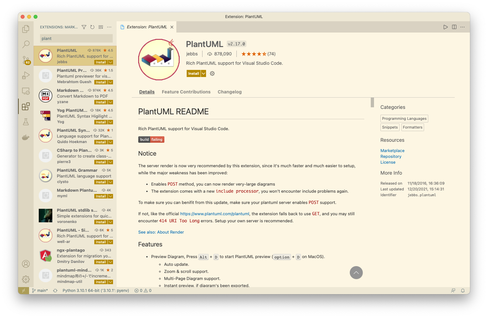
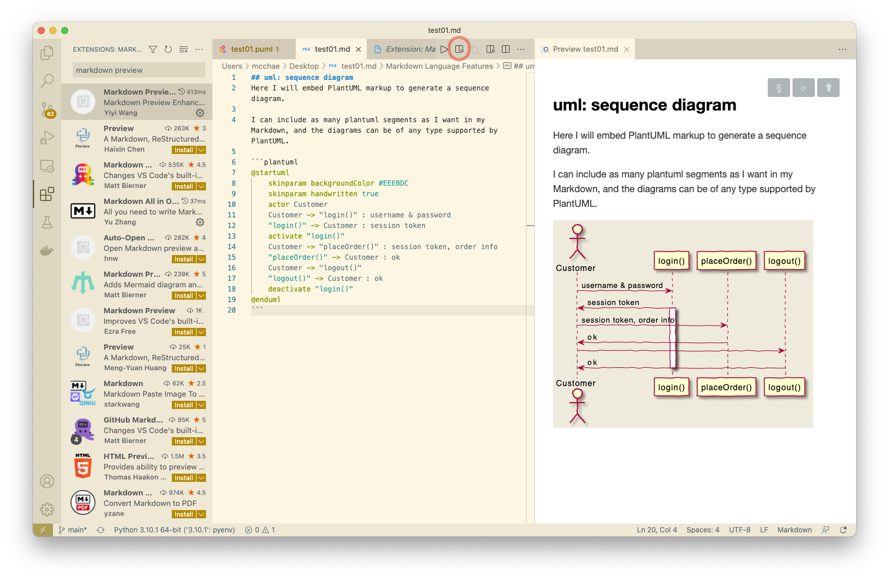
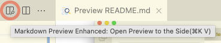
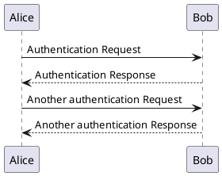
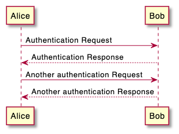
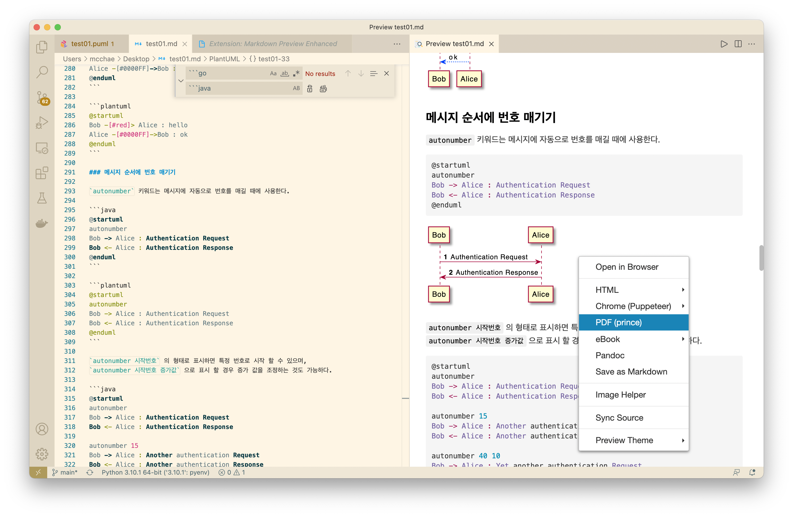
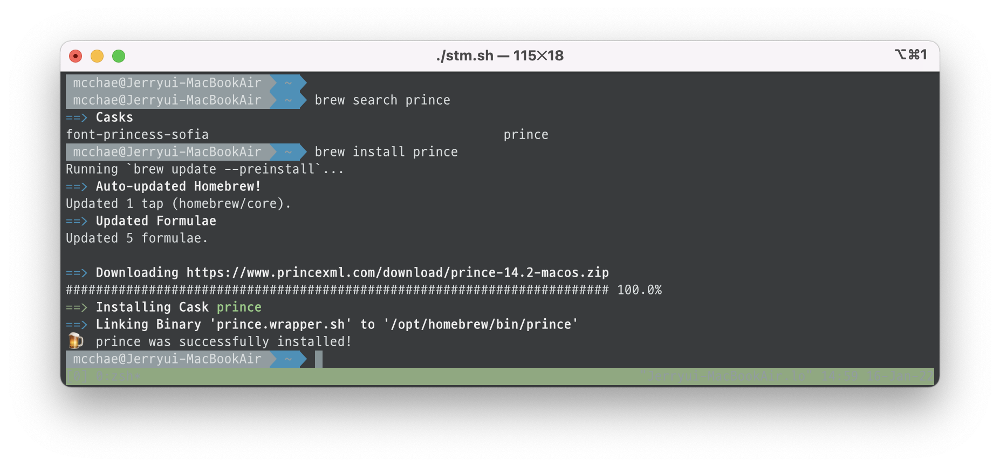
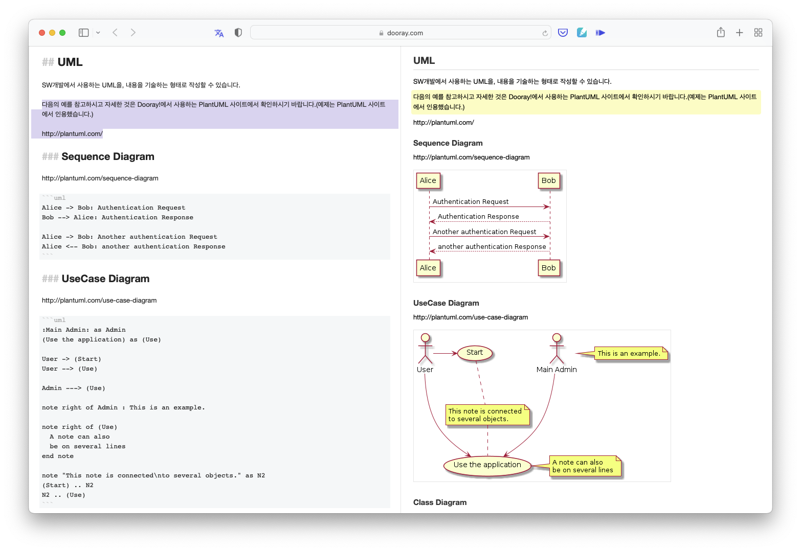

# PlantUML

[Plant UML](https://plantuml.com/ko/) 은 다이어그램을 빠르게 작성하기 위한 오픈 소스 프로젝트입니다. ([깃허브 저장소 위치](https://github.com/plantuml/plantuml))

일반적으로 UML 같은 표준 다이어그램은 그리는 방법 등을 정의해 놓고 그것을 실제로 그리는 소프트웨어는 다 경우마다 다릅니다.
다음은 몇 가지 UML 툴 또는 서비스를 보여줍니다.

* [Microsoft Visio](https://guru99.live/Z5V3Ur)
* [StarUML](http://staruml.io/)
* [Umbrello](https://umbrello.kde.org/)
* [UML Designer Tool](http://www.umldesigner.org/)

그 이외에도 수십가지 이상의 툴이나 서비스가 존재합니다.

문제는 어느 것 하나가 아주 모든 경우에 딱 원하는 다이어그램을 모두 그릴 수 없다는 것에 있습니다.
또한 개별 툴이나 서비스를 이용해야기에 필요에 따라 해당 프로그램을 설치하고 만들고 저장하고 개별로 관리해야하는 번거로움이 존재합니다.

그런 것에 비해 PlantUML의 경우 [Markdown](https://ko.wikipedia.org/wiki/마크다운) 과 유사하다 할 수 있겠습니다.
MS 워드를 비롯하여 드림위버 등과 같이 직접 HTML을 [위즈위그](https://ko.wikipedia.org/wiki/위지위그) 방식으로 편집하는 편집기가 많이 있지만 많은 개발자들 에게는 이런 마크다운이 훨씬 더 다루기 쉽고 관리하기 쉽고 수정하기 쉽게 느껴집니다.

이 PlantUML 역시 동일하다고 볼 수 있겠습니다. 비록 바로 GUI 기반의 객체나 요소 링크를 [위즈위그](https://ko.wikipedia.org/wiki/위지위그) 방식으로 만들 수는 없지만 간단하게 텍스트 기반으로 기술해 주면 그것이 훌륭하게 UML 다이어그램으로 결과가 나타납니다.

코딩을 좋아하는 개발자들은 별도 관리가 필요한 개별 툴 보다는 이런 방식의 다이얼로그 생성을 더 좋아할 수 있습니다.

중요한 것은 이 PlantUML을 작성하고 결과를 바로 바로 확인할 수 있는 마크다운 에디터 같은 것이 있어야 하는데 그것을 [Visual Studio Code](https://code.visualstudio.com)로 할 수 있습니다. IDE로 유명한 [JetBrains](https://www.jetbrains.com)의 많은 언어 별 플랫폼 별 IDE가 존재합니다.
하지만 최근의 개발 추세와 같이 [MSA](https://wooaoe.tistory.com/57) 아키텍쳐 개발 방법 및 그에 따른 [폴리글랏](https://sungjk.github.io/2018/06/10/polyglot-programming.html) 이라는 다양한 언어를 하나의 프로젝트에 이용하는 것은 어찌보면 현재는 지극히 당연한 것으로 보이는데 거기에 제일 잘 부합하는 IDE가 바로 VSCode 라는데는 의심의 여지가 없습니다.
이런 하나의 IDE 환경에 PlantUML과 같은 문서도 가능하다면, 정말 진정 막강한 하나의 IDE (통합 개발 환경)을 넘어선 IPE (통합 프로젝트 환경) 이 되지 않을까 싶네요.

## PlantUML을 편집하고 결과를 볼 수 있는 환경

### VSCode 이용하는 방법
[Visual Studio Code](https://code.visualstudio.com)를 이용하여 PlantUML을 편집하고 보는 방법입니다.
VSCode가 이미 설치되었다고 가정합니다. 

VSCode 에서 핵심은 [확장](https://code.visualstudio.com/docs/editor/extension-marketplace)에 있다고 생각합니다.
새로운 언어가 등장했을 때 별도 IDE를 또 만들어야 하는 부담감 없이 VSCode에 확장으로 간단히 추가할 수 있기 때문입니다.
그 뿐만 아니라 PlantUML 등을 비롯한 수많은 확장이 지금 이 시간에도 계속해서 늘어나고 있습니다.


위와 같이 확장에서 `PlantUML` 이라 검색하여 위와 같은 확장을 설치합니다.


사용 방법은 `.md` 마크다운 확장자를 가진 일반 마크다운 파일을 만들어 편집을 합니다. 


마크다운 편집창의 우측 상단에 `Markdown Preview Enhanced` 아이콘 을 눌러 위의 캡쳐 이미지와 같이 우측에 UML 다이어그램을 포함한 마크다운의 HTML 결과를 실시간으로 확인할 수 있는 창이 나타납니다.

보통 마크다운 편집에서 코드를 표현하려면,

````
```python
import sys
sys.stdout.write('Hello world.')
```
````
라고 합니다만, PlantUML을 위해서 `plantuml` 이라고 주면 됩니다.

````

````

그러면 우측 `마크다운 프리뷰` 화면에는 다음과 같은 다이얼로그를 보실 수 있습니다.



또한 `마크다운 프리뷰` 화면에서 마우스 오른쪽 단추를 이용하여 HTML 결과 혹은 PDF 결과로 출력할 수도 있습니다. 다만 PDF 출력을 위해서는 `prince`라는 툴을 설치해야 하는데, Mac 에서는 다음과 같이 설치가 가능합니다.

```sh
brew install prince
```


> 윈도우나 리눅스에는 다른 상황일 수 있으나 검색해 보면 쉽게 동일 결과를 얻을 수 있을 것입니다.

### 두레이 UML을 이용하는 방법
[두레이](https://dooray.com/home/)는 [NHN](https://www.nhn.com/ko/index.nhn)에서 개발한 올인원 통합 협업 플랫폼 입니다.

두레이 역시 마크다운이나 code 등을 잘 지원하며 UML 출력 역시 동일한 PlantUML 엔진을 사용하고 있습니다. 따라서 VSCode와 더불어 UML을 포함한 마크다운 문서를 만들고 결과를 확인할 수 있는 좋은 툴이 될 수 있습니다.


위의 내용은 [두레이 사용 설명서](https://dooray.com/htmls/guides/markdown_ko_KR.html) 중 UML을 살펴본 것입니다.

다음은 각 섹션 별로 개별 UML 다이어그램을 만드는 것을 확인해 보겠습니다.

## 표준 UML
### 시퀀스 다이어그램
[시퀀스 다이어그램 설명](PlantUML-01-Sequence%20Diagram.md)

### 유즈케이스(Use Case) 다이어그램
[유즈케이스(Use Case) 다이어그램 설명](PlantUML-02-UseCase%20Diagram.md)

### 클래스 다이어그램
[클래스 다이어그램 설명](PlantUML-03-Class%20Diagram.md)

### ER(실체 관계, Entity Relationship) 다이어그램
[ER(실체 관계, Entity Relationship) 다이어그램 설명](PlantUML-21-Entity%20Relationship%20Diagram.md)

### 객체 다이어그램
[객체 다이어그램 설명](PlantUML-04-Object%20Diagram.md)

### 활동 다이어그램
[활동 다이어그램 설명](PlantUML-05-Activity%20Diagram.md)

### 컴포넌트 다이어그램
[컴포넌트 다이어그램 설명](PlantUML-06-Component%20Diagram.md)

### 배포 다이어그램
[배포 다이어그램 설명](PlantUML-07-Deployment%20Diagram.md)

### 상태 다이어그램
[상태 다이어그램 설명](PlantUML-08-State%20Diagram.md)

## 아키메이트 다이어그램
[아키메이트 다이어그램 설명](PlantUML-14-Archimate%20Diagram.md)

## 마인드맵 다이어그램
[마인드맵 다이어그램 설명](PlantUML-18-MindMap.md)

## 작업 명세 구조 (WBS) 다이어그램
[작업 명세 구조 (WBS) 다이어그램 설명](PlantUML-19-Work%20Breakdown%20Structure.md)

## 부가 다이어그램
### 와이어프레임 다이어그램
[와이어프레임 다이어그램 설명](PlantUML-13-WireFrame.md)

### 네트워크 다이어그램
[네트워크 다이어그램 설명](PlantUML-12-NetworkDiagram.md)

### JSON 데이터 그리기
[JSON 데이터 그리기 설명](PlantUML-10-JSON%20Data.md)

### YAML 데이터 그리기
[YAML 데이터 그리기 설명](PlantUML-11-YAML%20Data.md)

## 간트 차트 다이어그램
[간트 차트 다이어그램 설명](PlantUML-17-Gantt%20Diagram.md)

## 부록
### 하이퍼링크
[하이퍼링크 설명](PlantUML-31-Hyperlink.md)

### Creole
[Creole 설명](PlantUML-32-Creole.md)

### 스프라이트 아이콘
[스프라이트 아이콘 설명](PlantUML-33-Sprite%20Icons.md)
